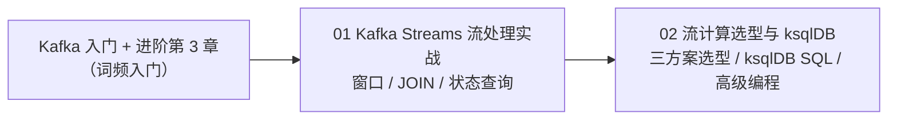

# Kafka Streams 流处理专题
> 📌 辅线定位：专为《教程/主线-SpringAI2.0-35 管数分离实战》补充流计算背景

本专题讲在消息流上做**有状态的实时计算**——窗口、JOIN、状态查询。是"Kafka 进阶实战"中 Kafka Streams 词频入门的深度展开。

| 顺序 | 文档 | 你将学到 |
|:---:|------|---------|
| **01** | Kafka Streams 流处理实战 | 批处理 vs 流处理；四种窗口（滚动/跳跃/滑动/会话）；KStream/KTable/GlobalKTable JOIN；状态存储与交互式查询；实时电商指标实战 |
| **02** | 流计算选型与 ksqlDB | Kafka Streams / Flink / ksqlDB 三方案选型；ksqlDB 实操（STREAM/TABLE/JOIN SQL）；Kafka Streams 高级编程（自定义状态存储、聚合优化、交互式查询 REST 化） |

**学习路线**：

> **前置**：理解 Kafka 的分区与消费组（这是 Streams 的地基），并写过 Kafka Streams 词频统计的入门程序。
>
> **适合谁**：要做实时仪表盘、实时风控、实时聚合的场景。简单收发消息用普通 Stream 即可。
