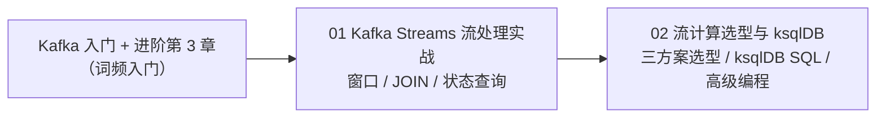

# Kafka Streams 流处理专题

本专题讲在消息流上做**有状态的实时计算**——窗口、JOIN、状态查询。是 [Kafka 进阶实战第 3 章](../Kafka消息队列实战专题/02-Kafka进阶实战.md) 的深度展开。

| 顺序 | 文档 | 你将学到 |
|:---:|------|---------|
| **01** | [Kafka Streams 流处理实战](./01-Kafka-Streams流处理实战.md) | 批处理 vs 流处理；四种窗口（滚动/跳跃/滑动/会话）；KStream/KTable/GlobalKTable JOIN；状态存储与交互式查询；实时电商指标实战 |
| **02** | [流计算选型与 ksqlDB](./02-流计算选型与ksqlDB.md) | Kafka Streams / Flink / ksqlDB 三方案选型；ksqlDB 实操（STREAM/TABLE/JOIN SQL）；Kafka Streams 高级编程（自定义状态存储、聚合优化、交互式查询 REST 化） |

**学习路线**：

> **前置**：[Kafka 消息队列从入门到架构师](../Kafka消息队列实战专题/01-Kafka消息队列从入门到架构师.md)（分区/消费组是 Streams 地基）+ [Kafka 进阶实战第 3 章](../Kafka消息队列实战专题/02-Kafka进阶实战.md)（Kafka Streams 词频入门）。
>
> **适合谁**：要做实时仪表盘、实时风控、实时聚合的场景。简单收发消息用普通 Stream 即可。
