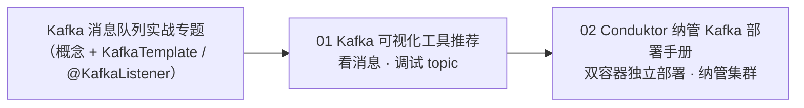

# Kafka 工具与运维专题

本文件夹收录 Kafka 的**工具与运维**类内容——不重复讲概念/API（那在 Kafka 消息队列实战专题里），这里只讲"**怎么看消息、怎么纳管集群**"。

| 顺序 | 文档 | 你将学到 |
|:---:|------|---------|
| **01** | Kafka 可视化工具推荐 | 用图形工具观察消息、调试 topic——开发排障利器 |
| **02** | Conduktor 纳管 Kafka 部署手册 | 用 Conduktor 纳管 Kafka 集群——进阶运维 |

**学习路线**：

> **建议**：先学 Kafka 消息队列实战专题（概念 + `KafkaTemplate`/`@KafkaListener` 收发），再按需回来读这里的工具/运维。
