# Spring Kafka 进阶实战（从 Kafka 零基础到流式架构师）

> **这份文档是什么**：**直接用 Spring Kafka（`spring-boot-starter-kafka`）** 的**进阶续篇**——手写 `KafkaTemplate` 发、`@KafkaListener` 收。前一篇 [01-Kafka消息队列从入门到架构师](./01-Kafka消息队列从入门到架构师.md) 带你入门**直接 Kafka**，这一篇带你进入**生产调优、流式计算、响应式真相、事件驱动架构**——达到真正的架构师水平。
>
> **写给谁**：**Kafka 零基础也能读**。你说"Kafka 也没学过"——没关系，本文第 1 章专门为你补 Kafka 地基，后面所有高级用法都建立在这个地基上。读完你能分清"哪些是 Kafka 的概念、哪些是 Spring Kafka 客户端的 API"，不会再混淆。
>
> **和 01 篇的关系（别困惑）**：[01 入门篇](./01-Kafka消息队列从入门到架构师.md) 教的是**直接用 `spring-boot-starter-kafka`（KafkaTemplate / @KafkaListener）从零入门**。**本文是它的进阶**：更深的 Kafka 地基、生产调优、Kafka Streams、背压、EDA 设计。两者都是直接 Kafka 路线（不用 Stream 抽象），01 打底、本文往上走。
>
> **前置要求**：先读完 [01 入门篇](./01-Kafka消息队列从入门到架构师.md) 的 0-5 章（至少知道 **topic / 分区 / offset / 消费组** 这些 Kafka 地基概念）。01 的函数式 API 不是本篇前置——本篇用的是更直接的 `KafkaTemplate` + `@KafkaListener`。
>
> **版本前提（已校验）**：基于 **Spring Boot 4.1.0**，依赖只用 **`spring-boot-starter-kafka`**（版本由 Boot 的 BOM 托管，不写版本号）。**纯 Kafka 场景不需要 Spring Cloud BOM、不需要 Spring Cloud Stream**——直接 Kafka 里没有 Binder/Binding/Destination 那层抽象。**重要：2025 年 5 月 Spring 官方宣布 `reactor-kafka` 停止维护、Spring Cloud Stream 的响应式 Kafka Binder 废弃**——本文第 4 章会专门讲这件事，并给出官方推荐替代方案。所有 API 已对照官方文档校验。

---

## 目录

- [进阶 第 1 章：Kafka 核心概念补全（零基础地基）](#进阶-第-1-章kafka-核心概念补全零基础地基)
- [进阶 第 2 章：Spring Kafka 生产调优实战](#进阶-第-2-章spring-kafka-生产调优实战)
- [进阶 第 3 章：Kafka Streams——流式计算](#进阶-第-3-章kafka-streams流式计算)
- [进阶 第 4 章：响应式、背压，以及为什么阻塞 listener 就够了](#进阶-第-4-章响应式背压以及为什么阻塞-listener-就够了)
- [进阶 第 5 章：事件驱动架构（EDA）——架构师设计思维](#进阶-第-5-章事件驱动架构eda架构师设计思维)
- [进阶 附录：进阶 API 校验表与踩坑](#进阶-附录进阶-api-校验表与踩坑)

---

## 进阶 第 1 章：Kafka 核心概念补全（零基础地基）

> 你用 `spring-boot-starter-kafka` 时，底层就是 Kafka 本体（kafka-clients）。不懂透 Kafka 就调优 Spring Kafka，等于盲人摸象。这一章用最短篇幅把 Kafka 的**必须懂的概念**讲透。**注意分清：哪些是 Kafka 自有的（换 RabbitMQ 就不一样），哪些只是 Spring Kafka 客户端 API（`KafkaTemplate` / `@KafkaListener` / `spring.kafka.*`）。**

> **和入门篇的关系**：[01 入门篇第 6 章](./01-Kafka消息队列从入门到架构师.md) 让你"能用"——讲了 topic/分区/offset 在 Spring Kafka 里怎么配、怎么用。**本章从更深的视角**把它们讲透——为什么有分区、offset 的 at-least-once 怎么来的、副本怎么保高可用。**两者不矛盾**：01 是"怎么用"，本章是"为什么底层是这样"。如果你只想调优和理解原理，本章是地基。

### 1.1 Kafka 是什么——一句话和一个比喻

**Kafka 是一个分布式、持久化、高吞吐的消息日志系统。**

比喻：把 Kafka 想成一个**无限追加的日志本**（像 git log）。生产者往里**追加**事件，消费者**从任意位置读**。事件一旦写入就不改（除非过期删除），多个消费者可以各自独立地读同一份日志。

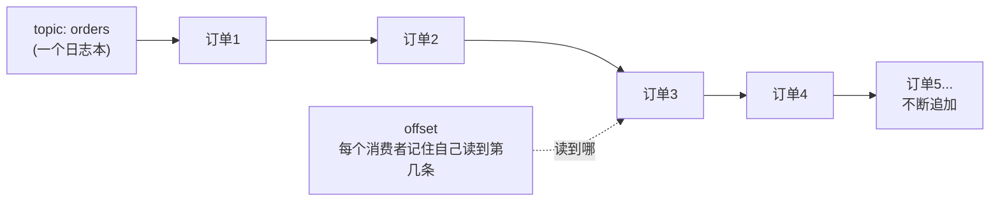

### 1.2 Topic（主题）——消息的分类

**Topic 是 Kafka 里消息的逻辑分类**。比如 `orders`（订单）、`payments`（支付）、`shipments`（发货）各是一个 topic。生产者指定发到哪个 topic，消费者指定从哪个 topic 读。

> **在 Spring Kafka 里**：没有 `destination` 这层映射。**topic 名就是你在代码里写的字符串**——`kafkaTemplate.send("orders", key, value)` 发的就是 `orders` 这个 topic；`@KafkaListener(topics = "orders")` 收的也是它。**想用一个常量集中管理 topic 名**，避免到处写字符串。

### 1.3 Partition（分区）——并行与保序的关键 ⭐

**这是 Kafka 最重要、也最容易不懂的概念。** 一个 topic 被切成多个 **partition**（分区），就像一本日志被拆成几本子日志：

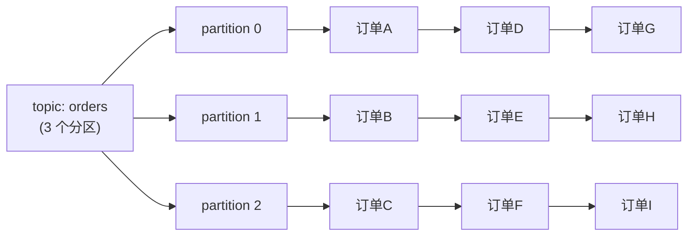

**分区有两个核心意义**：

#### ① 并行
一个 partition 同一时间只能被**一个消费者**（同消费组内）消费。所以：
- topic 有 3 个分区 → 一个消费组最多 3 个消费者能并行干活（多了的消费者闲置）。
- **想提高消费并行度？先加分区**。

#### ② 保序 ⭐
**同一个 partition 内，消息严格有序**（按写入顺序）。但**不同 partition 之间不保证顺序**。

所以如果你要"同一笔订单的 创建→支付→发货 事件按顺序处理"，必须让它们进**同一个 partition**——用 **key** 实现：**相同 key 的消息一定进同一个 partition**（Kafka 按 key 哈希分区）。

```java
import org.springframework.kafka.core.KafkaTemplate;

// ▼ 生产时指定 key（如 orderId）——这是直接 Kafka 最常用的写法
kafkaTemplate.send("orders", orderId, eventJson);
// 同一 orderId 的所有事件 → 同一 partition → 有序
```

> **在 Spring Kafka 里**：`kafkaTemplate.send(topic, key, value)` 的 **key 就是 Kafka 的 key**，底层就是这个哈希分区机制。没有抽象层帮你"隐藏"它——**key 选得好不好，直接决定你的顺序性保证**。

### 1.4 Offset（位移）——消费进度

每个分区里的每条消息有个**单调递增的编号**叫 offset（0, 1, 2, ...）。消费者读完一条，把"我读到哪了"（offset）记下来（提交，commit）。重启后从上次提交的 offset 续读。

- **自动提交**：`spring.kafka.consumer.enable-auto-commit`（默认 `true`）让消费者定期自动提交（默认每 5 秒）。简单，但可能"处理了但没提交就崩了"→ 重启重复消费；或"没处理完就提交了"→ 崩了丢消息。
- **手动提交**：`enable-auto-commit=false` + 在 `@KafkaListener` 里注入 `Acknowledgment`，处理完再 `acknowledgment.acknowledge()`。精确，但要自己管。

> **核心结论**：Kafka 默认是 **at-least-once（至少一次）**——同一条消息**可能被消费多次**（比如处理成功、提交 offset 前崩溃）。所以**消费者必须幂等**。这是铁律，不懂这个，上线必出数据错误。

### 1.5 Consumer Group（消费组）——负载均衡 vs 发布订阅

一个消费组是**一组共同消费某些 topic 的消费者**。机制（01 入门篇 5.2 讲过，这里补 Kafka 视角）：

- **同组**：一个 partition 只被组内**一个**消费者消费 → 负载均衡。
- **不同组**：每组**各自独立**收到全量消息 → 发布订阅。

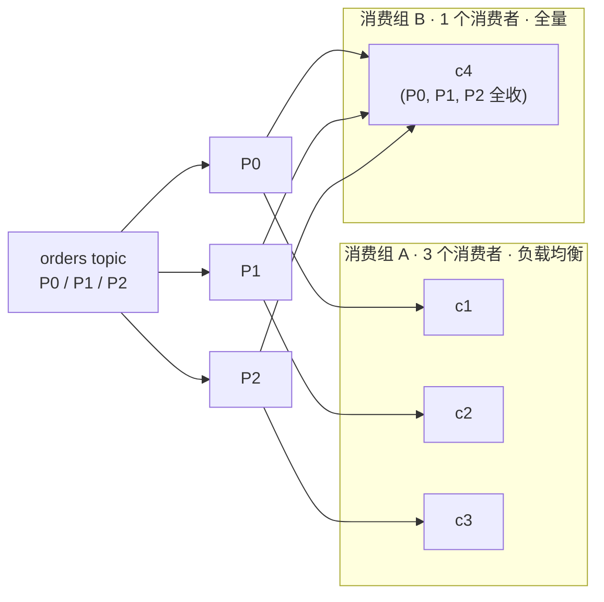

组 A 三个消费者分担（负载均衡）；组 B 一个消费者全收（它可能是做全量备份/分析的）。

> **在 Spring Kafka 里**：`@KafkaListener(topics = "orders", groupId = "billing")` 的 **groupId 就是消费组名**。同一个 groupId 的多个实例会分分区；不同 groupId 各自全量收。

### 1.6 Replica（副本）与 ISR——高可用

生产环境 Kafka 每个 partition 有**多个副本**（replica），分布在不同的 broker（Kafka 服务器）上。其中一个是 **leader**（读写都走它），其他是 **follower**（同步 leader 的数据）。leader 挂了，从 follower 里选一个新的当 leader。

**ISR（In-Sync Replicas，同步副本集合）**：跟得上 leader 的副本们。生产者可以配 `acks=all`（所有 ISR 副本确认才算成功）——这是**最强不丢消息**的配置。

> **这层你一般不用管**——是 Kafka 运维的事。但架构师要知道：**Kafka 的可靠性来自副本 + acks=all**。第 2 章会教你用 `spring.kafka.producer.acks=all` 把它配出来。

### 1.7 一张图总结 Kafka 结构

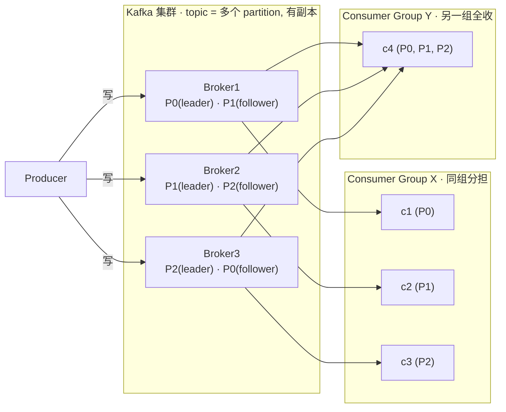

**分清边界**（这张表请你背下来）：

| 概念 | 是 Kafka 的 | 是 Spring Kafka 客户端的 |
|------|:-----------:|:------------------------:|
| topic / partition / offset / 消费组 / 副本 / ISR | ✅ | |
| KafkaTemplate / @KafkaListener / spring.kafka.* / groupId | | ✅ |

Kafka 的概念**换了中间件（如 RabbitMQ）就不一样**（RabbitMQ 没有 partition，用 exchange/queue/binding 路由）；Spring Kafka 客户端 API 只是**操作 Kafka 的方式**，换中间件就得换客户端。**架构师必须能在脑子里分清"消息系统的概念"和"客户端的 API"这两层。**

### 本章 checkpoint ✅

- 能说出"topic 有几个分区 → 一个消费组最多几个消费者并行"。
- 能说出"为什么相同 key 的消息一定有序"（同 partition）。
- 能说出"at-least-once 是哪来的，消费者为什么要幂等"。
- 能用 `kafkaTemplate.send(topic, key, value)` 和 `@KafkaListener(topics=..., groupId=...)` 各写一个最小收发。

---

## 进阶 第 2 章：Spring Kafka 生产调优实战

01 入门篇讲了"能跑"。这一章讲"**生产环境怎么调好**"。这些都是真实项目里会踩的坑。

> **技术栈**：`spring-boot-starter-kafka`（Boot 4.1.0 托管版本，不写版本号）。所有配置都在 `spring.kafka.*` 下。

### 2.1 生产者：消息发出去到底成功了没？

默认 `kafkaTemplate.send()` 是**异步**的——方法返回一个 `CompletableFuture`，消息可能还没真正到 broker。如果发完就不管，可能"消息丢了你还不知道"。

**生产级配置**：

```yaml
spring:
  kafka:
    producer:
      acks: all                  # ▼ 所有 ISR 副本确认才算成功（最强不丢）
      retries: 3                 # ▼ 发送失败重试次数
      # 吞吐调优（可选）
      # batch-size: 16384        # 攒一批再发（字节）
      # linger-ms: 5             # 等 5ms 凑批，吞吐更高
```

- `acks: all`：所有同步副本确认。**不丢消息的基石**。
- `retries: 3`：瞬时故障自动重试。
- 默认异步：吞吐高，但你要自己处理失败（看返回的 future）。

**同步发送（关键消息要等结果）**：`send()` 返回 `CompletableFuture<SendResult<K,V>>`，要同步就 `.get()` 阻塞等待：

```java
import org.springframework.kafka.core.KafkaTemplate;
import org.springframework.kafka.support.SendResult;
import java.util.concurrent.CompletableFuture;
import java.util.concurrent.TimeUnit;

@Service
public class OrderProducer {

    private final KafkaTemplate<String, String> kafkaTemplate;

    public OrderProducer(KafkaTemplate<String, String> kafkaTemplate) {
        this.kafkaTemplate = kafkaTemplate;
    }

    public void sendOrder(Order order) throws Exception {
        CompletableFuture<SendResult<String, String>> future =
                kafkaTemplate.send("orders", order.getId(), toJson(order));

        // ▼ 方式一：同步等 broker 确认（可靠但慢，适合订单等关键消息）
        future.get(10, TimeUnit.SECONDS);

        // ▼ 方式二：异步 + 回调（吞吐高，适合日志等非关键消息）
        // future.whenComplete((result, ex) -> {
        //     if (ex == null) {
        //         log.info("发送成功 offset={}", result.getRecordMetadata().offset());
        //     } else {
        //         log.error("发送失败", ex);
        //     }
        // });
    }
}
```

> **注意**：`spring-boot-starter-kafka` 自动配置了一个 `KafkaTemplate<String, String>` 注入给你。**没有 StreamBridge**——发消息就是这个 `kafkaTemplate.send()`，简单直接。

### 2.2 消费者并发：怎么吃满多分区

topic 有 6 个分区，但你的消费者实例只用了 1 个线程？白白浪费 5 个分区的并行能力。

**在 `@KafkaListener` 上配 `concurrency`**：

```java
import org.springframework.kafka.annotation.KafkaListener;

@Component
public class BillingConsumer {

    // ▼ 每个 listener 开 3 个消费线程（也可以走全局 spring.kafka.listener.concurrency）
    @KafkaListener(topics = "orders", groupId = "billing", concurrency = "3")
    public void onOrder(String orderJson) {
        // 处理...
    }
}
```

或在配置里全局配：

```yaml
spring:
  kafka:
    listener:
      concurrency: 3     # ▼ 所有 listener 默认并发线程数
```

`concurrency` = 单实例内的消费线程数。**总并行度 = min(实例数 × concurrency, 分区数)**。规则：
- 分区数 6，3 个实例各 `concurrency: 2` → 6 个消费者刚好吃满。
- `concurrency` 超过分区数 → 多余线程闲置。

### 2.3 offset 重置策略：新消费组从哪开始读

一个**新的消费组**第一次读某 topic，从哪开始？由 `auto-offset-reset` 决定：

```yaml
spring:
  kafka:
    consumer:
      auto-offset-reset: earliest   # ▼ earliest=从头读历史；latest=只读新消息（默认）
      enable-auto-commit: false     # ▼ 手动 ack（要精确控制时）
    listener:
      ack-mode: manual_immediate    # ▼ 配合 enable-auto-commit=false：处理完手动 ack
```

- `earliest`：从头读。**新服务上线想处理历史消息时用**。
- `latest`：只读启动后的新消息。**默认，多数场景用这个**。

> **坑**：很多人重启服务发现"历史消息又消费了一遍"——因为换了消费组名 + `earliest`。**生产环境固定消费组名**。

### 2.4 消息头（Headers）与内容协商

消息不只是 payload，还能带**头信息**（header）。直接 Kafka 里用 `ProducerRecord` 的 headers：

```java
import org.apache.kafka.clients.producer.ProducerRecord;
import org.springframework.kafka.core.KafkaTemplate;
import java.nio.charset.StandardCharsets;

// ▼ 发送时带头信息
ProducerRecord<String, String> record = new ProducerRecord<>("orders", order.getId(), toJson(order));
record.headers().add("eventType", "OrderCreated".getBytes(StandardCharsets.UTF_8));
record.headers().add("version", "v2".getBytes(StandardCharsets.UTF_8));
kafkaTemplate.send(record);
```

接收时用 `ConsumerRecord<String, String>` 读：

```java
import org.apache.kafka.clients.consumer.ConsumerRecord;
import org.apache.kafka.common.header.Header;
import org.springframework.kafka.annotation.KafkaListener;
import java.nio.charset.StandardCharsets;

@KafkaListener(topics = "orders", groupId = "billing")
public void onOrder(ConsumerRecord<String, String> record) {
    Header eventTypeHeader = record.headers().lastHeader("eventType");
    String eventType = eventTypeHeader == null
            ? "unknown"
            : new String(eventTypeHeader.value(), StandardCharsets.UTF_8);
    String payload = record.value();          // ▼ 消息体（我们约定存 JSON 字符串）
    // 按 eventType 分发处理...
}
```

**内容协商（Content-Type Negotiation）**：直接 Kafka 用 StringSerializer/StringDeserializer 时，payload 就是 JSON 字符串，序列化/反序列化你用 `ObjectMapper` 自己管（或配 `JsonSerializer`/`JsonDeserializer`，见 2.5）。**没有 Stream 的 content-type 头自动协商**——这是"直接 Kafka"少掉的一层糖，换来的是完全可控。

### 2.5 自定义序列化（Serde）

默认 JSON 够用。但有时你要自定义（如用 Avro/Protobuf 省带宽、对接已有格式）——直接在配置里指定 Serializer/Deserializer 类：

```yaml
spring:
  kafka:
    producer:
      key-serializer: org.apache.kafka.common.serialization.StringSerializer
      value-serializer: com.example.AvroOrderSerializer      # ▼ 自定义
    consumer:
      key-deserializer: org.apache.kafka.common.serialization.StringDeserializer
      value-deserializer: com.example.AvroOrderDeserializer  # ▼ 自定义
```

> **JSON POJO 直收**：如果你想让 `@KafkaListener` 直接收 `Order` 而不是 `String`，可以用 Spring 的 `JsonDeserializer`：
> ```yaml
> spring:
>   kafka:
>     consumer:
>       value-deserializer: org.springframework.kafka.support.serializer.JsonDeserializer
>       properties:
>         spring.json.trusted.packages: "*"          # ▼ 信任要反序列化的包
> ```
> 然后把 `@KafkaListener` 入参写成 `Order` 即可。

> **新手建议**：先用 String + ObjectMapper 手动转，**真有性能/兼容需求再上 Avro/Protobuf**。别一上来就过度设计。

### 2.6 重试与死信（DLQ）——直接 Kafka 的答案

生产里"处理失败"是常态。直接 Kafka 的官方答案是 **spring-kafka 的非阻塞重试 + DLT（死信 topic）**——`@RetryableTopic` 注解：

```java
import org.springframework.kafka.annotation.DltHandler;
import org.springframework.kafka.annotation.KafkaListener;
import org.springframework.kafka.annotation.RetryableTopic;
import org.springframework.kafka.retrytopic.TopicSuffixingStrategy;
import org.springframework.kafka.support.KafkaHeaders;
import org.springframework.messaging.handler.annotation.Header;

@Component
public class BillingConsumer {

    // ▼ @RetryableTopic：失败自动重试，重试耗尽后投到死信 topic
    @RetryableTopic(
        topics = "orders",
        attempts = "4",                     // ▼ 1 次原始 + 3 次重试
        topicSuffixingStrategy = TopicSuffixingStrategy.SUFFIX_WITH_INDEX_VALUE)
    @KafkaListener(topics = "orders", groupId = "billing")
    public void onOrder(String orderJson) {
        // 处理，抛异常就触发重试
    }

    // ▼ 重试耗尽后，最终消息到死信 topic（orders-dlt），这里兜底记录/告警
    @DltHandler
    public void onDlt(String orderJson,
                      @Header(KafkaHeaders.RECEIVED_TOPIC) String topic,
                      @Header(KafkaHeaders.EXCEPTION_MESSAGE) String error) {
        log.error("订单消息进死信：topic={}, error={}, payload={}", topic, error, orderJson);
        // 落库告警，人工/定时任务补偿
    }
}
```

**重试 + 死信链路**：

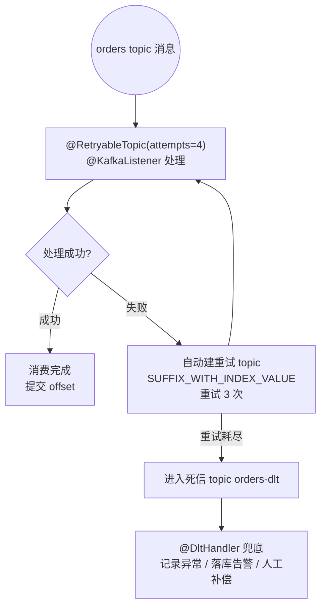

> **直接 Kafka 的重试/死信就是这一套**：`@RetryableTopic`（自动建重试 topic）+ `@DltHandler`（死信兜底）。相比 Stream 的死信，这里是**注解驱动、零配置绑定**，更贴近 Kafka 本体。

### 2.7 可观测性（Observability）——别在线上瞎猜

`spring-boot-starter-kafka` + Actuator 会自动暴露 Kafka 的生产者/消费者/Streams 指标（Micrometer，`kafka_*` 前缀）。加一个依赖：

```xml
<dependency>
    <groupId>org.springframework.boot</groupId>
    <artifactId>spring-boot-starter-actuator</artifactId>
</dependency>
```

再在配置里打开：

```yaml
management:
  endpoints:
    web:
      exposure:
        include: health,metrics,prometheus
```

看这些指标就知道链路有没有问题：
- `kafka_consumer_fetch_manager_records_consumed_total`：消费速率。
- `kafka_consumer_fetch_manager_records_lag`：**消费积压（lag）——生产必盯的指标**。
- `kafka_producer_record_send_total` / `kafka_producer_record_error_total`：发送量/错误量。
- `kafka_consumer_coordinator_join_rate`：加入消费组频率（异常重平衡会飙升）。

> **生产铁律**：lag 是 Kafka 消费者的"体检报告"。**lag 持续上涨 = 消费追不上生产**，先看 2.2 的并发是不是没吃满分区。

### 本章 checkpoint ✅

- 配了 `acks: all`，知道 `send()` 的 future 怎么同步等待/异步回调。
- 能用 `@KafkaListener(concurrency="3")` 吃满分区。
- 知道 `auto-offset-reset` 的 earliest/latest 区别、消费组名要固定。
- 能用 `@RetryableTopic` + `@DltHandler` 搭出重试 + 死信链路。
- 知道用 lag 指标盯积压。

---

## 进阶 第 3 章：Kafka Streams——流式计算

这是进阶的**高价值章节**。前面所有章节都是"**搬**消息"（收发），这一章是"**算**消息"（实时计算）。

### 3.1 流式计算 vs 普通消息：什么时候用

普通消息（前面学的 `@KafkaListener`）：来一条处理一条，**无状态**（这条和上一条无关）。

**流式计算**：在消息流上做**有状态的连续计算**——比如：
- "每分钟统计各商品的订单量"（窗口聚合）
- "订单流 JOIN 用户流，算每个订单的实时用户画像"（流 JOIN）
- "同一用户 1 秒内下了 10 单 → 告警欺诈"（模式匹配）

这些用普通消息 + 自己查 DB 也能做，但**数据量大时扛不住**（每条都查 DB 太慢）。Kafka Streams 把"状态"放在本地（用 RocksDB），快得多。

**Kafka Streams 是 Apache Kafka 自带的流处理库**。Spring Kafka（`spring-kafka`）原生支持它——不需要任何额外框架，加一个 `kafka-streams` 依赖 + `@EnableKafkaStreams` 就能用。

### 3.2 两个核心抽象：KStream 和 KTable

- **KStream**：**事件流**。每条消息是一个独立事件（如"用户点击了一下"）。可以理解为一串记录。
- **KTable**：**状态表**。每条消息是"某个 key 的**最新状态**"（如"用户当前余额"）。同 key 新消息**覆盖**旧消息——像数据库表。

**举例**：
- `KStream<userId, ClickEvent>`：用户每次点击都是一条。点了 10 次有 10 条。
- `KTable<userId, Balance>`：用户余额。改了 10 次只有最新那 1 条（状态）。

**KStream vs KTable 的对比**：

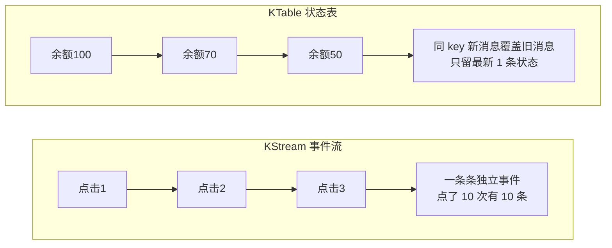

### 3.3 第一个 Kafka Streams 程序：词频统计

经典例子：读入一段段文字，统计每个词出现了多少次。

#### 3.3.1 依赖

`spring-boot-starter-kafka` 里带 `spring-kafka`（含 `@EnableKafkaStreams`），但 **Kafka Streams 本体要单独加**（Boot 4.1.0 BOM 托管，不写版本号）：

```xml
<dependency>
    <groupId>org.springframework.boot</groupId>
    <artifactId>spring-boot-starter-kafka</artifactId>
</dependency>
<!-- ▼ Kafka Streams 本体（spring-boot-starter-kafka 不带它） -->
<dependency>
    <groupId>org.apache.kafka</groupId>
    <artifactId>kafka-streams</artifactId>
</dependency>
```

#### 3.3.2 拓扑：一步步搭出来（别急着看完整版）

Kafka Streams 的代码是一串**链式调用**。新手直接看完整版会懵，所以我们**分三步**，每步只加一个操作。下面三步是三个可独立跑的拓扑示例，**学的时候一次只留一个 `@Bean` 方法**（或把 topic 换成不同的）。

---

**第 1 步：最简单的——读入流，原样输出（KStream → KStream）**

先不管统计，就做最简单的事：读一条消息，处理一下，输出。让你先熟悉"KStream 长什么样"。

```java
import org.apache.kafka.common.serialization.Serdes;
import org.apache.kafka.streams.StreamsBuilder;
import org.apache.kafka.streams.kstream.Consumed;
import org.apache.kafka.streams.kstream.KStream;
import org.apache.kafka.streams.kstream.Produced;
import org.springframework.context.annotation.Bean;
import org.springframework.context.annotation.Configuration;
import org.springframework.kafka.annotation.EnableKafkaStreams;

@Configuration
@EnableKafkaStreams                     // ▼ 开启 Kafka Streams 支持
public class WordCountProcessor {

    @Bean
    public KStream<String, String> echoUpper(StreamsBuilder builder) {
        // ▼ 从 topic "text-input" 读入 KStream<String,String>（key=String, value=String）
        KStream<String, String> input = builder.stream(
                "text-input",
                Consumed.with(Serdes.String(), Serdes.String()));

        // ▼ mapValues：只变换每条消息的 value（不碰 key），把文字转大写
        KStream<String, String> upper = input.mapValues(value -> value.toUpperCase());

        // ▼ 写到 topic "upper-output"
        upper.to("upper-output", Produced.with(Serdes.String(), Serdes.String()));

        return input;   // ▼ 返回 KStream，spring-kafka 会把它注册进拓扑
    }
}
```

**理解**：`KStream<String, String>` 就是"一条条 `(key, value)` 消息组成的流"。`.mapValues(...)` 对每条消息的 value 做变换，返回新流——和 Java Stream 的 `.map()` 一模一样的思维。**这一步你拿到了一个"会变换的流处理器"，但还不涉及状态。**

> 配置好 `spring.kafka.streams.application-id` 后跑一下：输入 `hello` → 输出 `HELLO`。先确认这个最简版能跑，再进下一步。

---

**第 2 步：加"拆分"——一行文字拆成多个单词（还是 KStream）**

现在加一个操作：把一行文字（如 `"hello world"`）拆成多个单词（`"hello"`、`"world"`），每条消息变多条。

```java
import org.apache.kafka.common.serialization.Serdes;
import org.apache.kafka.streams.StreamsBuilder;
import org.apache.kafka.streams.kstream.Consumed;
import org.apache.kafka.streams.kstream.KStream;
import org.apache.kafka.streams.kstream.Produced;
import org.springframework.context.annotation.Bean;
import org.springframework.context.annotation.Configuration;
import org.springframework.kafka.annotation.EnableKafkaStreams;
import java.util.Arrays;

@Configuration
@EnableKafkaStreams
public class WordCountProcessor {

    @Bean
    public KStream<String, String> splitWords(StreamsBuilder builder) {
        KStream<String, String> input = builder.stream(
                "text-input",
                Consumed.with(Serdes.String(), Serdes.String()));

        // ▼ flatMapValues：一条消息 → 多条消息（和 Stream.flatMap 同理）
        //   把 "hello world" 拆成 ["hello", "world"]，每个变成一条新消息
        KStream<String, String> words = input
                .flatMapValues(line -> Arrays.asList(line.toLowerCase().split("\\W+")));

        words.to("words-output", Produced.with(Serdes.String(), Serdes.String()));

        return input;
    }
}
```

**理解**：`.mapValues` 是"一对一"（一条变一条），`.flatMapValues` 是"一对多"（一条变多条）。输入 `"hello world"` 一条 → 输出 `"hello"`、`"world"` 两条。**这一步拿到了"把文字拆成单词流"的能力，但还没计数。**

> 你可能问：为啥不直接统计？因为**统计（count）需要先"分组"**——而分组需要每条消息有一个明确的 key。现在每条消息是"一个单词"，但还没有"以单词为 key"。所以要先分组。

---

**第 3 步：分组 + 计数——这才变成 KTable（词频统计完整版）**

加上"按单词分组"和"计数"，输出就从 KStream 变成了 KTable（状态表）：

```java
import org.apache.kafka.common.serialization.Serdes;
import org.apache.kafka.streams.StreamsBuilder;
import org.apache.kafka.streams.kstream.Consumed;
import org.apache.kafka.streams.kstream.Grouped;
import org.apache.kafka.streams.kstream.KStream;
import org.apache.kafka.streams.kstream.KTable;
import org.apache.kafka.streams.kstream.Materialized;
import org.apache.kafka.streams.kstream.Produced;
import org.springframework.context.annotation.Bean;
import org.springframework.context.annotation.Configuration;
import org.springframework.kafka.annotation.EnableKafkaStreams;
import java.util.Arrays;

@Configuration
@EnableKafkaStreams
public class WordCountProcessor {

    @Bean
    public KStream<String, String> wordCount(StreamsBuilder builder) {
        KStream<String, String> textStream = builder.stream(
                "text-input",
                Consumed.with(Serdes.String(), Serdes.String()));

        KTable<String, Long> counts = textStream
                // ① 拆单词（第 2 步学的）
                .flatMapValues(line -> Arrays.asList(line.toLowerCase().split("\\W+")))
                // ② 按"单词"分组：groupBy 把每条消息的 key 设为单词本身
                //    Grouped.with(组名, key的Serde, value的Serde) 告诉它怎么序列化
                .groupBy((key, word) -> word,
                         Grouped.with("word-count-group", Serdes.String(), Serdes.String()))
                // ③ 计数：每组数一下有几条 → KTable<单词, 次数>
                //    Materialized.as("word-counts") 把结果存到本地状态存储（起名 word-counts）
                .count(Materialized.as("word-counts"));

        // ▼ KTable 写回 topic：转成 KStream 再 .to()（changelog topic）
        counts.toStream().to("word-counts-output",
                             Produced.with(Serdes.String(), Serdes.Long()));

        return textStream;
    }
}
```

**三步合起来的流水线**（变换 → 分组 → 聚合，输出从 KStream 变成 KTable）：

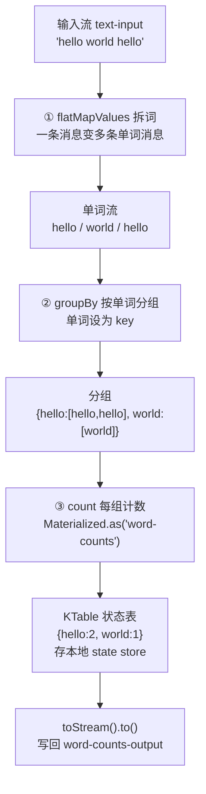

**两个新手必须懂的新东西**：
- **`groupBy`**：把流重新分组。**为什么分组才能计数？** 因为"计数"是"对同一组的东西数个数"——不分组就没有"组"的概念。`groupBy((key, word) -> word)` 的意思是"把每条消息重新归到'以单词为 key'的组里"。
- **`KTable`**：计数的结果不是"流"（一条条事件），而是"状态表"（每个单词的最新次数）。**流是过程，表是结果**。`Materialized.as("word-counts")` 给这个结果表起名并存到本地（RocksDB），崩溃后能恢复。

> **为什么强调三步走**：Kafka Streams 的所有程序都是这个套路——**变换（map/flatMap）→ 分组（groupBy）→ 聚合（count/aggregate）**。你只要理解这三步，90% 的 Streams 程序都能看懂。别被链式调用吓到，它就是这三步的组合。

#### 3.3.3 配置

```yaml
spring:
  kafka:
    streams:
      application-id: wordcount-app    # ▼ Kafka Streams 的 application.id（必配！不同于普通 group）
      properties:                      # ▼ 默认 Serdes（key/value 怎么序列化）
        default.key.serde: org.apache.kafka.common.serialization.Serdes$StringSerde
        default.value.serde: org.apache.kafka.common.serialization.Serdes$StringSerde
```

**几个必须懂的点**：
- `application-id`：Kafka Streams 的应用标识。**它兼做消费组名**（Streams 内部用 application.id 当 group.id）。不同 Streams 应用要不同 application-id。
- `default.key.serde` / `default.value.serde`：Serde = Serializer + Deserializer。告诉 Streams key 和 value 各怎么序列化。
- KTable 输出会写到一个 topic（changelog topic），可以再被别的消费者读。
- 输入 topic 没有 `binding` 映射——`builder.stream("text-input", ...)` 里的 `"text-input"` 就是真实 topic 名。

#### 3.3.4 跑起来验证

```bash
# 往 text-input 写文字
docker exec -it kafka kafka-console-producer --bootstrap-server localhost:9092 --topic text-input
> hello world hello kafka
> kafka streams hello

# 看结果（word-counts-output）
docker exec -it kafka kafka-console-consumer --bootstrap-server localhost:9092 \
  --topic word-counts-output --property print.key=true --property key.deserializer=org.apache.kafka.common.serialization.StringDeserializer
# 输出（每次新词/词频变化才输出）：
# hello 1
# world 1
# hello 2
# kafka 1
# kafka 2
# streams 1
# hello 3
```

> **KTable 输出的特性**：KTable 只在**状态变化**时往下游发（这叫"changelog"）。所以同一个词第 3 次出现，你看到的是"hello 3"（最新状态），不是又发一遍 "hello 1"。

### 3.4 状态存储（State Store）与交互式查询

`Materialized.as("word-counts")` 创建的本地状态表叫 **state store**。它不只是中间产物——你可以**直接查它**（Interactive Queries）：

```java
import org.apache.kafka.streams.state.QueryableStoreTypes;
import org.apache.kafka.streams.state.ReadOnlyKeyValueStore;
import org.springframework.kafka.config.KafkaStreamsInteractiveQueryService;
import org.springframework.web.bind.annotation.GetMapping;
import org.springframework.web.bind.annotation.PathVariable;
import org.springframework.web.bind.annotation.RestController;

@RestController
public class QueryController {

    private final KafkaStreamsInteractiveQueryService iqService;

    public QueryController(KafkaStreamsInteractiveQueryService iqService) {
        this.iqService = iqService;
    }

    @GetMapping("/count/{word}")
    public Long getCount(@PathVariable String word) {
        // ▼ 直接查本地 state store（不用查外部 DB！）
        ReadOnlyKeyValueStore<String, Long> store = iqService.getQueryableStore(
                "word-counts", QueryableStoreTypes.keyValueStore());
        Long count = store.get(word);
        return count == null ? 0L : count;
    }
}
```

**这就是流式计算的威力**：状态在本地内存/RocksDB，查询是毫秒级，不用查远程 DB。

### 3.5 聚合（aggregate）与窗口（Windowing）

`count` 是最简单的聚合。更通用的 `aggregate`：

```java
import org.apache.kafka.common.serialization.Serdes;
import org.apache.kafka.streams.StreamsBuilder;
import org.apache.kafka.streams.kstream.Consumed;
import org.apache.kafka.streams.kstream.Grouped;
import org.apache.kafka.streams.kstream.KStream;
import org.apache.kafka.streams.kstream.KTable;
import org.apache.kafka.streams.kstream.Materialized;
import org.apache.kafka.streams.kstream.Produced;
import org.springframework.context.annotation.Bean;
import org.springframework.kafka.annotation.EnableKafkaStreams;
import org.springframework.kafka.support.serializer.JsonSerde;

@EnableKafkaStreams
public class OrderAggregation {

    @Bean
    public KStream<String, Order> totalAmount(StreamsBuilder builder) {
        KStream<String, Order> orders = builder.stream(
                "orders",
                Consumed.with(Serdes.String(), new JsonSerde<>(Order.class)));

        KTable<String, Double> total = orders
                // 按用户分组
                .groupBy((key, order) -> order.getUserId(),
                         Grouped.with("user-group", Serdes.String(), new JsonSerde<>(Order.class)))
                // 聚合：累加金额
                .aggregate(
                    () -> 0.0,                                          // 初始值
                    (userId, order, acc) -> acc + order.getAmount(),    // 累加器
                    Materialized.with(Serdes.String(), Serdes.Double()) // 状态 Serde
                );

        total.toStream().to("user-total", Produced.with(Serdes.String(), Serdes.Double()));
        return orders;
    }
}
```

**时间窗口**（如"每 5 分钟的订单量"）：

```java
import org.apache.kafka.streams.kstream.TimeWindows;
import java.time.Duration;

// 按用户 + 5分钟窗口分组聚合
.groupBy((key, order) -> order.getUserId(), ...)
.windowedBy(TimeWindows.ofSizeWithNoGrace(Duration.ofMinutes(5)))
.count();
```

> **窗口是流式计算的高级特性**：处理"无界数据流"时，必须用窗口把无限流切成有限块来聚合。Kafka Streams 支持时间窗口（固定/滑动/会话）。新手先理解 `count`/`aggregate`，窗口遇到再学。

### 3.6 Kafka Streams vs 普通 @KafkaListener

| 维度 | 普通 @KafkaListener（前面学的） | Kafka Streams（本章） |
|------|------------------------------|----------------------|
| 编程模型 | 一个方法处理一条消息 | KStream/KTable 链式 DSL |
| 有状态？ | 无（来一条处理一条） | **有**（本地 state store） |
| 典型场景 | 收发消息、事件通知 | 实时聚合、JOIN、窗口统计 |
| 依赖 | `spring-boot-starter-kafka` | 额外加 `kafka-streams` + `@EnableKafkaStreams` |

> **架构师判断**：**80% 的场景用普通 @KafkaListener 就够**（收发消息）。只有需要**实时聚合/JOIN/状态计算**时才上 Kafka Streams。别为了"高级"而用 Streams。

### 本章 checkpoint ✅

- 能加 `kafka-streams` 依赖 + `@EnableKafkaStreams` + `spring.kafka.streams.application-id`。
- 能搭出 变换→分组→聚合 的完整词频统计拓扑并跑通。
- 能用 `KafkaStreamsInteractiveQueryService` 查 state store。
- 能说出什么时候该用 Kafka Streams、什么时候只用 @KafkaListener。

---

## 进阶 第 4 章：响应式、背压，以及为什么阻塞 listener 就够了

> ⚠️ **这一章很重要，因为它包含一个 2025 年的重大变化。** 很多旧教程还在教你"响应式 Kafka"，但**那个方案已经被官方废弃了**。学这章帮你避开这个坑。

### 4.1 先认清事实：@KafkaListener 是阻塞拉取的

用 `spring-boot-starter-kafka` 时，`@KafkaListener` 方法在 **Kafka 消费线程上同步阻塞**地跑——拿到一条消息，处理完，再拿下一条（对同一个分区）。这不是响应式，但**这是 Kafka 客户端的本性**：

> Kafka 消费者是 **pull-based（拉取式）** 的，客户端主动去 broker 拉一批数据回来，再逐条交给 listener。它不是"broker 往你这边推"的响应式数据源。

**真相**：任何"响应式 Kafka"都只是在这个阻塞拉取之上包一层响应式 API，**拿不到真正的背压**——底层还是阻塞拉取。

### 4.2 什么是背压（Backpressure），为什么重要

**背压 = 下游告诉上游"我处理不过来，你慢点发"的机制**。

想象水管：上游（生产者）猛灌水，下游（消费者）处理慢，水管（缓冲区）会爆。**背压**让下游能反控上游速率。Reactor 的 `Flux` 天生支持背压（`request(n)` 机制）。

**在直接 Kafka 里**，背压其实**天然存在**：一个分区同一时刻只有一个消费线程，你处理多慢，拉取就多慢——**不会把内存打爆**。这就是 Kafka 的"天然背压"。

### 4.3 ⚠️ 2025 年 5 月：reactor-kafka 被废弃（官方公告）

**事实（已校验）**：Spring 官方 [2025-05-20 公告](https://spring.io/blog/2025/05/20/reactor-kafka-discontinued) 宣布 **Reactor Kafka 项目停止维护**。影响：

- `reactor-kafka`（`ReactiveKafkaConsumerTemplate` 等）→ **停止维护**。
- **Spring Cloud Stream 的响应式 Kafka Binder**（`spring-cloud-stream-binder-kafka-reactive`）→ **4.3.0 起废弃，未来版本移除**。

**为什么废弃**：Kafka 的消费者本质是**阻塞拉取**的（pull-based），用 Reactor 包一层增加了复杂度却没带来真正的收益。官方判断"为响应式而响应式"不划算。

> **对直接 Spring Kafka 用户**：好消息是——你本来就不需要 reactor-kafka。`@KafkaListener` + 阻塞拉取就是官方推荐的形态。

### 4.4 那需要响应式处理怎么办（官方推荐）

**官方推荐**（来自 [spring-kafka discussion #4192](https://github.com/spring-projects/spring-kafka/discussions/4192)）：**消费者用阻塞的 `@KafkaListener`**，在**处理逻辑内部**用 Reactor 桥接：

```java
import org.springframework.kafka.annotation.KafkaListener;
import reactor.core.publisher.Mono;
import reactor.core.scheduler.Schedulers;

@Component
public class OrderConsumer {

    // ▼ 官方推荐模式：阻塞消费 + 内部桥接到响应式处理
    @KafkaListener(topics = "orders", groupId = "billing")
    public void onOrder(Order order) {
        // ▼ 关键：把耗时的响应式/阻塞处理隔离到弹性线程池，
        //   别占用 Kafka 消费线程太久（否则拖慢整个分区的消费节奏）
        Mono.fromRunnable(() -> reactiveService.handle(order))
            .subscribeOn(Schedulers.boundedElastic())   // ▼ 隔离出阻塞线程
            .subscribe();
    }
}
```

**官方推荐模式的结构**：

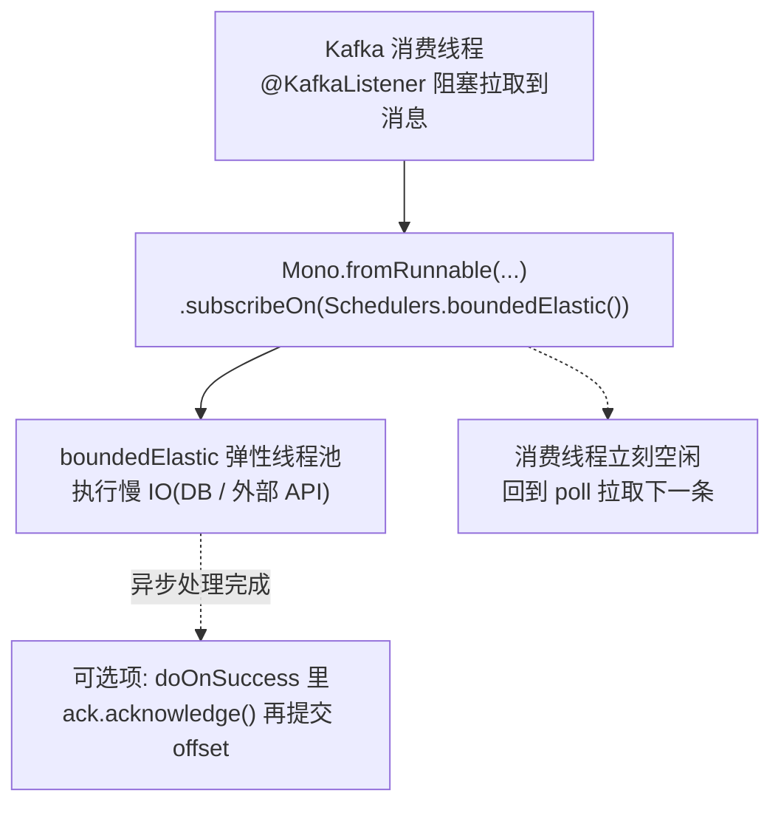

**核心思想**：Kafka 消费者用阻塞 listener（`@KafkaListener` 原生方式），**处理逻辑**里如果要用响应式（如调多个响应式服务、想控制并发），用 `Schedulers.boundedElastic()` 把它隔离出去，**Kafka 消费线程只负责"取消息 + 派发"**，很快回到拉取下一条。

> **给你的结论**：
> 1. **别再用 reactor-kafka / 响应式 Kafka Binder**——废弃了。
> 2. 用 `@KafkaListener`（阻塞）消费。
> 3. 需要响应式处理？消费者保持阻塞，处理逻辑内部用 Reactor + `Schedulers` 桥接。
> 4. 看到旧教程教 `ReactiveKafkaConsumerTemplate`，**跳过**——那是过去式。

### 4.5 虚拟线程（Virtual Threads）——阻塞方案的"外挂"

Spring Boot 4.1 / Java 25 原生支持**虚拟线程**（`spring.threads.virtual.enabled=true`）。虚拟线程把阻塞的成本降到了极低——阻塞时虚拟线程自动让出、挂起，不再占死一个操作系统线程。

```yaml
spring:
  threads:
    virtual:
      enabled: true      # ▼ 开启虚拟线程
```

**这对"阻塞 vs 响应式"的取舍影响巨大**：

- 以前：阻塞线程贵（一个 OS 线程 1MB 栈），并发上不去，才需要响应式。
- 现在：虚拟线程便宜（成千上万个），**阻塞 listener 也能扛高并发**——Kafka 消费线程在等 DB/HTTP 时自动让出，换别的虚拟线程跑。

所以对**典型事件驱动服务**：
- 消费者 = 阻塞 `@KafkaListener`。
- 内部 IO 等待 = 虚拟线程（或 `Schedulers.boundedElastic()`）自动接管。
- **不需要 Reactor，也不需要响应式 Kafka**，就够用了。

> **给你的结论**：别为"响应式而响应式"。**直接 Spring Kafka + 阻塞 listener + 虚拟线程/弹性线程池**，是 2025 年后官方与社区的主流答案。响应式只在**同一条消息内要做复杂异步编排**（多个响应式调用要背压控制）时才值得引入。

### 本章 checkpoint ✅

- 能说出"为什么 @KafkaListener 天然有背压"（一个分区一个消费线程，处理慢就拉得慢）。
- 能说出 reactor-kafka 为什么被废弃（阻塞拉取本质 + 复杂度不划算）。
- 能在 listener 内部用 `Schedulers.boundedElastic()` 做阻塞/响应式隔离。
- 知道虚拟线程 + 阻塞 listener 是主流方案。

---

## 进阶 第 5 章：事件驱动架构（EDA）——架构师设计思维

前三章是"技术深挖"。这一章是"**设计高度**"——架构师怎么用事件**设计整个系统**。这一章代码少，思维多，但最值钱。

### 5.1 从"命令"到"事件"：思维的根本转变

**传统（命令式 RPC）**：服务 A 直接调服务 B 的方法，意思是"**你去做 X**"。
```java
orderService.create(order);
inventoryService.deduct(order);   // 命令：库存，你去扣减！
```

**事件驱动**：服务 A 只发一个"**发生了 X**"的事实，不关心谁来处理。
```java
kafkaTemplate.send("orders", order.getId(), new OrderCreated(order).toJson());
// 事实：订单创建了（谁关心谁订阅）
```

**区别本质**：
- 命令 = "你去做"（强耦合，A 知道 B 存在）。
- 事件 = "发生了"（松耦合，A 不知道谁在听）。

### 5.2 事件命名（Event Naming）——新手最容易写错的地方

**铁律：事件名用"过去式/事实"，不用"命令/祈使"。**

| ❌ 错（命令式命名） | ✅ 对（事件式命名） |
|------|------|
| `CreateOrder` | `OrderCreated`（订单已创建） |
| `DeductInventory` | `InventoryDeducted`（库存已扣减） |
| `SendEmail` | `EmailRequested`（邮件已请求） |

为什么？事件是**已经发生的事实**，不是"要求别人做某事"。`OrderCreated` 表达的是"订单创建这件事已成事实"，库存/计费/通知各自决定怎么响应。如果叫 `DeductInventory`，那其实是"命令库存扣减"，又耦合回去了。

### 5.3 事件版本演进（Schema Evolution）

业务变化，事件结构要变（如 `OrderCreated` 加个 `couponCode` 字段）。怎么不破坏老消费者？

**原则**：
- **只加字段，不删/不改字段**（向后兼容）。老消费者忽略新字段，新消费者用新字段。
- 用 **Schema Registry**（如 Confluent Schema Registry + Avro）管理事件结构版本，自动校验兼容性。
- 实在要破坏性改动 → 发新版事件（`OrderCreatedV2`），老版逐步下线。

> **架构师要点**：事件是**契约**，一旦有消费者就不能随便改。版本演进要像 API 版本一样谨慎管理。

### 5.4 事件溯源（Event Sourcing）

传统：DB 存"**当前状态**"（用户余额=100）。事件溯源：DB 存"**所有事件**"（存了"充值100""消费30""消费20"...），当前状态由事件**重算**得出。

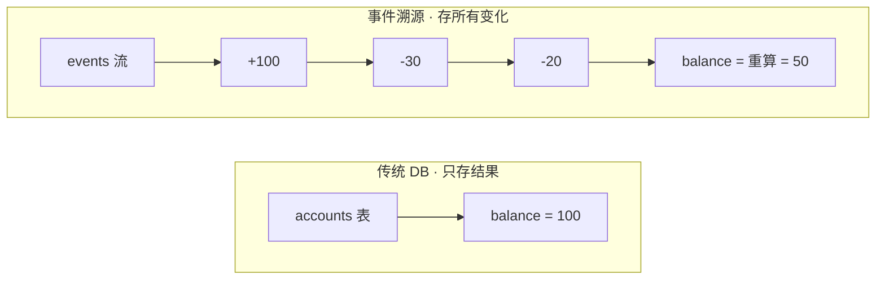

**好处**：
- **完整审计**：所有变化都有记录（金融、合规刚需）。
- **时间旅行**：能重建任意时刻的状态。
- **天然适配事件驱动**。

**代价**：复杂（要处理事件重放、快照优化查询）。**只有对审计/历史有强需求才用**（金融、医疗），普通业务别上。

### 5.5 CQRS（命令查询职责分离）

传统：同一个模型既写又读。**CQRS**：写模型（命令侧）和读模型（查询侧）**分开**。

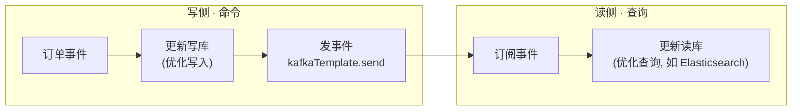

**为什么**：写和读的优化方向不同（写要事务一致，读要快/灵活查询）。分开各优化各的。常和事件溯源搭配。

### 5.6 Saga 模式——分布式事务的解法

跨服务的业务操作（如"下单要扣库存+扣余额+加积分"，分别在不同服务）怎么保证一致性？**不能用 DB 事务**（跨服务跨库）。

**Saga**：把分布式操作拆成一串**本地事务**，每步发事件，失败时发**补偿事件**回滚。

**Saga 的正向与补偿**：

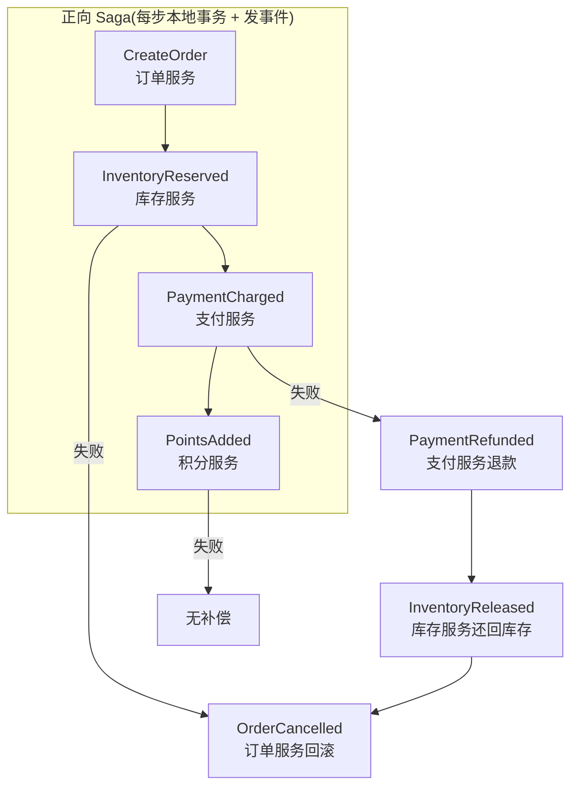

每步：
1. 服务做本地事务，成功 → 发事件（`kafkaTemplate.send`）。
2. 下个服务 `@KafkaListener` 订阅事件，做自己的本地事务。
3. 任一步失败 → 发补偿事件，前面的服务订阅后回滚。

**核心**：**最终一致性**（不是 ACID），靠事件 + 补偿达成。这是微服务架构的标准分布式事务方案。

> **架构师要点**：分布式系统里，**强一致（ACID）跨服务做不到**。接受**最终一致性**，用 Saga 编排。直接 Kafka 正是 Saga 各步通信的理想载体（发事件、订阅事件）。

### 5.7 一句话总结架构师视角

学到这里，你应该能回答这些问题：
- **该用消息吗？** 要解耦/多消费者/异步 → 用。要同步拿结果 → 别用。
- **该用直接 Spring Kafka 还是 Stream 抽象？** 想换/多中间件（Kafka/RabbitMQ/RocketMQ）→ 才考虑 Stream 抽象（另见配套资料）。铁定只用 Kafka + 要极致控制 → **直接 `spring-boot-starter-kafka`（本专题 01/02 篇路线）**。
- **该用 Kafka Streams 吗？** 要实时聚合/JOIN/状态计算 → 用。只收发 → 别用，`@KafkaListener` 就够。
- **该用事件溯源/Saga 吗？** 强审计/跨服务一致性需求 → 用。普通 CRUD → 过度设计。
- **该用响应式 Kafka 吗？** **别用废弃的 reactor-kafka**，用阻塞 `@KafkaListener` + 内部 Reactor 桥接（第 4 章）。

**架构师的本质**：不是会用所有技术，而是**知道每个技术的代价，在合适的场景选合适的工具**。

---

## 进阶 附录：进阶 API 校验表与踩坑

### A.1 Spring Kafka 生产关键配置（已校验，前缀 `spring.kafka`）

| 属性 | 说明 |
|------|------|
| `bootstrap-servers` | Kafka 地址（默认 localhost:9092） |
| `producer.acks` | 生产者确认级别，`all` = 所有 ISR 副本确认（最强不丢） |
| `producer.retries` | 发送失败重试次数 |
| `consumer.auto-offset-reset` | 新消费组从哪读：`earliest` / `latest` |
| `consumer.enable-auto-commit` | 是否自动提交 offset（默认 true；要精确控制改 false） |
| `listener.concurrency` | 每个 listener 默认并发线程数 |
| `listener.ack-mode` | 手动 ack 模式（如 `manual_immediate`，配合 enable-auto-commit=false） |
| `streams.application-id` | Kafka Streams 的 application.id（兼做消费组名），**必配** |
| `streams.properties.default.key.serde` | Streams 默认 key 序列化器 |
| `streams.properties.default.value.serde` | Streams 默认 value 序列化器 |

### A.2 Kafka Streams DSL 关键类型（拓扑的类型签名）

```java
KStream<K,V>  → KStream<K,V>    // 流→流（变换/过滤：map/mapValues/filter/flatMapValues）
KStream<K,V>  → KTable<K,V>     // 流→表（聚合：groupBy + count/aggregate）
KTable<K,V>   → KStream<K,V>    // 表→流（toStream()）
KStream<K,V>  → GlobalKTable<K,V> // 流→全局表
```

### A.3 进阶踩坑

#### 坑 1：想用"响应式 Kafka"（已废弃）
**现象**：照旧教程引了 `reactor-kafka`（`ReactiveKafkaConsumerTemplate`）或响应式 Kafka Binder。
**解决**：2025年5月起废弃。改用阻塞 `@KafkaListener`，响应式处理用 `Schedulers.boundedElastic()` 桥接（第 4 章）。

#### 坑 2：Kafka Streams 的 application-id 没配 / 重复
**现象**：启动报错，或多个 Streams 应用互相抢消息。
**解决**：`spring.kafka.streams.application-id` 必配，且每个 Streams 应用**唯一**（它兼做消费组）。

#### 坑 3：消费并发度 > 分区数
**现象**：`concurrency` 设很高，但有的消费者闲着。
**解决**：总并行度 ≤ 分区数（min(实例数 × concurrency, 分区数)）。先加 topic 分区，再加并发。

#### 坑 4：事件命名用命令式
**现象**：事件叫 `CreateOrder`，结果越做越像 RPC 调用，耦合回来了。
**解决**：事件用过去式事实命名（`OrderCreated`）。

#### 坑 5：消费者不幂等，重复消费出数据错
**现象**：重启后部分消息重处理（at-least-once），扣了两次款。
**解决**：消费者**必须幂等**（幂等键去重）。at-least-once 是底线。

#### 坑 6：@KafkaListener 和 Kafka Streams 同时消费同一 topic
**现象**：两组消费者各自独立消费同一个 topic，消息被处理两遍。
**解决**：明确"谁消费谁"。`@KafkaListener` 用 `groupId`，Kafka Streams 用 `application-id`（也是 group.id）——**两者是不同的消费组，都会全量收到消息**。如果只要一份处理，别让两套消费者都挂同一个 topic。

#### 坑 7：手动 ack 忘提交
**现象**：`enable-auto-commit=false` 后没调 `acknowledgment.acknowledge()`，重启后消息又处理一遍（或阻塞）。
**解决**：`enable-auto-commit=false` 时，在 `@KafkaListener` 方法里注入 `Acknowledgment`，**处理成功后再 `acknowledge()`**；处理失败按需 ack 或走 `@RetryableTopic` 重试/死信。

---

## 配套学习资料

- [Kafka 消息队列从入门到架构师](./01-Kafka消息队列从入门到架构师.md)（姊妹篇：01 入门、本篇进阶；01 第 6 章的 Kafka 概念可与本篇第 1 章对照读）
- [Kafka 核心概念与 Spring Boot 实战](../Kafka消息队列实战专题/01-Kafka消息队列从入门到架构师.md)（第 1 章 Kafka 基础的展开）
- [spring-kafka 官方文档](https://docs.spring.io/spring-kafka/reference/)（`@KafkaListener` / `KafkaTemplate` / 重试 DLT 权威参考）
- [Kafka Streams 官方文档](https://kafka.apache.org/documentation/streams/)（第 3 章流式计算权威参考）
- [reactor-kafka 停止维护公告](https://spring.io/blog/2025/05/20/reactor-kafka-discontinued)（第 4 章必读）
- [35-管数分离实战](../../tutorials/spring-ai-2.0/35-管数分离实战-从Sinks到Kafka演进.md)（同为 `KafkaTemplate` + `@KafkaListener` 的生产实战，互相对照）

---

## 毕业下一步：装一辆能跑的车

理论学到这里，你已经"懂原理、懂设计"了。但还差最后一跃——**把这些零散知识组装成一个真正能跑的完整系统**。这是从"懂"到"会做"的跨越：

➡️ **[事件驱动微服务端到端实战](./03-事件驱动微服务端到端实战.md)**

那篇带你从零搭一个电商下单系统（订单/库存/支付三服务），落地本篇讲过的 **Saga 补偿事务、幂等表、消费组隔离**，补上"装一辆车"的实战经验。读完你才真正具备设计事件驱动系统的能力。

---

> **写在最后**：这份进阶文档从 Kafka 地基（第 1 章）讲到生产调优与死信（第 2 章）、流式计算（第 3 章）、响应式真相（第 4 章）、架构设计（第 5 章）。**关键不是记住所有 API，而是建立"在什么场景选什么技术"的判断力**。尤其记住两个 2025 年的新事实：响应式 Kafka 废弃了、事件驱动设计的本质是"发布事实而非发命令"。掌握了这些，你已经从"会用 Spring Kafka"进入到"能设计事件驱动系统"的架构师领域。祝你继续精进。
