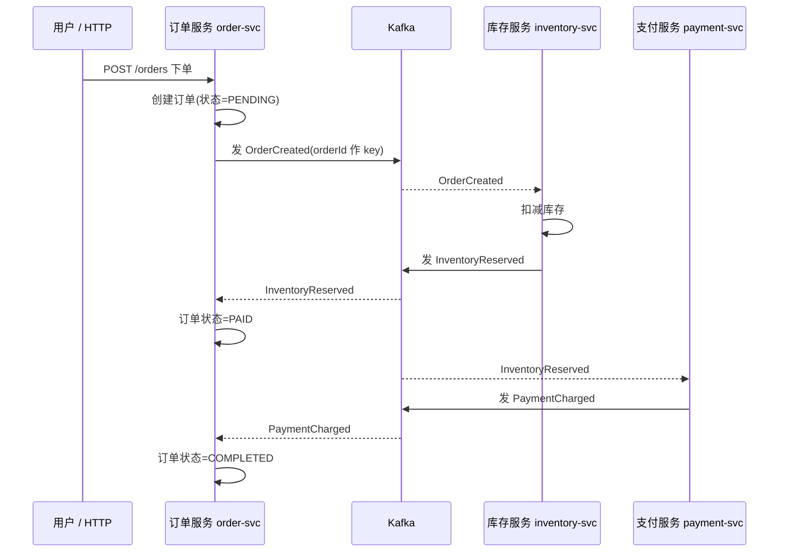
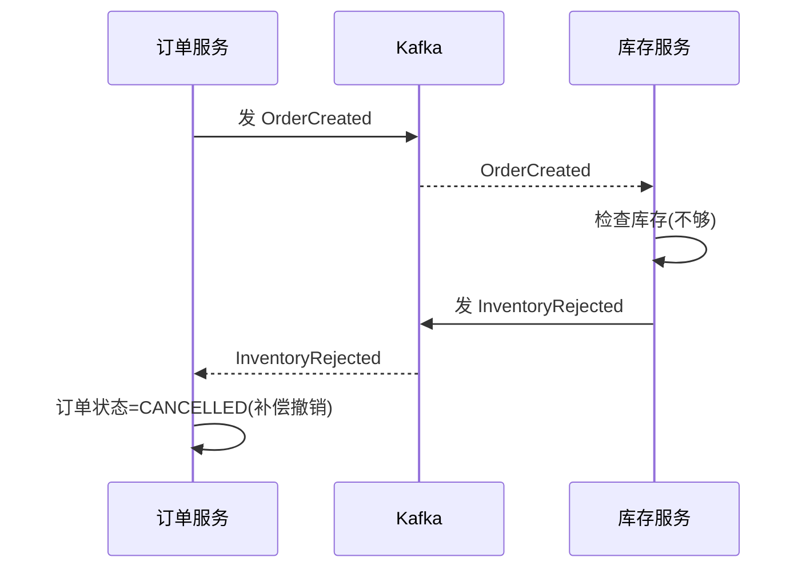
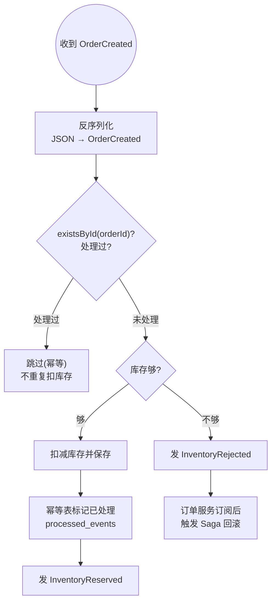
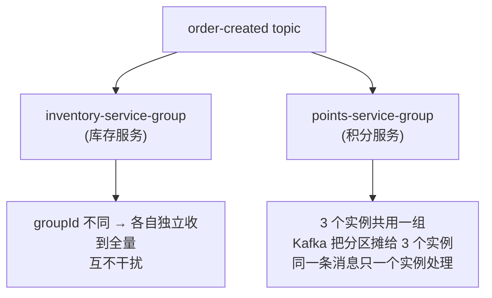
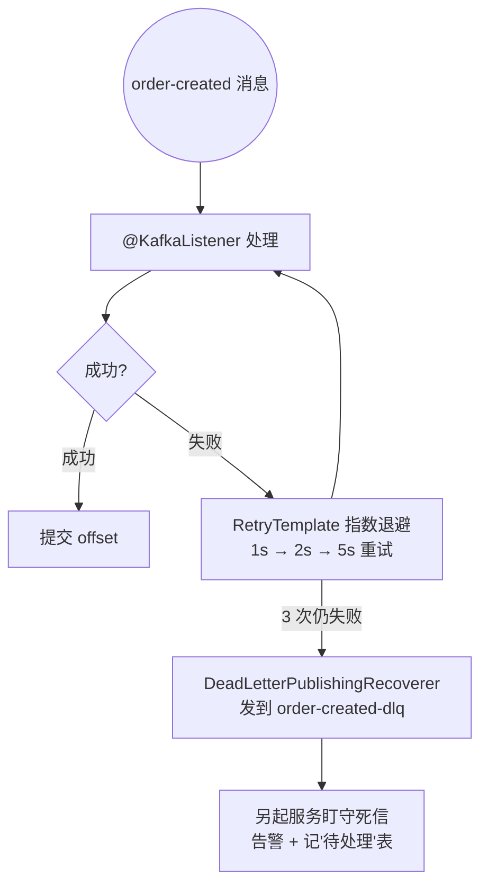

# 事件驱动微服务端到端实战（从零搭一个能跑的事件驱动系统）

> **这份文档是什么**：[Kafka 入门篇](./01-Kafka消息队列从入门到架构师.md) + [进阶篇](./02-Kafka进阶实战.md) 的**毕业实战**。前两篇你学了"零件"（`KafkaTemplate` 发、`@KafkaListener` 收、Kafka、Kafka Streams、EDA 概念），这一篇带你**装一辆能跑的车**——从零搭一个**真正能运行的事件驱动微服务系统**，直接用 **`spring-boot-starter-kafka`**（原生 Spring Kafka，不用 Spring Cloud Stream 那层抽象）。
>
> **写给谁**：读完了入门篇 0-5 章和进阶篇的人。你会用 Kafka 收发消息了，但还没"**做过一个完整系统**"。这篇就是那个系统。
>
> **业务场景**：一个最简化的**电商下单**——`订单服务` 下单 → 通知 `库存服务` 扣库存 → 通知 `支付服务` 处理支付。三个独立服务，**不直接调用**，全靠事件通信。如果中途失败（比如库存不够），要**自动回滚**（Saga 分布式事务）。
>
> **你能学到**：把零散知识串起来——事件设计（进阶篇 5.2）、消费组隔离、幂等表（入门篇 9.1）、重试+死信（入门篇 5.3-5.5）、Saga 补偿事务（进阶篇 5.6）**落地成真实代码**、可观测性、架构复盘。
>
> **版本前提（已校验）**：Spring Boot 4.1.0 + `spring-boot-starter-kafka`（版本由 Boot BOM 托管，**不需要 Spring Cloud BOM**）。代码照抄能跑。
>
> **和 01/02 篇的关系**：01/02 篇同样是直接 Kafka（`KafkaTemplate` 发、`@KafkaListener` 收），本篇把它们教的"零件"组装成一个完整的事件驱动系统。**消费组、幂等、重试死信、at-least-once、Saga 这些概念完全通用**，风格与 [35-管数分离实战](../../tutorials/spring-ai-2.0/35-管数分离实战-从Sinks到Kafka演进.md) 第 10 章的手写 Kafka 一致。

---

## 目录

- [第 0 章：先看清全貌——我们要搭什么](#第-0-章先看清全貌我们要搭什么)
- [第 1 章：事件设计——先把"语言"定好](#第-1-章事件设计先把语言定好)
- [第 2 章：基础设施——起 Kafka，建项目骨架](#第-2-章基础设施起-kafka建项目骨架)
- [第 3 章：订单服务——发第一个事件](#第-3-章订单服务发第一个事件)
- [第 4 章：库存服务——消费事件 + 幂等](#第-4-章库存服务消费事件--幂等)
- [第 5 章：消费组隔离——为什么三个服务互不干扰](#第-5-章消费组隔离为什么三个服务互不干扰)
- [第 6 章：Saga——失败时自动回滚](#第-6-章saga失败时自动回滚)
- [第 7 章：重试与死信——扛住故障](#第-7-章重试与死信扛住故障)
- [第 8 章：可观测——看见事件在流动](#第-8-章可观测看见事件在流动)
- [第 9 章：架构复盘——做了什么、代价是什么、怎么演进](#第-9-章架构复盘做了什么代价是什么怎么演进)
- [附录：完整代码索引与踩坑](#附录完整代码索引与踩坑)

---

## 第 0 章：先看清全貌——我们要搭什么

别急着写代码。先用 5 分钟把"要做什么"在脑子里画清楚。这一步新手最爱跳过，跳过的后果是写到一半不知道在干嘛。

### 0.1 业务流程：一次成功下单

用户点"下单"，后端要完成三件事，分别由三个服务负责：

```
① 订单服务：创建订单（状态=待处理）
        │ 发事件 OrderCreated
        ▼
② 库存服务：扣减库存
        │ 发事件 InventoryReserved（成功）/ InventoryRejected（失败，库存不够）
        ▼
③ 支付服务：处理支付
        │ 发事件 PaymentCharged（成功）
        ▼
订单服务：收到支付成功 → 订单状态=已完成
```

**一次成功下单的完整时序**：



**关键**：三个服务**谁都不直接调用谁**。订单服务不知道库存服务存在，它只发一个 `OrderCreated` 事件就完事了。库存服务自己订阅这个事件、自己决定怎么响应。

### 0.2 失败流程：Saga 回滚

如果库存不够（`InventoryRejected`），不能让订单卡在"待处理"。要**自动回滚**——Saga 模式（进阶篇 5.6 讲过概念，本章落地）：

```
库存服务：库存不够 → 发 InventoryRejected
        ▼
订单服务：收到 InventoryRejected → 订单状态=已取消（这就是"补偿"——撤销之前创建的订单）
```

**失败路径的补偿时序**：



**这就是 Saga 的本质**：每一步成功发正向事件，失败发补偿事件，前面的服务订阅补偿事件后**自我回滚**。没有跨服务的数据库事务，靠事件达成**最终一致性**。

### 0.3 三个服务 + 一个 Kafka

```
┌──────────────┐   OrderCreated    ┌──────────────┐
│  订单服务    │ ─────────────────▶ │  库存服务    │
│ order-svc    │ ◀──── Inventory ── │ inventory-svc│
└──────────────┘    Reserved/      └──────────────┘
        ▲           Rejected
        │ PaymentCharged
┌───────┴──────┐
│  支付服务    │
│ payment-svc  │
└──────────────┘
        │
        ▼
   [ Kafka ]  ← 所有事件都流经 Kafka
```

每个服务是一个独立的 Spring Boot 应用。它们只通过 Kafka topic 上的事件通信——**完全解耦**。

### 0.4 你需要的新知识（本章会教）

除了入门篇/进阶篇已学的，本章重点教三个新东西：
1. **消费组隔离**：三个服务订阅同一个 topic，怎么互不干扰（第 5 章）。
2. **Saga 落地**：进阶篇只讲概念，本章写真实代码（第 6 章）。
3. **幂等表实战**：入门篇讲过原理，本章落到数据库设计（第 4 章）。

准备好了，开始。

---

## 第 1 章：事件设计——先把"语言"定好

事件驱动系统里，**事件就是服务之间的 API 契约**。先定好"发什么事件、每个事件长什么样"，比先写代码重要十倍。

### 1.1 定事件清单

我们的系统需要这些事件（回顾进阶篇 5.2 的命名铁律——**过去式、表事实**）：

| 事件名 | 谁发的 | 含义 | 谁订阅 |
|--------|--------|------|--------|
| `OrderCreated` | 订单服务 | 订单已创建（待处理） | 库存服务 |
| `InventoryReserved` | 库存服务 | 库存已扣减成功 | 订单服务、支付服务 |
| `InventoryRejected` | 库存服务 | 库存不够，扣减失败 | 订单服务（触发 Saga 回滚） |
| `PaymentCharged` | 支付服务 | 支付已成功 | 订单服务（订单完成） |

> **注意命名**：全是"已XX"（Created/Reserved/Charged），不是"去XX"（Create/Reserve/Charge）。这是事件，不是命令（进阶篇 5.2）。

### 1.2 定事件结构（Schema）

每个事件是一个 POJO。所有服务共享这些类（实际项目用共享 jar 或 Schema Registry，这里简化为**各服务在自己的包下复制一份同结构的类**）。

```java
// 订单已创建事件
@JsonIgnoreProperties(ignoreUnknown = true)   // ▼ 忽略未知字段，将来加字段不崩老消费者（附录坑5）
public class OrderCreated {
    private String orderId;
    private String productId;
    private int quantity;
    private double amount;
    // getters/setters（实际用 Lombok @Data）
}

// 库存已预留成功
@JsonIgnoreProperties(ignoreUnknown = true)
public class InventoryReserved {
    private String orderId;     // 关键：用 orderId 关联回那个订单
    private String productId;
    private int quantity;
}

// 库存不足（Saga 补偿触发器）
@JsonIgnoreProperties(ignoreUnknown = true)
public class InventoryRejected {
    private String orderId;
    private String reason;      // 为什么失败（如"库存不足"）
}

// 支付成功
@JsonIgnoreProperties(ignoreUnknown = true)
public class PaymentCharged {
    private String orderId;
    private double amount;
}
```

**一个关键设计**：每个事件都带 `orderId`。为什么？因为事件是**异步**的——库存服务收到 `OrderCreated` 处理完后发的 `InventoryReserved`，订单服务要**知道这是哪个订单的事**。`orderId` 是贯穿所有事件的**关联键**。它同时也作为 **Kafka 消息的 key**（第 3 章会讲），保证同一订单的事件落在同一分区、保持顺序。

### 1.3 定 topic

事件放哪个 topic？两种流派：
- **每类事件一个 topic**：`order-created`、`inventory-reserved`...（简单清晰，推荐新手）
- **按业务域聚合**：`order-events` 里放所有订单域事件（消息里带 `type` 字段，消费者自己过滤）

本章用**第一种**（每类一个 topic），最直观。第 5 章讲消费组隔离（同一个 topic 多个服务订阅，怎么互不干扰）。

| 事件 | topic |
|------|-------|
| OrderCreated | `order-created` |
| InventoryReserved | `inventory-reserved` |
| InventoryRejected | `inventory-rejected` |
| PaymentCharged | `payment-charged` |

好，"语言"定好了。开始搭。

---

## 第 2 章：基础设施——起 Kafka，建项目骨架

### 2.1 起 Kafka

```bash
docker run -d --name kafka -p 9092:9092 \
  -e KAFKA_NODE_ID=1 -e KAFKA_PROCESS_ROLES=broker,controller \
  -e KAFKA_LISTENERS=PLAINTEXT://:9092 -e KAFKA_ADVERTISED_LISTENERS=PLAINTEXT://localhost:9092 \
  -e KAFKA_CONTROLLER_QUORUM_VOTERS=1@localhost:9092 -e KAFKA_INTER_BROKER_LISTENER_NAME=PLAINTEXT \
  confluentinc/cp-kafka:latest
```

### 2.2 建三个项目（或三个模块）

为聚焦主线，本章用**三个独立的 Spring Boot 项目**（实战中可能是多模块）。每个项目共享同样的 `pom.xml` 关键部分：

```xml
<parent>
    <groupId>org.springframework.boot</groupId>
    <artifactId>spring-boot-starter-parent</artifactId>
    <version>4.1.0</version>
    <relativePath/>   <!-- 版本都由父工程 BOM 托管，不需要 Spring Cloud BOM -->
</parent>

<properties>
    <java.version>17</java.version>
</properties>

<dependencies>
    <!-- ① 主角：Spring Kafka（KafkaTemplate 发 / @KafkaListener 收）
         自带 spring-kafka + kafka-clients，版本由 Boot 4.1.0 BOM 托管 -->
    <dependency>
        <groupId>org.springframework.boot</groupId>
        <artifactId>spring-boot-starter-kafka</artifactId>
    </dependency>

    <!-- ② JSON：事件以 JSON 字符串收发，需要 ObjectMapper（提供 jackson-databind） -->
    <dependency>
        <groupId>org.springframework.boot</groupId>
        <artifactId>spring-boot-starter-json</artifactId>
    </dependency>

    <!-- ③ 订单/库存服务要存状态，引 JPA + H2（简化，生产用真数据库；支付服务无状态可不引） -->
    <dependency>
        <groupId>org.springframework.boot</groupId>
        <artifactId>spring-boot-starter-data-jpa</artifactId>
    </dependency>
    <dependency>
        <groupId>com.h2database</groupId>
        <artifactId>h2</artifactId>
        <scope>runtime</scope>
    </dependency>

    <!-- ④ 订单服务要 HTTP 入口（库存/支付两个纯消费者服务可不引；它自带 ② 的 jackson） -->
    <dependency>
        <groupId>org.springframework.boot</groupId>
        <artifactId>spring-boot-starter-web</artifactId>
    </dependency>
</dependencies>
```

> **为什么用 H2**：教学简化，不用装数据库。生产换成 PostgreSQL/MySQL，代码不改（只改配置）。
>
> **为什么事件是 JSON 字符串而不是对象**：`KafkaTemplate<String,String>` + `@KafkaListener(topics, groupId)` 是 Spring Kafka 最简单、最可控的收发方式——服务之间传输的就是 JSON 字符串，序列化/反序列化用一个 `ObjectMapper` 显式完成，不依赖 Kafka 的 `JsonSerializer` 类型头（那套配置繁琐、跨语言也不通用）。序列化细节全在自己手里，出问题好排查。

三个服务各跑在不同端口（8081/8082/8083），后面会讲。

---

## 第 3 章：订单服务——发第一个事件

### 3.1 订单服务的职责

1. 收到 HTTP `POST /orders` 请求 → 创建订单（状态=`PENDING`）。
2. 发 `OrderCreated` 事件到 `order-created` topic。
3. 订阅 `InventoryReserved` → 订单状态=`PAID`；订阅 `PaymentCharged` → 订单状态=`COMPLETED`；订阅 `InventoryRejected` → 订单状态=`CANCELLED`（Saga 回滚，第 5/6 章）。

### 3.2 订单实体 + 库（JPA）

```java
package com.example.ordersvc;

import jakarta.persistence.*;

@Entity
@Table(name = "orders")   // "order" 是 SQL 保留字，用 orders
public class Order {
    @Id
    private String orderId;
    private String productId;
    private int quantity;
    private double amount;
    private String status;   // PENDING / PAID / COMPLETED / CANCELLED
    // getters/setters
}

public interface OrderRepository extends JpaRepository<Order, String> {}
```

### 3.3 Controller：创建订单 + 发事件

```java
package com.example.ordersvc;

import com.fasterxml.jackson.core.JsonProcessingException;
import com.fasterxml.jackson.databind.ObjectMapper;
import org.springframework.http.HttpStatus;
import org.springframework.kafka.core.KafkaTemplate;
import org.springframework.web.bind.annotation.*;

// 请求体 DTO（简洁起见用 record，Jackson 原生支持）
record OrderRequest(String productId, int quantity, double amount) {}

@RestController
public class OrderController {

    private final OrderRepository repo;
    private final KafkaTemplate<String, String> kafkaTemplate;  // <Key, Value> 都是 String
    private final ObjectMapper objectMapper;                    // 事件对象 <-> JSON 字符串

    public OrderController(OrderRepository repo,
                           KafkaTemplate<String, String> kafkaTemplate,
                           ObjectMapper objectMapper) {
        this.repo = repo;
        this.kafkaTemplate = kafkaTemplate;
        this.objectMapper = objectMapper;
    }

    @PostMapping("/orders")
    @ResponseStatus(HttpStatus.ACCEPTED)
    public String create(@RequestBody OrderRequest req) throws JsonProcessingException {
        // ① 创建订单（状态=待处理）
        Order order = new Order();
        order.setOrderId("ord-" + System.currentTimeMillis());
        order.setProductId(req.productId());
        order.setQuantity(req.quantity());
        order.setAmount(req.amount());
        order.setStatus("PENDING");
        repo.save(order);

        // ② 发 OrderCreated 事件（KafkaTemplate 发送，对应 Kafka 原生的"发"）
        OrderCreated event = new OrderCreated(
                order.getOrderId(), order.getProductId(), order.getQuantity(), order.getAmount());
        String json = objectMapper.writeValueAsString(event);          // 对象 → JSON 字符串
        kafkaTemplate.send("order-created", order.getOrderId(), json); // (topic, key, value)

        return order.getOrderId();
    }
}
```

**为什么 key 用 `orderId`**：Kafka 里同一个 key 的消息**永远进同一个分区**。用 `orderId` 当 key，某个订单的所有事件（OrderCreated → InventoryReserved/Rejected → PaymentCharged）都落在**同一分区**，消费时天然按订单有序——这是保证"同一订单的事件顺序不错乱"的关键（进阶篇讲过分区内有序）。

> **注意**：保存订单（`repo.save`）和发事件（`kafkaTemplate.send`）是**两步**，不是原子的。崩了会丢事件——这是 Outbox 模式的由来（第 9.3 / 04 文档专门解决）。

### 3.4 配置：spring.kafka（去掉所有 spring.cloud.*）

Spring Boot 自动配置 `KafkaTemplate` 和 `@KafkaListener` 所需的容器工厂，我们只需声明 `spring.kafka.*`：

```yaml
server:
  port: 8081
spring:
  application:
    name: order-service
  datasource:
    url: jdbc:h2:mem:orders    # 内存库，教学用
  kafka:
    bootstrap-servers: localhost:9092
    producer:
      key-serializer: org.apache.kafka.common.serialization.StringSerializer
      value-serializer: org.apache.kafka.common.serialization.StringSerializer
    consumer:
      group-id: order-service-group               # 订单服务自己的消费组（第 5 章重点）
      key-deserializer: org.apache.kafka.common.serialization.StringDeserializer
      value-deserializer: org.apache.kafka.common.serialization.StringDeserializer
      auto-offset-reset: earliest                 # 新消费组从最早开始读，方便教学
```

> **和 Spring Cloud Stream 的对应关系**：原来的 `spring.cloud.stream.kafka.binder.brokers` → 变成 `spring.kafka.bootstrap-servers`；原来的 `bindings.*.destination/group` → 变成 `@KafkaListener(topics=..., groupId=...)` 注解参数 + `spring.kafka.consumer.group-id` 默认值。`spring.cloud.function.definition`、bindings 这些全部删掉。

### 3.5 跑一下

```bash
curl -X POST http://localhost:8081/orders \
  -H "Content-Type: application/json" \
  -d '{"productId":"p001","quantity":2,"amount":99.9}'
# 返回 ord-xxxx

# 看事件发到 Kafka 了没
docker exec -it kafka kafka-console-consumer --bootstrap-server localhost:9092 \
  --topic order-created --from-beginning
# 能看到 OrderCreated 的 JSON
```

**第一个里程碑达成**：订单服务能发事件了。但还没人消费——库存服务还没起。下一章建库存服务去消费它。

---

## 第 4 章：库存服务——消费事件 + 幂等

### 4.1 库存服务的职责

1. 订阅 `OrderCreated` → 扣减库存。
2. 成功 → 发 `InventoryReserved`；库存不够 → 发 `InventoryRejected`。

### 4.2 消费者：@KafkaListener + 幂等表（重点）

```java
package com.example.inventorysvc;

import com.fasterxml.jackson.core.JsonProcessingException;
import com.fasterxml.jackson.databind.ObjectMapper;
import org.springframework.kafka.annotation.KafkaListener;
import org.springframework.kafka.core.KafkaTemplate;
import org.springframework.stereotype.Component;

@Component
public class InventoryHandler {

    private final InventoryRepository inventoryRepo;
    private final ProcessedEventRepository processedRepo;  // ▼ 幂等表
    private final KafkaTemplate<String, String> kafkaTemplate;
    private final ObjectMapper objectMapper;

    public InventoryHandler(InventoryRepository inventoryRepo,
                            ProcessedEventRepository processedRepo,
                            KafkaTemplate<String, String> kafkaTemplate,
                            ObjectMapper objectMapper) {
        this.inventoryRepo = inventoryRepo;
        this.processedRepo = processedRepo;
        this.kafkaTemplate = kafkaTemplate;
        this.objectMapper = objectMapper;
    }

    // ▼ 消费 OrderCreated：注解式订阅，topic + 消费组 一目了然（第 5 章重点）
    @KafkaListener(topics = "order-created", groupId = "inventory-service-group")
    public void reserveInventory(String message) throws JsonProcessingException {
        // ① 反序列化：JSON 字符串 → 事件对象
        OrderCreated event = objectMapper.readValue(message, OrderCreated.class);

        // ② 幂等检查：这个 orderId 处理过吗？（入门篇 9.1 落地）
        if (processedRepo.existsById(event.getOrderId())) {
            return;   // 处理过，跳过——这就是幂等
        }

        // ③ 扣减库存
        Inventory inv = inventoryRepo.findById(event.getProductId()).orElseThrow();
        boolean success;
        if (inv.getStock() >= event.getQuantity()) {
            inv.setStock(inv.getStock() - event.getQuantity());
            inventoryRepo.save(inv);
            success = true;
        } else {
            success = false;   // 库存不够
        }

        // ④ 标记已处理（幂等表的 key 用 orderId）
        processedRepo.save(new ProcessedEvent(event.getOrderId()));

        // ⑤ 发结果事件（用 KafkaTemplate，与第 3 章同一个 API）
        if (success) {
            InventoryReserved evt = new InventoryReserved(
                    event.getOrderId(), event.getProductId(), event.getQuantity());
            kafkaTemplate.send("inventory-reserved", event.getOrderId(),
                    objectMapper.writeValueAsString(evt));
        } else {
            InventoryRejected evt = new InventoryRejected(event.getOrderId(), "库存不足");
            kafkaTemplate.send("inventory-rejected", event.getOrderId(),
                    objectMapper.writeValueAsString(evt));
        }
    }
}
```

> **上面的写法是"朴素版"**：第 7.3 会讲加上 `@Transactional` 的**严格幂等版**（扣库存 + 标记幂等放同一个事务，防"扣了库存但没标记"的中间状态）。
>
> **为什么不用 `@EnableKafka`**：Spring Boot 自动配置了 `@KafkaListener` 所需的注册器和容器工厂，直接写注解就能用。

**库存服务的消费 + 幂等流程**：



### 4.3 幂等表（这是生产级的关键设计）

```java
package com.example.inventorysvc;

import jakarta.persistence.*;

// ▼ 幂等表：记录"哪些事件已处理过"。key 是业务的唯一标识（这里用 orderId）
@Entity
@Table(name = "processed_events")
public class ProcessedEvent {
    @Id
    private String eventId;   // 用 orderId 当 key（@Id 本身就是数据库唯一约束）
    public ProcessedEvent() {}
    public ProcessedEvent(String eventId) { this.eventId = eventId; }
    // getter/setter
}

public interface ProcessedEventRepository extends JpaRepository<ProcessedEvent, String> {
    // existsById 继承自 JpaRepository
}
```

> **唯一约束是双保险**：`@Id` 已经在数据库层面建了唯一索引，单实例下 `existsById` 先查就够了；将来服务扩成多实例并发消费，数据库唯一约束还会**兜底**——两个实例同时处理同一个 orderId，第二个插入 `ProcessedEvent` 时主键冲突，事务回滚，不会重复扣库存（配合第 7.3 的 `@Transactional`）。

**为什么必须幂等**（进阶篇 1.4 讲过）：Kafka 是 at-least-once——同一个 `OrderCreated` **可能被投递多次**（比如库存服务处理完了、提交 offset 前崩了、重启重投）。没有幂等表，库存会被**扣两次**。有了幂等表，第二次收到时 `existsById` 为 true，直接跳过。

> **这是事件驱动系统最容易出 bug 的地方**。新手写出来"测试正常"，上线一重启就重复扣款。**幂等表是标配，不是优化**。

### 4.4 库存服务配置

```yaml
server:
  port: 8082
spring:
  application:
    name: inventory-service
  datasource:
    url: jdbc:h2:mem:inventory
  kafka:
    bootstrap-servers: localhost:9092
    producer:
      key-serializer: org.apache.kafka.common.serialization.StringSerializer
      value-serializer: org.apache.kafka.common.serialization.StringSerializer
    consumer:
      group-id: inventory-service-group      # 库存服务自己的消费组（第 5 章重点）
      key-deserializer: org.apache.kafka.common.serialization.StringDeserializer
      value-deserializer: org.apache.kafka.common.serialization.StringDeserializer
      auto-offset-reset: earliest
```

> **注意**：`@KafkaListener(topics = "order-created", groupId = "inventory-service-group")` 里的 groupId **优先于** 配置文件里的 `spring.kafka.consumer.group-id`。这里两个都写上，注解里显式声明更直观。

### 4.5 支付服务——第一个最简单的消费者（顺带把链路走通）

支付服务订阅 `InventoryReserved`，处理支付后发 `PaymentCharged`。它无状态，不引 JPA/Web，是最简结构（订单服务订阅 `payment-charged` 后订单才能变 `COMPLETED`）：

```java
package com.example.paymentsvc;

import com.fasterxml.jackson.core.JsonProcessingException;
import com.fasterxml.jackson.databind.ObjectMapper;
import org.springframework.kafka.annotation.KafkaListener;
import org.springframework.kafka.core.KafkaTemplate;
import org.springframework.stereotype.Component;

@Component
public class PaymentHandler {

    private final KafkaTemplate<String, String> kafkaTemplate;
    private final ObjectMapper objectMapper;

    public PaymentHandler(KafkaTemplate<String, String> kafkaTemplate, ObjectMapper objectMapper) {
        this.kafkaTemplate = kafkaTemplate;
        this.objectMapper = objectMapper;
    }

    // 订阅库存预留成功 → 处理支付 → 发 PaymentCharged
    @KafkaListener(topics = "inventory-reserved", groupId = "payment-service-group")
    public void charge(String message) throws JsonProcessingException {
        InventoryReserved e = objectMapper.readValue(message, InventoryReserved.class);

        // ▼ 教学简化：真实系统金额从订单库查询或由事件携带，这里用固定金额演示链路
        PaymentCharged evt = new PaymentCharged(e.getOrderId(), 99.9);
        kafkaTemplate.send("payment-charged", e.getOrderId(),
                objectMapper.writeValueAsString(evt));
    }
}
```

```yaml
server:
  port: 8083
spring:
  application:
    name: payment-service
  kafka:
    bootstrap-servers: localhost:9092
    producer:
      key-serializer: org.apache.kafka.common.serialization.StringSerializer
      value-serializer: org.apache.kafka.common.serialization.StringSerializer
    consumer:
      group-id: payment-service-group         # 支付服务自己的消费组
      key-deserializer: org.apache.kafka.common.serialization.StringDeserializer
      value-deserializer: org.apache.kafka.common.serialization.StringDeserializer
      auto-offset-reset: earliest
```

---

## 第 5 章：消费组隔离——为什么三个服务互不干扰

到这一步有个**新手必问的问题**：

> 订单服务、库存服务都订阅 `order-created` topic？不对，库存服务订阅它。但如果明天又有个"积分服务"也要订阅 `order-created`（下单加积分），它和库存服务会**抢消息**吗？会不会库存收到的、积分收不到？

答案在**消费组**（进阶篇 1.5 讲过概念，这里落地）。在 Spring Kafka 里，消费组就是 `@KafkaListener` 的 `groupId` 属性——这是 Kafka 原生概念，不是框架抽象。

### 5.1 消费组规则

- **同组**：一个 topic 的消息，组内**只有一个**消费者收到（负载均衡，Kafka 把分区分配给组内成员）。
- **不同组**：**每组各自收到全量**消息（发布订阅，每个组独立提交自己的 offset）。

所以：库存服务和积分服务要**各自独立**收到每个 `OrderCreated`，就必须用**不同的 groupId**。

### 5.2 就差一个 groupId

```java
// 库存服务：组 = inventory-service-group
@KafkaListener(topics = "order-created", groupId = "inventory-service-group")
public void reserveInventory(String message) { ... }

// 积分服务（假设有）：组 = points-service-group —— 不同组，各自全量消费
@KafkaListener(topics = "order-created", groupId = "points-service-group")
public void awardPoints(String message) { ... }
```

两个 groupId 不同 → 各自全量消费，互不干扰。如果将来积分服务扩成 3 个实例，三个实例共用 `points-service-group` → Kafka 把 `order-created` 的分区**分给三个实例分担**（同一个消息只一个实例处理，`order-created` 有几个分区就最多几个并行实例）。

> **铁律**：**生产环境每个消费服务必须配固定的 groupId**。Spring Kafka 里 groupId 来自 `@KafkaListener(groupId=...)` 或 `spring.kafka.consumer.group-id`（默认值）。不配 → 容器启动就报错（Kafka 消费组的 `group.id` 是必填的）；配了随机/每次变的组名 → 每次重启都是"新组"，加上 `auto-offset-reset: earliest` 会**从头重复消费全部历史**——这是大坑。

**消费组隔离示意**：



### 5.3 订单服务同时订阅多个事件

订单服务要订阅 `inventory-reserved`、`inventory-rejected`、`payment-charged` 三个 topic。一个类里写三个 `@KafkaListener` 方法即可（这是注解式模型对比 Stream 函数式 `Consumer` 的直观优势——不需要 `function.definition` 注册）：

```java
package com.example.ordersvc;

import com.fasterxml.jackson.core.JsonProcessingException;
import com.fasterxml.jackson.databind.ObjectMapper;
import org.springframework.kafka.annotation.KafkaListener;
import org.springframework.stereotype.Component;

@Component
public class OrderEventConsumer {

    private final OrderRepository repo;
    private final ObjectMapper objectMapper;

    public OrderEventConsumer(OrderRepository repo, ObjectMapper objectMapper) {
        this.repo = repo;
        this.objectMapper = objectMapper;
    }

    @KafkaListener(topics = "inventory-reserved", groupId = "order-service-group")
    public void onReserved(String message) throws JsonProcessingException {
        InventoryReserved e = objectMapper.readValue(message, InventoryReserved.class);
        updateOrder(e.getOrderId(), "PAID");
    }

    @KafkaListener(topics = "inventory-rejected", groupId = "order-service-group")
    public void onRejected(String message) throws JsonProcessingException {
        InventoryRejected e = objectMapper.readValue(message, InventoryRejected.class);
        updateOrder(e.getOrderId(), "CANCELLED");   // ▼ Saga 回滚（第 6 章）
    }

    @KafkaListener(topics = "payment-charged", groupId = "order-service-group")
    public void onPaid(String message) throws JsonProcessingException {
        PaymentCharged e = objectMapper.readValue(message, PaymentCharged.class);
        updateOrder(e.getOrderId(), "COMPLETED");
    }

    private void updateOrder(String orderId, String status) {
        repo.findById(orderId).ifPresent(o -> {
            o.setStatus(status);
            repo.save(o);
        });
    }
}
```

**注意**：三个 listener 都用 `order-service-group` 这个组——它们订阅的是**不同 topic**，同组没问题（同组规则只影响"同一 topic 的多实例分担"）。

> **对比 Stream 函数式模型**：Spring Cloud Stream 里三个消费者要写成三个 `@Bean Consumer` + `spring.cloud.function.definition: onReserved;onRejected;onPaid` 注册。Spring Kafka 里就是三个 `@KafkaListener` 方法，零注册、零配置，一个方法一个订阅，更直白。

---

## 第 6 章：Saga——失败时自动回滚

这是整个实战的**精华**。回顾 0.2 的失败流程：库存不够时，订单要从 `PENDING` 变 `CANCELLED`。

### 6.1 看 Saga 是怎么"自动"发生的

关键认知：**Saga 没有"中央编排者"**。它靠事件链自然达成：

```
订单服务: 发 OrderCreated（订单=PENDING）
            ↓
库存服务: 库存不够 → 发 InventoryRejected
            ↓
订单服务: 订阅 InventoryRejected → 订单=CANCELLED   ← 这一步就是"补偿"
```

**"补偿"不是什么特殊机制**——就是订单服务订阅了 `InventoryRejected` 事件，收到后把自己的订单状态改掉（撤销之前创建的待处理订单）。

### 6.2 补偿的代码就是普通消费者

订单服务的 `onRejected`（5.3 已写）就是 Saga 的补偿逻辑：

```java
@KafkaListener(topics = "inventory-rejected", groupId = "order-service-group")
public void onRejected(String message) throws JsonProcessingException {
    InventoryRejected e = objectMapper.readValue(message, InventoryRejected.class);
    updateOrder(e.getOrderId(), "CANCELLED");
}
```

**就这么简单**。Saga 的"补偿"在事件驱动里落地为一个**普通的 `@KafkaListener`**——订阅失败事件、自我修正状态。

### 6.3 多步 Saga（扩展）

如果链路更长（下单→库存→支付→发货），失败在某一步，前面所有步都要回滚。每一步发自己的补偿事件：

```
支付失败 → PaymentFailed
   ↓
库存服务订阅 PaymentFailed → 发 InventoryReleased（补偿：还回库存）
   ↓
订单服务订阅（或直接订阅 PaymentFailed）→ 订单=CANCELLED
```

每步的补偿都是"订阅下游的失败事件 → 发自己的补偿事件"。**像多米诺骨牌**，一个失败触发一串补偿。

> **架构师要点**：Saga 的复杂度随步数**指数增长**（每步都要写补偿逻辑）。**步数超过 5 步要慎重考虑**，或者上专门的 Saga 编排框架（如 Axon、Seata）。3 步以内手写最清晰。

---

## 第 7 章：重试与死信——扛住故障

### 7.1 给消费者加重试

库存服务扣减时，数据库可能短暂连不上。加重试（入门篇 5.3）。在 Spring Kafka 里，重试配置在 **`spring.kafka.listener.retry.*`**（listener 层，不是 consumer 层）：

```yaml
spring:
  kafka:
    listener:
      retry:
        enabled: true                  # 开启 listener 重试
        max-attempts: 3                # 总尝试 3 次（1 次原始 + 2 次重试）
        backoff-initial-interval: 1000 # 首次等 1s
        backoff-multiplier: 2.0        # 每次翻倍
        backoff-max-interval: 5000
```

> **这些配置会自动生成一个 `RetryTemplate`**，交给 Spring Boot 自动配置的 `DefaultErrorHandler` 使用。`enabled: true` 是开关，其余是重试策略——对应原来 Spring Cloud Stream 里 `bindings.*.consumer.max-attempts / back-off-*` 的作用。

### 7.2 死信：重试用尽后的兜底

重试 3 次还失败（比如真的是 bug，或库存数据不存在），消息进死信 topic，留待人工处理（入门篇 5.4）。Spring Kafka 的 DLT 用 `DeadLetterPublishingRecoverer` 实现——自定义一个 `DefaultErrorHandler` Bean，把"重试模板"和"死信恢复器"绑在一起：

```java
package com.example.inventorysvc;

import org.apache.kafka.common.TopicPartition;
import org.springframework.context.annotation.Bean;
import org.springframework.context.annotation.Configuration;
import org.springframework.kafka.core.KafkaTemplate;
import org.springframework.kafka.listener.DeadLetterPublishingRecoverer;
import org.springframework.kafka.listener.DefaultErrorHandler;
import org.springframework.retry.support.RetryTemplate;

@Configuration
public class KafkaErrorConfig {

    @Bean
    public DefaultErrorHandler errorHandler(KafkaTemplate<String, String> kafkaTemplate) {
        // 重试模板：最多 3 次（1 原始 + 2 重试），指数退避 1s → 2s → 5s
        RetryTemplate retryTemplate = RetryTemplate.builder()
                .maxAttempts(3)
                .exponentialBackoff(1000L, 2.0, 5000L)
                .build();

        // 死信恢复器：重试耗尽后，把消息写进 DLT topic（partition 保持一致）
        // ▼ 自定义 DLT 命名：order-created → order-created-dlq（与本文 1.3 的约定一致）
        DeadLetterPublishingRecoverer recoverer = new DeadLetterPublishingRecoverer(
                kafkaTemplate,
                (record, ex) -> new TopicPartition(record.topic() + "-dlq", record.partition()));
        // 不想要自定义命名？直接 new DeadLetterPublishingRecoverer(kafkaTemplate) 即可，
        // 默认 DLT topic 名 = 原 topic + ".DLT"（如 order-created.DLT）

        return new DefaultErrorHandler(recoverer, retryTemplate);
    }
}
```

> **依赖说明**：`RetryTemplate` 来自 `spring-retry`，它是 `spring-kafka` 的传递依赖，不需要单独引。`spring-retry` 的 builder API：`maxAttempts(3)` 表示总尝试 3 次，`exponentialBackoff(初始, 倍数, 最大)` 是退避策略。
>
> **优先级**：一旦定义了 `DefaultErrorHandler` Bean（用户自定义优先），7.1 的 `spring.kafka.listener.retry.*` 配置就**不再生效**——因为 7.2 的 Bean 里已经用 `RetryTemplate` 把重试和死信一起包了。**二选一**：只要纯重试用 7.1 配置；要重试+死信一体用 7.2 的 Bean（推荐）。

> **生产铁律**：死信 topic **必须有人盯**（告警 + 人工或自动处理）。否则消息进了死信无人知，等于丢。常见做法：另起一个服务消费死信 topic，发告警 + 记到"待处理"表。

**重试耗尽后进死信的流程**：



### 7.3 幂等表 + 重试的关系

注意：4.2 的幂等检查（`existsById`）在**业务逻辑之前**。如果第一次处理到一半崩了（比如已扣库存但没来得及标记幂等），重试时会**重复扣库存**——因为幂等表还没记。

**严格幂等的正确做法**：把"幂等标记"和"业务操作"放**同一个数据库事务**里：

```java
import org.springframework.transaction.annotation.Transactional;

@KafkaListener(topics = "order-created", groupId = "inventory-service-group")
@Transactional   // ▼ 关键：扣库存 + 标记幂等 在一个事务里，要么全成要么全不成
public void reserveInventory(String message) throws JsonProcessingException {
    OrderCreated event = objectMapper.readValue(message, OrderCreated.class);
    if (processedRepo.existsById(event.getOrderId())) return;
    // 扣库存...
    processedRepo.save(new ProcessedEvent(event.getOrderId()));   // 同事务
}
```

这样：扣了库存一定也标记了幂等；没标记幂等说明库存也没扣——重试安全。**这是生产级幂等的正确姿势**（事务 + 幂等表，缺一不可）。

> **注意事务边界**：这里的 `@Transactional` 用的是 JPA/数据源事务管理器，管的是**数据库操作的原子性**；`KafkaTemplate.send`（发 `InventoryReserved`/`InventoryRejected`）**不在这个事务里**。如果要在"发消息"和"扣库存"之间也保证原子性，那是 Outbox 模式的范畴（第 9.3 / 04 文档）。

---

## 第 8 章：可观测——看见事件在流动

事件驱动系统是**分布式**的——一个请求跨三个服务。没有可观测性，出问题就是黑盒（"订单为什么没完成？谁的锅？"）。

### 8.1 最简：结构化日志

每个事件处理时打日志，带 `orderId`（关联键）：

```java
@Component
public class InventoryHandler {

    private static final Logger log = LoggerFactory.getLogger(InventoryHandler.class);

    @KafkaListener(topics = "order-created", groupId = "inventory-service-group")
    public void reserveInventory(String message) throws JsonProcessingException {
        log.info("[inventory] 收到 OrderCreated message={}", message);
        OrderCreated event = objectMapper.readValue(message, OrderCreated.class);
        log.info("[inventory] 解析 orderId={} product={} qty={}",
                 event.getOrderId(), event.getProductId(), event.getQuantity());
        // 处理...
        log.info("[inventory] 完成 orderId={} result=success", event.getOrderId());
    }
}
```

**用 `orderId` 串联**：一个订单的事件，在三个服务的日志里都能用 `orderId` 搜出来，拼出完整链路。

### 8.2 进阶：链路追踪（Micrometer Tracing）

加依赖，自动给每个事件注入 traceId（跨服务传递）：

```xml
<dependency>
    <groupId>org.springframework.boot</groupId>
    <artifactId>spring-boot-starter-actuator</artifactId>
</dependency>
<dependency>
    <groupId>io.micrometer</groupId>
    <artifactId>micrometer-tracing-bridge-brave</artifactId>
</dependency>
```

Spring Kafka 对 Micrometer 有**原生支持**：classpath 有 micrometer 时，`KafkaTemplate` 发送时自动创建 span 并把 traceId 写进消息头，`@KafkaListener` 消费时自动取出、续上同一条链路。配合 Zipkin/Tempo，能看到一条请求在三个服务间的**完整调用链**——哪个服务慢、哪里出错一目了然。

> **架构师要点**：事件驱动系统**上线第一天就要有可观测性**，不是"以后再说"。没有它，排障是噩梦。

---

## 第 9 章：架构复盘——做了什么、代价是什么、怎么演进

恭喜——你搭完了一个完整的事件驱动系统。现在退一步，用架构师的视角复盘。

### 9.1 我们做了什么（知识串联）

| 用到的知识 | 来自 | 在实战中的体现 |
|-----------|------|--------------|
| KafkaTemplate / @KafkaListener | 01 篇 / 35 号文档 | 发/收事件（第 3/4 章） |
| 消费组 | 01 篇/进阶篇 | 服务间隔离（第 5 章） |
| 幂等表 | 01 篇 | 防重复扣库存（第 4/7 章） |
| 重试 + 死信 | 01 篇 | 扛故障（第 7 章） |
| 事件命名规范 | 进阶篇 | OrderCreated 而非 CreateOrder |
| Saga | 进阶篇 | 失败回滚（第 6 章） |
| at-least-once | 进阶篇 | 为什么必须幂等 |

**这就是"装一辆车"的意义**——零散知识在真实系统里各司其职，你真正理解了它们为什么需要。

### 9.2 这个设计的代价（架构师要诚实）

| 收益 | 代价 |
|------|------|
| 服务解耦 | **复杂度上升**：要处理幂等、重试、死信、Saga |
| 可独立扩展 | **调试难**：一个请求跨服务，要链路追踪 |
| 削峰填谷 | **最终一致**：不是立即一致，要接受延迟 |
| 灵活加消费者 | **基础设施依赖**：Kafka 挂了全瘫（要高可用） |

**没有银弹**。事件驱动的解耦和扩展性，是用**复杂度**换的。系统小、要强一致的场景，别用。

### 9.3 怎么演进（从这里继续）

学完这个实战，你可以往这些方向继续：
1. **引入 Kafka Streams**（进阶篇第 3 章）：对事件流做实时聚合（如"每分钟下单量"）。
2. **Schema Registry**：管理事件结构版本演进（进阶篇 5.3 / 04 文档），避免改字段崩掉消费者。
3. **CQRS**：写侧发事件，读侧订阅事件建只读库（进阶篇 5.5）。
4. **服务发现 + 网关**：用 Eureka + Gateway（35 号文档第 11-12 章讲过）收口多服务。
5. **Outbox 模式**：解决"DB 操作 + 发事件"的原子性问题（写 DB 和发事件要么都成要么都不成，是个经典难题）。

> **特别推荐研究 Outbox 模式**：本实战里"保存订单 + 发 OrderCreated"是两步（先 `repo.save` 再 `kafkaTemplate.send`），如果 save 成功但 send 前崩了，订单创建了但事件没发——下游永远不知道。Outbox 模式解决这个问题（把"待发事件"也写进同一个 DB 事务，再异步投递）。这是事件驱动系统的**进阶必修课**，详见 [04 生产级进阶](./04-生产级进阶-Outbox与Schema与分区调优.md)。

### 9.4 架构师的一句话总结

> **事件驱动不是"用了 Kafka"，而是"用发布事实的方式解耦系统"**。技术（Kafka、Spring Kafka）只是载体，核心是**事件设计、幂等、最终一致性、Saga**这些思维。把这些内化，你做任何分布式系统都受用。

---

## 附录：完整代码索引与踩坑

### A.1 三个服务速查

| 服务 | 端口 | 发的事件 | 订阅的事件 |
|------|------|---------|-----------|
| order-svc | 8081 | OrderCreated | InventoryReserved/Rejected, PaymentCharged |
| inventory-svc | 8082 | InventoryReserved/Rejected | OrderCreated |
| payment-svc | 8083 | PaymentCharged | InventoryReserved |

### A.2 跑通顺序

```bash
# 1. 起 Kafka（第 2 章）
# 2. 起 order-svc (8081) → inventory-svc (8082) → payment-svc (8083)
#    （topic 是生产者首次发消息时自动创建的；订单服务先发 order-created）
# 3. 下单
curl -X POST http://localhost:8081/orders -H "Content-Type: application/json" \
  -d '{"productId":"p001","quantity":2,"amount":99.9}'
# 4. 看日志：OrderCreated → InventoryReserved → PaymentCharged → 订单 COMPLETED
# 5. 测 Saga：把库存设成不够，下单 → InventoryRejected → 订单 CANCELLED
```

### A.3 踩坑

#### 坑 1：消费者不幂等，重启重复扣库存
**解决**：幂等表 + `@Transactional`（第 7.3）。

#### 坑 2：没配固定 groupId，重启重复消费历史
**解决**：每个 `@KafkaListener` 配固定 `groupId`（第 5 章）。

#### 坑 3：保存订单和发事件不原子，崩了丢事件
**解决**：Outbox 模式（9.3 / 04 文档），生产必修。

#### 坑 4：死信 topic 无人盯，等于丢消息
**解决**：死信要有消费者 + 告警（第 7.2）。

#### 坑 5：事件结构改了，老消费者反序列化崩
**解决**：事件类加 `@JsonIgnoreProperties(ignoreUnknown = true)`、只加字段不删字段；上 Schema Registry（04 文档）。

---

## 下一步：做成生产级

这个实战能跑，但还有几个**生产环境会撞上的硬骨头**没解决——比如 9.3 提到的"保存订单和发事件不原子"（崩了丢事件）、事件结构改了崩消费者、吞吐调优。下一篇带你逐个击破：

➡️ **[生产级进阶：Outbox 与 Schema 与分区调优](./04-生产级进阶-Outbox与Schema与分区调优.md)**

那篇补上 Outbox 模式（写DB+发事件原子化）、Schema Registry（事件版本演进）、分区深度调优（并发/顺序/热分区）——把你从"能搭系统"推到"能扛生产"。

---

## 配套学习资料

- [Kafka 消息队列从入门到架构师](./01-Kafka消息队列从入门到架构师.md)（前置零件篇：Kafka 概念与收发 API）
- [Kafka 进阶实战](./02-Kafka进阶实战.md)（前置理论篇：EDA/消费组/幂等/重试死信/Saga 的概念）
- [生产级进阶：Outbox 与 Schema 与分区调优](./04-生产级进阶-Outbox与Schema与分区调优.md)（后继生产篇，本实战的升级方向）
- [35-管数分离实战](../../tutorials/spring-ai-2.0/35-管数分离实战-从Sinks到Kafka演进.md) 第 10-12 章（手写 `KafkaTemplate`/`@KafkaListener` + 微服务拆分 + 网关，API 与本篇一致）
- [数据库事务与 @Transactional 详解](../协议与数据库/02-数据库事务与Transactional详解.md)（第 7.3 事务幂等的基础）
- [Spring Kafka 官方 - 接收消息（@KafkaListener）](https://docs.spring.io/spring-kafka/reference/kafka/receiving-messages.html)（第 3-5 章权威参考）

> **说明**：01/02 篇与本文统一用 Spring Kafka 原生 API（`KafkaTemplate` 发、`@KafkaListener` 收）。**消费组、幂等、重试死信、at-least-once、Saga 这些概念完全通用**，01/02 学的是"零件"，本文把它们装成系统。

---

> **写在最后**：这是你 Kafka 学习路径的**毕业作品**。从入门篇的"会发会收"，到进阶篇的"懂原理懂设计"，到这一篇的"装出一个完整系统"。你现在拥有的不只是 Kafka 的 API，而是**从零设计并落地一个事件驱动微服务系统的完整能力**——事件建模、消费组隔离、幂等、Saga、可观测、架构取舍。这套能力在你日后做任何分布式/微服务系统时都是核心竞争力。下一步可以研究 Outbox 模式、Kafka Streams 实时计算、或 CQRS——那将是更深的架构师领域。祝你成为优秀的架构师。
