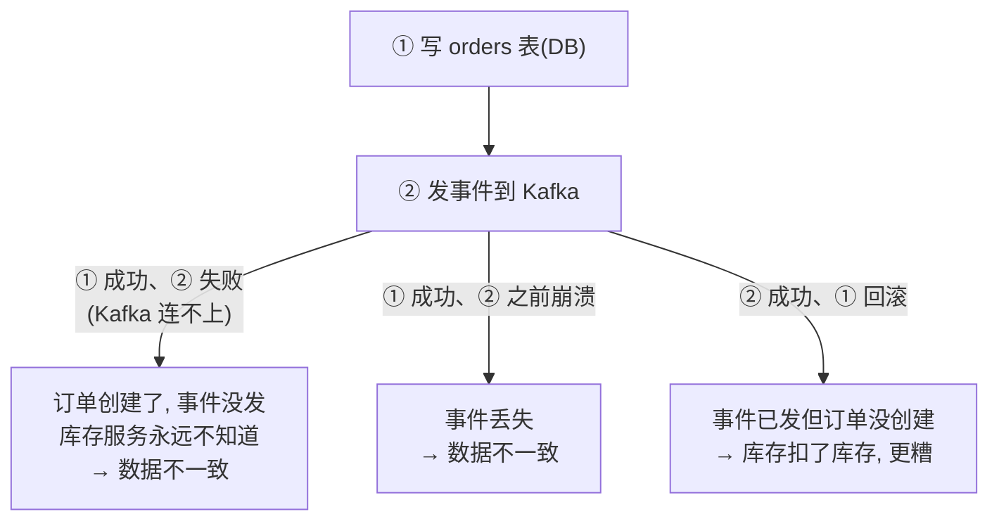
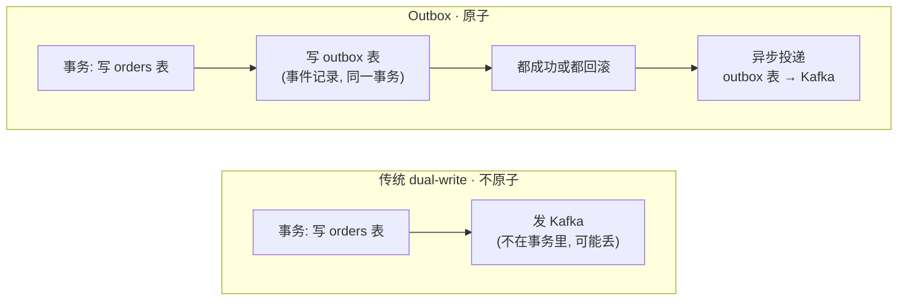
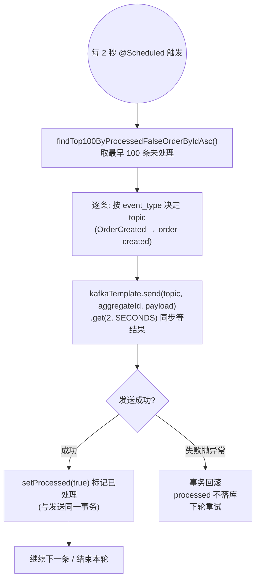
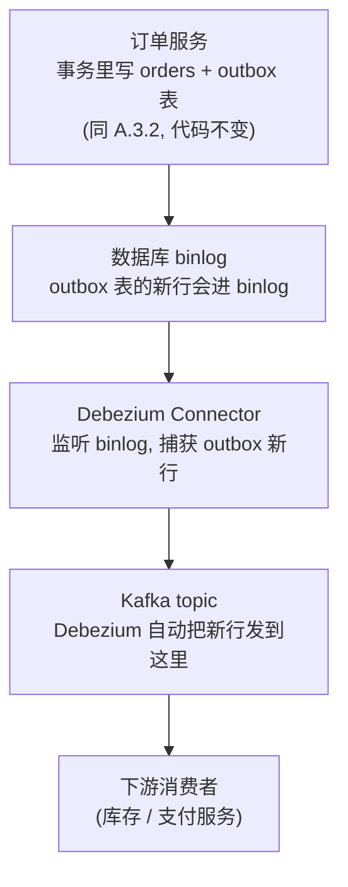
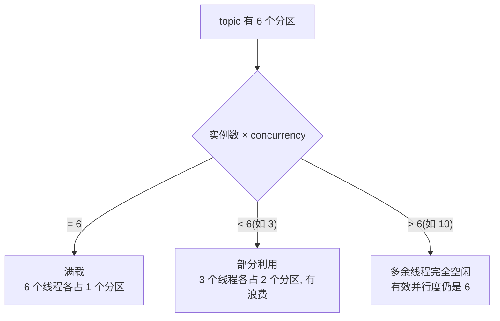

# 生产级进阶：Outbox 模式、Schema Registry、分区深度调优

> **这份文档是什么**：Kafka 消息队列实战专题 的第 04 篇，**生产级进阶**。前三篇你学会了"收发消息、懂原理、搭系统"。这一篇补上**事件驱动系统真正上线后会撞上的三个硬骨头**——都是"事件驱动微服务端到端实战"里明确标注为"演进方向"、但当时没展开的。
>
> **写给谁**：已经会用 Kafka 收发消息、能搭一个事件驱动系统的人。你已能搭系统,但这篇让你把它做成**生产可用**。
>
> **三个方向**（都是实战篇留下的真实痛点,不是凑内容）：
> - **方向 A：Outbox 模式**——解决"写数据库 + 发事件"不原子的难题（实战篇 9.3 标注的"进阶必修课"）。
> - **方向 B：Schema Registry**——事件结构怎么改而不崩消费者（进阶篇 5.3 只讲概念,这里落地）。
> - **方向 C：分区深度调优**——并发、顺序、热分区,把吞吐做到生产级。
>
> **版本前提（已校验）**：Spring Boot 4.1.0 + `spring-boot-starter-kafka` + Kafka。所有 API、配置项已对照官方文档校验。本专题一律用 **`KafkaTemplate` 发、`@KafkaListener` 收**（本专题前身是 Spring Cloud Stream，已统一改为直接 Kafka，Stream 专属内容不在本专题出现）。

---

## 目录

- [方向 A：Outbox 模式——让"写数据 + 发事件"原子化](#方向-aoutbox-模式让写数据--发事件原子化)
- [方向 B：Schema Registry——事件结构怎么演进不崩消费者](#方向-bschema-registry事件结构怎么演进不崩消费者)
- [方向 C：分区深度调优——并发、顺序、热分区](#方向-c分区深度调优并发顺序热分区)
- [附录：三方向 API 校验表与取舍](#附录三方向-api-校验表与取舍)

---

## 方向 A：Outbox 模式——让"写数据 + 发事件"原子化

### A.1 问题：回顾实战篇埋的坑

实战篇第 3 章的订单服务,创建订单时做了两件事（这里用本专题的直接 Kafka 表述）:

```java
repo.save(order);                                        // ① 写数据库
kafkaTemplate.send("order-created", orderId, eventJson); // ② 发事件到 Kafka
```

**这两步不是原子的**。三种出错场景:

1. **① 成功、② 失败**（Kafka 暂时连不上）→ 订单创建了,但事件没发 → 库存服务永远不知道这个订单 → **数据不一致**。
2. **① 成功、② 之前崩溃**（进程突然挂）→ 同上,事件丢了。
3. **② 成功、① 回滚**（事务回滚但事件已发）→ 库存扣了库存,但订单其实没创建 → **更糟**。

**双写（dual-write）的三种出错场景**：



这就是 **dual-write problem（双写问题）**——往两个独立系统（DB 和 Kafka）写数据,没法保证原子性。**这是事件驱动系统最经典的难题**,所有做这行的人都会撞上。

### A.2 Outbox 模式的核心思想

> **把"发事件"从"调 Kafka"变成"往数据库的一张表插一行"**——和业务数据写在**同一个数据库事务**里。这样"业务数据 + 事件记录"要么一起成功、要么一起回滚。然后**另一个机制**异步地把表里的事件投递到 Kafka。



**关键洞察**:把"发事件"降级成"写一行记录",就能用成熟的数据库事务保证原子性。事件记录暂时"困"在 outbox 表里,再由投递器搬到 Kafka。

> **能不能用 Kafka 事务直接搞定？** Spring Kafka 确实提供**事务性生产者**（配 `spring.kafka.producer.transaction-id-prefix` + `KafkaTransactionManager`,让 `KafkaTemplate` 走事务),再用 `ChainedTransactionManager` 把"DB 事务 + Kafka 事务"绑进同一个 `@Transactional`,也能做到"写库 + 发消息"原子。但这是**跨系统分布式事务**:协调开销大、失败难排查;而且 Kafka 事务只保证"消息要么发、要么没发",一旦 DB 回滚而 Kafka 已提交,下游**仍然要靠幂等兜底**。**生产上 Outbox 仍是首选**:它把原子性收敛到**本地 DB 事务**,Kafka 只是异步投递的目标,不参与事务协调。

### A.3 解法一：轮询投递（Polling Publisher）——最简单,推荐新手

#### A.3.1 建 outbox 表

```sql
CREATE TABLE outbox (
    id            BIGSERIAL PRIMARY KEY,         -- 自增 id,投递器按顺序扫
    aggregate_id  VARCHAR(64)  NOT NULL,         -- 关联的业务 id（如 orderId）
    event_type    VARCHAR(64)  NOT NULL,         -- 事件类型（如 "OrderCreated"）
    payload       JSONB        NOT NULL,         -- 事件的完整内容（JSON 字符串）
    created_at    TIMESTAMPTZ  NOT NULL DEFAULT now(),
    processed     BOOLEAN      NOT NULL DEFAULT false,  -- 是否已投递
    processed_at  TIMESTAMPTZ                            -- 投递时间
);
CREATE INDEX idx_outbox_unprocessed ON outbox (id) WHERE processed = false;  -- ▼ 投递器高效扫未处理
```

#### A.3.2 业务逻辑：在同一事务里写 orders + outbox

```java
import org.springframework.stereotype.Service;
import org.springframework.transaction.annotation.Transactional;

@Service
public class OrderService {

    private final OrderRepository orderRepo;
    private final OutboxRepository outboxRepo;

    public OrderService(OrderRepository orderRepo, OutboxRepository outboxRepo) {
        this.orderRepo = orderRepo; this.outboxRepo = outboxRepo;
    }

    // ▼ 关键：@Transactional 保证 orders 和 outbox 原子写入
    @Transactional
    public String createOrder(OrderRequest req) {
        Order order = new Order();
        order.setOrderId("ord-" + System.currentTimeMillis());
        order.setStatus("PENDING");
        // ... 设置其他字段
        orderRepo.save(order);                    // ① 业务数据

        // ② 事件记录（同一个事务！不再直接 kafkaTemplate.send）
        OutboxEvent event = new OutboxEvent();
        event.setAggregateId(order.getOrderId());
        event.setEventType("OrderCreated");
        event.setPayload(/* order 的 JSON 字符串 */);
        outboxRepo.save(event);                   // ② 事件入库,不直接发 Kafka

        return order.getOrderId();
        // 事务提交后：orders 和 outbox 要么都在,要么都不在。不再有"半成功"
    }
}
```

**注意**:这里**没有 `kafkaTemplate.send`**!发事件的动作被"往 outbox 插一行"替代了。事务提交前,Kafka 完全没被触碰——所以 Kafka 不可用也不影响数据一致性。

#### A.3.3 投递器：定时扫 outbox → 发 Kafka → 标记已处理

```java
import java.util.List;
import java.util.concurrent.TimeUnit;

import org.springframework.kafka.core.KafkaTemplate;
import org.springframework.scheduling.annotation.Scheduled;
import org.springframework.stereotype.Component;
import org.springframework.transaction.annotation.Transactional;

@Component
public class OutboxPublisher {

    private final OutboxRepository outboxRepo;
    private final KafkaTemplate<String, String> kafkaTemplate;

    public OutboxPublisher(OutboxRepository outboxRepo, KafkaTemplate<String, String> kafkaTemplate) {
        this.outboxRepo = outboxRepo; this.kafkaTemplate = kafkaTemplate;
    }

    // ▼ 每 2 秒扫一批未处理的 outbox 记录
    @Scheduled(fixedDelay = 2000)
    @Transactional
    public void publish() {
        List<OutboxEvent> pending = outboxRepo.findTop100ByProcessedFalseOrderByIdAsc();
        for (OutboxEvent e : pending) {
            // ▼ 按 eventType 决定发到哪个 topic（一个 outbox 表可发多种事件）
            String topic = switch (e.getEventType()) {
                case "OrderCreated"      -> "order-created";
                case "InventoryReserved" -> "inventory-reserved";
                default                  -> "events-default";
            };
            // ▼ 用 aggregateId 当 key → 同业务进同分区,天然有序（呼应方向 C）
            //   .get(2, SECONDS) 同步等结果,发送失败抛异常 → 事务回滚 → 下轮重试
            kafkaTemplate.send(topic, e.getAggregateId(), e.getPayload())
                    .get(2, TimeUnit.SECONDS);

            // ▼ 标记已处理（同一事务,commit 后 processed 才生效）
            e.setProcessed(true);
            e.setProcessedAt(java.time.OffsetDateTime.now());
            outboxRepo.save(e);
        }
    }
}
```

```java
import org.springframework.data.jpa.repository.JpaRepository;
import java.util.List;

public interface OutboxRepository extends JpaRepository<OutboxEvent, Long> {
    List<OutboxEvent> findTop100ByProcessedFalseOrderByIdAsc();  // 取最早的 100 条未处理
}
```

**轮询投递器的一次循环**：



> **关于同步等待 `.get()`**：`kafkaTemplate.send()` 返回的是 `CompletableFuture`,默认是**异步**的——发送结果走回调,调用处立刻返回。这里用 `.get(2, SECONDS)` 同步等结果,是为了让发送失败能抛异常、触发事务回滚（processed 不落库,下轮重试）。代价是每批最多等 2 秒;要更高吞吐可改成异步 + 回调（`whenComplete`）记录失败,但那要自己管失败补偿,复杂度高。

#### A.3.4 轮询投递的两个坑（必看）

1. **可能重复发送**:投递器发了 Kafka、但 `setProcessed(true)` 之前崩溃 → 重启后这条又会被发。所以**消费者仍然必须幂等**（实战篇第 4 章的幂等表不能省）。Outbox 解决的是"不丢",不是"不重"。
2. **多实例投递要加锁**:如果订单服务扩成 3 个实例,3 个投递器都会扫 outbox → 同一事件被发 3 次。要么用 Redisson 锁让只有一个投递,要么用 `SELECT ... FOR UPDATE SKIP LOCKED`（PostgreSQL 支持,只锁未被锁的行）。

> **`SKIP LOCKED` 是多实例轮询投递的标准解法**（已校验,PostgreSQL/MySQL 8+ 支持）:
> ```sql
> SELECT * FROM outbox WHERE processed = false ORDER BY id LIMIT 100 FOR UPDATE SKIP LOCKED;
> -- 实例1锁了前100条,实例2来查时自动跳过被锁的,拿后面的——天然分担,无冲突
> ```

### A.4 解法二：CDC（Change Data Capture）——更优雅,但更重

轮询投递有个缺点:**定时扫表有延迟**（2 秒一批）,且给 DB 增加查询压力。**CDC** 用另一种思路:监听数据库的**变更日志**（binlog/WAL）,一旦 outbox 表有新行,**立即**捕获并发到 Kafka,不用轮询。

**最主流的 CDC 工具:Debezium**。它部署在 Kafka Connect 里,监听 DB binlog,把行变更转成 Kafka 消息。注意:这一节和直接 Kafka 无关——CDC 是"投递器"的替代实现,订单服务端仍用 A.3.2 的代码。

#### A.4.1 CDC + Outbox 的架构



**关键**:订单服务的代码**和轮询方案一样**（还是事务里写 outbox）。区别在于"谁来把 outbox 搬到 Kafka"——轮询方案是你的 `@Scheduled` + `kafkaTemplate.send`,CDC 方案是 Debezium。

#### A.4.2 Debezium Outbox SMT（事件路由）

Debezium 默认会把 outbox 表的整行（含 id/aggregate_id/event_type/payload 等所有列）发到 Kafka,消息结构臃肿。Debezium 提供专门的 **Outbox Event Router SMT（Single Message Transform）**,配置后自动:
- 只取 `payload` 列作为消息体（丢弃其他列）
- 用 `aggregate_id` 作为 Kafka 消息的 key（保证同 id 进同分区,有序）
- 用 `event_type` 决定发到哪个 topic

> **SMT 配置示例**（Kafka Connect 的 Debezium connector 配置,不在 Spring Boot 里）:
> ```json
> "transforms": "outbox",
> "transforms.outbox.type": "io.debezium.transforms.OutboxEventRouter",
> "transforms.outbox.table.field.event.id": "id",
> "transforms.outbox.table.field.event.key": "aggregate_id",
> "transforms.outbox.table.field.event.payload": "payload",
> "transforms.outbox.route.by.field": "event_type",
> "transforms.outbox.route.topic.replacement": "${routedByValue}"
> ```

#### A.4.3 轮询 vs CDC 怎么选

| 维度 | 轮询投递（A.3） | CDC（A.4） |
|------|----------------|-----------|
| 延迟 | 秒级（取决于轮询间隔） | **毫秒级**（监听 binlog,近实时） |
| DB 压力 | 有（定时查询） | 无（不查表,读日志） |
| 复杂度 | 低（一个 `@Scheduled`） | **高**（要部署 Kafka Connect + Debezium） |
| 多实例 | 要加锁/SKIP LOCKED | 天然无冲突（binlog 单线程序列化） |
| 适合 | 中小规模、团队小 | 大规模、低延迟要求 |

> **架构师建议**:**新手和中小项目先用轮询投递**(A.3)——简单、够用、好排障。等规模大了、延迟敏感了,再上 CDC。别一上来就上 Debezium,运维成本很高。

### A.5 Outbox 模式小结

- **解决的问题**:dual-write——写 DB + 发 Kafka 不原子。
- **核心**:把"发事件"变成"往 outbox 表插一行",和业务数据同事务。
- **两种投递**:轮询（`@Scheduled` + `kafkaTemplate.send`）/ CDC（Debezium）。
- **不忘**:消费者**仍要幂等**（Outbox 保证不丢,不保证不重）。

---

## 方向 B：Schema Registry——事件结构怎么演进不崩消费者

### B.1 问题：事件结构一改就崩

入门篇 里事件是 POJO + JSON 序列化。假设 `OrderCreated` 有 `orderId`/`productId`/`quantity`/`amount`。某天产品说"加个 `couponCode` 字段"。

你改了 POJO、重新部署订单服务。**但库存服务还跑着老版本**——它反序列化时,要么忽略新字段（还好）,要么遇到不兼容的改动（如改了字段类型）直接**反序列化失败、消息处理不了、堆积、雪崩**。

更糟:你**不知道**哪些消费者会崩。事件结构是隐式契约,改起来心惊胆战。

### B.2 Schema Registry 解决什么

**Schema Registry（模式注册表）**把事件结构（schema）**显式管理**起来:

1. 生产者发消息前,先到 Registry **注册 schema**。
2. Registry 校验这个 schema 和之前版本的**兼容性**（只加字段?兼容;删字段?不兼容,拒绝）。
3. 消息里**不存完整 schema,只存一个 schema ID**（一个数字）→ 省带宽。
4. 消费者收到消息,凭 ID 去 Registry 拿对应 schema 反序列化。

**Schema 注册与读取的时序**：

```mermaid
sequenceDiagram
    participant P as 生产者
    participant R as Schema Registry
    participant K as Kafka
    participant C as 消费者

    P->>R: ① 注册 schema(OrderCreated)
    R->>R: 校验与历史版本兼容性<br/>(只加字段? 兼容; 删字段? 拒绝)
    R-->>P: 返回 schema ID
    P->>K: ② 发消息(消息只带 schema ID, 省带宽)
    K-->>C: 消息(带 schema ID)
    C->>R: ③ 凭 ID 取对应 schema
    R-->>C: schema
    C->>C: 按 schema 反序列化成 OrderCreated
```

**Confluent Schema Registry** 是业界标准（和 Kafka 同源）。Schema Registry 不关心你的序列化是 Stream 还是原生 Kafka——它工作在序列化器这一层,所以 **`spring-boot-starter-kafka` 原生支持**。

### B.3 用 Avro 定义事件结构

Avro 是一种二进制序列化格式（比 JSON 小、比 Protobuf 在 Kafka 生态更普及）。schema 用 JSON 定义:

```json
// src/main/avro/order-created.avsc
{
  "type": "record",
  "name": "OrderCreated",
  "namespace": "com.example.events",
  "fields": [
    {"name": "orderId",   "type": "string"},
    {"name": "productId", "type": "string"},
    {"name": "quantity",  "type": "int"},
    {"name": "amount",    "type": "double"}
  ]
}
```

用 Avro Maven 插件编译成 Java 类（`OrderCreated.java`）,然后当普通 POJO 用。

### B.4 Spring Kafka 接 Schema Registry（配置已校验）

关键配置在 `spring.kafka` 的 `producer` / `consumer` 下——**`spring-boot-starter-kafka` 的自动配置**会从 `spring.kafka.producer.*` 构建 `ProducerFactory`/`KafkaTemplate`,从 `spring.kafka.consumer.*` 构建 `@KafkaListener` 的容器工厂:

```yaml
spring:
  kafka:
    bootstrap-servers: localhost:9092                    # ▼ 直接 Kafka 的接入点
    producer:                                            # ▼ KafkaTemplate 用的序列化器
      key-serializer: io.confluent.kafka.serializers.KafkaAvroSerializer      # ▼ Avro 序列化
      value-serializer: io.confluent.kafka.serializers.KafkaAvroSerializer
      properties:
        schema.registry.url: http://localhost:8081                              # ▼ Registry 地址
    consumer:                                            # ▼ @KafkaListener 用的反序列化器
      key-deserializer: io.confluent.kafka.serializers.KafkaAvroDeserializer
      value-deserializer: io.confluent.kafka.serializers.KafkaAvroDeserializer
      properties:
        schema.registry.url: http://localhost:8081
        specific.avro.reader: true       # ▼ 反序列化成生成的具体类（而非 GenericRecord）
```

发消息——`KafkaTemplate` 自动带上 schema ID（不再有 binding 名,直接写 topic 名）:

```java
import com.example.events.OrderCreated;   // Avro 插件生成的类
import org.springframework.kafka.core.KafkaTemplate;

public class OrderEventProducer {

    private final KafkaTemplate<String, OrderCreated> kafkaTemplate;

    public OrderEventProducer(KafkaTemplate<String, OrderCreated> kafkaTemplate) {
        this.kafkaTemplate = kafkaTemplate;
    }

    // ▼ value 是 Avro 类,KafkaAvroSerializer 自动注册 schema、并在消息头带上 schema ID
    public void publishOrderCreated(OrderCreated event, String orderId) {
        kafkaTemplate.send("orders-avro", orderId, event);
    }
}
```

收消息——`@KafkaListener` 凭 schema ID 反序列化成具体类:

```java
import com.example.events.OrderCreated;   // Avro 插件生成的类
import org.springframework.kafka.annotation.KafkaListener;
import org.springframework.stereotype.Component;

@Component
public class InventoryConsumer {

    // ▼ KafkaAvroDeserializer 凭消息里的 schema ID 去 Registry 取 schema,
    //   specific.avro.reader=true 让它直接反序列化成 OrderCreated（而非 GenericRecord）
    @KafkaListener(topics = "orders-avro", groupId = "inventory")
    public void onOrderCreated(OrderCreated event) {
        // 处理库存预占...
    }
}
```

> **依赖**（已校验 artifact）:
> ```xml
> <dependency>
>     <groupId>io.confluent</groupId>
>     <artifactId>kafka-avro-serializer</artifactId>
>     <version>7.6.0</version>   <!-- 对应你的 Kafka 版本 -->
> </dependency>
> <dependency>
>     <groupId>org.apache.avro</groupId>
>     <artifactId>avro</artifactId>
> </dependency>
> ```
> Confluent 的包不在 Maven 中央仓库,要在 `pom.xml` 加 Confluent 仓库地址。

### B.5 兼容性策略（Registry 的核心价值）

Registry 对每个 schema 维护版本,并可配置**兼容性规则**:

| 兼容级别 | 允许的改动 | 场景 |
|---------|-----------|------|
| **BACKWARD**（默认） | 加字段（有默认值）、删字段 | 新消费者能读旧数据 |
| **FORWARD** | 加字段（老消费者能读新数据,忽略新字段） | 老消费者兼容新数据 |
| **FULL** | 两者都满足 | 最严格 |

**生产建议**:用 **BACKWARD**（默认）——只加字段不删字段,新消费者读老消息没问题。要删字段,先停用一段时间,确认没老消息引用再删。

> **Registry 真正的价值**:不是"序列化更快",而是**让事件结构变更可控**——你改 schema,Registry 拒绝不兼容的改动,**强制**你处理兼容性。这把"隐式契约"变成了"显式契约"。

### B.6 Schema Registry 小结

- **解决的问题**:事件结构变更 → 消费者反序列化崩溃。
- **核心**:显式管理 schema 版本 + 兼容性校验 + 消息只带 schema ID。
- **何时上**:服务多了（3+）、事件结构会演进、对稳定性要求高。小项目 JSON 够用,别过度设计。
- **和直接 Kafka 的关系**:序列化器/反序列化器通过 `spring.kafka.producer/consumer.properties` 配置,`KafkaTemplate` 发、`@KafkaListener` 收——与收发方式无关,换掉序列化器即可。

---

## 方向 C：分区深度调优——并发、顺序、热分区

### C.1 复习：分区是 Kafka 的并行单元

前面讲过:Kafka topic 分多个 partition,一个 partition 同一时间只能被消费组内**一个消费者线程**消费。所以:

> **并行度上限 = min(分区数, 消费者线程数)**

这是 C 章所有调优的基础。

### C.2 并发配置：`spring.kafka.listener.concurrency`（已校验）

```yaml
spring:
  kafka:
    listener:
      concurrency: 3       # ▼ 每个 @KafkaListener 默认开 3 个消费线程
```

也可以按监听器单独覆盖（覆盖全局默认）:

```java
import org.springframework.kafka.annotation.KafkaListener;

@Component
public class ProcessConsumer {

    // ▼ concurrency = 3：这个监听容器开 3 个消费线程
    @KafkaListener(topics = "process", groupId = "processor", concurrency = "3")
    public void onMessage(String msg) {
        // ...
    }
}
```

`concurrency` = 单实例内的消费线程数（即一个监听容器起的线程数）。**有效并行度 = 实例数 × concurrency,上限是分区数**。

### C.3 三种情况的实际并行度（必算清楚）

设 topic 有 **6 个分区**:

| 配置 | 有效并行度 | 结果 |
|------|:---------:|------|
| 1 实例 × concurrency 1 | 1 | 5 个分区闲着,浪费 |
| 1 实例 × concurrency 3 | 3 | 该实例 3 个线程各分 2 个分区 |
| 1 实例 × concurrency 6 | 6 | 6 个线程各 1 个分区,**满载** |
| 1 实例 × concurrency 10 | **6** | **多余 4 个线程闲置**（官方:超出分区数的线程空闲） |
| 2 实例 × concurrency 3 | 6 | 两实例共 6 线程,各 1 分区,满载 |

> **铁律(官方校验)**:`实例数 × concurrency > 分区数` 时,**多余的线程完全空闲**。所以设 concurrency 前先看分区数,别盲目调大。

**6 分区 topic 的有效并行度**：



### C.4 单分区 topic 的陷阱(官方 issue #2645)

**如果你的 topic 只有 1 个分区**,那么无论 `concurrency` 设多大、实例扩到多少,**始终只有 1 个线程消费**——因为 1 个分区只能给 1 个消费者。

**新手常犯的错**:发现消费慢,疯狂调 `@KafkaListener(concurrency)` 从 1 到 10,吞吐毫无变化——一查 topic 只有 1 个分区。**解法:先加分区**。

### C.5 顺序性:分区内有序 vs 全局有序

| 需求 | 怎么做 | 代价 |
|------|--------|------|
| **全局有序**(所有消息严格按序) | topic 只用 1 个分区 | **完全无并行**(只有 1 个消费者) |
| **分区内有序**(同一实体有序) | 用 key 分区,同 key 进同分区 | 该 key 的消息有序,不同 key 可并行 |

**绝大多数业务要的是"分区内有序"**:同一订单的事件按序(创建→支付→发货),不同订单可并行。用 orderId 当 key——**直接 Kafka 里就是 `KafkaTemplate.send(topic, key, value)` 的 key**,由 `DefaultPartitioner` 按 key 的哈希值取模分到同一个分区（Stream 的 `partition-key-expression` 底层就是它,这里不再有表达式,直接选 key）:

```java
import com.example.events.OrderCreated;
import org.springframework.kafka.core.KafkaTemplate;

// 发事件时把 orderId 当 key → 同一订单的所有事件进同一分区,有序
kafkaTemplate.send("order-events", event.getOrderId(), event);
```

topic 的分区数在**创建时定死**（对应 Stream 的 `partition-count`,但这里不是配置,是建 topic 时给的参数）:

```java
import org.apache.kafka.clients.admin.NewTopic;
import org.springframework.context.annotation.Bean;
import org.springframework.context.annotation.Configuration;
import org.springframework.kafka.config.TopicBuilder;

@Configuration
public class KafkaTopicConfig {

    // ▼ 建 topic：6 个分区,3 个副本。分区数一旦定下、有数据后只能加不能减
    @Bean
    public NewTopic orderEventsTopic() {
        return TopicBuilder.name("order-events")
                .partitions(6)
                .replicas(3)
                .build();
    }
}
```

> **顺序与并行是矛盾的**:要全局有序就别想并行;要高并行就得接受"只在分区内有序"。架构师要在业务允许的粒度(如"同一订单有序"而非"全局有序")上找平衡。

### C.6 热分区(Hot Partition)问题

**现象**:分区数够(6 个)、并发够(concurrency 6),但某个消费者线程特别忙、积压严重,其他线程闲着。

**原因**:**分区 key 分布不均**。比如用 `userId` 当 key,某个大客户(id=user-001)产生了 80% 的消息——全挤进同一个分区,那个分区的消费者被打爆,其他 5 个闲死。

**解法**:
1. **换更均匀的 key**:别用业务上天然倾斜的字段(如大客户 id)当 key。
2. **细分 key**:把 `orderId` 拆得更细,让大客户的订单分散。
3. **接受**:某些业务(如某个热门商品)就是有热点,用缓存/限流挡在消息系统之前,而不是靠分区硬扛。

> **热分区是 Kafka 调优的高频问题**。监控每个分区的消息速率,发现某分区远超其他,就是热分区,要调 key 策略。

### C.7 分区数怎么定(经验法则)

分区数太少 → 并行受限;太多 → Kafka 元数据开销大、客户端内存多。经验:

```
分区数 ≈ 预期峰值吞吐 / 单分区处理能力
```

单分区一般能扛每秒几千~几万条(看消息大小和处理复杂度)。比如预期峰值 5 万条/秒、单分区能扛 1 万 → 5-6 个分区,留点余量取 8。**分区数一旦定了、有数据后就不能减**(只能加),所以宁可一开始多留点——`TopicBuilder` 建 topic 时就要想好。

### C.8 分区调优小结

- **并行度上限** = 分区数,`concurrency` 只能逼近这个上限,不能突破。
- **顺序性** = 分区内有序(用 key 分区),全局有序要牺牲并行。
- **热分区** = key 倾斜,靠 key 策略缓解。
- **分区数** = 按吞吐预估,宁多勿少(只能加不能减)。

---

## 附录:三方向 API 校验表与取舍

### A.1 Outbox 模式

| 要点 | 说明 |
|------|------|
| 核心 | 业务数据 + outbox 事件行写同一 `@Transactional` |
| 轮询投递 | `@Scheduled` 扫 outbox → `KafkaTemplate.send(topic, key, payload)` → 标记 processed |
| 多实例轮询 | `SELECT ... FOR UPDATE SKIP LOCKED`(PG/MySQL 8+)或 Redisson 锁 |
| CDC 投递 | Debezium 监听 binlog,Outbox Event Router SMT 路由 payload |
| 消费者 | **仍要幂等**(Outbox 不丢不保证不重) |

### A.2 Schema Registry(Confluent)

| 配置项 | 值 |
|--------|-----|
| 序列化器 | `io.confluent.kafka.serializers.KafkaAvroSerializer` |
| 反序列化器 | `io.confluent.kafka.serializers.KafkaAvroDeserializer` |
| Registry 地址 | `schema.registry.url: http://localhost:8081` |
| 配置位置 | `spring.kafka.producer.properties` / `spring.kafka.consumer.properties` |
| 具体类反序列化 | `specific.avro.reader: true` |
| 默认兼容性 | BACKWARD(可加字段,删字段需谨慎) |

### A.3 分区配置(官方校验)

| 配置项 | 含义 |
|--------|------|
| `spring.kafka.listener.concurrency`（或 `@KafkaListener(concurrency=...)`） | 单实例消费线程数 |
| `TopicBuilder.name(...).partitions(n)` | 建 topic 时定分区数 |
| `KafkaTemplate.send(topic, key, value)` 的 key | 分区 key（同 key 同分区,有序;替代 Stream 的 `partition-key-expression`） |
| 有效并行 | `min(实例数 × concurrency, 分区数)` |

### A.4 三方向的取舍(架构师视角)

| 方向 | 何时上 | 代价 |
|------|--------|------|
| Outbox | 写 DB + 发事件需要原子性(几乎所有严肃事件驱动系统) | 复杂度↑(outbox 表 + 投递器/CDC) |
| Schema Registry | 服务多(3+)、事件会演进、对稳定要求高 | 依赖↑(Registry 服务 + Avro 学习) |
| 分区调优 | 上量后吞吐/顺序出问题 | 需要监控驱动,不是一次性配置 |

> **诚实建议**:**别一次性全上**。Outbox 是地基(不上就有一致性 bug),优先级最高;Schema Registry 和分区调优按需——小项目 JSON + 默认分区够用,规模到了再上。生产级是**演进**出来的,不是一步到位。

---

## 下一步：三个独立进阶专题

到这里 Kafka 消息队列实战专题（01-04）已经完整闭环。**继续深入的方向在 Kafka 之外**，是三个独立的进阶专题（按你的兴趣选读）：

| 方向 | 专题 | 深入什么 |
|------|------|---------|
| 数据架构 | 事件溯源与 CQRS 专题 | 用事件当数据源、读写分离（金融/审计级） |
| 实时计算 | Kafka Streams 流处理专题 | 窗口/JOIN/状态查询（本篇方向 C 的深化） |
| 数据集成 | Debezium CDC 实战专题 | CDC 投递落地（本篇方向 A.4 的深化） |

这三个不属于 Kafka 客户端框架本身，而是事件驱动系统的进阶领域。各按需深入。

---

## 配套学习资料

- [Spring 官方博客:Transactional Outbox](https://spring.io/blog/2023/10/24/a-use-case-for-transactions-adapting-to-transactional-outbox-pattern)(方向 A 权威)
- [Debezium:Outbox 模式](https://debezium.io/blog/2019/02/19/reliable-microservices-data-exchange-with-the-outbox-pattern/)(CDC+Outbox 经典文章)
- [Baeldung:Spring Kafka 教程](https://www.baeldung.com/spring-kafka)(方向 B 实战)
- [Confluent 官方:Schema Registry 文档](https://docs.confluent.io/platform/current/schema-registry/index.html)(方向 B 权威)
- [Spring 官方:Spring for Apache Kafka 参考文档](https://docs.spring.io/spring-kafka/reference/)(方向 C 权威)
- [Apache Kafka 官方文档:Topic 与分区](https://kafka.apache.org/documentation/#intro_topics)(方向 C 原理)

---

> **写在最后**:这是 Kafka 消息队列实战专题的**生产级毕业篇**。从入门篇的"会发会收"、进阶篇的"懂原理"、实战篇的"装成系统",到这一篇的"做成生产级"——Outbox 保一致性、Schema Registry 管契约、分区调优撑吞吐。**真正让你从"能搭 demo"到"能扛生产"的就是这三个**(尤其 Outbox,几乎是事件驱动系统的分水岭)。记住:生产级不是堆技术,而是**在合适的阶段引入合适的方案**——Outbox 尽早、Schema/分区按需。到此,你已经具备完整的"事件驱动系统架构师"能力链。祝你做成真正的生产级系统。
