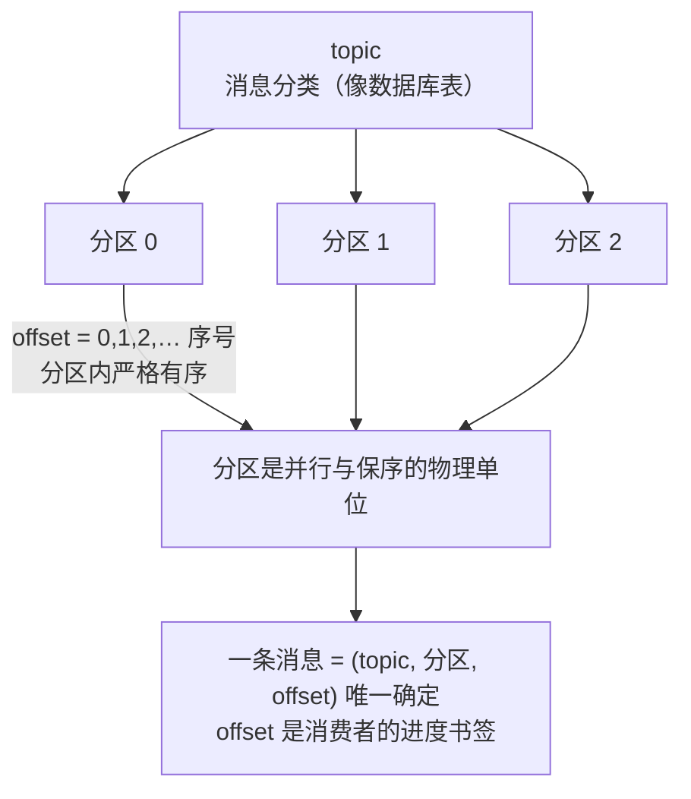
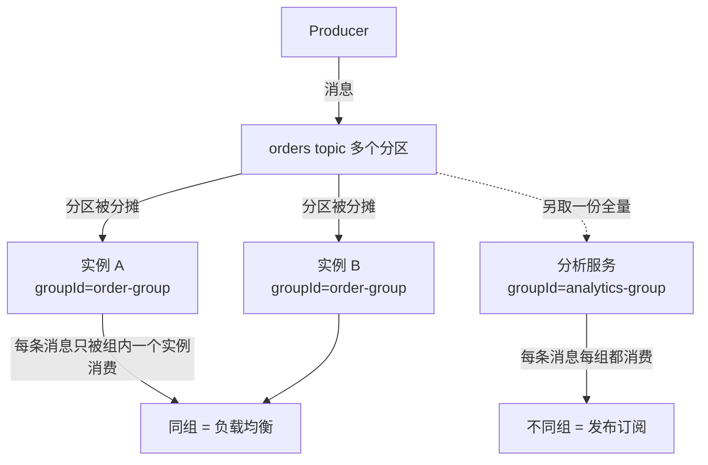
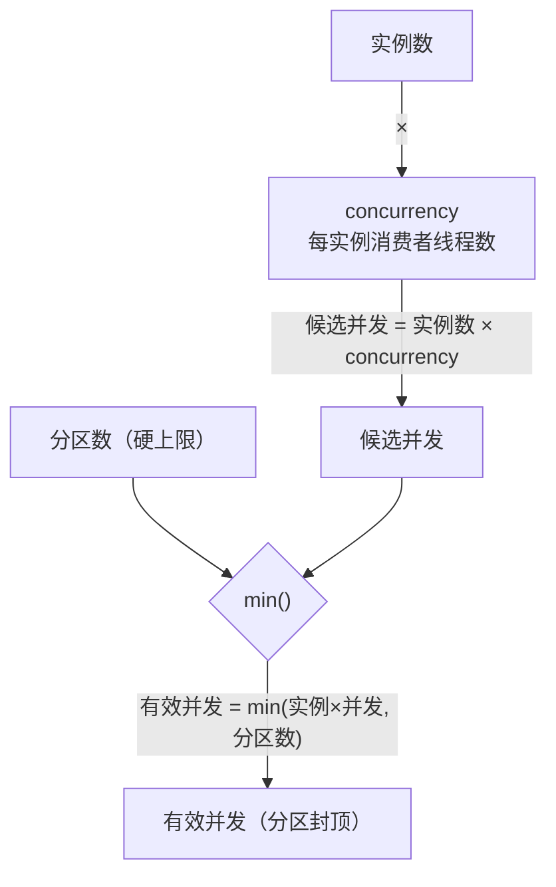

# Kafka 面试题与复盘（学完本专题的自测清单）

> 前面七篇是"学会"，这一篇是"检验自己会不会"。它不是堆题，而是帮你把七篇的知识**串成一张网**——每题都标了「核心要点 → 一句进阶 → 回哪篇复习」。
>
> **怎么用**：先别翻答案，在心里或纸上答一遍，再对「核心」。答不上的题，按「复习」回对应章节。全部能脱口而出，说明你真正掌握了。
>
> 定位对应：入门篇（概念）/ 进阶篇（调优）/ 事件驱动篇 / 生产级篇 / 实践篇（动手实践）/ 可靠性篇 / Connect 篇。

---

## 一、核心概念（topic / 分区 / offset / 消费组 / 副本 / ISR）

**Q1：topic、分区、offset 分别是什么？三者怎么协作？**
- 核心：topic 是消息的分类（像数据库表）；topic 被切成多个分区，分区是并行与保序的物理单位；offset 是分区内的消息序号，也是消费者的"进度书签"。一条消息 = (topic, 分区, offset) 唯一确定。

- 展开：Kafka 是一个**可重放的日志**——offset 不消费即删，新消费组可以从头再读，这是它和"即取即删"队列的本质区别。
- 复习：入门篇 第 2 章

**Q2：为什么分区能让 Kafka 并行？并行的上限是什么？**
- 核心：同一个分区内消息严格有序，但**不同分区之间互不约束**，可以并行读写。一个 topic 的并行上限 = 分区数；消费者实例再多，每个分区同一时刻也只能被一个实例消费。
- 展开：顺序和并行是同一个分区的两面——你要并行就得多分区，要全局严格有序就只能单分区（并行度塌方）。
- 复习：入门篇 第 2.2 节 / 进阶篇 进阶第 1.3 节

**Q3：为什么"同 key 的消息一定有序"？key 是怎么起作用的？**
- 核心：分区器对 key 做哈希（`key.hashCode() % 分区数`），**同 key 必然进同一分区**，而同一分区内消息严格有序。所以"按订单号做 key"就能保证同一订单的所有事件按顺序被消费。
- 展开：分区数一变（扩容）哈希结果就变，同 key 会落去不同分区——**扩容会破坏既有顺序**，扩容要提前规划。
- 复习：入门篇 第 9.3 节 / 进阶篇 进阶第 1.3 节

**Q4：消费组是什么？组内和组外各是什么语义？**
- 核心：同一消费组内的实例**分摊**一个 topic 的分区（每条消息只被组内一个实例消费 → 负载均衡）；不同消费组各拿一份完整副本（每条消息每组都消费 → 发布订阅）。`group.id` 一样就是同一组。

- 展开：**一个分区同一时刻只能被组内一个实例消费**，所以组内并发上限 = 分区数；扩实例未必提速，扩分区才行。
- 复习：入门篇 第 2.4 节 / 事件驱动篇 第 5 章

**Q5：副本和 ISR 是干什么的？ISR 少了会怎样？**
- 核心：每个分区有 leader + 若干 follower 副本，leader 负责读写，follower 同步数据做高可用。**ISR = 与 leader 保持同步的副本集合**；只有 ISR 里的副本才有资格在 leader 挂掉时接任。
- 展开：ISR 收缩（follower 同步落后太多被踢出）意味着容错能力下降；如果 ISR 只剩 leader 自己，那这个分区就"单点"了，极端下会丢数据。
- 复习：进阶篇 进阶第 1.6 节

**Q6：at-least-once（至少一次）是从哪来的？为什么它必然导致重复消费？**
- 核心：消费者**先处理后提交 offset**（默认处理成功才提交），如果"处理完 → 提交前"进程崩溃，重启后 offset 还在原位，同一条消息会被再处理一次 → 至少一次。不丢，但可能重复。
- 展开：at-least-once 是 Kafka 消费端的默认形态，它的代价由**消费端幂等**来兜底——这是 Kafka 可靠性的第一性原理。
- 复习：可靠性篇 第 1 章

---

## 二、生产 / 消费编程（KafkaTemplate / @KafkaListener / ack）

**Q1：`KafkaTemplate.send()` 是异步的，直接调完不管会丢消息吗？**
- 核心：会。`send()` 默认异步返回 `CompletableFuture`，如果发送失败（broker 不可达、超时）而你不关心结果，消息就静默丢了。要么 `get()` 同步等待结果，要么给 future 挂回调 / 设置 `spring.kafka.producer.retries` + 幂等生产者兜底。
- 展开：生产级做法是"发送失败进补偿/Outbox 重投"，而不是在业务线程里 `get()` 阻塞。
- 复习：入门篇 第 4.2-4.3 节 / 进阶篇 进阶第 2.1 节

**Q2：`@KafkaListener` 怎么指定消费组？一个实例的并发上限是多少？**
- 核心：`@KafkaListener(topics=..., groupId=...)` 指定组；或统一配 `spring.kafka.consumer.group-id`。监听器并发由 `concurrency` 决定（每个线程对应一个消费者），**但并发上限受分区数约束**——分区只有 3 个，开 10 个线程也只消费 3 个分区。
- 展开：多实例部署时总并发 = 实例数 × concurrency，但同样被分区数封顶；想提速先加分区。
- 复习：入门篇 第 5.2 节 / 进阶篇 进阶第 2.2 节

**Q3：手动 ack 什么时候才需要用？`ack-mode` 都有哪些？**
- 核心：默认自动提交（`ack-mode: record`，每处理完一条就提交）在大多数业务够用。**手动 ack 用于"处理完成之前绝不提交 offset"的精确场景**，比如要把消息写库且要保证不丢，处理逻辑成功后才 `acknowledgment.acknowledge()`。
- 展开：手动 ack 是把"至少一次"和"重复消费"的权衡交到你自己手里——手动了就必须自己处理失败不 ack 的补偿逻辑，别为了用而用。
- 复习：入门篇 第 8.3 节 / 实践篇 阶段 10

**Q4：批量监听怎么做？一次处理一批有什么好处和坑？**
- 核心：参数改成 `List<ConsumerRecord>`（`@KafkaListener` 方法签名收 List 即进入批量模式），配合 `batch-mode` 配置。好处是吞吐高、能批量写库；坑是**一批里有一条失败会拖累整批**，需要更细的错误处理。
- 展开：批量监听 + 手动 ack 是"批量写库 + 精确 offset 提交"的经典组合，但要控制批次大小防止大事务。
- 复习：入门篇 第 8.1 节 / 实践篇 阶段 11

**Q5：消息处理失败怎么重试？重试用尽了怎么办？**
- 核心：用 `@RetryableTopic` + `@Backoff` 做阶梯重试（如 1s、2s、4s），重试期间消息在重试 topic 里，不阻塞主 topic 消费。**重试耗尽后自动进死信 topic（DLT）**，用专门的 `@KafkaListener` 兜底记录/告警。
- 展开：死信不是终点而是"人工/补偿入口"——看到 DLT 里有消息意味着有业务故障需要排查，而不是默默吞掉。
- 复习：入门篇 第 5.3-5.4 节 / 事件驱动篇 第 7 章

---

## 三、可靠性（不丢消息 / 恰好一次 / 重试死信）

**Q1：生产者端怎么做到"不丢消息"？要点组合是什么？**
- 核心：`acks=all`（等 ISR 全部确认）+ `retries`（自动重试，配合 `max.in.flight` 与幂等生产者保序）+ 开启 `enable.idempotence`（幂等生产者，重试不产生重复）。三者组合 = 生产者端"不丢不重"。
- 展开：`acks=all` 牺牲一点吞吐换可靠性；对账兜底（消费端计数 / 补偿表）是最后的保险。
- 复习：入门篇 第 9.1 节 / 可靠性篇 第 2 章

**Q2：幂等生产者（`enable.idempotence`）解决什么问题？它和事务生产者什么关系？**
- 核心：网络重试可能导致一条消息被 broker 收到多次而重复落盘。幂等生产者给每条消息带 PID+序列号，broker 对重复序列号去重，**解决"重试导致重复"**。它本质是单生产者内部的去重。
- 展开：幂等生产者是事务生产者的基础；事务生产者（`transactional.id`）把多条消息打包成一个原子事务，解决的是"多条消息要么全发要么全不发"。
- 复习：可靠性篇 第 2.2-2.3 节 / 实践篇 阶段 9

**Q3：怎么做到"恰好一次（Exactly-Once）"？一句话公式是什么？**
- 核心：**事务消息 + read_committed + 消费幂等**。生产端用事务把"写库 + 发消息"绑在一起，消费者隔离级别设 `read_committed`（只读已提交事务的消息），消费端用唯一键/状态机幂等去重——三者缺一不可。
- 展开：Kafka 事务不是万能药，跨系统（DB + Kafka）事务只能靠 Outbox/事务消息 + 消费幂等组合逼近"恰好一次"，别神话它。
- 复习：可靠性篇 第 2.1、2.7 节 / 生产级篇 方向 A

**Q4：消费端为什么必须幂等？有哪些落地做法？**
- 核心：at-least-once 保证"不丢但可能重复"，所以消费逻辑必须对重复输入无害。做法三选一：**DB 唯一键去重**（`@Id eventId`，最推荐）、**Redis setnx 去重**（无 DB 场景）、**状态机 CAS 抢占**（同业务用状态流转防重）。
- 展开：幂等要和重试配合——重试多少次都不会造成重复扣款，才是真的幂等。
- 复习：可靠性篇 第 1.3-1.6 节 / 事件驱动篇 第 4.3 节

**Q5：为什么不"无限重试"？重试和死信该怎么配合？**
- 核心：无限重试会让消息永久占用消费线程、拖垮吞吐，且如果错误是"数据本身有问题"（如反序列化失败、字段缺失），重试一万次也没用。所以策略是**有限次阶梯重试 → 进 DLT → 人工/补偿兜底**。
- 展开：反序列化失败要单独用 `ErrorHandlingDeserializer` 兜底，否则一条坏消息能卡死整个消费组。
- 复习：入门篇 第 5.4-5.5 节 / 可靠性篇 第 3.3 节

---

## 四、性能与调优（分区 / 并发 / 压缩）

**Q1：分区数怎么定？三个约束分别是什么？**
- 核心：**吞吐约束**（分区越多并行度越高）＋ **顺序约束**（要全局有序就只能 1 分区）＋ **热分区约束**（key 分布不均会把流量压在一个分区上，分区再多也白搭）。经验法则是先定一个合理基数（如 3-6），按流量和并发上限算。
- 展开：分区数一旦定下来再扩容，会破坏 key 哈希的既有顺序——所以宁可偏多，不要频繁改。
- 复习：生产级篇 方向 C.5-C.7

**Q2：消费者并发度怎么算？`concurrency` 和分区数什么关系？**
- 核心：`concurrency` 决定消费者线程数，但**同一消费组内一个分区同一时刻只能被一个消费者消费**，所以有效并发 = min(实例数 × concurrency, 分区数)。分区是硬上限，加实例不加分区 = 白加。

- 展开：三个场景实测并行度：分区 3 + 并发 10 = 最多 3；分区 3 + 3 实例各并发 1 = 3；分区 10 + 3 实例各并发 4 = 10（3×4 超了被分区封顶到 10）。
- 复习：生产级篇 方向 C.2-C.3 / 进阶篇 进阶第 2.2 节

**Q3：单分区 topic 有什么陷阱？**
- 核心：单分区 = 完全有序，但**并行度永远是 1**（Kafka 官方 issue #2645 里有明确的坑：某些客户端单分区消费会退化）。如果业务其实不需要全局有序，单分区会白白牺牲吞吐。
- 展开：多分区 + 合理 key 是"保序 + 并行"的平衡点；全局有序需求极少，先质疑需求再上单分区。
- 复习：生产级篇 方向 C.4

**Q4：消息压缩选哪个？什么时候压缩值得？**
- 核心：生产者 `compression.type` 可选 `gzip`/`snappy`/`lz4`/`zstd`。**大消息、文本型 JSON、高吞吐**场景压缩收益明显；`snappy`/`lz4` 平衡 CPU 和压缩比，`zstd` 压缩比最高但更耗 CPU，`gzip` 慢。
- 展开：压缩在 producer 侧做、consumer 侧自动解压，对小消息（<1KB）压缩反而可能亏——权衡点是消息体积 × 量。
- 复习：进阶篇 进阶第 2.1 节

**Q5：热分区（Hot Partition）问题是什么？怎么处理？**
- 核心：key 分布不均（如一个大客户的订单全用一个 key）导致某分区消息量远超其他分区，形成"单分区瓶颈"。定位看分区消费 Lag 差异；解决方向：**换 key 粒度**（加随机后缀但牺牲顺序 / 按客户分桶）、提高该分区消费并发（有限）、或拆 topic。
- 展开：热分区是"顺序"和"均衡"的根本冲突——要保序就没法完全均衡，架构上要选边站。
- 复习：生产级篇 方向 C.6

---

## 五、架构 / 事件驱动（事件总线 / Saga / Outbox / 选型）

**Q1：为什么用 Kafka 做事件总线？和 RPC 调用（同步接口）比有什么本质区别？**
- 核心：Kafka 解耦的是**时间和空间**——生产者不关心谁在消费、什么时候消费，消费者随时可以订阅或重放历史。RPC 是"你等我"，事件是"我发了就不管"。Kafka 是一个**可重放、可并行、多订阅的日志**。
- 展开：事件总线的代价是最终一致性和排查变难（没有调用栈），所以事件驱动系统必须有可观测性（traceparent 链路）兜底。
- 复习：事件驱动篇 第 0 章 / 进阶篇 进阶第 5 章

**Q2：Saga 是什么？失败时怎么"回滚"？**
- 核心：Saga 是**长事务拆成多个本地事务 + 补偿**。订单/库存/支付三个服务各做各的本地事务，任何一个失败，就反向执行**补偿操作**（如"库存预留成功 → 订单取消时释放库存"）。补偿代码就是普通消费者，监听到取消事件就回滚。
- 展开：Saga 没有分布式锁、没有全局 ACID，靠的是**每一步都可补偿**的精心设计——补偿失败还要有重试和人工兜底。
- 复习：事件驱动篇 第 6 章 / 进阶篇 进阶第 5.6 节

**Q3：Outbox 模式解决什么问题？两种实现是什么？**
- 核心：解决"**写数据库 + 发事件**"的原子性——如果先写库后发消息、发消息失败，库里有数据但事件丢了。Outbox 把要发的事件先和业务数据**同一个本地事务写进 outbox 表**，再由独立投递器保证最终发到 Kafka。
- 展开：两种实现：**轮询投递**（Polling Publisher，简单、新手推荐）和 **CDC**（Debezium 读 binlog，优雅但更重）。消费者侧配合幂等表，事件至少一次且不重复。
- 复习：生产级篇 方向 A

**Q4：幂等表在事件驱动架构里解决什么问题？它和 Outbox 是什么关系？**
- 核心：幂等表保证**同一事件只被消费生效一次**（唯一键 `eventId` 挡住重复）。它解决的是消费端的重复，Outbox 解决的是生产端的丢失——**Outbox（不丢）+ 幂等表（不重）= 生产到消费的"至少一次且不重复"**。
- 展开：幂等表是事件驱动系统里最便宜的可靠性投资，03 实战里它就是生产级的分水岭。
- 复习：事件驱动篇 第 4.3 节 / 生产级篇 方向 A.5

**Q5：Kafka 和 RabbitMQ 怎么选？**
- 核心：**Kafka** = 高吞吐、可重放、多消费者组、日志型，适合事件流、数据管道、解耦总线；**RabbitMQ** = 灵活路由（exchange）、低延迟、传统任务队列、优先级/延迟队列等丰富特性，适合请求-响应的任务分发。
- 展开：选型的本质是看需求是"日志/流"还是"任务/队列"——以及要不要重放和长期留存。
- 复习：入门篇 第 7 章

---

## 六、Kafka Streams / 进阶（流式 / 窗口 / 选型）

**Q1：Kafka Streams 和 `@KafkaListener` 的本质区别？什么时候该用 Streams？**
- 核心：`@KafkaListener` 是"拉一条处理一条"的**命令式消费**；Kafka Streams 是**声明式流处理**（`KStream`/`KTable` DSL），自带状态存储、窗口、聚合、KTable 联接，把"消费-计算-再产出"封装成拓扑。要**实时聚合、计数、join、开窗统计**时用 Streams。
- 展开：Streams 是"有状态的流式计算框架"，普通业务消息用 `@KafkaListener` 就够了，别杀鸡用牛刀。
- 复习：进阶篇 进阶第 3.1、3.6 节

**Q2：窗口（Windowing）是什么？有哪些基本类型？**
- 核心：流是无限的，窗口把无限流**切成有限的时间片**去做聚合（如"每分钟的订单金额"）。常见类型：**tumbling**（固定不重叠）、**hopping**（固定步长可重叠）、**sliding**（按事件时间滑动的变化窗口）、**session**（按活动间隙分组）。
- 展开：选窗口类型本质是选"业务时间边界怎么切"——实时报表用 tumbling，连续会话分析用 session。
- 复习：进阶篇 进阶第 3.5 节

**Q3：`KStream` 和 `KTable` 的区别？**
- 核心：`KStream` 是**事件流**（每来一条就输出一条，记录的是"发生的事"）；`KTable` 是**状态/变更日志**（同 key 只保留最新值，记录的是"当前长什么样"）。词频统计就是 KStream 进来、聚合后变成 KTable。
- 展开：`KTable` 背后是 **state store**（可做交互式查询），这是 Streams 能做"当前状态"类应用的根基。
- 复习：进阶篇 进阶第 3.2、3.4 节

**Q4：Kafka Streams 和 Flink 怎么选？什么时候该上 Flink？**
- 核心：**Kafka Streams** 是"库"，嵌在你的 Java 应用里，零额外集群，适合 Kafka 生态内的中轻量流计算；**Flink** 是独立集群的**重型流处理引擎**，适合大规模、低延迟、复杂事件时间语义（watermark、exactly-once、跨 Kafka 的多源 join）。
- 展开：判据是"数据量 × 复杂度 × 是否要独立集群"——单机应用内能算的用 Streams，公司级实时数仓、复杂窗口/状态才上 Flink。
- 复习：进阶篇 进阶第 3 章 + 本专题配套 Kafka-Streams 流处理专题

**Q5：Kafka 事务和数据库事务一起用，最大的坑是什么？**
- 核心：Kafka 事务只能保证"消息到 Kafka"的原子性，**管不到数据库**——`@Transactional` 里发消息，如果 DB 提交成功而 Kafka 发送失败，事务会一起回滚，但如果 DB 提交失败而消息已发，Kafka 那边的消息不会跟着撤回。跨资源没有真正的分布式事务。
- 展开：业界解法是 **Outbox 模式**（DB 和事件同事务写库，投递失败可重投），比在代码里硬凑 Kafka 事务更可靠。
- 复习：可靠性篇 第 2.7 节 / 生产级篇 方向 A

**Q6：Kafka Connect 是什么？它和直接用 `KafkaTemplate` 发消息有什么区别？**
- 核心：Kafka Connect 是**独立的 Kafka 数据管道进程**，用现成或自定义的 **Source connector（把外部数据搬进 Kafka）** 和 **Sink connector（把 Kafka 消息搬出去）** 批量搬运数据，自带 offset 管理、converter（Json/Avro）和错误容忍（死信）。
- 展开：区别在"谁在搬"——`KafkaTemplate` 是**业务代码主动发**，Connect 是**旁路的管道进程**替你把数据库表/文件/另一个系统持续同步进 Kafka；要"把 MySQL 数据灌进 Kafka"这类管道场景直接上 Connect，别自己写轮询代码。
- 复习：Connect 篇 第 1 章（Source vs Sink）、第 6 章（幂等/死信/多 worker）

---

## 复盘清单：10 个你该能脱口而出的结论

1. **at-least-once → 消费者必须幂等**。Kafka 不丢但可能重复，去重是消费端的基本功。
2. **分区 = 并行单位 = 顺序边界**。同 key → 同分区 → 有序；要并行就多分区，要全局有序就只能单分区。
3. **消费组内负载均衡、组间发布订阅**。`group.id` 一样就是一组，一组内一条消息只被消费一次。
4. **生产者端不丢不重 = `acks=all` + 重试 + 幂等生产者**。三者组合，缺一个都不完整。
5. **恰好一次 = 事务消息 + read_committed + 消费幂等**。是"组合拳"，不是单个开关。
6. **消费者并发被分区数封顶**：有效并发 = min(实例数 × concurrency, 分区数)。
7. **重试要配死信（DLT）兜底**。有限次阶梯重试 → 死信 → 人工/补偿，别无限重试卡死消费组。
8. **Outbox 解决"写 DB + 发事件"的原子性**；配幂等表 = 生产不丢 + 消费不重。
9. **Kafka 是"可重放的日志"不是"即取即删的队列"**——offset 可以重置，历史可以重读，这是它做事件总线的根基。
10. **手动 ack 只在"处理完才允许提交"时才用**；默认自动提交对大多数业务够用。

---

## 自测场景：3 个真实问题，先自己想思路再看提示

### 场景 1：用户说"订单扣款扣了两次"，怎么排查？

**思路**：扣款发生在"支付服务消费事件"的处理器里，重复扣款 = 同一条 `OrderCreated`（或支付事件）被消费了两次且消费端不幂等。
排查链路：
1. 看消费组 `kafka-consumer-groups --describe` 的 LAG 和 offset，确认有没有重复消费（offset 回退/重试）。
2. 看支付表里有没有同 `eventId` 的两条扣款记录——有，则消费端没按 eventId 去重。
3. 检查支付事件消费代码有没有唯一键约束 / Redis setnx / 状态机 CAS。
4. 修法：给支付流水加 `eventId` 唯一索引（`@Id eventId`），重复消费直接插入失败被吞掉；回查 06 第 1 章三种幂等方案。
- 复习：可靠性篇 第 1.2-1.5 节

### 场景 2：线上 LAG（积压）飙升，消费者忙不过来，怎么处理？

**思路**：先分清"消费者处理慢"还是"生产量暴增"还是"消费者死了"。
1. `kafka-consumer-groups --describe` 看各分区 LAG：若所有分区 LAG 均匀涨 → 整体处理能力不足；若个别分区 LAG 猛涨 → 热分区。
2. 消费者没死但处理慢 → 加**分区数**（同时扩消费者实例，因为并发被分区封顶）。
3. 热分区 → 换 key 粒度/按业务分桶，见 04 方向 C.6。
4. 别盲目加实例——分区只有 3 个，加 10 个实例也没用。
- 复习：生产级篇 方向 C / 实践篇 阶段 10

### 场景 3：同一订单的 `created → paid → shipped` 三条消息消费时乱序了，可能原因是什么？

**思路**：顺序靠"同 key 进同分区"保证，乱序说明 key 或分区出问题了。
1. 确认发送时三条消息用的是**同一个 key**（如订单号）——用了随机 key 或没指定 key 就会散到不同分区。
2. 确认分区数有没有中途改过——扩容后同 key 哈希落点变了，历史消息和新增消息可能在不同分区。
3. 确认消费者**并发是否超过单分区线程数**，以及有没有重试乱序（重试会导致后到的先被处理，除非配合顺序保证）。
4. 排查顺序性诉求是否真的需要全局有序——大多数场景"同订单有序"用同 key 就够。
- 复习：入门篇 第 9.3 节 / 生产级篇 方向 C.5

---

> 全部答完、复盘清单能背、场景题能说出思路，恭喜——你已具备用 Kafka 设计事件驱动系统的实战能力。
