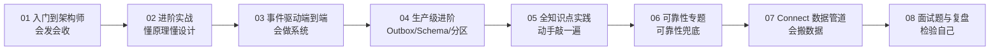

# Kafka 消息队列实战专题（学习顺序）

本文件夹是**用 Spring Boot 直接操作 Kafka（`spring-boot-starter-kafka`）**学习消息队列与事件驱动系统的完整路径，从零基础到能独立设计事件驱动系统。**严格按 01→07 顺序读**，这是一个精心设计的能力阶梯。

> **本专题前身是"Spring Cloud Stream 专题"，已统一改为直接 Kafka**。企业级开发大多是 Kafka-only、且 Stream 的抽象（换中间件不改代码）在直接用 Kafka 时收益有限（详见 01 文档第 10 章"该不该用 Stream"），所以**本专题一律用 `spring-boot-starter-kafka`（`KafkaTemplate` 发 / `@KafkaListener` 收）**，Stream 专属内容（Binder 抽象、RabbitMQ、多 binder）已移除。若你确实需要 Stream 抽象，参考 [Kafka 专题](../Kafka工具与运维专题/) 与 [35 号文档](../../tutorials/spring-ai-2.0/35-管数分离实战-从Sinks到Kafka演进.md) 的手写 Kafka 对比。

| 顺序 | 文档 | 你将达到的水平 |
|:---:|------|--------------|
| **01** | [Kafka 消息队列从入门到架构师](./01-Kafka消息队列从入门到架构师.md) | **会发会收**。`KafkaTemplate`/`@KafkaListener`、topic/分区/offset/消费组、重试、死信——"会用" |
| **02** | [Kafka 进阶实战](./02-Kafka进阶实战.md) | **懂原理懂设计**。Kafka 地基（topic/分区/offset/消费组）、生产调优、Kafka Streams 流式计算、事件驱动架构（EDA） |
| **03** | [事件驱动微服务端到端实战](./03-事件驱动微服务端到端实战.md) | **会做系统**。把前两篇的知识装成一个能跑的事件驱动微服务（订单/库存/支付），落地 Saga 补偿事务、幂等表、消费组隔离 |
| **04** | [生产级进阶：Outbox 与 Schema 与分区调优](./04-生产级进阶-Outbox与Schema与分区调优.md) | **做成生产级**。Outbox 模式（写DB+发事件原子化）、Schema Registry（事件版本演进）、分区深度调优（并发/顺序/热分区） |
| **05** | [Kafka 全知识点实践项目](./05-全知识点实践项目.md) | **动手敲一遍**。每个 API 一段可跑代码：KafkaTemplate 发、@KafkaListener 收、消费组、重试死信、事务、分区、Schema Registry、可观测 |
| **06** | [Kafka 可靠性专题](./06-Kafka可靠性专题.md) | **可靠性兜底**。把"消息可靠性"写对：幂等消费去重、恰好一次（EOS）全链路、延迟消息、请求-响应、可观测性埋点，每章可抄的代码 |
| **07** | [Kafka Connect 数据管道](./07-KafkaConnect数据管道.md) | **会搬数据**。Kafka Connect Source/Sink 独立进程数据管道，把数据批量搬进/搬出 Kafka，管道里的幂等去重兜底 |
| **08** | [Kafka 面试题与复盘](./08-Kafka面试题与复盘.md) | **检验自己**。32 道常见面试题（概念/编程/可靠性/调优/架构/Streams），每题带要点 + 复习指引，巩固 01-07 |

> **七篇的递进关系**：01 讲"零件"（一个个 API）→ 02 讲"原理和设计思维"（为什么这么做）→ 03 讲"装一辆能跑的车"（组装成系统）→ 04 讲"做成生产级"（Outbox/Schema/分区）→ 05 动手把每个 API 敲一遍 → 06 把"消息可靠性"写对（幂等/恰好一次/延迟消息/请求-响应）→ 07 把数据搬进/搬出 Kafka（Kafka Connect 数据管道）。**不要跳读**，后面依赖前面。
>
> **前置**：建议先有 [Reactor 响应式入门](../Reactor响应式编程/01-Reactor响应式入门.md) 的基础（WebFlux/响应式应用会用到）。

**能力阶梯**：01→08 每一步都站在前一步的肩膀上：

---

## 动手实践：敲一遍每个 API

读完上面 01-04 的理论，想**把 Kafka 的每个知识点都动手敲一遍**？这份文档用代码走完 Kafka 全部能力——`KafkaTemplate` 发、`@KafkaListener` 收、消费组、重试死信、事务、分区、Schema Registry，每章一段可跑代码 + 验证方法：

➡️ **[Kafka 全知识点实践项目](./05-全知识点实践项目.md)**

它是 01-04 的**动手实践版**：理论在专题里，代码在这里。全部练完，对 Kafka 就是"既懂原理、又敲过每一行代码"的熟练状态。
