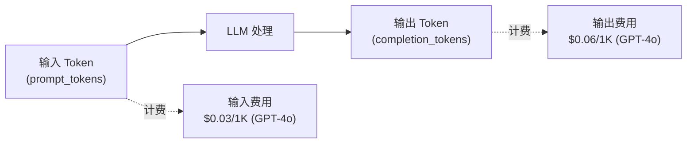

# 附录 · OpenAI API 速成

> 速查参考，聚焦 Agent 开发中常用的 API 模式。

---

## 核心概念

OpenAI API 是 LLM 应用的事实标准接口。Spring AI 底层调用 OpenAI 兼容接口（大部分国产模型也兼容）。

## 基础调用

### 同步对话

```bash
curl https://api.openai.com/v1/chat/completions \
  -H "Content-Type: application/json" \
  -H "Authorization: Bearer $API_KEY" \
  -d '{
    "model": "gpt-4o",
    "messages": [
      {"role": "system", "content": "你是一个助手"},
      {"role": "user", "content": "你好"}
    ]
  }'
```

### 流式对话（SSE）

```bash
curl https://api.openai.com/v1/chat/completions \
  -H "Content-Type: application/json" \
  -H "Authorization: Bearer $API_KEY" \
  -d '{
    "model": "gpt-4o",
    "messages": [{"role": "user", "content": "讲个故事"}],
    "stream": true
  }'
```

### 工具调用（Function Calling）

```json
{
  "model": "gpt-4o",
  "messages": [{"role": "user", "content": "北京天气怎么样？"}],
  "tools": [{
    "type": "function",
    "function": {
      "name": "get_weather",
      "description": "查询天气",
      "parameters": {
        "type": "object",
        "properties": {
          "city": {"type": "string"}
        },
        "required": ["city"]
      }
    }
  }]
}
```

## 关键参数

| 参数 | 默认值 | 说明 |
|------|--------|------|
| `temperature` | 1.0 | 0=确定性，2=最随机 |
| `max_tokens` | inf | 最大输出 token |
| `top_p` | 1.0 | 核采样，替代 temperature |
| `frequency_penalty` | 0 | 惩罚重复词 |
| `stop` | null | 遇到停止序列就停止 |
| `response_format` | text | `{"type":"json_object"}` 强制 JSON |

## Token 计费



## 常用模型对比（2026）

| 模型 | 输入 $/1K | 输出 $/1K | 上下文 | 适用 |
|------|----------|----------|--------|------|
| gpt-4o | 0.0025 | 0.01 | 128K | 通用最佳 |
| gpt-4o-mini | 0.00015 | 0.0006 | 128K | 低成本 |
| o3 | 0.015 | 0.06 | 200K | 深度推理 |
| text-embedding-3-small | 0.00002 | - | 8K | 嵌入 |
| text-embedding-3-large | 0.00013 | - | 8K | 高质量嵌入 |

## Spring AI 对应

| OpenAI API | Spring AI |
|------------|-----------|
| `POST /v1/chat/completions` | `chatClient.prompt().user(q).call()` |
| `stream: true` | `.stream().content()` |
| `tools` | `@Tool` 注解 + `.tools()` |
| `response_format: json_object` | `.user(q + "以 JSON 格式回复")` |
| Embedding | `embeddingModel.embed(text)` |
