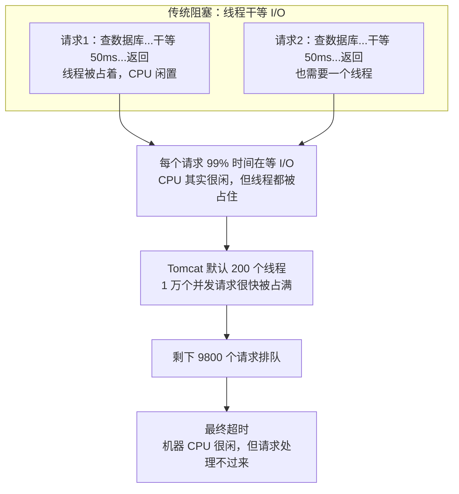
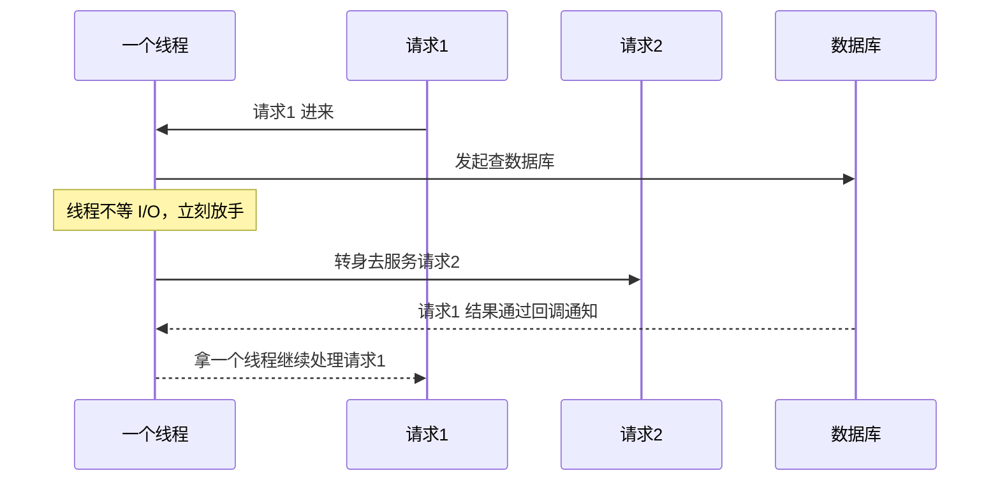
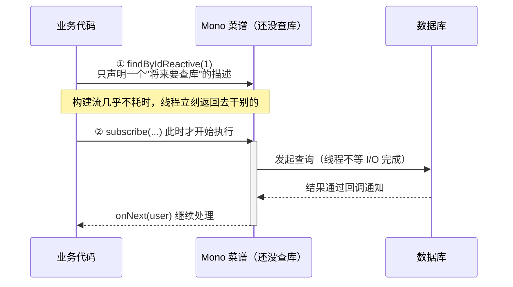
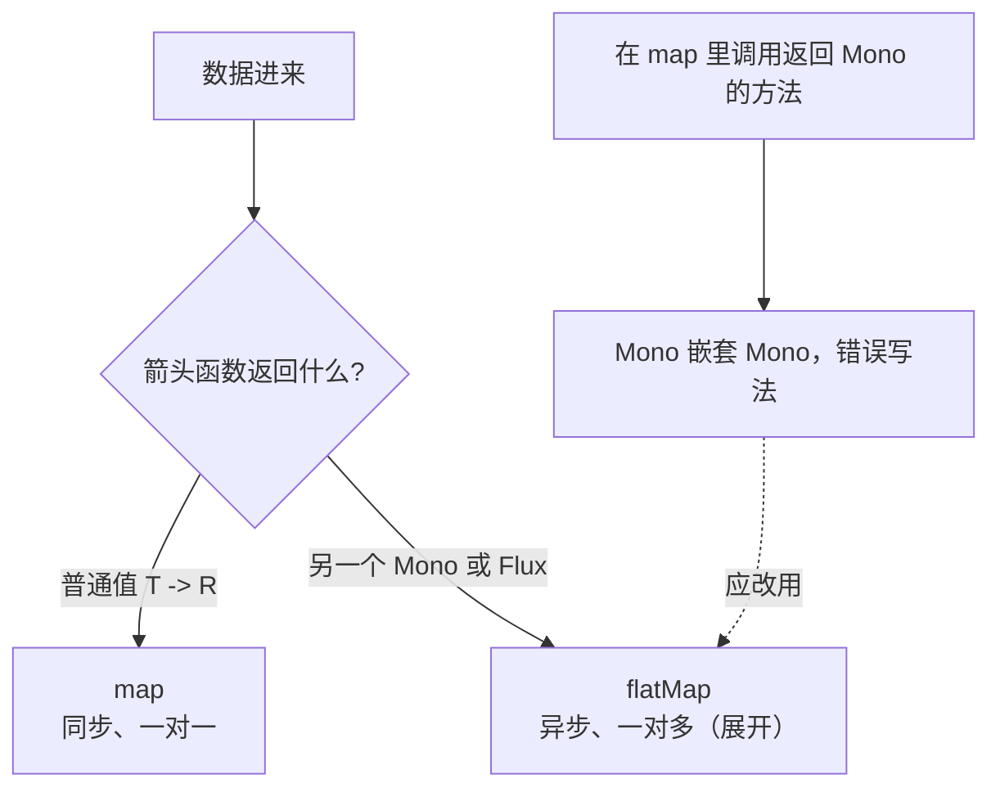
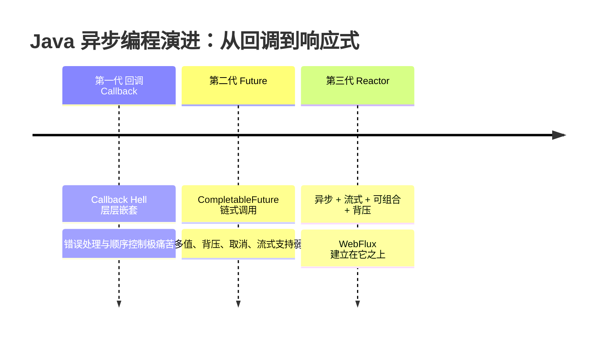
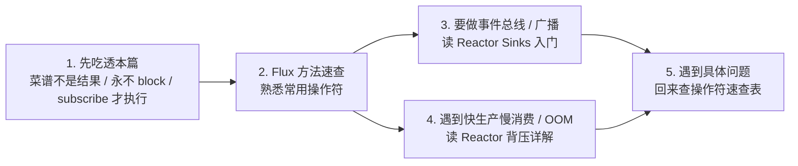

# Reactor 响应式编程入门（从"为什么"到心智模型）

> **配套文档**：本系列教程大量使用 Reactor（`Mono`/`Flux`/`Sinks`），但附录里的 [Flux方法速查](./02-Flux方法速查.md)、[Reactor Sinks入门](./03-Reactor-Sinks入门.md)、[Reactor背压详解](./04-Reactor背压详解.md) 都是从"具体操作符"讲起，**缺一篇回答根本问题的入门**——为什么用响应式？跟传统写法到底差在哪？`Mono`/`Flux` 是个什么东西？本篇就是那个"地基"，建议**最先读这一篇**，再去看那三篇。
>
> **难度假设**：你会写传统 Spring MVC（`@RestController` + `return 对象`），但第一次接触 WebFlux、`Mono`、`Flux`，觉得"这玩意到底在干嘛"。

---

## 第 1 章：一个困扰所有人的问题——为什么要搞响应式

### 1.1 先看传统写法长什么样

传统 Spring MVC（Tomcat）里一个接口：

```java
@GetMapping("/user")
public User getUser() {
    User u = userDao.findById(1);      // ① 阻塞：线程停在这里等数据库返回
    return u;
}
```

它跑在**一个 Tomcat 线程**上。关键点：`findById` 这一步，线程是**干等**的——CPU 啥也没干，就在那等着数据库的网络响应回来。等待期间，**这个线程被占着**，干不了别的。

### 1.2 传统模式的瓶颈

Tomcat 默认有 200 个线程。意思是：**最多同时处理 200 个请求**。

- 如果每个请求都在做**CPU 密集计算**（比如排序、加密），那 200 个线程 = 200 核 CPU 在干活，很合理。
- 但绝大多数业务请求是 **I/O 密集**——等数据库、等下游 HTTP、等 Redis。**线程 99% 的时间在"干等"**，CPU 闲置。



**问题**：1 万个并发请求进来，200 个线程很快被占满，剩下 9800 个请求排队，最后超时。**机器 CPU 其实很闲，但请求就是处理不过来**——因为线程都在"等"，没法去服务新请求。

这就是传统阻塞模型的天花板：**并发能力被线程数限制，而线程是昂贵资源**（每个线程默认占 1MB 栈内存，线程切换有内核开销）。

### 1.3 响应式怎么破局

核心思想一句话：**线程不要"干等"，等的时候去干别的。**



线程发起 I/O 后**不等**，立刻去做别的；等数据回来时，**通过回调/事件**再继续处理。这样一个线程能"同时"服务成百上千个请求——**用很少的线程扛很高的并发**。

> **这种"线程不阻塞、事件驱动"的模式，就叫响应式（Reactive）。** Reactor 是它在 Java 世界的实现，WebFlux 是 Spring 把它做成的 Web 框架。

### 1.4 代价是什么

响应式不是免费的午餐：

- **心智负担重**：代码从"一步一步写"变成"声明数据流"，学习曲线陡。
- **调试困难**：调用栈不再线性，报错堆栈又长又乱。
- **生态要求全链路非阻塞**：你用了 WebFlux，但底层用了阻塞的 `JdbcTemplate`/`RestTemplate`，那响应式的优势全废——一个阻塞调用就把线程卡住了。所以必须用 `R2DBC`（响应式数据库）、`WebClient`（响应式 HTTP）、`ReactiveRedisTemplate` 等。

> **什么时候该用**：高并发 + I/O 密集（如网关、实时推送、LLM 流式）。本教程做 AI 流式输出（SSE 推 token），天然适合响应式。**普通 CRUD 后台管理系统，用传统 MVC 反而更简单**，别为了响应式而响应式。

---

## 第 2 章：Mono 和 Flux 到底是什么——建立心智模型

这是初学者最大的卡点。看完这章你就通了。

### 2.1 最关键的认知：Mono/Flux 是"菜谱"，不是"结果"

**传统写法**：调用一个方法，**立刻拿到结果**。

```java
User u = userDao.findById(1);   // u 就是那个 User 对象，已经在手里了
```

**响应式写法**：返回一个 `Mono<User>`，**你手里拿到的不是结果，是一张"未来会产出结果的说明书"**。

```java
Mono<User> u = userDao.findByIdReactive(1);   // u 不是 User，是"一个将来会产出 User 的东西"
```

> **比喻**：传统写法像**现做现卖的餐厅**——你点菜，厨师立刻做好端给你，你拿到的就是菜。
> `Mono` 像**取餐凭证**——你拿到一张小票，菜还没做好，但小票保证"将来会给你一道菜"。你拿着小票可以先干别的，等叫号了再去取。

### 2.2 Mono vs Flux——就一个数 vs 一串数

| | `Mono<T>` | `Flux<T>` |
|---|-----------|-----------|
| 产出 | **0 或 1** 个元素 | **0 到 N** 个元素 |
| 类比 | 一道菜（取餐凭证） | 一条传送带（持续送菜） |
| 典型 | 查单个用户、保存一条记录、一次 HTTP 调用 | 流式输出 token、查询结果列表、定时器 |

```java
Mono<User> one   = userDao.findById(1);        // 一个用户
Flux<User> all   = userDao.findAll();          // 一堆用户
Flux<String> tokens = llm.stream("写首诗");     // 一个一个吐字（流式）
```

**记忆**：Mono = 单数，Flux = 复数（流）。

### 2.3 为什么"菜谱"能扛高并发——延迟执行

还记得第 1 章说的"线程不干等"吗？`Mono`/`Flux` 是关键：

```java
Mono<User> u = userDao.findByIdReactive(1);   // ① 这一步没有真正查数据库！
//    只是"声明"了一个将来要做的动作。线程立刻返回，去干别的了。

u.subscribe(user -> System.out.println(user)); // ② 这里才真正开始执行（查库）
```

**第 ① 步几乎不耗时**——它只是构建了一个"将来要查数据库"的描述对象。真正发起 I/O 是在第 ② 步 `subscribe`（订阅）时。

这就是响应式能扛并发的根本：**构建流的代码不阻塞，只有订阅时才执行，且执行时线程不等 I/O 完成**。

> **铁律**：一个 `Mono`/`Flux` 如果**没人 subscribe 它，它就永远不会执行**。这是初学者最常踩的坑——辛辛苦苦写了一串 `.map().flatMap()`，发现"没生效"，因为忘了 subscribe（或忘了 return 让框架去 subscribe）。

**核心时序**：



---

## 第 3 章：写法对比——把命令式脑子切换过来

### 3.1 传统 vs 响应式：同样的逻辑两种写法

需求：根据用户 ID 查用户，取名字，转大写，返回。

**传统（命令式，一步一步）**：

```java
public String getUserNameUpper(int id) {
    User u = userDao.findById(id);          // 第1步
    if (u == null) return "UNKNOWN";        // 第2步
    return u.getName().toUpperCase();       // 第3步
}
```

**响应式（声明数据流，一步套一步）**：

```java
public Mono<String> getUserNameUpper(int id) {
    return userDao.findByIdReactive(id)              // 第1步：一个将来产 User 的 Mono
            .map(User::getName)                       // 第2步：拿到后取名字（map = 转换）
            .map(String::toUpperCase)                 // 第3步：转大写
            .defaultIfEmpty("UNKNOWN");               // 空了给默认值
}
```

**区别的本质**：

- 命令式是**"指令序列"**——告诉电脑"先做A，再做B，再做C"。
- 响应式是**"数据流水线"**——描述"数据进来后，经过这些工序变成什么"。**数据还没来，流水线先搭好**。

### 3.2 map vs flatMap——最高频的两个操作，必须分清

| | `map` | `flatMap` |
|---|-------|-----------|
| 箭头函数返回 | 普通**值** `T -> R` | 另一个 **Mono/Flux** `T -> Mono<R>` |
| 性质 | 同步、一对一 | 异步、一对多（展开） |
| 何时用 | 纯内存转换（取属性、算值） | 又要调一个**返回 Mono/Flux 的异步操作** |

**最容易犯的错**：在 `map` 里调了一个返回 `Mono` 的方法：

```java
// ❌ 错：map 里返回 Mono，结果变成 Mono<Mono<User>>，嵌套了！
orderDao.findById(id)
    .map(order -> userDao.findByIdReactive(order.getUserId()));   // Mono<Mono<User>> 😱

// ✅ 对：用 flatMap，自动把内层 Mono"拍平"
orderDao.findById(id)
    .flatMap(order -> userDao.findByIdReactive(order.getUserId()));  // Mono<User> ✅
```

**记忆口诀**：

- 里面写的是 `x -> 值` → 用 `map`
- 里面写的是 `x -> 某个异步操作（返回 Mono/Flux）` → 用 `flatMap`

> 更多操作符（filter、doOnNext、onErrorResume……）见 [Flux方法速查](./02-Flux方法速查.md)，那篇有 73 个方法的逐个示例。

**选型决策**：



---

## 第 4 章：WebFlux 项目里你该怎么写

### 4.1 Controller 直接返回 Mono/Flux

```java
@RestController
public class UserController {

    @GetMapping("/user/{id}")
    public Mono<User> user(@PathVariable int id) {
        return userDao.findByIdReactive(id);   // 直接 return Mono，框架自动 subscribe
    }

    @GetMapping(value = "/users/stream", produces = MediaType.TEXT_EVENT_STREAM_VALUE)
    public Flux<String> stream() {
        return Flux.interval(Duration.ofSeconds(1)).map(i -> "tick " + i);  // SSE 流
    }
}
```

**关键**：你 `return` 一个 `Mono`/`Flux`，**Spring 框架替你 subscribe**。你不需要自己写 `.subscribe()`。框架订阅后，数据流才真正跑起来，最后把结果/流写回 HTTP 响应。

### 4.2 铁律：WebFlux 项目里绝不能 block

`block()` 是"阻塞着等结果"——它把响应式的"菜谱"强行变成"现做现卖"，**把当前线程卡住等**。

```java
// ❌ WebFlux 项目里的灾难
@GetMapping("/user/{id}")
public Mono<String> bad(@PathVariable int id) {
    User u = userDao.findByIdReactive(id).block();   // 把线程卡住了！
    return Mono.just(u.getName());
}
```

WebFlux 只有很少几个线程（默认 CPU 核数个），你一 `block`，线程被占住干等，整个并发模型就崩了——这正是第 1 章说的"线程干等"的老问题。

**正确做法**：永远在流里链式处理，不跳出响应式世界：

```java
// ✅ 永远在 Mono/Flux 链里
@GetMapping("/user/{id}")
public Mono<String> good(@PathVariable int id) {
    return userDao.findByIdReactive(id).map(User::getName);
}
```

> **实在要调阻塞 API 怎么办**（比如某个老库只有阻塞驱动）：用 `Mono.fromCallable(...).subscribeOn(Schedulers.boundedElastic())`，把它丢到一个专门容纳阻塞任务的弹性线程池，别污染主线程。

### 4.3 什么时候才需要手动 subscribe

绝大多数时候**不需要**——Controller return 出去框架就订阅了。只有这些场景你会手动 subscribe：

- **事件总线/后台任务**：不经过 Controller，要自己启动流。比如定时器、监听消息队列。
- **fire-and-forget**：触发一个动作但不关心结果。

```java
// 发完即忘（比如发个通知，不等结果）
notificationService.notify(userId).subscribe(
    ok -> {},
    err -> log.error("通知失败", err)   // 至少要把错误 log 出来，否则静默吞掉
);
```

> 详见 [Reactor Sinks入门](./03-Reactor-Sinks入门.md)——事件总线正是"自己 subscribe、多消费者共享"的典型场景。

---

## 第 5 章：异步编程的演进——响应式在历史中的位置

理解响应式，最好看看它"从哪来"。Java 处理异步的方式一路演进：

### 5.1 第一代：回调（Callback Hell）

```java
// 异步查询，结果在回调里
db.query(id, new Callback() {
    public void onSuccess(User u) {
        redis.get(u.getKey(), new Callback() {
            public void onSuccess(String v) {
                http.post(v, new Callback() {        // 一层层嵌套……
                    public void onSuccess(...) { ... }
                });
            }
        });
    }
});
```

**问题**：层层嵌套（回调地狱），错误处理和顺序控制极痛苦。

### 5.2 第二代：Future / CompletableFuture

```java
CompletableFuture<User> f1 = db.queryAsync(id);
f1.thenCompose(u -> redis.getAsync(u.getKey()))        // 链式，不再嵌套
 .thenCompose(v -> http.postAsync(v))
 .thenAccept(result -> System.out.println(result));
```

**进步**：链式调用，告别嵌套。**但仍不够**：组合多个流、背压、取消、流式（多个值）支持弱。

### 5.3 第三代：响应式流（Reactor）

Reactor 在 Future 基础上，把"异步 + 流式 + 背压 + 可组合"做完整了：

- `Mono`/`Flux` 是**可组合的数据流**（比 Future 强在支持多值、背压）。
- 操作符极其丰富（map/flatMap/filter/merge/zip……几百个），像 Java Stream 一样链式组合。
- 支持**背压**（消费者控制生产者速率，防 OOM）——见 [Reactor背压详解](./04-Reactor背压详解.md)。

### 5.4 一句话定位

> **Reactor = 异步 + 流式 + 可组合 + 背压的完整方案。** 它是 Java 响应式流规范（Reactive Streams）的实现，WebFlux 建立在它之上。

**演进路线**：



---

## 第 6 章：常见坑（初学者必看）

### 坑 1：写了 Mono/Flux 却不生效——忘了 subscribe 或 return

```java
// ❌ 没人订阅，永远不执行
public void notify(int id) {
    userDao.findByIdReactive(id).map(u -> sendMail(u));  // 没 subscribe，没 return → 静默不跑
}
```

**解决**：要么 `return` 出去让框架订阅，要么手动 `.subscribe()`。

### 坑 2：在 map 里返回 Mono，变成 Mono<Mono<X>>

见 3.2。**解决**：异步操作用 `flatMap`，不是 `map`。

### 坑 3：在 WebFlux 里 block，性能崩盘

见 4.2。**解决**：永不 block；调阻塞 API 用 `boundedElastic`。

### 坑 4：把 Mono 当集合用

`Mono` 不是装一个元素的 List，它是"未来的一次产出"。不能 `.get(0)`、不能 `for` 遍历。**解决**：用 `.map`/`.flatMap` 处理里面的值，用 `.subscribe` 消费。

### 坑 5：subscribe 了多次，副作用执行多次

```java
Mono<User> m = userDao.findByIdReactive(1).doOnNext(u -> sendMail(u));
m.subscribe();   // 查一次库 + 发一次邮件
m.subscribe();   // 又查一次库 + 又发一次邮件！
```

`Mono`/`Flux` 是**冷的**——每 subscribe 一次就重新执行一遍（除非用 `cache()`/`Sinks` 这种热的）。**解决**：搞清冷流热流——见 [Reactor Sinks入门](./03-Reactor-Sinks入门.md) 第 1.3 节。

### 坑 6：异常偷偷冒到顶层，请求 500

```java
// ❌ 链里没处理错误，异常会冒到框架，返回 500
return userDao.findByIdReactive(id).map(u -> u.getName());
```

**解决**：用 `onErrorResume`/`onErrorReturn` 兜底：

```java
return userDao.findByIdReactive(id)
    .map(User::getName)
    .onErrorResume(e -> Mono.just("ERROR"));   // 出错返回兜底值
```

---

## 第 7 章：学习路线建议

1. **先吃透本篇**——建立"Mono/Flux 是菜谱不是结果""永不 block""subscribe 才执行"三个心智。
2. **再读 [Flux方法速查](./02-Flux方法速查.md)**——熟悉常用操作符，重点 map/flatMap/filter/do系列/onError系列。
3. **要做事件总线/广播** → [Reactor Sinks入门](./03-Reactor-Sinks入门.md)——从外部塞数据进响应式世界。
4. **遇到快生产慢消费/OOM** → [Reactor背压详解](./04-Reactor背压详解.md)。
5. **遇到具体问题** → 回来查操作符速查表。

**学习路线**：



---

## 总结

- **为什么要响应式**：传统阻塞模型线程干等 I/O，并发被线程数限制。响应式让线程不等、事件驱动，用很少的线程扛高并发。
- **Mono/Flux 是什么**：不是结果，是"将来产出结果的菜谱/取餐凭证"。`Mono`=0或1个，`Flux`=0到N个。
- **核心铁律**：
  - 没人 subscribe 就不执行。
  - WebFlux 里永不 `block`。
  - 异步操作用 `flatMap` 不用 `map`。
- **心智切换**：从"指令序列"切到"搭数据流水线"。数据还没来，流水线先搭好。

建立这套心智后，再去看教程里的 `Flux`/`Mono`/`Sinks` 代码，就不会觉得"这玩意在干嘛"了——它就是在搭流水线。
