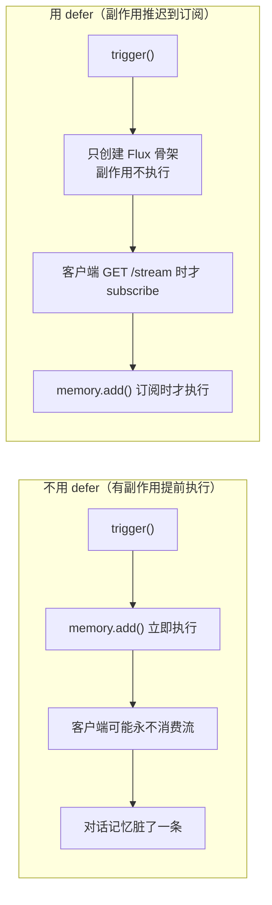
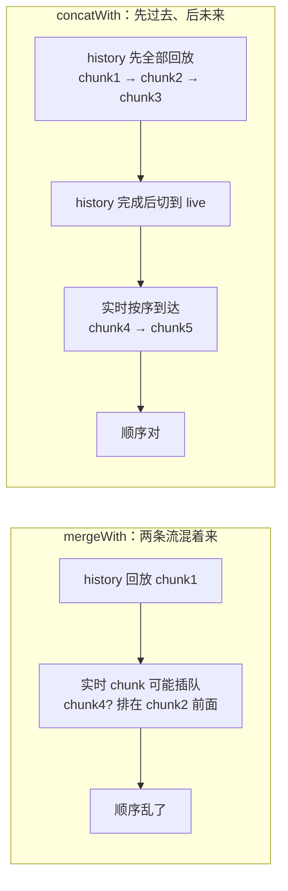
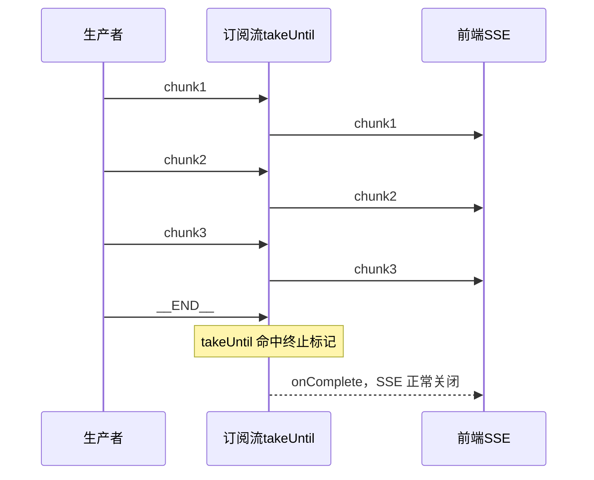
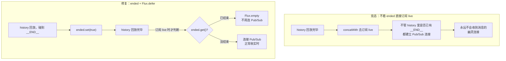
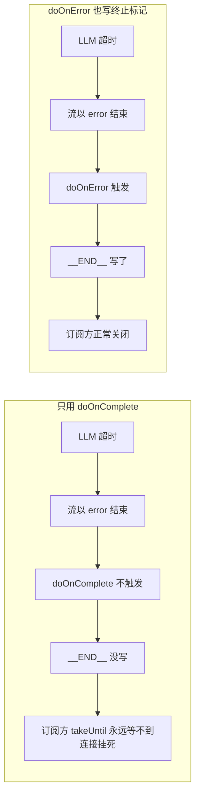
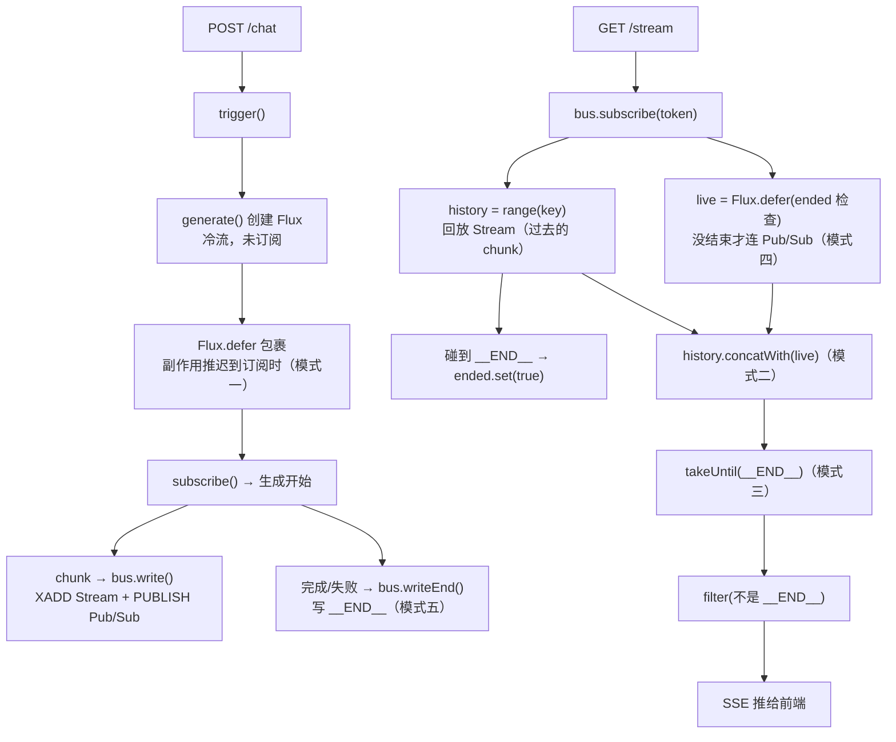

# Reactor AI 流式核心模式——从"为什么"到逐行精讲

> **这篇文档解决什么问题**：你已经掌握 `Mono`/`Flux` 心智、常用操作符（`defer`/`concatWith`/`takeUntil`）和 Redis Stream + Pub/Sub 的读写，单篇都懂，但把它们拼起来写一个真实 AI 流式架构时，反复卡在几个固定模式上——`Flux.defer` 到底什么时候用、`concatWith` 为什么不能反过来、`takeUntil` 怎么当流终结器、出错时为什么连接会挂死。
>
> **本文把 5 个核心模式用真实代码串起来讲，不讲语法，讲因果链。**

---

## 第 1 章：为什么要把这些模式单独拎出来

一个典型的 AI 流式场景，核心代码其实就几十行，但浓缩了 Reactor 里最精妙的几个模式。看这个真实的 `StreamBus.subscribe()`：

```java
Flux<String> history = redisTemplate.opsForStream().range(key, Range.unbounded())
        .map(this::chunkOf);

Flux<String> live = Flux.defer(() -> ended.get()
        ? Flux.empty()
        : listener.receive(ChannelTopic.of(channel)).map(Message::getMessage));

return history.concatWith(live)
        .takeUntil(s -> s.equals("__END__"))
        .filter(s -> !s.equals("__END__"));
```

一共 5 行，但每行背后都有一个模式。下面逐个拆解。

---

## 第 2 章：模式一——`Flux.defer()` 延迟执行副作用

### 2.1 问题

```java
// trigger() 里
public String trigger(String prompt, String sessionId) {
    String token = "gen_" + UUID.randomUUID();
    streams.put(token, generate(prompt, sessionId));  // 创建 Flux，还没订阅
    return token;
}

// generate() 里 —— 有问题的写法
public Flux<String> generate(String prompt, String sessionId) {
    memory.add(sessionId, new UserMessage(prompt));    // ❌ 现在就执行了！
    List<Message> history = memory.get(sessionId, MAX);
    return client.prompt().messages(history).stream().content();
}
```

`memory.add()` 在 `trigger()` 阶段就执行了。如果客户端触发了但从不来消费流，对话记忆里已经脏了一条 UserMessage。

### 2.2 修复

```java
public Flux<String> generate(String prompt, String sessionId) {
    return Flux.<String>defer(() -> {
        // ★ 这里面的代码只在【有人订阅】时才执行
        memory.add(sessionId, new UserMessage(prompt));
        List<Message> history = memory.get(sessionId, Integer.MAX_VALUE);
        return client.prompt().messages(history).stream().content();
    });
}
```

### 因果链



**一句话**：有副作用的代码（写库、写缓存），如果必须跟着订阅一起发生，就包在 `defer` 里。

---

## 第 3 章：模式二——`concatWith` 历史+实时拼接

### 3.1 为什么需要两个源

- **Redis Stream**：持久的，能回放"过去"的消息。
- **Redis Pub/Sub**：瞬时的，只能收"未来"的消息，订阅之前的消息永久丢失。

所以需要拼接：先回放历史，再接实时。

### 3.2 为什么 `concatWith` 而不是 `mergeWith`



**`concatWith` 保证第一条流跑完才启动第二条**。历史总是先于实时到达，顺序不乱。

### 3.3 为什么不能反过来

```java
live.concatWith(history)  // ❌
// live 的 Pub/Sub 消息可能在 history 之前到达，先看到"未来"再补"过去"
```

**一句话**：`concatWith` 是"先过去、后未来"的顺序保证。

---

## 第 4 章：模式三——`takeUntil` 流终结器

### 4.1 它像什么

`takeUntil(predicate)` = "遇到满足条件的元素就自动关闭水管"。

SSE 长连接总要有个关闭信号。我们用 `__END__` 这个特殊标记。生产者写它，订阅者用它关闭连接：

**订阅时序**：



### 4.2 如果 `__END__` 永远不来会怎样

生产者崩了（LLM 超时、网络断）→ `__END__` 没写 → `takeUntil` 永不满足 → Flux 永不 complete → **SSE 连接永久挂死**。

这就是为什么必须在出错时也写 `__END__`——见本文档第 6 章。

**一句话**：`takeUntil` 是流的唯一出口。生产者不写终止标记，订阅方就永远等。

---

## 第 5 章：模式四——`ended` 标志防竞态窗口

### 5.1 竞态在哪

`concatWith` 订阅 `live` 的动作发生在 `history` 完成时。如果 `history` 里已经有 `__END__`，理论上不需要 `live` 了——但 `concatWith` 不知道，它仍然会去订阅。这建立了一个永远不会收到消息的 Pub/Sub 连接。

### 5.2 用 `ended` + `Flux.defer` 堵上

```java
AtomicBoolean ended = new AtomicBoolean(false);

// history 回放时，碰到 __END__ 就标记
Flux<String> history = range(key).map(this::chunkOf)
        .doOnNext(chunk -> { if ("__END__".equals(chunk)) ended.set(true); });

// 订阅 live 时，根据 ended 决定要不要真的连 Pub/Sub
Flux<String> live = Flux.defer(() -> ended.get()
        ? Flux.empty()                                                   // 已结束，不用连
        : listener.receive(ChannelTopic.of(channel)).map(Message::getMessage)); // 没结束，连
```

**竞态与修复对比**：



**关键**：`Flux.defer` 保证 `ended.get()` 的判断发生在 `live` 被订阅时——此时 history 已回放完毕，`ended` 的值是准的。

**一句话**：`ended` + `Flux.defer` 是"根据已发生的事实决定要不要做未来的事"的标准模式。

---

## 第 6 章：模式五——错误时也必须写终止标记

### 6.1 问题

```java
generate(prompt, sessionId)
    .flatMap(chunk -> bus.write(token, chunk))
    .doOnComplete(() -> bus.writeEnd(token))      // 只有成功才写 __END__
    .doOnError(error -> log.error("失败了", error)) // 失败只打日志！
    .subscribe();
```

`generate()` 失败 → `__END__` 没写 → 订阅方的 `takeUntil` 永远等不到 → 连接挂死。

### 6.2 修复

```java
.doOnComplete(() -> bus.writeEnd(token).subscribe())
.doOnError(error -> {
    log.error("生成失败", error);
    bus.writeEnd(token).subscribe();  // ★ 失败了也必须写 __END__
})
```

### 因果链



**一句话**：终止标记的"必达性"比成功/失败的区分更重要。订阅方不关心为什么结束，只关心能不能正常关闭。

---

## 第 7 章：五个模式串起来的完整数据流

**整体数据流**：




---

## 第 8 章：自检清单

学完这篇，你应该能回答：

1. `Flux.defer()` 和直接写代码的区别？什么时候必须用 `defer`？
2. 为什么 `concatWith` 而不是 `mergeWith`？反过来会怎样？
3. `takeUntil` 当流终结器，最关键的前提是什么？（终止标记的必达性）
4. `ended` 标志 + `Flux.defer` 堵住了什么竞态窗口？
5. 为什么 `doOnComplete` 不够，`doOnError` 也要写终止标记？
