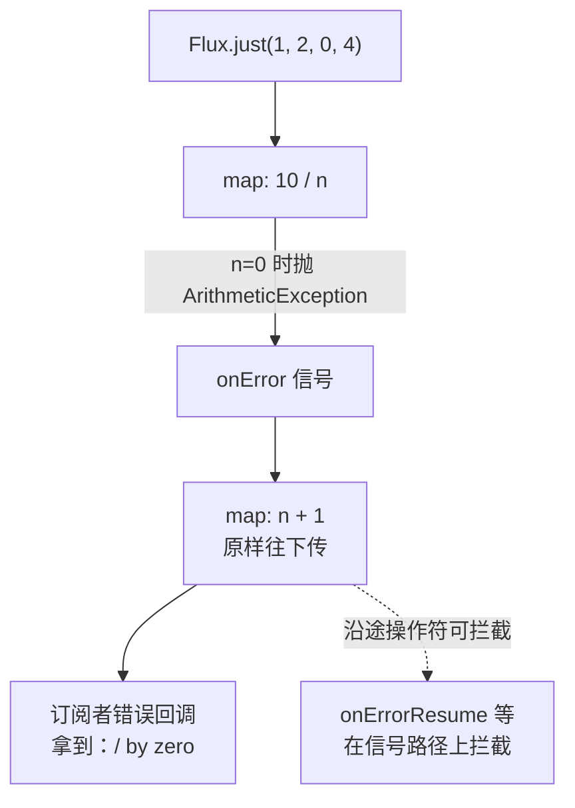
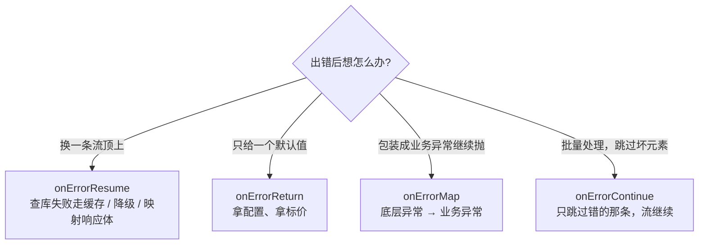
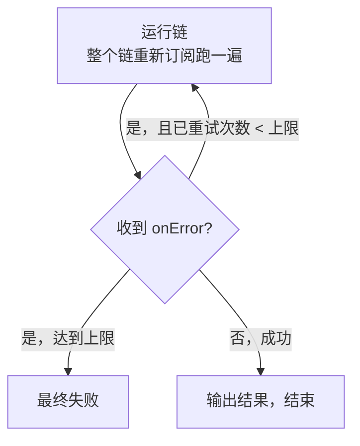
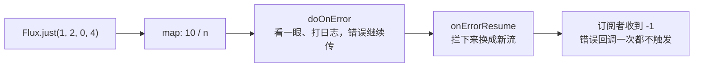
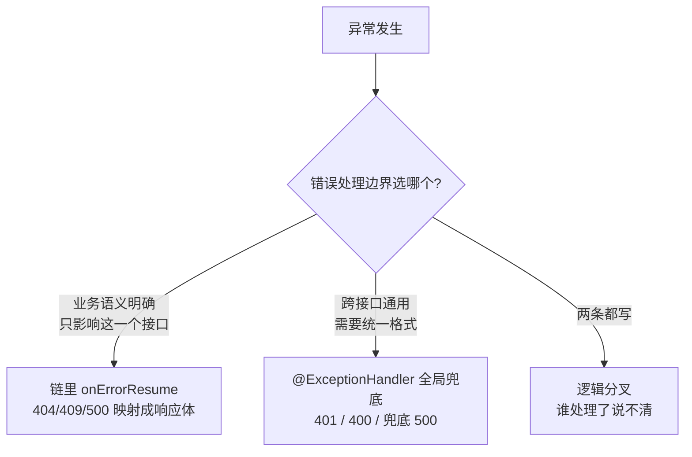
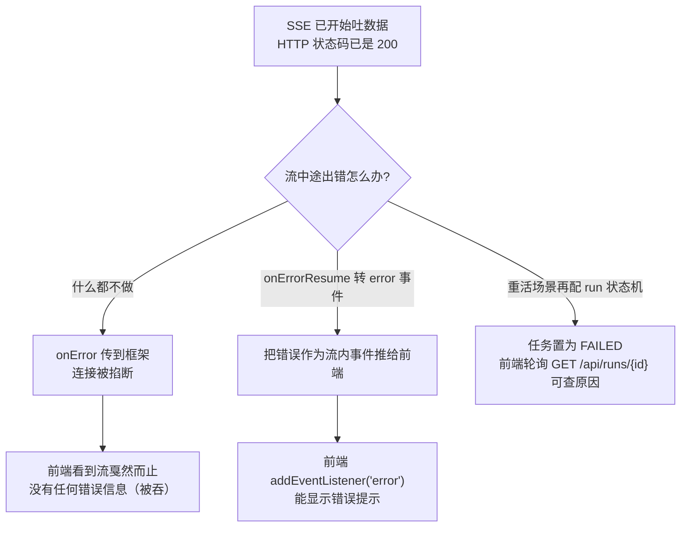

# Reactor 错误处理详解：onErrorResume / retry / doOnError 到底怎么用

> **配套文档**：你已经读完本系列 Reactor 响应式入门，会写基本的 `Mono`/`Flux` 链，对 Flux 方法速查里的 `map`/`flatMap`/`filter` 也不陌生。但**一遇到异常就懵**：`onErrorResume`、`onErrorReturn`、`onErrorMap`、`onErrorContinue`、`retry`、`doOnError`……一堆名字长得差不多，到底该用哪个？本篇就把响应式错误处理这一块彻底讲透。
>
> **难度假设**：传统 `try-catch` 玩得很熟，但不知道"响应式里怎么抓异常"；知道异常会变成 500，但不知道 Controller 里该怎么优雅地把它映射成 404/409/400。本篇假设你已理解"菜谱不是结果、订阅才执行"的心智模型（本文第 1 章也会回顾）。
>
> **本篇配套实践**：本仓库的管数分离实战是一份错误处理"实战现场"——里面的 Controller 用 `onErrorResume` 把业务冲突映射成 HTTP 409、把幂等冲突映射成回查。学完本篇，你会秒懂它为什么那么写。

---

## 第 1 章：先建心智模型——错误是"信号"，不是 try-catch

### 1.1 传统 try-catch 为什么在响应式里"失灵"

传统写法里，错误是一个**"事件"**：代码执行到某一行抛异常，`catch` 块立刻接住，流程被打断、就地处理。

```java
// 传统写法：try-catch 包住"执行过程"
try {
    User u = userDao.findById(id);      // 这里可能抛异常
    return u.getName().toUpperCase();
} catch (Exception e) {
    return "UNKNOWN";                   // 就地处理
}
```

**关键**：传统代码里，调用方法的那一刻**代码就真的在执行**，所以异常当场发生、当场能被 catch 住。

响应式完全不同。回顾一下心智模型：

```java
Mono<User> u = userDao.findByIdReactive(id);   // ① 这行只是"声明"，没有真的查库
```

第 ① 行**几乎不耗时、不执行**——它只是搭了一条"将来要跑"的流水线。真正的执行发生在**未来的某个时刻**（`subscribe` 时，甚至可能在别的线程上）。所以：

- 你在方法体里写 `try-catch`，包住的只是"搭流水线"这个过程，**包不住"流水线跑起来后"的异常**。
- 异常不是"当场抛给你"，而是**变成了流水线里的一种信号，沿链往下游传**。

### 1.2 响应式里错误的本相：onError 信号

01 里讲过，一个 `Flux` 会发三类信号：

| 信号 | 含义 | 触发后 |
|------|------|--------|
| `onNext(x)` | 吐出一个元素 | 流继续 |
| `onComplete()` | 正常结束 | **流终止** |
| `onError(e)` | 出错了 | **流终止** |

> **核心认知**：在响应式世界里，**错误不是一个"跳出来的异常"，而是和"数据"`onNext`、"结束"`onComplete` 并列的第三种信号 `onError`**。它和数据一样，从上游顺着链往下游传。传到哪里才算完？**传到订阅者（subscribe / WebFlux 框架），被某个环节处理掉**，才算结束。


> **为什么这很重要**：因为"错误是一个可以沿途被观察、被拦截、被替换的信号"，所以才有 `doOnError`（看一眼）、`onErrorResume`（拦下来换一条流）、`onErrorReturn`（拦下来换一个值）、`retry`（拦下来重跑一遍）这些操作符。**你学错误处理，学的其实是"怎么在信号往下传的路上拦截它"。**

### 1.3 错误沿链传播：不到订阅者不算完

一条链上的任何环节抛出异常，都会**转成 onError 信号，从抛出点开始往下游一路传**，沿途每个操作符都有机会拦截它；如果没人拦，最终到达订阅者。

```java
Flux.just(1, 2, 0, 4)
    .map(n -> 10 / n)                          // n=0 时抛 ArithmeticException
    .map(n -> n + 1)                            // 这个环节收不到 0 那次的错误吗？收得到，它会原样往下传
    .subscribe(
        v -> System.out.println("收到 " + v),
        e -> System.out.println("订阅者拿到错误：" + e.getMessage())
    );
// 输出：
// 收到 11     （1 → 10 → 11）
// 收到 6      （2 → 5 → 6）
// 订阅者拿到错误：/ by zero   （0 那次出错，前两个 map 都没拦，一路传到订阅者）
```

**错误沿链传播示意**：



**观察**：错误从 `map` 抛出后，一路穿过第二个 `map`（它什么都没做，只是把信号往下传），最后到订阅者的错误回调。**中间任何一个环节调用 `onErrorResume` 等操作符，就能把它拦下来。**

> **一句话心智模型**：**错误 = 顺着链往下传的 onError 信号；处理错误 = 在链上某个位置把它拦下来，或者让它一路传到订阅者。** 建立这个心智，后面所有操作符就好懂了——它们都是"在信号传送路径上装的各种拦截器/观察窗"。

### 1.4 两个关键推论

1. **"没抓到异常" ≠ 异常被吞了**——它只是变成了 onError 信号，你可能没接住。`subscribe()` 不带错误回调，或框架兜底成 500，都算"接住了"（虽然接得难看）。
2. **普通方法里 try-catch 依然有用**，但只对"同步、当场执行"的部分有用（比如 `Mono.fromCallable(() -> { ... 里面可以 try-catch ... })`）。对异步链，要靠操作符。详见本文档第 6 章坑 2。

---

## 第 2 章：恢复类操作符（核心中的核心）

这组操作符是错误处理的**主力**。它们的共同点：**拦截 onError 信号，把它"消化"掉，让下游感受不到错误**（或者说，下游收到的是"被处理过的结果"而不是错误）。

一句话先记住全家福：

| 操作符 | 一句话语义 |
|--------|-----------|
| `onErrorResume` | 出错后**用另一条流顶上**（最常用） |
| `onErrorReturn` | 出错后**返回一个默认值** |
| `onErrorMap` | 出错后**换成另一种异常**继续往下抛 |
| `onErrorContinue` | **跳过出错的元素**，其余继续跑 |

### 2.1 `onErrorResume` —— 用另一条流顶上（最常用）

> **一句话语义**：上游出错了，我不放弃整个流程，而是**切换到一条备用流继续**。

```java
import reactor.core.publisher.Flux;

public class OnErrorResumeDemo {

    public static void main(String[] args) {
        Flux.just(1, 2, 0, 4)                     // 数据源
                .map(n -> 10 / n)                 // n=0 时抛 ArithmeticException
                .onErrorResume(err -> {           // ▼ 出错：切换到备用流
                    System.out.println("出错了，切备用流：" + err.getMessage());
                    return Flux.just(100, 200, 300);
                })
                .subscribe(System.out::println);
    }
}
// 输出：
// 10
// 5
// 出错了，切备用流：/ by zero
// 100
// 200
// 300
```

**它做了三件事**：接住错误 → 打印日志 → 换一条 `Flux` 继续发数据。下游订阅者**完全感知不到错误**，只看到"数据变了一拨"。

**什么时候用它**：

- **查库失败想走缓存**：`userDao.findById(id).onErrorResume(e -> cacheDao.findById(id))`——数据库挂了，读缓存兜底。
- **调用下游服务失败想降级**：`priceClient.getPrice(sku).onErrorResume(e -> Mono.just(0.0))`——拿不到价格给个兜底价。
- **想把某个错误映射成别的结果**：比如管数分离实战里，会话冲突异常被 `onErrorResume` 接住后返回一个 409 响应体（本文第 5 章会详述如何映射状态码）。

> **精准拦截的进阶用法**：`onErrorResume` 有两个重载——不指定类型（接住**所有**异常）和指定类型（只接住**某一类**异常，其他的原样往下传）：
>
> ```java
> .onErrorResume(ArithmeticException.class, e -> Flux.just(999))   // 只处理算术异常
> .onErrorResume(e -> Flux.just(-1))                               // 兜底：接住剩下所有异常
> ```
>
> 业务代码里**优先用带类型的重载**，别一把抓所有异常——否则连编程 bug（NPE、数组越界）都被悄悄"降级"了，问题反而难查。

**验证**：直接 `main` 运行，看到上面注释的输出即为通过。重点确认：`10` 和 `5` 之后不是错误终止，而是 `100, 200, 300`。

---

### 2.2 `onErrorReturn` —— 返回一个默认值

> **一句话语义**：出错了，**塞一个固定默认值**过去，调用方完全感受不到出错了。

```java
import reactor.core.publisher.Flux;

public class OnErrorReturnDemo {

    public static void main(String[] args) {
        Flux.just(1, 2, 0, 4)
                .map(n -> 10 / n)
                .onErrorReturn(-1)                // ▼ 出错给默认值 -1
                .subscribe(System.out::println);
    }
}
// 输出：
// 10
// 5
// -1
```

**和 `onErrorResume` 的区别**：`onErrorResume` 换的是"一条流"（还能继续吐一串），`onErrorReturn` 换的是"一个值"（吐一个就结束）。`onErrorReturn` 本质是 `onErrorResume(e -> Mono.just(value))` 的语法糖——**当你只需要一个兜底值、不关心怎么兜底时，用它更省事**。

**什么时候用它**：

- **拿配置、拿标价这种"有默认值就够"的场景**：`Mono.fromCallable(() -> config.get(key)).onErrorReturn("default")`。
- **统计上报、非关键路径**：这条失败不影响主流程，给个默认值继续。

> 同样有带类型的重载：`.onErrorReturn(IllegalArgumentException.class, -1)`。

**验证**：运行输出 `10 / 5 / -1`，且**没有异常堆栈**——因为错误被消化了。

---

### 2.3 `onErrorMap` —— 换一种异常继续往下抛

> **一句话语义**：我不打算"消化"错误，而是要**把底层异常包装成"业务上更说得清"的异常**，再往下抛，让下游/订阅者看到的是语义明确的异常。

```java
import reactor.core.publisher.Flux;

public class OnErrorMapDemo {

    public static void main(String[] args) {
        Flux.just(1, 2, 0, 4)
                .map(n -> 10 / n)
                .onErrorMap(err -> new BusinessException("计算订单金额失败", err))  // ▼ 包装后继续抛
                .subscribe(
                        v -> System.out.println("收到 " + v),
                        e -> System.out.println("订阅者拿到：" + e.getClass().getSimpleName()
                                + " - " + e.getMessage())
                );
    }

    /** 业务异常（真实项目里放公共包） */
    static class BusinessException extends RuntimeException {
        BusinessException(String msg, Throwable cause) {
            super(msg, cause);
        }
    }
}
// 输出：
// 收到 10
// 收到 5
// 订阅者拿到：BusinessException - 计算订单金额失败
```

**注意**：下游**还是收到错误**（不是恢复！），只是错误的"长相"变了——从 `ArithmeticException` 变成了 `BusinessException`。这就是"换一种异常继续往下抛"。

**什么时候用它**：

- **底层异常暴露给调用方不合适**：数据库驱动抛的 `DataAccessException`，你不想让上层看到"哦底层是 JDBC 的错"，包装成 `UserServiceException("查询用户失败", cause)`。
- **给错误补充上下文**：加上"是哪个参数、哪个步骤出错的"信息，方便日志排查。
- **配合 `onErrorResume` 做"先翻译再处理"**：`.onErrorMap(e -> new BizException(e)).onErrorResume(BizException.class, e -> ...)`——先统一成业务异常，再按类型分派处理。

**验证**：输出显示订阅者拿到的是 `BusinessException` 而非 `ArithmeticException`。

---

### 2.4 `onErrorContinue` —— 跳过坏元素继续跑（配 flatMap）

> **一句话语义**：批量处理时，**某个元素出错不影响整批**——跳过它，继续处理后面的元素。

```java
import reactor.core.publisher.Flux;
import reactor.core.publisher.Mono;

public class OnErrorContinueDemo {

    public static void main(String[] args) {
        Flux.just(1, 2, 3, 4)
                .flatMap(id -> fetch(id))                       // ▼ 每个 id 异步查询
                .onErrorContinue((err, item) ->                 // ▼ 哪个元素错了就跳过哪个
                        System.out.println("跳过 " + item + "：" + err.getMessage()))
                .subscribe(System.out::println);
    }

    /** 模拟异步查询：id=2 会失败 */
    static Mono<Integer> fetch(int id) {
        if (id == 2) {
            return Mono.error(new RuntimeException("id=" + id + " 查询失败"));
        }
        return Mono.just(id * 10);
    }
}
// 输出：
// 10
// 跳过 2：id=2 查询失败
// 30
// 40
```

**这是唯一一个"不是整条流终止，而是只跳过出错的元素"的恢复操作符**。前面三个（Resume/Return/Map）出错后**整条流就没了**；`onErrorContinue` 出错后**流继续**，只是漏掉一个元素。

**什么时候用它**：

- **批量清洗/同步**：从消息队列读 1000 条，逐条调第三方接口，其中几条失败**不该让整批重来**——跳过失败的去重/记日志，其余继续。
- **`flatMap` 里批量拉取详情**：一批商品 id 里有个别查不到，别让整个列表失败。

> **注意（重要）**：`onErrorContinue` **要求上游操作符配合**——它得能区分"是哪个元素出的错"。`map`/`flatMap`/`filter` 等支持；但像 `delayElements`、`timeout` 这类"不针对单个元素"的操作符抛的错误，它**接不住**，会有 Hooks 提示。所以**只在你明确知道"这个错误是针对某个元素的"时用它**，别当万能兜底。
>
> 另外：它只对 `Flux`（多个元素）有意义——`Mono` 本来就一个元素，出错了"跳过"没意义。

**验证**：运行输出 `10 / 跳过 2 / 30 / 40`，且程序正常结束（没有异常堆栈）。

---

### 2.5 四个操作符怎么选——对比表

| 操作符 | 出错后 | 流是否继续 | 典型场景 |
|--------|--------|:---:|----------|
| `onErrorResume` | 换**一条流**顶上 | 否（换新流） | 查库失败走缓存、降级、映射成响应体 |
| `onErrorReturn` | 换**一个值** | 否 | 拿配置/标价，给个默认值就够 |
| `onErrorMap` | 换**一种异常**继续抛 | 否 | 底层异常包装成业务异常，保留错误语义 |
| `onErrorContinue` | **跳过出错元素** | **是** | 批量处理，一个坏元素不拖垮整批 |

**选型决策**：



> **记忆口诀**：**Resume 换流、Return 换值、Map 换异常、Continue 跳过继续**。
> 前三个的共同点是"错误被我消化，下游看到的是结果"；最后一个是"错误被跳过，流还活着"。

---

## 第 3 章：重试——临时故障的自动修复

第 2 章的操作符都是"出错后认输/兜底"。但有些错误是**临时的**（网络抖动、下游超时、DB 连接池打满），这时候更好的策略是**再试一次**——重试。

### 3.1 `retry()` —— 固定次数重试

> **一句话语义**：出错了先别放弃，**整个链重新订阅跑一遍**，最多重试 N 次。

```java
import java.util.concurrent.atomic.AtomicInteger;
import reactor.core.publisher.Flux;

public class RetryDemo {

    public static void main(String[] args) {
        AtomicInteger attempt = new AtomicInteger(0);

        Flux.create(sink -> {
            int n = attempt.incrementAndGet();
            if (n < 3) {
                sink.error(new RuntimeException("第 " + n + " 次失败"));  // 前两次失败
            } else {
                sink.next(100);                                            // 第三次成功
                sink.complete();
            }
        })
        .retry(5)                                       // ▼ 最多重试 5 次
        .subscribe(
                System.out::println,
                e -> System.out.println("最终失败：" + e.getMessage())
        );
    }
}
// 输出：100（第 1、2 次失败后自动重试，第 3 次成功）
```

**关键机制**：`retry(n)` 收到 onError 后，会**从链的最上游整个重新订阅、重新跑一遍**。所以：

- 第 1 次失败 → 重试（已重试 0 次 < 5）
- 第 2 次失败 → 重试（已重试 1 次 < 5）
- 第 3 次成功 → 输出 100，结束

**retry 重试机制**：



**什么时候用它**：

- **下游服务偶发超时/503**：`webClient.get().uri(url).retrieve().bodyToMono(String.class).retry(2)`——抖一下，重试两次。
- **连接池暂时打满**：重试几次可能就恢复。

> **别乱重试**：如果错误是"必然的"（参数不合法 400、业务冲突 409），重试纯属浪费——每次都必然失败。**重试只针对"可能自己恢复"的临时错误。**

### 3.2 `retryWhen(Retry.backoff(...))` —— 指数退避

`retry(n)` 是**立即**重试、每次间隔固定（0 毫秒）。生产环境更常用的是**指数退避**：第一次失败等 1 秒，第二次等 2 秒，第三次等 4 秒……给下游喘息时间。

> **一句话语义**：用 `Retry` 策略对象精确控制"怎么重试"——指数退避、最大间隔、抖动（jitter）、按异常类型过滤。

```java
import java.time.Duration;
import java.util.concurrent.atomic.AtomicInteger;
import reactor.core.publisher.Flux;
import reactor.util.retry.Retry;

public class RetryBackoffDemo {

    public static void main(String[] args) throws InterruptedException {
        AtomicInteger attempt = new AtomicInteger(0);

        Flux.create(sink -> {
            int n = attempt.incrementAndGet();
            System.out.println("第 " + n + " 次尝试 @" + System.currentTimeMillis());
            if (n < 5) {
                sink.error(new RuntimeException("第 " + n + " 次失败"));
            } else {
                sink.next("成功");
                sink.complete();
            }
        })
        .retryWhen(Retry.backoff(5, Duration.ofMillis(200)))   // ▼ 指数退避：200ms, 400ms, 800ms, 1600ms...
        .subscribe(
                System.out::println,
                e -> System.out.println("最终失败：" + e.getMessage())
        );
    }
}
```

运行会看到类似：

```
第 1 次尝试 @1700000000000
第 2 次尝试 @1700000000200     ← 第一次重试，间隔 200ms
第 3 次尝试 @1700000000600     ← 400ms
第 4 次尝试 @1700000001400     ← 800ms
第 5 次尝试 @1700000003000     ← 1600ms
成功
```

**`Retry.backoff(maxAttempts, firstBackoff)` 两个参数**：

- `firstBackoff`：第一次重试前的等待时长。
- `maxAttempts`：**总尝试次数（把第一次也算上）**。所以 `Retry.backoff(5, ...)` = 初始 1 次 + 重试 4 次。

> **⚠️ 这是最容易踩的坑，单独讲**：`retry(5)`（操作符）的 `5` 是**"重试 5 次"**（总共 6 次尝试）；而 `Retry.backoff(5, ...)` / `Retry.max(5)` 的 `5` 是**"总尝试 5 次"**（初始 1 次 + 重试 4 次）。**两者语义不一致，别记混。** 想"失败后再重试 3 次"，`retry(3)` 或 `Retry.backoff(4, ...)`。

**更精细的 `Retry` 玩法**（`Retry` 对象可继续 `.xxx` 链式配置）：

```java
.retryWhen(Retry.backoff(4, Duration.ofSeconds(1))
        .maxBackoff(Duration.ofSeconds(10))              // ▼ 退避上限，防越等越久
        .jitter(0.5)                                     // ▼ 加随机抖动，防"惊群"
        .filter(e -> e instanceof IOException)           // ▼ 只对 IO 异常重试，其他直接失败
        .onRetryExhaustedThrow((spec, sig) -> new MyFinalException("重试 N 次仍失败", sig.failure())))
```

**什么时候用它**：

- **调用外部 API / 真 LLM 流式**（真实流式项目里就是真 LLM）：网络抖动太常见，指数退避是标配。
- **任何"我不确定下游啥时候恢复"的远程调用**。

**验证**：运行上面的 `RetryBackoffDemo`，观察每次尝试的时间戳间隔约等于 200ms、400ms、800ms、1600ms，第 5 次输出"成功"。

### 3.3 重试的纪律：必须幂等

> **重试 = 把整条链从头再跑一遍。** 所以**这条链上的每一步都必须能"重复执行"而结果不变（幂等）**——这是重试最最重要的一条纪律。

```java
// ❌ 灾难：重试会重复扣款
return paymentService.deduct(userId, amount)     // 第一次成功了，但响应在网络里丢了
        .retry(3);                                // 重试 → 又扣一次款！用户被扣了 2 笔

// ✅ 正确姿势：把"扣款"设计成幂等的（带业务单号/幂等键）
return paymentService.deduct(userId, amount, "order_" + orderId)   // 服务端按 orderId 去重
        .retry(3);                                // 重试安全：同一个 orderId 只扣一次
```

**判断标准**：问自己一句——"如果这段代码执行两次，结果会一样吗？"

- 幂等：**查询、读缓存、按业务单号去重的写** → 可以放心重试。
- 不幂等：**扣款、发消息、创建资源（没有去重键）、发送邮件** → **严禁无脑 `retry`**，要么先保证幂等，要么改用"人工补偿"（记录失败，稍后重放）。

> 管数分离实战的"幂等键 + 会话级独占"正是为了配合这类"重试安全"而设计的——创建 run 时带 `Idempotency-Key`，同一个 key 只创建一个 run，重试/重复提交都不会重复触发 LLM 调用（烧两次钱）。

---

## 第 4 章：doOnError vs onErrorResume——一个"看"，一个"接管"

这是初学者最混淆的一对。名字里都有"error"，看起来都在"处理错误"，其实**性质完全不同**。

### 4.1 一句话区分

- **`doOnError` 只是"看一眼"**：错误经过它时，它做点副作用（打日志、埋点），然后**错误继续往下传**。它**不消费错误、不改变流程**。
- **`onErrorResume` 才是"真接管"**：错误到它这里被**拦下来**，换成新流，**下游不再收到这个错误**。

> **记忆**：`doOnError` 和 `doOnNext`/`doOnComplete` 是一家人——都是 01/02 里说的 **`do*` 开头 = 只看不改，不影响流**。`onError*` 开头才是"真正处理"。

### 4.2 对比表

| | `doOnError` | `onErrorResume` |
|---|---|---|
| 角色 | 旁路观察（副作用） | 真正恢复 |
| 错误是否被消费 | **否**，继续往下传 | **是**，被替换成新流 |
| 下游收到什么 | 还是错误 | 备用流的数据 |
| 典型用途 | 记日志、报警、埋点 | 降级、兜底、映射 |
| 能单独"处理"错误吗 | **不能**（只配套观察） | 能 |

### 4.3 完整示例：到底谁处理了错误

```java
import reactor.core.publisher.Flux;

public class DoOnErrorVsResumeDemo {

    public static void main(String[] args) {
        Flux.just(1, 2, 0, 4)
                .map(n -> 10 / n)
                .doOnError(e -> System.out.println("[doOnError] 我看到了错误：" + e.getMessage()))
                .onErrorResume(e -> Flux.just(-1))
                .subscribe(
                        v -> System.out.println("[订阅者] 收到 " + v),
                        e -> System.out.println("[订阅者] 收到错误：" + e.getMessage())
                );
    }
}
// 输出：
// [订阅者] 收到 10
// [订阅者] 收到 5
// [doOnError] 我看到了错误：/ by zero      ← 只是看一眼
// [订阅者] 收到 -1                          ← 错误被 onErrorResume 接管，订阅者拿到的是 -1
```

**信号路径**：



**看输出就懂了两件事**：

1. `doOnError` 的日志**先于** `onErrorResume` 的执行——因为错误先经过 `doOnError`（看一眼），再到 `onErrorResume`（接管）。
2. 订阅者的**错误回调一次都没被触发**——错误在 `onErrorResume` 就被消化了，订阅者只收到 `-1`。

**如果只写 `doOnError` 不写 `onErrorResume` 呢？**（这是最常见的错误）

```java
Flux.just(1, 2, 0, 4)
        .map(n -> 10 / n)
        .doOnError(e -> log.error("出错了", e))   // 以为"处理了"，其实没有！
        .subscribe(System.out::println);           // → 错误照样传到订阅者，还是崩
```

`doOnError` 只是**打日志**，错误继续传，订阅者（WebFlux 框架）照样把它变成 500。**"打了日志" ≠ "处理了错误"**——这是新手最隐蔽的错觉。

> **正确组合**：**`doOnError` 记日志 + `onErrorResume` 真接管**，两者分工：日志管"可观测"，Resume 管"恢复"。上面的示例就是这个组合。

### 4.4 do 系列全家福提醒

`doOnError` 属于 `do*` 旁路观察家族（`doOnNext`/`doOnComplete`/`doOnError`/`doFinally`/`doOnSubscribe`……）。**判断标准只有一条：方法名以 `do` 开头 → 只看不改**。想让错误"消失"，必须用 `onError*` 系列或 `retry`。

---

## 第 5 章：和 WebFlux 配合——错误怎么变成 HTTP 状态码

终于到实战。WebFlux 项目里，Controller 返回 `Mono`/`Flux`，框架替我们订阅。**错误最终变成什么 HTTP 响应，取决于你在链里怎么处理（或没处理）。**

### 5.1 什么都不做，异常会变成 500

```java
@RestController
public class UserController {

    private final UserService userService;

    public UserController(UserService userService) {
        this.userService = userService;
    }

    @GetMapping("/user/{id}")
    public Mono<User> user(@PathVariable long id) {
        return userService.findById(id);   // 若 findById 内部出错 → onError 传到框架 → HTTP 500 + 日志堆栈
    }
}
```

**默认行为**：链里的任何异常最终以 `onError` 信号到达 WebFlux 框架，框架把它转成 **HTTP 500** 并记日志。这是"兜底"，但**绝不是好体验**——用户不知道是"没找到"（404）还是"参数错了"（400）还是"服务器崩了"（500）。

> **先分清两类"失败"**：
> - **空（empty）≠ 错误**：`findById` 查无此人，`Mono` 是**正常结束但没吐元素**（`onComplete` 无值），不是 `onError`。处理它用 `defaultIfEmpty`/`switchIfEmpty`，**不是** `onErrorResume`。
> - **真正的异常才用 `onErrorResume`**：超时、下游失败、校验失败。

### 5.2 方式一：链里 `onErrorResume` 返回 ResponseEntity

在 Controller 里，用 `onErrorResume` 把"特定异常"映射成"特定状态码 + 响应体"：

```java
import org.slf4j.Logger;
import org.slf4j.LoggerFactory;
import org.springframework.http.HttpStatus;
import org.springframework.http.ResponseEntity;
import org.springframework.web.bind.annotation.GetMapping;
import org.springframework.web.bind.annotation.PathVariable;
import org.springframework.web.bind.annotation.RestController;
import org.springframework.web.server.ResponseStatusException;
import reactor.core.publisher.Mono;

@RestController
public class UserController {

    private static final Logger log = LoggerFactory.getLogger(UserController.class);

    private final UserService userService;

    public UserController(UserService userService) {
        this.userService = userService;
    }

    @GetMapping("/user/{id}")
    public Mono<ResponseEntity<User>> user(@PathVariable long id) {
        return userService.findById(id)
                // 查无此人 = 空（不是错误）→ 用 switchIfEmpty 转成 404
                .switchIfEmpty(Mono.error(
                        new ResponseStatusException(HttpStatus.NOT_FOUND, "用户 " + id + " 不存在")))
                .map(user -> ResponseEntity.ok(user))
                // 找不到 → 404（上面 ResponseStatusException 会被框架识别）
                .onErrorResume(ResponseStatusException.class,
                        e -> Mono.just(ResponseEntity.status(e.getStatusCode()).<User>build()))
                // 其他异常 → 500，但要打日志（不能只 return 500 不排查）
                .onErrorResume(Exception.class, e -> {
                    log.error("查询用户失败 id={}", id, e);
                    return Mono.just(ResponseEntity.status(HttpStatus.INTERNAL_SERVER_ERROR).<User>build());
                });
    }
}
```

**要点**：

1. **"空"和"错"分开处理**：`switchIfEmpty(Mono.error(new ResponseStatusException(NOT_FOUND)))`——把"查无此人"先变成 404 异常，再被下面的 `onErrorResume` 接住转成 404 响应。这条链路清晰：空 → 404，业务异常 → 4xx，其他 → 500。
2. **`onErrorResume` 按类型分派**：`ResponseStatusException` → 用它的状态码；`Exception` → 500。**兜底那条一定要 `log.error`**，否则错误被吞、线上难排查（见本文档第 6 章坑 3）。
3. 这正是管数分离实战里 `RunController` 的做法——`onErrorResume(IllegalStateException.class, e -> ...409...)` 把"会话忙"映射成 `409 Conflict`。

### 5.3 方式二：@ExceptionHandler 全局兜底

如果多个 Controller 都要做同样的错误映射，别在每个方法里重复 `onErrorResume`，用**全局异常处理**：

```java
import org.slf4j.Logger;
import org.slf4j.LoggerFactory;
import org.springframework.http.HttpStatus;
import org.springframework.http.ResponseEntity;
import org.springframework.web.bind.annotation.ExceptionHandler;
import org.springframework.web.bind.annotation.RestControllerAdvice;
import reactor.core.publisher.Mono;

import java.util.Map;

@RestControllerAdvice
public class GlobalExceptionHandler {

    private static final Logger log = LoggerFactory.getLogger(GlobalExceptionHandler.class);

    /** 查无此人 → 404 */
    @ExceptionHandler(NotFoundException.class)
    public Mono<ResponseEntity<Map<String, String>>> handleNotFound(NotFoundException e) {
        return Mono.just(ResponseEntity.status(HttpStatus.NOT_FOUND)
                .body(Map.of("error", e.getMessage())));
    }

    /** 会话冲突 → 409（管数分离实战里的语义） */
    @ExceptionHandler(IllegalStateException.class)
    public Mono<ResponseEntity<Map<String, String>>> handleConflict(IllegalStateException e) {
        return Mono.just(ResponseEntity.status(HttpStatus.CONFLICT)
                .body(Map.of("error", e.getMessage())));
    }

    /** 兜底 → 500 */
    @ExceptionHandler(Exception.class)
    public Mono<ResponseEntity<Map<String, String>>> handleOther(Exception e) {
        log.error("未处理异常", e);
        return Mono.just(ResponseEntity.status(HttpStatus.INTERNAL_SERVER_ERROR)
                .body(Map.of("error", "服务器内部错误")));
    }
}
```

**关键理解**：`@ExceptionHandler` 接住的是**"链里没被 `onErrorResume` 消费掉、最终冒到框架的异常"**。所以：

- 要么在**链里**用 `onErrorResume` 处理（细粒度、局部）；
- 要么**放给框架**，由 `@ExceptionHandler` 统一兜底（全局、统一）。

**别两条都做**（同一个异常既在链里 resume 了，又指望全局 handler 接）——链里 resume 了就不会再冒到框架。

### 5.4 选边站：错误处理边界只能有一个

> **规则**：给每个异常**选一个边界**处理——**要么链里 `onErrorResume`，要么全局 `@ExceptionHandler`，不要两边都写**，否则逻辑分叉、谁处理了说不清。
>
> 推荐分工：
> - **业务语义明确、只影响这一个接口的** → 链里 `onErrorResume`（如把 404/409 映射成响应体）。
> - **跨接口通用、需要统一格式的**（登录失效 401、参数校验 400、兜底 500）→ `@ExceptionHandler`。

**选边决策**：



### 5.5 流式/SSE 的错误：状态码已经来不及了（不吞错误）

> **这是最隐蔽的坑**：**SSE/流式响应一旦开始吐数据，HTTP 状态码就已经是 200 了**。如果流中途出错，**你没法再把状态码改成 500**——错误只能以"连接中断"的形式出现。

在管数分离实战的流式接口里，`GET /generate/stream` 返回 `Flux<ServerSentEvent<String>>`，正在逐字推 token。如果生成中途 LLM 报错，链里的异常 → `onError` 传到框架 → **连接被掐断，前端看到流戛然而止，没有任何错误信息**。这就是"错误被吞掉，前端无感"。

**流式错误处理的三个分支**：



**正确做法：把错误转成流里的一个"事件"推给前端**，而不是让连接干断：

```java
import org.slf4j.Logger;
import org.slf4j.LoggerFactory;
import org.springframework.http.codec.ServerSentEvent;
import reactor.core.publisher.Flux;

public class StreamController {

    private static final Logger log = LoggerFactory.getLogger(StreamController.class);

    public Flux<ServerSentEvent<String>> stream(String token, Long lastEventId) {
        long fromSeq = lastEventId != null ? lastEventId : 0;

        Flux<ServerSentEvent<String>> data = streamService.subscribe(token, fromSeq)
                .map(e -> ServerSentEvent.<String>builder()
                        .id(String.valueOf(e.seq())).event("token").data(e.chunk()).build())
                .concatWithValues(ServerSentEvent.<String>builder().event("done").data("").build())
                // ▼ 出错：推一个 error 事件给前端，而不是让连接干断
                .onErrorResume(e -> {
                    log.error("流式生成失败 token={}", token, e);
                    return Flux.just(ServerSentEvent.<String>builder()
                            .event("error").data(e.getMessage()).build());
                });
        // ...心跳逻辑省略
        return data;
    }
}
```

**这样前端就能**：`es.addEventListener("error", e => 显示错误提示)`——前端有感知，而不是"卡住没下文"。

> **企业级做法更进一步**：像管数分离实战那样引入 **run 状态机**，出错时把任务状态置为 `FAILED`，前端轮询 `GET /api/runs/{id}` 就能看到失败原因——**错误既要有"流内事件"的即时通知，也要有"状态可查"的持久记录**，两边都不丢。

### 5.6 小结

| 场景 | 推荐做法 |
|------|----------|
| 普通接口（非流式） | 链里 `onErrorResume` 映射状态码，或全局 `@ExceptionHandler` 兜底 |
| 查无此人（空） | `switchIfEmpty` + `ResponseStatusException(404)`，**别用 onErrorResume** |
| SSE/流式中途出错 | `onErrorResume` 把错误推成 `error` 事件；重活场景配 run 状态 `FAILED` |
| 任何兜底分支 | **必须 `log.error`**，别让错误只被"返回了个 500"就淹没 |

---

## 第 6 章：常见坑（错误处理特供版）

### 坑 1：onError 之后再发元素——流已终止

**流发出 onError（或 onComplete）后，这条流就"死了"**，再往里塞元素是无效的，Reactor 会打警告日志。

```java
import reactor.core.publisher.Flux;

public class Pit1EmitAfterErrorDemo {

    public static void main(String[] args) {
        Flux.create(sink -> {
            sink.next(1);
            sink.error(new RuntimeException("炸了"));   // ▼ 流终止
            sink.next(2);                                // ❌ 无效：流已终止，Reactor 会打警告
            sink.complete();                             // ❌ 同样无效
        }).subscribe(
                v -> System.out.println("收到 " + v),
                e -> System.out.println("错误：" + e.getMessage())
        );
    }
}
// 输出：收到 1 / 错误：炸了
// （第 2 个元素和 complete 都没用，控制台可能多一行 Reactor 的警告日志）
```

**本质**：`onError`/`onComplete` 是**终态信号**，发出后订阅关系就结束了。`sink.next` 在终止后调用 = 向一个已关闭的管子灌水，白费。

**什么时候踩到**：手写 `Flux.create` 时、或者错误分支里还想着"再补发一个兜底元素"时。**想让下游拿到兜底值，用 `onErrorReturn`/`onErrorResume`，不要在错误分支里手动 `next`**。

### 坑 2：try-catch 包不住异步链

```java
// ❌ 错误：try-catch 包不住"未来才执行"的链
public Mono<String> bad(long id) {
    try {
        return userDao.findByIdReactive(id)          // 这行只是"声明"，没真执行
                .map(User::getName)                  // 异常在 subscribe 之后才可能发生
                .map(String::toUpperCase);
    } catch (Exception e) {                          // 永远接不到链里的异常
        return Mono.just("UNKNOWN");
    }
}

// ✅ 正确：异常在链里用 onErrorResume 处理
public Mono<String> good(long id) {
    return userDao.findByIdReactive(id)
            .map(User::getName)
            .map(String::toUpperCase)
            .onErrorResume(e -> Mono.just("UNKNOWN"));
}
```

**本质**（回到第 1 章）：`findByIdReactive` 返回的 `Mono` 是"菜谱"，方法体在 `subscribe` 时才执行，**且可能在别的线程上**。`try-catch` 包住的只有"写菜谱"这个过程，包不住"做菜"时的异常。

**注意**：`try-catch` 并不是完全没用——**它依然能接住"组装链时当场抛出的同步异常"**。比如：

```java
try {
    Flux.just(1, 2).map(n -> throwNow());   // throwNow() 在组装时就抛 → try-catch 能接住
} catch (Exception e) { ... }
```

但**运行时异常（订阅后发生的）接不住**。判断标准：异常是"搭流水线时"抛的（同步），还是"流水线跑起来后"抛的（异步）——**后者必须用操作符**。

### 坑 3：错误被日志"吞"了，前端无感

```java
// ❌ 错误：日志打了，但前端啥也不知道
@GetMapping(value = "/generate/stream", produces = MediaType.TEXT_EVENT_STREAM_VALUE)
public Flux<String> stream(@RequestParam String token) {
    return streamService.subscribe(token)
            .doOnError(e -> log.error("生成失败", e));   // 只记日志，错误继续传 → 连接被掐断，前端看到"卡住"
}
```

**这是"吞错误"最典型的一种**：`doOnError` 打了日志就以为处理完了，但：

- **非流式接口**：错误继续传到框架 → 变成 500（前端至少知道失败了，但不知道原因）。
- **流式/SSE 接口**：状态码已经 200 了，错误只能让连接中断——**前端看到的是"吐了一半就没了"，没有任何错误信息**。这才是真正的"无感"。

**解决**（见 5.5）：流式接口把错误 `onErrorResume` 成流里的 `error` 事件；配合 run 状态 `FAILED` 让前端可查。**日志和前端提示，两者都要**——日志给后端排查，事件/状态给前端感知，缺一个都是"吞错误"。

### 坑 4：doOnError 里以为处理了错误

```java
// ❌ 错误：doOnError ≠ 处理错误
return userDao.findByIdReactive(id)
        .map(User::getName)
        .doOnError(e -> log.error("出错了", e))     // 只是看一眼
        // 没有 onErrorResume/onErrorReturn → 错误照样冒到框架 → 500
        .onErrorResume(e -> Mono.just("UNKNOWN"));  // ✅ 补上这句才是真处理
```

**一句话**：**`doOnError` 是"记录"，`onErrorResume` 是"处理"**。只记录不处理 = 还是 500。第 4 章已详述，这里只强调：写完 `doOnError` 后问自己一句——**"如果没有它，行为会变吗？"** 如果只是多了行日志、错误照样冒上去，那你还没处理完。

### 坑 5：`Retry.backoff` 的参数是"总次数"不是"重试次数"

```java
// ❌ 想"重试 3 次"，结果只重试了 2 次
.retryWhen(Retry.backoff(3, Duration.ofSeconds(1)));   // 3 = 总尝试次数（含首次）→ 实际只重试 2 次

// ✅ 想"重试 3 次"
.retry(3);                                            // 操作符版：3 = 重试次数（不含首次）
.retryWhen(Retry.backoff(4, Duration.ofSeconds(1)));  // 策略版：4 = 总尝试（含首次）→ 重试 3 次
```

**这是 `retry` 家族最容易踩的语义坑**（第 3.2 节已详述），写代码前先想清楚参数含义。

---

## 第 7 章：总结——一张决策速查表

| 场景 | 用哪个 | 章节 |
|------|--------|:---:|
| 出错后换**一条流**顶上（降级/走缓存/映射响应体） | `onErrorResume` | 2.1 |
| 出错后给**一个默认值** | `onErrorReturn` | 2.2 |
| 把底层异常**包装成业务异常**继续抛 | `onErrorMap` | 2.3 |
| 批量处理，**跳过坏元素**继续 | `onErrorContinue` | 2.4 |
| 临时故障，**固定次数**重跑 | `retry(n)` | 3.1 |
| 临时故障，**指数退避**重跑 | `retryWhen(Retry.backoff(...))` | 3.2 |
| **只看一眼**（记日志/埋点），不处理 | `doOnError` | 4 |
| Controller 里把异常映射成 HTTP 状态码 | `onErrorResume` 返回 `ResponseEntity` / `@ExceptionHandler` | 5 |
| 流式/SSE 中途出错，让前端有感知 | `onErrorResume` 推 `error` 事件 + run 状态 `FAILED` | 5.5 |

**四句话收尾**：

1. **错误是信号不是异常**：`onError` 和 `onNext`/`onComplete` 并列，顺着链往下传，到订阅者才算完（入门篇的"菜谱"心智）。
2. **处理 = 在信号路径上拦截**：`onErrorResume`/`onErrorReturn`/`onErrorMap` 消化错误，`onErrorContinue` 跳过元素，`retry*` 重跑一遍。
3. **`do*` 只看不改**：`doOnError` 记日志 ≠ 处理错误，真想恢复必须 `onErrorResume` 或 `retry`。
4. **重试的前提是幂等，兜底的前提是打日志**：不幂等别重试，兜底分支必须 `log.error`——否则错误在日志里消失、在前端无感，线上事故都不知道从哪查。

> **下一步**：你已经见过用 `onErrorResume` 把"会话忙"映射成 409、用 run 状态 `FAILED` 做持久记录的企业级做法。若对"错误发生在哪个线程、重试/超时对线程的影响"有疑问，可以配合本系列的线程模型主题一起看——线程模型是响应式新手第一大坎，错误处理是第二大坎，两篇合起来基本就通关了。
