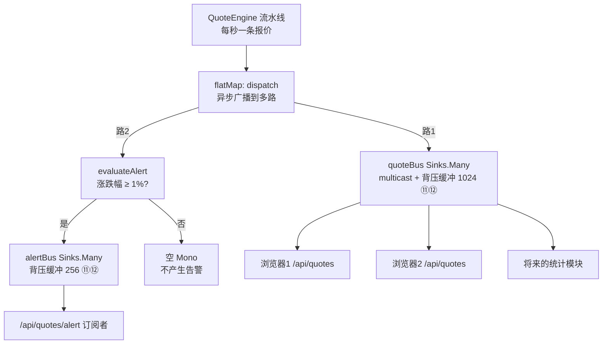
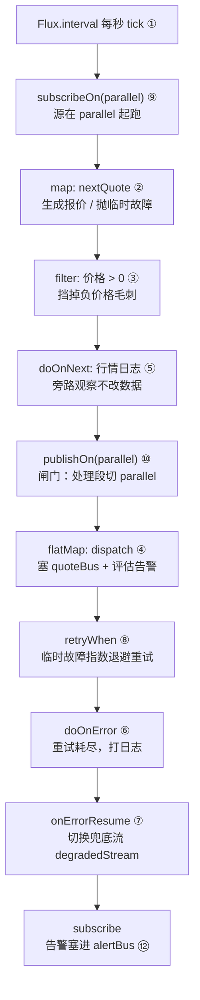
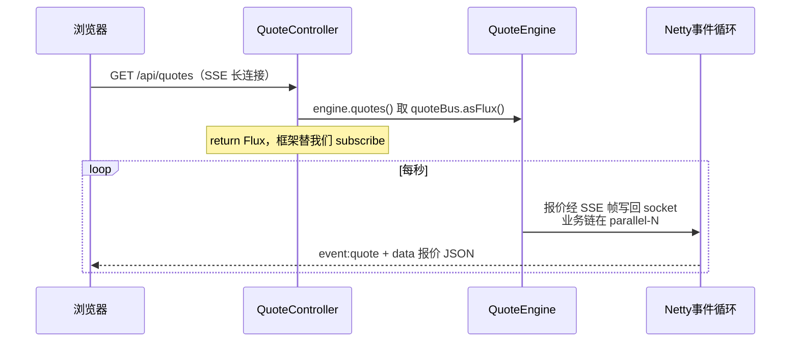
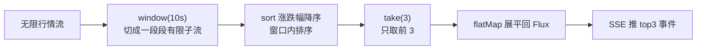

# Reactor 练手小项目：从零做一个实时股票行情推送应用

> **本篇定位**：前面 01-07 都是"零件"——Mono/Flux 心智、操作符、Sinks、背压、线程、错误处理。本篇把零件**装成一辆车**：一个能跑、能验证、把 Reactor 大部分核心能力串起来的完整小项目——实时股票行情推送（WebFlux + SSE）。初学者照着敲完，会很有成就感。
>
> **难度假设**：你读完了 [01-Reactor响应式入门](./01-Reactor响应式入门.md)（Mono/Flux 心智、"菜谱不是结果"）、[06-Reactor调度器与线程模型](./06-Reactor调度器与线程模型.md)（`subscribeOn`/`publishOn`）、[07-Reactor错误处理详解](./07-Reactor错误处理详解.md)（`onErrorResume`/`retryWhen`）。若还没读，遇到不认识的词，按文档里的交叉引用回去翻即可。
>
> **你将得到**：一个 Spring Boot 4.x + WebFlux 应用。`GET /api/quotes` 每秒推一条模拟股票报价（SSE），`GET /api/quotes/alert` 推"涨跌幅超过阈值"的告警。还有一段"一个类能跑"的控制台版，先不碰 Spring，纯 Reactor 就能看行情。
>
> **本篇用到的 Reactor 能力**：`Flux.interval`、`map`、`filter`、`flatMap`、`doOnNext`、`doOnError`、`onErrorResume`、`retryWhen`、`publishOn`/`subscribeOn`、`onBackpressureBuffer`、`Sinks.Many`——一共 11 个概念，每个都在项目里有明确落点（见[第 6 章复盘](#第-6-章-复盘一张映射表)）。

---

## 第 1 章：项目搭建（Spring Boot 4.x + WebFlux）

### 1.1 项目长什么样

```
reactive-stock-quotes/
├── pom.xml
└── src/main/java/com/example/reactivestocks/
    ├── ReactiveStocksApplication.java     # 启动类
    ├── Quote.java                          # 报价模型（record）
    ├── Alert.java                          # 告警模型（record）
    ├── QuoteEngine.java                    # ★ 行情引擎：Reactor 流水线的家
    └── QuoteController.java               # SSE 接口
```

> **一句话分工**：`QuoteEngine` 是"发动机"——里面跑着一条 Reactor 流水线，每秒产出一条报价；`QuoteController` 是"仪表盘"——把发动机的数据通过 SSE 推给浏览器。**Reactor 的全部能力几乎都写在 `QuoteEngine` 里**，Controller 只是把 `Flux` return 出去让框架订阅。

### 1.2 pom 关键依赖

新建 Maven 项目，`pom.xml` 核心内容：

```xml
<?xml version="1.0" encoding="UTF-8"?>
<project xmlns="http://maven.apache.org/POM/4.0.0"
         xmlns:xsi="http://www.w3.org/2001/XMLSchema-instance"
         xsi:schemaLocation="http://maven.apache.org/POM/4.0.0 https://maven.apache.org/xsd/maven-4.0.0.xsd">
    <modelVersion>4.0.0</modelVersion>

    <parent>
        <groupId>org.springframework.boot</groupId>
        <artifactId>spring-boot-starter-parent</artifactId>
        <version>4.0.0</version>          <!-- Boot 4.x，4.x 通用 -->
        <relativePath/>
    </parent>

    <groupId>com.example</groupId>
    <artifactId>reactive-stock-quotes</artifactId>
    <version>0.0.1-SNAPSHOT</version>
    <name>reactive-stock-quotes</name>

    <properties>
        <java.version>17</java.version>
    </properties>

    <dependencies>
        <!-- 唯一的关键依赖：WebFlux 全家桶（含 Reactor，无需单独引 reactor-core） -->
        <dependency>
            <groupId>org.springframework.boot</groupId>
            <artifactId>spring-boot-starter-webflux</artifactId>
        </dependency>
    </dependencies>

    <build>
        <plugins>
            <plugin>
                <groupId>org.springframework.boot</groupId>
                <artifactId>spring-boot-maven-plugin</artifactId>
            </plugin>
        </plugins>
    </build>
</project>
```

> **关键点**：只依赖 `spring-boot-starter-webflux`。它内部传递依赖了 `reactor-core`（你写的 `Flux`/`Mono`/`Sinks` 就来自它）和 Netty（WebFlux 的底层服务器）。**不需要**再单独引入 Spring MVC / Tomcat——响应式栈要跟传统 Servlet 栈划清界限。

### 1.3 先写一个能启动的空壳

`ReactiveStocksApplication.java`：

```java
package com.example.reactivestocks;

import org.springframework.boot.SpringApplication;
import org.springframework.boot.autoconfigure.SpringBootApplication;

@SpringBootApplication
public class ReactiveStocksApplication {

    public static void main(String[] args) {
        SpringApplication.run(ReactiveStocksApplication.class, args);
    }
}
```

> **验证：** 右键运行 `main`，看到 `Netty started on port 8080` 即为启动成功。这就是 WebFlux 的服务器——底层是 Netty，不是 Tomcat。

---

## 第 2 章：Quote 模型 + 模拟行情源（`Flux<Quote>`）

### 2.1 报价模型 `Quote`（record）

Java 17 的 `record` 天生适合当不可变数据模型，JSON 序列化也零配置：

```java
package com.example.reactivestocks;

import java.math.BigDecimal;

/**
 * 一条股票报价。
 * @param symbol         股票代码，如 AAPL
 * @param price          最新价格
 * @param changePercent  涨跌幅（百分比数值，1.23 表示涨 1.23%）
 * @param timestamp      报价时间戳（毫秒）
 */
public record Quote(
        String symbol,
        BigDecimal price,
        BigDecimal changePercent,
        long timestamp) {
}
```

### 2.2 告警模型 `Alert`（record）

```java
package com.example.reactivestocks;

import java.math.BigDecimal;

/**
 * 一条行情告警：涨跌幅超过阈值时触发。
 * @param symbol         股票代码
 * @param changePercent  触发时的涨跌幅
 * @param message        人类可读的告警文案
 */
public record Alert(
        String symbol,
        BigDecimal changePercent,
        String message) {
}
```

### 2.3 行情源：`Flux.interval` + `map`

这是整个项目的第一行核心。回顾 [01-Reactor响应式入门](./01-Reactor响应式入门.md)：`Flux` 是一条会持续吐数据的"水管"。我们要**每秒吐一条报价**，用 `Flux.interval` 做定时器，再用 `map` 把"第几个 tick"变成"一条报价"：

```java
Flux.interval(Duration.ofSeconds(1))      // 每秒吐一个 tick: 0, 1, 2, 3 ...
    .map(i -> nextQuote())                 // 每个 tick 变成一条随机报价
```

- **`Flux.interval(Duration.ofSeconds(1))`**：周期性发射的无限流。它是"热"的定时器，默认就跑在 `parallel` 线程池上（这点第 3 章第 5 层会细讲，对应 [06](./06-Reactor调度器与线程模型.md)）。
- **`map(i -> nextQuote())`**：一对一转换，把 tick 编号变成报价对象。这正是 [01](./01-Reactor响应式入门.md) 3.1 节和 [02-Flux方法速查](./02-Flux方法速查.md) 第 1 个方法的用法。

`nextQuote()` 生成一条**带随机抖动**的报价（在 [-2%, +2%] 内随机漂移，涨跌幅相对上一条计算）：

```java
private static final List<String> SYMBOLS = List.of("AAPL", "GOOGL", "MSFT", "TSLA", "NVDA");
private final AtomicReference<BigDecimal> prevPrice = new AtomicReference<>(BigDecimal.valueOf(100));
private final Random random = new Random();

/** 生成一条随机抖动的报价：相对上一条价格在 ±2% 内漂移 */
private Quote nextQuote() {
    BigDecimal prev = prevPrice.get();
    double change = (random.nextDouble() - 0.5) * 0.04;          // -2% ~ +2%
    BigDecimal newPrice = prev.multiply(BigDecimal.valueOf(1 + change))
            .setScale(2, RoundingMode.HALF_UP);
    BigDecimal pct = newPrice.subtract(prev)
            .divide(prev, 4, RoundingMode.HALF_UP)
            .multiply(BigDecimal.valueOf(100));                   // 转成百分比
    prevPrice.set(newPrice);
    return new Quote(symbol(), newPrice, pct.setScale(2, RoundingMode.HALF_UP),
            System.currentTimeMillis());
}

private String symbol() {
    return SYMBOLS.get(random.nextInt(SYMBOLS.size()));
}
```

### 2.4 验证：先把最小流水线跑起来（不碰 Spring）

把下面这段塞进一个 `main` 方法（或者直接跳到[第 5 章](#第-5-章-完整可跑代码)的"一个类能跑"版本）：

```java
Flux.interval(Duration.ofSeconds(1))
    .map(i -> nextQuote())                       // 每秒一条报价
    .doOnNext(q -> System.out.println(
            "[" + Thread.currentThread().getName() + "] " + q))   // 打印 + 看线程
    .blockLast();                                // 阻塞等（Ctrl+C 停止）
```

运行后每秒打印一条，类似：

```
[parallel-1] Quote[symbol=MSFT, price=99.20, changePercent=-0.80, timestamp=1700000000123]
[parallel-1] Quote[symbol=AAPL, price=99.45, changePercent=0.25, timestamp=1700000001123]
[parallel-1] Quote[symbol=NVDA, price=100.11, changePercent=0.66, timestamp=1700000002123]
```

> **验证结论**：行情真的在"每秒"产生；线程名是 `parallel-1`——印证了 [06](./06-Reactor调度器与线程模型.md) 第 2.3 节说的"`Flux.interval` 默认就跑在 `parallel` 上"。**到这里，能力① `Flux.interval` + `map` 已经落地。**

---

## 第 3 章：逐层加能力

这一章是核心。我们在 2.4 的最小流水线上**一层层往上加**，每层用到一个新的 Reactor 概念。每一层都有明确的"为什么加、加了什么、怎么验证"。

### 3.1 第一层：加 `filter`——过滤异常报价/负价格

**为什么加**：真实行情源偶尔会吐出**负价格、零价格**这种数据毛刺（网络脏数据）。不能让它推给用户，得在源头挡掉。

**概念**：`filter` = 关卡，满足条件的放过去，不满足的扔掉（[02-Flux方法速查](./02-Flux方法速查.md) 第 2 个方法）。

**加这一行**：

```java
.map(i -> nextQuote())
.filter(q -> q.price().compareTo(BigDecimal.ZERO) > 0)   // ★ 只放行正价格
```

为了让"毛刺"真的会出现（否则过滤没有用武之地），给 `nextQuote()` 加一段随机产生负价格的逻辑：

```java
// 20 分之 1 概率：模拟"异常报价"（负价格 → filter 过滤掉）
if (random.nextInt(20) == 0) {
    return new Quote(symbol(), BigDecimal.valueOf(-1), BigDecimal.ZERO, System.currentTimeMillis());
}
```

> **验证：** 在 `filter` 后面加一行 `doOnNext(q -> System.out.println(q))`，跑 1 分钟，观察**打印出来的价格全部为正**——负价格被挡在 `filter` 之前了。这就是能力② `filter`。

### 3.2 第二层：加错误处理——`doOnNext` / `doOnError` / `onErrorResume` / `retryWhen`

**为什么加**：行情源会"出故障"，分两类：

- **临时故障**（网络抖动、连接中断）——值得**重试**；
- **不可恢复故障**（行情商永久下线）——重试也白搭，应该**降级**为兜底流。

这正好对应 [07-Reactor错误处理详解](./07-Reactor错误处理详解.md) 第 3 章（重试）和第 2 章（恢复操作符）的心智：**错误是顺着链往下传的 `onError` 信号，处理 = 在信号路径上拦截它**。

给 `nextQuote()` 加一段随机抛"临时故障"：

```java
// 30 分之 1 概率：模拟"行情源连接中断"（临时故障 → retryWhen 重试）
if (random.nextInt(30) == 0) {
    throw new TransientException("上游行情源连接中断");
}
```

然后按"先看 → 再重试 → 重试耗尽再看 → 再降级"的顺序把错误处理操作符铺上去：

```java
Flux.interval(Duration.ofSeconds(1))
    .map(i -> nextQuote())                                    // 可能抛 TransientException
    .filter(q -> q.price().compareTo(BigDecimal.ZERO) > 0)
    .doOnNext(q -> log.info("[行情] 生成 {}", q))             // ③ doOnNext：旁路日志
    .flatMap(this::dispatch)                                   // ③ flatMap（3.3 节讲）
    .retryWhen(Retry.backoff(3, Duration.ofMillis(500))        // ⑨ 临时故障指数退避重试
            .filter(e -> e instanceof TransientException))     //    只重试临时故障
    .doOnError(e -> log.error("[行情] 重试耗尽或不可恢复错误，进入降级", e))  // ④ doOnError
    .onErrorResume(e -> degradedStream())                      // ⑤ 出错 → 切换兜底流
    .subscribe(alert -> { /* 3.3 节补全 */ }, err -> { });
```

逐个解释（顺序很重要，别写反）：

| 操作符 | 在这个项目里的作用 | 对应 [07](./07-Reactor错误处理详解.md) |
|--------|-------------------|-------------------------------------|
| `doOnNext(q -> log.info(...))` | 每条合法行情打日志，**只看不改** | do 系列=旁路观察（第 4 章） |
| `retryWhen(Retry.backoff(3, ...))` | 遇到 `TransientException` 先**指数退避重试**：500ms、1s，最多总尝试 3 次 | 3.2 节 |
| `.filter(e -> e instanceof TransientException)` | **只对临时故障重试**，其他异常直接放过去（不浪费重试） | 3.2 节精细配置 |
| `doOnError(e -> log.error(...))` | 重试耗尽 / 非临时故障，到这里**看一眼、打日志**，错误继续传 | 第 4 章"doOnError 只看不改" |
| `onErrorResume(e -> degradedStream())` | 错误到达这里被**接管**：切换成兜底流，下游再也收不到错误 | 2.1 节 |

> **⚠️ `Retry.backoff` 的参数坑**：`Retry.backoff(3, ...)` 的 `3` 是**总尝试次数（含首次）**，意思是"初始 1 次 + 重试 2 次"。跟操作符 `retry(3)` 的"重试 3 次"语义不同，别记混（详见 [07](./07-Reactor错误处理详解.md) 3.2 节的坑）。

兜底流 `degradedStream()`——行情源不可用时降级为"平线报价"（价格不动、不产生告警），保证 `/api/quotes` 这条线不彻底断：

```java
/** 兜底流：行情源不可用时，降级为"平线报价"，不再产生告警 */
private Flux<Alert> degradedStream() {
    log.warn("[行情] 降级模式：输出平线报价，暂停告警");
    return Flux.interval(Duration.ofSeconds(1))
            .doOnNext(i -> {
                Quote flat = new Quote("AAPL", prevPrice.get(),
                        BigDecimal.ZERO, System.currentTimeMillis());
                quoteBus.tryEmitNext(flat);          // 降级报价也推给主行情（3.3 节讲 quoteBus）
            })
            .flatMap(i -> Mono.<Alert>empty());      // 不产生任何告警
}
```

> **验证：** 观察日志。正常时每秒一条 `[行情] 生成 ...`；当 `nextQuote()` 抛临时故障时，你会看到**中间停了一拍（重试退避）**，然后流水线接着跑——这就是 `retryWhen` 在起作用。若把故障概率调高到 100%，最终会走到 `[行情] 重试耗尽...进入降级`，然后一直输出"平线报价"。**能力④ `doOnNext`/`doOnError`、能力⑤ `onErrorResume`、能力⑨ `retryWhen` 全部落地。**

### 3.3 第三层：加 `Sinks.Many` 广播 + `flatMap` 异步广播到多路

**为什么加**：行情要同时喂给**多个订阅者**——`/api/quotes` 的浏览器、`/api/quotes/alert` 的告警评估、将来的统计模块。如果用冷流 `Flux`，**每多一个订阅者就重新跑一遍生成逻辑**（见 [01](./01-Reactor响应式入门.md) 坑 5）。我们需要一份行情、大家共享——这就是**热流** `Sinks.Many`。

**概念**：[03-Reactor-Sinks入门](./03-Reactor-Sinks入门.md) 第 1 章——Sink 是"命令式世界"和"响应式世界"之间的桥，`tryEmitNext` 把数据塞进一条热流，所有订阅者立刻收到。

在 `QuoteEngine` 里建两条总线：

```java
/** 主行情总线：所有 /api/quotes 订阅者共享同一份行情（热流） */
private final Sinks.Many<Quote> quoteBus =
        Sinks.many().multicast().onBackpressureBuffer(1024, false);

/** 告警总线：所有 /api/quotes/alert 订阅者共享 */
private final Sinks.Many<Alert> alertBus =
        Sinks.many().multicast().onBackpressureBuffer(256, false);
```

- `multicast()`：新订阅者只收到**订阅之后**的行情（历史行情没有意义，实时推送要的是"从当下开始"）。
- `onBackpressureBuffer(1024, false)`：给每个慢订阅者独立缓冲 1024 条（第 3.4 节细讲）。
- `false`（autoCancel）：即使所有订阅者都断开，总线也保持存活，下个订阅者连上来还能收（[03](./03-Reactor-Sinks入门.md) 3.2 节）。

**给订阅者看流**——`asFlux()` 返回普通 `Flux`，用法和任何 `Flux` 一样：

```java
/** 供 Controller 订阅全部行情 */
public Flux<Quote> quotes() {
    return quoteBus.asFlux();
}

/** 供 Controller 订阅告警 */
public Flux<Alert> alerts() {
    return alertBus.asFlux();
}
```

**flatMap 登场**——每个报价要"异步广播到多路"：既要塞进 `quoteBus`，又要异步评估是否触发告警。这正是 `flatMap` 的用武之地（[02](./02-Flux方法速查.md) 第 3 个方法：箭头函数返回另一个 `Mono`/`Flux`，一对多展开）：

```java
/** flatMap 的目标：一个报价展开成"多路" */
private Flux<Alert> dispatch(Quote quote) {
    // 路1：命令式塞进主行情总线——Sinks 广播，所有 /api/quotes 订阅者立刻收到
    quoteBus.tryEmitNext(quote);
    // 路2：异步评估是否触发告警（返回 Mono<Alert>；无告警时 evaluateAlert 返回 null，
    //      Mono.fromCallable(() -> null) 为空 → 被 flatMap 自动丢弃）
    return Mono.fromCallable(() -> evaluateAlert(quote))
            .subscribeOn(Schedulers.parallel())
            .flux();
}
```

`.flatMap(this::dispatch)` 放进流水线后，`dispatch` 返回的 `Flux<Alert>`（可能是空）会被合并进主链，最终在订阅时把告警塞进 `alertBus`：

```java
.subscribe(alert -> {
    if (alert != null) {
        alertBus.tryEmitNext(alert);     // 告警广播给 /api/quotes/alert 的订阅者
    }
}, err -> log.error("[行情] 引擎终止", err));
```

告警判定——涨跌幅绝对值 ≥ 1% 才触发：

```java
/** 涨跌幅绝对值 ≥ 1% 才触发告警，否则返回 null（Mono 为空，不产生告警） */
private Alert evaluateAlert(Quote quote) {
    double pct = quote.changePercent().doubleValue();
    if (Math.abs(pct) >= 1.0) {
        String msg = (pct > 0 ? "暴涨" : "暴跌")
                + String.format("%.2f%%", Math.abs(pct)) + "，超过 1% 阈值";
        return new Alert(quote.symbol(), quote.changePercent(), msg);
    }
    return null;
}
```

> **这里同时验证了 `map` vs `flatMap` 的选择**（[01](./01-Reactor响应式入门.md) 3.2 节）：`dispatch` 里要调"异步评估"这种返回 `Mono` 的操作，所以用 `flatMap`；如果写成 `map(this::dispatch)`，你会得到一个 `Flux<Flux<Alert>>` 的嵌套地狱。

> **验证：** 把完整代码跑起来后（第 5 章），**同时开两个浏览器窗口**访问 `localhost:8080/api/quotes`，两个窗口看到的是**同一份**行情（同一时刻价格一致），而不是各自生成一套——这就是"热流共享"。**能力③ `flatMap`、能力⑧ `Sinks.Many` 落地。**

**热流广播架构**：



### 3.4 第四层：加背压 `onBackpressureBuffer`——慢消费者不丢数据

**为什么加**：假如有个订阅者（比如网络很慢的手机、或正在做繁重计算的统计模块）消费速度跟不上，行情每秒来一条，它消化不完，数据就会积压，最后 OOM 或丢数据。

**概念**：[04-Reactor背压详解](./04-Reactor背压详解.md) 第 1 章——背压就是"消费者告诉生产者：我处理不过来了，先存着"。

**我们已经用上了**：`Sinks.many().multicast().onBackpressureBuffer(1024, false)` 这行代码，`onBackpressureBuffer(1024)` 就是背压策略——**给每个订阅者一个 1024 条的独立缓冲**。行情源是命令式 `tryEmitNext`（不可被拉慢，见 [04](./04-Reactor背压详解.md) 第 4 章），所以必须用 `onBackpressureBuffer` 这类策略兜住慢消费者。

> **为什么 1024 够了**：行情每秒 1 条，缓冲 1024 条 = 能扛住约 **17 分钟**的消费停滞；真满了会向**那个慢订阅者**发 `onError`（背压信号），不影响其他订阅者。

**写个慢消费者验证**（丢进任何地方跑，观察它不丢数据）：

```java
// 慢消费者：每条报价要"消化"2 秒，而生产是每秒 1 条 → 它天然跟不上
engine.quotes()
    .delayElements(Duration.ofSeconds(2))      // 模拟消费极慢
    .doOnNext(q -> log.info("[慢消费者] 消化完成 {}", q.symbol()))
    .subscribe();
```

> **验证：** 跑 10 秒，生产端产生了约 10 条行情，慢消费者虽然处理得慢，但**一条都没丢**（每条都被缓冲着排队消化）。若把缓冲调成 `onBackpressureBuffer(2)`，你会看到慢消费者最终收到 `onError` 被踢出局——这就是"背压信号"。**能力⑦ `onBackpressureBuffer` 落地。**

### 3.5 第五层：加线程 `subscribeOn` / `publishOn`——生成切 parallel，SSE 推送在 event loop

**为什么加**：行情生成要算随机数、做 `BigDecimal` 运算，属于**CPU 计算**；如果让它占用 WebFlux 的 Netty 事件循环线程，就会拖慢所有请求的收发。我们要明确划分：

- **行情生成/处理**（`interval` + `map` + `filter` + `flatMap`）→ 切到 `parallel`（CPU 核数个线程的纯计算池）；
- **SSE 推送**（把数据写回浏览器）→ 由 WebFlux/Netty 的**事件循环线程**完成，业务链全程非阻塞，不占它的时间。

**概念**：[06-Reactor调度器与线程模型](./06-Reactor调度器与线程模型.md) 第 3 章——`subscribeOn` 管"源在哪个线程起跑"，`publishOn` 是一道"闸门"，管**它之后**的操作符在哪个线程执行。

在流水线上加两处：

```java
Flux.interval(Duration.ofSeconds(1))
        // ⑥ subscribeOn：行情源（interval + 生成）在 parallel 线程池上起跑
        .subscribeOn(Schedulers.parallel())
        .map(i -> nextQuote())
        .filter(q -> q.price().compareTo(BigDecimal.ZERO) > 0)
        .doOnNext(q -> log.info("[行情] 生成 {}", q))
        // ⑥ publishOn：闸门——从这往后的处理段（flatMap 广播 + 告警评估）也明确在 parallel
        .publishOn(Schedulers.parallel())
        .flatMap(this::dispatch)
        ...
```

> **为什么 `subscribeOn` 和 `publishOn` 都指向 `parallel`？** `Flux.interval` 默认就跑在 `parallel`（[06](./06-Reactor调度器与线程模型.md) 2.3 节），这里显式写 `subscribeOn` 是为了"点明"源的线程归属；`publishOn` 则是划出"处理段"的边界。**真正重要的是这条链上没有任何阻塞调用**——所以 Netty 事件循环线程永远不会被我们卡住。若哪天你在链里混入了 `Thread.sleep` 或阻塞 JDBC，就必须按 [06](./06-Reactor调度器与线程模型.md) 第 4 章用 `boundedElastic` 隔离。

> **SSE 推送在哪个线程？** 请求进来时由 Netty 事件循环线程 `reactor-http-nio-N` 接收；我们 return 的 `Flux` 由 WebFlux 替我们 `subscribe`（[01](./01-Reactor响应式入门.md) 第 4 章）。数据从 `quoteBus` 出来时，业务链跑在 `parallel` 上，WebFlux 把 SSE 帧写回 socket 的动作由事件循环线程完成——**两条线程各司其职，互不阻塞**。第 5 章验证时，你会看到日志里两种线程名同时出现。

> **验证：** 观察日志，行情生成/推送的业务日志线程名都是 `parallel-N`；而在请求日志里能看到 `reactor-http-nio-N`（Netty 事件循环线程）在处理 HTTP 连接。**能力⑥ `subscribeOn`/`publishOn` 落地。**

**QuoteEngine 完整流水线（五层合体）**：



---

## 第 4 章：Controller——`/api/quotes` 和 `/api/quotes/alert`

### 4.1 SSE 是什么

SSE（Server-Sent Events）是"服务器单向推给浏览器"的轻量协议，基于普通 HTTP 长连接。响应头 `Content-Type: text/event-stream`，数据格式：

```
event:quote
id:1700000000123
data:{"symbol":"AAPL","price":99.45,"changePercent":0.25,"timestamp":1700000000123}
```

WebFlux 里推 SSE 最优雅的方式：Controller 返回 `Flux<ServerSentEvent<T>>`，框架帮你一条条序列化、写回。

### 4.2 `/api/quotes`——SSE 推全部行情

```java
package com.example.reactivestocks;

import org.slf4j.Logger;
import org.slf4j.LoggerFactory;
import org.springframework.http.MediaType;
import org.springframework.http.codec.ServerSentEvent;
import org.springframework.web.bind.annotation.GetMapping;
import org.springframework.web.bind.annotation.RestController;
import reactor.core.publisher.Flux;

@RestController
public class QuoteController {

    private static final Logger log = LoggerFactory.getLogger(QuoteController.class);

    private final QuoteEngine engine;

    public QuoteController(QuoteEngine engine) {
        this.engine = engine;
    }

    /** /api/quotes：SSE 每秒推一条全部行情 */
    @GetMapping(value = "/api/quotes", produces = MediaType.TEXT_EVENT_STREAM_VALUE)
    public Flux<ServerSentEvent<Quote>> quotes() {
        return engine.quotes()
                .map(q -> ServerSentEvent.<Quote>builder(q)
                        .event("quote")
                        .id(String.valueOf(q.timestamp()))
                        .build())
                // 观察推送线程：业务 map 跑在 parallel-N（见 3.5 节）
                .doOnNext(ev -> log.info("[SSE] 推送 {} @ {}",
                        ev.data().symbol(), Thread.currentThread().getName()));
    }

    /** /api/quotes/alert：SSE 推涨跌幅超阈值的告警 */
    @GetMapping(value = "/api/quotes/alert", produces = MediaType.TEXT_EVENT_STREAM_VALUE)
    public Flux<ServerSentEvent<Alert>> alerts() {
        return engine.alerts()
                .map(a -> ServerSentEvent.<Alert>builder(a)
                        .event("alert")
                        .build());
    }
}
```

### 4.3 为什么直接 `return Flux` 就行

> **关键认知**（[01](./01-Reactor响应式入门.md) 第 4 章）：Controller 把 `Flux` return 出去，**Spring 框架替我们 `subscribe`**，我们不需要写 `.subscribe()`。框架订阅后，行情才开始真正流动，然后被序列化成 SSE 写回响应。**铁律：WebFlux 里永远不要 `.block()`**——这里我们没有，所以全程非阻塞。

**SSE 推送时序**：



### 4.4 验证：curl 两个接口

```bash
curl -N localhost:8080/api/quotes
# 每秒收到一条：
# event:quote
# id:1700000000123
# data:{"symbol":"AAPL","price":99.45,"changePercent":0.25,"timestamp":1700000000123}
```

```bash
curl -N localhost:8080/api/quotes/alert
# 只在涨跌幅 ≥ 1% 时收到一条（可能等一会儿）：
# event:alert
# data:{"symbol":"NVDA","changePercent":1.52,"message":"暴涨1.52%，超过 1% 阈值"}
```

> **`-N` 的作用**：禁用 curl 的缓冲，让数据一来就打印（否则等连接关闭才一起输出，看不到"实时"效果）。浏览器里直接打开 `localhost:8080/api/quotes` 也一样能看到流式文本。

---

## 第 5 章：完整可跑代码

下面把第 3 章逐层加的能力**拼成完整文件**。文件清单见第 1.1 节，这里给出除 pom 外的全部源码。

### 5.1 `Quote.java`

```java
package com.example.reactivestocks;

import java.math.BigDecimal;

public record Quote(
        String symbol,
        BigDecimal price,
        BigDecimal changePercent,
        long timestamp) {
}
```

### 5.2 `Alert.java`

```java
package com.example.reactivestocks;

import java.math.BigDecimal;

public record Alert(
        String symbol,
        BigDecimal changePercent,
        String message) {
}
```

### 5.3 `QuoteEngine.java`（全部 Reactor 能力的汇聚点）

```java
package com.example.reactivestocks;

import jakarta.annotation.PostConstruct;
import org.slf4j.Logger;
import org.slf4j.LoggerFactory;
import org.springframework.stereotype.Component;
import reactor.core.publisher.Flux;
import reactor.core.publisher.Mono;
import reactor.core.publisher.Sinks;
import reactor.core.scheduler.Schedulers;
import reactor.util.retry.Retry;

import java.math.BigDecimal;
import java.math.RoundingMode;
import java.time.Duration;
import java.util.List;
import java.util.Random;
import java.util.concurrent.atomic.AtomicReference;

/**
 * 行情引擎：一条后台流水线，每秒产出一条模拟报价，
 * 广播给所有订阅者（/api/quotes 看行情，/api/quotes/alert 看告警）。
 */
@Component
public class QuoteEngine {

    private static final Logger log = LoggerFactory.getLogger(QuoteEngine.class);

    /** 主行情总线：所有 /api/quotes 订阅者共享同一份行情（热流，背压缓冲 1024 条） */
    private final Sinks.Many<Quote> quoteBus =
            Sinks.many().multicast().onBackpressureBuffer(1024, false);

    /** 告警总线：所有 /api/quotes/alert 订阅者共享 */
    private final Sinks.Many<Alert> alertBus =
            Sinks.many().multicast().onBackpressureBuffer(256, false);

    private static final List<String> SYMBOLS = List.of("AAPL", "GOOGL", "MSFT", "TSLA", "NVDA");
    private final AtomicReference<BigDecimal> prevPrice = new AtomicReference<>(BigDecimal.valueOf(100));
    private final Random random = new Random();

    @PostConstruct
    public void start() {
        Flux.interval(Duration.ofSeconds(1))
                // ⑥ subscribeOn：行情源在 parallel 线程池上起跑
                .subscribeOn(Schedulers.parallel())
                // ① interval + map：每秒一个 tick → 生成一条报价
                //   （可能抛 TransientException 临时故障，或产出负价格毛刺）
                .map(i -> nextQuote())
                // ② filter：过滤异常报价（负价格/零价格）
                .filter(q -> q.price().compareTo(BigDecimal.ZERO) > 0)
                // ③ doOnNext：行情日志（旁路观察，不改数据）
                .doOnNext(q -> log.info("[行情] 生成 {}", q))
                // ⑥ publishOn：闸门——从这往后的处理段明确切到 parallel
                .publishOn(Schedulers.parallel())
                // ③ flatMap：一个报价异步展开成"广播给 quoteBus + 评估告警"两路
                .flatMap(this::dispatch)
                // ⑨ retryWhen：临时故障指数退避重试（只重试 TransientException）
                .retryWhen(Retry.backoff(3, Duration.ofMillis(500))
                        .filter(e -> e instanceof TransientException))
                // ④ doOnError：记录最终错误（重试耗尽 / 非临时故障）
                .doOnError(e -> log.error("[行情] 重试耗尽或不可恢复错误，进入降级", e))
                // ⑤ onErrorResume：行情源出错 → 切换为兜底流（降级模式）
                .onErrorResume(e -> degradedStream())
                .subscribe(alert -> {
                    if (alert != null) {
                        alertBus.tryEmitNext(alert);   // 告警广播给 /api/quotes/alert 订阅者
                    }
                }, err -> log.error("[行情] 引擎终止", err));
    }

    /** 供 Controller 订阅全部行情 */
    public Flux<Quote> quotes() {
        return quoteBus.asFlux();
    }

    /** 供 Controller 订阅告警 */
    public Flux<Alert> alerts() {
        return alertBus.asFlux();
    }

    // ========== 私有工具 ==========

    /** flatMap 的目标：一个报价展开成"多路" */
    private Flux<Alert> dispatch(Quote quote) {
        // 路1：命令式塞进主行情总线——Sinks 广播，所有 /api/quotes 订阅者立刻收到
        quoteBus.tryEmitNext(quote);
        // 路2：异步评估是否触发告警（返回 Mono<Alert>；无告警则空 → 被 flatMap 丢弃）
        return Mono.fromCallable(() -> evaluateAlert(quote))
                .subscribeOn(Schedulers.parallel())
                .flux();
    }

    /** 生成一条随机抖动的报价；偶尔抛临时故障 / 偶尔产出负价格 */
    private Quote nextQuote() {
        // 30 分之 1：模拟"行情源连接中断"（临时故障 → retryWhen 重试）
        if (random.nextInt(30) == 0) {
            throw new TransientException("上游行情源连接中断");
        }
        // 20 分之 1：模拟"异常报价"（负价格 → filter 过滤）
        if (random.nextInt(20) == 0) {
            return new Quote(symbol(), BigDecimal.valueOf(-1), BigDecimal.ZERO, System.currentTimeMillis());
        }

        BigDecimal prev = prevPrice.get();
        double change = (random.nextDouble() - 0.5) * 0.04;   // -2% ~ +2% 随机抖动
        BigDecimal newPrice = prev.multiply(BigDecimal.valueOf(1 + change))
                .setScale(2, RoundingMode.HALF_UP);
        BigDecimal pct = newPrice.subtract(prev)
                .divide(prev, 4, RoundingMode.HALF_UP)
                .multiply(BigDecimal.valueOf(100));
        prevPrice.set(newPrice);
        return new Quote(symbol(), newPrice, pct.setScale(2, RoundingMode.HALF_UP),
                System.currentTimeMillis());
    }

    /** 涨跌幅绝对值 ≥ 1% 才触发告警，否则返回 null（Mono 为空） */
    private Alert evaluateAlert(Quote quote) {
        double pct = quote.changePercent().doubleValue();
        if (Math.abs(pct) >= 1.0) {
            String msg = (pct > 0 ? "暴涨" : "暴跌")
                    + String.format("%.2f%%", Math.abs(pct)) + "，超过 1% 阈值";
            return new Alert(quote.symbol(), quote.changePercent(), msg);
        }
        return null;
    }

    /** 兜底流：行情源不可用时，降级为"平线报价"，不再产生告警 */
    private Flux<Alert> degradedStream() {
        log.warn("[行情] 降级模式：输出平线报价，暂停告警");
        return Flux.interval(Duration.ofSeconds(1))
                .doOnNext(i -> {
                    Quote flat = new Quote("AAPL", prevPrice.get(),
                            BigDecimal.ZERO, System.currentTimeMillis());
                    quoteBus.tryEmitNext(flat);
                })
                .flatMap(i -> Mono.<Alert>empty());
    }

    private String symbol() {
        return SYMBOLS.get(random.nextInt(SYMBOLS.size()));
    }

    /** 临时故障（可重试）：行情源连接中断等 */
    static class TransientException extends RuntimeException {
        TransientException(String msg) {
            super(msg);
        }
    }
}
```

### 5.4 `QuoteController.java`

```java
package com.example.reactivestocks;

import org.slf4j.Logger;
import org.slf4j.LoggerFactory;
import org.springframework.http.MediaType;
import org.springframework.http.codec.ServerSentEvent;
import org.springframework.web.bind.annotation.GetMapping;
import org.springframework.web.bind.annotation.RestController;
import reactor.core.publisher.Flux;

@RestController
public class QuoteController {

    private static final Logger log = LoggerFactory.getLogger(QuoteController.class);

    private final QuoteEngine engine;

    public QuoteController(QuoteEngine engine) {
        this.engine = engine;
    }

    /** /api/quotes：SSE 每秒推一条全部行情 */
    @GetMapping(value = "/api/quotes", produces = MediaType.TEXT_EVENT_STREAM_VALUE)
    public Flux<ServerSentEvent<Quote>> quotes() {
        return engine.quotes()
                .map(q -> ServerSentEvent.<Quote>builder(q)
                        .event("quote")
                        .id(String.valueOf(q.timestamp()))
                        .build())
                .doOnNext(ev -> log.info("[SSE] 推送 {} @ {}",
                        ev.data().symbol(), Thread.currentThread().getName()));
    }

    /** /api/quotes/alert：SSE 推涨跌幅超阈值的告警 */
    @GetMapping(value = "/api/quotes/alert", produces = MediaType.TEXT_EVENT_STREAM_VALUE)
    public Flux<ServerSentEvent<Alert>> alerts() {
        return engine.alerts()
                .map(a -> ServerSentEvent.<Alert>builder(a)
                        .event("alert")
                        .build());
    }
}
```

### 5.5 一个类能跑：控制台版（不碰 Spring，纯 Reactor）

如果想**不启动 Web 服务**就先体验 Reactor 流水线，把下面这个文件整个拷进项目直接 `main`：

```java
import reactor.core.publisher.Flux;
import reactor.core.scheduler.Schedulers;
import reactor.util.retry.Retry;

import java.math.BigDecimal;
import java.math.RoundingMode;
import java.time.Duration;
import java.util.List;
import java.util.Random;
import java.util.concurrent.atomic.AtomicReference;

/**
 * Reactor 练手：一个类能跑的控制台版股票行情。
 * 在项目里直接运行 main（依赖 reactor-core，随 webflux 一起引入）。
 * 每秒打印一条行情；偶尔会看到"行情源中断"后自动重试、负价格被过滤。
 */
public class ReactorQuotesConsoleDemo {

    /** 简易报价（正式项目里用 record Quote） */
    static class Quote {
        final String symbol;
        final BigDecimal price;
        final BigDecimal changePercent;
        final long timestamp;

        Quote(String symbol, BigDecimal price, BigDecimal changePercent, long timestamp) {
            this.symbol = symbol;
            this.price = price;
            this.changePercent = changePercent;
            this.timestamp = timestamp;
        }

        @Override
        public String toString() {
            return String.format("%s %.2f (%+.2f%%)", symbol, price, changePercent);
        }
    }

    static final List<String> SYMBOLS = List.of("AAPL", "GOOGL", "MSFT", "TSLA", "NVDA");
    static final AtomicReference<BigDecimal> PREV = new AtomicReference<>(BigDecimal.valueOf(100));
    static final Random RANDOM = new Random();

    public static void main(String[] args) {
        Flux.interval(Duration.ofSeconds(1))
                .subscribeOn(Schedulers.parallel())                          // 06：生成在 parallel
                .map(i -> nextQuote())                                       // 01：interval + map
                .filter(q -> q.price.compareTo(BigDecimal.ZERO) > 0)        // 02：过滤负价格
                .doOnNext(q -> System.out.println(
                        "[" + Thread.currentThread().getName() + "] 行情: " + q))   // 02：日志
                .retryWhen(Retry.backoff(2, Duration.ofMillis(300))          // 07：临时故障重试
                        .filter(e -> e instanceof IllegalStateException))
                .doOnError(e -> System.out.println("行情源失败: " + e.getMessage()))
                .onErrorResume(e -> Flux.empty())                            // 07：兜底
                .blockLast();                                                // 阻塞等（Ctrl+C 停止）
    }

    static Quote nextQuote() {
        if (RANDOM.nextInt(30) == 0) {   // 30 分之 1：模拟连接中断
            throw new IllegalStateException("行情源连接中断（临时故障）");
        }
        if (RANDOM.nextInt(20) == 0) {   // 20 分之 1：模拟负价格毛刺
            return new Quote(SYMBOLS.get(RANDOM.nextInt(SYMBOLS.size())),
                    BigDecimal.valueOf(-1), BigDecimal.ZERO, System.currentTimeMillis());
        }
        BigDecimal prev = PREV.get();
        double change = (RANDOM.nextDouble() - 0.5) * 0.04;
        BigDecimal price = prev.multiply(BigDecimal.valueOf(1 + change))
                .setScale(2, RoundingMode.HALF_UP);
        BigDecimal pct = price.subtract(prev).divide(prev, 4, RoundingMode.HALF_UP)
                .multiply(BigDecimal.valueOf(100));
        PREV.set(price);
        return new Quote(SYMBOLS.get(RANDOM.nextInt(SYMBOLS.size())), price,
                pct.setScale(2, RoundingMode.HALF_UP), System.currentTimeMillis());
    }
}
```

> **验证：** 运行 `main`，看到每秒打印一条行情，偶尔隔一拍继续（重试退避），且价格永不为负。Ctrl+C 停止。**这就是"一个类能跑"的最小闭环。**

### 5.6 整体验证清单

1. 启动应用：`Netty started on port 8080`。
2. `curl -N localhost:8080/api/quotes`：每秒一条报价，价格全为正。
3. `curl -N localhost:8080/api/quotes/alert`：等涨跌幅超 1% 时收到告警。
4. 开两个浏览器窗口访问 `/api/quotes`：看到**同一份**行情。
5. 日志里能看到 `[parallel-N] [行情] 生成 ...`（生成在 parallel）和 `reactor-http-nio-N`（Netty 事件循环）；偶尔能看到重试后的停顿、以及"降级模式"的警告。
6. 跑 5.5 控制台版：不依赖 Web 也能看行情。

---

## 第 6 章：复盘——一张映射表

把本篇用到的 11 个 Reactor 能力，对照到项目的具体位置和对应文档，**合上书能自己讲出来**：

| # | Reactor 能力 | 项目里的落点 | 复习文档 |
|:-:|-------------|------------|---------|
| 1 | `Flux.interval` | `QuoteEngine.start()` 里 `Flux.interval(Duration.ofSeconds(1))`：每秒吐一个 tick，驱动整条流水线 | [01](./01-Reactor响应式入门.md) 2.2 / [02](./02-Flux方法速查.md) |
| 2 | `map` | `.map(i -> nextQuote())`：tick → 报价；Controller 里 `map(q -> ServerSentEvent.builder(q)...)`：报价 → SSE 帧 | [02](./02-Flux方法速查.md) 第 1 个 |
| 3 | `filter` | `.filter(q -> q.price() > 0)`：挡掉负价格/零价格毛刺 | [02](./02-Flux方法速查.md) 第 2 个 |
| 4 | `flatMap` | `.flatMap(this::dispatch)`：一个报价异步展开成"塞进 quoteBus + 评估告警"两路 | [01](./01-Reactor响应式入门.md) 3.2 / [02](./02-Flux方法速查.md) 第 3 个 |
| 5 | `doOnNext` | `.doOnNext(q -> log.info("[行情] 生成 {}"))` 和 Controller 里的推送日志：旁路观察不改数据 | [02](./02-Flux方法速查.md) do 系列 |
| 6 | `doOnError` | `.doOnError(e -> log.error("[行情] 重试耗尽..."))`：只看一眼、打日志，不消费错误 | [07](./07-Reactor错误处理详解.md) 第 4 章 |
| 7 | `onErrorResume` | `.onErrorResume(e -> degradedStream())`：行情源出错 → 降级为平线报价兜底流 | [07](./07-Reactor错误处理详解.md) 2.1 |
| 8 | `retryWhen` | `.retryWhen(Retry.backoff(3, ...).filter(TransientException))`：临时故障指数退避重试，只重试指定异常 | [07](./07-Reactor错误处理详解.md) 3.2 |
| 9 | `subscribeOn` | `.subscribeOn(Schedulers.parallel())`：行情源在 parallel 上起跑 | [06](./06-Reactor调度器与线程模型.md) 第 3 章 |
| 10 | `publishOn` | `.publishOn(Schedulers.parallel())`：闸门，把"处理段"明确切到 parallel | [06](./06-Reactor调度器与线程模型.md) 第 3 章 |
| 11 | `onBackpressureBuffer` | `Sinks.many().multicast().onBackpressureBuffer(1024, false)`：慢订阅者缓冲不丢数据 | [03](./03-Reactor-Sinks入门.md) 3.4 / [04](./04-Reactor背压详解.md) |
| 12 | `Sinks.Many` | `quoteBus` / `alertBus` 两条热流总线：多订阅者共享同一份行情 | [03](./03-Reactor-Sinks入门.md) 第 3 章 |

> **复盘提问（自测）**：
> 1. 行情是"冷流"还是"热流"？为什么两个浏览器看到同一份行情？（热流，Sinks.Many 广播——03）
> 2. `doOnError` 和 `onErrorResume` 谁真正"处理"了错误？（后者；前者只看不改——07）
> 3. 行情生成跑在哪个线程？SSE 写回 socket 在哪个线程？（parallel 和 Netty 事件循环——06）
> 4. 慢消费者为什么一开始不丢数据？（`onBackpressureBuffer(1024)` 给它独立缓冲——04）
> 5. 为什么 `dispatch` 用 `flatMap` 而不是 `map`？（因为要返回另一个 `Mono`，用 `map` 会嵌套——01 3.2）

---

## 第 7 章：扩展挑战——只推"涨幅前 3"的流

**挑战**：新增 `/api/quotes/top3` 接口——每 10 秒一个时间窗口，窗口内按涨跌幅排序，只推送**涨幅前三**的报价。这里要用到新操作符 `window`、`sort`、`take`。

**难点**：行情是**无限流**，永远不结束，没法对整个流排序。解法是**开窗口**——`window(Duration)` 把无限流切成一段段有限的子流，每段（10 秒）结束后内部排序、取前三，再 `flatMap` 展开。

```java
import java.time.Duration;
import java.util.Comparator;

/** /api/quotes/top3：每 10 秒一个窗口，窗口内按涨跌幅排序，只推涨幅前 3 */
@GetMapping(value = "/api/quotes/top3", produces = MediaType.TEXT_EVENT_STREAM_VALUE)
public Flux<ServerSentEvent<Quote>> top3() {
    return engine.quotes()
            .window(Duration.ofSeconds(10))                       // 每 10 秒攒一个窗口（一条子流）
            .flatMap(window -> window
                    .sort(Comparator.comparing(Quote::changePercent).reversed())  // 窗口内按涨跌幅降序
                    .take(3))                                     // 只取前 3
            .map(q -> ServerSentEvent.<Quote>builder(q)
                    .event("top3")
                    .build());
}
```

逐段解读：

| 操作符 | 作用 | 知识点 |
|--------|------|--------|
| `window(Duration.ofSeconds(10))` | 把无限流切成"每 10 秒一段"的子流，返回 `Flux<Flux<Quote>>` | 处理无限流时"分批"的通用套路 |
| `sort(Comparator...)` | 每个窗口内部排序（有限子流才能排序） | 排序操作符，只对"有限的流"有意义 |
| `take(3)` | 只取排序后的前 3 个就结束该窗口 | [02](./02-Flux方法速查.md) 里的"取前 N 个" |
| `flatMap(...)` | 把每个窗口的结果展平回 `Flux<Quote>` | 再次实战 `flatMap` 的"一对多展开" |

**top3 窗口处理流程**：



> **验证：** `curl -N localhost:8080/api/quotes/top3`，每 10 秒"爆发" 3 条报价，且这 3 条是最近 10 秒里涨幅最高的。试着把 `take(3)` 改成 `take(1)`，就是"只推涨幅冠军"。

**再进一步（想清楚为什么）**：

- 如果把 `sort` 放在 `window` **外面**会怎样？（报错——无限流无法排序）
- 如果把 `flatMap` 换成 `concatMap` 会怎样？（每个窗口串行处理，顺序保证但吞吐降低——[04](./04-Reactor背压详解.md) 坑 2 提过 `concatMap`）

---

## 总结

- **这篇把 01-07 串成了一辆车**：`Flux.interval` 定时 → `map` 生成报价 → `filter` 挡脏数据 → `flatMap` 异步广播 → `Sinks.Many` 热流共享 → `onBackpressureBuffer` 兜慢消费者 → `subscribeOn`/`publishOn` 划线程 → `doOnError`/`onErrorResume`/`retryWhen` 扛故障 → Controller return `Flux` 让 WebFlux 推 SSE。
- **一份行情、大家共享**是热流（`Sinks.Many`）；**每多一个订阅者就重跑**是冷流——本项目要的是前者。
- **错误是信号不是异常**：`doOnError` 打日志、`retryWhen` 重试临时故障、`onErrorResume` 降级兜底，三层各司其职。
- **线程不阻塞**：业务链全在 `parallel`，SSE 写回由 Netty 事件循环完成；WebFlux 里永不 `.block()`。

> **下一步**：去读 [README](./README.md) 的完整学习路线，或回到 [35-管数分离实战](../../tutorials/spring-ai-2.0/35-管数分离实战-从Sinks到Kafka演进.md) 看企业级项目里同一个套路（`Sinks.Many` + SSE + `onErrorResume` 映射 HTTP 状态码）被放大后的样子——你会发现，企业级代码里那几十行"看不懂的响应式"，其实就是你这辆车放大后的模样。
