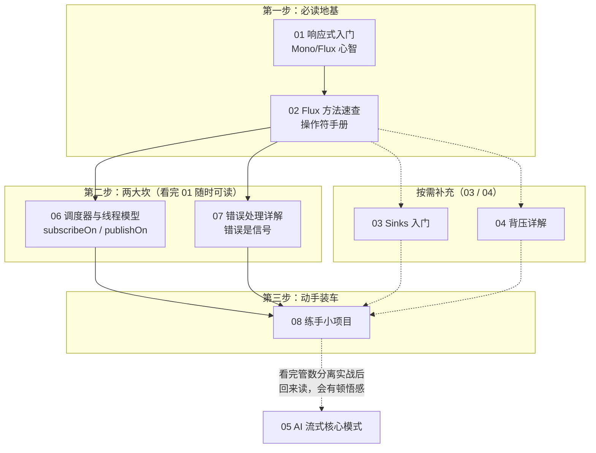

# Reactor 响应式编程（学习顺序）
> 📌 辅线定位：专为《教程/04 流式响应与Reactor深度》补充响应式编程背景

本文件夹是 **Reactor（Project Reactor）响应式编程**系列，是理解整个仓库 WebFlux / 流式代码的地基。**按编号顺序读**。

| 顺序 | 文档 | 你将学到 |
|:---:|------|---------|
| **01** | Reactor 响应式入门 | **最先读**。为什么用响应式？`Mono`/`Flux` 是什么？冷流热流、订阅机制——地基中的地基 |
| **02** | Flux 方法速查 | 操作符手册（map/flatMap/filter/do系列/onError 系列），读完 01 后随时查 |
| **03** | Reactor Sinks 入门 | 从外部塞数据进响应式世界、做多消费者广播（事件总线模式） |
| **04** | Reactor 背压详解 | 消费太慢怎么办——背压机制、`onBackpressureBuffer` 原理 |
| **05** | Reactor-AI 流式核心模式 | 把前面拼起来——AI 流式架构里的 `defer`/`concatWith`/`takeUntil` 实战模式 |
| **06** | Reactor 调度器与线程模型 | **Reactor 新手最大的坎**：`subscribeOn`/`publishOn` 到底把哪段切到哪个线程、`Schedulers` 全家桶、阻塞调用怎么隔离 |
| **07** | Reactor 错误处理详解 | **Reactor 新手第二大坎**：`onErrorResume`/`retry`/`doOnError` 怎么选，错误怎么变成 HTTP 状态码 |
| **08** | Reactor 练手小项目 | 把 01-07 全串起来：从零做一个实时股票行情推送应用（Flux.interval/Sinks/背压/线程/错误处理），SSE 推给前端——"动手做一个" |

> **建议节奏**：01→02 是必读地基；03/04 按需；**06 在你看完 01 后随时可读**——它回答"到底在哪个线程上跑"，看 WebFlux/管数分离代码时遇到 `boundedElastic` 就要回来翻它；**07 在你看完 01、开始被异常弄懵时读**——处理错误先建"错误是信号"的心智，再记四个恢复操作符；**08 练手项目放最后**——把 01-07 的零件装成一辆车，敲完它你就"会用"了；05 在你看完管数分离实战后回来读，会有顿悟感。

**学习路线**：

