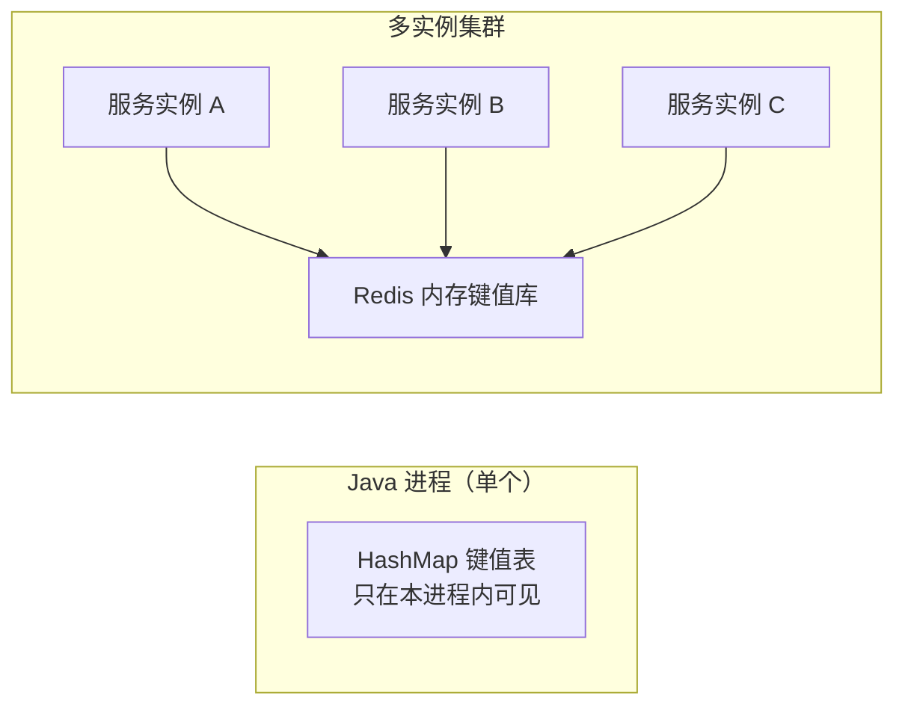
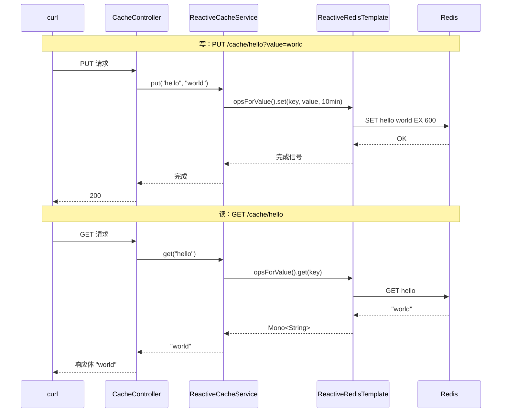
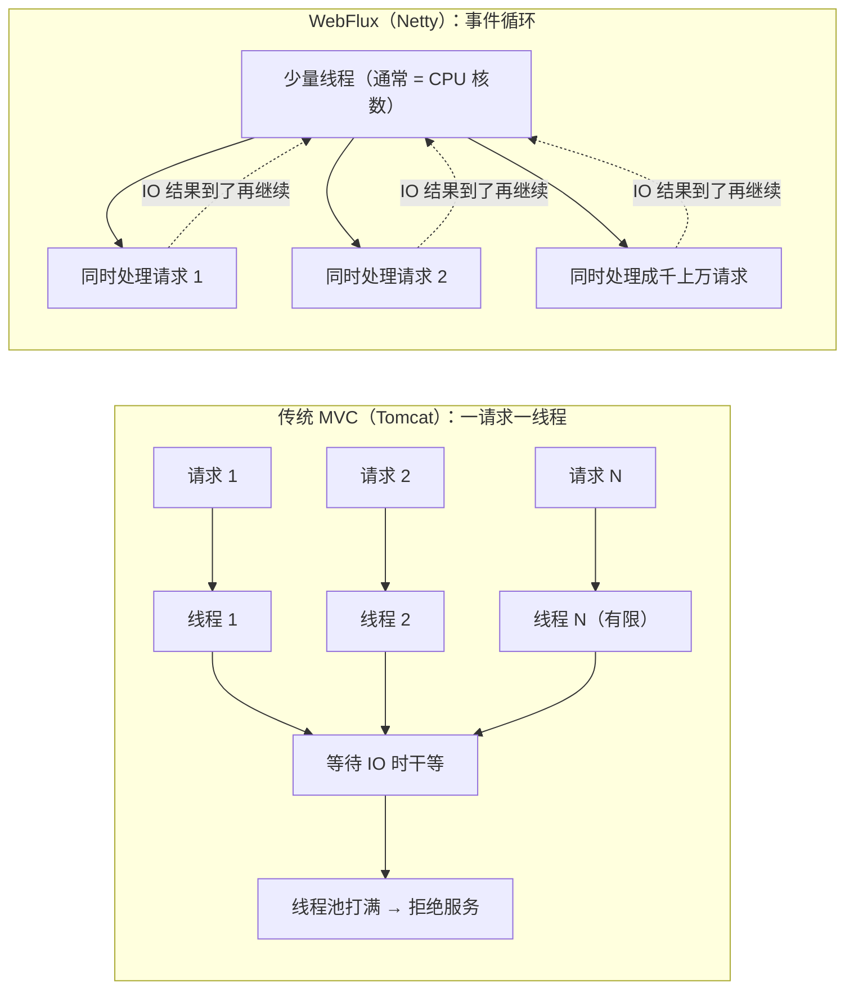

# Redis 基础 + Spring Boot 使用（地基文档）

> **本篇定位**：Redis 专题的**地基文档，最先读**。同文件夹的 [01-Streams 与 Pub/Sub](./01-Redis-Streams与PubSub实战.md)、[02-分布式锁](./02-Redis分布式锁实战.md) **都假设你已经会用 Redis 基础**（会起 Redis、会用五种数据结构、会在 Spring Boot 里收发）——它们上来就讲 Stream/锁这些进阶能力。本篇把这块地基补齐。
>
> **难度假设**：完全没接触过 Redis。读完本篇，你能做到三件事：**起一个 Redis、在 `redis-cli` 里把五种数据结构敲一遍、在 Spring Boot（WebFlux）里跑通收发**。
>
> **技术栈**：Spring Boot 4.x + Spring Data Redis 4.x（响应式栈用 `spring-boot-starter-data-redis-reactive`，默认 Lettuce 客户端）。
>
> **读完这篇之后**：去读 [01-Streams 与 Pub/Sub](./01-Redis-Streams与PubSub实战.md)（数据流载体，对应 [35-管数分离实战](../../tutorials/spring-ai-2.0/35-管数分离实战-从Sinks到Kafka演进.md) 第 4-8 章的 Redis 部分）和 [02-分布式锁](./02-Redis分布式锁实战.md)（第 8-9 章的 Redisson/SETNX）。如果你对"响应式到底是什么"还不放心，先补 [Reactor 响应式入门](../Reactor响应式编程/01-Reactor响应式入门.md)。

---

## 第 1 章：Redis 是什么 + 怎么起

### 1.1 Redis 是什么

**Redis（REmote DIctionary Server）是一个内存键值数据库**。核心就一句话：

> **一个存"键 → 值"的内存字典，你给它一个 key，它给你一个 value，速度是纳秒到微秒级。**

对比你熟悉的工具：

| 工具 | 本质 | 存哪 | 速度 |
|------|------|------|------|
| MySQL/PostgreSQL | 磁盘数据库，表 + SQL | 磁盘 | 毫秒级 |
| **Redis** | **内存键值数据库** | **内存** | **微秒级** |
| HashMap | 内存键值（单进程） | 进程内存 | 微秒级 |

**Redis 和 Java 的 `HashMap` 有什么本质区别？** 三点：

1. **跨进程/跨服务**：Redis 是独立进程，你自己的服务挂了它还在；多个服务实例都能读写同一个 Redis。
2. **数据结构更丰富**：不只是"键→一个值"，还有 List、Set、Hash、ZSet、Stream、HyperLogLog 等，且这些结构**自带原子操作**（如 `INCR` 自增、`LPUSH` 入队）。
3. **有持久化**：虽然主要靠内存，但可以配 RDB（定期快照）或 AOF（追加日志），重启不丢（视配置）。

**跨进程共享与 HashMap 对比**：



**单线程**：Redis 的命令执行是**单线程**的——同一时刻只执行一条命令。这反而带来一个巨大好处：**每条命令天然原子**（不会被其他命令打断）。后面 02 分布式锁、Stream 消费组都吃这个特性。

### 1.2 怎么起（任选其一）

**方式一：brew（macOS）**

```bash
brew install redis
brew services start redis      # 开机自启 + 后台跑
redis-cli ping                 # 验证：返回 PONG
```

**方式二：docker（跨平台，推荐）**

```bash
docker run -d --name redis -p 6379:6379 redis:7
redis-cli ping                 # 验证：返回 PONG
```

> **验证**：`redis-cli ping` 返回 `PONG`，说明 Redis 起来了。Redis 默认监听 `127.0.0.1:6379`。

### 1.3 进入命令行：`redis-cli`

`redis-cli` 是 Redis 自带的命令行客户端。敲 `redis-cli` 进入交互模式，或直接 `redis-cli <命令>` 一次性执行：

```bash
$ redis-cli
127.0.0.1:6379> SET hello world
OK
127.0.0.1:6379> GET hello
"world"
127.0.0.1:6379> EXIT
```

> **验证**：`SET hello world` 返回 `OK`，`GET hello` 返回 `"world"`。你已经成功写入并读出一条数据了。

**常用运维命令**（顺手记一下）：

```bash
redis-cli FLUSHALL   # 清空所有数据（别在生产干这事）
redis-cli DBSIZE     # 看有多少个 key
redis-cli INFO memory # 看内存占用
```

---

## 第 2 章：五种基础数据结构（redis-cli 逐个敲一遍）

Redis 有五种**基础**数据结构。每种我都给：**一句话本质 + 什么时候用 + 3~5 个命令 + 预期输出**。请打开你的 `redis-cli` 跟着敲。

### 2.1 String（字符串）——最基础，也是最常用

**本质**：key → 一个字符串（也可以存数字，`INCR` 原子自增）。

**什么时候用**：**缓存**（存 JSON、HTML、token）、**计数器**（浏览量、库存、序号——管数分离文档第 5 章用 `INCR` 生成 `seq` 单调序号）。

```bash
# SET 写入 / GET 读取
SET user:1 "{\"name\":\"张三\"}"
GET user:1
# 预期输出: "{\"name\":\"张三\"}"

# INCR 原子自增（不存在则从 0 开始）
INCR page:view
INCR page:view
# 预期输出: 1, 2

# DECR 自减
DECR page:view
# 预期输出: 1

# 带过期写入（10 秒后自动删，第 3 章细讲）
SET verify:code "482913" EX 10
TTL verify:code   # 剩余秒数，如 10
```

> **验证**：敲完上面命令，`GET user:1` 能读回 JSON，`INCR page:view` 连敲两次从 1、2 递增。**关键认知**：`INCR` 是**原子**的——并发下不会加错（Redis 单线程保证）。这就是为什么"计数器"必须用 Redis 而不是 Java 的 `i++`。

### 2.2 List（列表）——消息队列的雏形

**本质**：一个有序的字符串列表，**两头都能塞**。

**什么时候用**：**简单任务队列**（生产者 `LPUSH` 入队，消费者 `RPOP` 出队）、**最新 N 条**（`LTRIM` 只留最近 N 条，如"最近浏览记录"）。

```bash
# 左压入 / 右压入（LPUSH 新元素在头部，RPUSH 在尾部）
LPUSH queue task-1
RPUSH queue task-2
RPUSH queue task-3
# 现在列表是: task-1, task-2, task-3

# 读全部
LRANGE queue 0 -1
# 预期输出: 1) "task-1" 2) "task-2" 3) "task-3"

# 从头部弹出一个（LPOP），从尾部弹出一个（RPOP）
LPOP queue     # task-1
RPOP queue     # task-3，剩 task-2

# 只留前 N 条（做"最新 N 条"神器）
RPUSH feed 1 2 3 4 5
LTRIM feed 0 2    # 只留前 3 条
LRANGE feed 0 -1  # 1, 2, 3
```

> **验证**：`LRANGE queue 0 -1` 能按顺序看到 3 条。`LPUSH`+`RPOP` 就是最朴素的队列：一头进、另一头出，FIFO。**注意**：List 做队列是"弹出即删"，消息被消费后就不在了——需要持久回放、消费确认用 Stream（见 [01-Streams 与 Pub/Sub](./01-Redis-Streams与PubSub实战.md)）。

### 2.3 Set（集合）——去重 + 集合运算

**本质**：**无序、元素唯一**的集合（值不能重复）。

**什么时候用**：**去重**（今天访问过的人）、**标签**（一个用户的所有 tag）、**集合运算**（共同关注 = 交集）。

```bash
# 添加元素（重复加会被忽略）
SADD tags "java"
SADD tags "redis"
SADD tags "java"     # 已存在，返回 0，不重复加

# 查所有元素
SMEMBERS tags
# 预期输出: 1) "redis" 2) "java"（无序）

# 判断是否存在（会员查询，O(1)）
SISMEMBER tags "java"    # (integer) 1
SISMEMBER tags "python"  # (integer) 0

# 集合运算：交集 / 并集
SADD set-a 1 2 3
SADD set-b 2 3 4
SINTER set-a set-b      # 交集: 2, 3
SUNION set-a set-b      # 并集: 1, 2, 3, 4
```

> **验证**：`SISMEMBER tags "java"` 返回 1（在）、`"python"` 返回 0（不在）。**关键认知**：`SISMEMBER` 判断"某个元素在不在集合里"是 O(1)——这就是"查用户是否已关注/已领取"的答案。

### 2.4 Hash（哈希）——对象字段

**本质**：一个 key 下挂一个"小字典"（field → value）。**存对象的最自然选择**。

**什么时候用**：**存对象/实体**（用户资料、配置项）、**把多个相关字段放进同一个 key** 避免 key 泛滥。

```bash
# HSET 设字段 / HGET 取字段 / HGETALL 取全部
HSET user:1001 name "李四" age 30 city "北京"
HGET user:1001 name     # "李四"
HGETALL user:1001       # name/李四/age/30/city/北京 全部字段

# HINCRBY 对某个字段自增（对象里的计数器）
HINCRBY user:1001 age 1   # 31

# HEXISTS 判断字段是否存在
HEXISTS user:1001 age     # (integer) 1
```

> **验证**：`HGETALL user:1001` 能一次读回 3 个字段。**对比**：String 存 JSON 也行，但改一个字段要整个读出来重写；Hash 可以**只操作一个字段**（`HGET`/`HINCRBY`），更细粒度。

### 2.5 ZSet（有序集合）——排行榜

**本质**：Set + 每个元素带一个**分数（score）**，按分数排序。

**什么时候用**：**排行榜**（分数=得分）、**延迟队列**（分数=执行时间戳）、**限流滑动窗口**。

```bash
# ZADD 带分数添加
ZADD leaderboard 95 "alice"
ZADD leaderboard 88 "bob"
ZADD leaderboard 99 "carol"

# 按分数范围查（ZRANGEBYSCORE）——从小到大
ZRANGEBYSCORE leaderboard 90 100
# 预期输出: 1) "alice" 2) "carol"

# ZREVRANGE 按分数从高到低查（真正的排行榜）
ZREVRANGE leaderboard 0 2 WITHSCORES
# 预期输出: 1) "carol" 99 2) "alice" 95 3) "bob" 88

# 取某个元素的排名
ZREVRANK leaderboard "alice"     # (integer) 1（第 2 名）

# 更新分数（排行榜打榜）
ZADD leaderboard 100 "bob"       # 把 bob 的分数改成 100
ZREVRANGE leaderboard 0 2        # bob 直接登顶
```

> **验证**：`ZREVRANGE leaderboard 0 2 WITHSCORES` 能按分数从高到低排出前三名。**关键认知**：排行榜是 ZSet 的招牌场景——插入、更新、查 Top N 全是 O(log N)，还能用 `WITHSCORES` 把分数一起取回来展示。

### 2.6 五种结构速查表

| 结构 | 一句话 | 典型命令 | 什么时候用 |
|------|--------|---------|-----------|
| **String** | 一个键一个值 | `SET` `GET` `INCR` | 缓存、计数器 |
| **List** | 有序列表，两头进 | `LPUSH` `RPOP` `LRANGE` | 简单队列、最新 N 条 |
| **Set** | 无序不重复 | `SADD` `SMEMBERS` `SISMEMBER` | 去重、标签、交集 |
| **Hash** | key 下的小字典 | `HSET` `HGET` `HINCRBY` | 存对象、字段级操作 |
| **ZSet** | 带分数排序的集合 | `ZADD` `ZRANGEBYSCORE` `ZREVRANGE` | 排行榜、延迟队列 |

> **本仓库用到哪些**：35 号文档（Stream/Pub/Sub/锁）、[01-Streams 与 Pub/Sub](./01-Redis-Streams与PubSub实战.md)、[02-分布式锁](./02-Redis分布式锁实战.md) 主要吃 **String（`INCR` seq、`SETNX` 锁）** 和 **Stream**；五种基础结构里 **String 是最常用的**，请重点掌握。

---

## 第 3 章：过期与 TTL

### 3.1 命令

```bash
# 设 key，同时给 10 秒过期
SET code "482913" EX 10
TTL code          # (integer) 10 → 剩余秒数
# 等几秒后再查
TTL code          # (integer) 6
GET code          # 10 秒后 GET 返回 (nil)，key 被自动删了

# 对已有 key 单独设过期
SET session:abc "data"
EXPIRE session:abc 60    # 60 秒后删
PERSIST session:abc      # 取消过期，永不过期
```

> **验证**：`SET code "x" EX 10` 后 `TTL` 从 10 递减，10 秒后 `GET code` 返回 `(nil)`。

### 3.2 缓存为什么要设过期

**不设过期的缓存会烂掉**，三个理由：

1. **内存会被吃光**：Redis 是内存数据库，key 只增不减，最终 OOM。TTL 是 Redis 的"垃圾回收"。
2. **数据会过期变陈旧**：缓存的是"数据库的副本"，上游数据变了，缓存要自动失效，否则一直给旧数据。TTL 是"最短的保鲜期"。
3. **防止 key 永远活着**：临时数据（验证码、session、分布式锁）如果不设过期，一旦持有者崩溃就永远删不掉——**分布式锁必须带过期，这是 [02-分布式锁](./02-Redis分布式锁实战.md) 的核心之一**。

> **典型 TTL 策略**：验证码 5 分钟、session 30 分钟、临时 token 1 小时、热点数据 10 分钟~1 天。**没有银弹，按业务保鲜期定**。

### 3.3 Spring Boot 里怎么设过期

```java
redis.opsForValue().set("code", "482913", Duration.ofSeconds(10));  // SET EX
redis.expire("session:abc", Duration.ofMinutes(30));                // EXPIRE
```

---

## 第 4 章：Spring Boot 使用

### 4.1 依赖：阻塞 vs 响应式（选哪个，先记结论）

| 依赖 | 客户端 | 返回类型 | 适合 |
|------|--------|---------|------|
| `spring-boot-starter-data-redis` | Lettuce/Jedis | `RedisTemplate`（同步） | 传统 MVC/阻塞栈 |
| `spring-boot-starter-data-redis-reactive` | Lettuce（默认） | `ReactiveRedisTemplate`（`Mono`/`Flux`） | **WebFlux 响应式栈（本仓库）** |

**本仓库 WebFlux 栈必须用 reactive 版**（为什么是铁律，第 5 章讲透）。35 号文档就是这么引的：

```xml
<dependency>
    <groupId>org.springframework.boot</groupId>
    <artifactId>spring-boot-starter-data-redis-reactive</artifactId>
</dependency>
```

### 4.2 配置 `spring.data.redis.*`

`application.yaml`：

```yaml
spring:
  data:
    redis:
      host: ${REDIS_HOST:localhost}
      port: ${REDIS_PORT:6379}
      password: ${REDIS_PASSWORD:}      # 本地没密码就留空
      database: 0                       # 默认 0 号库（Redis 有 0-15 号库）
      # timeout: 2s                    # 连接超时，响应式下默认不设也可
```

> **注意前缀**：Spring Boot 3.x 起，Redis 配置前缀从 `spring.redis.*` 改成了 **`spring.data.redis.*`**。网上老教程写 `spring.redis.host`，在 Boot 4.x 里**不生效**。

### 4.3 阻塞版最小收发（RedisTemplate）

> **什么时候看这节**：你在传统 MVC 项目（Spring MVC + Tomcat）里用 Redis 时。WebFlux 项目直接跳到 4.4。

**配置类**——给 `RedisTemplate` 配 String 序列化，否则默认用 JDK 序列化，存进去是乱码二进制、`redis-cli` 里不可读：

```java
package com.example.config;

import org.springframework.context.annotation.Bean;
import org.springframework.context.annotation.Configuration;
import org.springframework.data.redis.connection.RedisConnectionFactory;
import org.springframework.data.redis.core.RedisTemplate;
import org.springframework.data.redis.serializer.StringRedisSerializer;

@Configuration
public class RedisConfig {

    @Bean
    public RedisTemplate<String, String> redisTemplate(RedisConnectionFactory factory) {
        RedisTemplate<String, String> template = new RedisTemplate<>();
        template.setConnectionFactory(factory);
        // key、value、hash 全用 String 序列化（和 redis-cli 里看到的一致）
        template.setKeySerializer(new StringRedisSerializer());
        template.setValueSerializer(new StringRedisSerializer());
        template.setHashKeySerializer(new StringRedisSerializer());
        template.setHashValueSerializer(new StringRedisSerializer());
        template.afterPropertiesSet();
        return template;
    }
}
```

**收发代码**：

```java
package com.example.service;

import org.springframework.data.redis.core.RedisTemplate;
import org.springframework.stereotype.Service;

import java.time.Duration;

@Service
public class CacheService {
    private final RedisTemplate<String, String> redis;

    public CacheService(RedisTemplate<String, String> redis) {
        this.redis = redis;
    }

    public void put(String key, String value) {
        redis.opsForValue().set(key, value, Duration.ofMinutes(10));  // SET + EXPIRE
    }

    public String get(String key) {
        return redis.opsForValue().get(key);   // GET，没有返回 null
    }

    public Long incr(String key) {
        return redis.opsForValue().increment(key);   // INCR
    }
}
```

> **验证**：启动一个 MVC 项目，`curl` 或测试里调 `put("hello", "world")`，然后在终端 `redis-cli GET hello` 应返回 `"world"`——**和你自己用 redis-cli 写的完全一致**，因为序列化也是 String。

### 4.4 响应式版最小收发（ReactiveRedisTemplate，本仓库用这个）

**配置类**——返回 `Mono`/`Flux`，方法名和阻塞版几乎一样，只是返回类型不同：

```java
package com.example.config;

import org.springframework.context.annotation.Bean;
import org.springframework.context.annotation.Configuration;
import org.springframework.data.redis.connection.ReactiveRedisConnectionFactory;
import org.springframework.data.redis.core.ReactiveRedisTemplate;
import org.springframework.data.redis.serializer.RedisSerializationContext;
import org.springframework.data.redis.serializer.StringRedisSerializer;

@Configuration
public class RedisConfig {

    @Bean
    public ReactiveRedisTemplate<String, String> reactiveRedisTemplate(
            ReactiveRedisConnectionFactory factory) {
        // key/value/hash 全用 String 序列化，和 redis-cli 一致
        RedisSerializationContext<String, String> context = RedisSerializationContext
                .<String, String>newSerializationContext(new StringRedisSerializer())
                .key(new StringRedisSerializer())
                .value(new StringRedisSerializer())
                .hashKey(new StringRedisSerializer())
                .hashValue(new StringRedisSerializer())
                .build();
        return new ReactiveRedisTemplate<>(factory, context);
    }
}
```

**收发代码**：

```java
package com.example.service;

import org.springframework.data.redis.core.ReactiveRedisTemplate;
import org.springframework.stereotype.Service;
import reactor.core.publisher.Mono;

import java.time.Duration;

@Service
public class ReactiveCacheService {
    private final ReactiveRedisTemplate<String, String> redis;

    public ReactiveCacheService(ReactiveRedisTemplate<String, String> redis) {
        this.redis = redis;
    }

    /** SET + EXPIRE，返回 Mono<Void>，可串到其他响应式链路里 */
    public Mono<Void> put(String key, String value) {
        return redis.opsForValue()
                .set(key, value, Duration.ofMinutes(10))
                .then();                                    // true → 完成信号
    }

    /** GET，没有返回 Mono.empty() */
    public Mono<String> get(String key) {
        return redis.opsForValue().get(key);
    }

    /** INCR，返回自增后的值 */
    public Mono<Long> incr(String key) {
        return redis.opsForValue().increment(key);
    }
}
```

**在 Controller 里怎么用**（这是"跑通收发"的完整闭环）：

```java
package com.example.web;

import org.springframework.web.bind.annotation.*;
import reactor.core.publisher.Mono;

@RestController
@RequestMapping("/cache")
public class CacheController {
    private final ReactiveCacheService service;

    public CacheController(ReactiveCacheService service) {
        this.service = service;
    }

    @PutMapping("/{key}")
    public Mono<Void> put(@PathVariable String key, @RequestParam String value) {
        return service.put(key, value);
    }

    @GetMapping("/{key}")
    public Mono<String> get(@PathVariable String key) {
        return service.get(key);
    }
}
```

**核心收发时序**：



> **验证**：
> ```bash
> # 写
> curl -X PUT "http://localhost:8080/cache/hello?value=world"
> # 读（响应式，GET 返回响应体 "world"）
> curl "http://localhost:8080/cache/hello"          # → world
> # 和 redis-cli 对得上
> redis-cli GET hello                                # → "world"
> ```

> **关键认知**：`opsForValue()` 是 `ReactiveRedisTemplate` 的 String 操作入口，**方法名几乎就是 Redis 命令名**：`set`=SET、`get`=GET、`increment`=INCR、`setIfAbsent`=SETNX。其他结构同理——`opsForList()`=List、`opsForSet()`=Set、`opsForHash()`=Hash、`opsForZSet()`=ZSet、`opsForStream()`=Stream。**学会 String，其他结构换入口方法就能上手。**

---

## 第 5 章：响应式 vs 阻塞（本仓库的铁律）

### 5.1 WebFlux 是"事件循环"，不是"一请求一线程"

传统 MVC（Tomcat）：**一个请求占一个线程**，线程在等待 IO（读数据库、读 Redis）时**干等**。线程数是有限的（默认几百），并发一上来线程池打满就拒绝服务。

WebFlux（Netty）：**少量线程（通常 = CPU 核数）跑一个事件循环**，一个线程**同时处理成千上万个请求**。它的绝招是"**绝不在等待 IO 时卡住线程**"——请求来了登记一下，IO 结果到了再继续往下走。所以 WebFlux 的线程**永远不该被阻塞**。

**线程模型对比**：



### 5.2 阻塞版 Redis 客户端为什么会榨干事件循环

假如你的 WebFlux 项目错误地用了阻塞版 `RedisTemplate`：

```java
// ❌ 错误示范：WebFlux 里用阻塞 RedisTemplate
@GetMapping("/bad")
public String bad() {
    return blockingRedis.opsForValue().get("hello");   // 阻塞！
}
```

这个 `get()` 是**同步阻塞**的——它会**卡住当前线程**直到 Redis 返回。而 WebFlux 里"当前线程"就是**事件循环线程**（就那 4~8 个）！

> **阻塞调用 = 把一个事件循环线程钉死在等待 Redis 上。** 一个请求卡住一个事件循环线程，等于**少了几百个并发能力**。请求一多，**全部事件循环线程都被钉住，整个服务就"卡死"了**——新的请求没人处理，吞吐瞬间归零。这就是"事件循环被榨干"。

**对比**：Tomcat 里阻塞一下无所谓（线程池大，大不了等）；Netty 里阻塞一下是灾难（线程本来就少，还全被钉住）。

### 5.3 铁律

> **铁律：WebFlux 响应式栈必须配响应式客户端。** 用 `spring-boot-starter-data-redis-reactive` + `ReactiveRedisTemplate`，绝对不要引 `spring-boot-starter-data-redis` 阻塞版。

这条铁律不只对 Redis——**JDBC（MyBatis-Flex）、Redisson 的 `RLock` 也是阻塞 API**，在 WebFlux 里都必须用 `Schedulers.boundedElastic()` 隔离到弹性线程池，不能直接在 reactor 线程里调。35 号文档第 7 章、第 9 章就是这么处理的（`Mono.fromCallable(...).subscribeOn(Schedulers.boundedElastic())`）。

**那什么时候可以用阻塞版？**

- 你是**传统 MVC（Tomcat）项目**——用阻塞版完全合理（还要 `RedisTemplate`）。
- 你是 WebFlux，但某个**低频、必须用阻塞 API**的调用（如 Redisson 锁）——用 `boundedElastic()` 隔离，别在事件循环线程里裸调。

> **本仓库的答案**：全文（35 号文档及本专题）都是 WebFlux 响应式栈，Redis 一律 `ReactiveRedisTemplate`，阻塞 API（JDBC/Redisson）一律 `boundedElastic()` 隔离。

---

## 总结

| 你该掌握的 | 一句话 |
|-----------|--------|
| **Redis 是什么** | 内存键值数据库，单线程、命令原子、微秒级 |
| **怎么起** | `brew services start redis` 或 `docker run -d --name redis -p 6379:6379 redis:7`，`redis-cli` 进命令行 |
| **String** | 缓存 + 计数器，`SET/GET/INCR`（`INCR` 是原子的） |
| **List** | 简单队列，`LPUSH/RPOP/LRANGE`（弹出即删） |
| **Set** | 去重/集合运算，`SADD/SISMEMBER/SINTER` |
| **Hash** | 存对象，`HSET/HGET/HINCRBY`（字段级操作） |
| **ZSet** | 排行榜，`ZADD/ZRANGEBYSCORE/ZREVRANGE` |
| **TTL** | `EXPIRE`/`SET EX`，防内存吃光、防数据陈旧、防锁泄漏 |
| **Spring Boot** | 依赖 `data-redis-reactive`，配置 `spring.data.redis.*`，`ReactiveRedisTemplate` + String 序列化 |
| **铁律** | WebFlux 必须用响应式客户端，阻塞版榨干事件循环 |

**接下来按顺序读**：

1. [01-Streams 与 Pub/Sub](./01-Redis-Streams与PubSub实战.md)——Redis 的**数据流载体**（Stream 持久日志 + Pub/Sub 实时广播），对应 [35-管数分离实战](../../tutorials/spring-ai-2.0/35-管数分离实战-从Sinks到Kafka演进.md) 第 4、7 章的 Redis 部分。
2. [02-分布式锁](./02-Redis分布式锁实战.md)——从 `SETNX` 到 Redisson 看门狗、fencing token，对应 35 号文档第 8-9 章。
3. 如果对"响应式到底怎么流转"还想补，读 [Reactor 响应式入门](../Reactor响应式编程/01-Reactor响应式入门.md)（`Mono`/`Flux`、冷流热流、订阅机制）。
4. 看完 01/02 再回头看 [35-管数分离实战](../../tutorials/spring-ai-2.0/35-管数分离实战-从Sinks到Kafka演进.md) 第 4-9 章，你会发现 Stream/锁/响应式的每个"为什么"都有答案了。

> **一句话记住 Redis**：**比数据库快、比 HashMap 大（跨进程共享）、数据结构丰富、命令原子**。地基打好了，后面 Stream 和锁都是在这五种结构上长出来的。
