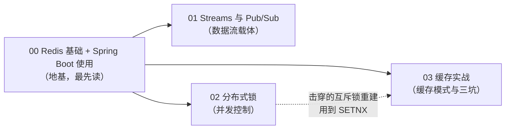

# Redis 专题（学习顺序）
> 📌 辅线定位：专为《教程/25-Agent记忆架构 / 教程/34-研究Agent与知识库实战》补充缓存/会话/分布式锁背景

本文件夹是 **Redis 数据结构与分布式能力** 系列。Redis 在本仓库既是数据载体（Stream/Pub/Sub），也是并发控制（分布式锁）。

| 顺序 | 文档 | 你将学到 |
|:---:|------|---------|
| **00** | Redis 基础 + Spring Boot 使用 | **最先读**。起 Redis、五种基础数据结构（String/List/Set/Hash/ZSet）、TTL、Spring Boot 响应式收发——01/02 的地基 |
| **01** | Redis Streams 与 Pub/Sub 实战 | Stream（持久日志）+ Pub/Sub（实时广播）——数据流载体 |
| **02** | Redis 分布式锁实战 | SETNX→Lua→Redisson 看门狗→fencing token——并发控制从朴素到严谨 |
| **03** | Redis 缓存实战 | Cache-Aside 模式、穿透/击穿/雪崩三坑、Spring Cache 注解、RedisTemplate 手动缓存、与 DB 一致性——"怎么把缓存用对" |

**学习路线**：

> **顺序说明**：**00 是地基，最先读**；01、02、03 默认你已会用 Redis 基础，上来直接讲进阶能力。缓存篇和锁篇会互相引用（击穿的互斥锁重建用了 SETNX）。
>
> **关联**：这几篇的内容在管数分离实战里都有落地（Stream/Pub/Sub 做数据总线、用 Redisson 做单一写者锁）。
