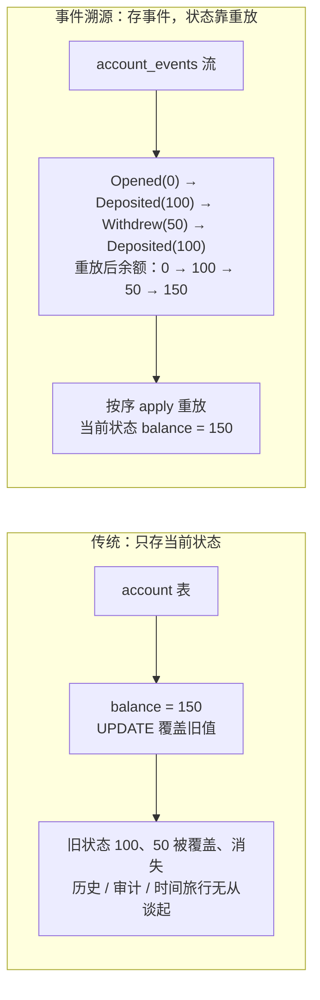
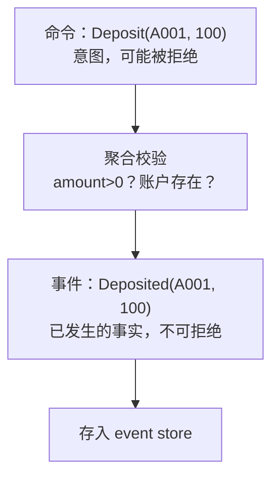
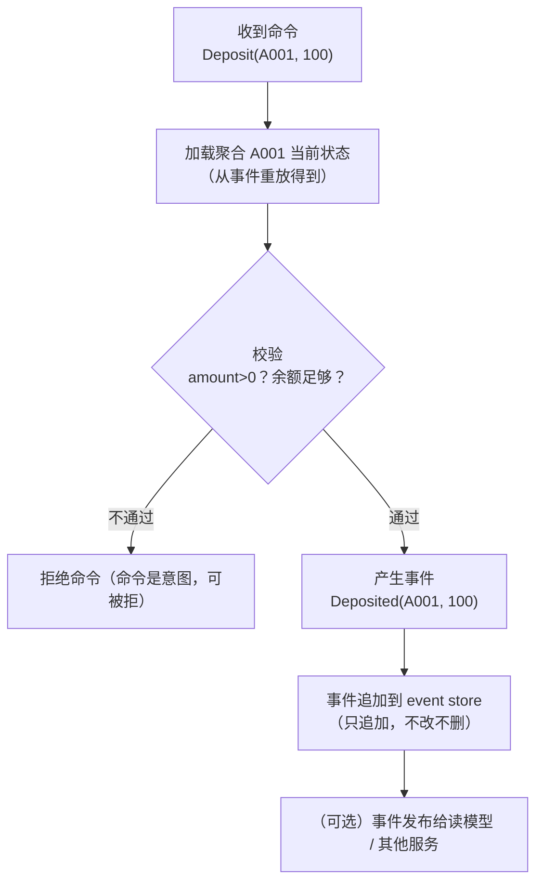
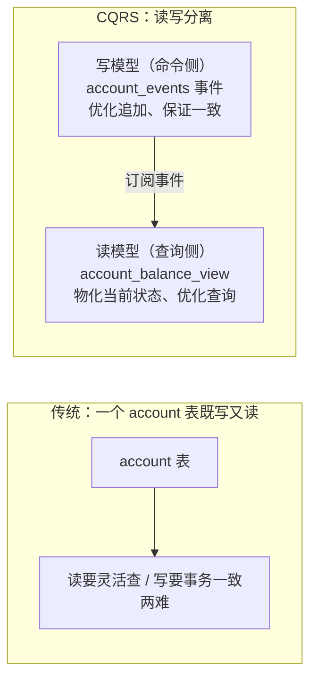
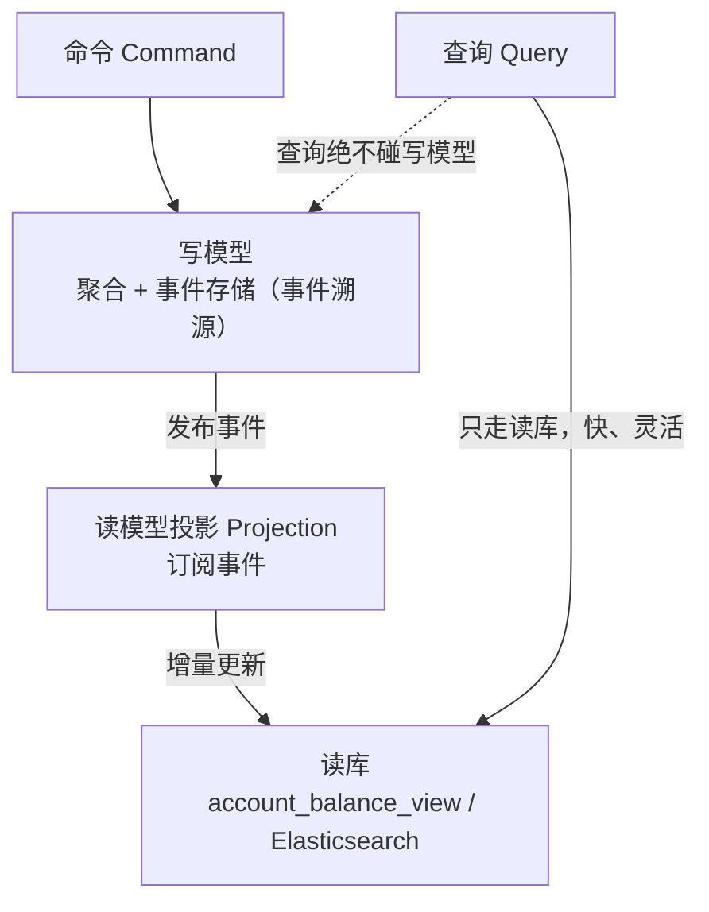
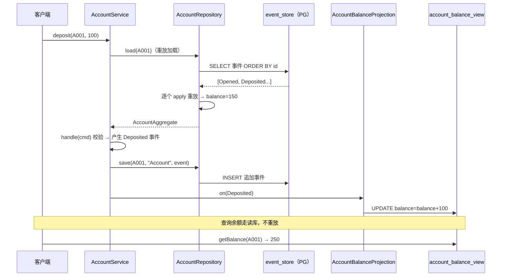
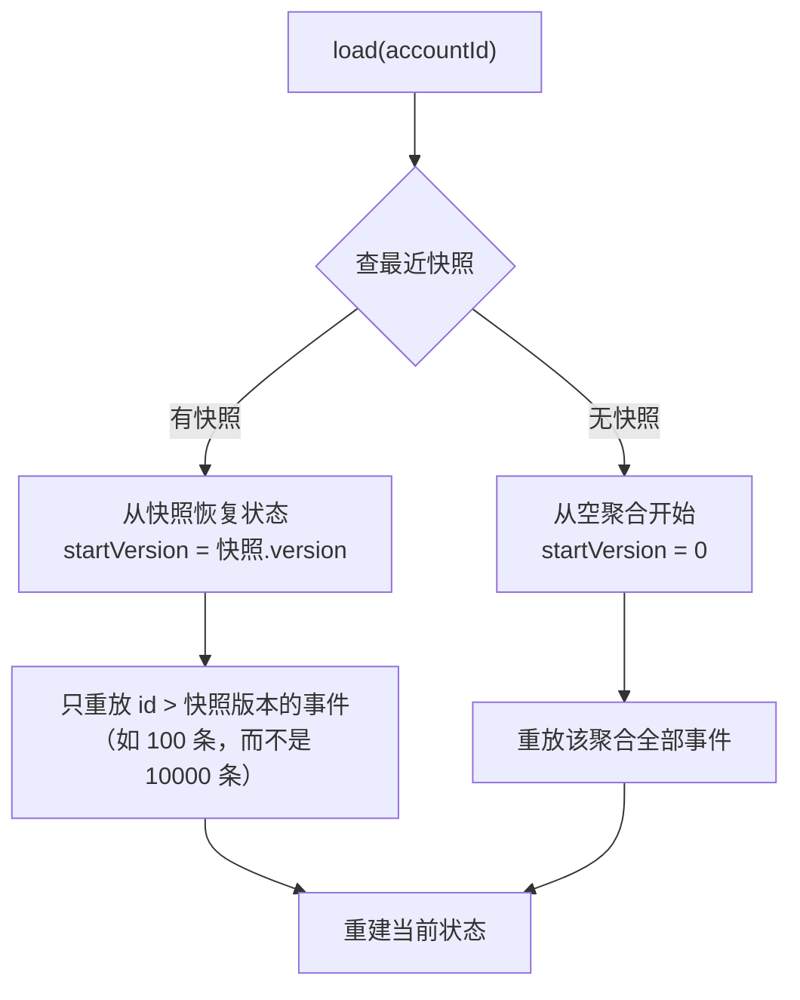

# 事件溯源与 CQRS 实战（从状态存储到事件日志的思维跃迁）

> **这份文档是什么**：一篇**独立专题**，讲事件驱动架构里最深的两个模式——**事件溯源（Event Sourcing）** 和 **CQRS（命令查询职责分离）**。它们不属于 Spring Cloud Stream（那是消息框架），而是**数据架构模式**——决定"系统怎么存储和查询数据"的根本思维。
>
> **写给谁**：已经会用消息框架发布和消费事件、理解事件通信的人。这篇带你理解"**如果把事件当成数据的源头本身**"会发生什么——这是金融、电商、审计类系统的深度玩法。
>
> **和消息框架的关系**：消息框架（本仓库用 Kafka）是"**搬**事件"的管道；事件溯源是"**用事件当数据库**"的思想。两者常配合：事件溯源系统产生的事件，用 Kafka 分发给读模型。但它们是**独立的两件事**——本篇不依赖 Kafka 消息框架。
>
> **版本前提（已校验）**：Spring Boot 3.4.x + PostgreSQL。核心概念对照 [microservices.io 事件溯源模式](https://microservices.io/patterns/data/event-sourcing.html) 和 [Axon Framework](https://blog.nebrass.fr/playing-with-cqrs-and-event-sourcing-in-spring-boot-and-axon/) 校验。

---

## 目录

- [第 1 章：为什么需要它——传统状态存储的局限](#第-1-章为什么需要它传统状态存储的局限)
- [第 2 章：事件溯源的核心思想——用事件当数据源](#第-2-章事件溯源的核心思想用事件当数据源)
- [第 3 章：CQRS——读写分离](#第-3-章cqrs读写分离)
- [第 4 章：动手——用 Spring Boot + PG 实现一个事件溯源系统](#第-4-章动手用-spring-boot--pg-实现一个事件溯源系统)
- [第 5 章：聚合重建与快照——性能优化](#第-5-章聚合重建与快照性能优化)
- [第 6 章：该不该用——架构师取舍](#第-6-章该不该用架构师取舍)

---

## 第 1 章：为什么需要它——传统状态存储的局限

### 1.1 传统方式：存"当前状态"

你平时怎么做？比如"银行账户"，建一张 `account` 表：

```
account 表
id    | balance
------|--------
A001  | 150
```

`balance = 150` 是**当前状态**。存钱 `+100` → `UPDATE account SET balance=250`。**旧状态（150）被覆盖、消失了。**

这有三个深层问题：

1. **丢失历史**：想知道"A001 上个月有过哪些交易"？查不到——只剩当前余额。要做审计、对账、回放分析时，无米下锅。
2. **调试困难**：bug 出在某个时间点，你想知道"系统当时到底经历了什么才变成现在这样"？没有记录。
3. **并发冲突粗糙**：两个人同时改余额，只能靠乐观锁版本号"谁后改谁失败"，但**不知道他们各自想做什么**（是想存钱还是取钱），无法做精细的业务判断。

### 1.2 一个真实痛点：金融审计

银行、财务系统被法规要求**保留每一笔交易记录，能重建任意时刻的账**。传统"只存当前状态"根本满足不了——于是他们要么单独维护一张"流水表"（和余额表要同步，很麻烦），要么……

要么用**事件溯源**。

---

## 第 2 章：事件溯源的核心思想——用事件当数据源

### 2.1 颠覆性的想法：不存状态，存事件

**事件溯源（Event Sourcing）**：数据库**不存当前状态，存所有发生过的事件**。当前状态由事件**重放计算**得出。

**两种存储方式对比**：



要查 A001 当前余额？把这 4 个事件按顺序"重放"（apply），算出来是 150。要查上个月的？重放到上个月那个时间点的事件即可——**时间旅行**。

### 2.2 关键术语

| 术语 | 含义 |
|------|------|
| **事件（Event）** | 已发生的、不可变的事实（如 `Deposited(100)`）。用过去式命名。 |
| **聚合（Aggregate）** | 业务一致性的边界（如"账户"）。事件归属于某个聚合。聚合的状态由它的事件重放得出。 |
| **事件存储（Event Store）** | 存事件的地方（本篇用 PG 的一张表）。只追加（append-only），不改不删。 |
| **重放（Replay）** | 把某聚合的所有事件按序 apply，重建当前状态。 |
| **命令（Command）** | 外界的意图（如"存 100"）。系统校验命令后产生事件。 |

### 2.3 命令 vs 事件（别混淆）

- **命令**：意图，可能被拒绝（"存 -100"？拒绝，金额非法）。表达"想要做什么"。
- **事件**：已发生的事实，不可拒绝（已经发生了）。表达"做成了什么"。



### 2.4 一个完整的写入流程

**完整写入流程**：



**关键认知**：第 2 步"加载状态"靠重放——这就是事件溯源的标志。

---

## 第 3 章：CQRS——读写分离

### 3.1 CQRS 是什么

**CQRS（Command Query Responsibility Segregation）**：把"**写**模型"和"**读**模型"彻底分开，用不同的数据结构（甚至不同的库）。



### 3.2 为什么写读要分开

**写**和**读**的优化方向是矛盾的：

| 维度 | 写模型想怎样 | 读模型想怎样 |
|------|------------|------------|
| 结构 | 规范化、保证一致 | 反规范化、方便查询 |
| 事务 | 必须 ACID | 可以最终一致 |
| 例子 | 事件流（追加日志） | 宽表 / Elasticsearch / Redis 缓存 |

硬塞在一个表里，两边都别扭。CQRS 让各自用最合适的结构。

### 3.3 CQRS + 事件溯源的配合（黄金搭档）

- **写侧**：事件溯源（存事件，重放得状态）。
- **读侧**：CQRS（单独的读库，由投影从事件流增量构建）。
- 查询永远走读库——快、灵活。

**CQRS + 事件溯源的黄金搭档**：



> **CQRS 和事件溯源不是绑定的**。可以只 CQRS 不溯源（写侧存当前状态，读侧单独建读库）；也可以只溯源不 CQRS（读也靠重放，但慢）。**但它们配合最强大**——这就是本篇教的样子。

---

## 第 4 章：动手——用 Spring Boot + PG 实现一个事件溯源系统

场景：**银行账户**——开户、存钱、取钱。完整实现"事件存储 + 聚合 + 投影（读模型）"。

### 4.1 事件存储表

```sql
-- 事件存储：只追加，不改不删
CREATE TABLE event_store (
    id            BIGSERIAL PRIMARY KEY,       -- 全局自增（事件全局有序）
    aggregate_id  VARCHAR(64)  NOT NULL,       -- 聚合 id（如账户号）
    aggregate_type VARCHAR(64) NOT NULL,       -- 聚合类型（如 "Account"）
    event_type    VARCHAR(128) NOT NULL,       -- 事件类型（如 "Deposited"）
    payload       JSONB        NOT NULL,       -- 事件内容
    created_at    TIMESTAMPTZ  NOT NULL DEFAULT now()
);
CREATE INDEX idx_event_aggregate ON event_store (aggregate_id, id);  -- ▼ 按聚合查事件（重放用）
```

### 4.2 事件定义

```java
// 事件是不可变的事实——字段全 final，用 record 最合适
public sealed interface AccountEvent permits AccountOpened, Deposited, Withdrew {}

public record AccountOpened(String accountId, String owner) implements AccountEvent {}
public record Deposited(String accountId, double amount) implements AccountEvent {}
public record Withdrew(String accountId, double amount) implements AccountEvent {}
```

> **用 Java `record` + `sealed`**：事件是不可变值对象（record 完美匹配），sealed 限定事件类型（穷举安全）。这是 Java 21+ 写事件的现代姿势。

### 4.3 聚合：状态 + 校验 + 产生事件

```java
// 账户聚合：状态由事件重放得出
public class AccountAggregate {
    private String accountId;
    private double balance;
    private boolean active;

    // ▼ 重放：把历史事件逐个 apply，重建状态
    public void apply(AccountEvent event) {
        switch (event) {
            case AccountOpened e -> { this.accountId = e.accountId(); this.active = true; this.balance = 0; }
            case Deposited e -> { this.balance += e.amount(); }
            case Withdrew e -> { this.balance -= e.amount(); }
        }
    }

    // ▼ 命令处理：校验意图，产生事件（不改状态——状态由 apply 事件改变）
    public Deposited handle(DepositCommand cmd) {
        if (!active) throw new IllegalStateException("账户未激活");
        if (cmd.amount() <= 0) throw new IllegalArgumentException("存款必须>0");
        return new Deposited(accountId, cmd.amount());   // 产生事件
    }

    public Withdrew handle(WithdrawCommand cmd) {
        if (!active) throw new IllegalStateException("账户未激活");
        if (cmd.amount() <= 0) throw new IllegalArgumentException("取款必须>0");
        if (balance < cmd.amount()) throw new IllegalStateException("余额不足");  // 余额靠重放得到
        return new Withdrew(accountId, cmd.amount());
    }

    public double getBalance() { return balance; }
}
```

**关键设计**：聚合**不直接改状态**，而是"校验命令 → 产生事件"。状态只能通过 `apply(事件)` 改变。这保证了"状态永远由事件推导"，是事件溯源的铁律。

### 4.4 仓储：加载（重放）+ 保存（追加）

```java
@Repository
public class AccountRepository {

    private final JdbcTemplate jdbc;
    private final ObjectMapper mapper;

    public AccountRepository(JdbcTemplate jdbc, ObjectMapper mapper) {
        this.jdbc = jdbc; this.mapper = mapper;
    }

    // ▼ 加载聚合：读出该聚合所有事件，重放
    @Transactional
    public AccountAggregate load(String accountId) {
        List<AccountEvent> events = jdbc.query(
            "SELECT event_type, payload FROM event_store WHERE aggregate_id=? ORDER BY id",
            (rs, i) -> deserialize(rs.getString("event_type"), rs.getString("payload")),
            accountId);
        if (events.isEmpty()) throw new NotFoundException("账户不存在");
        AccountAggregate agg = new AccountAggregate();
        events.forEach(agg::apply);   // 按序重放
        return agg;
    }

    // ▼ 保存：追加事件（不改不删）
    @Transactional
    public void save(String aggregateId, String aggregateType, AccountEvent event) {
        String type = event.getClass().getSimpleName();
        String payload = mapper.writeValueAsString(event);
        jdbc.update("INSERT INTO event_store(aggregate_id, aggregate_type, event_type, payload) VALUES(?,?,?,?::jsonb)",
            aggregateId, aggregateType, type, payload);
    }

    private AccountEvent deserialize(String type, String payload) {
        // 按 type 反序列化成具体事件类（略，用 mapper.readValue + type 映射）
        ...
    }
}
```

### 4.5 服务层：串联命令流程

```java
@Service
public class AccountService {

    private final AccountRepository repo;

    public AccountService(AccountRepository repo) { this.repo = repo; }

    // 存款：加载聚合 → 处理命令 → 保存事件
    @Transactional
    public void deposit(String accountId, double amount) {
        AccountAggregate agg = repo.load(accountId);     // ① 重放加载
        Deposited event = agg.handle(new DepositCommand(accountId, amount));  // ② 校验+产生事件
        repo.save(accountId, "Account", event);           // ③ 追加事件

        // ④ （CQRS）发布事件给读模型更新——见 4.6
        events.publish(event);
    }
}
```

### 4.6 投影（Projection）：构建读模型

```sql
-- 读模型表：当前余额（物化视图）
CREATE TABLE account_balance_view (
    account_id VARCHAR(64) PRIMARY KEY,
    owner      VARCHAR(128),
    balance    DOUBLE PRECISION,
    updated_at TIMESTAMPTZ
);
```

```java
// ▼ 投影：订阅事件，增量更新读模型
@Component
public class AccountBalanceProjection {

    private final JdbcTemplate jdbc;

    public AccountBalanceProjection(JdbcTemplate jdbc) { this.jdbc = jdbc; }

    public void on(AccountOpened e) {
        jdbc.update("INSERT INTO account_balance_view(account_id, owner, balance, updated_at) VALUES(?,?,0,now())",
            e.accountId(), e.owner());
    }
    public void on(Deposited e) {
        jdbc.update("UPDATE account_balance_view SET balance=balance+?, updated_at=now() WHERE account_id=?",
            e.amount(), e.accountId());
    }
    public void on(Withdrew e) {
        jdbc.update("UPDATE account_balance_view SET balance=balance-?, updated_at=now() WHERE account_id=?",
            e.amount(), e.accountId());
    }
}
```

**查询账户余额**——走读库，**不重放**：

```java
public double getBalance(String accountId) {
    return jdbc.queryForObject("SELECT balance FROM account_balance_view WHERE account_id=?", Double.class, accountId);
}
```

这就是 CQRS——**写走 event store（重放），读走 view 表（直接查）**。

**存款命令的完整调用时序**：



---

## 第 5 章：聚合重建与快照——性能优化

### 5.1 问题：重放变慢

事件溯源有个天然代价：**加载聚合要重放所有历史事件**。账户开了 5 年、有 1 万条交易——每次取款都要重放 1 万条？太慢。

### 5.2 解法：快照（Snapshot）

**快照**：每隔 N 个事件，把聚合的当前状态**存一份快照**。加载时：先读最近的快照，再重放快照之后的事件。

无快照：重放全部 10000 条事件；有快照（每 100 条存一次）：读第 9900 条的快照 + 只重放后面 100 条。

```sql
CREATE TABLE account_snapshot (
    aggregate_id VARCHAR(64) PRIMARY KEY,
    version      BIGINT NOT NULL,        -- 快照对应到第几个事件
    state        JSONB  NOT NULL          -- 聚合状态（如 {balance:150}）
);
```

```java
public AccountAggregate load(String accountId) {
    // ① 先查最近的快照
    SnapshotRow snap = jdbc.queryForObject("SELECT version, state FROM account_snapshot WHERE aggregate_id=?",
        ..., accountId);
    AccountAggregate agg;
    long startVersion;
    if (snap != null) {
        agg = deserialize(snap.state());       // 从快照恢复
        startVersion = snap.version();
    } else {
        agg = new AccountAggregate();
        startVersion = 0;
    }
    // ② 只重放快照之后的事件
    List<AccountEvent> events = jdbc.query(
        "SELECT ... FROM event_store WHERE aggregate_id=? AND id>? ORDER BY id", ..., accountId, startVersion);
    events.forEach(agg::apply);
    return agg;
}
```

**快照优化后的加载流程**：



### 5.3 快照策略

- **频率**：每 N 个事件存一次（如每 100）。太频繁→写放大；太少→重放仍慢。
- **触发**：保存事件时检查"自上次快照是否超过 N 条"，超过就存。
- **取舍**：快照优化读取，但增加写复杂度。**事件不多时（<几百条）不用快照**，别过早优化。

---

## 第 6 章：该不该用——架构师取舍

### 6.1 事件溯源+CQRS 的收益

1. **完整审计**：所有变更都有记录（金融、医疗、合规刚需）。
2. **时间旅行**：能重建任意历史时刻的状态（查"上周三这个账户多少钱"）。
3. **读写各优化**：CQRS 让读用 ES/宽表，写用事件流，各得其所。
4. **天然事件驱动**：事件本就是系统的核心，天然适配消息驱动架构。

### 6.2 代价（架构师必须诚实）

1. **复杂度剧增**：聚合、事件、投影、快照、版本演进——学习曲线陡。
2. **最终一致**：读模型靠事件增量更新，有**延迟**（不是立即一致）。
3. **查询受限**：写侧（事件流）几乎不能查询，复杂查询只能靠读模型。
4. **事件版本演进难**：事件结构要变？历史已存的事件怎么办？（需要 upcaster 旧事件升级）。

### 6.3 决策表

| 场景 | 用不用 |
|------|--------|
| 金融、财务、审计（要历史、要合规） | ✅ 强烈推荐 |
| 需要时间旅行/回放分析 | ✅ |
| 简单 CRUD（博客、待办） | ❌ 杀鸡用牛刀 |
| 要强一致立即查询 | ❌ 最终一致不满足 |
| 团队不熟、规模小 | ❌ 复杂度扛不住 |

### 6.4 用不用框架

| 方案 | 取舍 |
|------|------|
| **Axon Framework** | Java 生态事件溯源旗舰框架，开箱即用（聚合、事件总线、快照都现成）。省事但有学习成本和耦合。 |
| **PG 自建**（本篇方式） | 完全可控、无框架依赖，但要自己写重放/快照/投影。适合学习和小项目。 |
| **EventStoreDB** | 专用事件存储数据库，专门为事件溯源设计。大规模、严肃项目考虑。 |

> **新手建议**：先用本篇的 PG 自建方式**理解透原理**（这是地基），再决定要不要上 Axon。不懂原理直接用 Axon，会沦为"调参侠"。

### 6.5 架构师的一句话

> **事件溯源不是"更好的数据库"，而是"换一种方式思考数据"**——从"存状态"到"存变化"。它用复杂度换来了审计、历史、解耦。**只在你真的需要这些时才用**，否则就是过度设计。

---

## 配套学习资料

- [microservices.io：事件溯源模式](https://microservices.io/patterns/data/event-sourcing.html)（权威概念）
- [Axon Framework 实战](https://blog.nebrass.fr/playing-with-cqrs-and-event-sourcing-in-spring-boot-and-axon/)（Java 事件溯源框架）
- [PG 事件溯源参考实现](https://github.com/eugene-khyst/postgresql-event-sourcing)（PG 自建 event store）
- [5 步实现事件溯源](https://pasquale-favella.github.io/blog/30)（聚合/事件/投影实操）

---

> **写在最后**：事件溯源和 CQRS 是事件驱动架构里**最深的设计模式**。学懂它，你理解了"数据可以不存状态而存变化"——这是金融级、审计级系统的核心思维。但记住它的代价：复杂度。**在你真正需要历史/审计/时间旅行时才用**，否则传统存储更简单。掌握与否的标志是：你能清晰说出"什么时候该用、什么时候不该用"。
