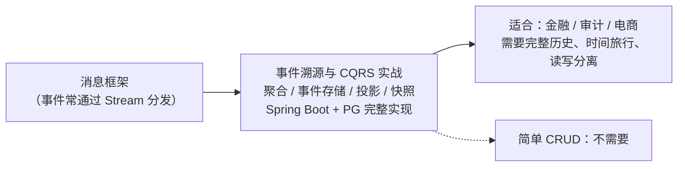

# 事件溯源与 CQRS 专题
> 📌 辅线定位：专为《教程/17 AI原生系统设计》补充事件溯源背景

本专题讲事件驱动架构里**最深的数据模式**——事件溯源（用事件当数据源）和 CQRS（读写分离）。

| 顺序 | 文档 | 你将学到 |
|:---:|------|---------|
| **01** | 事件溯源与 CQRS 实战 | 从状态存储到事件日志的思维跃迁；聚合/事件存储/投影/快照；Spring Boot+PG 完整实现；何时用何时不用 |

> **前置**：你会用消息框架发布和消费事件（事件溯源系统产生的事件常通过消息框架分发给读模型）。
>
> **适合谁**：做金融/审计/电商，需要完整历史、时间旅行、读写分离的场景。简单 CRUD 不需要。

**本专题定位**：

