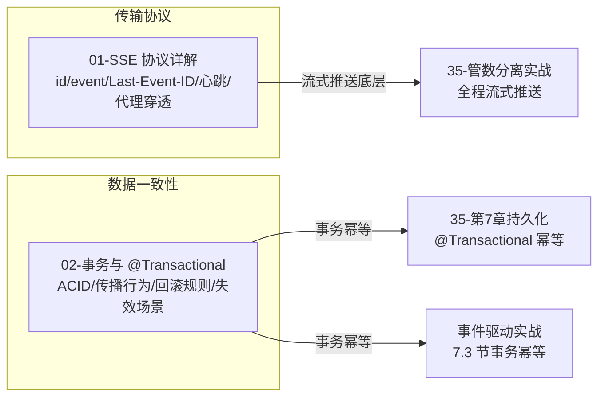

# 协议与数据库（学习顺序）

本文件夹收录 **横切性的底层知识**：传输协议（SSE）和数据一致性（事务）。它们不属于某个中间件，但贯穿整个系统。

| 顺序 | 文档 | 你将学到 |
|:---:|------|---------|
| **01** | [SSE 协议详解](./01-SSE协议详解.md) | Server-Sent Events 协议——`id`/`event`/`Last-Event-ID`/心跳/代理穿透，流式推送的底层 |
| **02** | [数据库事务与 @Transactional 详解](./02-数据库事务与Transactional详解.md) | ACID、传播行为、回滚规则、失效场景——数据一致性的兜底（事件驱动里幂等表要用事务） |

> **关联**：SSE 对应 [35 号文档](../../tutorials/spring-ai-2.0/35-管数分离实战-从Sinks到Kafka演进.md) 全程的流式推送；事务对应第 7 章持久化的 `@Transactional` 幂等、以及 [事件驱动实战](../Kafka消息队列实战专题/03-事件驱动微服务端到端实战.md) 第 7.3 节的事务幂等。

**横切关系**：

