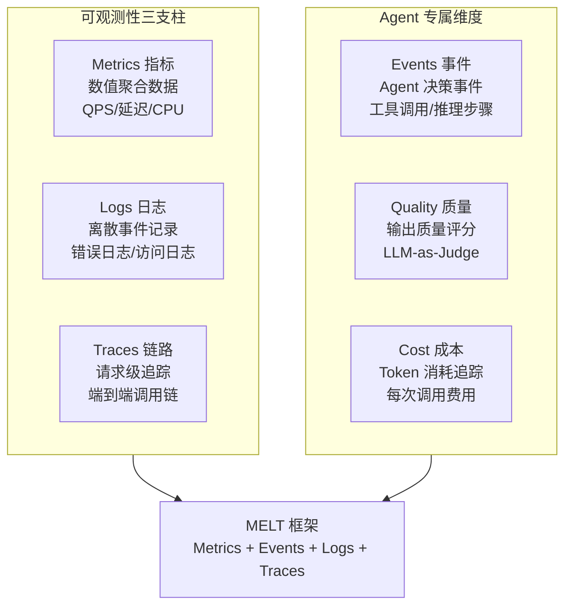
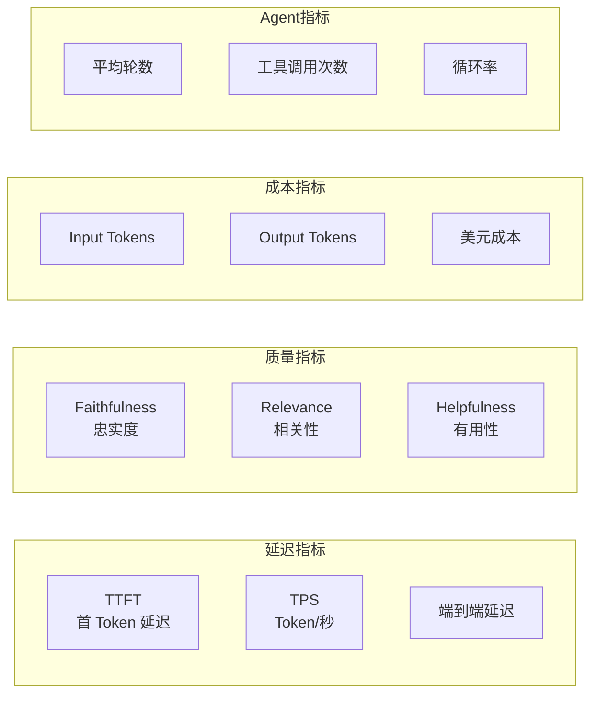
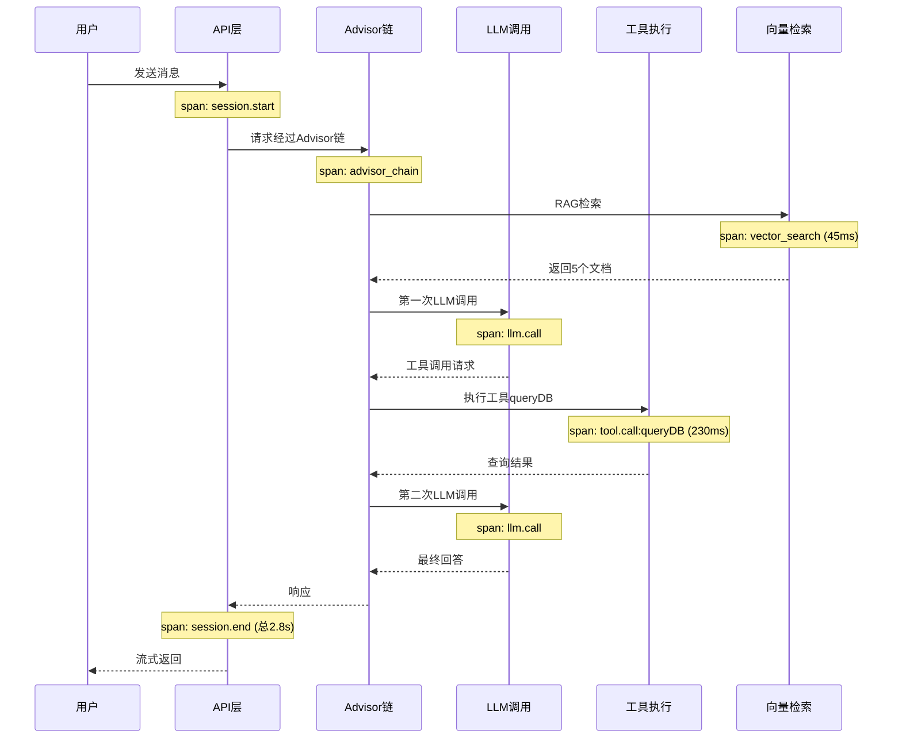
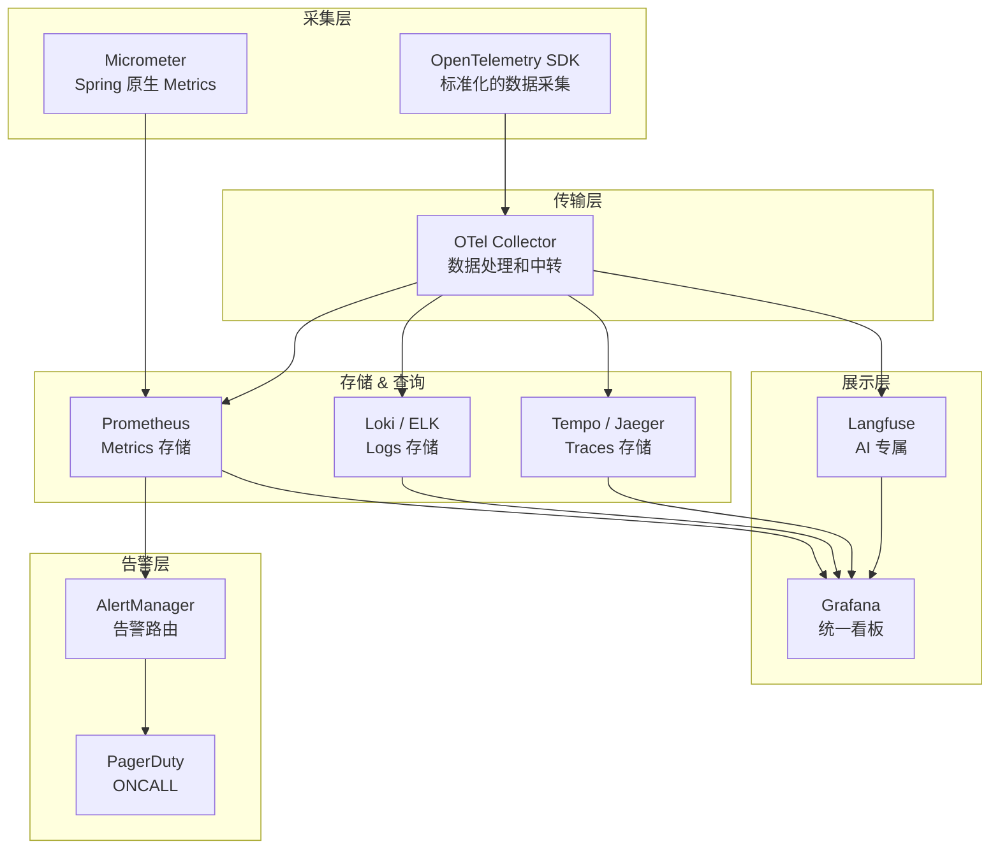

# 附录：可观测性速成

> 这不是主线文档。当你在 Agent 可观测性部分卡壳时，回来查阅。

---

## 什么是可观测性

可观测性（Observability）是**从系统外部行为推断系统内部状态**的能力。传统监控只告诉你"系统挂了"，可观测性告诉你"为什么挂了"。

---

## 三支柱模型



---

## Metrics（指标）

| 类型 | 示例 | 用途 |
|------|------|------|
| **Counter（计数器）** | 总请求数、总错误数 | 统计总量和速率 |
| **Gauge（计量器）** | 当前并发数、队列深度 | 反映当前状态 |
| **Histogram（直方图）** | 延迟分布、Token 消耗分布 | 分析分布和百分位 |
| **Summary（摘要）** | P50/P95/P99 延迟 | 直接读百分位 |

### Agent 专属指标



---

## Traces（链路追踪）



### Span 属性设计

```java
// 每个 Span 应记录的关键属性
Span span = tracer.nextSpan().name("llm.call").start();
span.tag("llm.model", "claude-sonnet-5");
span.tag("llm.input.tokens", "500");
span.tag("llm.output.tokens", "200");
span.tag("llm.cost.usd", "0.003");
span.tag("llm.ttft.ms", "280");  // 首 Token 延迟
span.tag("llm.tool_calls", "1");
span.end();
```

---

## 工具链



---

## 采样策略

| 策略 | 说明 | 适用场景 |
|------|------|---------|
| 全量采样 | 100% Trace 记录 | 开发/测试环境 |
| 头部采样 | 前N%请求记录 | 低流量生产 |
| 尾部采样 | 错误/慢请求100%，正常请求1% | 高流量生产（推荐） |
| 智能采样 | 基于内容质量/异常模式采样 | Agent 系统（进阶） |

> **Agent 特殊采样**：优先采样低质量输出、高成本请求、安全告警触发的会话。

---

## 相关文档

- [阶段4-生产化/03-可观测性建设](../阶段4-生产化/03-可观测性建设.md)
- [阶段4-生产化/16-Agent可观测性MELT](../阶段4-生产化/16-Agent可观测性MELT.md)
- [阶段4-生产化/36-Agent SLO管理](../阶段4-生产化/36-AgentSLO管理.md)
