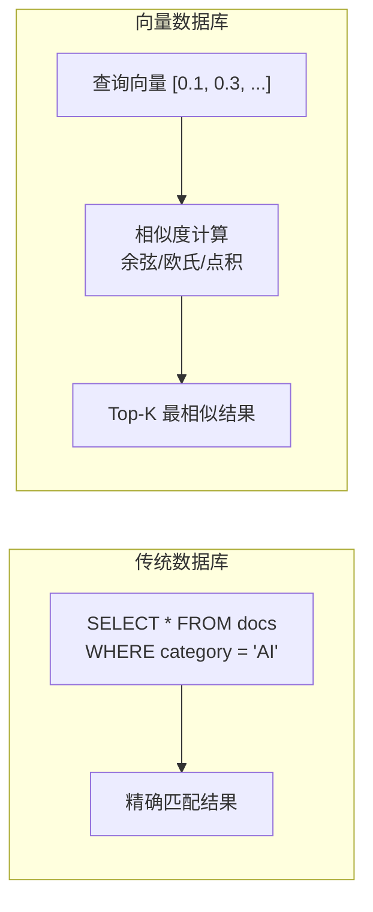
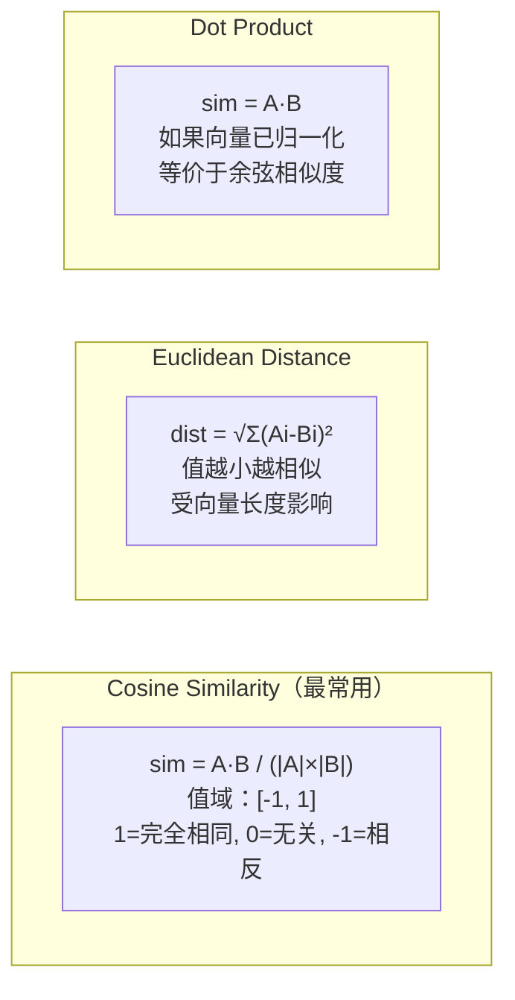
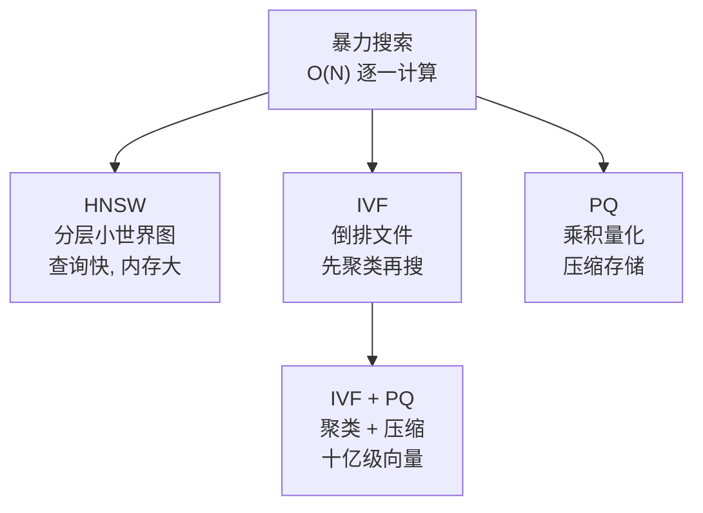

# 附录：向量数据库速成

> 这不是主线文档。当你在 RAG 或记忆系统部分卡壳时，回来查阅。

---

## 什么是向量数据库

传统数据库按**精确匹配**查询（`WHERE id = 123`）。向量数据库按**语义相似度**查询——"找出和这段话意思最接近的N条记录"。



---

## 核心概念

| 概念 | 定义 | 类比 |
|------|------|------|
| **嵌入向量** | 文本/图像的数值化表示（如 1536 维浮点数组） | 文本的"DNA序列" |
| **相似度度量** | 两个向量的"接近程度"（余弦相似度最常用） | 文本的"血缘关系" |
| **ANN 索引** | 近似最近邻索引，牺牲精度换速度 | 图书馆的索书号（不完美但快） |
| **向量维度** | 嵌入向量的长度（如 768/1024/1536/3072） | DNA序列的长度 |

---

## 相似度计算



---

## ANN 索引算法



| 算法 | 查询速度 | 召回率 | 内存占用 | 适用规模 |
|------|---------|--------|---------|---------|
| 暴力搜索 | 最慢 | 100% | 中 | < 10万 |
| HNSW | 极快 | 95-99% | 大 | < 1000万 |
| IVF | 快 | 90-95% | 中 | < 1亿 |
| IVF + PQ | 快 | 85-95% | 小 | > 1亿 |

---

## 主流向量数据库对比（2026）

| 数据库 | 类型 | 特色 | 适用场景 |
|--------|------|------|---------|
| **Milvus** | 专用 | 分布式、十亿级、云原生 | 大规模生产 |
| **Qdrant** | 专用 | Rust 编写、高性能、过滤强 | 中大规模生产 |
| **Weaviate** | 专用 | 内置模块化、支持混合检索 | 中等规模 |
| **pgvector** | PostgreSQL 扩展 | SQL 查询 + 向量 | 已有 PG 环境 |
| **Redis** | 内存数据库 | 超低延迟、会话级 | 实时/缓存场景 |
| **Elasticsearch** | 搜索引擎 | 全文 + 向量混合检索 | 已有 ES 环境 |
| **Chroma** | 轻量级 | Python 友好、开发简单 | 原型/小型 |

---

## Spring AI 中的向量数据库使用

```java
// 1. 创建 EmbeddingModel（文本→向量）
@Bean
EmbeddingModel embeddingModel() {
    return new OpenAiEmbeddingModel(apiKey, 
        OpenAiEmbeddingOptions.builder()
            .model("text-embedding-3-small")
            .build());
}

// 2. 创建 VectorStore
@Bean
VectorStore vectorStore(EmbeddingModel embeddingModel) {
    return PgVectorStore.builder(jdbcTemplate, embeddingModel)
        .dimensions(1536)
        .distanceType(PgDistanceType.COSINE_DISTANCE)
        .indexType(PgIndexType.HNSW)
        .build();
}

// 3. 写入文档
vectorStore.add(List.of(
    new Document("Spring AI 是 Spring 官方的 AI 编程框架"),
    new Document("LangChain4j 是 Java 生态另一个 AI 框架")
));

// 4. 语义检索
List<Document> results = vectorStore.similaritySearch(
    SearchRequest.builder()
        .query("Java AI 框架有哪些？")
        .topK(5)
        .similarityThreshold(0.7)
        .build()
);
```

---

## 常见问题

| 问题 | 答案 |
|------|------|
| "向量维度选多少？" | 取决于 Embedding 模型。text-embedding-3-small=1536, large=3072。维度越高表达力越强但成本越高 |
| "HNSW 参数怎么调？" | M（连接数）= 16 是默认值。efConstruction（构建精度）= 200。efSearch（查询精度）= 越大越准但越慢 |
| "向量库需要定期重建吗？" | 模型不变则不需要。但如果换了 Embedding 模型，所有向量必须重新计算 |
| "过滤 + 向量检索怎么做？" | 先按元数据过滤（如 tenant_id），再在过滤结果中做向量检索。Qdrant/Weaviate 支持原生混合 |

---

## 相关文档

- [阶段2-核心能力/02-向量检索原理](../阶段2-核心能力/02-向量检索原理.md)
- [阶段2-核心能力/08-向量数据库选型](../阶段2-核心能力/08-向量数据库选型.md)
- [理论字典/RAG原理](../理论字典/RAG原理.md)
