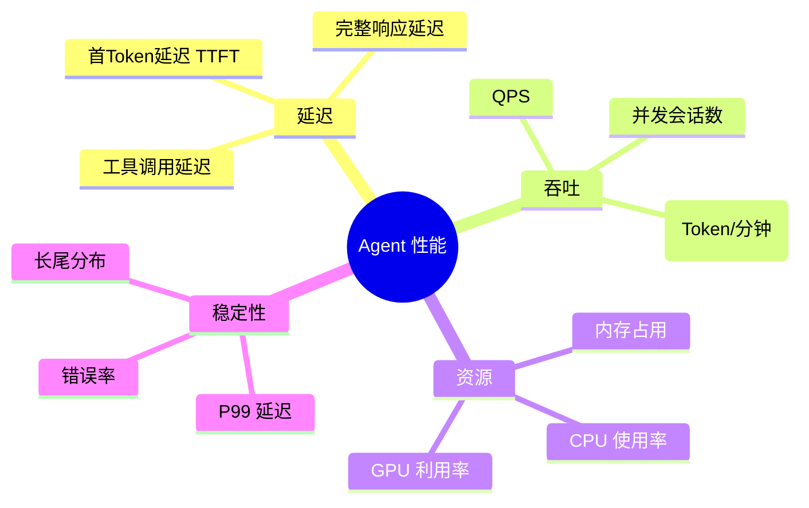
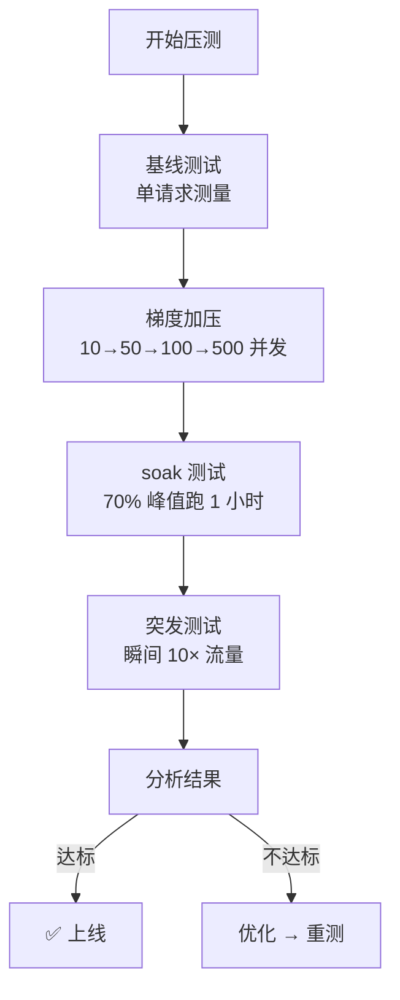
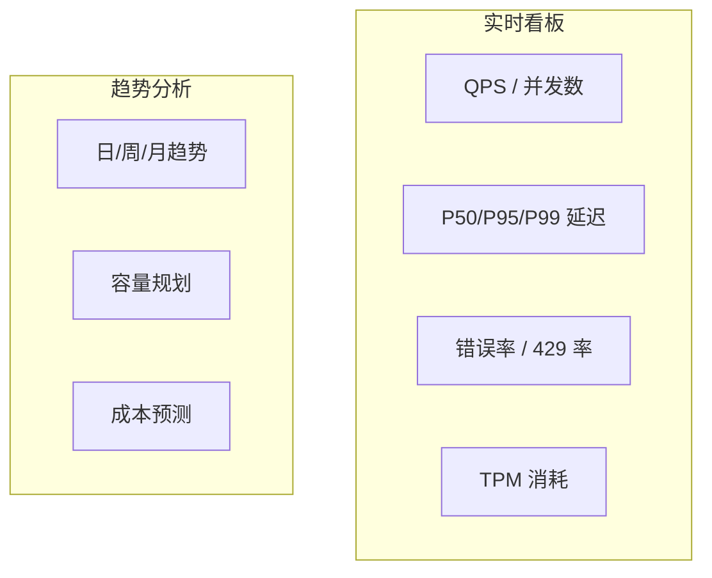

# 附录 · 性能测试速成

> 速查参考，聚焦 Agent 系统的性能测试方法与工具。

---

## Agent 性能指标



## 关键指标定义

| 指标 | 定义 | 目标 |
|------|------|------|
| TTFT（首 Token 延迟） | 请求发出到第一个 token 返回 | < 500ms |
| 完整响应延迟 | 请求发出到最后一个 token | < 10s |
| QPS | 每秒请求数 | 按需规划 |
| TPM | 每分钟 Token 数 | < 模型限制 |
| P95 / P99 | 95%/99% 分位延迟 | P95 < 3×P50 |
| 错误率 | 非 200 响应占比 | < 1% |

## 测试工具

### JMeter

```xml
<!-- Agent SSE 压测配置 -->
<HTTPSamplerProxy>
  <stringProp name="METHOD">POST</stringProp>
  <stringProp name="PATH">/api/v1/chat/stream</stringProp>
  <boolProp name="HTTPSampler.follow_redirects">true</boolProp>
  <!-- SSE 需要读取完整流 -->
  <stringProp name="HTTPSampler.response_timeout">60000</stringProp>
</HTTPSamplerProxy>
```

### k6（推荐）

```javascript
import http from 'k6/http';
import { check } from 'k6';

export let options = {
  stages: [
    { duration: '30s', target: 20 },   // 20 并发
    { duration: '1m', target: 20 },     // 保持 1 分钟
    { duration: '30s', target: 0 },     // 降为 0
  ],
  thresholds: {
    http_req_duration: ['p(95)<5000'],  // P95 < 5s
    http_req_failed: ['rate<0.01'],     // 错误率 < 1%
  },
};

export default function () {
  let response = http.post(
    'http://localhost:8080/api/v1/chat',
    JSON.stringify({
      model: 'gpt-4o',
      messages: [{ role: 'user', content: '你好' }],
    }),
    { headers: { 'Content-Type': 'application/json' } }
  );

  check(response, {
    'status 200': (r) => r.status === 200,
    'has reply': (r) => r.json('reply') !== null,
  });
}
```

### 流式 SSE 压测

```javascript
// k6 流式测试（需要 processing 函数逐行读取）
import http from 'k6/http';

export default function () {
  let response = http.post(
    'http://localhost:8080/api/v1/chat/stream',
    JSON.stringify({ messages: [{ role: 'user', content: '讲故事' }], stream: true }),
    {
      headers: { 'Accept': 'text/event-stream' },
      responseType: 'text',
    }
  );

  // 统计 SSE event 数量
  let events = response.body.split('\n\n').filter(s => s.trim().length > 0);
  console.log(`收到 ${events.length} 个 SSE event`);
}
```

## 压力测试策略



## Agent 特有瓶颈

| 瓶颈 | 症状 | 解决 |
|------|------|------|
| LLM API 限流 | 429 错误暴增 | 模型路由 + 请求队列 |
| 向量检索慢 | P99 延迟高 | 向量库分片 + 缓存 |
| 连接池耗尽 | 连接超时 | 增大连接池 + 长连接 |
| JVM GC 停顿 | 偶发高延迟 | G1GC / ZGC 调优 |
| SSE 连接堆积 | 内存溢出 | 连接数限制 + 超时回收 |
| 慢请求阻塞 | 整体变慢 | 请求超时 + 异步化 |

## 监控看板


