# 01 · 管数分离 ID 体系全解析

> 配套 **[35 号文档：管数分离实战——从 Sinks 到 Kafka 演进](../../tutorials/spring-ai-2.0/35-管数分离实战-从Sinks到Kafka演进.md)**。
>
> 35 号文档把注意力放在"管数分离"主线上，刻意压扁了很多实现细节。其中最容易让读者一头雾水的，就是系统里**到处出现的 ID**：`token`、`runId`、`sessionId`、`idempotencyKey`、`seq`、Redis Stream 自动 id、Kafka offset、`instanceId`……它们长得像，功能却完全不同。
>
> 本文把这套 ID 体系掰开揉碎：每个 ID 是**谁生成的、标识什么、什么时候用、存在哪个存储里、生命周期多长、和其他 ID 是什么关系**。

---

## 目录

- [0. 一句话总览](#0-一句话总览)
- [1. 总览速查表](#1-总览速查表)
- [2. sessionId —— 会话 ID（最上层的"对话"身份）](#2-sessionid--会话-id最上层的对话身份)
- [3. runId —— 一次生成的 ID（核心工作单元）](#3-runid--一次生成的-id核心工作单元)
- [4. idempotencyKey —— 幂等键（去重，不是身份）](#4-idempotencykey--幂等键去重不是身份)
- [5. token —— 第 2-3 章的临时任务标识（已被 runId 取代）](#5-token--第-2-3-章的临时任务标识已被-runid-取代)
- [6. seq —— chunk 序号 / 断线续传游标](#6-seq--chunk-序号--断线续传游标)
- [7. 基础设施层的 ID（不用你生成，但要认识）](#7-基础设施层的-id不用你生成但要认识)
- [8. 三个存储里的 ID 全图](#8-三个存储里的-id-全图)
- [9. ID 关系与生命周期图](#9-id-关系与生命周期图)
- [10. 演进时间线：哪个 ID 在哪一章出生/被替换](#10-演进时间线哪个-id-在哪一章出生被替换)
- [11. 常见混淆点（重点）](#11-常见混淆点重点)
- [12. 一份 API 请求里会出现哪些 ID](#12-一份-api-请求里会出现哪些-id)
- [13. 生产排查时怎么用这些 ID](#13-生产排查时怎么用这些-id)

---

## 0. 一句话总览

> **三层身份**：
> `sessionId`（哪个对话）→ `runId`（哪次生成）→ `seq`（哪一段文字）；
>
> **去重锚点是 `sessionId`**（会话锁 + 查当前 run）：同一会话同时只一个 run，多页面靠它拿同一个 runId——这是多页面共享流的**正确机制**。
> `idempotencyKey` 只是**单页面重试**的兜底（同一个页面重发同一个 key → 拿同一个 runId），**不是**多页面共享流的机制（页面间无法共享 key）。
>
> 剩下的是**基础设施层**的 id（Redis Stream 消息 id、Kafka offset、`instanceId`、`traceId`……），由中间件或框架生成，你不用管生成，但要认识它们、知道它们和业务 ID 的区别。

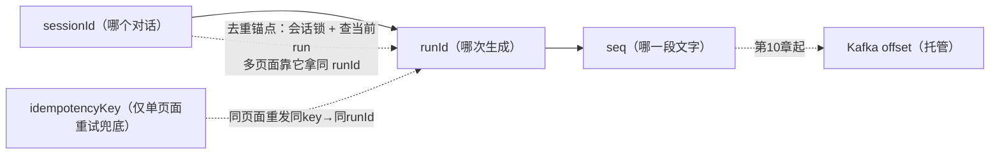
```mermaid
flowchart LR
    S["sessionId（哪个对话）"] --> R["runId（哪次生成）"]
    R --> Q["seq（哪一段文字）"]
    S -. "去重锚点：会话锁 + 查当前run<br/>多页面靠它拿同 runId" .-> R
    K["idempotencyKey（仅单页面重试兜底）"] -. "同页面重发同key→同runId" .-> R
    Q -. 第10章起 .-> O["Kafka offset（托管）"]
```

## 1. 总览速查表

| ID | 标识什么 | 谁生成 | 格式 | 生命周期 | 存在哪 | 主要用途 | 引入章 |
|----|---------|-------|------|---------|-------|---------|--------|
| **`sessionId`** | 一个会话（对话） | 客户端（第6-7章）；服务端 `POST /api/sessions`（第8章起） | `sess-001` / `sess_xxx` | 长期（对话整个生命周期） | PG `gen_session.id` / `gen_run.session_id` / `gen_message.session_id`；Redis `session:{id}:running`（Redisson 锁） | **去重锚点**：会话级独占 + 查当前 run，多页面靠它拿同一个 runId；多轮上下文注入的 key；历史记录归属 | 第6章引入、第8章规范化 |
| **`runId`** | 一次生成（run 资源） | 服务端 `RunStore.create()` | `run_xxx`（`run_` + 12 位十六进制） | 短期~长期 | PG `gen_run.id` / `gen_message.run_id`；Redis 一组 `gen:{runId}:*`；Kafka 消息 key | 流/锁/取消/状态的 key；消息分组 | 第6章（取代 token） |
| **`idempotencyKey`** | 一次逻辑提交 | 客户端（每提交一个，如 `crypto.randomUUID()`） | 任意字符串 | TTL 1 天（Redis）/ 永久（PG） | Redis `idem:{key}`；PG `gen_idempotency.idempotency_key`(PK) | **仅单页面重试兜底**：同页面重发同 key 返回同 runId；**不是**多页面共享流的机制（页面间无法共享 key） | 第6章、第7章强化为唯一约束 |
| **`token`** | （历史）一次触发 | 服务端 | `gen_xxx` | 内存 | 内存 Map / Sinks | 第2-3章的临时任务标识 | 第2章 → 第6章废弃 |
| **`seq`** | 一个 run 内的第 N 段文字 | 服务端（Redis INCR） | 整数 1,2,3… | 随 run 数据 | Redis Stream 记录字段 `seq`；`ChunkEntity(seq, chunk)`；SSE `id:` | 排序；断线续传游标（`Last-Event-ID`） | 第5章 → 第10章被 Kafka offset 取代 |
| Redis Stream 消息 id | Stream 里的一条消息 | Redis 自动 | `<毫秒时间戳>-<序号>` | 随 stream 数据 | Stream 记录本身 | Stream 内部定位（XADD/XRANGE） | 第4章 |
| Kafka **offset** | 消费组内的消费位置 | Kafka 托管 | 整数 | 按 retention | broker | 消费进度、回放 | 第10章 |
| Kafka 消息 **key** | 消息分区归属 | 服务端（= runId） | 同 runId | — | broker | 同 runId 进同分区，保序 | 第10章 |
| **`instanceId`** | 一个应用实例 | Spring 启动 | `inst-<uuid 前 12 位>` | 进程生命周期 | 内存（仅日志） | 日志归属 | 第9章 |
| **`gen_message.id`** | 历史表的一行 | PG 自增 | BIGSERIAL | 永久 | PG | 消息排序（ORDER BY id）、取最近 N 轮 | 第8章 |
| **`traceId` / `spanId`** | 一次端到端请求的链路轨迹 | 网关/入口生成 | 32 位 hex（`traceparent`） | 随请求/日志，不落库 | 请求头、日志、追踪后端 | 分布式排查：按链路串起整条日志 | 进阶（35 号文档未实现） |

---

## 2. sessionId —— 会话 ID（最上层的"对话"身份）

**是什么**：标识"一次对话"。用户的一次连续聊天（可能问十几轮）就是一个 session。

**谁生成**：
- 第 6-7 章：**客户端**直接传字符串（`sess-001`），服务端不校验、不建档。
- 第 8 章起：**服务端** `POST /api/sessions` 创建，返回 `sess_xxx`（UUID 前 12 位），并落 `gen_session` 表。前端"新会话"按钮就调它。

**什么时候用**（四个用途，一张图看全）：

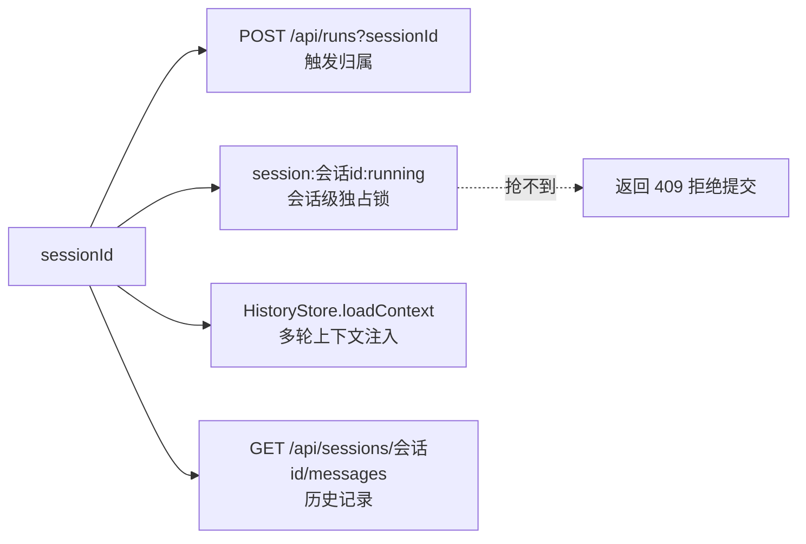
```mermaid
flowchart LR
    S["sessionId"] --> T["POST /api/runs?sessionId<br/>触发归属"]
    S --> L["session:会话id:running<br/>会话级独占锁"]
    S --> X["HistoryStore.loadContext<br/>多轮上下文注入"]
    S --> H["GET /api/sessions/会话id/messages<br/>历史记录"]
    L -. 抢不到 .-> N["返回 409 拒绝提交"]
```

- 触发：`POST /api/runs?sessionId=xxx&prompt=...`——告诉服务端"这次生成属于哪个对话"。
- 会话级独占：服务端用 **Redisson 分布式锁** `session:{id}:running` 抢锁（看门狗自动续期），同会话同时只允许一个 run 在跑，抢不到返回 **409**。
- 多轮上下文：`HistoryStore.loadContext(sessionId)` 读该会话最近 20 轮，注入 LLM。
- 历史记录：`GET /api/sessions/{id}/messages` 查该会话的完整对话。

**会话级独占就是围绕 sessionId 的一张状态机**（这是"同一个会话一次只跑一个任务"的全部逻辑）：

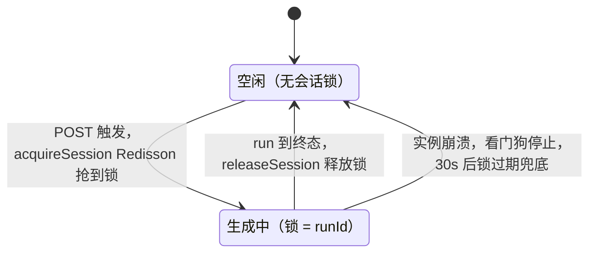
```mermaid
stateDiagram-v2
    state "空闲（无会话锁）" as IDLE
    state "生成中（锁 = runId）" as RUNNING
    [*] --> IDLE
    IDLE --> RUNNING: POST 触发，acquireSession Redisson 抢到锁
    RUNNING --> IDLE: run 到终态，releaseSession 释放锁
    RUNNING --> IDLE: 实例崩溃，看门狗停止，30s 后锁过期兜底
```

> ⚠️ **注意：409 不是状态转移，是门卫拒绝。** 会话在"生成中"时，同会话再来一个 POST，那个请求会先创建一个 run（queued），`acquireSession` 再抢锁失败 → **新 run 被标记 CANCELLED 作废** → 返回 **409**。会话锁仍归原 run，状态机停留在"生成中"不动——**被拒的是"这一次提交"，会话状态不变**。

**存在哪 / 生命周期**：长期。第 8 章起落 PG（`gen_session.id`、`gen_message.session_id`），换设备、重启都不丢。Redis 里的 `session:{id}:running` 是 **Redisson 分布式锁**（看门狗自动续期、run 到终态就释放），只在运行期存在——**不要以为 sessionId 存在 Redis**。

**和其他 ID 的关系**：sessionId 是最外层容器。**一个 session = 很多个 run**（每轮一个 run）。它和 runId 是"对话" vs "一轮生成"的父子关系，不是二选一（详见 §11 混淆点）。

**代码位置**：`RunController.create`（参数）、`RunStore.acquireSession/releaseSession`（锁）、`HistoryStore.loadContext/listMessages`（PG）。

---

## 3. runId —— 一次生成的 ID（核心工作单元）

**是什么**：标识"一次生成任务"。一次"点生成"就产生一个 run：从触发、到流式输出、到 DONE/FAILED/CANCELLED，整条生命周期都挂在 runId 上。**整条生命周期就是一张状态机**：

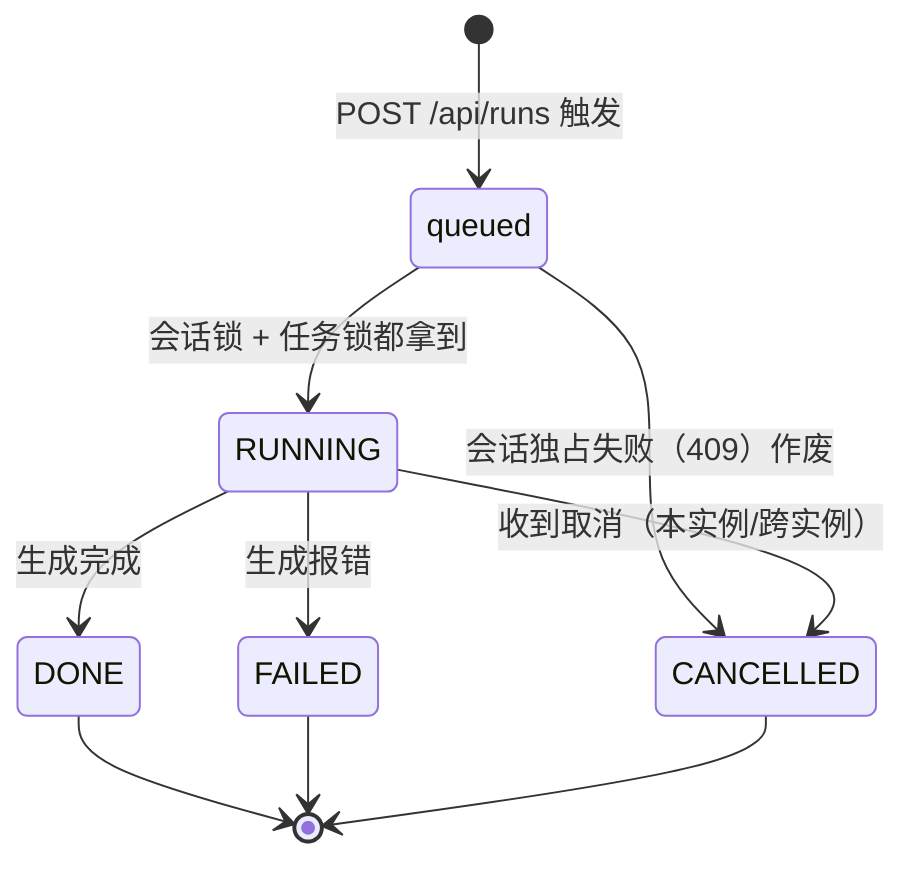
```mermaid
stateDiagram-v2
    [*] --> queued: POST /api/runs 触发
    queued --> CANCELLED: 会话独占失败（409）作废
    queued --> RUNNING: 会话锁 + 任务锁都拿到
    RUNNING --> DONE: 生成完成
    RUNNING --> FAILED: 生成报错
    RUNNING --> CANCELLED: 收到取消（本实例/跨实例）
    DONE --> [*]
    FAILED --> [*]
    CANCELLED --> [*]
```

**谁生成**：**服务端**。`RunStore.create()` → `newRun()` 生成 `run_` + UUID 前 12 位。客户端在响应里拿到它。

**什么时候用**：
- 触发后拿到 runId，**订阅**它的流：`GET /api/runs/{runId}/stream`。
- **查状态**：`GET /api/runs/{runId}`。
- **取消**：`POST /api/runs/{runId}/cancel`。
- 断线续传：`gen:{runId}:seq` 记序号，客户端带 `Last-Event-ID` 重连。

**存在哪**：
- Redis（第 4-9 章）：一组以 runId 为 key 前缀的结构——`gen:{runId}:chunks`（chunk Stream）、`gen:{runId}:seq`（序号计数器）、`gen:{runId}`（实时频道）、`gen:{runId}:cancel`（取消频道）、`gen:{runId}:lock`（锁）。**每个 key 的详情见 §8.2 全图。**
- PG（第 7 章起）：`gen_run.id`（run 状态表的 PK）、`gen_message.run_id`（消息归属）。
- Kafka（第 10 章）：runId 直接当**消息 key**——同一个 run 的所有 chunk 进同一分区，保证顺序。
- 应用内存：`handles`（生成流句柄）、`runSession`（runId→sessionId）、`buffers`（chunk 缓冲）都以 runId 为 key。

**生命周期**：第 6 章 Redis 版 TTL 1 天；第 7 章落 PG 后**长期保留**（可审计）。run 到终态（DONE/FAILED/CANCELLED）后，runId 仍可用来订阅历史回放（第 4 章验证过"结束后仍可订阅"）。

**和其他 ID 的关系**：runId 挂在一个 sessionId 下；它的输出被切成一段段带 `seq` 的 chunk；触发它时可能被 `idempotencyKey` 去重。

**代码位置**：`RunStore.newRun`、`StreamService.trigger/startGeneration/finishRun/cancel`、`StreamBus.write/subscribe`、`RunController` 路径变量。

---

## 4. idempotencyKey —— 幂等键（去重，不是身份）

### 4.1 概念与 key 生命周期

**是什么**：标识"**一次逻辑提交**"。注意它不是身份，是**去重键**：让服务端识别"这次请求和刚才那次是同一次"。

**谁生成**：**客户端**，每次提交生成一个全局唯一值（如 `deviceA-001`、`crypto.randomUUID()`）。**同一个逻辑提交被重试时，key 必须保持一致**（变了就幂等失效）；**不同轮次必须用不同的 key**（否则会被当成同一提交）。

**什么时候用**：放在请求头 `Idempotency-Key`，配合 `POST /api/runs`（**只在触发接口用**；订阅/查状态/取消都不带它，那三个用 `runId`，订阅额外带 `Last-Event-ID` 续传）。触发场景：网络超时重试、手滑双击。（多设备"同 key"客户端保证不了，见下"三个事实"第 3 条。）

**什么时候生成 / 复用 / 作废（客户端侧，一张图看全）**：

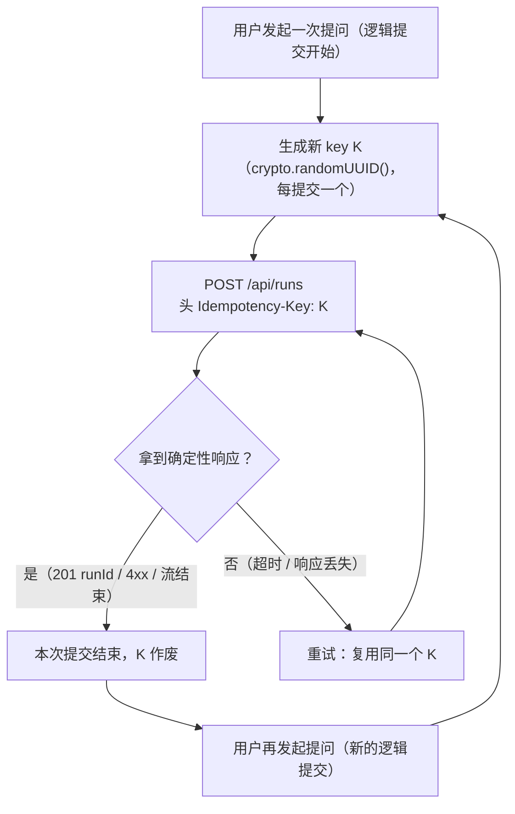
```mermaid
flowchart TD
    A["用户发起一次提问（逻辑提交开始）"]
    A --> B["生成新 key K<br/>（crypto.randomUUID()，每提交一个）"]
    B --> C["POST /api/runs<br/>头 Idempotency-Key: K"]
    C --> D{"拿到确定性响应？"}
    D -->|"是（201 runId / 4xx / 流结束）"| E["本次提交结束，K 作废"]
    D -->|"否（超时 / 响应丢失）"| F["重试：复用同一个 K"]
    F --> C
    E --> G["用户再发起提问（新的逻辑提交）"]
    G --> B
```

> 三条铁律：**新提交 → 新 key**；**同一提交的重试 → 同一个 key**（变了幂等就失效）；**拿到确定性响应 → key 作废**。key 是客户端本地状态，和 runId（服务端生成）完全不同源。

**"超时 / 响应丢失"的重试是谁触发的？——自动 / 手动是三层不同的事**：POST 发出后没等到响应（超时 / 网络中断 / 服务端已处理但响应丢了），可能由 ① 网关 / HTTP 客户端自动重试、② 前端代码自动重试、③ 用户手动再点一次，三种来源都会**带同一个 key** 再次发起请求，最终都由服务端靠 idempotencyKey 去重 → 怎么重试都只跑一次。

> 关键区分：
> - **浏览器不会自动重试 POST**——"自动重试"是前端代码 / 网关 / HTTP 客户端实现的（而且必须带同一个 key 才安全）。
> - **浏览器唯一真正的自动重连是 SSE（EventSource）**——但那是**订阅流**（`GET .../stream`），走 `Last-Event-ID` 续传，**不带 idempotencyKey**（见 §6）。
> - 所以"重试复用同一个 key"这条规则，**无论自动还是手动都必须满足**——这正是幂等键存在的意义：重试是谁发起的无所谓，服务端只认 key。

**浏览器里到底是谁在用 idempotencyKey？——是你的前端 JS，不是浏览器内核**：

| 动作 | 谁做 | 说明 |
|------|------|------|
| 生成 key | **你的前端 JS** | `crypto.randomUUID()` 或 `设备id+时间戳` |
| 放进请求头 | **你的前端 JS** | `fetch(url, {headers: {"Idempotency-Key": key}})` |
| 传输 | **浏览器内核（fetch）** | 只转发，**不认识 key 的含义** |
| 读取 / 去重 | **后端** | `@RequestHeader("Idempotency-Key")` |
| 重试时复用 | **你的前端 JS**（或用户再点触发同一函数） | 保留同一个 key 变量 |

> ⚠️ **诚实关键点**：文档 demo 里 `crypto.randomUUID()` 是**每次点击当场生成**的——它没有"保留同一个 key 跨重试"，所以幂等键在 demo 里其实是**每次一个新串，形同虚设**。要让幂等键真正生效，前端必须把 key 当成"**本次在途提交的本地状态**"：生成后一直留着，拿到确定性响应才清掉，重试时复用同一个。

```javascript
// ❌ 文档 demo 的写法：每次点击都生成新 key → 手动重试时幂等失效
fetch("/api/runs", { headers: { "Idempotency-Key": crypto.randomUUID() } });

// ✅ 真正生效的写法：key 是"在途提交"的本地状态
let pendingKey = null;                       // 当前在途提交的 key
async function submit(prompt) {
  if (!pendingKey) pendingKey = crypto.randomUUID();   // ① 首次生成
  try {
    const r = await fetch("/api/runs", {
      headers: { "Idempotency-Key": pendingKey }       // ② 重试也带同一个
    });
    pendingKey = null;                                  // ③ 拿到确定响应 → 作废
    return await r.json();
  } catch (e) {
    // 超时 / 网络错误：pendingKey 保留，用户再点 submit 会复用同一个 key
  }
}
```

**手动再点一次，到底是新 key 还是旧 key？——看"上一次提交是否还在途"**：

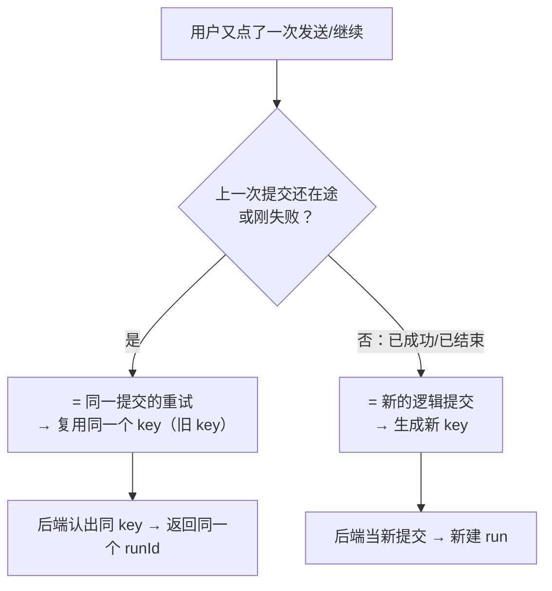
```mermaid
flowchart TD
    A["用户又点了一次发送/继续"]
    A --> B{"上一次提交还在途<br/>或刚失败？"}
    B -->|"是"| C["= 同一提交的重试<br/>→ 复用同一个 key（旧 key）"]
    B -->|"否：已成功/已结束"| D["= 新的逻辑提交<br/>→ 生成新 key"]
    C --> E["后端认出同 key → 返回同一个 runId"]
    D --> F["后端当新提交 → 新建 run"]
```

> 判断标准是**前端产品逻辑**，不是 key 本身：
> - 转圈圈没反应、你又点了**同一个按钮** → 重试 → **旧 key**（前提：前端保留了 `pendingKey`）。
> - 已拿到回答、你又**输入新问题回车** → 新提交 → **新 key**。
> 前端靠什么区分？——就看 `pendingKey` 清没清：**没清 = 在途 = 复用旧 key；清了 = 已完成 = 新 key**。

### 4.2 真实作用与局限（重要）

**幂等键什么时候才真正起作用？——三个条件同时成立的瞬间**：

| 条件 | 缺它时 |
|------|-------|
| ① 发生了**重试**（不是正常首次提交） | 没重试 → key 只是每次一个随机串，毫无作用 |
| ② 重试**带同一个 key**（前端保留了 pendingKey） | 换了 key → 后端查不到映射，当新提交，幂等失效 |
| ③ 服务端**已经处理过第一次**（能查到 key→runId） | 还在处理中 → 返回 409，挡你的是会话锁不是幂等 |

它要解决的**唯一真实难题**——一次 POST 的"歧义结果"（服务端处理了，但响应丢了）：

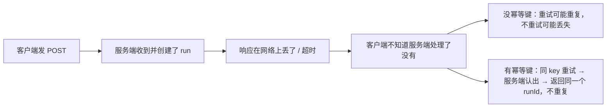
```mermaid
flowchart LR
    A["客户端发 POST"] --> B["服务端收到并创建了 run"]
    B --> C["响应在网络上丢了 / 超时"]
    C --> D["客户端不知道服务端处理了没有"]
    D --> E["没幂等键：重试可能重复，不重试可能丢失"]
    D --> F["有幂等键：同 key 重试 → 服务端认出 → 返回同一个 runId，不重复"]
```

> 所以幂等键的"真实作用"只在 **"重试 + 同 key + 服务端已处理"三者交集的那一瞬间** 显现。聊天场景因为"会话锁挡住并发 + 不在乎重试导致的重复"，这个交集几乎不出现——这正是前面说它在这架构里基本冗余的根源。它真正的主场是没有串行闸门、且**不能容忍重复**的操作（支付/扣费）。

**真实场景：key 与会话锁各干什么（四个场景一张图看全）**：

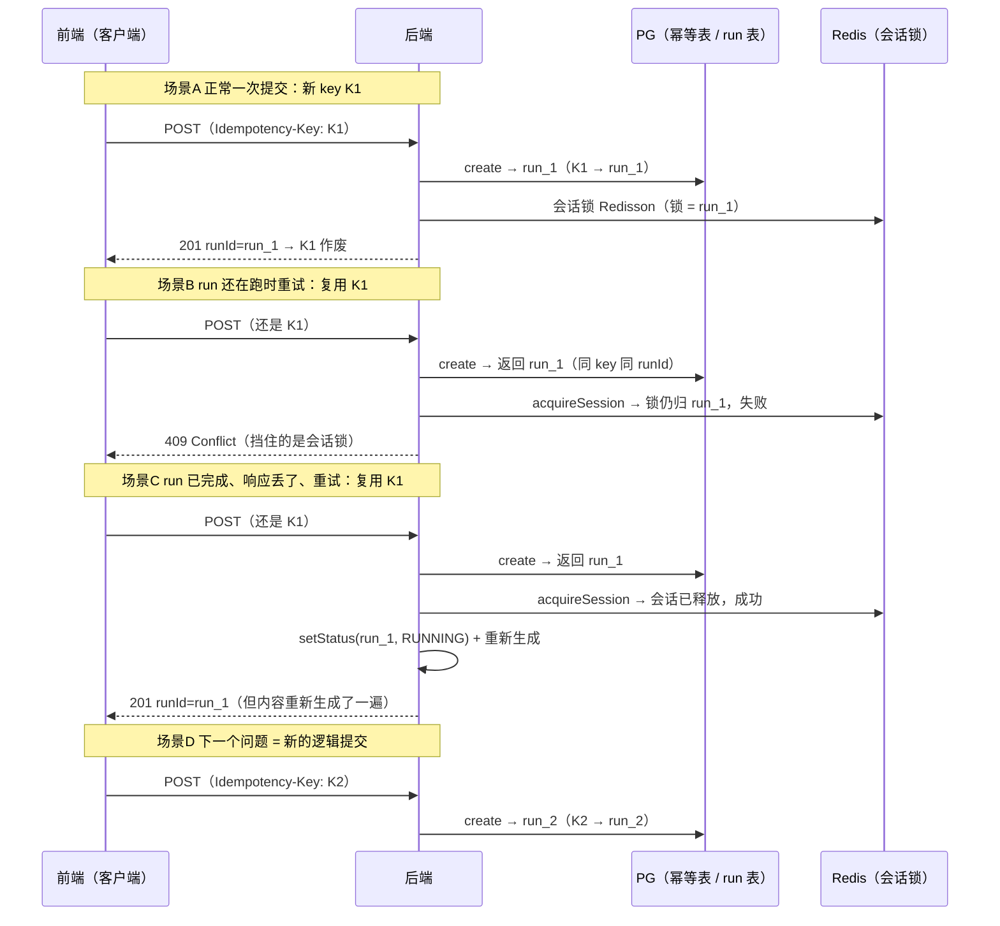
```mermaid
sequenceDiagram
    participant C as 前端（客户端）
    participant S as 后端
    participant PG as PG（幂等表 / run 表）
    participant RD as Redis（会话锁）

    Note over C,S: 场景A 正常一次提交：新 key K1
    C->>S: POST（Idempotency-Key: K1）
    S->>PG: create → run_1（K1 → run_1）
    S->>RD: 会话锁 Redisson（锁 = run_1）
    S-->>C: 201 runId=run_1 → K1 作废

    Note over C,S: 场景B run 还在跑时重试：复用 K1
    C->>S: POST（还是 K1）
    S->>PG: create → 返回 run_1（同 key 同 runId）
    S->>RD: acquireSession → 锁仍归 run_1，失败
    S-->>C: 409 Conflict（挡住的是会话锁）

    Note over C,S: 场景C run 已完成、响应丢了、重试：复用 K1
    C->>S: POST（还是 K1）
    S->>PG: create → 返回 run_1
    S->>RD: acquireSession → 会话已释放，成功
    S->>S: setStatus(run_1, RUNNING) + 重新生成
    S-->>C: 201 runId=run_1（但内容重新生成了一遍）

    Note over C,S: 场景D 下一个问题 = 新的逻辑提交
    C->>S: POST（Idempotency-Key: K2）
    S->>PG: create → run_2（K2 → run_2）
```

> **必须认清的三个事实（对照上面时序图）**：
> 1. **挡住并发的其实是会话锁**：场景 B 的 409 来自 `session:{id}:running`。幂等键只保证"同 key 拿到同一个 runId"，最终把人挡在门外的是会话锁。
> 2. **文档实现只"防新建记录"，不"防重新生成"**：场景 C 里 run 已完成、会话释放后重试，代码会把已 DONE 的 run 再置 RUNNING 重新生成一遍——第 6 章宣称的"不重复跑"没有完整兑现。
> 3. **跨设备"同 key"保证不了**：key 是客户端本地状态。同浏览器多标签页可借 localStorage 同步；跨设备（手机+iPad）没有共享存储，唯一共享点是后端按 session 存的上下文——所以跨设备协调本质是**会话级**的，这正说明在该架构里幂等键与会话锁重叠。

**原理（第 6 章，服务端视角的理想语义）**：

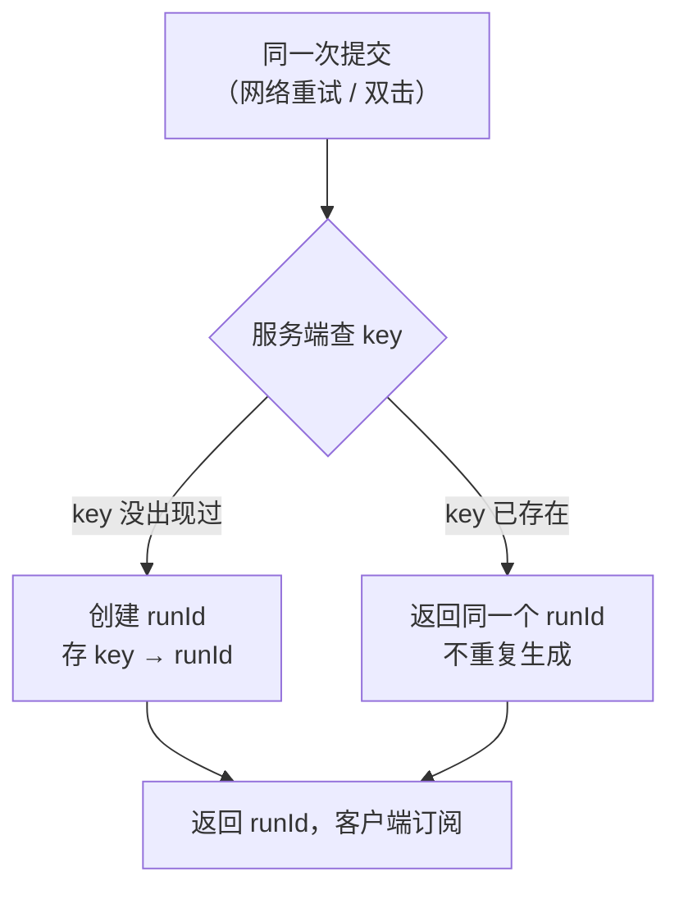
```mermaid
flowchart TD
    A["同一次提交<br/>（网络重试 / 双击）"] --> B{"服务端查 key"}
    B -->|"key 没出现过"| C["创建 runId<br/>存 key → runId"]
    B -->|"key 已存在"| D["返回同一个 runId<br/>不重复生成"]
    C --> E["返回 runId，客户端订阅"]
    D --> E
```

> ⚠️ 上面这张是**服务端视角的理想语义**；真实行为见上方四场景时序图（尤其场景 B 会 409、场景 C 会重新生成，与理想语义有差距）。

### 4.3 存储与关系（参考）

**存在哪 / 生命周期**：
- 第 6 章（Redis）：`idem:{key}` → runId，TTL 1 天。
- 第 7 章（PG）：`gen_idempotency` 表，`idempotency_key` 是 **PRIMARY KEY**——并发下数据库直接拒绝第二个插入，比"先查后写"更原子（第 7 章的关键升级）。

**和其他 ID 的关系**：`idempotencyKey` 是一对一映射到 `runId`（同 key → 同 runId）。它**不是** sessionId 的替代品——sessionId 跨轮稳定，区分不了"重试第 1 轮"和"新的第 2 轮"（详见 §11）。三道防线里它管"同一提交只创建一次"，粒度最小但职责独立。

**代码位置**：`RunStore.create(idempotencyKey, sessionId)`、`RunController.create` 头解析、前端 `Idempotency-Key: crypto.randomUUID()`。

---

## 5. token —— 第 2-3 章的临时任务标识（已被 runId 取代）

**是什么**：第 2、3 章（`gen_xxx`，内存 Map / Sinks 的 key）在引入 run 资源之前的**临时任务标识**。

**谁生成**：服务端，`StreamService.trigger` 里 `UUID` 前 12 位。

**什么时候用**：
- 第 2 章：`POST /generate` 返回 token，`GET /generate/stream?token=xxx` 订阅。
- 第 3 章：token → 内存 `Sinks.Many` 广播器。

**为什么被取代**：token 只是"一个流的钥匙"，没有状态机、没有幂等、没有取消、不能查状态。第 6 章引入 run 资源后，**token 的位置被 runId 顶替**——所以你在第 6 章之后**看不到 token 了**，只看得到 runId。读文档时见到 `token` 要意识到这是第 2-5 章的旧命名。

> ⚠️ **别和 SSE 的 `event("token")` 混淆**：第 5 章以后 SSE 每个事件带 `event("token")`——这里的 `token` 是**事件类型名**（自定义的，配合前端 `addEventListener("token")`），**不是任务 ID**。一个叫"token"的事件类型，和已被淘汰的 token ID，纯属撞名。

---

## 6. seq —— chunk 序号 / 断线续传游标

**是什么**：给一个 run 里的每段文字 chunk 编号（1、2、3……）。`seq` 是**数据层**的排序/续传游标，不是资源 ID。

**谁生成**：服务端，`redis.opsForValue().increment("gen:{runId}:seq")`——每写一个 chunk 就自增。

**什么时候用**：
- **排序**：Stream 里的记录靠 `seq` 字段判断先后。
- **断线续传**：客户端记录最后收到的 `seq`，重连时带 `Last-Event-ID: <seq>`，服务端只回放 `seq > lastSeq` 的 chunk——不重复、不漏。
- **SSE id**：`ServerSentEvent.id(String.valueOf(seq))`，浏览器 `EventSource` 自动记录、重连自动带 `Last-Event-ID` 头。
- **客户端去重**：at-least-once 交付下，客户端按 seq 丢弃重复。

**seq 的全部价值就是"断线续传"这一个动作**（第 5 章的核心逻辑）：

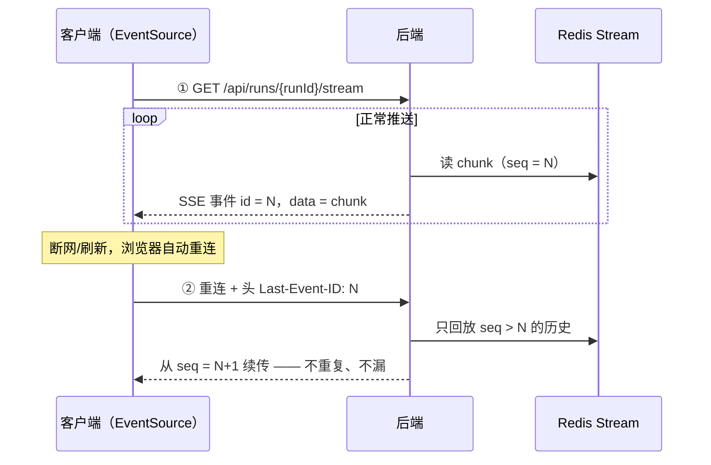
```mermaid
sequenceDiagram
    participant C as 客户端（EventSource）
    participant API as 后端
    participant RD as Redis Stream
    C->>API: ① GET /api/runs/{runId}/stream
    loop 正常推送
        API->>RD: 读 chunk（seq = N）
        API-->>C: SSE 事件 id = N，data = chunk
    end
    Note over C: 断网/刷新，浏览器自动重连
    C->>API: ② 重连 + 头 Last-Event-ID: N
    API->>RD: 只回放 seq > N 的历史
    API-->>C: 从 seq = N+1 续传 —— 不重复、不漏
```

**为什么不用 Redis Stream 的自动消息 id 当 seq**（第 5 章明确说的）：Stream 自动 id 是 `<毫秒时间戳>-<序号>` 的大数字（如 `1719...-0`），不直观，客户端不好处理。独立 INCR 从 1 开始，干净整数，和 SSE `Last-Event-ID` 配合最自然。

**生命周期**：随 run 数据。第 10 章换 Kafka 后，**seq 被消费组 offset 取代**——Kafka 消费组自己管进度，`seq` 不再手写（见 §7）。

**代码位置**：`StreamBus.write`（INCR + 写 Stream）、`StreamBus.readAfter`（按 seq 过滤）、`ChunkEntity(Long seq, String chunk)`、`RunController.stream`（SSE id）。

---

## 7. 基础设施层的 ID（不用你生成，但要认识）

这些 ID 由中间件/框架生成，业务代码不关心，但排查问题、理解文档时得知道它们。

### 7.1 Redis Stream 自动消息 id
- **格式**：`<毫秒时间戳>-<序号>`（如 `1751234567890-0`）。
- **谁生成**：Redis 在 `XADD` 时自动生成。
- **用途**：Stream 内部唯一标识一条消息，`XRANGE`/`XREAD` 用它定位。
- **和 seq 的区别**：seq 是应用层手写的、从 1 开始的整数；自动 id 是 Redis 生成的时间戳组合。**第 5 章特意不用自动 id 当续传游标**。

### 7.2 Kafka offset
- **是什么**：消费组在某个分区上的"消费位置"，整数。
- **谁生成/托管**：Kafka 消费组托管（配置 `enable-auto-commit: false` + `ack-mode: manual_immediate` 由容器精确提交）。
- **用途**：消费进度；`auto-offset-reset: earliest` 让新消费组从头读（历史回放）；审计/计费/分析各起一个消费组，**各自维护 offset，互不干扰**。
- **取代了什么**：第 10 章起，`seq`（手写续传游标）被 offset（托管）取代。

**offset 的"各消费组各管各"逻辑**（这就是第 10 章"跨服务消费"能成立的根基）：

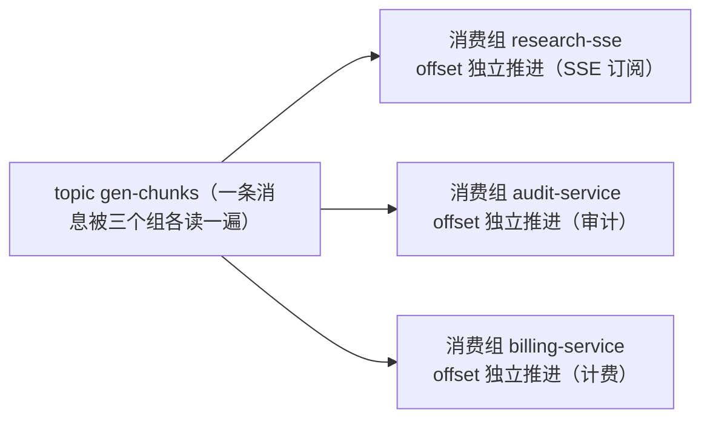
```mermaid
flowchart LR
    T["topic gen-chunks（一条消息被三个组各读一遍）"]
    T --> G1["消费组 research-sse<br/>offset 独立推进（SSE 订阅）"]
    T --> G2["消费组 audit-service<br/>offset 独立推进（审计）"]
    T --> G3["消费组 billing-service<br/>offset 独立推进（计费）"]
```

### 7.3 Kafka 消息 key（= runId）
- **是什么**：发送到 topic `gen-chunks` 的每条消息带的 key，值就是 runId。
- **用途**：Kafka 按 key 哈希决定进哪个分区 → **同一个 runId 的所有 chunk 进同一分区** → 分区内保序。没有这个 key，chunk 会被打散到不同分区，顺序乱掉。

**key = runId 的分区保序逻辑**（一个 run 的所有 chunk 进同一分区，先来后到不变）：

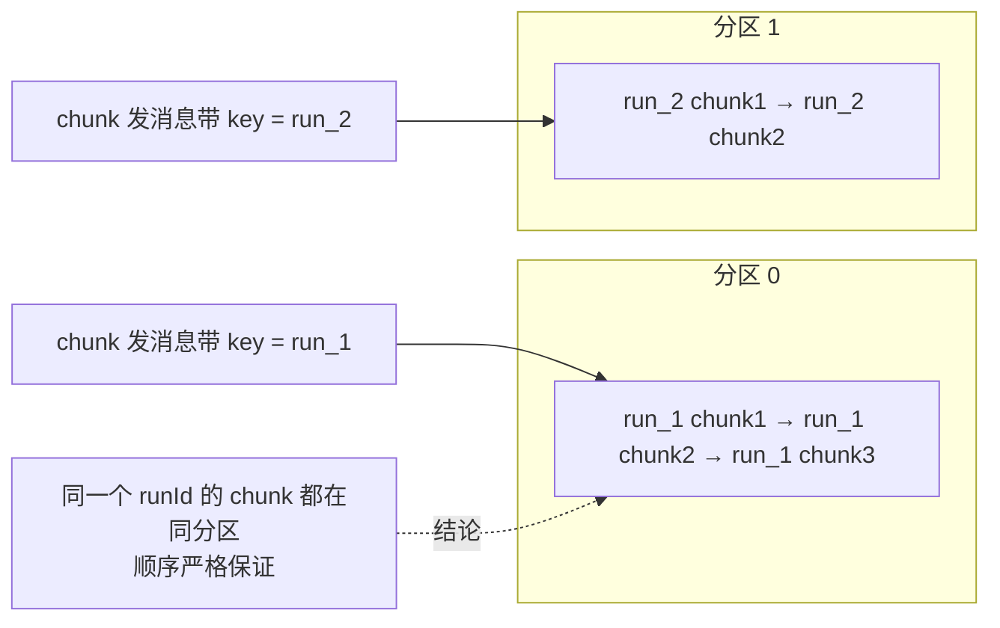
```mermaid
flowchart LR
    subgraph P0s["分区 0"]
        A["run_1 chunk1 → run_1 chunk2 → run_1 chunk3"]
    end
    subgraph P1s["分区 1"]
        B["run_2 chunk1 → run_2 chunk2"]
    end
    K1["chunk 发消息带 key = run_1"] --> A
    K2["chunk 发消息带 key = run_2"] --> B
    S1["同一个 runId 的 chunk 都在同分区<br/>顺序严格保证"] -. 结论 .-> A
```

### 7.4 instanceId
- **是什么**：应用实例的唯一标识（`${spring.application.name:inst}-${random.uuid}` 截断 12 位）。
- **谁生成**：Spring 启动时。
- **用途**：日志里标记"这个 run 是哪个实例在跑/取消的"。第 9 章跨实例取消时，持有生成器的实例靠监听取消频道自行动手，`instanceId` 主要用于日志可观测性，不是业务寻址。

### 7.5 gen_message.id（PG 自增）
- **是什么**：`gen_message` 表每行的主键（BIGSERIAL 自增）。
- **用途**：历史记录排序（`ORDER BY id`）、取"最近 N 轮"（按 id 倒序 + limit）、分页游标。
- **和 runId 的区别**：`gen_message.id` 是数据库行号；`run_id` 是业务身份（哪次生成）。排序用行号、业务归组用 run_id。

### 7.6 traceId / spanId —— 可观测性 ID（分布式链路追踪）

> 这一组 ID 在 **35 号文档里还没实现**（只在第 12 章"进阶方向"列为可观测性），但**正式项目必有**，所以补进来。它不是业务身份，也不是存储 key，是"**这次请求在系统里走了哪条路**"的轨迹。

- **是什么**：`traceId` 标识**一次端到端请求**（跨所有服务的一条链路）；`spanId` 标识链路里的**一次服务调用**。属于 OpenTelemetry / W3C `traceparent` 标准。
- **谁生成**：链路的入口（网关或第一个服务）生成 `traceId`，通过 HTTP 头 `traceparent`（或 `X-Request-Id`）向下游逐级传播；每个服务为本地调用开一个 span，生成自己的 `spanId`。Kafka 消息也可以带 trace 上下文（生产者→消费者续传同一链路）。
- **什么时候用**：**所有**请求、日志、中间件调用都带它。排查问题时的用法：拿到一个 `traceId` → 在日志系统/追踪后端（Jaeger/Tempo）把这一整条链路的日志全拉出来，按时间串成一次请求的完整旅程。
- **存哪**：**不落业务库**——只出现在请求头、日志、追踪后端。和 `runId`/`sessionId` 这类存储 key 完全不同。
- **和其他 ID 的关系（正交）**：一个 `traceId` 下会有"一次触发（带 sessionId/runId）"+" 多次流式推送"+" 若干次 DB/Redis/Kafka 调用"。日志行里它们同时出现：`traceId` 管"链路"，`runId`/`sessionId` 管"业务"。排查时两者互补——先按业务 ID 找到请求，再按 traceId 展开链路。

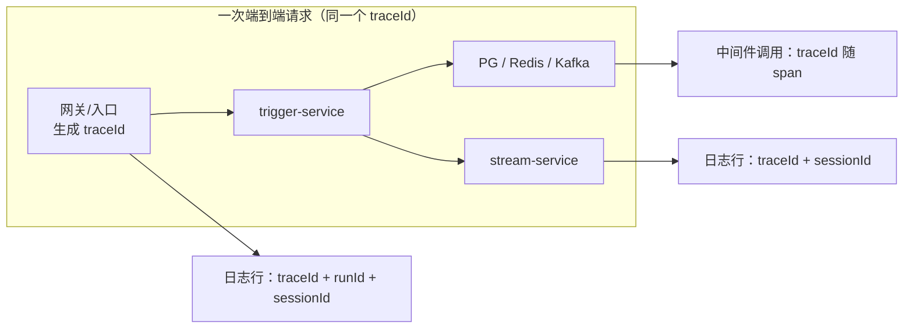
```mermaid
flowchart LR
    subgraph TRACE["一次端到端请求（同一个 traceId）"]
        A["网关/入口<br/>生成 traceId"] --> B["trigger-service"]
        B --> C["PG / Redis / Kafka"]
        B --> D["stream-service"]
    end
    A --> L1["日志行：traceId + runId + sessionId"]
    D --> L2["日志行：traceId + sessionId"]
    C --> L3["中间件调用：traceId 随 span"]
```

> **请求里同时有 4 类 ID，别混**：`sessionId`（哪个对话）· `runId`（哪次生成）· `idempotencyKey`（哪次提交，去重）· `traceId`（这条请求走了哪条链路）。前三个是业务/去重，最后一个是可观测性——**traceId 不影响业务逻辑，只影响你能不能查到日志**。

---

## 8. 三个存储里的 ID 全图

### 8.1 PostgreSQL（第 7-8 章：结构化数据的家）

| 表 | 列 | 存什么 ID | 说明 |
|----|----|----------|------|
| `gen_run` | `id` = **runId**（PK） | 一次生成 | 状态机 queued/RUNNING/DONE/FAILED/CANCELLED 落这里 |
| | `session_id` = **sessionId** | 归属会话 | 有索引 `idx_gen_run_session`，可按会话查 run 历史 |
| `gen_idempotency` | `idempotency_key` = **idempotencyKey**（PK） | 一次提交 | 唯一约束 = 原子幂等 |
| | `run_id` = **runId**（FK） | 映射到的 run | |
| `gen_session` | `id` = **sessionId**（PK） | 一个对话 | 第 8 章起，历史列表靠它 |
| `gen_message` | `id` = **gen_message.id**（自增 PK） | 一行消息 | 排序用 |
| | `session_id` = **sessionId**（FK） | 归属会话 | |
| | `run_id` = **runId**（FK） | 哪次生成 | 消息按 run 分组 |

**四张表的关系（ER 图）**：

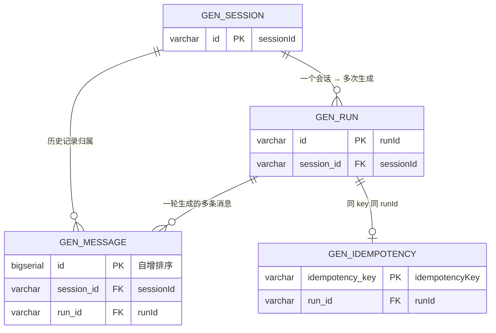
```mermaid
erDiagram
    GEN_SESSION ||--o{ GEN_RUN : "一个会话 → 多次生成"
    GEN_SESSION ||--o{ GEN_MESSAGE : "历史记录归属"
    GEN_RUN ||--o{ GEN_MESSAGE : "一轮生成的多条消息"
    GEN_RUN ||--o| GEN_IDEMPOTENCY : "同 key 同 runId"
    GEN_RUN {
        varchar id PK "runId"
        varchar session_id FK "sessionId"
    }
    GEN_IDEMPOTENCY {
        varchar idempotency_key PK "idempotencyKey"
        varchar run_id FK "runId"
    }
    GEN_SESSION {
        varchar id PK "sessionId"
    }
    GEN_MESSAGE {
        bigserial id PK "自增排序"
        varchar session_id FK "sessionId"
        varchar run_id FK "runId"
    }
```

### 8.2 Redis（锁 / 实时通知 / 旧版状态）

| key | 值 | 存什么 | 生命周期 |
|-----|-----|--------|---------|
| `session:{id}:running` | —（Redisson owner 令牌） | 会话级独占锁（Redisson RLock，看门狗续期） | 短命，终态释放；实例崩溃 30s 后锁过期 |
| `idem:{key}` | **runId** | 幂等映射（第 6 章 Redis 版，第 7 章迁 PG） | TTL 1 天 |
| `run:{id}:status` | JSON | run 状态（第 6 章 Redis 版，第 7 章迁 PG） | TTL 1 天 |
| `gen:{runId}:chunks` | Stream | 该 run 的 chunk | 随业务清理 |
| `gen:{runId}:seq` | 整数 | seq 计数器 | 随业务清理 |
| `gen:{runId}` | — | chunk 实时 Pub/Sub 频道 | — |
| `gen:{runId}:cancel` | — | 跨实例取消频道（第 9 章） | — |
| `gen:{runId}:lock` | — | Redisson 锁（第 9 章） | 看门狗自动续期 |

> **注意**：第 7 章后，`run:{id}:status` 和 `idem:{key}` 迁到了 PG——**Redis 里只剩锁、会话独占标记、实时通知、chunk 总线**。看到 Redis key 别以为业务数据在 Redis。

### 8.3 Kafka（第 10 章：chunk 持久总线）

| 概念 | 值 | 用途 |
|------|-----|------|
| topic | `gen-chunks` | 所有 run 的 chunk 都进这一个 topic |
| 消息 **key** | = **runId** | 同 run 进同分区、保序 |
| 消费组 id | `research-sse`（配置） | 订阅服务/SSE 的消费进度 |
| **offset** | 托管 | 消费进度、回放（审计/计费/分析各用一组） |

**存储归属速览（一个 ID 可能同时出现在多个存储）**：

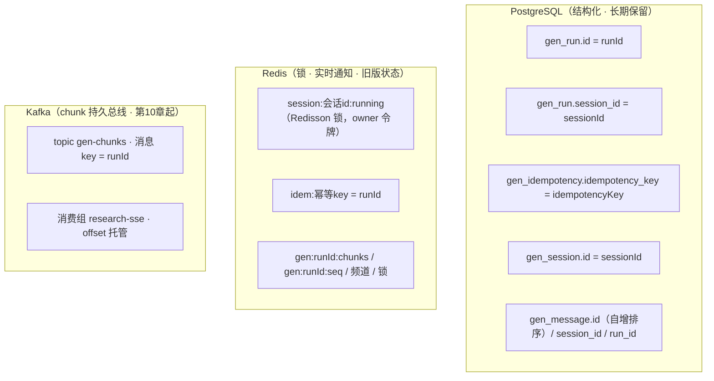
```mermaid
flowchart TB
    subgraph PG["PostgreSQL（结构化 · 长期保留）"]
        P1["gen_run.id = runId"]
        P2["gen_run.session_id = sessionId"]
        P3["gen_idempotency.idempotency_key = idempotencyKey"]
        P4["gen_session.id = sessionId"]
        P5["gen_message.id（自增排序）/ session_id / run_id"]
    end
    subgraph RD["Redis（锁 · 实时通知 · 旧版状态）"]
        R1["session:会话id:running（Redisson 锁，owner 令牌）"]
        R2["idem:幂等key = runId"]
        R3["gen:runId:chunks / gen:runId:seq / 频道 / 锁"]
    end
    subgraph KF["Kafka（chunk 持久总线 · 第10章起）"]
        K1["topic gen-chunks · 消息 key = runId"]
        K2["消费组 research-sse · offset 托管"]
    end
```

---

## 9. ID 关系与生命周期图

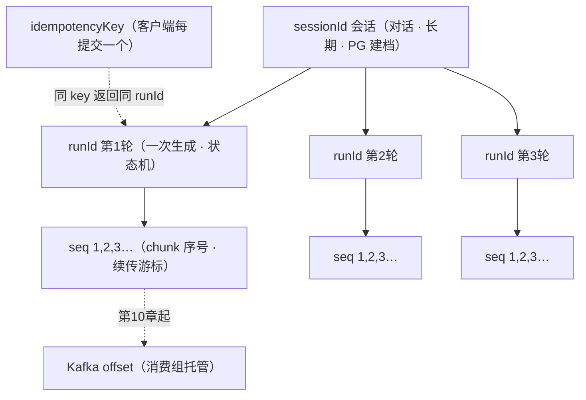
```mermaid
flowchart TD
    S["sessionId 会话（对话 · 长期 · PG 建档）"]
    S --> R1["runId 第1轮（一次生成 · 状态机）"]
    S --> R2["runId 第2轮"]
    S --> R3["runId 第3轮"]
    K["idempotencyKey（客户端每提交一个）"] -. 同 key 返回同 runId .-> R1
    R1 --> SEQ1["seq 1,2,3…（chunk 序号 · 续传游标）"]
    R2 --> SEQ2["seq 1,2,3…"]
    R3 --> SEQ3["seq 1,2,3…"]
    SEQ1 -. 第10章起 .-> O["Kafka offset（消费组托管）"]
```

> 跨实例时（第 9 章），同一个 `runId` 同时挂三样东西：**锁** `gen:runId:lock`（谁持有谁生成）、**取消频道** `gen:runId:cancel`（谁持有谁停）、**instanceId**（日志标记谁在跑）。

**生命周期速记**：
- `sessionId`：最长，对话结束才消亡。
- `runId`：一次生成的完整生命周期（分钟级）。
- `seq`：随 run，第 10 章退役。
- `idempotencyKey`：提交去重有效期内（1 天/永久），使命完成就不再有意义。

---

## 10. 演进时间线：哪个 ID 在哪一章出生/被替换

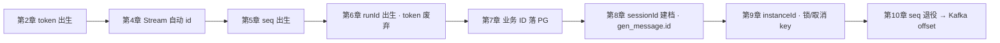
```mermaid
flowchart LR
    A["第2章 token 出生"] --> B["第4章 Stream 自动 id"]
    B --> C["第5章 seq 出生"]
    C --> D["第6章 runId 出生 · token 废弃"]
    D --> E["第7章 业务 ID 落 PG"]
    E --> F["第8章 sessionId 建档 · gen_message.id"]
    F --> G["第9章 instanceId · 锁/取消 key"]
    G --> H["第10章 seq 退役 → Kafka offset"]
```

> 第 11 章（Profile 拆服务）不产生新 ID，时间线图中省略，见下表第 11 章行。

| 章节 | 新增/替换的 ID | 说明 |
|------|--------------|------|
| 第 2 章 | `token`（`gen_xxx`）出生 | 内存 Map 的流钥匙 |
| 第 3 章 | `token` 复用 | Sinks 广播器的 key |
| 第 4 章 | Redis Stream 自动消息 id 出现 | 但只做内部定位 |
| 第 5 章 | **`seq` 出生** | 续传游标；SSE `id:` = seq；明确不用 Stream 自动 id |
| 第 6 章 | **`runId` 出生，`token` 废弃**；`sessionId` 引入；`idempotencyKey` 引入 | run 资源：状态机/幂等/会话独占/取消 |
| 第 7 章 | `runId`/`sessionId`/`idempotencyKey` 落 PG | Redis KV → 关系库 |
| 第 8 章 | `sessionId` 规范化（`POST /api/sessions` 建档）；`gen_message.id` 出生 | 会话历史 + 多轮上下文 |
| 第 9 章 | `instanceId` 出生；`gen:{runId}:lock`/`gen:{runId}:cancel` 出现 | 多实例 |
| 第 10 章 | **`seq` 退役 → Kafka offset**；runId 变 Kafka 消息 key | 持久总线 |
| 第 11 章 | 无新 ID（Profile 拆服务） | 只按 profile 拆控制器，ID 体系不变 |
| 第 12 章 | runId/sessionId 在网关路由里出现（路径匹配） | 网关收口 |

---

## 11. 常见混淆点（重点）

### 11.1 runId vs sessionId（最常搞混）

- `sessionId` 是**对话**，一个对话有**很多轮**；`runId` 是**一轮生成**，一次触发一个。
- 为什么不能只用 sessionId？——过去某一轮的流回放、针对某一轮的取消/重试/分享/删除、未来同会话并行，都需要"哪一轮"这个身份。runId 就是"哪一轮"。
- 底层证据：`gen_message` 里同时有 `session_id` 和 `run_id`——**历史里每行消息都挂着 run**，说明系统内部一直在按 run 分组，只是你可以在前端接口层把 runId 藏起来。

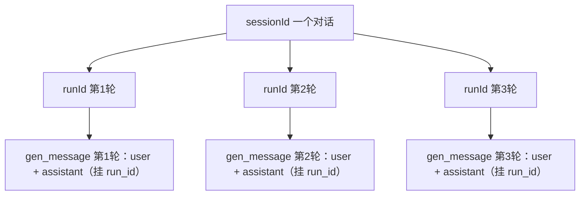
```mermaid
flowchart TD
    S["sessionId 一个对话"] --> R1["runId 第1轮"]
    S --> R2["runId 第2轮"]
    S --> R3["runId 第3轮"]
    R1 --> M1["gen_message 第1轮：user + assistant（挂 run_id）"]
    R2 --> M2["gen_message 第2轮：user + assistant（挂 run_id）"]
    R3 --> M3["gen_message 第3轮：user + assistant（挂 run_id）"]
```

### 11.2 idempotencyKey vs sessionId（去重键 vs 对话）

- `sessionId` 跨轮**稳定**——它天然区分不了"重试第 1 轮"和"新的第 2 轮"。
- `idempotencyKey` 是**每提交一个**、客户端生成的，用来证明"这次重试 = 上次那次提交"。
- 会话级独占（409）挡的是"并发"，幂等键挡的是"重复提交（含完成后的重试）"——两个东西，各管一层。

**一个 sessionId 下，key 跨提交变化——sessionId 稳定、key 每提交一个**：

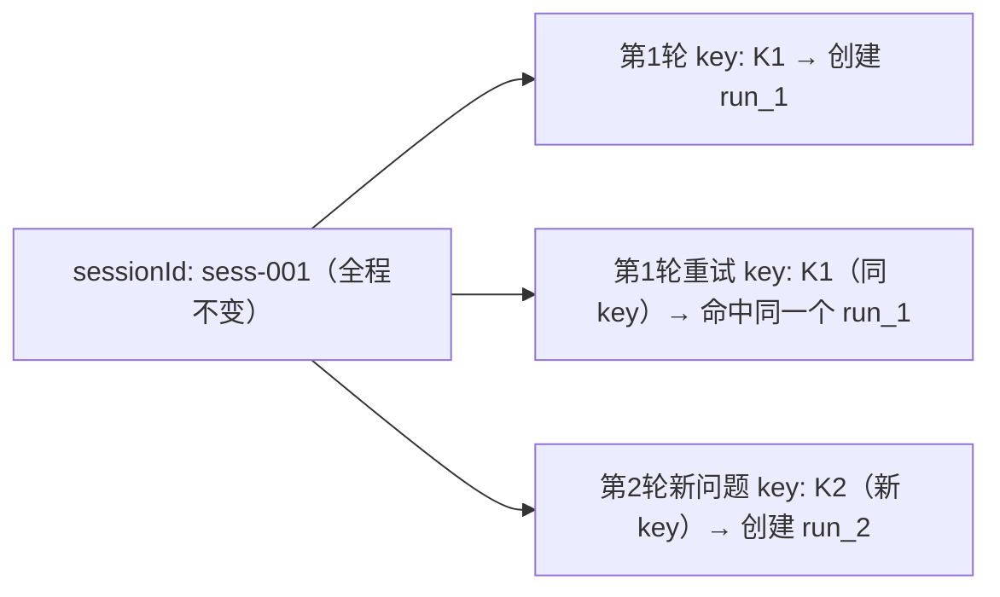
```mermaid
flowchart LR
    S["sessionId: sess-001（全程不变）"]
    S --> A["第1轮 key: K1 → 创建 run_1"]
    S --> B["第1轮重试 key: K1（同 key）→ 命中同一个 run_1"]
    S --> C["第2轮新问题 key: K2（新 key）→ 创建 run_2"]
```

> 对比 `A` 和 `B`：key 没变（都是 K1），所以是"重试"；对比 `A` 和 `C`：key 变了（K1→K2），所以是"新轮"。**sessionId 全程不变，区分不了这两者——能区分的是 key 变没变。**（重试命中后会不会真的"不重复"，见 §4 场景 C：文档实现只防新建记录、不防重新生成。）

### 11.3 seq vs Redis Stream 自动消息 id

- `seq`：应用层 INCR，从 1 开始的干净整数，做 SSE `id` 和续传游标。
- 自动 id：Redis 生成的时间戳组合，做 Stream 内部定位。第 5 章特意选了 seq 而非自动 id（客户端续传用 `seq`，不用自动 id）。

### 11.4 seq vs Kafka offset

- `seq`：手写游标，第 10 章前用（Redis 时代：客户端带 `Last-Event-ID` 续传）。
- `offset`：Kafka 消费组托管，第 10 章后取代 seq（Kafka 时代：`earliest` 从头回放）。换 Kafka 后 `Last-Event-ID` 不再自动生效，回放靠消费组。

### 11.5 token vs SSE 事件名 `event("token")`

- `token`（第 2-5 章）是**被 runId 取代的旧任务 ID**。
- `event("token")`（第 5 章起）是 SSE 的**事件类型名**（前端 `addEventListener("token")`），和数据 ID 无关。纯属撞名。

### 11.6 idempotencyKey 不是身份

- 它不标识资源，只标记"同一次提交"。同一 key 永远映射到同一个 runId；不同轮次**必须**换 key。

---

## 12. 一份 API 请求里会出现哪些 ID

### 12.1 场景一：一次完整对话（所有 ID 出场）

以第 8 章（会话历史 + 多轮上下文）为例，一个完整交互流程里所有 ID 的出场：

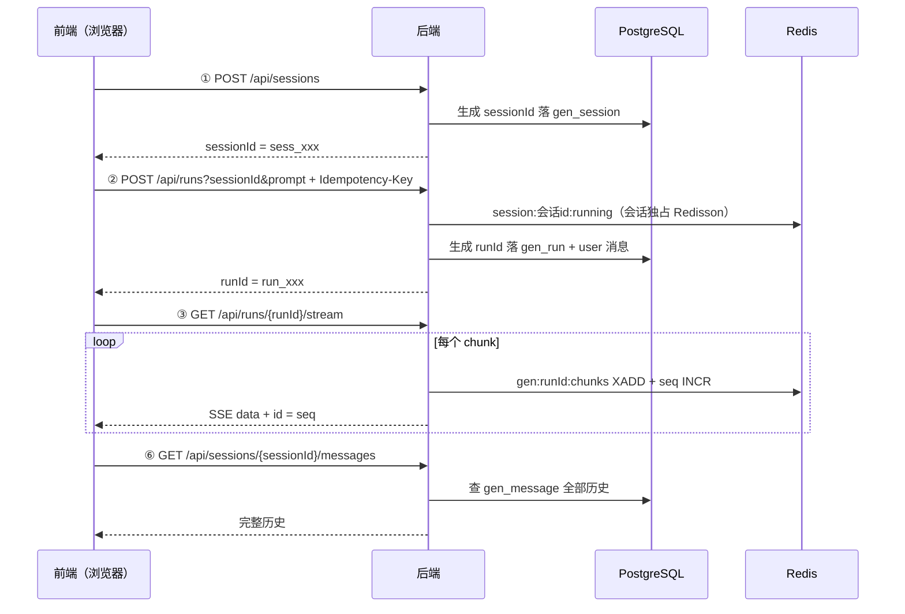
```mermaid
sequenceDiagram
    participant C as 前端（浏览器）
    participant API as 后端
    participant PG as PostgreSQL
    participant RD as Redis
    C->>API: ① POST /api/sessions
    API->>PG: 生成 sessionId 落 gen_session
    API-->>C: sessionId = sess_xxx
    C->>API: ② POST /api/runs?sessionId&prompt + Idempotency-Key
    API->>RD: session:会话id:running（会话独占 Redisson）
    API->>PG: 生成 runId 落 gen_run + user 消息
    API-->>C: runId = run_xxx
    C->>API: ③ GET /api/runs/{runId}/stream
    loop 每个 chunk
        API->>RD: gen:runId:chunks XADD + seq INCR
        API-->>C: SSE data + id = seq
    end
    C->>API: ⑥ GET /api/sessions/{sessionId}/messages
    API->>PG: 查 gen_message 全部历史
    API-->>C: 完整历史
```

> 时序图里的 ID 一眼看全：① 服务端生成 `sessionId` → ② 服务端生成 `runId`（客户端带 `idempotencyKey` 去重）→ ③ 数据层靠 `seq` 给每条 chunk 编号、SSE 的 `id:` 就是 `seq` → ⑥ 历史按 `sessionId` 查、每行挂 `run_id`。

```bash
# ① 新建会话（第8章）→ 服务端生成 sessionId
POST /api/sessions
# {"id":"sess_abc123...","title":"新会话",...}

# ② 触发生成（第6章）→ 客户端带 sessionId（归属）+ Idempotency-Key（去重）
POST /api/runs?sessionId=sess_abc123...&prompt=讲个故事
    头: Idempotency-Key: a1b2c3d4-...
# {"runId":"run_xyz789...","streamUrl":"/api/runs/run_xyz789.../stream"}
#    ↑ 服务端生成 runId，客户端用它订阅

# ③ 订阅流（第4-5章）→ 路径带 runId；浏览器重连自动带 Last-Event-ID(=seq)
GET /api/runs/run_xyz789.../stream
# data 里每段文字是 chunk；SSE 事件 id: = seq；事件类型 event: token

# ④ 查状态 → 路径带 runId
GET /api/runs/run_xyz789...
# {"id":"run_xyz789...","session":"sess_abc123...","status":"DONE",...}

# ⑤ 取消 → 路径带 runId
POST /api/runs/run_xyz789.../cancel

# ⑥ 看历史 → 路径带 sessionId
GET /api/sessions/sess_abc123.../messages
# [{role:"user",run_id:"run_xyz789...",...},{role:"assistant",run_id:"run_xyz789...",...}]
```

**一句话**：客户端手里始终只有 `sessionId` 和 `runId` 两个业务 ID（外加自己生成的 `idempotencyKey`）；`seq`/offset/Stream id 是服务端和中间件的内部细节，客户端最多通过 `Last-Event-ID` 间接碰一下 seq。

### 12.2 场景二：超长文本超时 → 点"继续生成"（用的是 runId + seq，不是幂等键）

超长输出时前端一直流式打印，结果因文本过长连接/生成超时，界面出现"继续生成"按钮。**这个按钮用的 ID 是 `runId` + `seq`**，这是"为什么必须有 runId"的最佳实例。

```mermaid
sequenceDiagram
    participant C as 前端
    participant S as 后端
    C->>S: ① POST /api/runs（Idempotency-Key: K1）
    S-->>C: runId = run_1
    C->>S: ② GET /api/runs/{run_1}/stream
    loop 收到 seq 1,2,...,N
        S-->>C: SSE id=N，data=chunk
    end
    Note over C: 超时：连接断或生成停，前端记住 run_1 + 最后 seq=N
    Note over C: ③ 用户点"继续生成"
    C->>S: 重新订阅 stream + 头 Last-Event-ID: N
    S-->>C: 从 seq=N+1 继续推（若生成停过，服务端带已生成文本重新调 LLM）
    Note over C: 用到的 ID：run_1（哪次生成）+ seq=N（从哪续），不用原来的 K1
```

> 三个要点：
> - **定位"哪次生成"用 `runId`，定位"从哪段续"用 `seq`（`Last-Event-ID`）**——这正是第 5 章断线续传机制的"按钮版"。
> - **不用原来的 `idempotencyKey`**：点"继续"是**新的逻辑动作**（意图=接着写），不是重发原提交。误用原 key 会命中幂等返回 `run_1` 但**不继续生成**，按钮白点。
> - **`sessionId` 替代不了 `runId`**：一个会话有很多次生成，"继续"必须指名道姓是哪一次被掐断的生成——这正是 §11 说的"runId 就是'哪一轮'"。

### 12.3 场景三：多页面怎么拿到 runId（幂等键解决不了，sessionId 查 status 才行）

**很现实的问题**：第二个页面没做过 POST，怎么拿到 runId 看流？答：**幂等键解决不了**——页面间无法共享 key。正确机制是 `sessionId` + 查当前 run。

```mermaid
sequenceDiagram
    participant A as 页面A（触发）
    participant B as 页面B（加入）
    participant S as 后端
    participant L as 会话锁
    A->>S: POST /api/runs?sessionId&prompt + Idempotency-Key:K_A
    S-->>A: runId=run_123（响应体里就有）
    A->>S: GET /api/runs/run_123/stream（订阅）
    Note over B: 页面B 只有 sessionId（URL 里），没有 key
    B->>S: GET /api/sessions/sess-001/status
    S->>L: 从会话锁读出 currentRunId
    L-->>S: run_123
    S-->>B: currentRunId=run_123
    B->>S: GET /api/runs/run_123/stream（订阅）
    Note over S: 两个页面都拿到 run_123 → 看到同一份流
```

> **关键结论（纠正之前模糊的表述）**：
> - **幂等键只解决"同一个页面重试自己的提交"**——同页面重发同 key → 同 runId。它**不是**多页面共享流的机制（页面间无法共享 key，各自随机生成）。
> - **多页面共享流的正确机制是 `sessionId` + 查当前 run**：`GET /api/sessions/{id}/status` 返回 `currentRunId`，任何页面带 sessionId 都能拿到它，进而订阅同一份流。
> - **一致性来自服务端**（会话锁 `session:{id}:running = runId`），不来自客户端的 key。

---

## 13. 生产排查时怎么用这些 ID

| 想查什么 | 用什么 ID | 去哪查 |
|---------|----------|-------|
| 某次生成为什么失败/卡住 | `runId` | `GET /api/runs/{runId}`（状态）；PG `gen_run`；日志 `runId=` |
| 某个用户整个对话说了什么 | `sessionId` | PG `gen_message WHERE session_id=...`（正序） |
| 同一个对话跑过哪几次生成 | `sessionId` | PG `gen_run WHERE session_id=... ORDER BY created_at` |
| 为什么重复生成了两次 | `idempotencyKey` | PG `gen_idempotency`（看同 key 是否被并发插入两次） |
| 断线续传有没有丢字 | `seq` | Redis Stream 该 run 的 `seq` 是否连续；客户端 `Last-Event-ID` |
| 某段文字属于哪次生成/哪个会话 | `runId` → `sessionId` | PG `gen_message`（run_id、session_id 双字段） |
| 多实例下谁在跑这个 run | `runId` + `instanceId` | 日志 `runId=` 附近的 `by=inst-xxx` |
| 消费组读没读到 | offset | `kafka-consumer-groups --group research-sse --describe` |

---

## 附：给新手的一句话总结

> 记三层：**`sessionId` 是"哪个对话"，`runId` 是"哪次生成"，`seq` 是"哪一段字"**。
> 加一个去重键 **`idempotencyKey`**：同一次提交只生成一次。
> 剩下（Stream 自动 id / Kafka offset / instanceId / gen_message.id / traceId）是中间件、数据库和可观测性的身份证，认识即可，不用生成。
