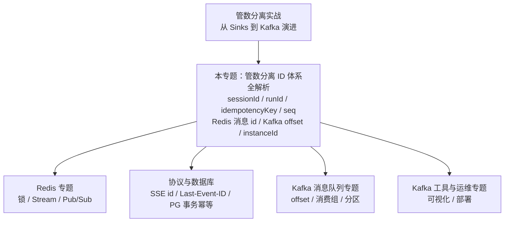

# 管数分离专题（学习顺序）
> 📌 辅线定位：专为《教程/主线-SpringAI2.0-35 管数分离实战》补充 ID 体系背景

本文件夹收录与 **管数分离实战（从 Sinks 到 Kafka 演进）** 配套的专题解读。管数分离实战为了聚焦"管数分离"一条主线，刻意压扁了很多实现细节；本文件夹把这些细节单独展开，读管数分离实战遇到卡点回来查。

| 顺序 | 文档 | 你将学到 |
|:---:|------|---------|
| **01** | 管数分离 ID 体系全解析 | 这个系统里出现的每一个 ID——`sessionId` / `runId` / `idempotencyKey` / `seq` / Redis Stream 消息 id / Kafka offset / `instanceId`……谁生成、标识什么、什么时候用、存在哪、生命周期多长、和其他 ID 什么关系 |

> **关联**：本文件夹对应 **管数分离实战（从 Sinks 到 Kafka 演进）** 全文。ID 体系里涉及的底层知识，可分别深入 Redis 专题（锁/Stream/Pub/Sub）、协议与数据库（SSE 的 `id`/`Last-Event-ID`、PG 事务与幂等）、Kafka 消息队列专题（offset/消费组/分区）、Kafka 工具与运维专题（可视化/部署）。

**与管数分离实战及底层专题的关系**：

