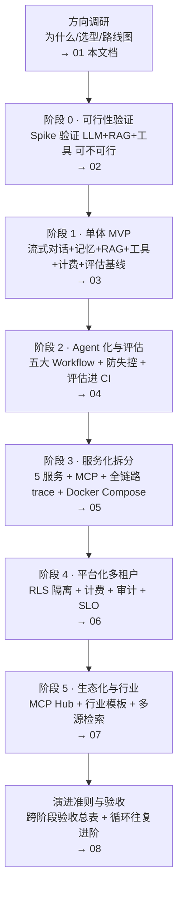

# 企业级多租户智能客服 Agent 平台（项目总览）

> 一句话定位：**基于 Spring AI 2.0 + 国产大模型 + pgvector + MCP，面向企业客户交付的多租户智能客服 Agent 平台**——把"多轮对话 → 知识库问答 → 工具派单 → 多租户隔离 → 评估/安全/成本/可观测"串成一条可落地的端到端链路。
>
> 适合：已经能跑通 Spring AI Hello World、想往上走做**企业级项目**的 Java 工程师。本文档是入门索引，后续每个阶段一份文档，按顺序读。

---

## 一、项目是什么

一句话展开讲：

- **多租户**：每个企业客户独立知识库 + 独立权限 + 独立计费（不是 demo 玩具，是 SaaS 形态）。
- **智能客服 Agent**：能多轮对话、能查企业自己的知识库（RAG）、能调用工具（查工单/订单/派单），而不是只会背固定话术。
- **平台**：不是单个 Agent，是"接渠道 → 路由模型 → 编排 Agent → 沉淀评估/成本/观测"的平台骨架。

本平台直接对齐 `计划/00-整体路线.md` 中的 **P5 毕业项目（企业级多租户客服系统）**。

---

## 二、为什么选它——综合了全库哪些知识

选这个项目，是因为它能**覆盖知识地图里全部 16 项能力（= 下表 16 行）**，每项都能在全库找到对应教程与理论。做一遍 = 把全库串成一张网。

| 平台能力模块 | 对应知识能力 | 教程/理论出处 |
|---|---|---|
| 对话与流式 | 对话与流式 (Conversation & Streaming) | 教程/04-流式响应与Reactor深度、教程/03-Advisor链全解、教程/21-端到端案例、教程/25-Agent记忆架构、教程/22-框架源码精读；理论/01-心智模型与决策树、理论/03-Agent原理 |
| 提示词与话术模板 | 提示词工程 (Prompt Engineering) | 教程/23-Prompt工程深入、教程/12-评估闭环与Prompt版本管理、教程/15-可观测性与成本治理；理论/01、理论/11-LLMOps、理论/15-成本工程与PromptCache |
| 工具调用（查单/派单） | 工具调用与Function Calling | 教程/02-Tool与AgentLoop、教程/04、教程/05-MCP协议全解、教程/22；理论/03、理论/12-ClaudeCode源码启示录、理论/14-MCP协议与生态 |
| 产品知识库问答 | RAG知识库 (RAG Knowledge Base) | 教程/09-RAG工程化实战、教程/20-RAG高级篇、教程/24-向量模型选型与微调、教程/08-多模态实战、教程/32-多源检索Agent与MCP生态整合、教程/21；理论/02-RAG深度优化、理论/07-模型微调、理论/06-模型服务部署 |
| 客服主流程编排 | Agent循环与Workflow模式 | 教程/02、教程/03-Advisor链全解（⭐核心篇）、教程/11-五大Workflow模式与代码评审助手、教程/14-安全工程与红队、教程/10-多Agent编排实战；理论/03、理论/12、理论/09-企业级Java-AI架构选型真相 |
| 复杂工单派工 | 多Agent编排 (Multi-Agent Orchestration) | 教程/10、教程/11、教程/17-AI原生系统设计、教程/21；理论/04-多模态与多Agent、理论/03 |
| 多轮会话持久化 | 记忆与会话 (Memory & Session) | 教程/25、教程/04、教程/17、教程/22；理论/01、理论/03 |
| 评估集与 A/B | 评估与测试 (Evaluation & Testing) | 教程/12、教程/13-测试工程化、教程/09；理论/11 |
| 防 Prompt 注入 / 防失控 | 安全与防失控 (Security & Anti-失控) | 教程/14、教程/11、教程/06-MCP-Server开发实战；理论/12 |
| 全链路观测 | 可观测性 (Observability) | 教程/15、教程/13、教程/22；理论/11 |
| 计费与 Token 优化 | 成本治理 (Cost Governance) | 教程/15、教程/16-多模型路由与国产化、教程/18-大规模Agent平台与数据基础设施；理论/15、理论/06 |
| 简单问题走小模型 | 多模型路由 (Multi-Model Routing) | 教程/16、教程/15、教程/19-自研vs框架的边界；理论/06、理论/09、理论/10-SpringAI-vs-LangChain4j何时用何框架 |
| 对接工单/CRM | MCP协议与服务 (MCP Protocol & Services) | 教程/05、教程/06、教程/07-MCP-Server高阶与生态、教程/32；理论/14 |
| 多租户隔离与计费 | 多租户平台 (Multi-Tenant Platform) | 教程/18、教程/17、教程/05、教程/21；理论/09、理论/10、理论/05-Java与AI融合架构 |
| 上线与运维 | 可靠性工程 (Reliability Engineering) | 教程/26-AI工程的SRE实践、教程/27-CICD-for-AI、教程/28-AI项目的Git工作流、教程/19、教程/13；理论/16-Agent可靠性工程Java视角、理论/11、理论/12 |
| 客服合规板块 | 行业实战（金融/医疗/法律） | 教程/29-金融风控Agent、教程/30-医疗问诊Agent、教程/31-法律咨询Agent、教程/21、教程/32；理论/16、理论/12 |

> 一句话：**别的项目只练 2~3 项能力，客服 Agent 平台 16 项全覆盖**——这就是"为什么选它"的答案。

---

## 三、企业级演进路线图（7 次进阶 + 收尾总纲）

从 0 到上线，分 7 步走，最后用 `08` 收口。每一步都有**明确产出**，上一步的产出就是下一步的输入，不跳步；每一阶段的**验收标准都在对应阶段文档第 5 节**，全部打勾才算完成。

### 每阶段目标一览

| 阶段 | 对应文档 | 核心问题 | 关键产出 | 验收锚点 |
|---|---|---|---|---|
| 方向调研 | `00` + `01` | 做对方向、选对技术栈 | 选型结论 + 路线图 | 能说出为什么是 Spring AI 2.0 + pgvector + MCP |
| 阶段 0 · 可行性验证 | `02` | 这条路可不可行 | Spike 验证结论 + 评估集雏形（20 条） | 20 条知识库全答、3 条边界正确、工具调用 ≥80% |
| 阶段 1 · 单体 MVP | `03` | 对话闭环 + 评估基线 | 完整客服单体（流式/记忆/RAG/工具/计费） | 30 条评估集跑出 faithfulness 基线 |
| 阶段 2 · Agent 化与评估 | `04` | 会不会编排办事 | 五大 Workflow + 评估进 CI | ≥50 条评估集 faithfulness ≥0.8 |
| 阶段 3 · 服务化拆分 | `05` | 拆了能不能独立 | 5 服务 + MCP + 全链路 trace | 5 服务独立部署 + Docker Compose 一键起 |
| 阶段 4 · 平台化多租户 | `06` | 能不能卖多家企业 | 租户隔离 + 计费 + 审计 + SLO | 3 租户数据互不可见、计费准确率 100% |
| 阶段 5 · 生态化与行业 | `07` | 敢不敢开放 | 生态闭环 + 行业模板 + 多源检索 | 3 行业模板可演示 + 生态闭环成立 |
| 演进准则与验收 | `08` | 怎么不翻车 | 演进纪律 + 跨阶段验收总表 | 按 08 跨阶段总表逐条对表 |

> 说明：阶段 0 是 **1~2 周、可丢弃代码的可行性验证（Spike）**，结论比代码重要；"流式 Hello World 骨架"属于阶段 1 单体 MVP 的内容。阶段 5 的"行业实战（金融/医疗/法律）"是**必选**，不是可选。
>
> 演进逻辑呼应全库核心思想：**"Workflow > Agent"（80% 场景用确定性 DAG，理论/09）**、**"评估驱动——没有评估集的改动都是玄学"（教程/12）**。每阶段的验收锚点都尽量做成"可量化"，不凭感觉。

> **可选扩展**：**多模态客服**（附件识别 + 多模态 RAG）不在主线里——建议在阶段 2（已有评估闭环后）或阶段 5 之后按需引入（见 `01-方向调研与选型.md` §三"阶段 5 之后：多模态扩展"）。

---

## 四、如何用这份文档（初学者请按阶段顺序照做）

1. **不要跳阶段**：先读本目录 `01-方向调研与选型.md`，理解"为什么"；再从阶段 0 一路做到阶段 5。每个阶段会补一篇独立文档（`02-…`、`03-…` 依此类推），本 README 是总索引。
2. **每阶段固定动作**：看目标 → 读该阶段"必读教程"（主篇先读）→ 动手跑 → 用"验收锚点"自检 → 进入下一阶段。
3. **遇到概念卡点**：主读 `../教程/` 的实践，卡理论再翻 `../理论/` 对应章节；更深的专题放 `../附录/`（如 `附录/Reactor响应式编程`、`附录/事件溯源与CQRS专题`、`附录/Agent架构师晋升路线`）。
4. **引用格式约定**：本文档及后续阶段文档统一用 `教程/NN-标题`、`理论/NN-标题` 引用全库资料，方便索引。
5. **先评估、后优化**：从阶段 2 起，改动任何 Prompt / 检索 / 模型前，先跑一遍已有评估集（对齐 `教程/12-评估闭环与Prompt版本管理`），否则不算完成。
6. **落地生根**：每个阶段产出都提交到本目录，形成你自己的项目资产（这也是全库 `教程/28-AI项目的Git工作流` 的实践）。

> 时间紧？至少把 01 → 阶段0 → 阶段1 做完，你已经拥有一个"能对话、能查知识库、能记会话、能计费"的完整客服 MVP；后面的 Agent 化和平台化是价值放大器。
