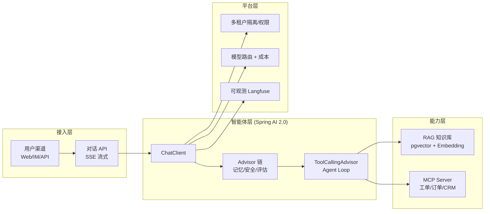

# 方向调研与选型

> 本文回答三个问题：**为什么做智能客服 Agent 平台？用什么技术栈？每一步该读全库哪些文档？**
> 阅读前置：本目录 `00-README.md`（先看总览再读本文）。

---

## 一、为什么是智能客服 Agent 平台

### 1.1 企业落地场景（真有人要、真能收费）

客服是"AI 最容易产生业务价值"的入口，因为场景高度重合 LLM 的强项——**对话理解 + 知识问答 + 工具执行**：

| 企业真实诉求 | 客服平台怎么回答 | 依赖的核心能力 |
|---|---|---|
| 产品/售后 FAQ 应接不暇 | 知识库问答，7×24 自动应答 | RAG 知识库 |
| 多轮对话要记得前文 | 记忆与会话持久化 | 记忆与会话 |
| 客户要"查订单/催进度/改单" | 工具调用，直连工单/订单系统 | 工具调用、MCP |
| 一个客服系统卖给多家企业 | 租户隔离 + 独立知识库 + 独立权限 | 多租户平台 |
| 效果不能拍脑袋 | 评估集 + LLM-as-Judge | 评估与测试 |
| 上线不能翻车 | 防注入 + 防失控 + SRE | 安全、可靠性 |

> 一句话：**客服 = 全库 16 项能力里出现频率最高的企业级落地场景**（`教程/21-端到端案例` 的 P5 就是智能客服系统），既有业务价值，又有技术纵深。

### 1.2 为什么它能综合全库（学习 ROI 最高）

- **覆盖面最广**：对话/提示词/工具/RAG/编排/记忆/评估/安全/观测/成本/路由/MCP/多租户/可靠性/行业合规，16 项能力全部命中（详见 `00-README.md` 第二节）。
- **可演进、可拆解**：从"无知识库的对话客服"一步步进化到"多租户平台"，每一阶段都是完整闭环，不必一上来就啃下全部。
- **有毕业标准**：平台化本身就把全库的理论/教程当"脚手架"，做一遍相当于做项目版的全库复习。

### 1.3 与既有学习路线的衔接

- 对齐 `计划/00-整体路线.md` 的 **P5 企业级多租户客服系统**（阶段 6 综合毕业项目）。
- 复用兄弟项目成果：`项目-AIServing/` 的推理网关、向量库、成本治理可直接借鉴；`项目-WebClaude/` 的 Session 持久化、可观测、多租户产品层是现成参考。

---

## 二、技术选型

### 2.1 选型总览

| 选型点 | 结论 | 核心理由 | 依据文档 |
|---|---|---|---|
| 框架 | **Spring AI 2.0**（单框架） | 2.0 的 `ToolCallingAdvisor` 原生支持 Agent Loop，避免自研 while；与 Spring Boot 4 深度融合，企业主流；LangChain4j 优势已缩水 | 理论/09-企业级Java-AI架构选型真相、理论/10-SpringAI-vs-LangChain4j何时用何框架、教程/02-Tool与AgentLoop、教程/19-自研vs框架的边界 |
| 模型 | **国产模型为主**（DeepSeek/通义） + vLLM 自部署兜底 | 信创合规 + 成本可控；简单请求走小模型、复杂请求走大模型（复杂度路由）；vLLM 自部署可省约 73% 成本 | 教程/16-多模型路由与国产化、理论/06-模型服务部署、理论/15-成本工程与PromptCache |
| 向量库 | **pgvector** | 与业务库 PostgreSQL 同库，多租户数据天然随行隔离；中小规模知识库足够，先跑通再考虑专用向量库 | 教程/18-大规模Agent平台与数据基础设施、教程/24-向量模型选型与微调、项目-AIServing/02-向量库选型与治理 |
| 工具接入 | **MCP 作为统一接入层** | 对接工单/CRM 等外部系统时，跨进程工具标准化，天然支持鉴权/限流/可观测；客服系统对接业务系统优先走 MCP | 教程/05-MCP协议全解、教程/06-MCP-Server开发实战、教程/07-MCP-Server高阶与生态、教程/32-多源检索Agent与MCP生态整合、理论/14-MCP协议与生态 |
| 会话持久化 | **spring-ai-session（event-sourced）** | 会话可重放 + 审计友好，配合多租户按租户隔离会话 | 教程/25-Agent记忆架构、教程/17-AI原生系统设计、附录/事件溯源与CQRS专题 |
| 可观测 | **Langfuse + OpenTelemetry GenAI** | 理论/11 推荐的观测栈之一，Prompt/Model/Tool 血缘 + 漂移检测 | 教程/15-可观测性与成本治理、理论/11-LLMOps |
| 评估 | **LLM-as-Judge + RAGAS + 自建 QA 评估集** | 没有评估集的改动都是玄学；毕业验收要求 faithfulness>0.85 | 教程/12-评估闭环与Prompt版本管理、教程/13-测试工程化、教程/09-RAG工程化实战 |

### 2.2 为什么是 Spring AI 2.0（重点）

- `理论/09` 结论：企业级 Java AI 以**单框架（Spring AI）+ Anthropic Workflow 模式**为主流，"混用"是理论范式不是工程标配。
- `理论/10` 结论：Spring AI 2.0.0 GA 已发布（基于 Spring Boot 4 + Jackson 3），`ToolCallingAdvisor` 原生支持 Agent Loop，LangChain4j 的差异化优势大幅缩水。
- `教程/19` 给判断框架：**框架边界内用框架，边界外才自研**。本项目对话/工具/记忆全在框架内，自研只发生在平台层（多租户、计费）。

### 2.3 平台架构（mermaid）

> 读图顺序：渠道进来 → 流式对话 → 先过 Advisor 链（记忆/安全/评估横切）→ 该调工具就进 Agent Loop → 查知识库走 RAG、动业务走 MCP → 整体被多租户/路由/观测三件平台事罩住。

---

## 三、与全库文档的对应关系（每阶段该读哪些）

> 约定：`教程/NN-标题` 表示 `docs/教程/NN-标题.md`，`理论/NN-标题` 表示 `docs/理论/NN-标题.md`。主篇先读，其余按需。

### 阶段 0 · 骨架

| 目标 | 该读的教程 | 该读的理论 |
|---|---|---|
| 跑通 Spring AI 2.0 + 流式 + pgvector 连接 | 教程/01-2.0基础重塑、教程/04-流式响应与Reactor深度、教程/02-Tool与AgentLoop（前两节） | 理论/01-心智模型与决策树（LLM=RPC/SSE chunked transfer 心智模型）、理论/03-Agent原理 |

### 阶段 1 · 对话闭环（多轮 + 流式 + 记忆 + 提示词）

| 目标 | 该读的教程 | 该读的理论 |
|---|---|---|
| 多轮对话连贯、话术可控 | 教程/04（流式核心：Flux 操作符/SSE/ChatClientMessageAggregator）、教程/25-Agent记忆架构（第 1 节"多轮对话为什么需要记忆"）、教程/23-Prompt工程深入（五大 Prompt 模式） | 理论/01、理论/11-LLMOps（Prompt 版本管理） |

### 阶段 2 · 知识库（RAG）

| 目标 | 该读的教程 | 该读的理论 |
|---|---|---|
| 产品知识库问答 + 评估集 | 教程/09-RAG工程化实战（企业级 RAG 六模块 + Hybrid Search + 评估）、教程/20-RAG高级篇（RRF/Multi-Query/HyDE/Cross-encoder/Parent-Child/Agentic RAG）、教程/24-向量模型选型与微调、教程/21-端到端案例（客服系统 RAG 落地） | 理论/02-RAG深度优化、理论/06-模型服务部署 |

### 阶段 3 · 智能体（工具 + Workflow + MCP）

| 目标 | 该读的教程 | 该读的理论 |
|---|---|---|
| 能查单/派单、复杂工单派工 | 教程/02（2.0 原生 ToolCallingAdvisor Agent Loop）、教程/11-五大Workflow模式与代码评审助手（Chaining/Parallelization/Routing/Orchestrator-Workers/Evaluator-Optimizer）、教程/10-多Agent编排实战（Alibaba Graph）、教程/05 + 教程/06 + 教程/07（MCP 三连）、教程/14-安全工程与红队（防失控三重保护） | 理论/03、理论/12-ClaudeCode源码启示录（"失败要被 LLM 看到"）、理论/14-MCP协议与生态、理论/09 |

### 阶段 4 · 平台化（多租户 + 路由 + 成本 + 可观测）

| 目标 | 该读的教程 | 该读的理论 |
|---|---|---|
| 服务多家企业客户 | 教程/18（多租户隔离 + Agent 池化 + 计费 + 向量库选型）、教程/17-AI原生系统设计（Event Sourcing/CQRS 支撑审计）、教程/15-可观测性与成本治理、教程/16-多模型路由与国产化（复杂度路由 + 信创合规） | 理论/09、理论/11、理论/15-成本工程与PromptCache（L1-L4 四层成本优化）、理论/10 |

### 阶段 5 · 生产交付（评估/安全/可靠性/CICD）

| 目标 | 该读的教程 | 该读的理论 |
|---|---|---|
| 敢上线的毕业平台 | 教程/12（离线+在线评估 + A/B + Prompt 版本）、教程/13-测试工程化（四层测试 + Testcontainers）、教程/14（OWASP LLM Top 10 + 4 层注入防御）、教程/26-AI工程的SRE实践（SLI/SLO）、教程/27-CICD-for-AI（四套版本化 + ArgoCD）、教程/28-AI项目的Git工作流 | 理论/16-Agent可靠性工程Java视角（重试/幂等/补偿/超时/熔断）、理论/11 |

### 阶段 5 之后：合规增强（可选进阶）

把行业实战的"人在回路 + 合规 + 评估"共性迁移进客服合规板块：教程/29-金融风控Agent、教程/30-医疗问诊Agent、教程/31-法律咨询Agent（均含引用溯源 + 拒答策略），配合教程/32-多源检索Agent与MCP生态整合，做多源综合。

---

## 四、扩展阅读（附录专题）

- `附录/Reactor响应式编程`：阶段 1 流式背后的响应式基础。
- `附录/事件溯源与CQRS专题`：阶段 4 会话可重放/审计的架构支撑。
- `附录/Agent与提示词工程专题`：阶段 1 提示词与 Agent 模式补充。
- `附录/Agent架构师晋升路线`：阶段 5 后从"工程师"到"架构师"的路径参考。
- `附录/Docker与工具`：阶段 0 环境准备、阶段 5 部署打包。

---

> 下一步：读完本文，按 `00-README.md` 的路线图进入 **阶段 0**，先让"流式 Hello World + pgvector 连接"跑起来。
