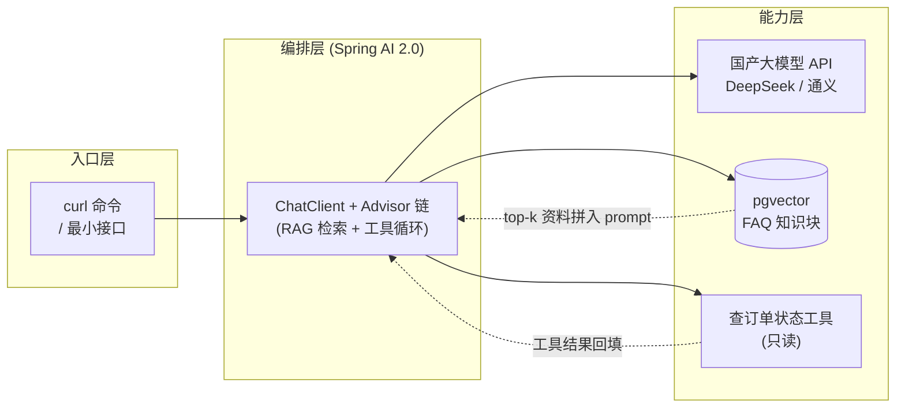
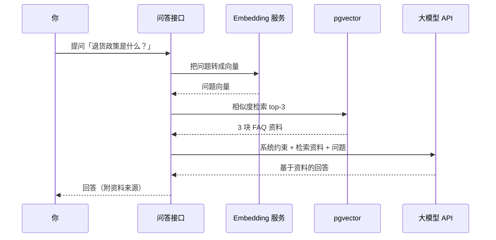
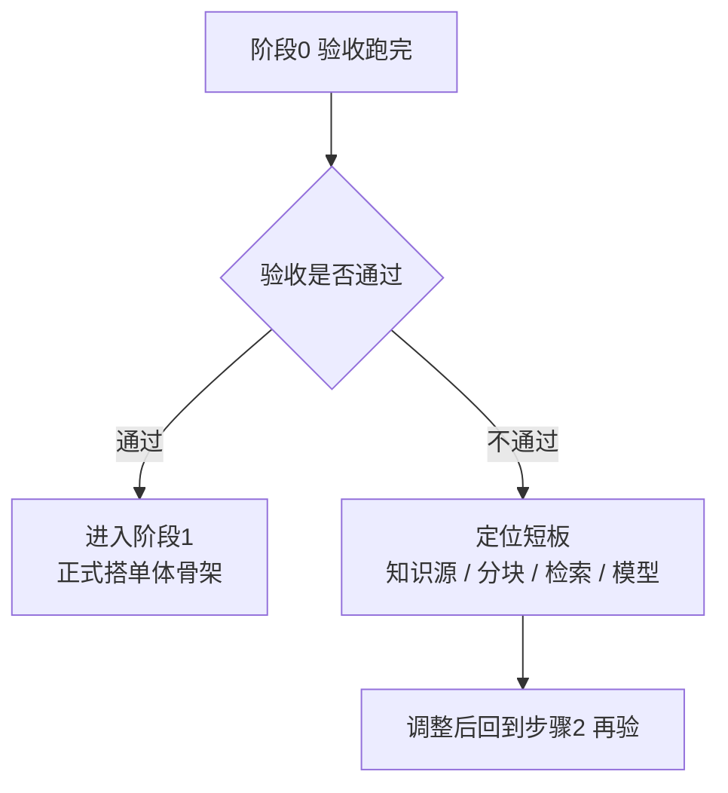

# 企业级多租户智能客服 Agent 平台 · 阶段 0：可行性验证（Spike）

> **这是整条演进路线的起点（第一个动手阶段）。** 前置：先读完本目录 `00-README.md`（项目总览）和 `01-方向调研与选型.md`（为什么做 / 怎么选型），再进本文。本文用 **1~2 周、可丢弃的代码**（Spike）回答一个最关键的问题：
>
> **「LLM + RAG + 工具调用，到底能不能支撑一个企业客服？可行在哪、不可行在哪？」**
>
> 验证通过 → 进入正式搭建（README 路线图中的"阶段0·骨架"，本文称"阶段1 正式搭单体"）；验证失败 → 在本文范围内调整知识源/分块再验，不浪费后面阶段的精力。
>
> 阅读前置：`00-README.md` → `01-方向调研与选型.md` → **本文（阶段0）** → 阶段1（正式搭单体）。
>
> 一句话：**先动手验证"LLM+RAG 能不能回答企业问题"，允许写可丢弃的代码。**

---

## 0. 一句话

> 先用 1~2 周写**可丢弃代码**（Spike），验证"大模型 + RAG 知识库 + 工具调用"这条技术路线能不能支撑企业客服：**能回答知识库问题（含边界问题）、能调用工具办事；能说清楚"为什么这个方案可行/不可行"。** 验证通过才正式搭单体，验证失败就调整知识源/分块再验。

---

## 1. 本阶段目标

### 1.1 为什么先做 Spike（不直接搭骨架）

企业客服项目风险最高的一环不是"代码写不写得出来"，而是 **"LLM+RAG 这套方案在你的真实数据上到底答不答得准"**。如果一上来就搭完整单体，很可能写完才发现检索不召回、模型爱瞎编，返工成本极高。Spike 的价值是**用最小代价把最大风险暴露在前面**：

- 允许写**脏代码**：不追求整洁、不追求可维护，只求"能跑、能验证、能留下结论"。
- 结论比代码重要：Spike 代码允许删，但**"为什么可行/不可行"的结论必须留下**，它是阶段1 的输入。

### 1.2 四个硬目标（本阶段全部做完才算完成）

| # | 目标 | 对应验证实验 | 知识来源 |
|---|---|---|---|
| 1 | **curl 调通模型** | 用一行 curl 直连国产大模型，拿到"问题→回答" | 教程/01-2.0基础重塑 §0.1、教程/04-流式响应与Reactor深度 铺垫2 |
| 2 | **最小 RAG 问答** | 10~20 篇 FAQ 切块→向量化→检索→拼 prompt→"只根据资料回答" | 教程/09-RAG工程化实战 §0.1、§第1章 |
| 3 | **最小工具调用** | 定义 1 个"查订单状态"工具，让模型"该调时调、拿结果再答" | 教程/02-Tool与AgentLoop §0A、§0B、教程/01 §4 |
| 4 | **3 个心智模型验证** | 用实测现象固化"LLM=RPC / LLM 无状态 / LLM 概率性" | 理论/01-心智模型与决策树（LLM=RPC）、理论/03-Agent原理 |

### 1.3 本阶段明确不做（边界）

- 不做多租户隔离 / 权限（那是阶段 4）。
- 不做流式输出（curl 收完整响应即可，流式是阶段 1；本阶段只读 教程/04 建心智模型）。
- 不做完整评估体系（阶段 0 用"人工判定 20 条问题"即可；LLM-as-Judge 从阶段 1 评估基线开始，RAGAS 等进阶指标留到阶段 2）。
- 不做高可用 / 部署 / 可观测（那是阶段 4~5）。
- 不写"漂亮代码"——Spike 只求验证，**结论要留，代码可删**。

---

## 2. 前置知识（先读这些再动手）

> 主篇先读，其余按需。引用约定：`教程/NN-标题` 指 `docs/教程/NN-标题.md`，`理论/NN-标题` 指 `docs/理论/NN-标题.md`。

| 资料 | 必读/选读 | 读哪几节、读来干嘛 |
|---|---|---|
| **教程/01-2.0基础重塑** | 必读 | §0.1（第一次调用 LLM = 远程 RPC，先建立心智模型）、§2（版本与依赖）、§3（ChatClient API）、§4（ToolCallingAdvisor 删掉自研 while）。本阶段最小代码全靠它 |
| **教程/09-RAG工程化实战** | 必读 | §0.1（四步管道心智模型）、§第1章（一键跑通：5 分钟问 PDF 一个问题）。照抄它的最小实现即可 |
| **教程/02-Tool与AgentLoop** | 必读 | §0A（Tool 设计五条铁律 + 错误处理三策略 + 描述打磨）、§0B（Function Calling 协议 + 把错误喂回 LLM）。步骤3 直接引用 |
| **教程/04-流式响应与Reactor深度** | 选读（本阶段用不上流式） | 铺垫1~2（为什么流式 + SSE chunked transfer 心智模型）。目的：理解"LLM=RPC 的响应是分段流来的"，给阶段1 打底 |
| **教程/23-Prompt工程深入** | 选读 | §1（Prompt 五要素）、§2（Few-shot）。步骤2 的"只根据资料回答"约束用得上基础写法 |
| **理论/01-心智模型与决策树** | 必读 | "LLM=RPC / SSE chunked transfer"章节。步骤4 的心智模型 1 依据它 |
| **理论/03-Agent原理** | 选读 | Agent 为什么需要工具、工具失败如何处理。步骤3/4 依据 |
| **理论/02-RAG深度优化** | 选读 | RAG 为什么有效、检索失败常见原因。步骤2 调参时对照 |
| **教程/21-端到端案例** | 选读 | 智能客服端到端长什么样（终点图景），让本阶段有方向感 |

> 建议阅读顺序：教程/01 §0.1（先建立 RPC 心智）→ 教程/09 §0.1 + 第1章（最小 RAG 长得什么样）→ 教程/02 §0B（工具调用原理）→ 动手做步骤1~4，卡住再回头翻 教程/23、理论/01、理论/02。

---

## 3. 架构设计

### 3.1 关键设计决策（先讲为什么）

1. **先 curl、后框架**：Spike 的第一步直接用 `curl` 打模型 API，**先验证"模型本身"**（key 通不通、计费通不通、响应长什么样），再引入 Spring AI 编排。变量最小化——如果 curl 都调不通，谈框架没意义（依据：教程/01 §0.1）。
2. **编排用 Spring AI 2.0，但只用最薄一层**：本阶段只用 `ChatClient` + `ToolCallingAdvisor` + `QuestionAnswerAdvisor` 这几个最薄 Advisor，不铺 Advisor 全家桶。理由：2.0 的 `ToolCallingAdvisor` 原生支持 Agent 循环，不需要自研 while（依据：教程/01 §4、理论/09"Workflow > Agent"）。Spike 不验证框架成熟度，只验证"这条路通不通"。
3. **知识库用 pgvector（与业务库同库）**：中小规模 FAQ 足够；多租户数据天然随行隔离（阶段4 直接受益）；少一个独立中间件，Spike 环境最简（依据：教程/18 向量库选型、教程/09 向量库选型）。
4. **工具先做"读类"、不做"写类"**：第一个工具是"查订单状态"（只读），不做"改单/退款"等写操作——写操作涉及权限与审计，风险大，留给阶段 3。Spike 只验证"模型会不会用工具、会不会把结果讲对"。
5. **所有方案以"可验证"为准，不以"最先进"为准**：不做 HyDE/Multi-Query 等高级检索（教程/20 的进阶留在阶段 2），Spike 用最朴素的分块 + 向量检索 + top-k。

### 3.2 Spike 最小架构图（mermaid）



> 读图：你（入口）提问 → 编排层决定这条问题需要什么 → **直答**就走大模型、**需要资料**就查 pgvector 并把 top-k 资料拼进 prompt、**需要查单**就调工具并把结果回填——三条路的产出最终都汇给大模型生成回答。图中虚线是"回填"路径，它正是 RAG 和 Agent 循环的本质：**模型不是凭空回答，是"带着小抄"回答。**

### 3.3 关键组件说明

| 组件 | 本阶段角色 | 说明 |
|---|---|---|
| **curl / 最小接口** | 入口 | 步骤1 用纯 curl；步骤2~3 用一个极简 Spring Boot 接口（或直接跑测试类），只留一个 POST `/ask` |
| **ChatClient** | 编排 | Spring AI 2.0 的统一问答入口，负责"组装 messages → 调模型 → 拿结果"（依据：教程/01 §3） |
| **ToolCallingAdvisor** | 工具循环 | 模型说"要调工具"时自动执行工具并把结果回填，直到模型给出最终回答（依据：教程/01 §4、教程/02） |
| **pgvector + 知识块表** | RAG 存储 | Spring AI PgVectorStore 落库的表（需配置 `spring.ai.vectorstore.pgvector.table-name: kb_chunk`，否则默认表名是 `vector_store`）。列结构为 `content / metadata / embedding`：切块正文在 `content`，`tenant_id` 与 `source` 等元数据放 `metadata`（jsonb）。检索用余弦距离（`<=>` 算子） |
| **查订单状态工具** | 只读工具 | 一个 `@Tool` 方法，内部先用内存 stub 数据（不接真实系统），够验证"会不会用"即可 |
| **国产大模型 API** | 生成 | DeepSeek / 通义任一即可，配置进 `spring.ai.openai.*`（`api-key / base-url / chat.options.model`） |

---

## 4. 分步实现（每步：做什么 + 验证什么）

> 每步都给出**关键片段**（不是最终完整代码），完整代码参考对应教程。做完一步立刻验证一步，别攒到最后。

### 步骤 1：curl 调通模型（约半天）

**做什么：**
1. 注册 DeepSeek（或通义）开放平台，创建 API Key，确认有余额/配额。
2. 用一条 `curl` 发最小请求，拿到模型回答。

```bash
# 以 DeepSeek 为例（通义等其他国产模型，接口结构几乎一样）
export DEEPSEEK_API_KEY="sk-你的key"

curl https://api.deepseek.com/chat/completions \
  -H "Content-Type: application/json" \
  -H "Authorization: Bearer $DEEPSEEK_API_KEY" \
  -d '{
    "model": "deepseek-chat",
    "messages": [
      {"role": "system", "content": "你是一名企业客服助手，回答简洁准确。"},
      {"role": "user", "content": "你们的退货政策是什么？"}
    ]
  }'
```

3. 观察并记录响应结构，重点看三段：**请求体里的 `messages`**（数组，每条含 `role` + `content`，标识谁在说话）、**响应里的 `choices[0].message.role / content`**（回答的角色与正文）、`usage`（`prompt_tokens` / `completion_tokens`，对应计费）。

**验证什么（这一步的"验收"）：**
- [ ] 返回 HTTP 200 且拿到正确的回答文本。
- [ ] 能指着响应说出：哪一段是"角色"、哪一段是"回答"、哪一段是"token 用量"。
- [ ] 换一个 system 提示词，回答语气随之改变（证明"输入=输出"受 prompt 控制）。

> **心智模型锚点 ①：LLM = RPC。** 一次 HTTP POST 请求换一段文本，请求-响应、不维持连接；**它既不记得上一轮，也不知道你是谁**——"多轮/记忆/身份"都要靠你把它拼进 `messages` 里发过去（依据：教程/01 §0.1、教程/04 铺垫2、理论/01）。curl 亲眼看到这个请求体，心智模型就立住了。

### 步骤 2：最小 RAG 问答（约 4~6 天，占本阶段大头）

**做什么：**
1. **准备数据**：自己造 10~20 篇企业 FAQ 文档（脱敏、自建，例如：退货政策、保修、物流时效、发票、会员等级……），每篇带清晰标题，方便按标题切块。至少留 3 条"边界问题"（见验收标准）。
2. **最小实现**：照抄 教程/09 第1章的骨架——`VectorStore`（pgvector）+ `QuestionAnswerAdvisor`，实现"问题 → 检索 top-k → 拼 prompt → 回答"。

```java
// 1) 切块：把 FAQ 文档抽成纯文本，按"### 标题"切成一段段（每块约 300~800 字）
List<String> chunks = chunkFaq("退货政策.md");   // 简单按标题切，先不搞花活

// 2) 入库：VectorStore 封装了"切块→embedding→写入 pgvector"
vectorStore.add(List.of(
    new Document("退货政策：支持 7 天无理由退货……", Map.of("source", "退货政策.md")),
    new Document("物流：下单后 48 小时内发货……", Map.of("source", "物流.md"))
));
```

```java
// 3) 问答：QuestionAnswerAdvisor 自动完成"检索→拼 prompt→回答"
ChatClient chatClient = ChatClient.builder(chatModel)
    .defaultAdvisors(
        QuestionAnswerAdvisor.builder(vectorStore).build()
    )
    .build();

String answer = chatClient.prompt("退货政策是什么？").call().content();
// 期望输出：回答里出现"7 天无理由退货"这类来自资料的内容
```

3. **（可选但推荐）手写检索理解原理**：用 SQL 直接看检索命中了哪几块，能帮你定位"为什么答错"。注意：上面 `vectorStore.add(...)` 走的是 Spring AI PgVectorStore，落库列结构是 `content / metadata / embedding`（不是 `chunk_text / tenant_id`）；要把表名定为 `kb_chunk` 需在 yaml 里显式配置，否则默认建表叫 `vector_store`：

```yaml
spring:
  ai:
    vectorstore:
      pgvector:
        table-name: kb_chunk            # 默认是 vector_store，这里显式沿用 kb_chunk
        initialize-schema: true          # 启动时由 Spring AI 自动建表/索引
        dimensions: 1024                 # 与所用 embedding 模型的维度一致
```

```sql
-- 找与查询向量最相似的 3 块（余弦距离 <=>，越接近 1 越相似）
-- 前提：table-name 已配为 kb_chunk，切块正文在 content 列，tenant_id 在 metadata（jsonb）里
SELECT content,
       1 - (embedding <=> :query_vector::vector) AS similarity
FROM kb_chunk
WHERE metadata ->> 'tenant_id' = :tenantId
ORDER BY similarity DESC
LIMIT 3;
```

4. **上约束防瞎编**：在 system 里明确"只能根据资料回答，资料没有就拒答/转人工"（依据：教程/23 §1 Prompt 五要素、理论/02"检索失败不硬答"）。

```java
ChatClient chatClient = ChatClient.builder(chatModel)
    .defaultSystem("""
        你是一名企业客服。只能根据下面【资料】回答；
        资料里没有的内容，回答"资料未覆盖，请转人工"，不要编造。
        【资料】
        {context}
        """)
    .build();
```

**验证什么：**
- [ ] 20 条知识库问题全部能答（对照期望答案，人工判定即可）。
- [ ] 3 条**边界问题**表现正确：①资料里有明确答案 → 答对；②资料里只有部分相关内容 → 答得保守、不添油加醋；③资料里完全没有 → 明确拒答/转人工，而不是编一个答案。
- [ ] 把"问题 + 期望答案 + 实际回答 + 检索命中的资料块"存成表格/JSON——这就是你的**第一版评估集雏形**，阶段2 直接复用（依据：教程/09 评估集构建、教程/12"没有评估集的改动都是玄学"）。

> **心智模型锚点 ②：RAG = 给模型递小抄。** 模型不知道你的企业知识，你检索出相关段落拼进 prompt，模型"照着小抄"回答。所以**答得准不准 = 小抄递得对不对（检索质量） + 模型守不守规矩（prompt 约束）**，这两点就是阶段2 优化的全部抓手（依据：教程/09 §0.1 四步管道、理论/02）。下图是本步骤的调用顺序：



### 步骤 3：最小工具调用（约 2~3 天）

**做什么：**
1. 定义**一个只读工具**：`查订单状态`。数据先用内存 stub（一张 HashMap），不接真实订单系统——本阶段只验证"模型会不会用工具、会不会把结果讲对"。
2. 注册进 `ToolCallingAdvisor`，让模型走"**该调就调 → 拿结果 → 组织回答**"的循环。

```java
public class OrderTool {
    // @Tool 描述是模型的"使用说明书"：什么时候用、参数是什么、返回什么
    @Tool(description = "查询订单当前状态。客户问'订单到哪了/催单/问进度'时调用。")
    public String queryOrderStatus(@ToolParam(description = "客户提供的订单号") String orderNo) {
        Map<String, String> stub = Map.of(
            "SO2024001", "已发货",
            "SO2024002", "已签收"
        );
        String status = stub.get(orderNo);
        // 关键：找不到订单也返回"错误文本"，而不是抛异常——失败要让 LLM 看到
        return status == null
            ? "未找到订单 " + orderNo + "，请客户核对订单号"
            : "订单 " + orderNo + " 当前状态：" + status;
    }
}
```

```java
// 注册：2.0 的 ToolCallingAdvisor 在 ChatClient 构造时默认自动注册（优先级 MIN+300），
// 不需要手动 new，也不用写自研 while；把工具对象直接注册进 ChatClient 即可：
ChatClient chatClient = ChatClient.builder(chatModel)
        .defaultTools(new OrderTool())   // ToolCallingAdvisor 自动接管"该调就调→拿结果→再答"的循环
        .build();

String answer = chatClient.prompt("帮我查一下订单 SO2024001 到哪了").call().content();
// 期望：模型先调工具 → 拿到"已发货" → 再组织成自然语言回答，而不是瞎猜
```

> 若确实需要手动构造 `ToolCallingAdvisor`（仅特殊场景：自定义观测、打断工具循环），不能用 `new ToolCallingAdvisor(tools)`——须用 `ToolCallingAdvisor.builder()...build()` 显式构造，且要**先关自动注册**（`spring.ai.chat.client.tool-calling.enabled: false` 全局关，或 `AdvisorParams.toolCallingAdvisorAutoRegister(false)` 按次关），否则会和默认自动注册的实例重复执行工具循环（依据：教程/01 §4.3）。

**验证什么：**
- [ ] 10 条"需要查单"的提问（如"SO2024001 到哪了"），工具调用成功 **≥ 8 次（≥80%）**。
- [ ] 回答**基于工具返回的事实**（出现"已发货/已签收"），且不编造不存在的订单信息。
- [ ] 查询不存在的订单号时，模型能转述"未找到，请核对订单号"，而不是假装查到。

> **心智模型锚点 ③：Agent 循环 = 模型决定"要不要用工具" + 结果回填。** 模型本身不会查任何系统，它只是**决定**该调用哪个工具（Function Calling 协议），由你的代码执行、把结果回填进下一轮 prompt，模型再基于事实回答。**失败也要以"可读文本"返回给模型**——"失败要被 LLM 看到"，这样模型才知道换个说法或找客服，而不是抛出异常让流程崩掉（依据：教程/02 §0A 错误处理三策略、§0B 把错误喂回 LLM、理论/12"失败要被 LLM 看到"）。

### 步骤 4：固化 3 个心智模型 + 写可行性结论（约 1 天）

**做什么：**
把前三步的**实测现象**整理成 3 段话，再加 1 段方案结论。这 4 段文字就是本阶段最重要的产出。

```text
# 阶段0 Spike 验证记录（示例模板）

## 心智模型 1：LLM = RPC
实测：步骤1 里 curl 每次请求都要带全部 messages，服务端不记得我上轮说了什么。
结论：模型是无状态 RPC，响应是 chunked 流来的（SSE）；多轮/记忆/流式都是"我"在外部做的。
（依据：教程/01 §0.1、教程/04 铺垫2、理论/01）

## 心智模型 2：LLM 无状态
实测：同一问题连续问两次（不带历史），答案彼此无关；把历史拼进 messages 才"连贯"。
结论：会话记忆是应用职责，不是模型职责 → 阶段1 做会话持久化，阶段4 按租户隔离会话。
（依据：教程/25-Agent记忆架构 第1节、理论/01、理论/03）

## 心智模型 3：LLM 概率性
实测：temperature 调高后同一问题答案措辞不同；对资料外的问题模型会"自信地编"。
结论：企业客服不能裸奔 → 必须 RAG 给资料 + prompt 约束拒答 + 阶段2 引入评估集把关。
（依据：理论/01、教程/23、教程/12）

## 方案可行性结论
结论：可行 / 不可行。
依据 1：20 条知识库问题中 X 条答对，3 条边界问题中 Y 条处理正确（答对/正确拒答）。
依据 2：10 次工具调用成功 Z 次，成功率 Z/10。
主要风险：……（如：检索对口语化问题召回差 / 成本预估 / 长文档切块效果）
```

**验证什么：**
- [ ] 能把 3 个心智模型各讲一段"我实测到了什么"（而不是背定义）。
- [ ] 能对着上面的数字，讲出"为什么这个方案可行/不可行"及**下一步动作**。

---

## 5. 验收标准（可勾选、可量化）

> 全部打勾才算本阶段完成。数字口径：知识库 20 条问题（含 3 条边界）+ 工具调用 10 次，均为你自建的小评估集。

- [ ] **步骤1 通过**：curl 直连模型返回 200 与正确文本；能说出请求/响应里"角色、回答、token 用量"三段分别是哪。
- [ ] **步骤2 通过**：20 条知识库问题**全部能答**；其中 3 条边界问题表现正确——①有明确答案→答对；②部分相关→答得保守；③无资料→正确拒答/转人工（不瞎编）。
- [ ] **步骤3 通过**：10 条"需要查单"的提问中，工具调用成功 **≥ 8 次（≥80%）**，且回答基于工具返回的事实。
- [ ] **步骤4 通过**：写下 3 段"心智模型实测记录" + 1 段"方案可行性结论"（含上面两条数字依据），并**能讲给另一个人听**。
- [ ] 已形成**评估集雏形**：20 条"问题+期望答案+实际回答+检索命中的资料块"已存档（建议存 `docs/项目-客服Agent平台/` 下，阶段2 直接复用）。
- [ ] 已给出明确结论："是否进入阶段1"，并写清依据与主要风险。

---

## 6. 演进触发（什么时候进下一阶段）



### 通过 → 进入阶段 1（正式搭单体）

- 阶段 1 即 README 路线图中的"**阶段0·骨架**"：用 Spring Boot 4 + Spring AI 2.0 + pgvector 搭正式单体，跑通**流式 Hello World**（本阶段只用 curl 收完整响应，流式留到阶段 1）。
- 步骤2 的评估集雏形、步骤4 的可行性结论，直接作为阶段 1 的输入。

### 不通过 → 在本阶段内迭代（不进入阶段 1）

| 症状（验收哪条没过） | 可能原因 | 调整方向 |
|---|---|---|
| 资料里有答案，但回答错 | 检索没召回相关块（分块/向量问题） | 调分块大小与重叠；换 embedding 模型；加大 top-k |
| 资料里没有的内容却硬答 | prompt 约束不够 / 检索到无关块 | 强化"只根据资料回答+拒答"；收紧检索（降低 top-k） |
| 边界问题答得模棱两可 | 期望没定义清楚 | 明确 3 类边界问题的期望：答 / 保守答 / 拒答 |
| 工具经常不调用 | @Tool 描述写得不清楚 | 打磨描述（何时用、参数含义、返回什么），对齐 教程/02 §0A |
| 工具调用失败率 >20% | 工具抛异常 / 返回格式模型看不懂 | 错误也返回文本；结果结构化（如 `订单号:状态` 一行一个） |

> 迭代原则：**一次只改一个变量**（先分块、再检索、再 prompt、再模型），改完重跑那几条失败问题，避免同时改多个参数分不清是谁起的作用。实在调不动，回头审视**知识源**（FAQ 写得糊，检索召回再好也答不对）——依据：理论/02-RAG深度优化"检索与生成双端优化"。

---

## 7. 本阶段踩坑与排错

| 现象 | 常见原因 | 排查 / 解决 |
|---|---|---|
| HTTP 401 / 403 | API key 没配 / 配错 / 无权限 | 检查环境变量与 Header；先用 curl 最小复现，别在代码里猜 |
| HTTP 429 | 触发限流 / 配额不足 | 看响应里的限流说明与 `usage`；等一会重试，或升配额 |
| 400 "context length exceeded" | 上下文超出模型窗口 | 减短历史 / 减短资料；Spike 阶段先把问题问短一点 |
| 检索返回空 / 相似度全是 0 | 没入库 / embedding 维度不匹配 / 表为空 | 先 `SELECT count(*) FROM kb_chunk`；确认**入库与查询用同一个 embedding 模型**（维度必须一致） |
| 回答经常是"资料里没有" | 检索召回差 / 资料太少 / 切块碎 | 看检索命中日志（手写 SQL 那步）；调分块、top-k、资料量 |
| 中文乱码 | 编码问题 | 文档存 UTF-8；pgvector 连接 URL 加 `characterEncoding=utf8` |
| 工具循环停不下来 / 反复调用 | 工具返回结果模型没看懂 | 结果文本化、结构化；必要时限制最大轮数（防失控：教程/14 的三重保护） |
| `kb_chunk` 建表报错 | pgvector 扩展没装 | `CREATE EXTENSION IF NOT EXISTS vector;` |
| curl 能通、Spring AI 里不通 | 配置的 provider / model 名不一致 | 核对 `application.yaml` 的 `spring.ai.openai.*`（`api-key / base-url / chat.options.model`）；看启动日志的 model 解析 |

### 三个"Spike 心态"坑（比技术坑更常踩）

1. **别过早优化**：Spike 里别纠结监控、多租户、性能、代码整洁——那不是本阶段目标，写了就是浪费。
2. **别只留代码不留结论**：Spike 结束代码可以删，但"20 条里对了几条、失败长什么样"必须留——**验证过但没记录 = 没验证**。
3. **别一次改多个变量**：检索不准时，先调分块、再调 prompt、再换模型，一次一个，用失败样例对照（对齐教程/12"评估驱动"思想，虽然正式评估在阶段2 才上）。

---

> **知识来源汇总**：本阶段依据 `教程/01-2.0基础重塑`、`教程/09-RAG工程化实战`、`教程/04-流式响应与Reactor深度`、`教程/23-Prompt工程深入`、`教程/02-Tool与AgentLoop`；理论侧依据 `理论/01-心智模型与决策树`、`理论/03-Agent原理`、`理论/02-RAG深度优化`、`理论/12-ClaudeCode源码启示录`；终点图景参考 `教程/21-端到端案例`。
>
> 下一步：验收通过后进入 **阶段 1 · 正式搭单体**（跑通流式 Hello World，对应 README"阶段0·骨架"）。
