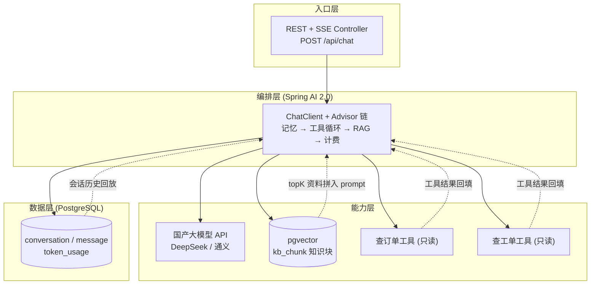
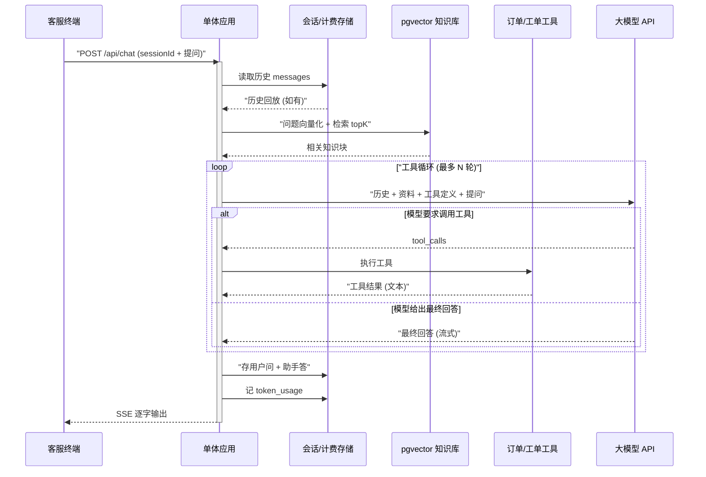
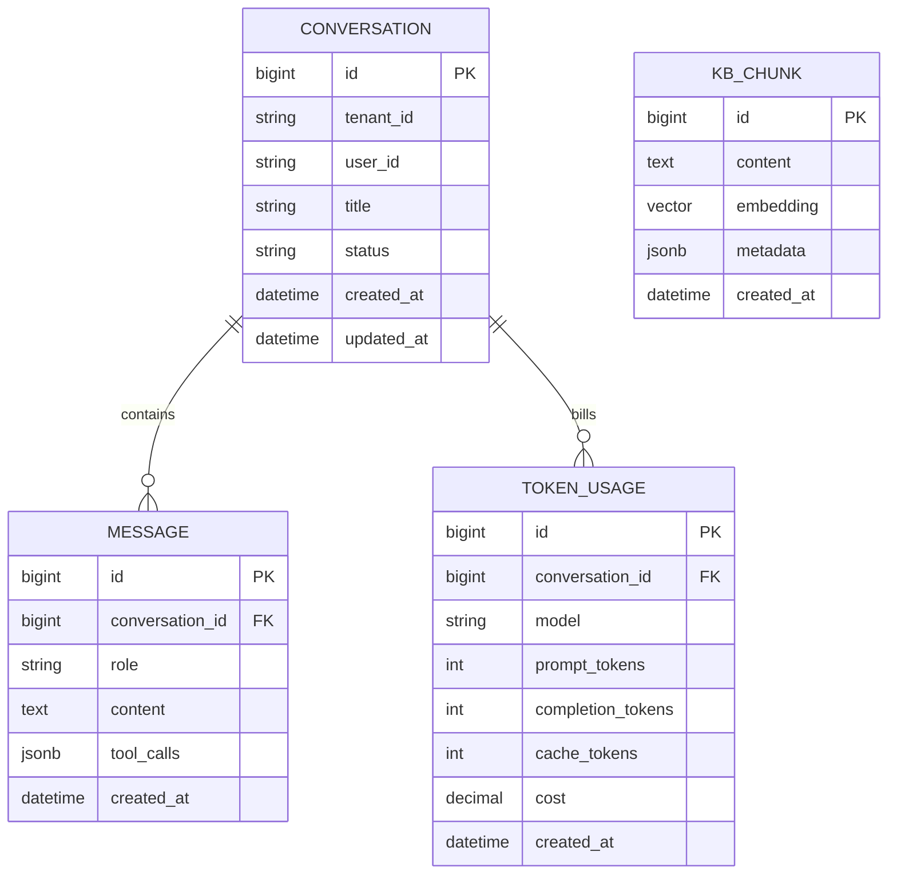
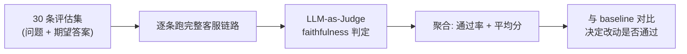
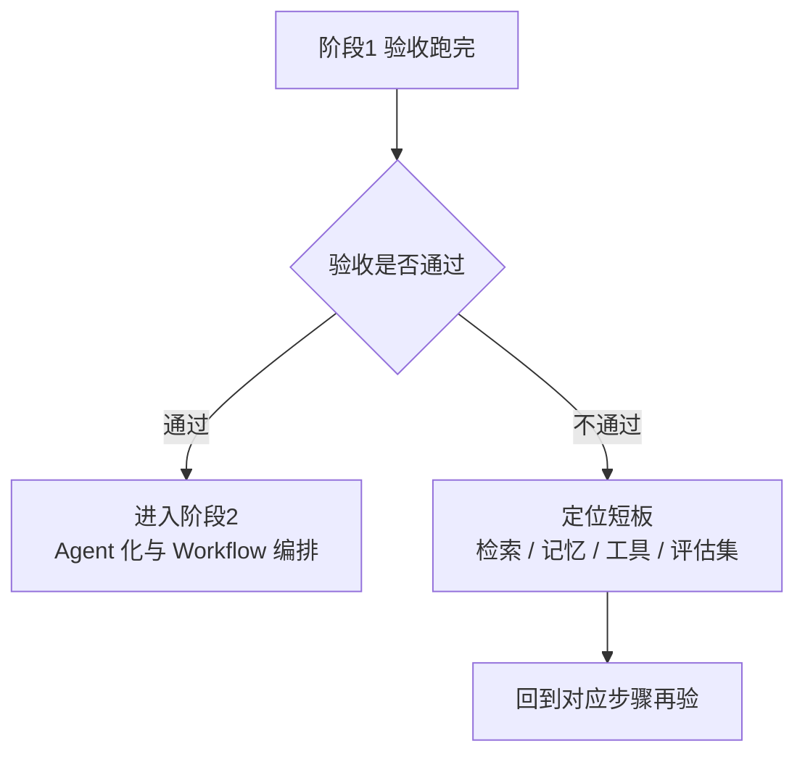

# 企业级多租户智能客服 Agent 平台 · 阶段 1：单体 MVP（Monolith）

> **承接上一阶段。** 阶段 0 用 1~2 周、可丢弃的 Spike 验证了「LLM + RAG + 工具调用」这条路**可行**，并留下一份评估集雏形（问题 + 期望答案 + 检索命中的资料块）。本阶段把这些验证过的结论固化成**正式单体**：用 Spring Boot 4 + Spring AI 2.0 + pgvector 搭一个应用，把"流式对话 → 知识库问答 → 订单/工单查询 → 会话持久化 → token 计费 → 评估基线"六件事一次跑通，预计 **3~5 周**。
>
> 阅读前置：`00-README.md` → `01-方向调研与选型.md` → `02-阶段0-可行性验证.md` → **本文（阶段1）**。
>
> 一句话：**把"能答 + 能查"验证过的三条路，组装成一个能演示、能持久、能记数、能评估的完整客服单体。**

---

## 0. 一句话

> 一个 **Spring Boot 单体应用**跑通完整客服闭环：**REST + SSE 流式**逐字回答、**RAG** 查企业知识库（带引用溯源、会拒答）、**2 个只读工具**（查订单 / 查工单）、**会话持久化**（重启不丢）、**基础 token 计费**（每轮有记录），最后用 **30 条评估集** 跑出 faithfulness 基线——为阶段 2 的 Agent 化与 Workflow 升级提供"可对比的地基"。

---

## 1. 本阶段目标

### 1.1 阶段定位：为什么是"单体"

- **单体优先（Monolith first）**：一次请求的全部逻辑都在**一个进程、一份代码、一个库**里，没有网络调用、没有分布式排错，最适合初学者第一次把"完整客服闭环"串起来。依据：`理论/09-企业级Java-AI架构选型真相`"80% 场景用确定性 DAG / 单体"，以及"Workflow > Agent"——先别急着拆服务、上编排框架。
- **能力合并但分层加**：README 路线图里的"阶段1·对话闭环 → 阶段2·知识库 → 阶段3·智能体"三段能力，本阶段**合并进一个 MVP**（RAG 与工具在阶段 0 已验证可行，不必再各拆一个阶段）；实现上仍按"记忆 → 检索 → 工具 → 计费 → 评估"五条垂直切片**逐步长出来**，每加一块立刻验证。
- **每一块都有知识来源**：全库每条能力都有对应教程，做完这一阶段 = 亲手把 `教程/01`、`04`、`09`、`02`、`25`、`12`、`15` 串成一条能跑的链。

### 1.2 五个硬目标（全部做完才算完成）

| # | 目标 | 交付物（可验证） | 知识来源 |
|---|---|---|---|
| 1 | **流式对话闭环** | REST 接口 + SSE，curl 能看到逐字输出 | 教程/01 §2.3、教程/04 Part A/B |
| 2 | **会话持久化** | 多轮记忆、同一 sessionId 上下文连贯、**应用重启不丢** | 教程/25 §1.7/§2、教程/17 事件溯源 |
| 3 | **RAG 知识库问答** | 10 条知识库问题能答且**带来源标注**；资料外问题正确拒答 | 教程/09 第1/2/3/7章 |
| 4 | **工具调用** | 查订单 / 查工单，10 条提问工具调用成功 ≥80% | 教程/02 §0A/§0B/§3 |
| 5 | **计费与评估基线** | `token_usage` 表有记录；30 条评估集跑出 faithfulness 通过率基线 | 教程/15 §6.2、教程/12 §4/§5 |

### 1.3 本阶段明确不做（边界）

- 不做**多租户隔离 / 租户权限 / 租户计费**（那是阶段 4）——但表结构先留 `tenant_id` 列，阶段 4 直接受益。
- 不做**复杂 Workflow 编排 / 多 Agent 派工 / 路由 Agent**（阶段 2/3）——本阶段就是"一个 ChatClient 跑到底"。
- 不做 **MCP 跨进程接入**工单/CRM（阶段 3）——本阶段工具是进程内 `@Tool` + stub 数据。
- 不做**多模型路由 / LLM Gateway / 模型 fallback**（阶段 4）。
- 不做**高级检索**（HyDE / Multi-Query / Graph RAG / Cross-encoder）——评估基线跑出来后阶段 2 再按数据说话地优化。
- 不做**高可用 / 部署 / CICD / 完整前端**（阶段 5 / 演示用 curl 或极简静态页即可）。
- 不做"一次性把代码写完美"——先能跑、能验、能演示，再谈整洁。

---

## 2. 前置知识（先读这些再动手）

> 主篇先读，其余按需。引用约定：`教程/NN-标题` 指 `docs/教程/NN-标题.md`，`理论/NN-标题` 指 `docs/理论/NN-标题.md`。

| 资料 | 必读/选读 | 读哪几节、读来干嘛 |
|---|---|---|
| **教程/01-2.0基础重塑** | 必读 | §2.1~2.3（版本与依赖：**流式必须 webflux**）、§3（ChatClient API）、§5（Advisor 链与内置优先级表，决定"记忆→工具→检索"的顺序：记忆 MIN+200 最外、工具 MIN+300、RAG MIN+700 最内）、§6（最小可运行 demo，照抄工程骨架） |
| **教程/04-流式响应与Reactor深度** | 必读 | 铺垫1~2（为什么流式 + SSE 协议）、A.2（SSE Controller 写法）、Part B（流式 + 工具：**只有最终自然语言回答会流式**）、C.2（流式下 conversationId NPE 这个坑）、Part E（ChatClientMessageAggregator 旁路聚合取 usage） |
| **教程/09-RAG工程化实战** | 必读 | §0.1（四步管道心智模型）、第1章（最小 RAG 骨架）、第2章（PgVector + Redis 用 docker 起）、第3章（把文档切好）、第7章（引用溯源：让回答说"根据 [Doc3]"）、第8章（评估闭环） |
| **教程/02-Tool与AgentLoop** | 必读 | §0A（Tool 设计五条铁律 + 错误处理三策略 + 描述打磨）、§0B（Function Calling 协议 + 把错误喂回 LLM）、§3（@Tool 注解体系）、§4（ToolCallingManager 执行器） |
| **教程/25-Agent记忆架构** | 必读 | §1.4~1.7（ChatMemory 本质 + **多用户必须隔离 ChatMemoryStore**）、§2（短时记忆窗口、token-aware 窗口）、§3（情节记忆：跨会话历史）——会话持久化直接用它 |
| **教程/12-评估闭环与Prompt版本管理** | 必读 | §1（三件套：评估集 / LLM-as-Judge / 人工标注）、§3（指标三维度）、§4.2（**Faithfulness 评估 Prompt**，照抄）、§5（离线评估管道代码）、§6（Prompt 版本管理） |
| **教程/15-可观测性与成本治理** | 必读 | §2（Spring AI 内置可观测性）、§4（工具与检索血缘）、§6.2（**实时算钱**：用单价表估 cost）、§6.3（配额三层） |
| **教程/21-端到端案例** | 选读（方向感） | §8（事件溯源做会话持久化）、§9（评估闭环）——看"完整客服系统"终点长什么样 |
| **教程/23-Prompt工程深入** | 选读 | §1（Prompt 五要素）、§2（Few-shot）。步骤 3/4 的 system 约束写法参考 |
| **理论/09-企业级Java-AI架构选型真相** | 必读 | "Workflow > Agent"、单体优先的取舍——本阶段"为什么是单体"的依据 |
| **理论/01-心智模型与决策树** | 选读 | "LLM=RPC / SSE chunked transfer"——流式链路的心智底座 |
| **理论/11-LLMOps** | 选读 | 评估与观测的总纲，理解"为什么必须先有基线" |
| **理论/15-成本工程与PromptCache** | 选读 | 四层成本优化（L1 Prompt Cache / L2 Semantic Cache / L3 Model Routing / L4 Long Context）——本阶段只做"记账"这一层，先建心智 |

> 建议阅读顺序：教程/01 §2~§3（骨架 + ChatClient）→ 教程/04 铺垫 + Part A（流式）→ 教程/25 §1（记忆）→ 教程/09 第1/2章（RAG 落地）→ 教程/02 §0A/§0B（工具）→ 教程/12 §4.2（评估 Prompt）。动手时卡住再回头翻教程/15、教程/23。
>
> 没接触过 Reactor 的读者：步骤 1 直接上手 webflux 流式会有点懵，**先读 `附录/Reactor响应式编程`**（尤其"AI 流式核心模式"一章）再回来，理解 `Flux` 再写流式接口。

---

## 3. 架构设计

### 3.1 关键设计决策（先讲为什么）

1. **单体优先，能力垂直切片逐步加**：一个 Spring Boot 应用，按"骨架 → 记忆 → 检索 → 工具 → 计费 → 评估"六步长出来。理由：理论/09 单体优先；最少中间件、所有问题在进程内就能复现；阶段 0 已验证三条能力都通，本阶段的任务是**组装**而非**另起炉灶**。
2. **流式是默认路径，SSE 做传输**：客服体验必须"逐字输出"，否则用户感觉死机。Spring AI 2.0 的流式 API 必须跑在 **webflux** 上（教程/01 §2.3），Controller 返回 `Flux<ServerSentEvent<String>>`（教程/04 A.2）。SSE 就是 HTTP 的 `chunked` 响应，心智模型：一次请求 = 一条流（理论/01）。
3. **记忆 = Advisor + DB 存储**：`MessageChatMemoryAdvisor` 把"读历史 → 拼进 messages → 存回"全部接管，你只需实现一个 `ChatMemoryStore` 落到 PostgreSQL，**重启不丢**（教程/25 §1.7、§3）。窗口大小控制 context 上限（§2）。
4. **RAG = pgvector + QuestionAnswerAdvisor + 引用溯源**：阶段 0 已验证检索路径；本阶段给知识块加 `source` metadata，并让 prompt 要求"根据 [Doc3] 引用"（教程/09 第7章），回答可追溯、可审计。
5. **工具 = 2.0 原生 ToolCallingAdvisor**：不写自研 while 循环（教程/01 §4）。只做**只读**工具（查订单/查工单），数据用内存 stub；**失败也返回文本而不是抛异常**——"失败要被 LLM 看到"（教程/02 §0A、理论/12）。
6. **计费 = 应用内记账，不接网关**：每次 LLM 调用结束后把响应里的 `usage` 落 `token_usage` 表，cost 用单价表估算（教程/15 §6.2）。MVP 先记"这轮花了多少"，精确分租户/分功能计费是阶段 4。
7. **评估驱动**：把阶段 0 的评估集雏形扩到 **30 条**，用 LLM-as-Judge 跑 faithfulness，存一份 `baseline` 报告。**没有评估集的改动都是玄学**（教程/12）——本阶段最后的数字就是阶段 2 优化的对照盘。

### 3.2 单体架构图（mermaid）



> 读图：你（客服终端）提问 → 编排层（ChatClient + Advisor 链）决定这条问题需要什么——**直答**就走大模型、**需要资料**就查 pgvector 把 top-k 资料拼进 prompt、**需要查单/查工单**就调工具并把结果回填——三条路最终都汇给大模型生成回答。图中虚线是"回填"路径：**模型不是凭空回答，是带着小抄回答**（这是 RAG 与 Agent 循环的本质，阶段 0 已建立的心智模型）。单体内所有箭头都在一个进程里完成。

### 3.3 一次请求的完整时序（mermaid）

> 这是本阶段最重要的心智模型图：**一轮客服对话，在单体里到底发生了什么。**



> 注意两点：① 记忆的"读历史 / 存回"由 `MessageChatMemoryAdvisor` 自动做，你只在请求里带上 `sessionId`；② **工具轮次不流式**——模型先内部决策要不要调工具，工具轮次走完，才轮到最终自然语言回答逐字流出来（教程/04 铺垫4、Part B）。所以用户看到的效果是：点发送 → 停一小会儿 → 开始逐字输出。

### 3.4 数据模型（mermaid ER）



| 表 | 用途 | 说明 |
|---|---|---|
| `conversation` | 会话 | 一个 sessionId 一条；`tenant_id` 先写死一个值（如 `"demo"`），阶段 4 启用多租户 |
| `message` | 消息 | `role`（user/assistant/tool）、`content`、`tool_calls`（工具调用 JSON，便于审计） |
| `kb_chunk` | 知识块 | Spring AI PgVectorStore 列结构：`content`（切块文本）、`embedding`（向量）、`metadata`（jsonb：`source` 来源文档引用溯源、`tenant_id` 多租户等） |
| `token_usage` | token 计费 | 每次 LLM 调用一行：输入/输出 token、cost 估算（单价表在代码里） |

### 3.5 关键组件说明

| 组件 | 本阶段角色 | 说明 |
|---|---|---|
| **REST + SSE Controller** | 入口 | `POST /api/chat` 收 `sessionId + 提问`，返回 `Flux<ServerSentEvent<String>>` 逐字吐回答 |
| **ChatClient** | 编排入口 | Spring AI 2.0 统一问答 API，负责"组装 messages → 调模型 → 拿结果/流"（教程/01 §3） |
| **MessageChatMemoryAdvisor** | 记忆 | 自动读历史/拼进请求/存回；配合 DB 版 `ChatMemoryStore` 实现重启不丢（教程/25 §1.7） |
| **QuestionAnswerAdvisor** | RAG | 自动"检索 top-k → 拼 prompt → 回答"，加 `source` 引用约束（教程/09 第1/7章） |
| **ToolCallingAdvisor + ToolCallingManager** | 工具循环 | 模型说"要调工具"时执行并把结果回填，直到给出最终回答（教程/01 §4、教程/02） |
| **查订单 / 查工单工具** | 只读工具 | 两个 `@Tool` 方法，内存 stub 数据，失败返回文本（教程/02 §0A） |
| **UsageRecordingAdvisor / Service 层记账** | 计费 | 每次 LLM 调用取 `usage` 写 `token_usage`（教程/15 §6.2） |
| **国产大模型 API** | 生成 | DeepSeek / 通义任一，配置进 `spring.ai.openai.*`（`api-key / base-url / chat.options.model`） |
| **pgvector** | 存储 | Spring AI PgVectorStore 落库（`table-name: kb_chunk`，列 `content / metadata / embedding`），`<=>` 余弦距离检索；业务表同库 |

---

## 4. 分步实现（每步：做什么 + 验证什么）

> 每步给出**关键片段**（不是最终完整代码），完整代码参考对应教程。**做完一步立刻验证一步，别攒到最后**。建议节奏（3~5 周）：步骤1+2 约 1 周，步骤3 约 1~1.5 周，步骤4 约 0.5~1 周，步骤5 约 0.5 周，步骤6 约 1 周。

### 步骤 1：工程骨架 + SSE 流式对话（约 3~4 天）

**做什么：**
1. 用 Spring Boot 4（`spring-boot-starter-webflux`）建工程，加 Spring AI 2.0 依赖。**流式必须 webflux**，用 servlet 会拿不到流（教程/01 §2.3）。

```xml
<dependency>
    <groupId>org.springframework.boot</groupId>
    <artifactId>spring-boot-starter-webflux</artifactId>
</dependency>
<dependency>
    <groupId>org.springframework.ai</groupId>
    <artifactId>spring-ai-advisors-spring-boot-starter</artifactId> <!-- 记忆/工具等 Advisor -->
</dependency>
<dependency>
    <groupId>org.springframework.ai</groupId>
    <artifactId>spring-ai-starter-model-openai</artifactId>         <!-- 或国产模型各自的 starter -->
</dependency>
<!-- 步骤 3 再加：spring-ai-starter-vector-store-pgvector -->
```

2. 配置模型（键名以 教程/01 §2、教程/09 §2.4 为准）：

```yaml
# 键名以 教程/01 §2、教程/09 §2.4 为准（具体以所用 Spring AI 版本官方文档为准）
spring:
  ai:
    openai:
      api-key: ${OPENAI_API_KEY}
      base-url: ${LLM_BASE_URL}     # 国产模型的 openai 兼容端点
      chat:
        options:
          model: ${LLM_MODEL}
```

3. 装配 `ChatClient` Bean：模型 starter 会自动装配 `ChatClient.Builder`，用 Builder 生成 `ChatClient`（教程/01 §6.3），后续 Controller / Service 直接注入这个 Bean：

```java
@Configuration
public class ChatConfig {
    @Bean
    ChatClient chatClient(ChatClient.Builder builder) {   // ChatClient.Builder 由 starter 自动装配
        return builder.build();
    }
}
```

4. 写一个最薄的流式接口：`POST /api/chat`，入参 `{ sessionId, message }`，返回 SSE 流。

```java
@RestController
public class ChatController {

    private final ChatClient chatClient;

    public ChatController(ChatClient chatClient) { this.chatClient = chatClient; }

    @PostMapping("/api/chat")
    public Flux<ServerSentEvent<String>> chat(@RequestBody ChatRequest req) {
        return chatClient.prompt(req.message())
                .stream()                     // 流式
                .content()                    // Flux<String>：逐 token 吐
                .map(t -> ServerSentEvent.builder(t).build());
    }
}
```

5. 启动后用 curl 验证流式（`-N` 是关键，否则 curl 会缓冲一整包再打印）。

```bash
mvn spring-boot:run
# 另开一个终端：
curl -N -X POST http://localhost:8080/api/chat \
  -H 'Content-Type: application/json' \
  -d '{"sessionId":"demo-001","message":"你好，介绍一下你自己"}'
# 期望：回答内容逐字、连续地打印出来（不是一次性整段出现）
```

**验证什么：**
- [ ] curl 看到**逐字输出**（回答内容分多次到达），而不是一次性整段。
- [ ] 换个问题回答不同；同一个 sessionId 连问两次，能看出"模型不记得上一轮"（无记忆——这正是步骤 2 要做的事）。
- [ ] 指着请求链路能说出：SSE = HTTP chunked 响应，一次请求一条流（心智模型：LLM=RPC，响应是流来的，教程/04 铺垫2）。

### 步骤 2：会话持久化（约 3~4 天）

**做什么：**
1. 建 `conversation` / `message` 两张表（见 §3.4 DDL）。
2. 实现一个 **DB 版 `ChatMemoryStore`**，把记忆落 PostgreSQL——这样**应用重启不丢**。接口核心就三个方法（签名以你当前 Spring AI 2.0.x 为准，教程/25 §1.7）：

```java
@Component
public class JdbcChatMemoryStore implements ChatMemoryStore {
    private final JdbcTemplate jdbc;

    @Override
    public void addMessage(String conversationId, Message message) {
        // 2.0 用 getMessageType()（不再是 1.0 的 getRole()）；getValue() 返回 "user"/"assistant" 等
        jdbc.update("INSERT INTO message(conversation_id, role, content) VALUES (?,?,?)",
                conversationId, message.getMessageType().getValue(), message.getText());
    }

    @Override
    public List<Message> getMessagesByConversationId(String conversationId) {
        return jdbc.query(
            "SELECT role, content FROM message WHERE conversation_id=? ORDER BY created_at ASC",
            (rs, i) -> {
                String type = rs.getString("role");
                String content = rs.getString("content");
                // MVP 简化：只还原 USER / ASSISTANT；tool/system 完整映射见下方说明
                return MessageType.USER.getValue().equals(type)
                        ? new UserMessage(content)
                        : new AssistantMessage(content);
            },
            conversationId);
    }

    @Override
    public void deleteMessageByConversationId(String conversationId) {
        jdbc.update("DELETE FROM message WHERE conversation_id=?", conversationId);
    }
}
```

> **MVP 简化说明**：上面只还原 `USER` / `ASSISTANT` 两类。若会话里混入 `SYSTEM`（system 约束）或 `TOOL`（工具调用轮次）消息，回放时必须按 `MessageType` 映射回 `SystemMessage` / `ToolMessage`，否则模型上下文会缺角色类型信息（依据：教程/25 §1.7）。

3. 把记忆挂进 Advisor 链，并设窗口大小（防 context 爆）:

```java
// 2.0 用 builder 写法（方法名以你所用 2.0.x 版本为准，教程/25 §2.1）
ChatMemory chatMemory = MessageWindowChatMemory.builder()
        .chatMemoryStore(jdbcChatMemoryStore)   // 用 DB store → 重启不丢
        .maxMessages(10)                        // 窗口：最近 10 条
        .build();

ChatClient chatClient = ChatClient.builder(chatModel)
        .defaultAdvisors(new MessageChatMemoryAdvisor(chatMemory))
        .build();
```

> 多用户隔离雏形：`ChatMemoryStore` 按 `conversationId` 存，天然把不同 session 的对话隔开；真·多用户/多租户隔离（用户间不可见、权限收敛）看 教程/25 §1.7。上面的 `jdbcChatMemoryStore` 是步骤 2 实现的 `JdbcChatMemoryStore` Bean。

4. 在 Controller 里把 `sessionId` 传给记忆（传参方式以 教程/25 §2、教程/04 C.2 为准——**流式下不传会 NPE**）：

```java
chatClient.prompt(req.message())
        .advisors(a -> a.param(ChatMemory.CONVERSATION_ID, req.sessionId()))
        .stream().content() ...
```

**验证什么：**
- [ ] 同一 sessionId 连问三轮，模型记得前面说的（"我刚才说想退款，你还记得吗"）。
- [ ] **重启应用**，再用同一 sessionId 继续问，前面内容不丢（关键验收）。
- [ ] 不同 sessionId 之间互不串记忆（教程/25 §1.7"多用户必须隔离"的雏形）。

### 步骤 3：RAG 知识库问答（约 1~1.5 周，本阶段大头）

**做什么：**
1. 准备数据：复用阶段 0 的 FAQ（10~20 篇：退货、保修、物流、发票、会员……），每篇带标题，便于按标题切块。至少留 3 条"资料外"问题测拒答。
2. 起 pgvector（docker，教程/09 第2章）。**表不用手写建**——`spring-ai-starter-vector-store-pgvector` 启动时自动注入 `PgVectorStore` Bean 并建表（`initialize-schema: true`）。注意其列结构是 `content / metadata / embedding`（不是手写的 `chunk_text / tenant_id`）；要沿用 `kb_chunk` 表名就在 yaml 显式指定，否则默认建表叫 `vector_store`。同时补上 **embedding 模型配置**（步骤 1 只配了 chat 模型，RAG 还需要 embedding）：

```yaml
spring:
  ai:
    vectorstore:
      pgvector:
        table-name: kb_chunk          # 默认 vector_store；这里沿用知识块表名
        initialize-schema: true        # 启动自动建表/索引；生产建议 false，DBA 管（教程/09 §2.4）
        dimensions: 1024               # 必须与 embedding 模型输出维度一致，否则 dimension mismatch
    openai:
      embedding:
        options:
          model: ${OPENAI_EMBEDDING_MODEL:text-embedding-3-small}   # 或国产中文友好模型，如 bge-m3
```

> 若真要手写建表，先 `CREATE EXTENSION IF NOT EXISTS vector;`，再按 `content / metadata / embedding` 建 `kb_chunk`（与 Spring AI PgVectorStore 期望的列名一致），`tenant_id` 存进 `metadata` 列。
3. **摄入**：把 FAQ 切块（每块约 300~800 字，按"### 标题"切）→ 向量化 → 写库，**每块带上 `source` metadata**（引用溯源全靠它）：

```java
vectorStore.add(List.of(
    new Document("退货政策：支持 7 天无理由退货……",
        Map.of("source", "FAQ/退货政策.md")),
    new Document("物流：下单后 48 小时内发货……",
        Map.of("source", "FAQ/物流.md"))
));
```

4. **问答**：`QuestionAnswerAdvisor` 自动完成"检索 top-k → 拼 prompt → 回答"：

```java
QuestionAnswerAdvisor ragAdvisor = QuestionAnswerAdvisor.builder(vectorStore)
        .topK(4)     // 阶段 0 验证过的取值，先不动
        .build();
```

5. 加 system 约束：**只根据资料回答 + 要求引用来源 + 资料外拒答**（教程/09 第7章、教程/23 §1）：

```java
.defaultSystem("""
    你是一名企业客服。只能根据下面的【资料】回答，并标注信息来源（如"根据 [FAQ/退货政策.md]"）。
    资料里没有的内容，回答"资料未覆盖，请转人工"，不要编造。
    【资料】
    {context}
    """)
```

6. 把步骤 1 的 `Flux<String>` 改成返回 `ServerSentEvent<String>` 并带上引用（保持流式体验不变）。

**验证什么：**
- [ ] 10 条知识库问题全部能答，且回答**带来源标注**（能点出"根据 [FAQ/退货政策.md]"）。
- [ ] 3 条资料外问题全部**拒答/转人工**，不瞎编。
- [ ] 手写一条 SQL（`SELECT content, 1-(embedding<=>:q) AS sim FROM kb_chunk ORDER BY sim DESC LIMIT 3`——列名是 `content` 不是 `chunk_text`）能看到"这次回答引用了哪几块"——调错时定位用（教程/09 第1章"检索命中"心智）。
- [ ] 把"问题 + 期望答案 + 实际回答 + 命中的资料块"存进评估集（这是步骤 6 的素材，教程/12 §1.3）。

### 步骤 4：工具调用——查订单 / 查工单（约 3~5 天）

**做什么：**
1. 定义两个**只读**工具，数据用内存 stub（不接真实系统）。**关键：失败也返回文本，不抛异常**——"失败要被 LLM 看到"（教程/02 §0A、理论/12）。

```java
@Component
public class SupportTools {

    private final Map<String, String> orders = Map.of(
        "SO2024001", "已发货",
        "SO2024002", "已签收");
    private final Map<String, String> tickets = Map.of(
        "TK1001", "处理中：已分派给售后专员");

    @Tool(description = "查询订单当前状态。客户问'订单到哪了/催单/问进度'时调用。")
    public String queryOrderStatus(@ToolParam(description = "客户提供的订单号") String orderNo) {
        return orders.getOrDefault(orderNo, "未找到订单 " + orderNo + "，请客户核对订单号");
    }

    @Tool(description = "查询客户工单的处理进度。客户问'我的工单怎么样了'时调用。")
    public String queryTicketStatus(@ToolParam(description = "客户提供的工单号") String ticketNo) {
        return tickets.getOrDefault(ticketNo, "未找到工单 " + ticketNo + "，请客户核对工单号");
    }
}
```

2. 注册工具并注意 **Advisor 顺序**（见教程/01 §5.3 优先级表）：内置优先级决定执行顺序是 **记忆（MIN+200）→ 工具（MIN+300）→ RAG（MIN+700）**，即"**记忆 → 工具循环 → RAG**"。RAG 在**最内层**，意思是**每次 LLM 调用（含工具轮次）之前**都会把检索到的资料注入 prompt——模型在判断"要不要调工具"时也看得到资料，工具结果回来后同样带着资料组织最终回答。**不要手动 `new ToolCallingAdvisor`**——2.0 它在 ChatClient 构造时默认自动注册（优先级 MIN+300），用 `.defaultTools()` 注册工具对象即可：

```java
ChatClient chatClient = ChatClient.builder(chatModel)
        .defaultAdvisors(
            new MessageChatMemoryAdvisor(chatMemory),                    // 记忆 MIN+200（最外）
            QuestionAnswerAdvisor.builder(vectorStore).topK(4).build()   // RAG MIN+700（最内）
        )
        .defaultTools(new SupportTools())   // 工具循环由自动注册的 ToolCallingAdvisor（MIN+300）接管
        .build();
```

3. 保持流式。**注意：工具轮次不流式**，只有最终自然语言回答会逐字流出（教程/04 Part B）——用户侧看到"发送后停一下再开始逐字输出"是正常的。

**验证什么：**
- [ ] 10 条"需要查单/查工单"的提问（如"订单 SO2024001 到哪了"、"工单 TK1001 处理得怎么样了"），工具调用成功 **≥ 8 次（≥80%）**。
- [ ] 回答**基于工具返回的事实**（出现"已发货 / 已分派给售后专员"），不编造。
- [ ] 查询不存在的单号/工单号时，模型能转述"未找到，请核对"，而不是假装查到。
- [ ] 能演示"先查工具、再组织自然语言回答"的过程（看 Advisor 日志/断言 tool 被调用）。

### 步骤 5：token 计费记录（约 2~3 天）

**做什么：**
1. 建 `token_usage` 表（见 §3.4）。定义一份**单价表**（DeepSeek/通义官网的输入/输出每千 token 价格），用来把 token 数折算成 cost（教程/15 §6.2"实时算钱"）。
2. 每次 LLM 调用后，从响应 `usage` 里取 `prompt_tokens / completion_tokens`，连同 `model / conversation_id / cost` 写一行。

```java
// 非流式路径（工具/拒答等不流式的调用）：response 自带 usage
ChatClient.CallResponse resp = chatClient.prompt(...).call();
var usage = resp.metadata().usage();
tokenUsageRepo.save(
    sessionId, model,
    usage.promptTokens(), usage.completionTokens(),
    priceTable.estimate(usage)   // 单价表折算 cost
);
```

3. **流式路径**用 `ChatClientMessageAggregator` 旁路聚合完整消息后再取 usage（教程/04 Part E）——流式下 usage 在流结束时才有。

```java
// 用 aggregator 旁路聚合（不阻塞主流），聚合出完整消息后再取 usage 统一记一笔，MVP 够用
// 写法以你所用 2.0.x 版本为准（教程/04 Part E.2）
Flux<ChatClientResponse> flux = chatClient.prompt(...).stream().chatClientResponse();

new ChatClientMessageAggregator().aggregateChatClientResponse(flux, aggregated -> {
    var usage = aggregated.chatResponse().getMetadata().getUsage();
    tokenUsageRepo.save(sessionId, model, usage.promptTokens(), usage.completionTokens(),
            priceTable.estimate(usage));   // 单价表折算 cost
});

return flux;   // 主流仍把每个 chunk 逐字流给前端
```

> 说明：工具轮次会产生多次 LLM 调用，每次都有 usage。阶段 1 先**按"一轮对话"聚合记一笔**，满足"token 有记录"即可；精确到每次调用、按功能/租户分账是阶段 4 成本治理的事（教程/15 §6.3、理论/15）。

**验证什么：**
- [ ] `token_usage` 表有本次演示的完整记录：能查出"这一轮 prompt 多少、completion 多少、估算多少钱"。
- [ ] 同一会话多轮，能按 `conversation_id` 把整个会话的花费累加出来。
- [ ] 换不同长度的问题，token 数随之变化（证明记的是真实用量，不是死数）。

### 步骤 6：30 条评估集 + faithfulness 基线（约 1 周）

**做什么：**

> 评估驱动的闭环长这样（本步骤建立的是第一圈）：



1. 把阶段 0 的评估集雏形扩到 **30 条**，混合三类：知识库问答（含拒答边界）、工具调用（查订单/工单）、多轮对话。格式参考 教程/12 §5.1：

```yaml
# src/main/resources/eval/dataset-stage1.yaml
- id: kb-001
  question: "你们的退货政策是什么？"
  expected_context: "FAQ/退货政策.md"
  expected_answer: "支持 7 天无理由退货"
- id: tool-001
  question: "帮我查一下订单 SO2024001 到哪了"
  expected_tool: "queryOrderStatus"
  expected_answer: "已发货"
- id: edge-003
  question: "你们收购了哪家公司？"   # 资料外，期望拒答
  expected_answer: "拒答/转人工"
```

2. 写 LLM-as-Judge，用 **faithfulness** 判定"回答是否忠于给定资料/工具结果"。照抄 教程/12 §4.2 的 Faithfulness Prompt，再叠加你自己的规则（资料外 → 拒答算对）：

```java
@Test
@Tag("eval")
void faithfulnessBaseline() {
    EvalResult r = evalRunner.run(dataset());   // 遍历 30 条 → 跑客服链路 → Judge 打分
    double passRate = r.faithfulnessPassRate(); // 通过率 = 得分≥0.7 的比例
    saveBaseline("reports/baseline-stage1.yml", r); // 存档，阶段2 对比用
    assertThat(passRate).isGreaterThan(0.5);    // 第一次跑出的是"基线"，先记录不追求高
}
```

3. Judge 用**与主模型不同**的模型，降低"自己夸自己"的偏差；同一条问题复跑多次取均值，防抖动（教程/12 §4.3）。

**验证什么：**
- [ ] 30 条评估集**全部能自动跑**（不是人工逐条点）。
- [ ] 跑出 **faithfulness 通过率基线**（如实记录数字，高或低都不丢人，它就是阶段 2 的对照盘）。
- [ ] `reports/baseline-stage1.yml` 已存档并提交（教程/12 §8"对比基线"）。
- [ ] 能对着基线说出：哪几类问题答得好、哪几类拖后腿（如"工具类通过率高，知识库边界类偏低"）——这就是阶段 2 的优化清单。

---

## 5. 验收标准（可勾选、可量化）

> 全部打勾才算本阶段完成。数字口径：30 条评估集（含 10 条知识库 + 10 条工具 + 边界/多轮 10 条）。

- [ ] **流式闭环**：`curl -N POST /api/chat` 能看到逐字输出；接口正确接收 `sessionId`。
- [ ] **会话持久化**：同一 sessionId 多轮上下文连贯；**重启应用后继续对话不丢**（"我刚才问了什么"能答出）；不同 sessionId 记忆互不串。
- [ ] **RAG 问答**：10 条知识库问题全部能答且**带来源标注**；3 条资料外问题全部**拒答/转人工**、不瞎编。
- [ ] **工具调用**：10 条"查订单/查工单"提问中，工具调用成功 **≥ 8 次（≥80%）**，回答基于工具返回事实；不存在单号/工单号能转述"未找到"。
- [ ] **token 计费**：`token_usage` 表有本次演示的完整记录（prompt / completion / cost），能按会话累加。
- [ ] **评估基线**：30 条评估集自动跑出 faithfulness 通过率基线，`reports/baseline-stage1.yml` 已存档并提交。
- [ ] **演示路径完整**：从提问 → SSE 逐字输出 → 查单/查工单 → 重启恢复会话 → 查看 token 记录，一口气演示下来无卡点。

---

## 6. 演进触发（什么时候进下一阶段）



### 通过 → 进入阶段 2（Agent 化与 Workflow）

- 单体跑通 + 评估基线建立后，触发阶段 2：把"一个 ChatClient 跑到底"升级为 **确定性 Workflow 编排**（五大 Workflow 模式，教程/11）+ 引入更细的 Agent 化分层（路由决策、复杂工单派工，教程/10、教程/21）。**每次改动都要回到阶段 1 的 baseline 对比**——这就是评估驱动的闭环（教程/12 §8）。
- 阶段 1 的 30 条评估集、`token_usage`、会话存储，直接作为阶段 2 的输入资产。

### 不通过 → 在本阶段内迭代（不进阶段 2）

| 症状（验收哪条没过） | 可能原因 | 调整方向 |
|---|---|---|
| 评估通过率低 / 知识库答错 | 检索召回差 / prompt 约束弱 / 评估集期望没写清 | 一次只改一个变量（切块 → top-k → prompt → 模型），改完重跑评估集（教程/12、教程/09 第8章） |
| 会话重启后丢失 | 记忆没走 DB store | 确认用的是 `JdbcChatMemoryStore`，不是默认内存 store（教程/25 §1.7） |
| 工具经常不调用 | @Tool 描述不清 / Advisor 顺序错 | 打磨描述；对照 教程/01 §5.3 优先级表检查链顺序 |
| 工具调用失败率 >20% | 工具抛异常 / 返回格式模型看不懂 | 失败也返回文本；结果结构化（如 `订单号:状态` 一行一个） |
| 流式下 NPE / 不流式 | 缺 webflux / conversationId 没传 | 依赖确认 webflux；传 `CONVERSATION_ID`（教程/04 C.2） |
| 计费对不上 | 流式 usage 没取到 / 多次调用只记了一次 | 用 ChatClientMessageAggregator 聚合（教程/04 Part E） |

> 迭代原则同阶段 0：**一次只改一个变量**，改完重跑那几条失败问题 + 全量评估集，别同时改多个参数。

---

## 7. 本阶段踩坑与排错

| 现象 | 常见原因 | 排查 / 解决 |
|---|---|---|
| 接口不流式 / 一次性返回 | 用的是 servlet（tomcat）而非 webflux | 依赖必须是 `spring-boot-starter-webflux`（教程/01 §2.3） |
| 流式下报 `conversationId cannot be null` NPE | 记忆 Advisor 需要 conversationId，没传 | 请求里带 sessionId 并传给 `CONVERSATION_ID`（教程/04 C.2） |
| 流式下工具轮次也想要逐字 | 误解"流式 = 什么都流式" | **只有最终自然语言回答流式**，工具轮次先走完（教程/04 铺垫4） |
| 会话重启丢失 | 记忆用默认内存 store | 换 DB 版 `ChatMemoryStore`（教程/25 §1.7） |
| 重启后记忆还在但顺序乱 | 查询没排序 | `ORDER BY created_at ASC`（或自增 id） |
| 检索返回空 / 相似度全 0 | 没入库 / embedding 维度不匹配 | `SELECT count(*) FROM kb_chunk`；**入库与查询必须用同一 embedding 模型**（教程/09 第1章避坑） |
| 回答不引用来源 | 资料块没带 source metadata / prompt 没要求 | 摄入时加 `Map.of("source", ...)`；system 里写死"根据 [来源] 引用"（教程/09 第7章） |
| 资料外的问题硬答 | prompt 约束不够 / 检索到无关块 | 强化"只根据资料 + 拒答"；收紧 top-k |
| 工具不调用 / 乱调用 | @Tool 描述不清 | 打磨描述（何时用、参数含义、返回什么），对齐 教程/02 §0A |
| 工具抛异常把整轮搞崩 | 错误没转成文本 | 失败返回可读文本，不抛异常（教程/02 §0A、理论/12） |
| 流式下 usage 取不到 | 流结束时才有 usage | 用 `ChatClientMessageAggregator` 聚合后取（教程/04 Part E） |
| Judge 打分忽高忽低 | 模型/temperature 抖动 | 用与主模型不同的 Judge；同条复跑多次取均值（教程/12 §4.3） |
| 多轮后 context 超限 | 记忆窗口没设 / 历史无限累加 | `MessageWindowChatMemory` 设窗口；后续再看 token-aware 窗口（教程/25 §2） |
| `kb_chunk` 建表报错 / 中文乱码 | pgvector 扩展没装 / 编码问题 | `CREATE EXTENSION IF NOT EXISTS vector;`；文档存 UTF-8（沿用阶段 0 排错表） |

### 三个"工程心态"坑（比技术坑更常踩）

1. **别把"能跑"当"能交付"**：跑通流式只是步骤 1，完整演示路径要一直跑到步骤 6 才算完成；README 的验收锚点是"客服闭环可演示"。
2. **改动前先想评估**：步骤 6 之后，任何 Prompt / 检索 / 模型改动，都先跑一遍 30 条评估集再决定——**没有评估集的改动都是玄学**（教程/12）。
3. **别跳过单体的价值**：本阶段刻意不拆服务、不上编排框架；把"单体里一次请求全链路"看清了，阶段 2/4 拆分时才不会瞎拆（理论/09）。

---

> **知识来源汇总**：本阶段依据 `教程/01-2.0基础重塑`（骨架/Advisor 顺序）、`教程/04-流式响应与Reactor深度`（SSE/流式+工具坑/aggregator）、`教程/09-RAG工程化实战`（pgvector/切块/引用溯源/评估）、`教程/02-Tool与AgentLoop`（工具设计/错误处理）、`教程/25-Agent记忆架构`（ChatMemoryStore/窗口）、`教程/12-评估闭环与Prompt版本管理`（faithfulness/基线）、`教程/15-可观测性与成本治理`（usage 记账/单价）；理论侧依据 `理论/09-企业级Java-AI架构选型真相`（单体优先）、`理论/01-心智模型与决策树`（LLM=RPC/SSE）、`理论/11-LLMOps`（评估与观测总纲）、`理论/15-成本工程与PromptCache`（成本四层）、`理论/12-ClaudeCode源码启示录`（"失败要被 LLM 看到"）；终点图景参考 `教程/21-端到端案例`。
>
> 下一步：验收通过后进入 **阶段 2 · Agent 化与 Workflow 编排**（用确定性 DAG 替换"一个 ChatClient 跑到底"，并把阶段 1 的 faithfulness 基线作为每次改动的对照盘）。
