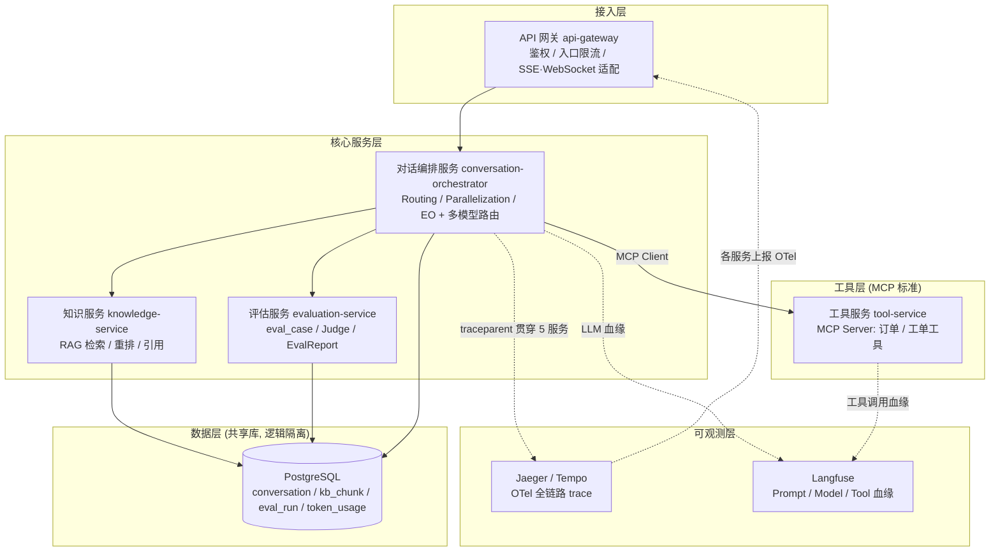
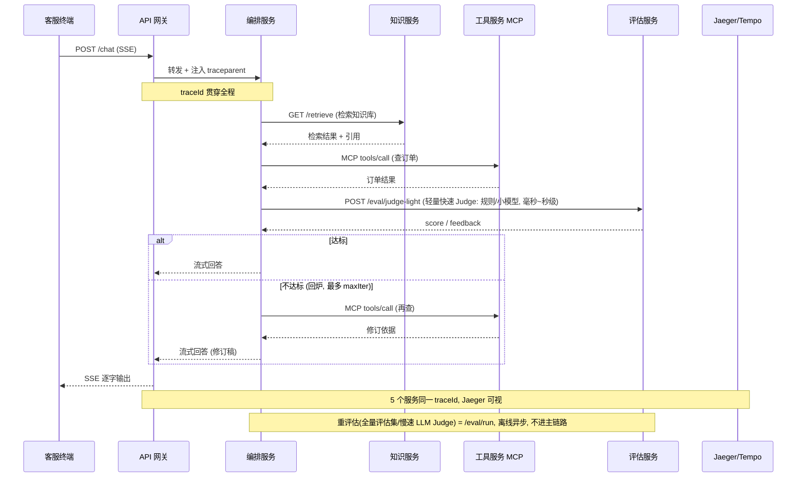
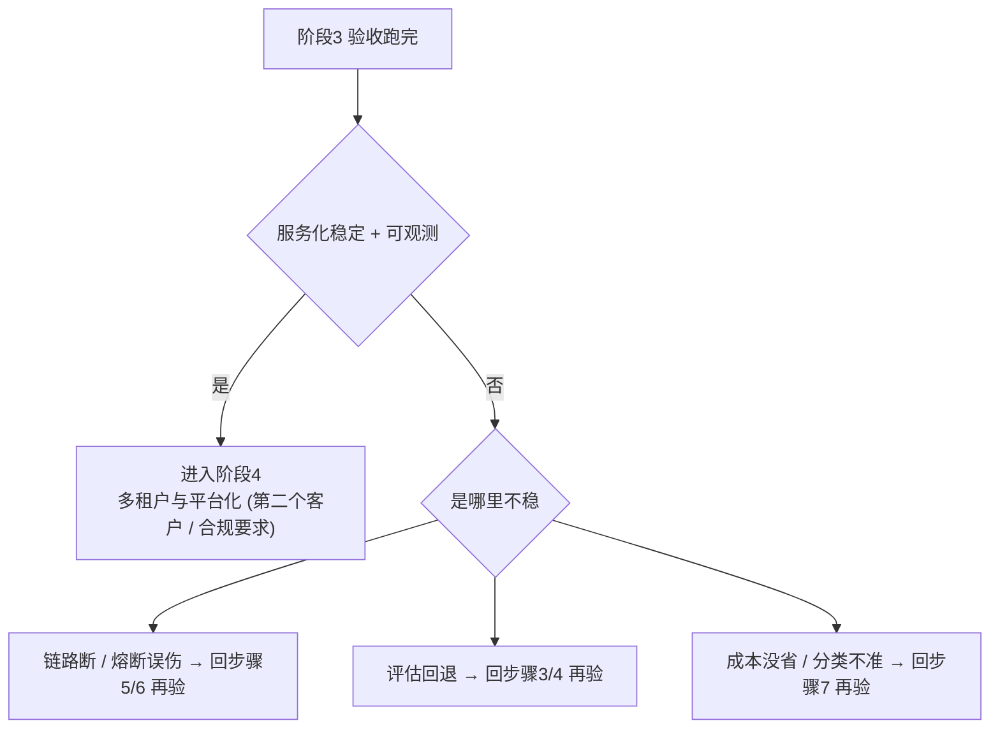

# 企业级多租户智能客服 Agent 平台 · 阶段 3：服务化拆分（Services）

> **承接上一阶段。** 阶段 2 在单体里把"固定流水线"升级成了 **Agent 编排**：Routing / Parallelization / Evaluator-Optimizer 三个 Workflow 落地，评估进 CI、faithfulness ≥0.8。但那是**一个 JVM 里的单体**——编排、RAG、工具、评估全挤在同一个进程，改一行都要整体重启、发布互相影响、想单独扩某个模块只能整体扩。本阶段按职责把单体拆成 **5 个可独立部署的服务**：API 网关 → 对话编排服务 → 知识服务(RAG) → 工具服务(MCP Server) → 评估服务，并把"进程内 `@Tool`"升级为 **MCP 标准跨进程工具**，同时立起全链路 trace、熔断/限流、多模型路由，预计 **5~7 周**。
>
> 阅读前置：`00-README.md` → `01-方向调研与选型.md` → `02-阶段0-可行性验证.md` → `03-阶段1-单体MVP.md` → `04-阶段2-Agent化与评估.md` → **本文（阶段3）**。
>
> 一句话：**从"一个进程里的多个 Service"升级为"5 个独立部署的服务"：工具用 MCP 标准暴露、服务间可独立扩缩、全链路可观测、下游挂了会熔断降级、简单问题走小模型省钱。**

---

## 0. 一句话

> 把阶段 2 的单体按职责拆成 **5 个服务**（API 网关 → 对话编排 → 知识服务 → 工具服务 MCP → 评估服务），每个可独立部署、独立扩缩；订单/工单工具以 **MCP Server** 标准暴露、编排服务用 **MCP Client** 跨进程消费；**全链路 trace** 贯穿 5 服务、**Resilience4j 熔断/限流**兜住服务间调用、**复杂度路由**让简单问题走小模型省钱——且阶段 2 的评估集回归通过率 **不回退**。

---

## 1. 本阶段目标

### 1.1 阶段定位：为什么是"服务化拆分"

- **拆分的理由 = 独立扩缩 / 独立发布 / 独立团队**，不是"看起来专业"（教程/19 §6.3"过早微服务"是反模式）。阶段 2 的单体"撑不住"了，具体是：**负载特性不同**（知识服务是 IO 密集型检索、评估服务是慢速 LLM Judge、对话编排是高频交互）、**变更频率不同**（工具对接业务系统、评估集经常变），挤在一起只能整体扩、整体发。拆开后每个服务可以按自己的节奏扩缩和发布。
- **工具天然是进程边界，且要用 MCP 标准**：阶段 2 的工具是进程内 `@Tool` + stub 数据。进程内 Tool 有天花板——工具和 Agent 同进程、同语言、同部署，对接真实订单/工单系统时既不能独立升级、也无法跨语言（教程/05 §1.1）。MCP 把"工具"做成**协议标准**：工具服务以 MCP Server 暴露，任何语言/任何 Agent 都能消费（理论/14 §3、§5）。
- **可观测是服务化的地基**：单体时代"看日志"够用；拆服务后一次请求要穿过 5 个进程，没有 trace 就变成"黑盒甩锅"。所以本阶段把 **OTel 全链路 trace + Langfuse LLM 血缘** 当成第一等公民，和代码一起写（教程/15 §2、教程/07 §1.7）。
- **可靠性和成本是服务化的产物**：服务间调用会失败（下游挂了、超时、超频），必须有熔断/限流/降级（教程/06 §9、理论/16 §2.3）；服务多了模型调用就多，必须有复杂度路由省钱（教程/16 §2.2）。
- 知识来源：`教程/05-MCP协议全解`、`教程/06-MCP-Server开发实战`、`教程/07-MCP-Server高阶与生态`（MCP 三部曲，工具服务主线）、`教程/15-可观测性与成本治理`（全链路观测主线）、`教程/16-多模型路由与国产化`（多模型路由主线）、`教程/17-AI原生系统设计`（分层 / 异步 / 可演进）、`教程/19-自研vs框架的边界`（拆分的边界与 ADR）、`理论/14-MCP协议与生态`（协议原理）。

### 1.2 五个硬目标（全部做完才算完成）

| # | 目标 | 交付物（可验证） | 知识来源 |
|---|---|---|---|
| 1 | **5 个服务可独立部署** | API 网关 / 对话编排 / 知识服务 / 工具服务 / 评估服务各为独立工程，改一个只重发布它 | 教程/17 §2/§8、教程/19 §6.3 |
| 2 | **MCP Server 暴露订单/工单工具** | 工具服务以 MCP Server 暴露工具，编排服务用 MCP Client 消费，端到端回答含工具结果 | 教程/05 §4/§7、教程/06 §2/§5、教程/07 §1 |
| 3 | **全链路 trace** | 一次跨服务请求在 Jaeger/Tempo 同一 trace 贯穿 5 服务；Langfuse 有 LLM 血缘 | 教程/15 §2/§3/§4、教程/07 §1.7 |
| 4 | **熔断/限流** | Resilience4j 熔断/超时/隔离/限流兜住服务间调用；下游挂了降级不崩 | 教程/06 §9、理论/16 §2.3 |
| 5 | **多模型路由** | 复杂度路由：简单问题走小模型、复杂走大模型；有路由前后成本对比 | 教程/16 §2/§3/§5 |

> 对应关系：目标 1 是"拆"，目标 2 是"工具怎么暴露"，目标 3~5 是"拆完必须有的三样能力"（可观测 / 可靠性 / 成本）。阶段 2 的 `workflow_log / eval_case / token_usage` 直接作为拆服务的**边界依据**（教程/10 §6 渐进式升级）。

### 1.3 本阶段明确不做（边界）

- 不做**多租户隔离 / 租户权限 / 租户计费**（阶段 4）——继续用写死的 `tenant_id`，但要把 `tenant_id / sessionId` 的**透传链路**打通（为阶段 4 铺路）。
- 不做**数据拆库**——5 个服务共享一个 PostgreSQL，按"表归属矩阵"逻辑隔离（每个服务只读自己的表）；拆库是阶段 4 多租户的事。
- 不做**完整 CICD 与生产部署 / K8s**（阶段 5）——本阶段 Docker Compose 一键起即可，扩缩用 `docker compose up --scale` 验证。
- 不做**独立 LLM Gateway 服务**——多模型路由先放在编排服务内做（复杂度路由），独立 LLM Gateway 是阶段 4 的演进位（教程/16 §4）。
- 不做**全部工具都改成 MCP Server**——进程内工具没必要包装成 MCP（理论/14 §8.2），本阶段只把**订单/工单这类跨系统工具**上 MCP。
- 不做**拆数据库事务 / 分布式事务框架**——用幂等 + 事件 + 补偿（理论/16 §3、教程/17 §4）。
- 不做"为拆而拆"——每个服务边界必须能从阶段 2 血缘/负载差异说出理由，说不出的先留在编排服务内（教程/19 §6.3）。

---

## 2. 前置知识（先读这些再动手）

> 主篇先读，其余按需。引用约定：`教程/NN-标题` 指 `docs/教程/NN-标题.md`，`理论/NN-标题` 指 `docs/理论/NN-标题.md`。

| 资料 | 必读/选读 | 读哪几节、读来干嘛 |
|---|---|---|
| **教程/05-MCP协议全解** | 必读（主线·消费方） | §1.1（**进程内 Tool 的天花板**——为什么拆工具服务）、§2（协议心智模型：三类能力 / 三种传输）、§4（5 分钟第一个 MCP Client：4.6 **注入 ChatClient**）、§5（三种传输对照：stdio / SSE / streamable HTTP）、§7（**ChatClient 调用 MCP 工具的完整时序**）、§9（**多租户上下文 ToolContext → McpMeta 透传**） |
| **教程/06-MCP-Server开发实战** | 必读（主线·生产方） | §1（三种实现风格）、§2（Hello World：2.5 第一个工具）、§3（**传输选择：WebMVC vs WebFlux**）、§4（Inspector 调试）、§5（四类能力：Tools / Resources / Prompts）、§8（**鉴权与多租户**：8.2 Bearer Token、8.3 从 SecurityContext 取身份）、§9（**限流/熔断/配额**：9.2 Resilience4j Bulkhead、9.3 RateLimiter）、§10（可观测：10.3 全链路 trace）、§11（**错误处理与失败传播**：返回 error result 让 LLM 看到） |
| **教程/07-MCP-Server高阶与生态** | 必读（主线·端到端） | §1（**端到端整合**：1.3 注入 ChatClient、1.5 两个进程跑通、1.6 多租户上下文透传端到端、1.7 **跨进程 trace**、1.9 报错速查）、§2（把任意 HTTP API 包装成 MCP Server）、§3（MCP Hub 注册发现，先了解即可） |
| **教程/15-可观测性与成本治理** | 必读（主线·可观测） | §2（Spring AI 内置可观测性：2.3 自动 Span、2.4 自定义 Span）、§3（**Prompt 血缘**）、§4（工具与检索血缘：4.1 工具调用 AOP）、§6（成本治理：6.2 实时算钱、6.3 配额三层）、§8（自建 vs 现成平台：8.2 集成 Langfuse）、§9（Grafana 三个层面板）、§11（避坑：11.1 采样率太低漏 trace） |
| **教程/16-多模型路由与国产化** | 必读（主线·多模型） | §1（为什么做多模型路由：成本差异数量级）、§2（**三种路由策略**：2.2 复杂度路由推荐）、§3（复杂度路由实现：3.1 复杂度分类器、3.2 路由表、3.3 **装配多个 ChatClient**）、§4（LLM Gateway：4.1 自建最小 Gateway——先了解，本阶段不做独立网关）、§5（Token 配额与计费：5.2 实时熔断）、§13（避坑） |
| **教程/17-AI原生系统设计** | 必读 | §2（**AI 应用分层架构**：2.2 领域 Agent 的边界、2.3 上帝 Agent 反模式）、§4（**异步优先**：4.2 何时用异步队列）、§5（最小可演进 demo：客服系统骨架）、§8（性能与可扩展性：8.2 横向扩展的难点）、§9（避坑：9.3 Agent 直接调数据库表） |
| **教程/19-自研vs框架的边界** | 必读 | §6（**反模式速查**：6.3 过早微服务！）、§7（自研的最小集合）、§4（**ADR 记录架构决策**：4.1 模板）、§5（经典选型决策：5.3 观测平台 ADR） |
| **教程/21-端到端案例** | 必读（方向感） | §5（**Order Agent：MCP Client + 工具**：5.1 MCP Server 端独立部署）——客服系统服务化的直接样板 |
| **理论/14-MCP协议与生态** | 必读 | §2（MCP 三大能力）、§3（Spring AI 2.0 的 MCP 支持：3.2 **注解式暴露**）、§5（为什么是最高 ROI）、§7（Java 工程师实战路线）、§8（**常见误区**：8.2 不是所有工具都改 MCP Server） |
| **理论/16-Agent可靠性工程Java视角** | 选读 | §2（**三层错误模型**：2.3 系统级 Resilience4j 熔断）、§3（**幂等性设计**）、§5（长时 Agent 状态管理） |
| **教程/13-测试工程化** | 选读 | §4（**契约测试**：4.1 WireMock 录制）——服务间接口契约用它锁住 |
| **教程/26-AI工程的SRE实践** | 选读 | §1（SLI/SLO：LLM 专属 SLI）、§7.1（上游 LLM 限流 429）——服务化后的可用性指标 |

> 建议阅读顺序：教程/19 §6.3（先懂"什么时候不该拆"）→ 教程/05 §1.1 + §4（懂"工具为什么要 MCP、Client 怎么消费"）→ 教程/06 §2 + §11（会写 MCP Server）→ 教程/07 §1（端到端两个进程跑通）→ 教程/15 §2/§3（trace + 血缘）→ 教程/16 §2/§3（多模型路由）→ 教程/17 §2/§4（分层与异步）。动手时卡住再回头翻 教程/06 §9（熔断限流）、教程/06 §8（鉴权）。

---

## 3. 架构设计

### 3.1 关键设计决策（先讲为什么）

1. **拆分边界 = 阶段 2 的模块边界 + 负载/变更差异，不发明新模块**：五个服务正好对应阶段 1~2 的职责——接入（网关）、编排（阶段 2 编排层）、知识（阶段 1 RAG）、工具（阶段 2 工具）、评估（阶段 2 评估）。用 `workflow_log` 血缘看"谁在调谁"确认边界（教程/10 §6 渐进式升级）。**没有独立扩缩需求的部分先不拆**（教程/19 §6.3）。**最小服务化降级路径**：如果一次拆 5 个太冒险，可以先只拆"工具服务（MCP Server）+ 编排服务"两个（工具是天然进程边界、必须先跨进程），知识/评估**先留在编排服务内**，等 MCP 跨进程跑通、再按负载差异逐个抽离——每拆一个就跑一次阶段 2 评估集回归，拆错了随时能收回去。
2. **工具最先拆，且用 MCP 标准暴露**：工具是天然的进程边界（要对接真实订单/工单系统、要独立升级、要被多语言/多 Agent 消费），最先拆、最独立。工具服务 = MCP Server（注解式暴露 `@McpTool` / `@McpToolParam`，教程/06 §1/§2、理论/14 §3.2），编排服务 = MCP Client 消费（教程/05 §4）。这比 HTTP 手写接口多了"协议标准 + 多租户上下文透传 + 工具发现/版本协商"（教程/05 §9、教程/07 §3）。
3. **评估服务独立成服务，且分"轻重两种口径"**：评估是"慢操作 + 供多服务复用 + 独立扩缩"——Judge 是独立 LLM 调用，可能几秒到几十秒，不能拖累主链路；评估集是共享资产，阶段 4 每个租户都要用。独立后，评估服务同时暴露**两种口径**（教程/17 §2.2 领域 Agent 边界）：① **轻量快速 Judge**（`/eval/judge-light`：规则打分或小模型打分，毫秒~秒级）——供**主链路** Evaluator-Optimizer 回炉用，主链路同步等它；② **重评估**（`/eval/run`：全量评估集 + 慢速 LLM Judge）——走**离线异步**，主链路不等，绝不能拖死回答。两个口径对应同一个服务、同一套表，只是"轻 / 重"与"同步 / 异步"不同。
4. **知识服务独立**：RAG 检索是 IO 密集型 + 独占 pgvector 检索，负载特性与对话编排完全不同，独立后可以单独扩检索能力（教程/17 §8.2 横向扩展难点）。
5. **共享库、不拆库（本阶段）**：数据仍在一个 PostgreSQL，靠**表归属矩阵**逻辑隔离（每个服务只读自己的表，教程/17 §9.3 反模式"Agent 直接调数据库表"反过来提醒：表归属必须清晰）。拆库是多租户阶段 4 的事。
6. **主链路同步 HTTP + SSE，非关键路径才异步**：用户等答案的主链路是同步请求-响应（流式 SSE），用 HTTP 就够；只有日志、评估、通知这类非关键路径走异步/消息（教程/17 §4.2 何时用异步队列）。**别一拆服务就上消息队列**，同步能解决的不引入异步复杂度。
7. **跨服务不做分布式事务**：客服链路是"读为主 + 少量写"，用幂等 + 事件 + 补偿，不用 2PC（理论/16 §3、教程/17 §4）。
8. **可观测是第一等公民，从第一行代码就埋**：每个服务配 OTLP exporter 到 Jaeger/Tempo，traceparent 跨服务注入保证一次请求一个 traceId；LLM 侧接 Langfuse 记 prompt/model/tool 血缘（教程/15 §2/§3、教程/07 §1.7）。**Jaeger / Tempo 二选一即可**——两者都是 OTLP 兼容的 trace 后端，功能等价，初学者别两套都部署，选一套跑通就是完整链路（教程/15 §2、教程/19 §5.3 ADR-008 选型口径）。**不等到上线前补观测**（教程/15 §11 避坑）。
9. **熔断/限流是服务间调用的标配**：编排服务对下游（知识/评估/工具）的每次调用都包 Resilience4j：CircuitBreaker（熔断）+ TimeLimiter（超时）+ Bulkhead（并发隔离）+ RateLimiter（限流）（教程/06 §9.2/§9.3、理论/16 §2.3）。网关层做入口限流。降级策略明确：工具挂→"查不到订单，建议转人工"；评估挂→跳过评估直接返回；知识挂→无 RAG 兜底回答。
10. **多模型路由放编排服务内做复杂度路由，不单独拆 LLM Gateway**：本阶段先做"复杂度路由"（简单问题直答走小模型、复杂走大模型+编排，教程/16 §2.2/§3），省钱且好落地；独立 LLM Gateway（统一计费/配额/fallback，教程/16 §4）是阶段 4 演进位。

### 3.2 架构图（mermaid）



> 读图：请求从**网关**进，只认识**编排服务**；编排服务是"大脑"，通过 MCP Client 调**工具服务**（查订单/工单）、HTTP 调**知识服务**（RAG）和**评估服务**（Judge）。服务之间没有"网状的互相调用"，只有"编排服务单向向下游"，这是刻意压制的——**依赖方向单一、无循环**（教程/17 §2.3 上帝 Agent 反模式的反面：编排服务职责清晰）。数据仍在共享 PostgreSQL，但每个服务只读自己的表。

### 3.3 跨服务调用时序（mermaid）



> 要点：① 网关是 trace 的**入口**，第一个注入 traceparent；② 编排服务对下游是"一次请求内多次调用"（检索 + 工具 + 轻量评估），每个子调用都挂在同一 traceId 下；③ **评估分两种口径**：主链路 EO 回炉用**轻量快速 Judge**（`/eval/judge-light`：规则打分 / 小模型打分，毫秒~秒级）——这条线在主链路内、同步，但必须是"轻量"的；**重评估**（全量评估集 + 慢速 LLM Judge 的 `/eval/run`）走**离线异步**，主链路不等、降级时直接跳过，绝不能拖死回答；④ MCP 调用是跨进程的协议调用（教程/05 §7、教程/07 §1.7），同样进入 trace。

### 3.4 数据归属与服务边界

| 服务 | 拥有/只读的表 | 主要接口 | 负载特性 | 独立扩缩理由 |
|---|---|---|---|---|
| **API 网关** | 无（只透传） | `POST /chat`（SSE）、`POST /ticket`、`GET /health` | 高频、无状态 | 可水平扩到多副本顶流量 |
| **对话编排服务** | `conversation / message / token_usage / workflow_log` | `POST /v1/chat`（内部）、`POST /v1/ticket/route` | 高频交互、多次 LLM 调用 | 模型调用是主要成本/时延点 |
| **知识服务** | `kb_document / kb_chunk`（只读检索） | `GET /retrieve`、`POST /ingest` | IO 密集型（向量检索） | 检索负载可单独扩 |
| **工具服务 (MCP)** | `order / ticket`（业务 stub 或对接系统） | MCP `tools/list`、`tools/call` | 对接外部系统、低频但关键 | 对接真实系统要独立发布 |
| **评估服务** | `eval_case / eval_run` | `POST /eval/run`（离线重评估）、`POST /eval/judge-light`（轻量快速 Judge）、`GET /eval/report` | 慢速 LLM Judge、批量 | 慢操作不能拖累主链路 |

> 阶段 1/2 的表原样保留，**不拆库**；表归属写进每个服务的 README / ADR，作为"谁能读写什么"的纪律（教程/17 §9.3 反模式提醒）。

### 3.5 关键组件说明

| 组件 | 本阶段角色 | 说明 |
|---|---|---|
| **api-gateway** | 接入网关 | 唯一入口：鉴权（token 校验）、入口限流、SSE/WebSocket/HTTP 协议适配、traceparent 注入；可用 Spring Cloud Gateway 或轻量 WebFlux 网关（教程/17 §2） |
| **conversation-orchestrator** | 编排大脑 | 承接阶段 2 的 Routing / Parallelization / Evaluator-Optimizer；新增**多模型路由**（复杂度路由：简单走小模型，教程/16 §3）；是唯一"下游消费者" |
| **tool-service (MCP Server)** | 工具服务 | 注解式 `@McpTool` / `@McpToolParam` 暴露订单/工单工具；Bearer Token 鉴权 + RateLimiter/Bulkhead 限流 + error-result 错误传播（教程/06 §2/§8/§9/§11）；本阶段订单/工单仍 stub，但协议已是 MCP 标准 |
| **knowledge-service** | 知识服务 | 阶段 1 RAG 六模块独立部署：文档加载→切分→embedding→pgvector 存储→检索→重排；暴露 `GET /retrieve`（教程/09 主篇） |
| **evaluation-service** | 评估服务 | `eval_case / eval_run` + Judge 模型 + EvalReport；供多个服务复用（阶段 4 每个租户都用）；独立扩缩不影响主链路（教程/12 §5） |
| **Resilience4j** | 可靠性横切 | CircuitBreaker + TimeLimiter + Bulkhead + RateLimiter 包裹编排服务对下游的调用；配降级策略（教程/06 §9、理论/16 §2.3） |
| **OTel + Jaeger/Tempo** | 全链路 trace | 各服务 OTLP exporter + traceparent 注入，一次请求一个 traceId 贯穿 5 服务（教程/15 §2、教程/07 §1.7） |
| **Langfuse** | LLM 观测 | 记录每次 LLM 调用的 prompt / model / tool 血缘与成本（教程/15 §3/§4、教程/19 §5.3 ADR-008） |

---

## 4. 分步实现（每步：做什么 + 验证什么）

> 每步给出**关键片段**（不是最终完整代码），完整代码参考对应教程。**做完一步立刻验证一步，别攒到最后**。建议节奏（5~7 周）：步骤 1 约 3~4 天，步骤 2 约 1 周，步骤 3 约 1 周，步骤 4 约 1 周，步骤 5 约 1 周，步骤 6 约 3~4 天，步骤 7 约 3~4 天，步骤 8 约 3~4 天。
>
> 通用前置：**先写 ADR**（教程/19 §4.1 模板），把"为什么拆成这 5 个、边界依据是什么"记下来——以后有人问"为什么不是 6 个服务"时，答案在 ADR 里，不在聊天记录里。

### 步骤 1：拆前准备——边界与契约（约 3~4 天）

**做什么：**
1. 用阶段 2 的 `workflow_log` 血缘数据，画出"谁在调谁"，确认 5 个服务边界（教程/10 §6 渐进式升级：按血缘看调用关系，不拍脑袋发明模块）。
2. 定义服务间**接口契约**：每个服务的对外接口清单 + DTO + 统一错误结构（`{code, message, traceId}`）。工具/知识/评估服务各一张 OpenAPI。
3. 建**数据归属矩阵**（3.4 表格落地成文档）：每个服务只能读哪些表、不能碰哪些表。
4. 记录 **ADR-010 服务拆分决策**（教程/19 §4.1）：拆哪 5 个、依据、不做什么（如不拆库）。

**验证什么：**
- [ ] 服务边界图与阶段 2 模块一一对应，能说出每个边界的"负载/变更差异"理由。
- [ ] 服务间接口清单 + 表归属矩阵成文（`docs/项目-客服Agent平台/adr/` 下）。
- [ ] ADR-010 已提交，含"为什么不拆第 6 个服务 / 为什么共享库"。

### 步骤 2：工具服务 = MCP Server（约 1 周）

**做什么：**
1. 新建 `tool-service` 工程，加 MCP Server starter，用**注解式**暴露订单/工单工具（`@McpTool` / `@McpToolParam`，教程/06 §2.5、理论/14 §3.2）。数据先用阶段 2 的 stub：

```java
// 关键片段（完整工程见 教程/06 §2）
// MCP Server 侧用注解式暴露：@Component + @McpTool / @McpToolParam（教程/06 §2.5）。
// 注意：这里用的是 org.springframework.ai.mcp.annotation.McpTool / McpToolParam，
// 不是 ChatClient 进程内 Tool 的 @Tool / @ToolParam / ToolContext。
// 只要开启 spring.ai.mcp.server.annotation-scanner.enabled=true 即自动注册，
// 不需要写任何 ToolCallbackProvider / ToolRegistrar Bean。
@Component
public class OrderTool {
    @McpTool(description = "按订单号查询订单状态与物流")
    public Order queryOrder(@McpToolParam(description = "订单号") String orderNo,
                            McpMeta meta) {   // 多租户上下文透传（教程/05 §9、教程/06 §5.1）
        String tenantId = (String) meta.get("tenant_id");  // Client 的 ToolContext 自动转成 McpMeta
        return orderRepo.findByNoAndTenant(orderNo, tenantId);  // stub
    }
}
```

2. 选传输：WebFlux（streamable HTTP / SSE）更符合响应式栈，WebMVC 更简单——先 WebMVC 跑通、后续按需换（教程/06 §3）。
3. 加**鉴权**（Bearer Token，教程/06 §8.2）+ **限流**（RateLimiter / Bulkhead，教程/06 §9.3/§9.2）+ **错误传播**（工具失败返回结构化 error result，不 throw，教程/06 §11、理论/16 §2.1）。
4. 用 **MCP Inspector** 调试（教程/06 §4）：确认工具列表、调用、参数校验。

**验证什么：**
- [ ] MCP Inspector 里能看到 `queryOrder`、`createTicket` 等工具，能成功调用、能传参。
- [ ] 无 token 调用被拒（401）；超频调用被限流（429）。
- [ ] 工具内部报错时返回 `ToolResult.error()` 形式的结构化错误，**进程不崩、不抛堆栈**（理论/16 §2.1）。

### 步骤 3：编排服务改造——从 @Tool 换到 MCP Client（约 1 周）

**做什么：**
1. 在 `conversation-orchestrator` 加 MCP Client 依赖，配置工具服务地址（教程/05 §4.4/§4.5）。
2. 把阶段 2 的进程内 `@Tool` 换成 **MCP 工具注入 ChatClient**（教程/05 §4.6、教程/07 §1.3）。逻辑不变，工具从"同进程方法"变成"跨进程协议调用"：

```java
// 关键片段（完整见 教程/05 §4.6、教程/07 §1.3）
// application.yaml（注意前缀是 spring.ai.mcp.client...，不能漏 spring 前缀）：
//   spring.ai.mcp.client.enabled: true
//   spring.ai.mcp.client.type: SYNC
//   spring.ai.mcp.client.streamable-http.connections.tool-service:
//     url: http://tool-service:8082/mcp

@Bean
ChatClient chatClient(ChatClient.Builder builder,
                      ToolCallbackProvider[] providers) {   // 每个 MCP 连接自动注入一个 Provider
    ToolCallback[] all = Arrays.stream(providers)
            .map(ToolCallbackProvider::getToolCallbacks)
            .flatMap(Arrays::stream)
            .toArray(ToolCallback[]::new);
    return builder.defaultTools(all).build();   // MCP 工具自动注入（教程/05 §4.6）
}
```

3. **多租户上下文透传**：请求里带的 `tenant_id / sessionId` 通过 `ToolContext → McpMeta` 透传给工具服务（教程/05 §9、教程/07 §1.6）——阶段 4 多租户的地基，本阶段先把链路打通。
4. **回归**：跑阶段 2 评估集（路由/并行/评估优化），确认换成 MCP 后**不回退**。

**验证什么：**
- [ ] 编排服务通过 MCP 调到工具服务，回答里能看到订单/工单结果（端到端）。
- [ ] 工具服务日志里能看到透传过来的 `tenant_id / sessionId`（透传链路通）。
- [ ] 阶段 2 评估集通过率 ≥ 阶段 2 基线（换协议不回归）。

### 步骤 4：抽知识服务与评估服务（约 1 周）

**做什么：**
1. **knowledge-service**：把阶段 1 的 RAG 六模块（文档加载→切分→embedding→pgvector 存储→检索→重排）迁成独立服务，暴露 `GET /retrieve`（返回检索块 + 引用）、`POST /ingest`（灌文档）。pgvector 数据原样迁移。
2. **evaluation-service**：把 `eval_case / eval_run` 表 + Judge 调用 + EvalReport 迁成独立服务，暴露 `POST /eval/run`（跑全量评估集，离线异步）、`POST /eval/judge-light`（轻量快速 Judge，单条打分，主链路 EO 回炉用）、`GET /eval/report`。
3. 编排服务把原来"进程内 RAG / 进程内评估"换成 HTTP 调这两个服务。**评估分两种口径**（对齐 3.1 决策 3）：主链路 EO 回炉用**轻量快速 Judge**（`/eval/judge-light`：规则打分 / 小模型打分，毫秒~秒级，主链路同步）；**重评估**（全量评估集、慢速 LLM Judge 的 `/eval/run`）走**离线异步**——主链路默认**不**等重评估，只把对话结果异步投递给评估服务，评估结果回填 `eval_run` 供回归报告使用。

**验证什么：**
- [ ] 知识服务独立启动，`curl /retrieve?q=退货政策` 返回带引用的检索结果（和阶段 1 同源数据）。
- [ ] 评估服务独立启动，能跑阶段 2 评估集并输出报告（与阶段 2 报告同口径）。
- [ ] 编排服务走完整对话链路（检索→编排→回答）功能不回退。

### 步骤 5：API 网关 + 服务间熔断/限流（约 1 周）

**做什么：**
1. **api-gateway**：统一入口，做鉴权（token 校验）、入口限流、SSE/WebSocket/HTTP 协议适配、转发到编排服务、注入 traceparent。可用 Spring Cloud Gateway 或轻量 WebFlux 网关（教程/17 §2）。
2. 编排服务对下游（知识/评估/工具）的**每次调用**都包 Resilience4j：CircuitBreaker（熔断）+ TimeLimiter（超时）+ Bulkhead（并发隔离）+ RateLimiter（限流）（教程/06 §9.2/§9.3、理论/16 §2.3）：

```java
// 关键片段（完整见 教程/06 §9.2、理论/16 §2.3）
@Bean
CircuitBreaker toolCb() {
    return CircuitBreaker.of("tool-service", CircuitBreakerConfig.custom()
        .failureRateThreshold(50)     // 50% 失败进 open
        .waitDurationInOpenState(Duration.ofSeconds(10))  // 10s 后 half-open
        .build());
}
// 调用处：tryToRun(cb, () -> mcpCall(...)) 失败走降级
```

3. 定**降级策略**（熔断时用户仍能拿到可用的回答）：
   - 工具服务熔断 → 回答"暂时查不到订单/工单，已记录，建议转人工"；
   - 知识服务熔断 → 走无 RAG 的兜底回答（阶段 1 之前的能力）；
   - 评估服务熔断 → **跳过评估直接返回**（评估是离线/异步的，不能拖死主链路）。

**验证什么：**
- [ ] 停掉工具服务 → 编排服务熔断 → 回答降级为"查不到订单"话术，**不崩、不卡死**；恢复后自动 half-open→closed（自愈）。
- [ ] 设极小超时 → TimeLimiter 快速失败，不挂死。
- [ ] 网关对单 IP / 单租户超频限流生效（429），入口不被打爆。

### 步骤 6：全链路 trace + LLM 观测（约 3~4 天）

**做什么：**
1. 每个服务加 OTel 依赖 + OTLP exporter，指向 Jaeger / Tempo（教程/15 §2.1/§2.2、教程/07 §1.7）。
2. **traceparent 跨服务注入**：网关入口注入，编排服务对下游的 HTTP 调用自动带 `traceparent`，保证一次请求一个 traceId 贯穿 5 服务（教程/07 §1.7）。Spring Cloud 的 HTTP client 拦截器 / OTel 传播器做。
3. 接 **Langfuse**（自托管，教程/15 §8.2、教程/19 §5.3 ADR-008）：每次 LLM 调用记录 prompt / model / tool 血缘 + 成本。
4. Grafana 面板：系统层（服务时延/错误率）、质量层（faithfulness、检索质量）、业务层（token 成本、工具调用次数）（教程/15 §9）。

**验证什么：**
- [ ] Jaeger/Tempo 里一次跨服务请求的完整链路**同一 traceId 贯穿 5 服务**，能下钻到每个 LLM 调用（教程/07 §1.7）。
- [ ] Langfuse 里能看到某次回答用了哪些工具、哪些检索结果、花了多少钱（血缘可查）。
- [ ] Grafana 有"系统层 / 质量层 / 业务层"三个面板且数据是活的（不是静态图）。

### 步骤 7：多模型路由（约 3~4 天）

**做什么：**
1. 在编排服务内做**复杂度路由**（教程/16 §2.2/§3）：先分类（复用阶段 2 的路由分类器），简单 FAQ 直答走**小模型**（便宜、快），复杂工单走**大模型 + 编排**。
2. 配置**路由表**：`{关键词/类别 → 模型}`，装配多个 ChatClient（教程/16 §3.2/§3.3）：

```java
// 关键片段（完整见 教程/16 §3.3）
// 简单问题 → smallClient(便宜模型)；复杂问题 → bigClient(强模型+工具)
public String answer(String question) {
    RouteDecision d = router.route(question);           // 阶段 2 的路由分类器
    ChatClient client = d.complex() ? bigClient : smallClient;
    return client.prompt().user(question).call().content();
}
```

3. 验证成本收益：同 100 条请求，路由前后对比 token 成本（教程/16 §1.1、教程/15 §6.2 实时算钱）。注意**兜底**：分类失败一律走大模型（复杂处理），别让复杂问题掉到小模型上答崩（教程/16 §13 避坑）。

**验证什么：**
- [ ] 简单/复杂问题的日志确认走了**不同模型**（不是玄学，看得见）。
- [ ] 路由分类准确率用阶段 2 路由类评估条目验证不降。
- [ ] 有"路由前后成本对比"数据（如简单问题占比高时，成本下降 30%+）。

### 步骤 8：Docker Compose 一键起 + 独立扩缩验证（约 3~4 天）

**做什么：**
1. 给 5 个服务写 Dockerfile + 一个 `docker-compose.yml`，含 PostgreSQL、Jaeger/Tempo、Langfuse 依赖（教程/07 §1.2 两个工程为参考）。
2. 服务间用 **compose 服务名**做服务发现（`http://tool-service:8082/mcp`），不引 K8s（阶段 5）。
3. **独立扩缩验证**：`docker compose up --scale tool-service=2` 或 `--scale evaluation-service=2`，验证单服务扩副本后流量能打过去、其他服务不动。
4. 全量回归：阶段 2 评估集 + 新增服务化用例（跨服务调用、熔断降级、MCP 工具消费）。

**验证什么：**
- [ ] `docker compose up` 一条命令起 5 个服务 + 依赖中间件，无手工步骤。
- [ ] 跨服务调用在 Jaeger/Tempo 有完整 trace（服务化 + 可观测一起验收）。
- [ ] `--scale` 某个服务到 2 副本，请求能打到新副本（负载均衡生效），其余服务不受影响。
- [ ] MCP 工具可被消费：端到端演示"查订单+退货政策"复合工单走完整链路。

---

## 5. 验收标准（可勾选、可量化）

> 全部打勾才算本阶段完成。数字口径：5 个服务；阶段 2 评估集通过率不回退（≥0.8）。

- [ ] **5 个服务可独立部署**：API 网关 / 对话编排 / 知识服务 / 工具服务 / 评估服务各为独立工程，改一个服务只重发布它（另一个服务不动）。
- [ ] **Docker Compose 一键起**：`docker compose up` 一条命令起 5 个服务 + PostgreSQL + Jaeger/Tempo + Langfuse，无手工步骤。
- [ ] **MCP 工具可被消费**：工具服务以 MCP Server 暴露订单/工单工具；编排服务用 MCP Client 跨进程调用；端到端回答含工具结果。
- [ ] **跨服务调用有 trace**：一次请求在 Jaeger/Tempo 同一 traceId 贯穿 5 个服务；Langfuse 有 LLM/tool 血缘。
- [ ] **单服务可独立扩缩**：`docker compose up --scale 某服务=2` 后流量能打到新副本，其余服务不受影响。
- [ ] **熔断/限流**：停掉工具服务 → 降级话术返回不崩、恢复后自愈；超频被限流（429）；超时快速失败。
- [ ] **多模型路由**：简单/复杂问题走不同模型；有路由前后成本对比数据。
- [ ] **阶段 2 回归不回退**：评估集通过率 ≥ 阶段 2 基线（≥0.8），换 MCP / 拆服务没有让回答质量下降。
- [ ] **依赖方向单向**：只有"编排服务 → {知识/工具/评估}"，无循环依赖；表归属矩阵与实现一致（每个服务只读自己的表）。
- [ ] **演示路径完整**：一条"查订单 + 退货政策"复合工单，从网关 → 编排 → 知识 → 工具 → 评估 全链路可演示，trace 可视、熔断可触发。

---

## 6. 演进触发（什么时候进下一阶段）



### 通过 → 进入阶段 4（多租户与平台化）

- **触发信号（最重要的）：第二个客户 / 合规要求来了**。README 的蓝图是"能同时服务多家企业客户"——一旦要隔离两家客户的知识库、权限、计费，就必须做多租户（阶段 4）。这是"要不要进阶段 4"的决定性信号，不是技术信号。
- **服务化稳定 + 可观测立住**：trace 完整、熔断/限流有数、多模型路由省了钱，服务化这块地基踩实了，才谈得上"平台化"。
- 阶段 4 要做：多租户隔离（每租户独立知识库 + 权限 + 计费，教程/18、理论/09）、独立 LLM Gateway 服务（多模型路由从"服务内"升级为"独立网关"，教程/16 §4）、必要时拆库。
- 阶段 3 的 `tenant_id / sessionId` 透传链路（教程/05 §9）和表归属矩阵，就是阶段 4 多租户隔离的**直接地基**。

### 不通过 → 在本阶段内迭代（或回退）

| 症状（验收哪条没过） | 可能原因 | 调整方向 |
|---|---|---|
| trace 断链 / 看不到完整链路 | traceparent 没注入 / 采样率太低 | 网关入口注入，各服务 OTel 传播器对齐；调高采样率（教程/15 §11.1、教程/07 §1.7） |
| 熔断误伤正常流量 | 熔断参数太激进 / 没有 Bulkhead 隔离 | CircuitBreaker 阈值与窗口调优；加 Bulkhead 防线程池打满（教程/06 §9.2） |
| 下游恢复后长期不恢复 | 没配 half-open / 没健康探测 | 配 half-open + 健康检查（理论/16 §2.3） |
| 拆了反而每步都慢 / 交付变重 | **其实不需要拆**（没有独立扩缩需求） | 回退到阶段 2 单体——判断标准：是否真的需要独立扩缩/独立发布/独立团队（教程/19 §6.3 过早微服务） |
| MCP 工具调用失败 / 被当成功 | 错误传播没做（throw 被 LLM 当正常） | 工具失败返回 `ToolResult.error()` 结构化错误，让 LLM 看到（教程/06 §11、理论/16 §2.1） |
| 评估集通过率回退 | 换 MCP / 拆服务后上下文丢字段 | 回归时逐条看 `eval_run`，对比阶段 2 报告定位哪类问题掉了（教程/12 §8.2） |
| 多模型路由分类不准 | 复杂度分类器阈值不对 | 调阈值 + 路由类评估条目回归（教程/16 §3.1/§13） |

> 迭代原则同前两阶段：**一次只改一个变量**，改完重跑那几条失败用例 + 全量评估集，用 `eval_run` 对比前后分。

---

## 7. 本阶段踩坑与排错

| 现象 | 常见原因 | 排查 / 解决 |
|---|---|---|
| 跨进程调用上下文串台 / 答非所问 | MCP 多租户上下文透传漏了 | 显式透传 `tenant_id / sessionId`：ToolContext → McpMeta（教程/05 §9、教程/07 §1.6） |
| 工具失败被 LLM 当成功 | 工具直接 throw / 返回普通文本 | MCP 错误传播：返回 `ToolResult.error()` 结构化错误，让 LLM 看到失败原因（教程/06 §11、理论/16 §2.1） |
| trace 断链（只有两跳） | traceparent 没注入 / 采样率太低 / 异步线程丢上下文 | 网关入口注入；各服务 OTel 传播器对齐；异步要显式传 Context；调高采样率（教程/15 §11.1、教程/07 §1.7） |
| 熔断误伤正常流量 | 熔断阈值太激进 / 慢调用也算失败 | CircuitBreaker 阈值、慢调用阈值、窗口调优；Bulkhead 隔离防线程池打满（教程/06 §9.2） |
| 下游恢复后服务长期不回 | 没配 half-open / 没健康探测 | 配 half-open + 健康检查；恢复后自动 closed（理论/16 §2.3） |
| 拆分后每步都变慢 / 发布变重 | 没有独立扩缩需求硬拆 | **回退**——确认真的需要独立扩缩/独立团队再拆（教程/19 §6.3 过早微服务反模式） |
| 服务间循环依赖 | 编排调知识、知识又调编排 | 依赖方向强制单向：编排 → {知识 / 工具 / 评估}，谁违反谁重构（教程/17 §2.3） |
| 跨服务写了多张表、事务散落 | 没意识到"分布式事务不存在" | 读为主 + 幂等 + 事件/补偿，不用 2PC（理论/16 §3、教程/17 §4） |
| 共享库越拆越乱（A 服务写 B 的表） | 表归属没纪律 | 落地表归属矩阵；每个服务只读自己的表；违反一律在 code review 拦下（教程/17 §9.3） |
| MCP Server 起不来 / 工具列表空 | starter 版本 / capability 协商 / 地址错 | 查 教程/07 §1.9 报错速查：日志开关、`tools/list` 验证、端口与地址 |
| 网关限流失效 | 只在一层限流 / 限流键取错 | 网关入口限流（按 IP/租户）+ 服务内 Resilience4j 两层；确认限流键从请求上下文取（教程/06 §9.3） |
| 多模型路由把复杂问题丢给小模型 | 分类失败没兜底 | 分类失败 / 低置信度一律走大模型（复杂处理），绝不让复杂问题掉小模型（教程/16 §13） |
| 本地能跑、Docker Compose 起不来 | compose 服务名 / 网络别名错 | 服务间用 compose 服务名做地址（`http://tool-service:8082/mcp`）；检查 network 与端口映射（教程/07 §1.2） |
| 扩缩后新副本收不到流量 | 服务发现没配负载均衡 | 编排服务对下游用"服务名 + 端口"调用（compose 自带 DNS 负载均衡）；别写死 IP（教程/07 §1.2） |
| 成本没降反升 | 路由没生效 / 小模型也在调工具 | 检查路由表是否命中；简单直答别挂工具链（教程/16 §3.2/§13） |

### 三个"工程心态"坑（比技术坑更常踩）

1. **服务化拆分不是目标，独立扩缩/独立发布才是**：本阶段拆，是因为工具/评估/知识的负载特性和变更频率确实不同。没有这个前提就拆，等于给自己上分布式复杂度（教程/19 §6.3"过早微服务"）。**拆不动的时候，回头看看是不是根本不缺这一刀。**
2. **不是所有工具都要 MCP**：MCP 解决的是"跨进程 / 跨语言 / 标准化"问题；进程内就够用的工具，包装成 MCP 是过度设计（理论/14 §8.2）。本阶段只把订单/工单这类"要对接业务系统"的工具上 MCP。
3. **可观测是写代码时就埋，不是上线前补**：trace 血缘熔断指标，应该在每个服务第一行代码一起写。等出事了才想起来接 Jaeger/Langfuse，等于拆了服务但没有手电筒（教程/15 §11）。

---

> **知识来源汇总**：本阶段依据 `教程/05-MCP协议全解`（进程内 Tool 天花板 / MCP Client / 多租户上下文透传）、`教程/06-MCP-Server开发实战`（注解式暴露 / 传输选择 / 鉴权限流 / 错误传播）、`教程/07-MCP-Server高阶与生态`（端到端整合 / 跨进程 trace / 报错速查）、`教程/15-可观测性与成本治理`（Spring AI 内置可观测 / Prompt·工具血缘 / Langfuse / Grafana / 避坑）、`教程/16-多模型路由与国产化`（复杂度路由 / 路由表 / 成本对比 / 避坑）、`教程/17-AI原生系统设计`（分层架构 / 异步优先 / 横向扩展 / 避坑）、`教程/19-自研vs框架的边界`（过早微服务反模式 / ADR / 观测平台选型）、`教程/13-测试工程化`（契约测试）、`教程/26-AI工程的SRE实践`（SLI/SLO）；方向参考 `教程/21-端到端案例` §5（Order Agent：MCP Client + 工具、MCP Server 独立部署）；理论侧依据 `理论/14-MCP协议与生态`（MCP 三大能力 / 注解式暴露 / 不是所有工具都 MCP）、`理论/16-Agent可靠性工程Java视角`（系统级熔断 / 幂等 / 错误模型）。
>
> 下一步：验收通过后进入 **阶段 4 · 多租户与平台化**——服务化稳定 + 可观测立住，当**第二个客户 / 合规要求**到来时，做多租户隔离（每租户独立知识库 + 权限 + 计费），把多模型路由升级为独立 LLM Gateway。
