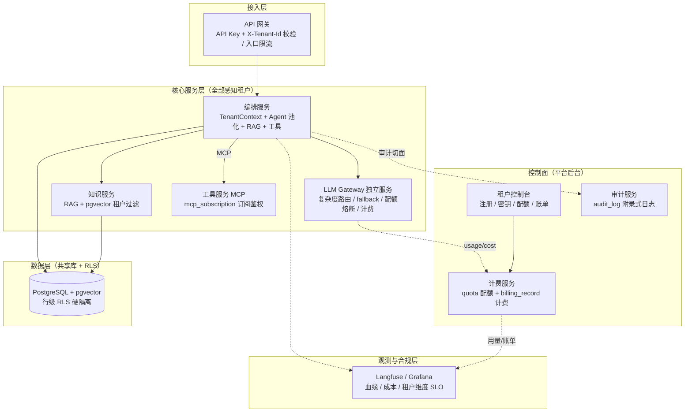
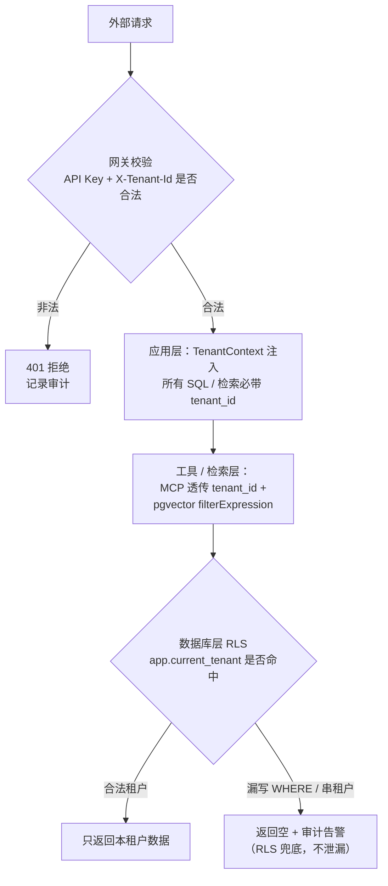
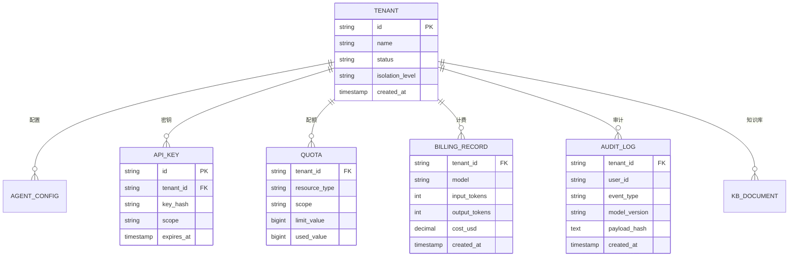
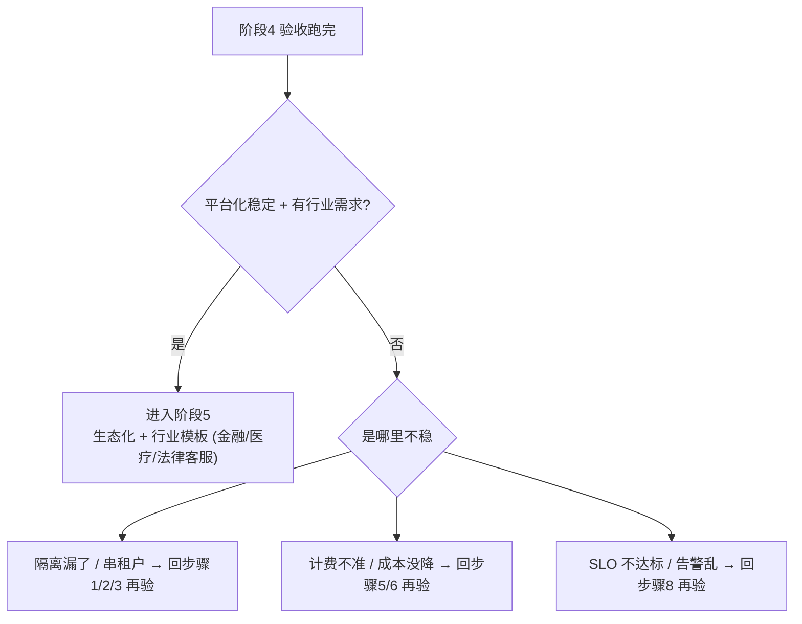

# 企业级多租户智能客服 Agent 平台 · 阶段 4：平台化多租户（Platform）

> **承接上一阶段。** 阶段 3 把单体拆成了 5 个可独立部署的服务，立起了全链路 trace、熔断/限流、多模型路由——但那是"**一个客户、一套系统**"：`tenant_id` 只是透传字段，没有隔离、没有计费、没有审计，出了事故没有 SLO 说话。本阶段把它升级成"**能同时服务多家企业客户**"的多租户平台：**租户隔离（数据库行级 RLS + 知识库租户过滤 + 权限/配额）、按 token/租户计费、审计合规（EU AI Act 附录式日志）、Prompt Cache + 模型路由降成本、SLO 定义与监控**，预计 **6~8 周**。
>
> 阅读前置：`00-README.md` → `01-方向调研与选型.md` → `02-阶段0-可行性验证.md` → `03-阶段1-单体MVP.md` → `04-阶段2-Agent化与评估.md` → `05-阶段3-服务化拆分.md` → **本文（阶段4）**。
>
> 一句话：**从"单客户系统"升级为"能扛生产的多租户平台"：一个平台同时服务多家企业客户，租户之间数据互不可见、成本按租户核算、动作全部留痕、好坏有 SLO 说话。**

---

## 0. 一句话

> 把阶段 3 的 5 个服务全面"租户化"：`tenant_id` 从"透传字段"变成**贯穿一切数据访问的硬约束**（应用层强制过滤 + PostgreSQL RLS 兜底 + pgvector 元数据过滤）；立起**配额与计费**（每租户每天/每月 token 上限、实时算钱、月度账单）；用 **Prompt Cache + 复杂度路由 + 独立 LLM Gateway** 把成本压下去；所有敏感操作写 **EU AI Act 附录式审计日志**；最后用 **SLO（可用性/延迟/准确率/成本）** 给平台"好坏定数"——且阶段 3 的评估集通过率**不回退**。

---

## 1. 本阶段目标

### 1.1 阶段定位：为什么是"平台化多租户"

- **从"应用"到"平台"，用户模型变了**：单应用是"单一业务方"，平台是"多租户"——部署方式从"业务方自己跑"变成"平台跑、业务方接 API"，随之而来的是**严格隔离、按租户计费、审计合规**（教程/18 §1）。这不是"多套副本"，而是"一套底座服务 N 家互不可见的企业客户"。
- **隔离是"卖多家企业"的地基**：客户之间知识库、会话、工具、账单必须互不可见。隔离有三级（共享一切 / 共享库独立 schema / 独立库），本阶段选"**共享库 + 行级 RLS 硬隔离**"作为默认——隔离强度够、成本可控，且升级路径保留（教程/18 §3.1/§3.3）。
- **计费是"卖"的商业闭环**：没有计费，平台就还是"demo"——"能收钱"要求**每租户 token 用量、成本可核算、可出账单**（教程/18 §5.2、教程/15 §6.2）。
- **降成本是平台的利润来源**：多租户下模型调用量成倍放大，成本是头号经营问题。四层降成本（L1 Prompt Cache / L2 Semantic Cache / L3 模型路由 / L4 长上下文权衡）里，本阶段做 **L1 + L3**，并把复杂度路由从"编排服务内"升级为"**独立 LLM Gateway**"（阶段 3 预留的演进位，教程/16 §4）（理论/15 §2）。
- **审计合规是"能扛生产"的底线**：对金融/医疗/法律类企业客户，欧盟 EU AI Act 等监管要求"系统能自动记录可追溯事件"（附录/条款式日志）。平台要把**审计日志**当一等公民做进去，不是上线前补（教程/18 §9、教程/31 §1.2/§1.3）。
- **SLO 是"好坏有数"**：没有 SLO，"系统稳不稳、回答准不准、花钱多不多"只能靠感觉。本阶段把 **SLI → SLO → 错误预算** 立起来，让每个指标都有数字、有告警、有改进依据（教程/26 §1）。
- 知识来源：`教程/18-大规模Agent平台与数据基础设施`（多租户主篇）、`教程/15-可观测性与成本治理`（实时算钱 / 配额 / Prompt Cache）、`教程/16-多模型路由与国产化`（LLM Gateway / 配额计费）、`教程/26-AI工程的SRE实践`（SLI/SLO/Runbook）、`教程/28-AI项目的Git工作流`（平台化后的协作规范）、`理论/15-成本工程与PromptCache`（四层降成本权威出处）、`理论/16-Agent可靠性工程Java视角`（熔断/幂等/权限）、`教程/31-法律咨询Agent`（合规铁律：全链路审计保留期）。

### 1.2 六个硬目标（全部做完才算完成）

| # | 目标 | 交付物（可验证） | 知识来源 |
|---|---|---|---|
| 1 | **多租户数据隔离** | 3 个测试租户并行使用，知识库 / 会话 / 工具结果**互不可见**（含"漏写 WHERE 也查不到别人数据"） | 教程/18 §3.1/§3.3/§3.4、理论/09 §4 |
| 2 | **租户权限** | 每租户独立 API Key；租户内 RBAC（管理员/只读客服）；工具订阅表控制"该租户能用哪些工具" | 教程/18 §8、理论/16 §6、教程/06 §8 |
| 3 | **配额与计费** | 多层配额（token/调用次数 × 天/月）+ 实时熔断；每租户成本可核算、可出月度账单 | 教程/18 §5、教程/15 §6.2/§6.3 |
| 4 | **降成本** | Prompt Cache 命中率有数；复杂度路由 + fallback 收敛到独立 LLM Gateway；有路由/缓存前后成本对比 | 理论/15 §2、教程/15 §7、教程/16 §4 |
| 5 | **审计合规** | 全量敏感操作落 `audit_log`，字段对齐 EU AI Act 附录式要求，可导出、保留期可配置 | 教程/18 §9、教程/31 §1.3 |
| 6 | **SLO 达标** | SLI → SLO → 错误预算；Grafana 租户维度面板；成本超预算 / 质量回退告警 | 教程/26 §1/§5、教程/18 §6 |

> 对应关系：目标 1/2 是"隔离"，目标 3/4 是"经营"（收钱 + 省钱），目标 5/6 是"底线"（合规 + 可量化）。阶段 3 的 `tenant_id` 透传链路、表归属矩阵、Langfuse 血缘、Resilience4j 全部是本阶段的**直接地基**，不是推倒重来。

### 1.3 本阶段明确不做（边界）

- **不做"每租户独立库/独立部署"当默认**——默认共享库 + RLS；独立 schema/独立库只在"大客户 / 高合规要求"时按需启用，做成可配置，不在本阶段铺开（教程/18 §3.1）。
- **不做语义缓存 L2（Semantic Cache）**——本阶段做 L1 Prompt Cache + L3 路由；L2 命中需业务强相似，留着做可选进阶（理论/15 §2.2）。
- **不做完整 CICD / K8s / 生产级发布**（阶段 5）——本阶段沿用 Docker Compose 部署，重点在"平台能力"，不在"交付流水线"。
- **不做行业模板 / 生态化**（阶段 5）——金融/医疗/法律行业客服模板是阶段 5 的事；本阶段把"通用平台底座"踩实。
- **不做 A2A 协议 / 多 Agent 跨平台编排**——那是生态方向（理论/09 §6.2），本阶段不引入。
- **不做分布式事务**——客服链路读为主，沿用阶段 3 的幂等 + 事件 + 补偿（理论/16 §3）。
- **不做"为隔离而隔离"的过度设计**——内部共享资产（如共享模型、公共话术模板）不必强行隔离；隔离边界必须能说出"商业/合规理由"（教程/19 §6.3 精神）。

---

## 2. 前置知识（先读这些再动手）

> 主篇先读，其余按需。引用约定：`教程/NN-标题` 指 `docs/教程/NN-标题.md`，`理论/NN-标题` 指 `docs/理论/NN-标题.md`。

| 资料 | 必读/选读 | 读哪几节、读来干嘛 |
|---|---|---|
| **教程/18-大规模Agent平台与数据基础设施** | 必读（主线·平台） | §1（**平台 vs 应用的差异**——为什么多租户）、§2（平台核心能力分层）、§3.1（**三种隔离级别**——本阶段选型依据）、§3.2（**tenant_id 传播：TenantContext + Filter**）、§3.3（**PostgreSQL RLS 行级硬隔离**）、§3.4（**Vector Store 多租户：metadata 过滤**）、§4（Agent 池化 + 配置 DB 化）、§5（**配额与计费**：5.1 多层配额、5.2 计费、5.3 实时熔断）、§6（SLO 与多层 Fallback）、§7（Self-Service Portal）、§8（**MCP Hub 工具市场**）、§9（**安全审计 AuditAspect**）、§16（数据安全与合规：PII 脱敏 / 保留期 / GDPR）、§17（**实战避坑**：17.1 数据泄漏、17.3 配额扣了但调用失败、17.4 配置热更新、17.5 审计日志爆炸） |
| **教程/15-可观测性与成本治理** | 必读（主线·成本） | §6.2（**实时算钱**——计费怎么算）、§6.3（**配额三层**）、§7（**Prompt Cache：省钱的核武器**：7.1 原理、7.2 提高命中率）、§8.2（集成 Langfuse）、§9（Grafana 三层面板）、§11.2（**Prompt 内容泄漏到日志**的坑） |
| **教程/16-多模型路由与国产化** | 必读（主线·网关） | §4（**LLM Gateway：4.1 自建最小 Gateway**——阶段 3 演进位，本阶段把它做成独立服务）、§5（**Token 配额与计费**：5.1 配额表、5.2 实时熔断）、§2.2/§3（复杂度路由回顾，路由收敛到 Gateway）、§13（避坑：复杂问题别丢给小模型） |
| **教程/26-AI工程的SRE实践** | 必读（主线·SLO） | §1（**SLI → SLO → 错误预算**：1.2 LLM 专属 SLI、1.3 错误预算与变更冻结）、§2（容量规划）、§3（**变更管理**：3.2 Prompt 三道门、3.3 模型升级回归）、§5（**成本治理**：5.3 预算告警）、§6（漂移检测）、§7（**Runbook**：7.1 上游 429、7.4 成本超预算）、§8.2（Postmortem） |
| **教程/28-AI项目的Git工作流** | 必读（主线·协作） | §2（分支模型：Trunk-Based + Feature Branch）、§3（**Commit 规范**：Prompt/Model/Data 变更强制字段）、§4（**PR 流程**：4.1 PR 模板含 Eval 报告、4.2 Review 规则）、§9（Hotfix 与 Prompt 紧急回滚）、§10（CODEOWNERS） |
| **理论/15-成本工程与PromptCache** | 必读（主线·成本原理） | §1.1（**五维成本**）、§2（**4 层缓存与路由**：2.1 L1 Prompt Cache、2.2 L2 Semantic Cache、2.3 L3 模型路由、2.4 L4 长上下文权衡）、§3（**成本监控必须记录的字段**）、§5（实战路线：P0/P1/P2） |
| **理论/16-Agent可靠性工程Java视角** | 选读 | §2.3（系统级 Resilience4j 熔断）、§3（幂等性设计）、§6（**权限模型 Allow/Ask/Deny/Yolo**——租户内权限的底层逻辑） |
| **教程/31-法律咨询Agent** | 选读（合规） | §1.2（**EU AI Act 海外参考**）、§1.3（**合规铁律**：全链路审计、保留期 5-10 年） |
| **教程/17-AI原生系统设计** | 选读 | §3（**Event Sourcing**：审计溯源的底层思路）、§9（避坑） |
| **教程/21-端到端案例** | 选读（样板） | §7（**LLM Gateway：7.1 复杂度路由、7.2 FallbackChain**——独立网关的直接样板）、§12（部署拓扑）、§14（验收清单） |
| **教程/07-MCP-Server高阶与生态** | 选读 | §3（**MCP Hub 注册发现**）——工具订阅的注册中心 |

> 建议阅读顺序：教程/18 §1 + §3（先懂"平台是什么、隔离怎么选"）→ 教程/18 §3.2/§3.3 + §3.4（动手做隔离地基）→ 教程/18 §5 + 教程/15 §6（配额与计费）→ 理论/15 §2 + 教程/15 §7 + 教程/16 §4（降成本三件套）→ 教程/18 §9 + 教程/31 §1.3（审计合规）→ 教程/26 §1 + §5（SLO 与告警）→ 教程/28 §2/§4（协作规范）。动手时卡住再回头翻 教程/18 §17（避坑速查）、教程/16 §13（路由避坑）。

---

## 3. 架构设计

### 3.1 关键设计决策（先讲为什么）

1. **隔离级别选"共享库 + RLS 行级硬隔离"，但做成可升级**：教程/18 §3.1 给了三级（共享一切 / 共享库独立 schema / 独立库）。默认**共享库同表 + `tenant_id` + PostgreSQL RLS 兜底**——RLS 的好处是"即使 SQL 漏写了 `WHERE tenant_id=`，数据库层也会过滤"，把"跨租户泄漏"这类头号事故从源头堵死（教程/18 §3.3/§17.1）。大客户/高合规场景再按需切独立 schema，改造点是数据层，不牵连应用层。
2. **租户上下文全局传播是第一地基**：用 `TenantContext`（ThreadLocal）+ 过滤器从请求头 `X-Tenant-Id` / API Key 注入，服务内所有数据访问都必须带 `tenant_id`（教程/18 §3.2）。**响应式/异步链路要显式传播**：Reactor 的线程切换、线程池任务、@Async 都会丢 ThreadLocal，必须把租户上下文显式传下去（这是多租户最常见的事故源，教程/18 §17.1）。阶段 3 的 `ToolContext → McpMeta` 透传继续用于工具服务。
3. **四层防御纵深，RLS 是"最后一道"不是"第一道"**：网关校验 API Key + X-Tenant-Id → 应用层强制过滤 → 工具/检索带租户 → RLS 兜底。应用层过滤负责"返回友好错误、可调试"；RLS 负责"防漏网"。**没有 RLS 的租户隔离是裸奔**。
4. **知识库用 pgvector 元数据过滤**：`tenant_id` 写进文档 metadata，检索时 `filterExpression("tenant_id == '<tenant>'")`，并对 chunk 表开启 RLS（教程/18 §3.4）。向量检索 + RLS 双保险。
5. **权限 = 租户边界 + 租户内 RBAC + 工具订阅**：租户边界由"API Key 绑定租户"保证；租户内再用 user/role/permission 区分"管理员 / 只读客服"；工具订阅表 `mcp_subscription` 控制"该租户能用哪些 MCP 工具"（教程/18 §8、理论/16 §6 的 Deny 优先精神）。**隔离的边界是"最小够用"：不需要隔离的共享资产（模型、公共模板）别硬隔离**。
6. **配额多层 + 实时熔断放在计费服务 / LLM Gateway**：`quota` 表按 `(tenant_id, resource_type, scope)` 记录上限与已用（llm_tokens / agent_calls / rag_queries × daily / monthly），调用前 `tryConsume` 预扣，超限即 429/抛 `QuotaExceededException`（教程/18 §5.1/§5.3、教程/15 §6.3）。配额是"防止一个租户打爆平台"的闸门，必须放在所有 LLM 调用的必经之路上——所以收敛进 LLM Gateway 最干净。
7. **计费以"模型 API 返回的 usage"为准，实时算钱落 `billing_record`**：成本 = token × 单价（`pricing` 表），**不要用自己估算的 token 数**，以模型返回的 usage 为准，才能做到"token 计费准确率 100%"（教程/18 §5.2、教程/15 §6.2、理论/15 §3.1）。每月按租户聚合出账单。
8. **降成本组合拳 = L1 Prompt Cache + L3 模型路由，收敛到独立 LLM Gateway**：① Prompt Cache：把"静态 system 前缀 + few-shot"与"动态用户输入"严格分离，前缀稳定即命中缓存（国内模型用各自 context caching 前缀约定，教程/15 §7.2、教程/16 §6）；② 独立 LLM Gateway：把阶段 3 的复杂度路由升级为独立服务，统一做**路由 + fallback + 配额 + 计费**四件事（教程/16 §4、教程/21 §7）。L2 语义缓存留作可选进阶。
9. **审计用切面统一落库，字段对齐 EU AI Act 附录式日志要求**：用 `@Audited` 注解 + AOP 切面，把"谁、何时、对哪个租户、做了什么、输入输出、模型/系统版本、触发原因"结构化落 `audit_log`（教程/18 §9）。EU AI Act 对高风险 AI 系统要求"自动记录可追溯事件"——本阶段把附录式字段做齐、保留期做成可配置（参考 教程/31 §1.3 的 5-10 年口径）。**只记结构化字段，不落敏感明文**（Prompt 哈希化，教程/15 §11.2）。
10. **SLO 三件套：SLI 采集 → SLO 目标 → 错误预算**：定义 LLM 专属 SLI（可用性 / P95 延迟 / 准确率 / 成本），落到 SLO（可用性 ≥99.9%、P95 < 5s、faithfulness ≥0.85、计费准确率 100%），按租户维度聚合出"错误预算"；预算用尽即冻结 Prompt/模型变更（教程/26 §1.3、教程/18 §6.1）。

### 3.2 架构图（mermaid）



> 读图：与阶段 3 相比，新增了两块。**控制面**（Portal / 计费 / 审计）负责"卖"与"管"；**LLM Gateway 从编排服务内抽成独立服务**，所有模型调用必经它（路由 + fallback + 配额 + 计费四合一），计费才能"不漏、不重"。核心服务层全部感知租户（TenantContext 贯穿），数据层用 RLS 兜底。观测层多了一个"租户维度"视角（成本按租户、SLO 按租户）。

### 3.3 租户隔离的纵深防线（mermaid）



> 读图：四层防线，前两层负责"正常路径的正确"，RLS 负责"异常路径的兜底"。**任何一层的租户过滤都不能依赖"人记得写 WHERE"**——所以最后一层用数据库强制。

### 3.4 多租户数据模型（mermaid）



> 数据层要点：① `TENANT.isolation_level` 预留"共享库/独立 schema"升级开关；② `API_KEY.key_hash` 只存哈希（教程/18 §16.1 PII 思路）；③ `BILLING_RECORD` 以模型 + token + 金额为最小粒度，支撑"按租户、按模型、按天/月"多维度核算；④ `AUDIT_LOG` 只存结构化字段 + payload 哈希，不存 Prompt 明文。所有表都开 RLS。

### 3.5 关键组件说明

| 组件 | 本阶段角色 | 说明 |
|---|---|---|
| **API 网关** | 租户入口 | 阶段 3 职责 + 校验 `API Key` 与 `X-Tenant-Id`，解析出租户后注入；入口限流按租户维度（教程/18 §3.2） |
| **编排服务** | 租户大脑 | 阶段 3 职责 + TenantContext 贯穿 + Agent 配置 DB 化（每租户自己的 system prompt / 模型 / 工具订阅，热更新）；会话/记忆带租户隔离（教程/18 §4.3） |
| **LLM Gateway（新增独立服务）** | 模型调用唯一入口 | 复杂度路由 + fallback 链 + 配额熔断 + 计费记录四合一；所有模型调用必经此处（教程/16 §4、教程/21 §7、教程/18 §6.2） |
| **知识服务** | 租户知识库 | RAG 六模块 + pgvector metadata 过滤 + chunk 表 RLS；租户只能搜到自己租户的文档（教程/18 §3.4） |
| **工具服务（MCP）** | 工具市场 | MCP Server + `mcp_subscription` 订阅鉴权（A 租户不能订阅/调用 B 租户工具）；tool 调用带租户透传（教程/18 §8、教程/05 §9） |
| **计费服务** | 经营中枢 | `quota`（多层配额 + 实时熔断）+ `billing_record`（实时算钱）+ 月度账单；与 LLM Gateway 联动（教程/18 §5、教程/15 §6.2） |
| **审计服务** | 合规底线 | `@Audited` 切面统一落 `audit_log`，EU AI Act 附录式字段 + 保留期配置 + 导出（教程/18 §9、教程/31 §1.3） |
| **Langfuse / Grafana** | 观测 | Langfuse 血缘 + 成本；Grafana 增加"租户维度"面板（成本按租户、SLO 按租户）（教程/15 §8.2/§9、教程/26 §5） |

---

## 4. 分步实现（每步：做什么 + 验证什么）

> 每步给出**关键片段**（不是最终完整代码），完整代码参考对应教程。**做完一步立刻验证一步，别攒到最后**。建议节奏（6~8 周）：步骤 1 约 1 周，步骤 2 约 1 周，步骤 3 约 3~4 天，步骤 4 约 3~4 天，步骤 5 约 1 周，步骤 6 约 1 周，步骤 7 约 1 周，步骤 8 约 1 周，步骤 9 约 3~4 天。
>
> 通用前置：**先写 ADR**（教程/19 §4.1 模板）：记下"隔离级别为什么选共享库 + RLS"、"为什么 LLM Gateway 独立成服务"、"计费口径为什么以 usage 为准"——这些是以后所有争论的答案来源。

### 步骤 1：租户模型与上下文传播地基（约 1 周）

**做什么：**
1. 建 `tenant` 表 + 租户 API Key 表（只存 key_hash），写一个租户管理接口（建租户、发密钥、启停）。阶段 3 里写死的 `tenant_id` 全部改为"从上下文取"。
2. 实现 `TenantContext`（ThreadLocal）+ 过滤器：从请求头 `X-Tenant-Id` 或 API Key 解析出租户并注入；非法租户 401（教程/18 §3.2）：

```java
// 关键片段（完整见 教程/18 §3.2）
public class TenantContext {
    private static final ThreadLocal<String> CURRENT = new ThreadLocal<>();
    public static void set(String t) { CURRENT.set(t); }
    public static String get() { return CURRENT.get(); }
    public static void clear() { CURRENT.remove(); }
}

@Component
public class TenantFilter extends OncePerRequestFilter {
    @Override
    protected void doFilterInternal(HttpServletRequest req, HttpServletResponse resp,
                                    FilterChain chain) throws ... {
        String tenantId = apiKeyService.resolveTenant(req.getHeader("Authorization"));
        if (tenantId == null) { resp.sendError(401, "Invalid tenant"); return; }
        TenantContext.set(tenantId);
        try { chain.doFilter(req, resp); }
        finally { TenantContext.clear(); }   // 必须清理，防串租户
    }
}
```

3. **响应式/异步显式传播**：Reactor 用 Context 传递租户；线程池 / @Async 任务在提交时把 TenantContext 传入，不要依赖 ThreadLocal 跨线程（这是步骤 2 之前的必做地基，漏了必串租户）。
4. 阶段 3 的 MCP 透传（`ToolContext → McpMeta`）继续：工具服务侧同样拿租户上下文做隔离。

**验证什么：**
- [ ] 3 个测试租户各配一把 API Key，并行发请求，日志/ThreadLocal 各自正确，**无串台**。
- [ ] 无 Key / 非法 Key 返回 401；停用租户立即被拒。
- [ ] 异步线程池任务内 `TenantContext.get()` 仍能取到正确租户（显式传播生效）。

### 步骤 2：数据库行级隔离 RLS + 知识库多租户（约 1 周）

**做什么：**
1. 对所有租户敏感表开 RLS，并建 policy——**只允许读到 `tenant_id = current_setting('app.current_tenant')` 的行**（教程/18 §3.3）：

```sql
-- 关键片段（完整见 教程/18 §3.3）
ALTER TABLE conversation   ENABLE ROW LEVEL SECURITY;
ALTER TABLE kb_chunk       ENABLE ROW LEVEL SECURITY;
ALTER TABLE billing_record ENABLE ROW LEVEL SECURITY;

CREATE POLICY tenant_isolation ON conversation
    USING (tenant_id = current_setting('app.current_tenant')::text);
-- 每个租户敏感表一张，kb_chunk / billing_record 同理
```

2. 数据源/连接层在**每次操作前** `SET app.current_tenant = '<tenant>'`（用连接器/拦截器统一做，别散落在代码里）。**注意**：多租户场景别用连接池复用污染的连接——SET 必须紧跟事务边界。
3. 知识库多租户：灌文档时把 `tenant_id` 写进 chunk metadata，检索时 `filterExpression("tenant_id == '<tenant>'")`（教程/18 §3.4）。
4. 给阶段 3 的**表归属矩阵**升级为"租户隔离矩阵"：每张表标注"是否开 RLS、租户过滤字段"。

**验证什么：**
- [ ] 漏写 `WHERE tenant_id=` 的查询返回**空集**（RLS 兜底生效）——这是隔离的核心验证。
- [ ] A 租户检索知识库，搜不到 B 租户的文档（metadata 过滤生效）。
- [ ] 3 个租户并行读写，数据互不可见，`billing_record` 各租户只看到自己的。

### 步骤 3：租户内权限 + 工具订阅（约 3~4 天）

**做什么：**
1. 建 user / role / permission 表（租户内 RBAC）：如"管理员"（可配知识库、看账单）、"只读客服"（只能对话查询）。用 `@PreAuthorize` / Spring Security 在租户内做角色控制。
2. API Key 支持 `scope`（如只读/读写），最小权限够用。
3. **工具订阅表 `mcp_subscription`**（租户 × MCP Server × 授权工具集）+ 工具服务侧按订阅鉴权：A 租户只能调用自己订阅的工具（教程/18 §8、教程/06 §8.3）：

```sql
-- 关键片段（完整见 教程/18 §8）
CREATE TABLE mcp_subscription (
    tenant_id    VARCHAR(64),
    mcp_server_id VARCHAR(64),
    granted_tools JSONB,          -- ["queryOrder", "createTicket"]
    granted_at   TIMESTAMP,
    PRIMARY KEY (tenant_id, mcp_server_id)
);
```

**验证什么：**
- [ ] 管理员能配置知识库/看账单；只读客服角色调不了管理接口（403）。
- [ ] A 租户的工具订阅里没有 B 租户的工具；A 租户调用 B 租户工具返回 403/404。
- [ ] 停用订阅后，该租户立刻调不到该工具。

### 步骤 4：配额与实时熔断（约 3~4 天）

**做什么：**
1. 建 `quota` 表（tenant_id × resource_type × scope(daily/monthly) × limit/used），写 `QuotaService.tryConsume`（教程/18 §5.1）。
2. 在 LLM Gateway（步骤 6 之前先放在编排服务的调用点）做 `QuotaGuard.check` 预扣：估算本次 token，超限直接抛 `QuotaExceededException`（教程/18 §5.3、教程/15 §6.3）：

```java
// 关键片段（完整见 教程/18 §5.3、教程/15 §6.3）
@Component
public class QuotaGuard {
    public void check(String tenantId, int estimatedTokens) {
        if (!quotaService.tryConsume(tenantId, "llm_tokens", estimatedTokens))
            throw new QuotaExceededException("Daily token quota exceeded");
        if (!quotaService.tryConsume(tenantId, "cost_usd",
                pricingCalculator.estimate(estimatedTokens)))
            throw new QuotaExceededException("Daily cost quota exceeded");
    }
}
```

**验证什么：**
- [ ] 把某租户日 token 配额调到很小，打几条请求后返回 429/配额错误，**其他租户不受影响**。
- [ ] 配额周期（日/月）到点自动重置，`used_value` 正确回零。
- [ ] 配额剩余查询接口正确（`limit - used`）。

### 步骤 5：计费与成本核算（约 1 周）

**做什么：**
1. 建 `pricing` 表（模型单价：输入/输出 token 单价），建 `billing_record` 表。
2. 在模型调用返回处（LLM Gateway / ChatClient 拦截器）**用模型返回的 usage 实时算钱**落库——不要用自己估算的 token 数（教程/15 §6.2、理论/15 §3.1）：

```java
// 关键片段（完整见 教程/18 §5.2、教程/15 §6.2）
@Service
public class BillingService {
    public void record(String tenantId, Usage usage, String model) {
        BigDecimal cost = pricingCalculator.compute(model, usage);   // usage 来自模型 API 返回
        jdbc.update("""
            INSERT INTO billing_record (tenant_id, model, input_tokens, output_tokens, cost_usd, created_at)
            VALUES (?, ?, ?, ?, ?, NOW())
            """, tenantId, model, usage.inputTokens(), usage.outputTokens(), cost);
        quotaService.consume(tenantId, "llm_tokens", usage.inputTokens() + usage.outputTokens());
        quotaService.consume(tenantId, "cost_usd", cost.doubleValue());
    }
    public BigDecimal monthlyBill(String tenantId, YearMonth month) { /* SUM(cost_usd) */ }
}
```

3. 账单接口：按租户 × 月，输出总额 + 按模型/按天明细；控制台展示（教程/18 §7 Portal 可先做最简单版：查用量、查账单）。
4. 计费要**幂等**：同一请求重放/重试不重复记账（理论/16 §3）。

**验证什么：**
- [ ] 3 个租户各自调用，`billing_record` 按租户分开、金额与模型 API 账单一致（准确率 100%）。
- [ ] 月度账单接口输出正确：总额 = Σ(token×单价)，按模型明细可查。
- [ ] 模拟一次 LLM 调用失败重试，账单**不重复**记账（幂等）。

### 步骤 6：降成本组合拳——Prompt Cache + 独立 LLM Gateway（约 1 周）

**做什么：**
1. **Prompt Cache（L1）**：把 system prompt 拆成"静态前缀（公司信息/话术/规范，跨请求稳定）"与"动态段（用户输入/当天变量）"，静态前缀保持完全一致以命中缓存（教程/15 §7.2、理论/15 §2.1）。多租户下每租户的 system prompt 相对固定，缓存收益天然明显。国产模型用各自的 context caching 前缀约定（教程/16 §6）。
2. **独立 LLM Gateway 服务**：把阶段 3 编排服务里的复杂度路由 + fallback 抽成独立服务，同时把配额（步骤 4）和计费（步骤 5）**收口到 Gateway**——所有模型调用必经它（教程/16 §4.1、教程/21 §7）：

```yaml
# 关键片段（完整见 教程/16 §4.1、教程/21 §7）
# LLM Gateway 内部：路由表（按租户可覆盖）+ fallback 链 + 配额 + 计费
router:
  rules:
    - { category: "faq",          model: "deepseek-chat" }      # 便宜小模型
    - { category: "complex",      model: "claude-sonnet-4-5" }  # 强模型
    - { default: "claude-sonnet-4-5" }                          # 分类失败兜底大模型
fallback:
  primary: claude-sonnet-4-5
  secondary: deepseek-chat
  degraded: "缓存命中或降级话术"
```

3. 缓存命中率、路由分布、成本 3 个指标从 Gateway 上报 Langfuse / Grafana。
4. 路由兜底纪律：分类失败/低置信度一律走大模型，绝不把复杂问题丢给小模型（教程/16 §13）。

**验证什么：**
- [ ] Prompt Cache 命中率有数（Langfuse 或模型 usage 里看 cache 字段），静态前缀改动前命中率稳定。
- [ ] 同一租户简单问题走小模型、复杂问题走大模型，日志可确认（不同 model 字段）。
- [ ] 有"做 Prompt Cache + 路由前后"成本对比数据（如总 token 成本下降 30%+）；一次调用在 Gateway 里完整记账 + 扣配额。
- [ ] 上游主模型挂了，fallback 到备模型，回答不中断（教程/21 §7.2、教程/18 §6.2）。

### 步骤 7：审计日志（约 1 周）

**做什么：**
1. 建 `audit_log` 表 + `@Audited` 注解 + AOP 切面，统一落库（教程/18 §9）。
2. **字段对齐 EU AI Act 附录式日志要求**（自动记录可追溯事件）：事件时间戳、系统/模型版本、租户与用户标识、事件类型（登录/查询/工具调用/知识库修改/配置变更）、触发原因、输入输出（敏感内容只存哈希）、操作结果（成功/失败 + 错误码）：

```java
// 关键片段（完整见 教程/18 §9，字段按附录式日志扩展）
@Audited(event = "query_order", tenantSensitive = true)
public Order queryOrder(String orderNo) { ... }

// 切面落库字段：tenant_id, user_id, event_type, model_version,
//                 payload_hash(sha256, 不落明文), result, error_code, created_at
```

3. 保留期做成可配置（默认满足合规口径，参考 教程/31 §1.3 的 5-10 年）；提供导出接口（按租户 × 时间段，CSV）。
4. 分级记录防爆炸：**关键操作全量记录，只读查询采样**（教程/18 §17.5）。

**验证什么：**
- [ ] 一次登录、一次查询订单、一次修改知识库都被记录，字段完整（含时间戳/租户/用户/版本/哈希）。
- [ ] 导出接口按租户导出成功，且**不含 Prompt 明文**（只有哈希）。
- [ ] 只读查询按采样率记录，日志量可控（不会爆炸）。

### 步骤 8：SLO 定义与监控（约 1 周）

**做什么：**
1. 定义 SLI 采集：可用性（请求成功率）、延迟（P95）、准确率（faithfulness，接阶段 3 评估服务）、成本（每租户 token/费用）——按租户维度聚合（教程/26 §1.2、教程/18 §6.1）。
2. 落 SLO 目标 + 错误预算：可用性 ≥99.9%、P95 < 5s、faithfulness ≥0.85、计费准确率 100%；错误预算用尽 → **冻结 Prompt/模型变更，只允许修复**（教程/26 §1.3）。
3. Grafana 增加租户维度面板：成本按租户、SLO 按租户、配额使用率（教程/15 §9、教程/26 §5.3 预算告警）。
4. 写 Runbook：上游 429、成本超预算、答案质量下降、租户配额打满各一张（教程/26 §7）。

**验证什么：**
- [ ] Grafana 有"系统层/质量层/业务层"面板 + "租户维度"面板，数据是活的。
- [ ] 把某租户成本预算调到很小 → 触发"成本超预算"告警。
- [ ] 错误预算模型可演示：某 SLI 连续不达标，预算下降，触发变更冻结提示。
- [ ] 一次事故走完 Runbook → Postmortem 模板（教程/26 §8.2）。

### 步骤 9：平台化协作与全量回归（约 3~4 天）

**做什么：**
1. **Agent 配置 DB 化**：每租户的 system prompt / 模型选择 / 工具订阅 / 知识库绑定存 DB（替代写死在代码里），控制台修改后热加载不重启（教程/18 §4.3）。注意版本化 + 回归（教程/18 §17.4）。
2. **Git 工作流落地**：Trunk-Based + Feature Branch；Prompt/Model/Data 类改动走 PR，PR 里**必须带 Eval 报告**；commit 用 Conventional Commits（教程/28 §2/§3/§4）。
3. 全量回归：3 租户隔离用例 + 配额/计费用例 + 审计用例 + 阶段 3 评估集（≥0.85，不回退）。
4. 补 README 更新：平台架构图、租户开通流程、账单查询方式。

**验证什么：**
- [ ] 控制台改某租户的 system prompt，下次请求立即生效（不重启）；改错了能回滚旧版本。
- [ ] 一个 Prompt 改动走了"分支 → PR → Eval 报告 → 合并"完整流程。
- [ ] 阶段 3 评估集通过率 ≥ 阶段 3 基线（多租户化不回归回答质量）。
- [ ] 第 5 章验收标准全部可勾选。

---

## 5. 验收标准（可勾选、可量化）

> 全部打勾才算本阶段完成。数字口径：3 个测试租户；阶段 3 评估集通过率不回退（≥0.85）。

- [ ] **3 个租户隔离验证通过**：并行使用下知识库、会话、工具结果**互不可见**；漏写 `WHERE tenant_id=` 的 SQL 返回空（RLS 兜底演示成功）。
- [ ] **租户权限生效**：每租户独立 API Key；租户内 RBAC（管理员/只读客服）行为差异正确；A 租户调用不到 B 租户的工具（订阅鉴权 403/404）。
- [ ] **配额熔断**：某租户日配额打满返回 429/配额错误，其他租户不受影响；配额周期自动重置。
- [ ] **每租户成本可核算**：月度账单按租户输出，总额 = Σ(token×单价)，与模型 API 账单一致（计费准确率 100%）；重试不重复记账。
- [ ] **降成本有效**：Prompt Cache 命中率有数且命中前成本对比报告存在；复杂度路由让简单请求走小模型；路由/缓存后总成本下降可量化（目标 ≥30% 可演示）。
- [ ] **LLM Gateway 收口**：所有模型调用必经 Gateway；主模型挂 → fallback 不中断；配额 + 计费都在 Gateway 完成。
- [ ] **有审计合规**：敏感操作全量落 `audit_log`，字段含 EU AI Act 附录式要求（时间戳/租户/用户/模型版本/输入输出哈希/触发原因），可导出、保留期可配置、不落敏感明文。
- [ ] **SLO 达标**：可用性 ≥99.9%、P95 延迟 <5s、faithfulness ≥0.85、计费准确率 100%；Grafana 有租户维度面板 + 成本超预算告警 + 错误预算模型。
- [ ] **平台化协作**：Agent 配置 DB 化可热更新可回滚；Prompt/Model 变更走"PR + Eval 报告"流程。
- [ ] **阶段 3 回归不回退**：评估集通过率 ≥ 阶段 3 基线；Docker Compose 一键起整套平台。
- [ ] **演示路径完整**：开通一个新租户 → 配知识库 → 配工具订阅 → 发 API Key → 对话/查单/账单/审计全链路可演示。

---

## 6. 演进触发（什么时候进下一阶段）



### 通过 → 进入阶段 5（生态化 + 行业模板）

- **触发信号（最重要的）：平台化稳定 + 有行业需求**。当平台在多租户下稳定运行（隔离无事故、计费准确、SLO 达标），且出现"金融客服 / 医疗分诊 / 法律咨询"这类**行业模板**需求时，进入阶段 5。行业模板能"卖"出更高溢价，是平台的商业放大器。
- 阶段 5 要做：**行业 Agent 模板**（金融/医疗/法律各自的合规约束、拒答策略、评估集，教程/29/30/31）、**生态化**（MCP Hub 对外开放、第三方工具接入）、把 Docker Compose 升级为**生产交付**（CICD / K8s，教程/27）。阶段 4 的隔离级别可对高合规客户升级独立 schema。
- 阶段 4 的 `audit_log`（附录式日志）和 SLO 底座，就是阶段 5 行业合规的直接地基。

### 不通过 → 在本阶段内迭代（或回退）

| 症状（验收哪条没过） | 可能原因 | 调整方向 |
|---|---|---|
| 出现跨租户数据串台 | 应用层漏过滤 / 异步线程丢上下文 / RLS 没开 | 补四层防线：TenantContext 显式传播（响应式/线程池）、漏过滤处强制带租户、敏感表全开 RLS 兜底（教程/18 §3.3/§17.1） |
| RLS 开启后查不到任何数据 | `current_setting` 没设 / policy 用错 / 连接池复用污染 | 连接层统一在事务边界 `SET app.current_tenant`；别用连接池残留的旧租户（教程/18 §3.3） |
| 配额扣了但 LLM 调用失败 | 预扣与结算不一致 | 失败时回滚预扣或按真实 usage 结算对齐（教程/18 §17.3） |
| 计费不准（和模型账单对不上） | 用了自己估算的 token 而不是 usage | 一律以模型 API 返回的 usage 为准（教程/15 §6.2） |
| 审计日志爆炸 / 关键操作没记 | 全量记录 / 切面没覆盖 | 分级：关键操作全量、只读查询采样（教程/18 §17.5） |
| Prompt Cache 命中率低 | 静态前缀不一致 / 动态混进静态 | 静态 system 与动态输入严格分离；改动前缀要评估对命中率的影响（教程/15 §7.2） |
| 成本没降反升 | 路由没生效 / 小模型也在调工具 | 检查路由表命中；简单直答别挂工具链；分类失败兜底大模型（教程/16 §13） |
| SLO 不达标但说不清原因 | SLI 没按租户聚合 / 没算错误预算 | 按租户维度聚合 SLI，建立错误预算模型，预算用尽冻结变更（教程/26 §1.3） |
| 配置热更新出 bug | Agent 配置没版本化 / 没回归 | 配置做版本化，热更新前跑评估集回归（教程/18 §17.4） |
| 多租户后回答质量回退 | 某租户上下文被隔离逻辑改坏 | 回归时逐条看 eval_run，对比阶段 3 基线定位（教程/12 §8.2） |

> 迭代原则同前几阶段：**一次只改一个变量**，改完重跑那几条失败用例 + 全量评估集 + 3 租户隔离回归，用数据说话。

---

## 7. 本阶段踩坑与排错

| 现象 | 常见原因 | 排查 / 解决 |
|---|---|---|
| 跨租户数据泄漏（**头号事故**） | SQL 漏写 `WHERE tenant_id=`；异步线程丢上下文；连接池复用污染 | 四层防线：应用层强制带租户 → 响应式/线程池显式传播 → 敏感表全开 RLS 兜底 → 泄漏即审计告警（教程/18 §3.3/§17.1） |
| RLS 开启后全表查空 | `app.current_tenant` 没设置 / policy 用错 | 连接层统一在事务边界 `SET`；用 psql 单独验证 policy；别在代码里散落 SET（教程/18 §3.3） |
| 异步/响应式下租户串台 | ThreadLocal 不跨线程 / Reactor 没传 Context | 线程池任务提交时传入租户；Reactor 用 Context 显式传递；异步链路回归用例要覆盖（教程/18 §3.2） |
| MCP 工具调用串租户 | `ToolContext → McpMeta` 透传漏了 | 工具调用强制带租户，工具服务侧按订阅鉴权（教程/05 §9、教程/18 §8） |
| 配额扣了但调用失败 | 预扣与结算两套逻辑不一致 | 失败回滚预扣，或按真实 usage 结算时对齐（教程/18 §17.3） |
| 计费对不上模型账单 | 用估算 token 而非 usage | 一律以模型 API 返回的 usage 为准；保留一次人工对账（教程/15 §6.2） |
| 重试导致重复记账 | 计费不幂等 | 计费幂等：请求 id / 租户内唯一，重试不重复落账（理论/16 §3） |
| 审计日志爆炸 | 全量记录只读操作 | 分级记录：关键操作全量、只读查询采样（教程/18 §17.5） |
| Prompt 明文泄漏到日志/审计 | 直接落 prompt | 审计/日志只存 payload 哈希，不落明文（教程/15 §11.2） |
| Prompt Cache 命中率低 | 前缀不稳定 / 动态混静态 | 静态 system + few-shot 与动态输入严格分离；监控命中率（教程/15 §7.2） |
| 成本超预算没人知道 | 没配预算告警 | Grafana 预算告警 + 错误预算冻结变更（教程/26 §5.3、§1.3） |
| 复杂问题被路由到小模型答崩 | 分类失败没兜底 | 分类失败/低置信度一律走大模型（教程/16 §13） |
| 主模型挂全平台崩 | fallback 链没建 | LLM Gateway 配 fallback 链（主 → 备 → 降级）（教程/21 §7.2、教程/18 §6.2） |
| Agent 配置热更新出 bug | 配置没版本化 / 没回归 | 配置版本化 + 热更新前跑评估集（教程/18 §17.4） |
| 多租户后协作混乱 | 分支乱 / PR 没 Eval 报告 | 落地 Trunk-Based + PR Eval gate + commit 规范（教程/28 §2/§3/§4） |
| SLO 达标但用户感知差 | SLI 没按租户聚合 / 采样偏差 | 按租户维度聚合 SLI；核对采样率（教程/26 §1、教程/15 §11.1） |

### 三个"平台心态"坑（比技术坑更常踩）

1. **隔离不是"加个字段"就完事**：真正的隔离是"没有 RLS 兜底就不算隔离"——应用层过滤可以被遗忘，RLS 是唯一"即使人犯错也不会泄漏"的防线。先开 RLS 再谈其他。
2. **计费口径必须"以模型 usage 为准"**：用自己估算的 token 计费，对账必崩。把"计费准确率 100%"当成硬指标，而不是"大概对"。
3. **平台能力要跟着商业走，不是跟着技术炫**：隔离级别、要不要独立库、要不要语义缓存，答案都来自"客户要什么、合规要什么"，不是"技术上更高级"。**做平台，先学会说"这个隔离是卖点，那个隔离是浪费"。**

---

> **知识来源汇总**：本阶段依据 `教程/18-大规模Agent平台与数据基础设施`（多租户主篇：隔离级别 / tenant_id 传播 / RLS / Vector Store 多租户 / 配额计费 / Agent 池化 / MCP Hub / 安全审计 / 避坑）、`教程/15-可观测性与成本治理`（实时算钱 / 配额三层 / Prompt Cache / Langfuse / Grafana / 避坑）、`教程/16-多模型路由与国产化`（LLM Gateway / Token 配额计费 / 复杂度路由 / 避坑）、`教程/26-AI工程的SRE实践`（SLI/SLO/错误预算 / 变更管理 / 预算告警 / Runbook / Postmortem）、`教程/28-AI项目的Git工作流`（分支模型 / Commit 规范 / PR Eval gate / Hotfix）、`教程/31-法律咨询Agent`（EU AI Act 海外参考 / 全链路审计保留期）、`教程/17-AI原生系统设计`（Event Sourcing 审计溯源）、`教程/21-端到端案例`（LLM Gateway 复杂度路由 + FallbackChain）、`教程/07-MCP-Server高阶与生态`（MCP Hub 注册发现）；理论侧依据 `理论/15-成本工程与PromptCache`（四层降成本：L1 Prompt Cache / L2 Semantic Cache / L3 模型路由 / L4 长上下文）、`理论/16-Agent可靠性工程Java视角`（系统级熔断 / 幂等 / 权限模型）、`理论/09-企业级Java-AI架构选型真相`（Workflow > Agent / 平台方向）。
>
> 下一步：验收通过后进入 **阶段 5 · 生态化 + 行业模板**——平台化稳定 + 出现行业需求时，做金融/医疗/法律行业客服模板（各带合规约束与评估集，教程/29/30/31）、MCP Hub 对外开放生态化、并把部署升级为生产交付（CICD / K8s，教程/27）。
