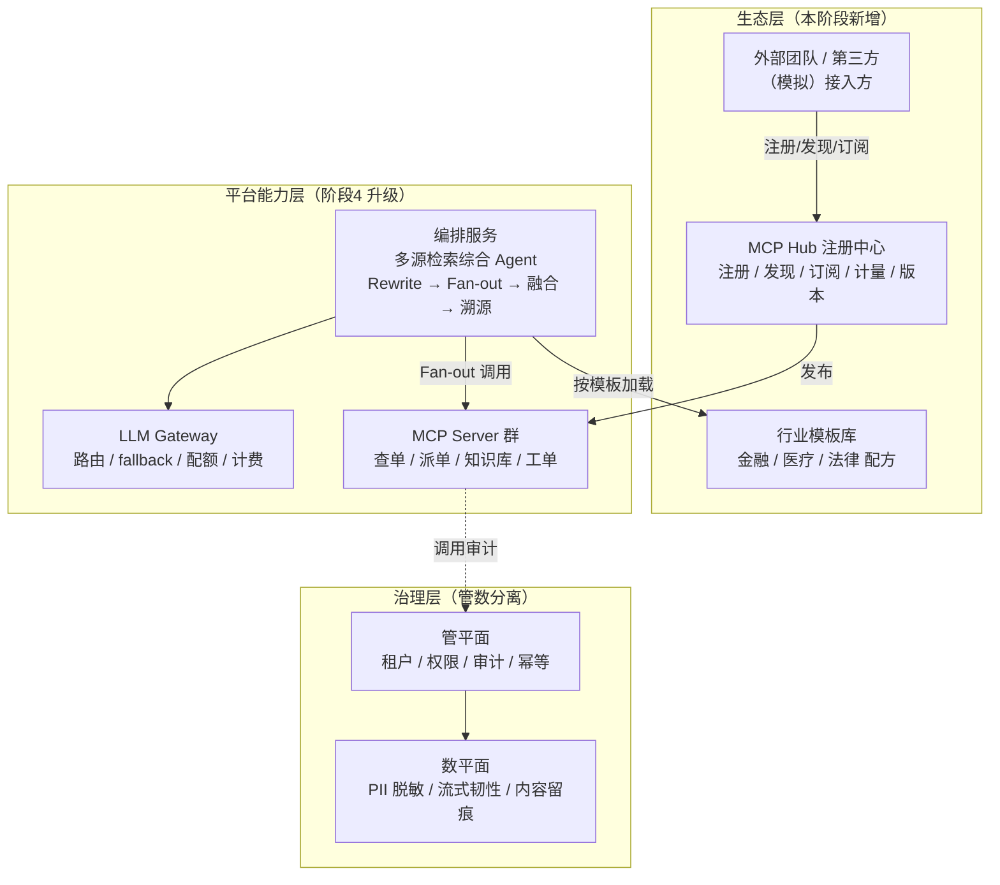
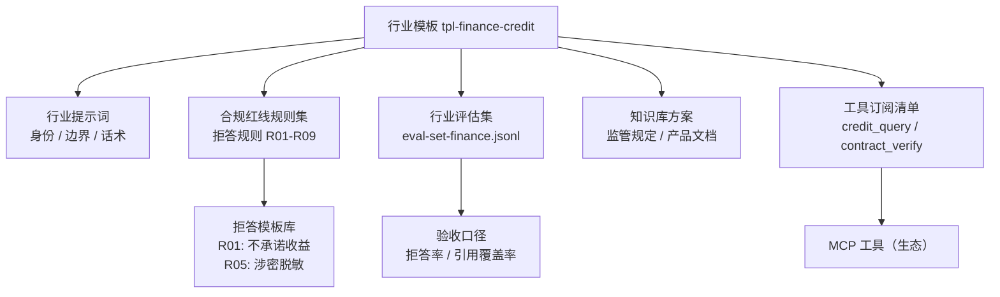
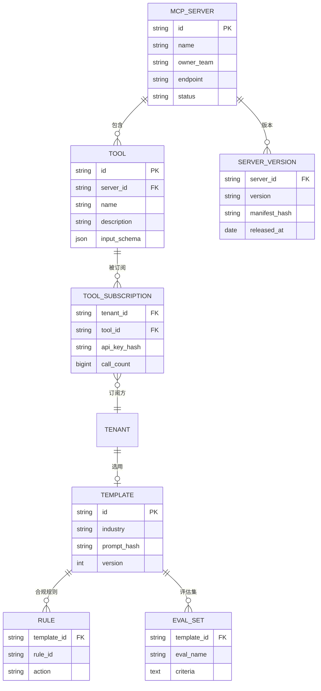
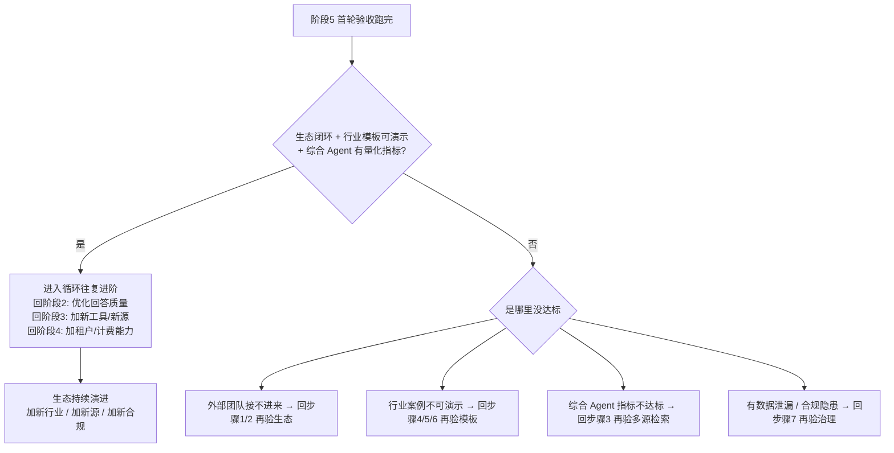

# 企业级多租户智能客服 Agent 平台 · 阶段 5：生态化与行业（Ecosystem）

> **承接上一阶段。** 阶段 4 把平台"卖多家企业客户"踩实了：租户隔离（RLS 硬隔离）、配额计费、审计合规、SLO 都有数字。但那个阶段有两个口子是刻意留的：**工具是平台自己那套，行业是"通用客服"**——`mcp_subscription` 只是内部订阅表，金融/医疗/法律这些高价值行业的合规约束、拒答策略、评估集都还没做。本阶段把平台升级成"**生态**"：**开放 MCP Server 生态**（你的企业 MCP Server 可发布、可被发现、可被第三方接入）、**行业模板**（金融 / 医疗 / 法律 3 个可演示的行业"配方"）、**多源检索综合 Agent**（用 MCP 当接入层，把订单库 + 知识库 + 工单系统 + 第三方数据源一次检索融合）、**数据治理与合规**（管数分离、PII 脱敏、行业级审计与拒答）。预计持续演进（生态做起来后进入"循环往复进阶"）。
>
> 阅读前置：`00-README.md` → `01-方向调研与选型.md` → `02-阶段0-可行性验证.md` → `03-阶段1-单体MVP.md` → `04-阶段2-Agent化与评估.md` → `05-阶段3-服务化拆分.md` → `06-阶段4-平台化多租户.md` → **本文（阶段5）**。
>
> 一句话：**把"一个平台"升级为"一个生态"——发布企业 MCP Server 让外部团队能接入、沉淀金融/医疗/法律行业模板让新客户"开箱即用"、用多源检索 Agent 打通所有数据源、用管数分离与行业合规把"能跑"变成"敢上"。**

---

## 0. 一句话

> 阶段 4 的多租户平台是"**卖工具**"，本阶段是"**卖方案 + 建生态**"：① 把阶段 3/4 积累的工具发布成**可注册、可发现、可订阅、可灰度**的企业 MCP Server 生态（第三方团队能接入你的生态）；② 把"金融 / 医疗 / 法律"三个行业的合规约束、提示词、知识库方案、拒答策略、评估集打包成**模板**——新租户开通一个行业模板就开箱即用；③ 用 **多源检索综合 Agent**（Query Rewrite → 并发 Fan-out 多 MCP 源 → RRF + Rerank 融合 → 引用溯源）让一个客服 Agent 打通企业全部数据源；④ 用 **管数分离 + 数据治理 + 行业合规**给生态收底（PII 脱敏、审计留痕、该拒答就拒答）。这个阶段不设"做完"的终点——**生态成型后进入循环：回到阶段 2 优化回答质量、回到阶段 3 加工具、回到阶段 4 加租户能力，如此循环往复进阶**。

---

## 1. 本阶段目标

### 1.1 阶段定位：为什么是"生态化与行业"

- **生态 = 把你积累的能力"开放出去"**：阶段 3 做了一堆 MCP 工具（查单 / 派单 / 知识库），阶段 4 做了工具订阅表，但都是"平台自己用"。本阶段把这些工具**发布成生态资产**：有注册表（Hub）、有版本、有灰度、有 deprecated，外部团队能发现你的工具、订阅你的工具、接入你的生态（教程/07 §3/§5、教程/32 §8、理论/14）。**生态的衡量标准是"别人能接入"，不是"你自己能用"**。
- **行业模板 = 把"通用"变成"开箱即用"**：金融客服和零售客服差在**合规约束**（信贷审批要人在回路、医疗不能确诊、法律必须引用溯源），差在**知识库**（法条库 / 药品说明书 / 监管规定），差在**评估集**（每个行业有自己该答对/该拒答的用例）。把这三样打包成"模板"，新租户选一个模板就得到整套行业配方（教程/29、教程/30、教程/31）。**模板即配方：提示词 + 合规红线 + 评估集 + 知识库方案 + 工具订阅 + 拒答策略**。
- **多源检索 Agent = 客服的"全数据源大脑"**：阶段 2 的 RAG 只检索自己的知识库。真实客服要同时查**订单系统 + 产品知识库 + 工单系统 + 第三方数据**。用 MCP 当统一接入层，把一个问题拆成多个子查询、并发打多个源、融合排序、带引用回答——这就是"多源检索综合 Agent"（教程/32）。**这是生态能产生价值的关键场景：平台越开放，能检索的源越多，回答越强**。
- **管数分离 + 数据治理 + 合规 = 生态敢开放的前提**：开放给第三方，就意味着数据要过别人的手。所以"管"（路由 / 编排 / 配额 / 审计）和"数"（token 流 / 检索内容 / 用户数据）必须分离治理：PII 一律脱敏、审计一律留痕、拿不准的一律拒答（教程/35 的管数分离思想、教程/29 §5、教程/30 §5、教程/31 §7）。
- **为什么这个阶段"持续演进"而不是"N 周交付"**：生态和行业没有"做完"的一天——行业会加（保险 / 政务 / 教育），工具会加（第三方团队不断发布新 MCP Server），客户会提出新合规要求。所以阶段 5 的验收不是"全部功能封板"，而是"**循环机制成立**"：生态开放可用、行业模板可演示、综合 Agent 有量化指标，然后进入"回到阶段 2-4 持续优化"的飞轮。
- 知识来源：`教程/07-MCP-Server高阶与生态`（把 HTTP API 包装成 MCP / Hub 注册发现 / 版本管理与灰度）、`教程/32-多源检索Agent与MCP生态整合`（Query Rewrite / Fan-out / RRF+Rerank / 引用溯源）、`教程/29-金融风控Agent`、`教程/30-医疗问诊Agent`、`教程/31-法律咨询Agent`（三个行业模板：合规约束 / 拒答策略 / 评估集）、`教程/38-管数分离实战-从Sinks到Kafka演进`（管与数分离）、`理论/14-MCP协议与生态`（协议原理与生态演进）、`理论/16-Agent可靠性工程Java视角`（幂等 / 熔断 / 权限，生态多源调用靠它）、`教程/18-大规模Agent平台与数据基础设施`（§8 MCP Hub 工具市场是阶段 4 打的地基）、`教程/06-MCP-Server开发实战`（发布前的 Server 质量）。

### 1.2 四个硬目标（全部做完才算完成）

| # | 目标 | 交付物（可验证） | 知识来源 |
|---|---|---|---|
| 1 | **MCP Server 生态开放** | 平台自研工具发布到 Hub（注册表）；外部团队（模拟）能发现、订阅、调用你的 MCP Server；有版本管理与灰度 | 教程/07 §2/§3/§5、教程/32 §8、理论/14 |
| 2 | **3 个行业模板** | 金融 / 医疗 / 法律各 1 个**可演示案例**（含行业提示词、合规红线、拒答模板、评估集、知识库方案） | 教程/29、教程/30、教程/31 |
| 3 | **多源检索综合 Agent** | 一个客服 Agent 同时检索"订单库 + 知识库 + 工单系统 + 第三方源"，RRF+Rerank 融合，回答带引用，有量化指标（引用覆盖率 / faithfulness / 时效性） | 教程/32 §3/§4/§5/§6/§10 |
| 4 | **数据治理与合规** | 管数分离落地（管平面 / 数平面分开治理）；PII 字段统一脱敏；行业级审计 + 拒答策略 + 拒答率监控 | 教程/35、教程/29 §5、教程/30 §5、教程/31 §7 |

> 对应关系：目标 1 是"开放"（别人能接入），目标 2 是"方案"（开箱即用），目标 3 是"能力"（一个 Agent 打通全部数据源），目标 4 是"底线"（开放的前提是数据治理与合规）。阶段 4 的 `mcp_subscription` 订阅表、审计底座、SLO 全部是本阶段的**直接地基**，不是推倒重来。

### 1.3 本阶段明确不做（边界）

- **不做"平台自己开发第三方业务"**——生态是"你发布、别人接入"，不是"你替第三方写工具"。阶段 3 自研工具是种子，第三方工具要由外部团队通过生态接入（教程/07 §3 的 Hub 职责）。
- **不做 A2A 协议 / Agent 间自由编排**——Agent 之间如何协作、跨平台 Agent 调用是更远的生态方向（理论/09 §6.2），本阶段只做"Agent → MCP 工具"这一层的生态，不做"Agent → Agent"。
- **不做完整的生产级部署升级（K8s 集群 / 弹性伸缩 / 全链路压测）**——本项目只有阶段 0~5，没有阶段 6；"生产交付"不是被推到不存在的阶段，而是本阶段收口为**生产交付最小集**（见 3.6：CI 流水线 + 一键部署 + 回滚，教程/27）。完整 K8s 编排 / 弹性伸缩不在本阶段铺开，属于进入"循环往复进阶"后按真实规模约束按需增强。
- **不做所有行业**——只做金融 / 医疗 / 法律 3 个高价值行业模板做样板，模板机制要**可复制**（加一个行业 = 加一份模板配置 + 评估集），但不在本阶段铺开保险 / 政务等。
- **不做行业模型的微调**——行业模板用**提示词 + RAG + 合规约束**实现（教程/29 §6 的微调留作可选进阶），避免把"模板"做成"重活"。
- **不做"开放即裸奔"的激进生态**——对外开放必须带**订阅鉴权 + 配额 + 审计**，宁可先闭门演练"模拟第三方接入"，也不急着真对外开放（教程/32 §11 的安全红线）。

---

## 2. 前置知识（先读这些再动手）

> 主篇先读，其余按需。引用约定：`教程/NN-标题` 指 `docs/教程/NN-标题.md`，`理论/NN-标题` 指 `docs/理论/NN-标题.md`。

| 资料 | 必读/选读 | 读哪几节、读来干嘛 |
|---|---|---|
| **教程/07-MCP-Server高阶与生态** | 必读（主线·生态） | §2（**把任意 HTTP API 包装成 MCP Server**：2.1 三种包装策略、2.2 手写标准模式、2.3 OpenAPI→MCP 自动生成、2.5 工具切分原则）、§3（**MCP Hub：注册发现 + 多租户代理**：3.1 定位、3.2 核心职责、3.3 最小实现、3.4 订阅数据模型）、§5（**版本管理与灰度**：5.1 协议版本协商、5.2 工具版本、5.3 灰度、5.4 deprecate）、§7（**安全红线**：7.1 Prompt Injection 防护、7.2 PII 脱敏、7.3 工具最小权限）、§8（测试工程化：8.3 契约测试） |
| **教程/32-多源检索Agent与MCP生态整合** | 必读（主线·综合 Agent） | §3（**Query Rewrite**：把一个问题拆多个子查询 + 失败退路）、§4（**Fan-out 并发调用多个 MCP Server**：4.2 用 Reactor 并发、4.4 别让 LLM 决定调哪个源）、§5（**多源融合：RRF + Rerank**：5.1 RRF、5.3 Cross-encoder、5.4 完整融合流水线）、§6（**LLM 综合 + 引用溯源**：6.1 强制带 source 的 Prompt、6.2 引用校验 Advisor）、§8（**MCP Hub 多租户订阅**）、§9（**防滥用与限流**：9.1 三层防护、9.2 Bulkhead）、§10（**评估**：10.1 离线 eval、10.3 时效性评估）、§11（安全红线） |
| **教程/29-金融风控Agent** | 必读（行业模板·金融） | §1（**监管与合规约束**：1.1 中国金融 AI 监管、1.3 合规铁律）、§2（**信贷审批 Agent**：2.1 人在回路架构、2.3 风险解释）、§5（**数据治理**：5.1 PII 脱敏、5.2 字段级权限、5.3 审计日志）、§7（安全工程：7.1 Prompt Injection 在金融的破坏力）、§8（评估：8.1 离线评估集、8.3 公平性评估） |
| **教程/30-医疗问诊Agent** | 必读（行业模板·医疗） | §1（**合规约束**：1.1 中国医疗 AI 监管、1.3 合规铁律）、§2（**智能分诊**：2.2 架构、2.4 红线规则）、§5（**数据治理与隐私**：5.1 HIPAA 安全规则、5.3 脱敏与重新识别风险）、§7（**关键风险**：7.1 幻觉、7.2 Prompt Injection、7.3 模型漂移、7.4 过度依赖） |
| **教程/31-法律咨询Agent** | 必读（行业模板·法律） | §1（**合规约束**：1.1 中国监管、1.3 合规铁律）、§2（**法条检索**：2.3 数据准备的特殊性、2.5 强制引用、2.6 引用校验 Advisor）、§6（**引用溯源（核心工程）**：6.1 每条断言带 source_id、6.2 Source 验证）、§7（**拒答策略**：7.1 何时拒答、7.2 拒答模板、7.3 拒答率监控） |
| **教程/38-管数分离实战-从Sinks到Kafka演进** | 必读（主线·数据治理） | 前言（**管数分离到底是什么**：一个接口干了三件事的反模式 → 把"管"和"数"拆开）、核心概念速查、第 2 章（POST 触发 + GET 只读流）、第 4 章（流式持久化）、第 6 章（run 资源 + 幂等键 + 会话级独占）——把"管（控制/路由/配额/审计）"和"数（token 流/检索内容/用户数据）"分开治理，是多源检索与开放生态的地基 |
| **理论/14-MCP协议与生态** | 必读（主线·原理） | §1（协议三类能力 + 传输）、§2（**生态演进**：注册发现、版本管理、Hub 的价值）、§3（多租户上下文透传） |
| **教程/06-MCP-Server开发实战** | 选读（发布质量） | §2（注解 / Provider 开发 MCP Server）、§8（鉴权 / 限流 / 可观测）——发布前把 Server 质量做扎实 |
| **理论/16-Agent可靠性工程Java视角** | 选读 | §2.3（系统级 Resilience4j 熔断）、§3（**幂等性设计**）、§6（**权限模型**）——多源 Fan-out 的可靠性 |
| **教程/12-评估闭环与Prompt版本管理** | 选读（评估） | §1-§3（离线/在线评估、LLM-as-Judge）、§8（回归）——行业模板的评估集建设方法 |
| **教程/18-大规模Agent平台与数据基础设施** | 选读（阶段 4 地基回顾） | §8（**MCP Hub 工具市场**——阶段 4 已经建了内部订阅，本阶段对外） |

> 建议阅读顺序：教程/07 §2 + §3（先懂"怎么发布、Hub 长什么样"）→ 教程/32 §3/§4/§5/§6（多源检索综合 Agent 的完整链路）→ 教程/29/30/31 的 §1（合规）+ 各自行业核心章（金融 §2、医疗 §2、法律 §2/§7）→ 教程/35 前言（管数分离）→ 教程/07 §5 + §7（版本与安全）→ 教程/32 §9/§10（防滥用与评估）。动手时卡住再回头翻教程/07 §8（契约测试）、教程/32 §12（反模式速查）。

---

## 3. 架构设计

### 3.1 关键设计决策（先讲为什么）

1. **生态不是"新系统"，是"开放已有的能力"**：阶段 3/4 的平台里有现成的 MCP Server（查单 / 派单 / 知识库）、现成的订阅表（`mcp_subscription`）、现成的审计。生态化 = 把这些**发布 + 注册 + 版本化 + 对外开放**，而不是另起炉灶（教程/07 §3.1）。**衡量标准是"外部团队能接入"，哪怕先模拟外部团队**。
2. **行业模板 = 一份可发布的"配方"，不是一堆散代码**：模板 = **行业提示词（system prompt）+ 合规红线（规则集）+ 拒答模板 + 评估集（jsonl）+ 知识库引导方案 + 工具订阅清单**，全部做成**配置 + 版本化**（模板也是"代码"，要走 PR + Eval gate，教程/28 §3 精神、教程/12）。新租户开通 = 选模板 + 挂自己的知识库。**模板做"薄"：用提示词 + RAG + 规则实现，不微调模型**（教程/29 §6 微调留作进阶）。
3. **MCP Hub 从"内部订阅表"升级为"生态注册中心"**：阶段 4 的 `mcp_subscription` 只有"平台内租户 × 平台内工具"。本阶段 Hub 增加：**工具注册（manifest + 版本 + 端点 + 文档）+ 发现（列表/搜索）+ 订阅（跨团队）+ 计量（调用量）+ 鉴权（API Key/签名）**（教程/07 §3.3/§3.4、教程/32 §8）。对外暴露永远走"**注册 → 发现 → 订阅 → 调用**"四步，缺一步都不能算生态。
4. **多源检索 Agent 是"生态的消费方"，用 MCP 当统一接入层**：所有数据源（订单库 / 知识库 / 工单 / 第三方）都通过 MCP Server 暴露，Agent 侧只认"工具 + 工具返回的 source"（教程/32 §1.3 对比：不用 MCP 的世界是 N 套 API 硬编码）。链路固定为：**Query Rewrite 拆子查询 → Fan-out 并发调用 → RRF + Rerank 融合 → LLM 综合 + 引用溯源**。**关键纪律：由编排器决定调哪些源，不让 LLM 自己挑**（教程/32 §4.4，防 LLM 乱选源导致成本与延迟爆炸）。
5. **管数分离是开放生态的底线架构**："管平面"（路由决策、配额、审计、多租户上下文、编排状态）与"数平面"（LLM token 流、检索内容、用户原始数据）**分开治理**：管平面做租户/权限/审计/幂等，数平面做 PII 脱敏、流式韧性、内容留痕（教程/35 前言、教程/29 §5、教程/30 §5）。**一个接口别同时干"路由"和"透传用户数据"两件事**——这是教程/35 第一反模式。
6. **行业合规统一落"红线规则集 + 拒答策略"**：金融（不承诺收益 / 涉密脱敏）、医疗（不确诊 / 紧急情况转人工）、法律（不保证胜诉 / 引用必溯源）。每个模板自带一套**拒答模板 + 拒答率监控**（教程/31 §7），合规不再靠"prompt 里写一句"，而是**规则集 + 评估集验证 + 拒答率指标**三层保障。
7. **引用溯源是法律/金融模板的硬工程，不是加分项**：每条断言带 `source_id`，回答里可点击溯源；对关键行业（法律）加**引用校验 Advisor**——LLM 给出的引用必须能在知识库中找到对应原文，找不到就拒答或降级（教程/31 §6、教程/32 §6.2）。**引用覆盖率是行业模板的核心量化指标**。
8. **对外开放的安全纪律：先闭门演练，再真开放**：用"模拟第三方团队"账号完整走一遍注册→发现→订阅→调用，验证鉴权、配额、审计都有效后，才把 Hub 文档对外（教程/32 §11.1：别让 Agent 直接暴露"全部互联网"；教程/07 §7 安全红线）。

### 3.2 架构图（mermaid）



> 读图：本阶段加了两块。**生态层**（Hub + 模板库 + 外部接入方）负责"开放"——工具发布到 Hub、模板入库、第三方订阅接入；**治理层**（管平面 / 数平面分离）负责"安全开放"——所有调用走管平面的审计与权限，所有数据过数平面的脱敏与留痕。编排服务升级为**多源检索综合 Agent**，按租户模板加载行业配方。

### 3.3 行业模板的"配方"结构（mermaid）



> 读图：模板是一份"配方"——五样东西组合。合规红线规则集决定"什么必须拒答、什么字段必须脱敏"，并直接绑拒答模板库；评估集决定"这个行业算不算合格"。**加一个新行业 = 复制这套配方 + 填内容**，机制不重写。

### 3.4 生态数据模型（mermaid）



> 数据层要点：① `SERVER_VERSION` 支撑工具版本管理与灰度（教程/07 §5）；② `TOOL_SUBSCRIPTION.api_key_hash` 只存哈希，跨团队订阅走 API Key（阶段 4 的权限模型复用）；③ `TEMPLATE` + `RULE` + `EVAL_SET` 把"行业配方"结构化，模板可版本化、可回滚；④ 所有表沿用阶段 4 的 RLS 租户隔离。

### 3.5 关键组件说明

| 组件 | 本阶段角色 | 说明 |
|---|---|---|
| **MCP Hub 注册中心** | 生态入口 | 阶段 4 的 `mcp_subscription` 升级为"注册表 + 发现 + 订阅 + 计量 + 版本"；对外暴露注册/发现/订阅 API（教程/07 §3、教程/32 §8） |
| **行业模板库** | 方案资产 | 金融/医疗/法律 3 份配方（提示词 + 合规红线 + 拒答模板 + 评估集 + 知识库方案 + 工具订阅清单），配置化 + 版本化（教程/29/30/31） |
| **多源检索综合 Agent** | 生态消费方 | Query Rewrite → Fan-out（Reactor 并发）→ RRF+Rerank 融合 → LLM 综合 + 引用溯源；编排器决定调哪些源（教程/32 §3-§6） |
| **MCP Server 群** | 生态供给方 | 阶段 3 自研工具发布到 Hub，带版本与契约测试（教程/06 §8、教程/07 §8.3） |
| **管平面（治理）** | 安全底座 | 租户上下文 / 权限 / 配额 / 审计 / 幂等；所有生态调用必经（教程/35、教程/29 §5） |
| **数平面（治理）** | 数据底座 | PII 脱敏、流式韧性（管数分离后流式与持久化独立演进）、内容留痕（教程/35、教程/30 §5） |

### 3.6 生产交付最小集：CI 流水线 + 一键部署 + 回滚（本阶段收口）

> 本项目没有阶段 6，"生产交付"必须在本阶段收口（对齐 `00-README` 的"阶段 5 = 生产交付"）。但收口不等于铺 K8s——**完整 K8s 集群 / 弹性伸缩 / 全链路压测**属于进入"循环往复进阶"后按真实规模按需增强（`07` §1.3）。本阶段做的是**生产交付最小集**：一条 CI 流水线把"代码 → 测试/评估 → 镜像 → 一键部署 → 回滚"串起来，让阶段 0~5 的全部资产（5 个服务 + Hub + 行业模板 + 综合 Agent）**能一键起、能一键回滚**。生产交付能力的收口标准：**CI 必过（含评估集回归）、部署一键、回滚可靠**——三者任一做不到，生态做得再花哨也不能算"敢交付"。

| 交付环节 | 最小集（本阶段必做） | 说明 / 知识来源 |
|---|---|---|
| **CI 流水线** | 代码推送 → 编译 + 单元/契约测试 → 跑阶段 2/4 评估集（回归不回退）→ 构建镜像 | 评估进 CI 是阶段 2 立的规矩；服务化后 CI 要覆盖 5 个服务 + 3 个行业模板（教程/27、教程/28 §3/§4） |
| **一键部署** | 部署产物即 `docker-compose.yml`：一键起整套（5 服务 + 中间件 + Hub + 模板库 + 综合 Agent） | 沿用阶段 4 的 Compose，把阶段 5 新增的 Hub / 模板库 / 综合 Agent 纳入同一编排（教程/07 §1.2） |
| **回滚** | 部署打版本 tag；出问题一键回滚：服务级切镜像 tag、配置级走 Git revert + PR Eval gate | 模板/提示词也是"代码"，回滚路径就是版本管理（教程/28 §9 Hotfix、教程/12） |
| **验收收口** | 全量回归 + 演示路径 + "一键起 / 一键回滚"演练 | 进本章第 5 节验收清单 |

> 怎么落地：`docker compose up` 一键起 → 用 `docker compose down` + `--scale` 做扩容演示 → CI 里先跑评估集回归再构建镜像 → 发布镜像打 tag，回滚即切回旧 tag。这就是"敢交付"的最小闭环，不再需要一个不存在的"阶段 6"。

---

## 4. 分步实现（每步：做什么 + 验证什么）

> 每步给出**关键片段**（不是最终完整代码），完整代码参考对应教程。**做完一步立刻验证一步，别攒到最后**。建议节奏（预计持续，首轮约 8~10 周）：步骤 1 约 1.5 周，步骤 2 约 1.5 周，步骤 3 约 2 周，步骤 4/5/6 各约 1~1.5 周，步骤 7 约 1 周，步骤 8 约 1 周。
>
> 通用前置：**先写 ADR**（教程/19 §4.1 模板）：记下"为什么用 MCP 当统一接入层"、"为什么行业模板用配置不用微调"、"为什么先闭门模拟第三方接入"——这些是以后所有争论的答案来源。

### 步骤 1：企业 MCP Server 发布到生态（约 1.5 周）

**做什么：**
1. 把阶段 3 的 MCP Server 群整理成**可发布**形态：每个 Server 有 **manifest**（名称、描述、端点、工具的 input_schema、版本号、文档地址）。用 OpenAPI → MCP 自动生成补齐工具 schema 文档（教程/07 §2.3）。
2. 写**注册接口**：`POST /hub/servers` 提交 manifest → 入库 `mcp_server` + `server_version`（版本哈希去重）；提供 `GET /hub/servers`、`GET /hub/servers/{id}/tools` 发现接口（教程/07 §3.3）：

```yaml
# manifest（关键片段，完整见 教程/07 §3.3/§5）
server:
  id: mcp-order-query
  version: "1.2.0"
  endpoint: https://mcp.<your-domain>.com/sse
  owner_team: platform-core
  tools:
    - { name: queryOrder, description: "按订单号查订单状态", input_schema: { order_no: string } }
    - { name: createTicket, description: "创建客服工单", input_schema: { customer_id: string, reason: string } }
```

3. **版本管理与灰度**：发新版本不改旧版本（工具版本 + 灰度发布，教程/07 §5.3）；对**废弃工具**走 deprecate 流程（标记 deprecated + 宽限期 + 统计仍在使用方，教程/07 §5.4）。
4. 每个工具补**契约测试**：订阅方和提供方各自按同一契约生成 mock，联调不炸（教程/07 §8.3）。

**验证什么：**
- [ ] `POST /hub/servers` 注册成功 → `GET /hub/servers` 能发现；同名工具不同版本共存，旧版本仍可调用。
- [ ] 模拟"外部团队"通过发现接口拿到工具清单，按其 schema 调用成功。
- [ ] 发一个 v1.3 灰度版本，灰度比例生效；deprecate 一个工具后旧调用方收到提示。

### 步骤 2：MCP Hub 对外开放（注册/发现/订阅/鉴权/计量）（约 1.5 周）

**做什么：**
1. 对外暴露**注册 → 发现 → 订阅 → 调用**四步 API；订阅方（含模拟的"外部团队"）拿到独立 API Key（只存哈希，复用阶段 4 `API_KEY` 表思路）。
2. `tool_subscription` 表记录**跨团队订阅 + 调用计量**（call_count），配 QuotaGuard 防止一个订阅方打爆生态（教程/32 §9.2 Resilience4j Bulkhead、教程/18 §8）：
3. **生态调用全走管平面**：订阅鉴权 → 配额预扣 → 审计切面落 `audit_log`（教程/07 §7、教程/32 §9.1 三层防护）。
4. 写一份**生态接入文档**（curl 示例：注册、发现、订阅、调用），模拟外部团队按文档接入。

**验证什么：**
- [ ] 外部团队（模拟）走完"注册 → 发现 → 订阅 → 调用"，拿到自己独立的 API Key，能调用订阅的工具。
- [ ] 未订阅工具返回 403；订阅方日配额打满返回 429，其他订阅方不受影响。
- [ ] 每次生态调用在 `audit_log` 留痕（订阅方、工具、时间、用量、结果），计量报表可导出。
- [ ] 模拟外部团队按文档接入成功 = 生态开放闭环成立。

### 步骤 3：多源检索综合 Agent（约 2 周）

**做什么：**
1. 把"订单库 / 产品知识库 / 工单系统 / 一个第三方数据源"各包装成一个 MCP Server（订单库/知识库复用阶段 3/4 已有；第三方源用 教程/07 §2 的包装策略新建）。
2. **Query Rewrite**：用一个 LLM 调用把用户问题拆成多个子查询（含失败退路：拆解失败就用原问题，教程/32 §3.2/§3.3）：

```java
// 关键片段（完整见 教程/32 §3/§4/§5）
// ① Query Rewrite：拆子查询
List<String> subQueries = rewriteService.rewrite(question); // 失败 -> 返回 [question]

// ② Fan-out 并发调用多个 MCP 源（Reactor）
Flux.merge(orderSource.retrieve(subQueries),
           kbSource.retrieve(subQueries),
           ticketSource.retrieve(subQueries))
    .collectList()...

// ③ 融合：RRF（各源结果按排名融合）+ 可选 Cross-encoder Rerank
List<Doc> fused = rrfFusion(perSourceResults);          // 教程/32 §5.1
fused = crossEncoderRerank(question, fused);            // 教程/32 §5.3
```

3. **融合 + 引用溯源**：RRF 融合各源排名；LLM 综合时**强制每条断言带 `source_id`**；对法律/金融模板加引用校验 Advisor——引用必须能在知识库找到原文，否则拒答或降级（教程/32 §6.1/§6.2、教程/31 §6）。
4. **编排器决定调哪些源**，不让 LLM 自己挑（教程/32 §4.4）；给整个链路加超时与熔断（教程/32 §9.2、理论/16 §2.3）。
5. **评估**：建一个"多源检索评估集"（含"该引用订单库的事实 / 该引用知识库的事实 / 跨源综合事实"三类用例），离线 eval 出 **faithfulness / 引用覆盖率 / 时效性** 指标（教程/32 §10）。

**验证什么：**
- [ ] 一个问句触发多个源并发检索，日志可确认 Fan-out 并行 + 用时显著低于串行。
- [ ] 回答里的断言能点开溯源（source_id 指向具体文档/记录）；跨源综合用例的 faithfulness ≥ 0.85。
- [ ] 故意让某源超时/挂掉，Agent 仍能回答（熔断 + 降级生效，不整个崩）。
- [ ] 引用覆盖率有数（回答中带 source 的断言 / 总断言），作为模板验收指标。

### 步骤 4：金融行业模板（约 1~1.5 周）

**做什么：**
1. 建模板配置 `template-finance`：金融合规提示词（"你是持牌机构合规客服，只依据授权知识库与工具回答，不承诺收益/费率"）+ 合规红线规则集 + 拒答模板（教程/29 §1.3/§2）。
2. **人在回路**：涉敏感操作（如额度调整）流程升级为"**Agent 起草 → 人工审批 → 才执行**"（教程/29 §2.1 架构）。
3. PII 脱敏 + 字段级权限：身份证/手机号/账号在返回前统一脱敏（`mask_fields` 规则，教程/29 §5.1/§5.2）。
4. 挂金融评估集（含"该拒答的用例 / 该脱敏的用例 / 合规话术用例"），跑离线 eval（教程/29 §8）。
5. 组装一个**可演示案例**：模拟"客户查信用卡账单 + 咨询逾期费用"，展示：引用溯源、脱敏、拒答"投资建议类"问题。

**验证什么：**
- [ ] 演示案例完整跑通：查账单（脱敏显示）→ 问投资建议（触发拒答模板 R01）→ 回答全部带引用。
- [ ] 金融评估集通过（拒答用例全部命中拒答模板、脱敏字段无明文泄漏）。
- [ ] 涉敏操作走了"人工审批"链路（审计可见"谁审批了"）。

### 步骤 5：医疗行业模板（约 1~1.5 周）

**做什么：**
1. 建模板配置 `template-medical`：医疗合规提示词（"你是分诊助手，不是医生；不确诊、不开药，紧急情况提示就医"）+ 红线规则（教程/30 §1.3/§2.4）。
2. **智能分诊**：按症状信息做分诊建议（去哪个科室），**紧急关键词（胸痛/昏迷等）直接转人工**（教程/30 §2）。
3. 知识库挂"药品说明书 / 科室介绍 / 就医指南"；检索结果做**医学术语与 PII 双重脱敏**（教程/30 §5.3）。
4. 幻觉防护重点：**只允许基于知识库回答，不确定就"建议咨询医生"**（教程/30 §7.1/§7.4）。
5. 挂医疗评估集 + 组装演示案例："描述发烧+咳嗽症状 → 分诊建议 + 紧急提示 + 拒绝确诊"。

**验证什么：**
- [ ] 演示案例：输入症状 → 分诊建议（带引用）→ 问"我是不是肺炎"→ 拒答并引导就医。
- [ ] 紧急关键词（如"胸痛"）触发转人工，评估集该用例通过。
- [ ] 输出中无 PII 明文、无"确诊"类断言（可抽查评估集）。

### 步骤 6：法律行业模板（约 1~1.5 周）

**做什么：**
1. 建模板配置 `template-legal`：法律合规提示词（"只依据法条库与判例库回答，每条断言必须带法条编号；不保证结果"）+ 拒答策略（教程/31 §1.3/§7）。
2. **法条检索 RAG**：法条数据准备（法条颗粒度、版本、效力状态），Hybrid Search，回答强制引用（教程/31 §2.3/§2.4/§2.5）。
3. **引用校验 Advisor**：LLM 给出的法条引用必须能在法条库命中，命中不了的断言**拒答或降级**（教程/31 §2.6/§6.2）。
4. 拒答率监控面板：记录"拒答次数 / 总咨询次数"（教程/31 §7.3），合规指标可视化。
5. 挂法律评估集 + 组装演示案例："问劳动仲裁时效 → 回答带《劳动争议调解仲裁法》条文引用 + 拒答"保证必胜诉"类问题"。

**验证什么：**
- [ ] 演示案例：劳动仲裁时效问题 → 回答每条断言带法条编号，可点击溯源。
- [ ] 故意问"我这个案子能赢吗" → 拒答模板生效（不承诺结果）。
- [ ] 引用校验生效：编造的法条编号被校验拒绝，回答降级/拒答。

### 步骤 7：数据治理与合规（管数分离）（约 1 周）

**做什么：**
1. **管数分离落地**：把"管"（路由决策 / 配额 / 审计 / 编排状态）和"数"（LLM token 流 / 检索内容 / 用户数据）拆到不同处理路径；**一个接口不混干两件事**（教程/35 前言的反模式对照）。**具体形态：`POST /v1/chat`（触发/管）→ `GET /v1/chat/{runId}/stream`（只读流/数）**——POST 提交问题、拿 `runId`，走路由 / 配额 / 审计（管平面）；GET 用 `runId` 只读消费 SSE 回答流，走脱敏 / 留痕（数平面），不含任何控制面逻辑。**检查清单**：① POST 不携带"流式状态"，GET 不做路由 / 配额 / 审计决策；② 断流重连幂等（同 `runId` 可续读）；③ GET 全程只读，不触发新的 LLM 调用 / 计费；④ 管平面变更（如改路由规则）不动数平面代码，反之亦然（教程/35 第 2 章、第 6 章）。
2. **统一脱敏层**：所有出口（LLM 回答、日志、审计、导出）过脱敏管线；敏感字段正则 + 名单双保险；审计/日志只存 PII 哈希，不落明文（阶段 4 已在审计侧做，本阶段覆盖到数平面全部出口，教程/29 §5、教程/30 §5.3）。
3. **行业级审计**：审计字段补行业字段（金融：审批人 / 审批结果；医疗：紧急转人工标记；法律：引用校验结果），对齐行业合规口径——日志留痕继续对齐 EU AI Act Article 12（record-keeping，阶段 4 已立的地基），行业字段是加量不是另起炉灶（教程/29 §5.3、教程/30 §5.4、教程/31 §6）。
4. **拒答率与引用覆盖率监控**：Grafana 加行业维度面板（拒答率、引用覆盖率、脱敏命中数），SLO 续接阶段 4（教程/26 §5 精神、教程/31 §7.3）。
5. **数据主体权利（GDPR / 个保法落地）**：实现**数据导出**（可携带权）与**删除 / 退租清数**（删除权 / 被遗忘权）——租户可自助导出自己的数据（对话 / 检索 / 计费，JSON/CSV）；退租时按租户清理会话 / 检索 / 计费数据（**审计日志按合规要求留存、其余物理删除**），走异步任务 + 幂等 + 留痕，重跑不重复清、不清错别人的数据（教程/18 §16 GDPR、教程/35 第 6 章 run 资源 + 幂等键）。

**验证什么：**
- [ ] 管数分离改造后，同一条链路"管"的变更（如加一条路由规则）不需要动"数"的代码，反之亦然（一次只改一层的验证）。
- [ ] 按检查清单验证管数分离形态：`POST /v1/chat` 触发拿 `runId`；`GET /v1/chat/{runId}/stream` 只读续读；断流重连不重复计费 / 不触发新 LLM 调用。
- [ ] 全出口扫描：日志、审计、导出文件中无 PII 明文（自动化扫描用例通过）。
- [ ] 数据主体权利可演示：租户自助导出数据成功；退租清数后该租户数据查无（审计按合规口径留存），清数任务幂等、有留痕。
- [ ] Grafana 行业面板有数据：拒答率、引用覆盖率、脱敏命中数是活的。

### 步骤 8：生态运营与全量回归（约 1 周）

**做什么：**
1. **模拟第三方全流程演练**：用"模拟外部团队"账号，从注册 → 发现 → 订阅 → 调用 → 计量 → 审计导出，完整走一遍，输出一篇"接入体验报告"（这是生态可用的硬证明）。
2. **模板作为资产版本化**：模板进 Git，改模板走 PR + Eval gate（改行业提示词/拒答规则必须带对应行业评估集回归报告，教程/12、教程/28 §4 精神）。
3. **全量回归**：阶段 4 的 3 租户隔离 + 配额计费 + 审计用例全过；阶段 2 评估集（通用客服）不回退；3 个行业模板评估集各自达标。
4. 补 README 更新：生态接入文档、行业模板清单、循环进阶路线图。

**验证什么：**
- [ ] 模拟第三方全流程演练完成，接入体验报告存在。
- [ ] 一次模板改动走了"分支 → PR（带行业 Eval 报告）→ 合并"。
- [ ] 阶段 4 验收项全部不回归；3 个行业模板评估集各自通过。
- [ ] 第 5 章验收标准全部可勾选。

---

## 5. 验收标准（可勾选、可量化）

> 全部打勾才算本阶段完成。口径：3 个行业模板各 1 个可演示案例；综合 Agent 指标 faithfulness ≥0.85、引用覆盖率有数；阶段 2/4 的评估集不回退。

- [ ] **生态开放闭环成立**：模拟外部团队按文档走完"注册 → 发现 → 订阅 → 调用"，用独立 API Key 成功调用你的 MCP Server；有接入体验报告。
- [ ] **工具发布质量**：每个发布工具带 manifest + 契约测试 + 版本；同名工具多版本共存；deprecate 有流程。
- [ ] **订阅鉴权 + 计量**：未订阅工具 403、配额打满 429 且不影响他人；每次生态调用审计留痕、计量可导出。
- [ ] **金融模板可演示**：查账单（脱敏显示）+ 问投资建议（拒答）+ 回答带引用 + 涉敏操作走人工审批。
- [ ] **医疗模板可演示**：症状分诊 + 紧急关键词转人工 + 拒绝确诊 + 无 PII 明文。
- [ ] **法律模板可演示**：法条检索回答带条文编号可溯源 + 引用校验拦截编造法条 + 拒答"保证结果"类问题。
- [ ] **3 个行业评估集各自达标**：拒答用例全命中、脱敏用例无泄漏、引用覆盖率有数；行业模板走 Git 版本化 + PR Eval gate。
- [ ] **多源检索综合 Agent 有量化指标**：faithfulness ≥0.85；引用覆盖率（带 source 断言 / 总断言）可查询；单源超时熔断不拖垮整体。
- [ ] **管数分离落地**：管平面与数平面独立演进；全出口（回答/日志/审计/导出）无 PII 明文（扫描用例通过）。
- [ ] **数据主体权利落地**：租户可自助导出数据（可携带权）与退租清数（删除权 / 被遗忘权）；清数幂等、有留痕，审计日志按合规口径留存（对齐 GDPR / 个保法）。
- [ ] **全量回归不回退**：阶段 4 的租户隔离 / 配额计费 / 审计用例全过；阶段 2 通用评估集不回退。
- [ ] **生产交付最小集收口**：一条 CI 流水线（编译 → 契约测试 → 阶段 2/4 评估集回归 → 构建镜像）对 5 服务 + 3 模板全绿；`docker compose up` 一键起整套（含 Hub + 模板库 + 综合 Agent）；出问题可一键回滚（服务镜像 tag / 模板 Git revert），"一键起 / 一键回滚"演练通过。
- [ ] **循环机制成立**：有明确的"回阶段 2-4 优化"清单（下一步做什么行业 / 加什么源 / 提什么指标），说明进入持续演进状态。

---

## 6. 演进触发（什么时候进下一阶段 / 进入循环）



### 通过 → 进入"循环往复进阶"

- **阶段 5 是持续演进的阶段，没有"一次性做完"**。当生态开放闭环成立、3 个行业模板可演示、综合 Agent 有量化指标时，首轮验收通过，但**项目不结束**——进入**循环往复进阶**：这是全库路线的收尾方式，也是"生态型项目"的本质。
- **回到阶段 2**：用多源检索 + 行业模板暴露的新问题优化 RAG 与评估（如行业专属评估集扩充、跨源融合更准）。
- **回到阶段 3**：生态里加新工具 / 新数据源（第三方团队发布的 MCP Server、新的业务系统接入）。
- **回到阶段 4**：新行业客户带来新租户能力需求（更高隔离级别、更细计费、新合规审计字段）。
- **触发信号**：出现"某行业客户希望开通 xx 行业模板"或"某第三方想接入你们的生态"——就是新一轮循环的开始。每个循环都要**先跑对应阶段评估集**（评估驱动，教程/12）。

### 不通过 → 在本阶段内迭代（或回退）

| 症状（验收哪条没过） | 可能原因 | 调整方向 |
|---|---|---|
| 外部团队接不进来 | 发现接口缺文档 / 鉴权流程不清晰 / schema 对不上 | 走回步骤 1/2：补 manifest 文档、统一契约测试、把接入文档写成 curl 可直接照抄（教程/07 §3/§8.3） |
| 多源检索慢 / 答案差 | 串行调用 / 没做 RRF 融合 / 源选择混乱 | 回步骤 3：Fan-out 并发、RRF+Rerank、编排器定源（教程/32 §4.2/§5/§4.4） |
| 行业案例不成立（该拒答没拒 / 引用漂移） | 合规规则集不完整 / 引用校验没接 | 回步骤 4/5/6：补拒答模板、接引用校验 Advisor、扩充行业评估集（教程/31 §6/§7） |
| 评估集通过但演示翻车 | 演示路径没覆盖真实操作 | 演示前先跑一遍"模拟用户完整对话"，评估集之外补 happy path（教程/12 §6 精神） |
| 发现 PII 明文泄漏 | 脱敏只做了 LLM 出口，没盖日志/导出 | 回步骤 7：全出口脱敏管线 + 自动化扫描（教程/29 §5.1） |
| 模板改一次崩一次 | 模板没版本化 / 没走 PR Eval gate | 模板进 Git + PR 必须带行业评估集报告（教程/12、教程/28） |

> 迭代原则同前几阶段：**一次只改一个变量**，改完重跑那几条失败用例 + 对应行业评估集 + 阶段 2/4 全量回归，用数据说话。

---

## 7. 本阶段踩坑与排错

| 现象 | 常见原因 | 排查 / 解决 |
|---|---|---|
| 外部团队按文档接不进来 | 发现接口字段与 manifest 不一致 / 鉴权方式没写清 | 用"模拟外部团队"账号自己先走一遍文档；统一契约测试对齐 schema（教程/07 §8.3） |
| 工具版本一升级旧调用方全崩 | 没有版本兼容 | 多版本共存 + 灰度 + deprecate 宽限期（教程/07 §5.3/§5.4） |
| 多源检索变"串行"，慢一倍 | 忘了用并发 | Fan-out 用 Reactor `Flux.merge` 并发调用各 MCP 源（教程/32 §4.2） |
| LLM 乱选源，成本爆炸 | 让 LLM 决定调哪个源 | 编排器定源 + 源清单白名单，LLM 只做 Query Rewrite（教程/32 §4.4） |
| 各源结果重复，回答啰嗦 | 没去重 / 没融合 | RRF 融合 + 按 source 去重（教程/32 §5.1/§5.2） |
| 法律回答引用是编的 | 没做引用校验 | 引用校验 Advisor：断言带 source_id + 校验能否在库中命中（教程/31 §6、教程/32 §6.2） |
| 该拒答的没拒（金融/医疗） | 合规红线只在 prompt 里"写了一句" | 规则集化：拒答模板 + 评估集用例 + 拒答率监控三层保障（教程/31 §7） |
| 医疗模板出现"确诊"类输出 | 幻觉防护不到位 | 只允许基于知识库回答，不确定就"建议咨询医生"，加强评估集（教程/30 §7.1/§7.4） |
| PII 从日志/导出泄漏 | 脱敏只盖了 LLM 出口 | 全出口脱敏管线（回答/日志/审计/导出）+ 自动化扫描（教程/29 §5.1、教程/30 §5.3） |
| 管和数耦合，改一个崩一片 | 接口又路由又透传数据 | 管数分离：POST 触发 + 流式只读，管平面管控制、数平面管数据（教程/35 前言/第2章） |
| 单源挂掉整个 Agent 崩 | 没有熔断/降级 | 多源调用加超时 + Resilience4j 熔断 + 降级兜底（教程/32 §9.2、理论/16 §2.3） |
| 模板改一次崩一次 | 模板没版本化 / 没回归 | 模板进 Git + PR Eval gate + 回滚路径（教程/12、教程/28 §4） |
| 对外开放后被打（滥用） | 没配额没限流 | 订阅方配额 + Bulkhead + 可疑 query 拦截（教程/32 §9） |
| 引用覆盖率低/不敢承诺 | 综合 Prompt 没强制 source | 综合 Prompt 强制"每条断言带 source_id"，无 source 的断言重写或删（教程/32 §6.1） |

### 三个"生态心态"坑（比技术坑更常踩）

1. **生态不是"发个文档就完事"，是"别人能按你的文档接入成功"**：拿"模拟外部团队"账号自己跑一遍注册→发现→订阅→调用，跑通才叫开放，自己一个人觉得开放不算。
2. **行业模板不是"把 prompt 写长一点"，是"配方五件套"**：提示词、合规红线、拒答模板、评估集、知识库方案缺一不可。**没有评估集的行业模板是"嘴上合规"**。
3. **开放的价值 = 你敢让别人接，而敢的底气是治理**：管数分离、脱敏、审计、拒答是"开放的前提"不是"开放的负担"。**先把自己当最苛刻的第三方，挑自己生态的刺。**

---

> **知识来源汇总**：本阶段依据 `教程/07-MCP-Server高阶与生态`（把任意 HTTP API 包装成 MCP Server / MCP Hub 注册发现与多租户代理 / 版本管理与灰度 / 安全红线 / 契约测试）、`教程/32-多源检索Agent与MCP生态整合`（Query Rewrite / Fan-out 并发 / RRF+Rerank 融合 / LLM 综合与引用溯源 / 防滥用 / 评估）、`教程/29-金融风控Agent`（金融监管合规 / 人在回路 / PII 脱敏与字段级权限 / 评估）、`教程/30-医疗问诊Agent`（医疗合规 / 智能分诊 / 红线规则 / 幻觉防护 / 隐私治理）、`教程/31-法律咨询Agent`（法律合规 / 法条检索 / 引用溯源 / 拒答策略 / 拒答率监控）、`教程/38-管数分离实战-从Sinks到Kafka演进`（管与数分离治理）、`教程/06-MCP-Server开发实战`（Server 开发与鉴权限流可观测）、`教程/12-评估闭环与Prompt版本管理`（模板与 Prompt 的评估门禁）、`教程/28-AI项目的Git工作流`（模板走 PR + Eval gate）、`教程/18-大规模Agent平台与数据基础设施`（§8 MCP Hub 工具市场，阶段 4 地基）；理论侧依据 `理论/14-MCP协议与生态`（协议原理与生态演进）、`理论/16-Agent可靠性工程Java视角`（幂等 / 熔断 / 权限，多源 Fan-out 的可靠性）、`理论/09-企业级Java-AI架构选型真相`（Workflow > Agent / 生态方向）。
>
> 下一步：阶段 5 首轮验收通过后，**项目进入"循环往复进阶"**——回到阶段 2 优化回答质量、回到阶段 3 加新工具/新源、回到阶段 4 加租户/计费能力，每个循环都以评估集回归为前提持续演进。这是全库 7 段进阶路线的收尾，也是"生态型项目"真正的形态：**没有终点，只有不断变强的循环。**
