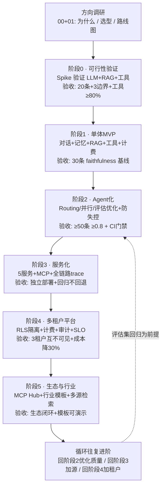

# 企业级多租户智能客服 Agent 平台 · 演进准则与验收（总纲）

> **收尾总纲。** 前面的 `01~07` 把"为什么做 → 方向选型 → 阶段 0~5"讲完了。本文不再新增技术内容，而是把整条路线的**演进纪律**抽出来，做成全项目的"对表页"：
>
> ① **演进式架构的核心准则**——先从最简方案跑通 + 评估、由真实约束驱动升级、每阶段可独立部署验收、演进而非推翻；
> ② **跨阶段验收总表**——把 00~07 每个阶段的验收清单汇总成一张总表；
> ③ **演进路线图**——7 次进阶的完整闭环（mermaid）；
> ④ **给初学者的实践纪律**——每周 Git 提交、每阶段写笔记、卡壳去附录/理论补基础。
>
> 阅读前置：`00-README.md` → 按顺序读完 `01-方向调研与选型.md` ~ `07-阶段5-生态化与行业.md` → **本文（演进准则与验收）**。
>
> 一句话：**把"怎么做完"的路线，升级为"怎么做对、怎么不翻车、怎么持续演进"的纪律。**

---

## 一、企业级演进式架构的核心准则

> 四准则回答了四件事：**起步怎么起步（最简）、升级什么时候升（被约束逼）、怎么算合格（可独立验收）、资产怎么积累（演进不推翻）。** 每个准则都给出"在本文档路线里的落地位置"，对得上才有说服力。

### 1.1 准则一：先从最简方案跑通 + 评估

- **含义**：每个阶段先做"能跑的最简版本"，跑通后立刻用该阶段的评估口径量化结果，再决定下一步。**没有评估集的改动都是玄学**（教程/12-评估闭环与Prompt版本管理）。
- **落地对照**：
  - 阶段 0：用 1~2 周**可丢弃的 Spike** 验证"LLM + RAG + 工具"可行不可行，结论比代码重要（`02-阶段0-可行性验证.md`）；
  - 阶段 1：用**单体**把"流式对话 → 记忆 → RAG → 工具 → 计费 → 评估"一次串通，跑出 faithfulness 基线（`03-阶段1-单体MVP.md` §步骤6）；
  - 阶段 2 起：**改 prompt 必须先跑评估、评估不过 CI 不准合代码**（`04-阶段2-Agent化与评估.md` §步骤6）。
- **为什么**：最简方案把最大的不确定性提前暴露（如"真实数据上答得准不准"），返工成本最低；评估口径让"好/坏"有数字，不凭感觉。

### 1.2 准则二：由真实约束驱动升级（不预演、不跟风）

- **含义**：升级不是"技术上新了所以升"，而是**真实约束出现才升**。每条演进触发都要能说清"是哪个业务 / 规模 / 合规约束逼出来的"。
- **落地对照**（触发信号都在各阶段文档 §6）：
  - 阶段 3 拆分服务 ← 负载特性 / 变更频率 / 独立团队的**真实差异**（`04-阶段2-Agent化与评估.md` §6）；
  - 阶段 4 多租户 ← **第二个客户 / 合规要求来了**（`05-阶段3-服务化拆分.md` §6）；
  - 阶段 5 行业模板 ← **出现金融 / 医疗 / 法律行业需求**（`06-阶段4-平台化多租户.md` §6）。
- **反模式**：过早微服务（教程/19-自研vs框架的边界 §6.3）、为炫技而 Agent 化（理论/09-企业级Java-AI架构选型真相"Workflow > Agent"）。

### 1.3 准则三：每阶段可独立部署验收

- **含义**：每个阶段是一个**完整闭环**：有产出、有可勾选的验收标准、可独立部署 / 演示、有明确的演进触发。上一步产出是下一步输入，但不依赖"还没做的能力"。
- **落地对照**：
  - 每个阶段文档第 5 节都是"**验收标准（可勾选、可量化）**"，全部打勾才算完成；
  - 每个阶段文档第 6 节都有"**演进触发**"决策树：通过 → 下一阶段；不通过 → 本阶段内迭代（一次只改一个变量）；
  - 阶段 3 的 5 个服务、阶段 4 的平台都可用 **Docker Compose 一键起**（可部署、可演示）。

### 1.4 准则四：演进而非推翻

- **含义**：后一阶段复用前一阶段的资产，**不推倒重来**。资产包括：评估集、表结构、心智模型、代码边界、血缘数据。
- **落地对照**：
  - **评估集一路演进**：阶段 0 雏形 20 条 → 阶段 1 扩到 30 条 → 阶段 2 扩到 ≥50 条 → 每阶段回归"不回退"；
  - **表结构一路演进**：阶段 1 `conversation/message/token_usage` → 阶段 2 加 `eval_case/eval_run/workflow_log` → 阶段 4 加 `tenant/quota/billing_record/audit_log` → 阶段 5 加 `mcp_server/template`；
  - **tenant_id 一路演进**：阶段 1 写死 `demo` → 阶段 3 打通透传链路 → 阶段 4 变成硬约束 + RLS 兜底；
  - 每个阶段文档开头那句"**承接上一阶段**"，就是"演进而非推翻"的显式声明。

### 1.5 三条贯穿性纪律（所有阶段通用）

1. **评估驱动**：任何 Prompt / 检索 / 模型 / 编排改动，先跑对应评估集再决定（教程/12-评估闭环与Prompt版本管理）。
2. **一次只改一个变量**：改完重跑"失败用例 + 全量评估集"，用 `eval_run` 对比前后分定位（各阶段文档 §6 迭代原则）。
3. **可观测随写随埋**：trace / 血缘 / 成本从第一行代码就埋，不等到上线前补（教程/15-可观测性与成本治理、教程/07-MCP-Server高阶与生态 §1.7）。

---

## 二、跨阶段验收总表

> 汇总 00~07 各阶段的验收清单，作为全项目的"对表页"。更细的勾选项见各阶段文档第 5 节。

| 阶段 | 文档 | 核心问题 | 验收锚点（量化） | 演进触发信号 |
|---|---|---|---|---|
| 方向调研 | `01` | 做对方向、选对技术栈 | 能说出为什么是 Spring AI 2.0 + pgvector + MCP | 读完即进入阶段 0 |
| 阶段 0 · 可行性验证 | `02` | 骨架能不能跑 | 20 条知识库全答、3 条边界正确、工具调用 ≥80%、写清可行/不可行结论 | 通过 → 阶段 1；不通过 → 本阶段内迭代再验 |
| 阶段 1 · 单体 MVP | `03` | 对话闭环 + 评估基线 | 流式逐字、重启不丢会话、RAG 带引用 + 拒答、工具 ≥80%、30 条评估集跑出 faithfulness 基线 | 通过 → 阶段 2 |
| 阶段 2 · Agent 化 | `04` | 会不会编排办事 | 路由分类 ≥8/10、并行可演示、评估优化有回炉、≥50 条评估集 faithfulness ≥0.8、评估进 CI | 触发：独立扩缩/独立团队需求 → 阶段 3 |
| 阶段 3 · 服务化 | `05` | 拆了能不能独立 | 5 服务独立部署、docker compose 一键起、MCP 工具可消费、trace 贯穿 5 服务、熔断/限流/降级、阶段 2 回归不回退 | 触发：第二个客户/合规要求 → 阶段 4 |
| 阶段 4 · 多租户平台 | `06` | 能不能卖多家企业 | 3 租户隔离互不可见（RLS 兜底）、配额熔断、计费准确率 100%、Prompt Cache + 路由降成本 ≥30%、审计合规、SLO（≥99.9% / P95<5s / faithfulness≥0.85）、阶段 3 回归不回退 | 触发：行业需求 → 阶段 5 |
| 阶段 5 · 生态与行业 | `07` | 敢不敢开放 | 生态闭环（模拟第三方接入成功）、3 行业模板可演示、多源检索 Agent faithfulness ≥0.85 + 引用覆盖率有数、管数分离无 PII 泄漏、**CI 流水线 + 一键部署 + 回滚（CICD/K8s 生产交付）**、阶段 2/4 回归不回退 | 首轮验收通过 → 循环往复进阶 |

> 使用方式：想确认"我现在做到哪了 / 该不该进下一阶段"，就对照这一行 + 对应阶段文档第 5 节逐条打勾。数字口径与各阶段文档一致，跨文档对齐，不做第二套口径。

---

## 三、演进路线图（7 次进阶的完整闭环）

> 与 `00-README.md` 第三节的线性路线图不同，这里补上每阶段的**验收锚点**和收尾的**循环往复进阶**，是"完整闭环"视图。主链 7 次进阶：方向调研 → 阶段 0 → 阶段 1 → 阶段 2 → 阶段 3 → 阶段 4 → 阶段 5 → 循环。

> 读图：主链一条直线走到阶段 5，然后**不结束**——虚线箭头回到阶段 2，进入"循环往复进阶"（这也是 `07` 的收尾方式）。每个节点的"验收"即该阶段第 5 节的可勾选项：**验收不过 → 在本阶段内迭代再验，不带欠账进下一阶段**（各阶段文档 §6）；这是"演进而非推翻"在节奏上的体现。

---

## 四、给初学者的实践纪律

> 前面三节是"路线怎么走"，这一节是"人怎么坚持"。三条纪律分别管**提交**（可回退）、**记录**（可复用）、**补课**（不卡死），再加三条心法。

### 4.1 每周 Git 提交（小步快跑、可回退）

- 把每个阶段拆成"**每周一个可提交的里程碑**"，做完就跑测试 + 评估集，通过就 `git commit`。
- 遵循全库 `教程/28-AI项目的Git工作流`：分支模型、commit 规范（Prompt / Model / Data 变更强制字段）、PR 带 Eval 报告。
- 作用：出问题能回退到上个里程碑；Git 历史就是项目笔记的骨架。
- 提交节奏参考：

| 阶段 | 提交动作 | 必入库的资产 |
|---|---|---|
| 阶段 0 | 每周末把"实测现象 + 结论"提交 | Spike 验证记录 + 评估集雏形（20 条） |
| 阶段 1 | 每完成一个步骤提交一次 | `baseline-stage1.yml` 必须入库 |
| 阶段 2+ | 每步 + 每次评估报告提交 | `eval_run` 报告、prompt 版本、ADR |

### 4.2 每阶段写笔记（产出即笔记）

- 每个阶段结束时，把"踩过的坑 + 修正的认知 + 评估数字"写进本目录，成为项目资产。
- 格式参考各阶段文档：**一句话目标 → 关键决策 → 验收数字 → 踩坑**。别写感想，写"现象 + 原因 + 结论"（对齐阶段 0 的三个心智模型记录法）。
- 作用：笔记即下一阶段的输入；**验证过但没记录 = 没验证**（阶段 0 §7）。

### 4.3 卡壳去附录 / 理论补基础

- 动手阶段卡住，先回看该阶段的"**前置知识**"表和"**踩坑与排错**"表（各阶段 §2 / §7）。
- 基础概念卡住，去 `附录/` 补底层（`附录/Reactor响应式编程` → 阶段 1 流式；`附录/事件溯源与CQRS专题` → 阶段 4 会话/审计；`附录/Docker与工具` → 环境与部署；提示词与 Agent 模式直接读 `教程/23-Prompt工程深入` + `教程/02-Tool与AgentLoop`（原 `附录/Agent与提示词工程专题` 大部分已归档，仅保留速查手册）。
- 顺序：**先附录补地基，再理论补原理，最后回教程动手**——按"卡壳 → 附录 → 理论"的顺序补，最省时间，不打断主线节奏（呼应 `00-README.md` 第四节第 3 条）。

### 4.4 三条心法（比技术更重要的纪律）

1. **不要跳阶段**：每个阶段验收通过才进下一阶段，带着欠账往前跑，后面会连环翻车。
2. **一次只改一个变量**：检索 / 评估 / Prompt 各阶段都强调，改完用评估集对比定位，别同时改多个参数。
3. **先评估、后优化**：阶段 2 起，改动任何 Prompt / 检索 / 模型，先跑一遍评估集（教程/12-评估闭环与Prompt版本管理），否则不算完成。

---

> **知识来源汇总**：本文不引入新技术，是对 `01~07` 与全库既有结论的归纳——准则部分依据 `教程/12-评估闭环与Prompt版本管理`（评估驱动）、`教程/19-自研vs框架的边界`（过早微服务反模式）、`理论/09-企业级Java-AI架构选型真相`（Workflow > Agent）；实践纪律部分依据 `教程/28-AI项目的Git工作流`（提交/分支/PR 规范）、各阶段文档 §7（踩坑心态）；各阶段验收口径直接引自 `02~07` 第 5 节。
>
> 全项目文档至此闭环：`00-README`（索引）→ `01`（方向）→ `02~07`（阶段 0~5）→ **本文 08（演进准则与验收）**。
>
> 下一步：回到 `00-README.md` 第四节，按顺序把 01 → 阶段 0 → 阶段 1 跑起来；跑的过程中卡住，再回看本文第四节（给初学者的实践纪律）。
