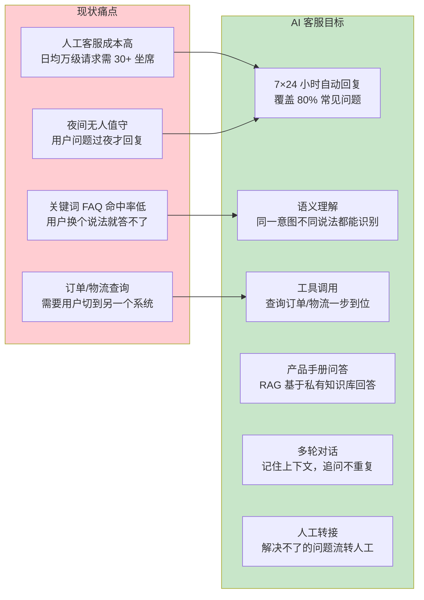
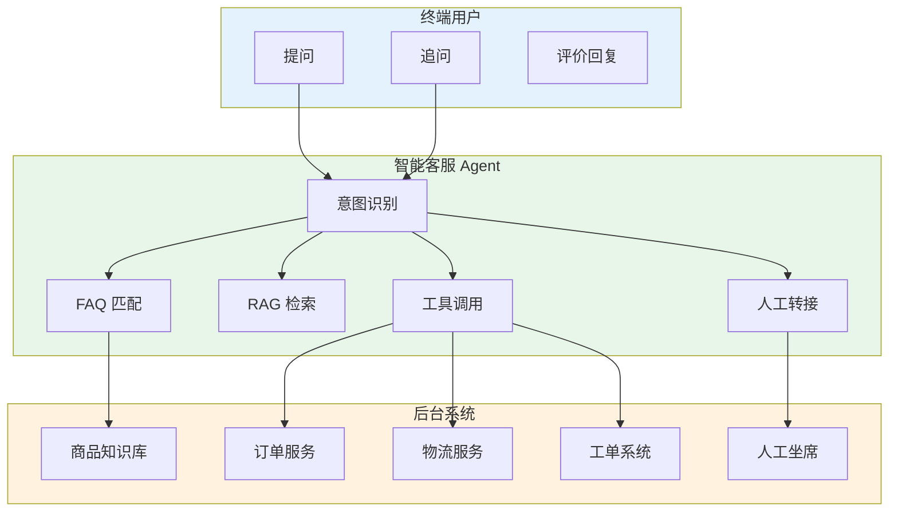
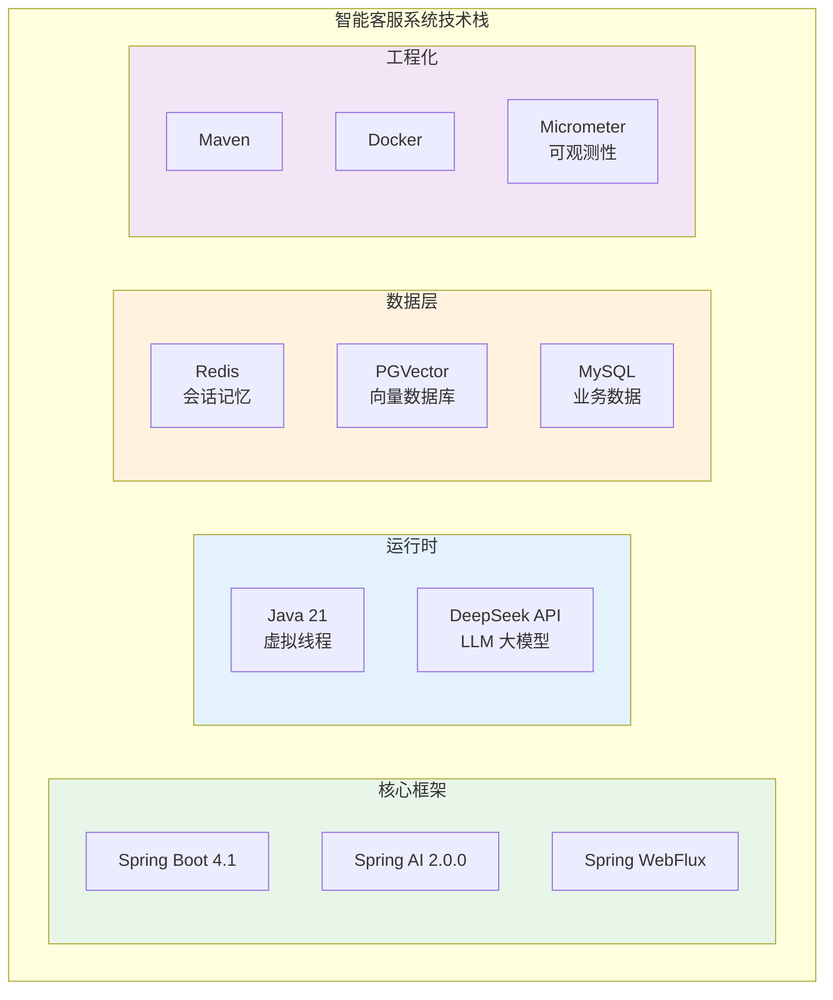
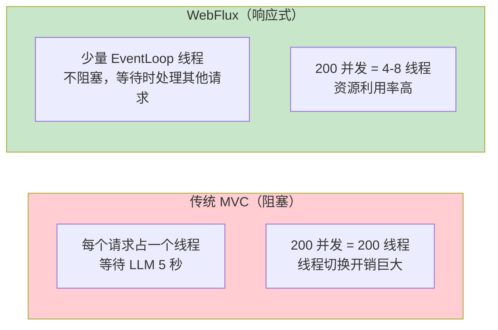
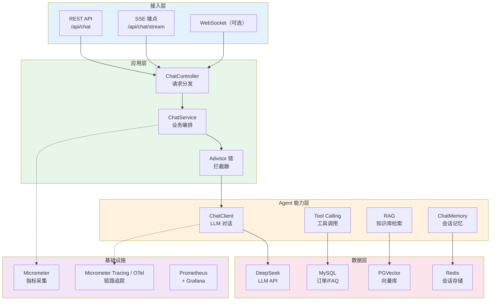
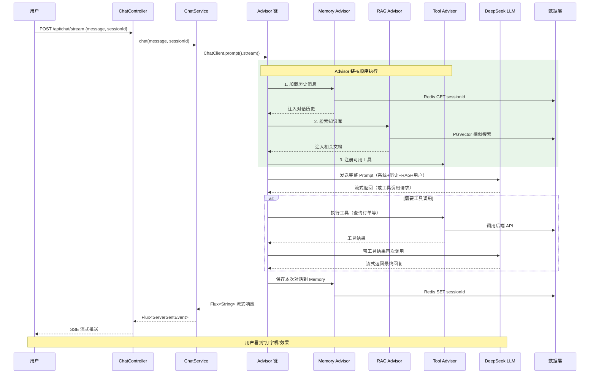

# 00-需求分析与架构设计

> **定位**：从业务需求出发，完整推演一个"智能客服系统"的架构设计——业务场景拆解、技术选型理由、分层架构图、API 设计、迭代路线。读完这篇，你对该项目"做什么、怎么做、分几步做"有全貌认知。
>
> **读者画像**：有 Spring Boot 经验的 Java 开发者，希望用 Spring AI 构建一个可落地的企业级 AI 应用。
>
> **前置阅读**：[教程 00-Agent 核心概念](../../教程/00-Agent核心概念.md)、[教程 01-Spring AI 框架入门](../../教程/01-Spring-AI框架入门.md)。

---

## ★ 阅读顺序总览（文件名编号 = 实际阅读顺序）

> 本子文件夹共 11 个文件，**文件名编号 00-10 即阅读顺序**，按「全貌/起步 → 主体迭代 → 进阶迭代 → 支撑参考 → 前沿」五个阶段推进：

| 阶段 | 文件 | 读者定位 |
|------|------|---------|
| ① 全貌/起步 | 00-需求分析与架构设计、01-最小Demo搭建 | **先读再动手**：00 看懂目标架构与迭代路线，01 跑通最小闭环（SSE 流式对话） |
| ② 主体迭代 | 02-工具集成、03-RAG知识库、04-记忆与会话、05-核心代码讲解 | **严格顺序**：工具 → RAG → 记忆逐层叠加，每篇过验收再前进；05 是主体迭代的代码地图与设计复盘 |
| ③ 进阶迭代 | 06-意图识别与多轮对话深化、07-坐席协同与HITL深化、08-客服数据飞轮与满意度评估 | **进阶顺序**：意图分流/槽位/压缩 → 转人工/工具审批/坐席辅助/质检 → 官方 Evaluator/金标闸门/灰度飞轮 |
| ④ 支撑参考 | 09-ADR架构决策记录 | **按需查阅**：12 条决策资产（上下文/备选/取舍/可回滚），读完 08 后复盘最佳 |
| ⑤ 前沿 | 10-工业前沿与演进方向 | **收官扩展**：2026 行业共识对照本项目找缺口 + 项目收官 |

> 按此顺序，读者从「知道客服系统长什么样」一路走到「能自我改进的数据飞轮系统」。

---

## 1. 业务场景

### 1.1 场景描述

我们要为一个中型电商平台构建智能客服系统。用户在购物过程中会产生大量咨询：商品参数、退换货政策、物流状态、订单异常、促销活动……传统的人工客服成本高、响应慢，而"FAQ 关键词匹配"的旧方案命中率低、维护成本高。

用 AI Agent 重建客服系统，核心目标是：



### 1.2 量化指标

这个系统不是玩具 demo，它有明确的工程指标：

| 指标 | 目标值 | 说明 |
|------|--------|------|
| 日均请求量 | 10,000+ | 峰值 50 QPS |
| 自动解决率 | ≥ 80% | 不需要人工介入 |
| 首字延迟（TTFT） | < 1 秒 | SSE 流式输出 |
| 平均会话轮数 | 3-5 轮 | 多轮对话深度 |
| 知识库召回准确率 | ≥ 90% | RAG Top-3 命中 |
| 系统可用性 | 99.9% | 高可用部署 |

这些指标直接影响后续的每一个架构决策——为什么选 WebFlux（高并发）、为什么用 SSE（低延迟）、为什么需要 RAG（准确率）、为什么需要 ChatMemory（多轮对话）。

---

## 2. 用户故事与核心用例

### 2.1 典型对话场景

**场景一：商品咨询**

```
用户：你们家那个空气炸锅能用锡纸吗？
客服：可以的，XX 型号空气炸锅支持使用锡纸。
      建议放在炸篮底部接油，不要遮挡热风循环。
用户：那能烤整个红薯吗？
客服：可以，建议 200 度烤 40 分钟左右，
      中途翻面一次更均匀。
```

这个场景需要 RAG——"能不能用锡纸"在产品手册的"使用注意事项"章节，关键词匹配找不到，但向量检索能召回。

**场景二：订单查询**

```
用户：我的订单到哪了？单号 SF20240812001
客服：[调用物流查询工具]
      您的订单正在派送中，预计今天 18:00 前送达，
      快递员电话 138xxxx。
```

这个场景需要工具调用——查实时物流必须调 API，LLM 的训练数据里不可能有今天的快递状态。

**场景三：退换货咨询（多轮）**

```
用户：买的衣服尺码小了能换吗？
客服：可以换的，支持 7 天无理由换货。
      请问您的订单号是？
用户：DD202408100045
客服：[调用订单查询工具]
      该订单支持换货。已为您创建换货工单 T045，
      请将原商品寄回，收到后 3 个工作日内发出新尺码。
用户：换大一码的。
客服：好的，已更新工单备注：换 XL 码。
```

这个场景需要多轮记忆 + 工具调用结合——记住用户说的订单号、换货需求，最后执行操作。

### 2.2 用例图



---

## 3. 技术选型

### 3.1 选型全景



### 3.2 每个选型的决策理由

#### Spring Boot 4.1 + Spring AI 2.0.0

Spring AI 是 Spring 官方 AI 应用框架，2.0.0 版本提供了统一 Tool Calling、Advisor 链、ChatMemory、RAG、结构化输出等 Agent 必备能力。

为什么不用 LangChain4j？Spring AI 是 Spring 原生的——自动配置、依赖注入、Micrometer 可观测性无缝集成，与 Spring Boot 4.1 组合零摩擦。对已有 Spring 技术栈的团队来说，学习成本最低。

> 「遇到阻塞？→ [教程 01-Spring AI 框架入门](../../教程/01-Spring-AI框架入门.md)」

#### Spring WebFlux（响应式）

客服系统峰值 50 QPS，如果用传统 MVC + 同步阻塞，每个请求等待 LLM 响应（2-10 秒），线程池需要几百个线程。WebFlux 基于 Reactor，少量线程处理大量并发——SSE 流式响应天然契合响应式流（Flux）。



#### Java 21

Java 21 的虚拟线程（Virtual Thread）让响应式代码更简洁——`Mono.fromCallable()` 内部阻塞调用也能高效运行。Record、Pattern Matching、Switch Expression 让代码更简洁。

#### DeepSeek API

DeepSeek 提供高性价比的 LLM 能力，支持 Function Calling、流式输出。Spring AI 通过 `spring-ai-deepseek` 依赖集成，API 兼容 OpenAI 格式，迁移成本低。

#### Redis（会话记忆）

ChatMemory 默认用内存存储，进程重启即丢失。客服场景需要跨重启的多轮对话，Redis 提供高性能 KV 存储和 TTL 自动过期（24 小时会话保留）。

#### PGVector（向量数据库）

基于 PostgreSQL 的向量扩展，不需要额外引入 Milvus/Qdrant。客服系统的向量数据量（产品手册、FAQ）在万级别，PGVector 完全够用，且能复用 MySQL 团队的运维经验。

> 「遇到阻塞？→ [教程 06-向量数据库选型](../../教程/06-向量数据库选型.md)」

---

## 4. 系统架构设计

### 4.1 分层架构



### 4.2 请求处理流程

一个用户消息进来后的完整链路：



这个流程图展示了 Advisor 链的核心作用——Memory、RAG、Tool 三个能力作为拦截器，在 LLM 调用前注入上下文，调用后持久化结果。

> 「遇到阻塞？→ [教程 14-Advisor 链与拦截器](../../教程/14-Advisor链与拦截器.md)」

---

## 5. API 设计

### 5.1 REST 接口清单

| 接口 | 方法 | 路径 | 说明 |
|------|------|------|------|
| 对话（同步） | POST | `/api/chat` | 阻塞式，返回完整回复 |
| 对话（流式） | POST | `/api/chat/stream` | SSE 流式，打字机效果 |
| 创建会话 | POST | `/api/session` | 返回 sessionId |
| 查询历史 | GET | `/api/session/{id}/messages` | 分页获取历史消息 |
| 会话反馈 | POST | `/api/feedback` | 用户评分/投诉 |
| 健康检查 | GET | `/actuator/health` | 运行时探针 |

### 5.2 核心接口数据结构

**对话请求**：

```java
public record ChatRequest(
    String sessionId,      // 会话 ID（可选，首次对话为空）
    String message,        // 用户消息
    String userId          // 用户标识（用于个性化）
) {}
```

**对话响应（同步）**：

```java
public record ChatResponse(
    String sessionId,      // 会话 ID（首次生成）
    String reply,          // AI 回复
    List<String> sources,  // RAG 引用来源
    boolean needHuman,     // 是否需要转人工
    long latencyMs         // 响应耗时（毫秒）
) {}
```

**SSE 流式事件**：

```java
// SSE 事件类型
public enum SSEEventType {
    TOKEN,       // 文本片段
    TOOL_CALL,   // 工具调用通知
    SOURCE,      // RAG 引用来源
    DONE,        // 回复结束
    ERROR        // 错误
}

public record SSEEvent(
    SSEEventType type,
    String content,
    Map<String, Object> metadata
) {}
```

### 5.3 SSE 接口设计

```java
@PostMapping(value = "/api/chat/stream", produces = MediaType.TEXT_EVENT_STREAM_VALUE)
public Flux<ServerSentEvent<String>> chatStream(@RequestBody ChatRequest request) {
    return chatService.chat(request)
        .map(token -> ServerSentEvent.<String>builder()
            .event("token")
            .data(token)
            .build())
        .concatWith(Mono.just(ServerSentEvent.<String>builder()
            .event("done")
            .data("[DONE]")
            .build()));
}
```

这里用 `Flux<ServerSentEvent<String>>` 而非 `Flux<String>`——因为 SSE 支持事件类型（event field），前端可以区分 token / tool_call / done 等不同事件。

> 「遇到阻塞？→ [教程 10-SSE 流式通信](../../教程/10-SSE流式通信.md)」

---

## 6. 迭代路线

这个项目不追求一步到位，而是从最小 Demo 开始，每个迭代增加一层能力：

```mermaid
graph LR
    subgraph 第0步["第 0 步"]
        S0["需求分析与<br/>架构设计<br/>（本文档）"]
    end

    subgraph 第1步["第 1 步：最小 Demo"]
        S1["ChatClient + WebFlux<br/>跑通基础对话<br/>SSE 流式输出"]
    end

    subgraph 第2步["第 2 步：工具集成"]
        S2["FAQ 查询工具<br/>订单查询工具<br/>让 Agent 能执行操作"]
    end

    subgraph 第3步["第 3 步：RAG 知识库"]
        S3["产品手册向量化<br/>相似度检索<br/>私有知识问答"]
    end

    subgraph 第4步["第 4 步：记忆与会话"]
        S4["ChatMemory + Redis<br/>多轮对话<br/>上下文工程"]
    end

    subgraph 第5步["第 5 步：代码精讲"]
        S5["关键代码全解析<br/>架构决策回顾"]
    end

    subgraph 第6步["第 6 步：进阶迭代"]
        S6["意图路由与槽位<br/>坐席协同与 HITL<br/>评估与数据飞轮"]
    end

    subgraph 第7步["第 7 步：决策与前沿"]
        S7["ADR 决策资产<br/>工业前沿演进"]
    end

    S0 --> S1 --> S2 --> S3 --> S4 --> S5 --> S6 --> S7

    style 第0步 fill:#e3f2fd
    style 第1步 fill:#e8f5e9
    style 第2步 fill:#fff3e0
    style 第3步 fill:#fce4ec
    style 第4步 fill:#f3e5f5
    style 第5步 fill:#e0f7fa
    style 第6步 fill:#ede7f6
    style 第7步 fill:#fbe9e7
```



| 迭代 | 产出 | 对应文档 | 新增能力 |
|------|------|---------|---------|
| 最小 Demo | 单轮对话 + SSE | [01-最小 Demo 搭建](01-最小Demo搭建.md) | ChatClient 基础调用 |
| 迭代一 | 工具集成 | [02-工具集成](02-工具集成.md) | FAQ、订单查询 |
| 迭代二 | RAG 知识库 | [03-RAG 知识库](03-RAG知识库.md) | 向量检索问答 |
| 迭代三 | 记忆与会话 | [04-记忆与会话](04-记忆与会话.md) | 多轮对话、Redis 持久化 |
| 代码精讲 | 代码地图与复盘 | [05-核心代码讲解](05-核心代码讲解.md) | 设计意图精讲 |
| 进阶一 | 意图与多轮深化 | [06-意图识别与多轮对话深化](06-意图识别与多轮对话深化.md) | 意图三级分流、槽位填充、长会话压缩 |
| 进阶二 | 坐席协同与 HITL | [07-坐席协同与HITL深化](07-坐席协同与HITL深化.md) | 转人工、工具审批、坐席辅助、质检 |
| 进阶三 | 评估与数据飞轮 | [08-客服数据飞轮与满意度评估](08-客服数据飞轮与满意度评估.md) | 官方 Evaluator、金标闸门、灰度飞轮 |
| 支撑参考 | ADR 决策资产 | [09-ADR架构决策记录](09-ADR架构决策记录.md) | 12 条架构决策记录 |
| 前沿收官 | 演进方向 | [10-工业前沿与演进方向](10-工业前沿与演进方向.md) | 2026 前沿映射与项目收官 |

每一迭代都可独立运行，前一步是后一步的基础。按顺序阅读，每一步的新增代码不超过 100 行。

---

## 7. 项目结构

```
smart-customer-service/
├── src/main/java/com/example/customer/
│   ├── config/                 # 配置类
│   │   ├── ChatClientConfig.java       # ChatClient Bean 定义
│   │   ├── VectorStoreConfig.java      # 向量库配置
│   │   └── RedisMemoryConfig.java      # Redis 记忆配置
│   ├── controller/             # 接口层
│   │   └── ChatController.java         # REST + SSE 端点
│   ├── service/                # 业务层
│   │   └── ChatService.java            # 对话编排
│   ├── tools/                  # 工具定义
│   │   ├── FaqQueryTool.java           # FAQ 查询
│   │   ├── OrderQueryTool.java         # 订单查询
│   │   └── LogisticsTool.java          # 物流查询
│   ├── model/                  # 数据模型
│   │   ├── ChatRequest.java
│   │   ├── ChatResponse.java
│   │   └── FaqItem.java
│   └── advisor/                # 自定义 Advisor
│       └── ContextLimitAdvisor.java    # 上下文长度控制
├── src/main/resources/
│   ├── application.yml         # 主配置
│   ├── prompts/                # Prompt 模板
│   │   └── system.st           # 系统提示词
│   └── data/                   # 知识库源文件
│       ├── product-manual.md
│       └── faq.json
└── pom.xml
```

---

## 8. 关键约束与设计原则

### 8.1 Prompt 先行原则

这个项目的系统提示词（System Prompt）是核心资产——它定义了 Agent 的人格、行为边界、工具使用策略。我们用一个独立的 `.st` 模板文件管理它，不写死在代码里。

```text
你是 XX 电商平台的智能客服助手，名字叫小智。

你的职责：
1. 回答用户关于商品、订单、物流、售后的问题
2. 当需要查询实时信息时，主动调用对应工具
3. 当无法确定答案时，诚实告知并建议转人工

你的语气：专业、友好、简洁，不啰嗦。

你的约束：
- 不要编造订单号、物流信息
- 涉及退款/赔偿时，先确认订单再操作
- 用户情绪激动时，先安抚再解决问题
```

### 8.2 渐进式复杂度

每一层能力（工具 / RAG / 记忆）通过 Advisor 注入，可以独立开关。开发和调试时，可以只开工具不开 RAG，快速定位问题。

### 8.3 可观测性优先

每个请求必须记录：耗时、Token 用量、工具调用次数、RAG 命中文档数。Micrometer + Spring AI 的原生 Observation 能力开箱即用，不需要额外编码。

> 「遇到阻塞？→ [教程 22-全链路可观测性](../../教程/22-全链路可观测性.md)」

---

## 9. 总结

本文档完成了智能客服系统的顶层设计：

1. **业务场景**——电商客服日均万级请求，目标 80% 自动解决率
2. **技术选型**——Spring Boot 4.1 + Spring AI 2.0 + WebFlux + DeepSeek，每一项都有明确理由
3. **分层架构**——接入层 / 应用层 / Agent 能力层 / 数据层，职责清晰
4. **请求流程**——Advisor 链串起 Memory、RAG、Tool 三个核心能力
5. **API 设计**——同步 + SSE 流式双接口，SSE 事件类型支持工具调用通知
6. **迭代路线**——从最小 Demo 到完整系统，四步渐进

下一篇 [01-最小 Demo 搭建](01-最小Demo搭建.md) 将从零搭建项目骨架，跑通第一个 ChatClient + WebFlux + SSE 流式对话。

---

## 8. 代码使用说明（照抄前必读）

本项目的代码遵循「项目文档不生成 .java 文件、代码由用户手写」的规范，因此：

1. **框架 API 全部真实**：Spring AI 2.0.0 的 `ChatClient`/`@Tool`/`CallAdvisor`/`ChatMemory` 等均按 [附录 05-SpringAI2-API基准] 的真实签名书写，可照抄编译；标注「⚠ 修正」处为审计后对齐的基准写法。
2. **自定义业务类是"概念骨架"**：如 `ToolRegistry`、`SessionMemory`、`GatewayContext`、`AuditHashChain` 等为本项目专属业务类，文档给出关键方法骨架与设计意图，**具体业务实现（存储/序列化/加解密等）需你按文档思路补齐**——这正是学习目标（理解架构后手写）。
3. **依赖标注**：凡引入 pom.xml 未声明的新依赖，均标注「需在 pom.xml 中添加依赖」并给出完整 `<dependency>` 片段。
4. **WebFlux 一致性**：所有代码遵循响应式铁律（Reactor Context 传请求上下文、禁 ThreadLocal、EventLoop 上禁 block、阻塞调用收敛到 boundedElastic）；Redis 记忆因 `ChatMemoryRepository` 是同步 SPI 而用同步 `RedisTemplate`（见 04 迭代三 §2.3）。
5. **演进式阅读**：每个迭代篇都从"上一版痛点"出发，回答"新增需求→影响模块→架构演进"三问，请按 `00 → 01 → 02 → ...` 顺序阅读，不要跳读最终版。
