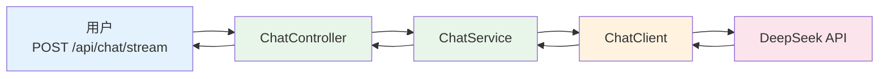
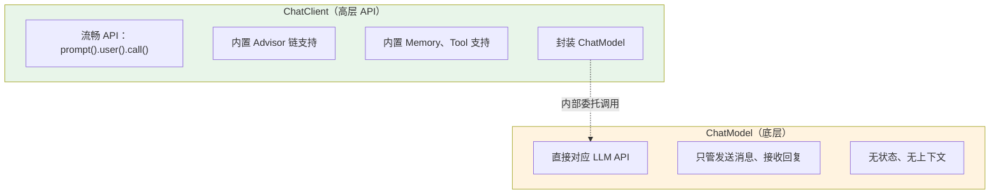
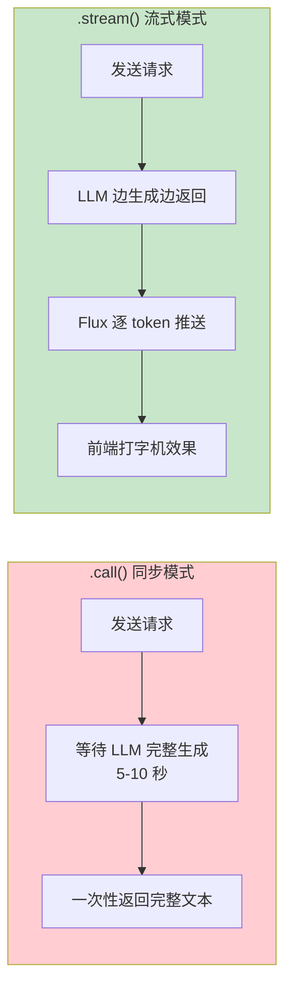
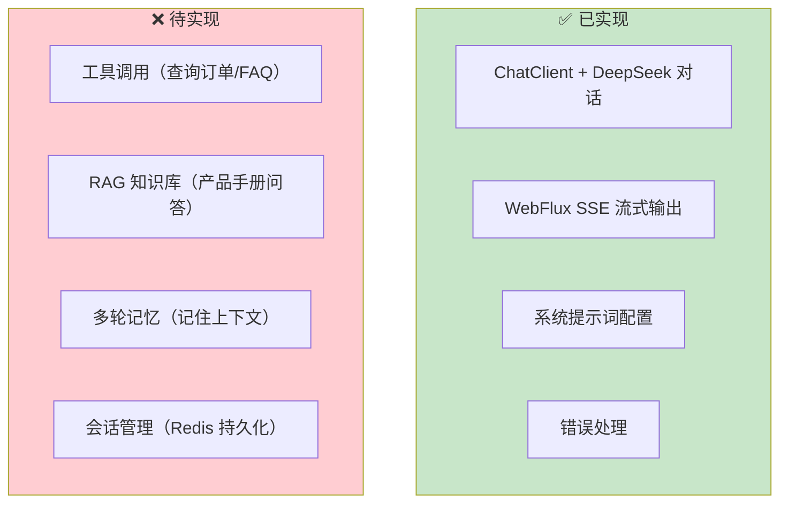

# 01-最小 Demo 搭建

> **定位**：从零创建 Spring Boot 4.1 + Spring AI 2.0 项目骨架，实现最简 ChatClient + WebFlux + SSE 流式对话接口。读完这篇，你能跑通"用户提问 → AI 流式回复"的完整链路，这是后续所有迭代的基座。
>
> **读者画像**：刚读完需求分析，准备动手写代码的开发者。
>
> **前置阅读**：[00-需求分析与架构设计](00-需求分析与架构设计.md)。
>
> **关联教程**：[教程 01-Spring AI 框架入门](../../教程/01-Spring-AI框架入门.md)、[教程 02-ChatClient 与对话模型](../../教程/02-ChatClient与对话模型.md)、[教程 09-SSE 流式通信](../../教程/09-SSE流式通信.md)。

---

## 1. 本篇目标

这一步只做一件事：**让用户能跟 AI 客服说上话**。不查数据库、不调工具、不管多轮记忆——纯粹的 LLM 对话 + SSE 流式输出。



四个文件搞定：`pom.xml`、`application.yml`、`ChatController.java`、`ChatService.java`。

---

## 2. 项目初始化

### 2.1 Maven 依赖

`pom.xml` 核心依赖：

```xml
<parent>
    <groupId>org.springframework.boot</groupId>
    <artifactId>spring-boot-starter-parent</artifactId>
    <version>4.1.0</version>
</parent>

<properties>
    <java.version>21</java.version>
    <spring-ai.version>2.0.0</spring-ai.version>
</properties>

<dependencies>
    <!-- WebFlux：响应式 Web 框架，支持 SSE 流式 -->
    <dependency>
        <groupId>org.springframework.boot</groupId>
        <artifactId>spring-boot-starter-webflux</artifactId>
    </dependency>

    <!-- Spring AI DeepSeek Starter：自动配置 ChatClient -->
    <dependency>
        <groupId>org.springframework.ai</groupId>
        <artifactId>spring-ai-starter-model-deepseek</artifactId>
    </dependency>
</dependencies>

<dependencyManagement>
    <dependencies>
        <dependency>
            <groupId>org.springframework.ai</groupId>
            <artifactId>spring-ai-bom</artifactId>
            <version>${spring-ai.version}</version>
            <type>pom</type>
            <scope>import</scope>
        </dependency>
    </dependencies>
</dependencyManagement>
```

关键点解析：

- **WebFlux 而非 Web MVC**——WebFlux 的 `Flux` 类型天然支持 SSE 流式推送，MVC 做流式需要 `SseEmitter` 或 `ResponseBodyEmitter`，不如 WebFlux 干净。
- **`spring-ai-starter-model-deepseek`**——这是 Spring AI 2.0 的 DeepSeek 自动配置 Starter，引入后 Spring Boot 会自动创建 `ChatModel` 和 `ChatClient.Builder` Bean。
- **Java 21**——开启虚拟线程，配合 WebFlux 让阻塞式调用也能高效运行。

> 「遇到阻塞？→ [教程 01-Spring AI 框架入门：项目初始化章节](../../教程/01-Spring-AI框架入门.md)」

### 2.2 配置文件

`application.yml`：

```yaml
spring:
  ai:
    deepseek:
      api-key: ${DEEPSEEK_API_KEY}        # 从环境变量读取，不写死
      chat:
        options:
          model: deepseek-chat             # 使用对话模型
          temperature: 0.7                 # 客服场景需要一定稳定性
          max-tokens: 1024                 # 单次回复上限
  threads:
    virtual:
      enabled: true                        # 开启虚拟线程

server:
  port: 8080
```

`temperature` 的选择：客服场景需要稳定、准确的回答，不要花式创意。0.7 是一个平衡点——既有一定灵活性（同义改写），又不会胡说八道。如果你的 FAQ 覆盖率高，可以降到 0.3。

### 2.3 系统提示词

在 `src/main/resources/prompts/system.st` 中定义 Agent 人格：

```text
你是"小智"，XX 电商平台的智能客服助手。

职责：
- 回答用户关于商品、订单、物流、售后的问题
- 保持专业、友好、简洁的语气
- 不确定时诚实告知，不编造信息

当前时间：{current_time}
```

用独立文件管理 Prompt 有三个好处：修改不重新编译、方便 A/B 测试不同版本、非技术人员也能参与调优。

---

## 3. ChatClient 配置

### 3.1 ChatClient Bean 定义

Spring AI 的 Starter 会自动注入 `ChatClient.Builder`，我们需要用它在启动时构建一个配置好默认行为的 `ChatClient` Bean。

```java
@Configuration
public class ChatClientConfig {

    @Bean
    public ChatClient chatClient(ChatClient.Builder builder) {
        return builder
            .defaultSystem("""
                你是"小智"，XX 电商平台的智能客服助手。
                保持专业、友好、简洁的语气。
                不确定时诚实告知，不编造信息。
                """)
            // .defaultTools(...)       // 迭代一加入
            // .defaultAdvisors(...)    // 迭代二、三加入
            .build();
    }
}
```

为什么在 Bean 定义时就设 `defaultSystem` 而不是每次调用时设？因为客服的系统提示词是全局固定的，所有对话共用同一套人格设定。在 Bean 层面设好，Controller 里就不用每次重复。

> 「遇到阻塞？→ [教程 02-ChatClient 与对话模型：ChatClient 创建方式](../../教程/02-ChatClient与对话模型.md)」

### 3.2 ChatClient vs ChatModel

初学者容易混淆这两个概念：



**结论**：在 Agent 应用中，始终使用 `ChatClient`，不要直接用 `ChatModel`。ChatClient 的 Advisor 链、Tool 注册、Memory 集成是 Agent 能力的基石。

---

## 4. 业务层：ChatService

`ChatService` 是业务编排的核心，负责调用 ChatClient 并返回响应流。

```java
@Service
public class ChatService {

    private final ChatClient chatClient;

    public ChatService(ChatClient chatClient) {
        this.chatClient = chatClient;
    }

    /**
     * 流式对话——核心方法
     * 返回 Flux<String>，每个元素是一个文本片段
     */
    public Flux<String> chat(String userMessage) {
        return chatClient.prompt()
            .user(userMessage)
            .stream()           // 切换到流式模式
            .content();         // 提取文本内容流
    }

    /**
     * 同步对话——备用方法
     * 阻塞等待完整回复后返回
     */
    public Mono<String> chatSync(String userMessage) {
        return Mono.fromCallable(() ->
            chatClient.prompt()
                .user(userMessage)
                .call()          // 同步调用
                .content()
        ).subscribeOn(Schedulers.boundedElastic());  // 在阻塞线程池执行
    }
}
```

关键点详解：

**`.stream()` vs `.call()`**



`.stream()` 返回 `ChatClient.ChatClientRequest.StreamSpec`，其 `.content()` 方法返回 `Flux<String>`——每个元素是 LLM 输出的一个 token 片段。这就是 SSE 流式输出的数据源。

**`Mono.fromCallable` + `Schedulers.boundedElastic`**

同步方法 `chatSync` 用了 `Mono.fromCallable` 包装阻塞调用——因为 `chatClient.call()` 是阻塞的，直接在响应式线程中调用会阻塞 EventLoop。`subscribeOn(Schedulers.boundedElastic())` 将阻塞操作切换到专用线程池，保护响应式管道。

> 「遇到阻塞？→ [教程 09-SSE 流式通信：WebFlux 流式响应](../../教程/09-SSE流式通信.md)」

---

## 5. 接口层：ChatController

### 5.1 SSE 流式端点

```java
@RestController
@RequestMapping("/api/chat")
public class ChatController {

    private final ChatService chatService;

    public ChatController(ChatService chatService) {
        this.chatService = chatService;
    }

    /**
     * SSE 流式对话
     * produces 必须设为 text/event-stream
     */
    @PostMapping(value = "/stream", produces = MediaType.TEXT_EVENT_STREAM_VALUE)
    public Flux<ServerSentEvent<String>> chatStream(@RequestBody ChatRequest request) {
        return chatService.chat(request.message())
            .map(token -> ServerSentEvent.<String>builder()
                .event("token")         // 事件类型：文本片段
                .data(token)
                .build())
            .concatWith(Mono.just(
                ServerSentEvent.<String>builder()
                    .event("done")      // 事件类型：结束标记
                    .data("[DONE]")
                    .build()
            ))
            .onErrorResume(ex -> Flux.just(
                ServerSentEvent.<String>builder()
                    .event("error")
                    .data("服务暂时不可用，请稍后重试")
                    .build()
            ));
    }
}
```

逐行解析：

**`produces = MediaType.TEXT_EVENT_STREAM_VALUE`**——声明这是 SSE 端点，浏览器 `EventSource` 会自动识别。如果不设这个，Spring WebFlux 不知道用 SSE 编解码器。

**`ServerSentEvent<String>`**——Spring 对 SSE 事件的封装，包含 `event`（事件类型）、`data`（数据）、`id`（事件 ID）、`retry`（重试间隔）四个字段。用 `event` 字段区分不同类型的事件（token / done / error），前端根据类型分别处理。

**`.concatWith()`**——在 token 流末尾追加一个 done 事件。`concatWith` 保证顺序——先发完所有 token，再发 done。如果用 `mergeWith`，done 可能提前发出。

**`.onErrorResume()`**——流式响应中的异常处理。如果 LLM API 超时或报错，不能让连接静默断开，而要发一个 error 事件让前端感知。

### 5.2 数据模型

```java
public record ChatRequest(
    String sessionId,   // 首次对话可为 null
    String message,     // 用户消息
    String userId       // 用户标识
) {}
```

用 Java 21 的 `record`——一行定义不可变 DTO，自动生成构造器、getter、equals、hashCode、toString。

### 5.3 前端如何消费 SSE

给前端同学的对接说明：

```javascript
const eventSource = new EventSource('/api/chat/stream', {
    // 注意：EventSource 只支持 GET
    // POST 需要用 fetch + ReadableStream
});

// 用 fetch 方式（支持 POST）
const response = await fetch('/api/chat/stream', {
    method: 'POST',
    headers: { 'Content-Type': 'application/json' },
    body: JSON.stringify({ message: '你好' })
});

const reader = response.body.getReader();
const decoder = new TextDecoder();

while (true) {
    const { done, value } = await reader.read();
    if (done) break;

    const text = decoder.decode(value);
    // 解析 SSE 事件格式
    const lines = text.split('\n');
    for (const line of lines) {
        if (line.startsWith('event:token')) {
            // 追加文本到页面
        } else if (line.startsWith('event:done')) {
            // 回复结束
        }
    }
}
```

SSE 端点用 POST 而非 GET——因为用户消息可能很长（几百字），GET 的 URL 长度有限制，且消息体放 URL 不安全。但 `EventSource` 只支持 GET，所以前端需要用 `fetch` + `ReadableStream` 手动解析 SSE 格式。

> 「遇到阻塞？→ [教程 09-SSE 流式通信：前端 EventSource 对接](../../教程/09-SSE流式通信.md)」

---

## 6. 验证 Demo

### 6.1 启动应用

```bash
export DEEPSEEK_API_KEY=sk-your-api-key
mvn spring-boot:run
```

### 6.2 测试 SSE 端点

用 `curl` 测试（`-N` 禁用缓冲，实时看到流式输出）：

```bash
curl -N -X POST http://localhost:8080/api/chat/stream \
  -H "Content-Type: application/json" \
  -d '{"message": "你好，你们客服工作时间是什么时候？"}'
```

你会看到 SSE 事件逐行返回：

```
event:token
data:您好

event:token
data:！我们的

event:token
data:客服工作时间是

event:token
data：每天 9:00-22:00。

event:done
data:[DONE]
```

如果看到完整的打字机效果——恭喜，最小 Demo 跑通了。

### 6.3 常见问题排查

| 问题 | 原因 | 解决 |
|------|------|------|
| 401 Unauthorized | API Key 错误 | 检查环境变量 `DEEPSEEK_API_KEY` |
| 连接超时 | 网络不通或代理 | 检查 DeepSeek API 可达性 |
| 无流式效果，一次性返回 | 缓冲未禁用 | curl 加 `-N`，或检查 Nginx `proxy_buffering off` |
| `Flux` 报错找不到类 | WebFlux 依赖缺失 | 确认引入 `spring-boot-starter-webflux` |

---

## 7. 当前状态与不足



当前 Demo 的核心问题：

1. **无记忆**——用户说"我刚才那个订单"，AI 不知道"刚才"指什么
2. **无工具**——用户问"我的订单到哪了"，AI 只能说"请提供订单号"，不能主动查询
3. **无知识库**——用户问产品参数，AI 可能编造信息（幻觉）

这三个问题分别在后续三个迭代中解决。

---

## 8. 小结

本篇从零搭建了智能客服系统的骨架：

- **项目初始化**——`pom.xml`（WebFlux + Spring AI DeepSeek）、`application.yml`（模型配置）、系统提示词文件
- **ChatClient 配置**——通过 `ChatClient.Builder` 设默认 System Prompt，构建全局 ChatClient Bean
- **ChatService**——`chatClient.prompt().user().stream().content()` 获取 `Flux<String>` 流式响应
- **ChatController**——`Flux<ServerSentEvent<String>>` 返回 SSE 事件流，token / done / error 三类事件
- **验证**——curl `-N` 测试，确认打字机效果正常

下一篇 [02-迭代一-工具集成](02-迭代一-工具集成.md) 将为 Agent 加入 FAQ 查询和订单查询工具，让它能"执行操作"而不只是"说话"。
