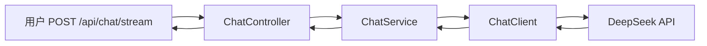

# 项目 00：智能客服系统 — 01-最小 Demo 搭建

> **定位**：从零创建 Spring Boot 4.1 + Spring AI 2.0 项目骨架，实现最简 ChatClient + WebFlux + SSE 流式对话接口。读完这篇，你能跑通「用户提问 → AI 流式回复」完整链路。本文给出**完整可手写代码**（一行不省略）。
> **读者画像**：刚读完需求分析，准备动手写代码的开发者。
> **前置阅读**：[00-需求分析与架构设计]。
> **关联教程**：[教程 01-Spring AI 框架入门]、[教程 02-ChatClient 与对话模型]、[教程 10-SSE 流式通信]；API 真实性以 [附录 05-SpringAI2-API基准] 为准。

---

## 1. 本篇目标

让用户能跟 AI 客服说上话。不查库、不调工具、不管多轮记忆——纯 LLM 对话 + SSE 流式输出。



四个文件：`pom.xml`、`application.yml`、`ChatController.java`、`ChatService.java`。

## 2. 完整代码（照抄即可）

### 2.1 `pom.xml`

```xml
<?xml version="1.0" encoding="UTF-8"?>
<project xmlns="http://maven.apache.org/POM/4.0.0"
         xmlns:xsi="http://www.w3.org/2001/XMLSchema-instance"
         xsi:schemaLocation="http://maven.apache.org/POM/4.0.0 https://maven.apache.org/xsd/maven-4.0.0.xsd">
    <modelVersion>4.0.0</modelVersion>
    <parent>
        <groupId>org.springframework.boot</groupId>
        <artifactId>spring-boot-starter-parent</artifactId>
        <version>4.1.0</version>
        <relativePath/>
    </parent>
    <groupId>com.shop</groupId>
    <artifactId>customer-service</artifactId>
    <version>0.1.0</version>

    <properties>
        <java.version>21</java.version>
    </properties>

    <dependencyManagement>
        <dependencies>
            <dependency>
                <groupId>org.springframework.ai</groupId>
                <artifactId>spring-ai-bom</artifactId>
                <version>2.0.0</version>
                <type>pom</type>
                <scope>import</scope>
            </dependency>
        </dependencies>
    </dependencyManagement>

    <dependencies>
        <dependency>
            <groupId>org.springframework.boot</groupId>
            <artifactId>spring-boot-starter-webflux</artifactId>
        </dependency>
        <dependency>
            <groupId>org.springframework.ai</groupId>
            <artifactId>spring-ai-starter-model-openai</artifactId>
        </dependency>
        <dependency>
            <groupId>org.projectlombok</groupId>
            <artifactId>lombok</artifactId>
            <optional>true</optional>
        </dependency>
        <dependency>
            <groupId>org.springframework.boot</groupId>
            <artifactId>spring-boot-starter-test</artifactId>
            <scope>test</scope>
        </dependency>
    </dependencies>
</project>
```

### 2.2 `application.yml`

```yaml
spring:
  application:
    name: customer-service
  ai:
    openai:
      base-url: https://api.deepseek.com          # DeepSeek 兼容 OpenAI 协议
      api-key: ${DEEPSEEK_API_KEY}                # 环境变量，不落明文
      chat:
        model: deepseek-chat          # Spring AI 2.0.0：无 options 中缀，参数直挂
server:
  port: 8080
```

### 2.3 `CustomerServiceApplication.java`

```java
package com.shop.customer;

import org.springframework.boot.SpringApplication;
import org.springframework.boot.autoconfigure.SpringBootApplication;

@SpringBootApplication
public class CustomerServiceApplication {
    public static void main(String[] args) {
        SpringApplication.run(CustomerServiceApplication.class, args);
    }
}
```

### 2.4 `ChatController.java`（WebFlux + SSE 流式）

```java
package com.shop.customer.web;

import com.shop.customer.service.ChatService;
import org.springframework.web.bind.annotation.*;
import reactor.core.publisher.Flux;
import reactor.core.publisher.Mono;

@RestController
@RequestMapping("/api")
public class ChatController {

    private final ChatService chatService;

    public ChatController(ChatService chatService) {
        this.chatService = chatService;
    }

    // 一次性对话（阻塞 LLM 调用收敛到 boundedElastic，不占 EventLoop）
    @PostMapping("/chat")
    public Mono<String> chat(@RequestParam String sessionId, @RequestBody String message) {
        return chatService.chat(sessionId, message);
    }

    // 流式对话（SSE）
    @PostMapping(value = "/chat/stream", produces = "text/event-stream")
    public Flux<String> chatStream(@RequestParam String sessionId, @RequestBody String message) {
        return chatService.chatStream(sessionId, message);
    }
}
```

### 2.5 `ChatService.java`

```java
package com.shop.customer.service;

import org.springframework.ai.chat.client.ChatClient;
import org.springframework.stereotype.Service;
import reactor.core.publisher.Flux;
import reactor.core.publisher.Mono;
import reactor.core.scheduler.Schedulers;

@Service
public class ChatService {

    private final ChatClient chatClient;

    public ChatService(ChatClient chatClient) {
        this.chatClient = chatClient;
    }

    // 同步一次性对话：call() 是阻塞调用，收敛到 boundedElastic（WebFlux 铁律）
    public Mono<String> chat(String sessionId, String message) {
        return Mono.fromCallable(() -> chatClient.prompt()
                .user(message)
                .call()
                .content())
                .subscribeOn(Schedulers.boundedElastic());
    }

    public Flux<String> chatStream(String sessionId, String message) {
        return chatClient.prompt()
                .user(message)
                .stream()
                .content();
    }
}
```

> 本迭代会话 ID 尚未用（无记忆）；`sessionId` 参数先占位，迭代三接入 ChatMemory 时用它。

### 2.6 运行

```sh
export DEEPSEEK_API_KEY=sk-xxx
mvn spring-boot:run
# 测试：
# curl -X POST "http://localhost:8080/api/chat" -H "Content-Type: text/plain" -d "你好"
# curl -X POST "http://localhost:8080/api/chat/stream" -H "Content-Type: text/plain" -d "你好"  # 流式
```

## 3. 验证包（手工测试与验证）
**前置条件**：`demo` 启动成功（8080 端口）；`DEEPSEEK_API_KEY` 已配置。

**材料 A——curl 命令**：

```bash
curl -X POST "http://localhost:8080/api/chat" -H "Content-Type: text/plain" -d "你好"
curl -N -X POST "http://localhost:8080/api/chat/stream" -H "Content-Type: text/plain" -d "你好"
```

**步骤与断言**：

| # | 操作 | 预期（PASS 判据） |
|---|------|------------------|
| 1 | 材料A 第一条 | 200 返回完整中文回答（JSON/text 均可，内容非空非报错） |
| 2 | 材料A 第二条（-N 关缓冲） | SSE 流式收到多个增量 data: 块（≥3 块），非一次性整段 |
| 3 | 发送空字符串 | 明确 4xx/提示，不 500 |

**失败排查**：①401→Key 未注入环境；②一次性整段→Flux 被某层聚合（检查是否误用 block/call().content()）；③500→WebClient 超时（模型服务不可达）。


> **定位回顾**：本篇搭建基座。下一站 [02-迭代一-工具集成]——给客服加查 FAQ、查订单、查物流三个工具。
