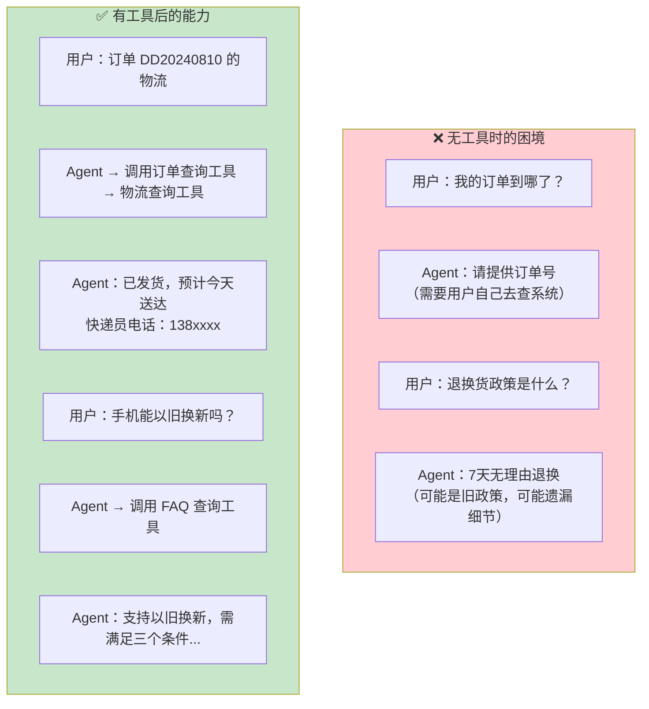
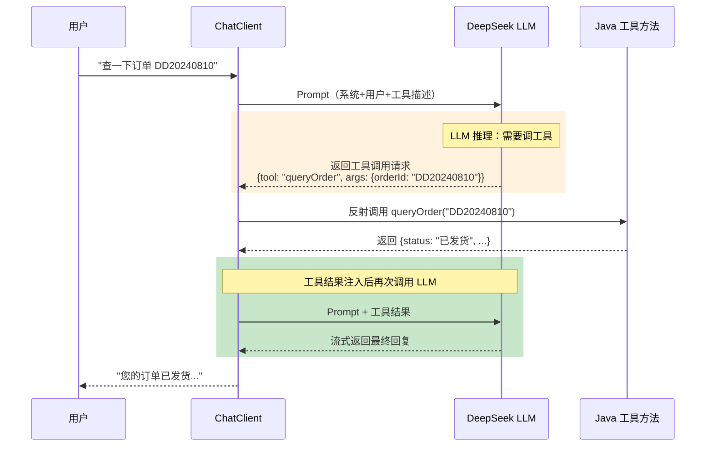
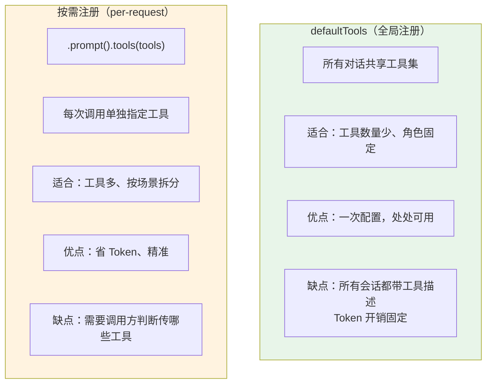
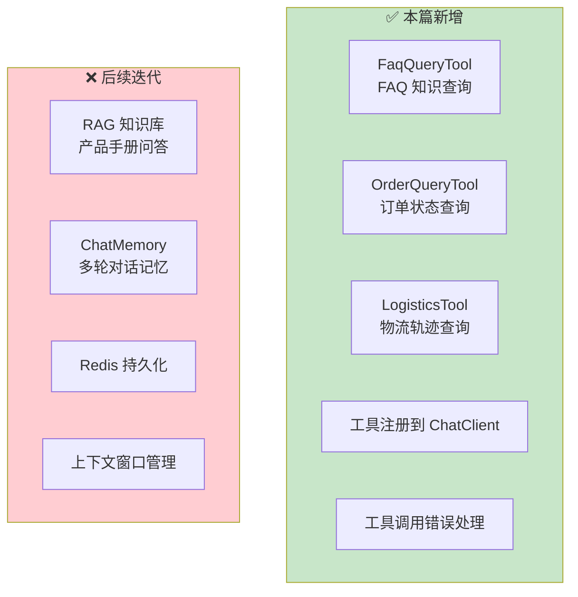
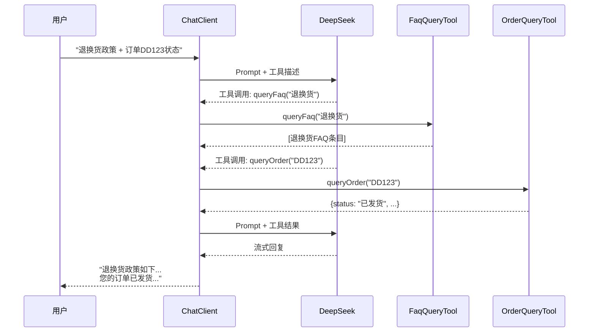

# 02-迭代一：工具集成

> **定位**：为客服 Agent 加入两个实战工具——FAQ 知识查询和订单状态查询，让 Agent 从"只会说"升级为"能做事"。涵盖 @Tool 注解定义、工具注册策略、结构化输出校验、工具调用全流程追踪。读完这篇，你的客服 Agent 能查 FAQ、查订单、主动决定何时调工具。
>
> **读者画像**：已跑通最小 Demo，准备让 Agent 具备业务操作能力。
>
> **前置阅读**：[01-最小 Demo 搭建](01-最小Demo搭建.md)。
>
> **关联教程**：[教程 03-工具调用](../../教程/03-工具调用.md)、[教程 12-结构化输出](../../教程/12-结构化输出.md)。

---

## 1. 为什么要加工具

最小 Demo 里的 Agent 是个"话痨"——什么问题都只用 LLM 的内置知识回答。但客服场景中，大量信息是**实时、私有、需要查询的**：



本篇加入两个工具：

| 工具 | 功能 | 数据源 |
|------|------|--------|
| `queryFaq` | 根据关键词查询 FAQ | 预置 FAQ 列表（后续可换数据库） |
| `queryOrder` | 根据订单号查询订单状态 | 模拟订单服务 |

---

## 2. 工具调用机制回顾

在写代码前，先理清 Spring AI 2.0 的工具调用完整链路：



关键理解：**LLM 不直接执行代码，它只是决定"调什么工具、传什么参数"。真正的执行由 Spring AI 框架通过反射调用你的 Java 方法。** LLM 看到的是工具的 JSON Schema 描述，根据用户意图选择最合适的工具。

> 「遇到阻塞？→ [教程 03-工具调用：工具调用循环机制](../../教程/03-工具调用.md)」

---

## 3. 定义工具一：FAQ 查询

### 3.1 FAQ 数据模型

先定义 FAQ 的数据结构，用结构化输出保证 LLM 返回的数据可靠：

```java
public record FaqItem(
    String question,        // FAQ 问题
    String answer,          // FAQ 回答
    String category,        // 分类：售后/物流/商品/账户
    List<String> tags       // 标签：用于匹配
) {}
```

### 3.2 FAQ 工具类

```java
@Component
public class FaqQueryTool {

    // 实际项目中从数据库加载，这里用模拟数据
    private final List<FaqItem> faqDatabase = List.of(
        new FaqItem(
            "退换货政策",
            "7天内支持无理由退换货，15天内支持质量问题换货。需保持商品完好，配件齐全。",
            "售后",
            List.of("退货", "换货", "退款", "7天", "无理由")
        ),
        new FaqItem(
            "运费规则",
            "满 99 元包邮，不满收取 8 元运费。偏远地区（新疆/西藏/青海）加收 15 元。",
            "物流",
            List.of("运费", "包邮", "邮费")
        ),
        new FaqItem(
            "以旧换新",
            "手机品类支持以旧换新：1. 旧机需能正常开机 2. 屏幕无碎裂 3. 抵扣金额评估后到账。",
            "售后",
            List.of("以旧换新", "旧手机", "抵扣")
        )
    );

    @Tool(description = """
        根据关键词查询常见问题(FAQ)知识库。
        当用户询问退换货政策、运费规则、售后政策等常见问题时使用此工具。
        参数 keywords 是用户问题的中文关键词。
        """)
    public List<FaqItem> queryFaq(String keywords) {
        return faqDatabase.stream()
            .filter(faq -> matchesKeywords(faq, keywords))
            .limit(3)    // 最多返回 3 条，避免上下文爆炸
            .toList();
    }

    private boolean matchesKeywords(FaqItem faq, String keywords) {
        String lowerKeywords = keywords.toLowerCase();
        return faq.tags().stream()
            .anyMatch(tag -> lowerKeywords.contains(tag.toLowerCase())
                          || tag.toLowerCase().contains(lowerKeywords))
            || faq.question().contains(keywords);
    }
}
```

逐段解析：

**`@Tool(description = "...")`**

这是给 LLM 看的——Spring AI 会自动把这个 description 转成 JSON Schema，随请求发给 LLM。description 写得越清楚，LLM 越能准确判断"什么时候该调这个工具"。

三个原则：
1. **说清能力边界**——"查询常见问题(FAQ)知识库"，不要只写"查询"
2. **说清适用场景**——"当用户询问退换货政策、运费规则时"
3. **说清参数含义**——"keywords 是中文关键词"

**`@Component` 注解**

Spring AI 的 `@Tool` 方法需要在 Spring Bean 中定义。标记为 `@Component` 后，Spring Boot 自动创建实例，ChatClient 配置时可以注入并注册。

**`.limit(3)`**

返回结果截断——工具返回的数据会注入 LLM 上下文。如果 FAQ 有 100 条全部返回，上下文窗口直接爆炸。控制工具返回长度是上下文工程的基本功。

> 「遇到阻塞？→ [教程 29-上下文工程](../../教程/29-上下文工程.md)」

---

## 4. 定义工具二：订单查询

### 4.1 订单数据模型

```java
public record OrderInfo(
    String orderId,          // 订单号
    String status,           // 状态：待付款/已付款/已发货/已签收/已取消
    String productName,      // 商品名称
    BigDecimal amount,       // 金额
    String logisticsInfo,    // 物流信息摘要
    LocalDateTime createTime,// 下单时间
    String trackingNumber    // 快递单号
) {}
```

### 4.2 订单查询工具

```java
@Component
public class OrderQueryTool {

    @Tool(description = """
        根据订单号查询订单状态和物流信息。
        当用户提供订单号并询问订单状态、物流进度时使用此工具。
        参数 orderId 是订单编号，格式如 DD20240810001。
        如果用户没有提供订单号，不要调用此工具，而是请用户提供。
        """)
    public OrderInfo queryOrder(String orderId) {
        // 实际项目中调用订单服务 API
        // 这里用模拟数据演示
        return mockOrderService(orderId);
    }

    private OrderInfo mockOrderService(String orderId) {
        return new OrderInfo(
            orderId,
            "已发货",
            "空气炸锅 5.5L",
            new BigDecimal("299.00"),
            "顺丰快递，预计今日 18:00 前送达",
            LocalDateTime.of(2024, 8, 10, 14, 30),
            "SF1234567890"
        );
    }
}
```

关键设计：

**"如果用户没有提供订单号，不要调用此工具"**

这句话非常关键——没有它，LLM 可能会自己编一个订单号去调用工具，或者传空字符串。明确告诉 LLM "缺参数时先问用户"，可以避免无意义的工具调用。

### 4.3 物流查询工具（进阶）

```java
@Component
public class LogisticsTool {

    @Tool(description = """
        根据快递单号查询实时物流轨迹。
        当用户询问快递到哪了、什么时候送达时使用。
        参数 trackingNumber 是快递单号。
        """)
    public String queryLogistics(String trackingNumber) {
        // 实际调用物流 API（顺丰/中通等）
        return """
            快递单号：%s
            当前状态：派送中
            最新轨迹：2024-08-12 09:15 到达【XX营业点】
            预计送达：今日 18:00 前
            派件员：张师傅 138-xxxx-xxxx
            """.formatted(trackingNumber);
    }
}
```

注意物流工具返回的是 `String` 而非复杂对象——因为物流信息是给 LLM 看的文本（要转述给用户），不需要结构化。保持返回类型简单。

---

## 5. 工具注册到 ChatClient

### 5.1 修改 ChatClientConfig

在最小 Demo 的基础上，加入工具注册：

```java
@Configuration
public class ChatClientConfig {

    @Bean
    public ChatClient chatClient(
            ChatClient.Builder builder,
            FaqQueryTool faqTool,
            OrderQueryTool orderTool,
            LogisticsTool logisticsTool) {

        return builder
            .defaultSystem("""
                你是"小智"，XX 电商平台的智能客服助手。
                保持专业、友好、简洁的语气。
                不确定时诚实告知，不编造信息。
                当用户的提问涉及订单、物流、退换货等可查询的信息时，
                主动使用对应工具查询，不要凭记忆回答。
                """)
            .defaultTools(faqTool, orderTool, logisticsTool)
            // .defaultAdvisors(...)  // 迭代二、三加入
            .build();
    }
}
```

**`.defaultTools(...)`**——注册工具对象。Spring AI 2.0 会自动扫描这些对象上标注了 `@Tool` 的方法，生成 JSON Schema，在每次 LLM 调用时附上工具描述。

**System Prompt 补充**——加入"主动使用对应工具"的指令。不加这句话的话，LLM 有时会直接用内置知识回答，而不是调用工具。

### 5.2 工具注册的两种方式



当前只有 3 个工具，用 `defaultTools` 全局注册最简单。后续如果工具增长到 10+ 个，可以按意图拆分：售前工具集 / 售后工具集 / 物流工具集，在 ChatService 里根据用户消息内容动态选择。

> 「遇到阻塞？→ [教程 03-工具调用：工具注册策略](../../教程/03-工具调用.md)」

---

## 6. 工具调用效果验证

### 6.1 FAQ 查询测试

```bash
curl -N -X POST http://localhost:8080/api/chat/stream \
  -H "Content-Type: application/json" \
  -d '{"message": "你们退换货政策是什么？超过7天还能换吗？"}'
```

预期行为：
1. LLM 识别到"退换货政策"→ 决定调用 `queryFaq("退换货")`
2. 框架执行 `queryFaq` → 返回退换货 FAQ 条目
3. LLM 基于 FAQ 内容回答用户

### 6.2 订单查询测试

```bash
curl -N -X POST http://localhost:8080/api/chat/stream \
  -H "Content-Type: application/json" \
  -d '{"message": "帮我查一下订单 DD20240810001 到哪了"}'
```

预期行为：
1. LLM 提取出订单号 "DD20240810001"
2. 调用 `queryOrder("DD20240810001")` → 获取订单状态 + 快递单号
3. 可能再调用 `queryLogistics("SF1234567890")` 查物流轨迹
4. 综合返回完整物流信息

### 6.3 缺参数场景测试

```bash
curl -N -X POST http://localhost:8080/api/chat/stream \
  -H "Content-Type: application/json" \
  -d '{"message": "帮我查一下我的订单"}'
```

预期行为：LLM **不调用工具**，而是回复"请提供您的订单号"。这就是 System Prompt 和工具描述中"没有订单号时不要调用工具"指令的效果。

---

## 7. 结构化输出保障

工具返回的是 Java 对象，LLM 需要正确理解这些字段。Spring AI 的结构化输出机制保障了这一环。

### 7.1 工具返回值的自动序列化

当 `queryOrder` 返回 `OrderInfo` 对象时，Spring AI 会自动将其序列化为 JSON：

```json
{
  "orderId": "DD20240810001",
  "status": "已发货",
  "productName": "空气炸锅 5.5L",
  "amount": 299.00,
  "logisticsInfo": "顺丰快递，预计今日 18:00 前送达",
  "createTime": "2024-08-10T14:30:00",
  "trackingNumber": "SF1234567890"
}
```

这个 JSON 作为 tool message 注入 LLM 上下文。LLM 看到结构化数据后，能准确提取信息转述给用户，而非编造。

### 7.2 自定义工具返回的 Prompt 引导

对于返回原始 String 的工具（如物流查询），可以在工具内部加格式化引导：

```java
@Tool(description = """
    根据快递单号查询实时物流轨迹。
    返回的文本包含：当前状态、最新轨迹、预计送达时间、派件员联系方式。
    """)
public String queryLogistics(String trackingNumber) {
    // 返回格式化的物流信息
    // description 中描述了返回内容结构，帮助 LLM 正确引用
}
```

description 中描述"返回什么内容"有助于 LLM 在后续推理中正确引用工具结果。

> 「遇到阻塞？→ [教程 12-结构化输出：工具返回值与结构化](../../教程/12-结构化输出.md)」

---

## 8. 工具调用的错误处理

工具调用不是 100% 成功的——数据库可能超时、API 可能 500。需要处理这些异常：

```java
@Tool(description = "根据订单号查询订单状态和物流信息。")
public OrderInfo queryOrder(String orderId) {
    try {
        return orderService.findById(orderId)
            .orElseThrow(() -> new NoSuchElementException("订单不存在: " + orderId));
    } catch (NoSuchElementException e) {
        // 返回 null 或抛异常，LLM 会据此回复用户
        throw e;  // Spring AI 会把异常信息传回 LLM
    } catch (Exception e) {
        // 系统异常，记录日志但不暴露细节给 LLM
        log.error("查询订单失败: {}", orderId, e);
        throw new RuntimeException("订单查询服务暂时不可用");
    }
}
```

Spring AI 的行为：工具抛异常时，异常消息（`e.getMessage()`）会作为 tool response 返回给 LLM。LLM 会据此调整回复——如果消息是"订单不存在"，LLM 会说"未找到该订单，请确认订单号"。

注意安全：**不要把数据库异常堆栈暴露给 LLM**——LLM 可能把堆栈信息复述给用户，造成信息泄露。对外异常消息要脱敏。

> 「遇到阻塞？→ [教程 37-响应式错误处理](../../教程/37-响应式错误处理.md)」

---

## 9. 当前架构状态



### 工具集成后的请求流程



注意 LLM 可能**连续调用多个工具**——一个消息中涉及多个信息需求时，DeepSeek 会依次发起工具调用请求，框架逐个执行后将结果汇总。

---

## 10. 小结

本篇为客服 Agent 加入了三个核心工具：

1. **FaqQueryTool**——查询 FAQ 知识库，`@Tool` 注解描述能力边界和适用场景，`.limit(3)` 控制返回量
2. **OrderQueryTool**——查询订单状态，工具描述中明确"缺参数时不调用"避免误调用
3. **LogisticsTool**——查询物流轨迹，返回结构化文本供 LLM 引用

核心知识点：

- `@Tool(description)` 是给 LLM 的"接口文档"，描述质量直接决定调用准确率
- `.defaultTools(...)` 全局注册适合工具少的场景，后续可改为按场景动态注册
- 工具异常消息会传回 LLM，要做好安全脱敏
- `description` 中描述返回内容结构，帮助 LLM 正确引用工具结果

当前不足：用户无法基于产品手册等长文档提问——FAQ 只覆盖了高频问题。下一篇 [03-迭代二-RAG 知识库](03-迭代二-RAG知识库.md) 将引入向量数据库和 RAG 检索，让 Agent 能回答任意产品文档相关问题。
