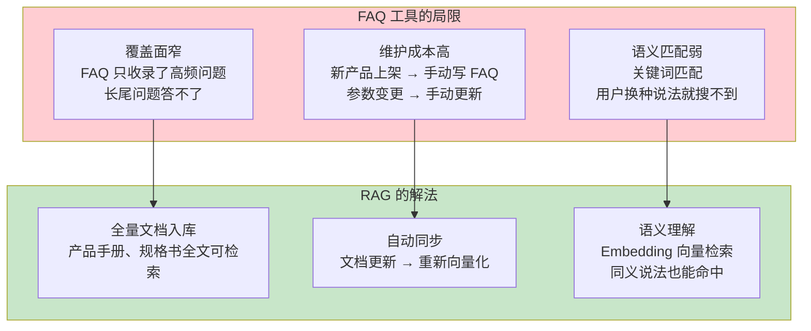
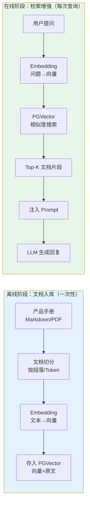
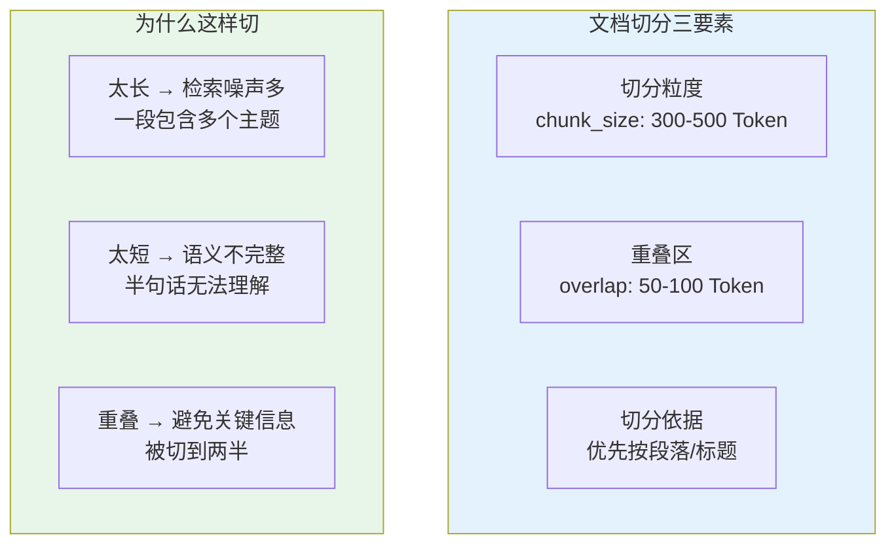
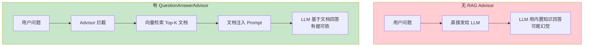
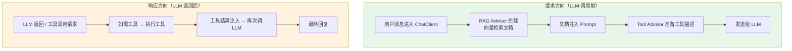
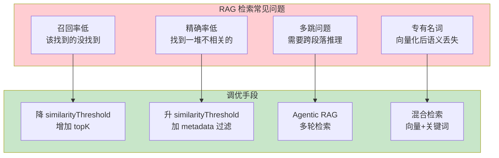
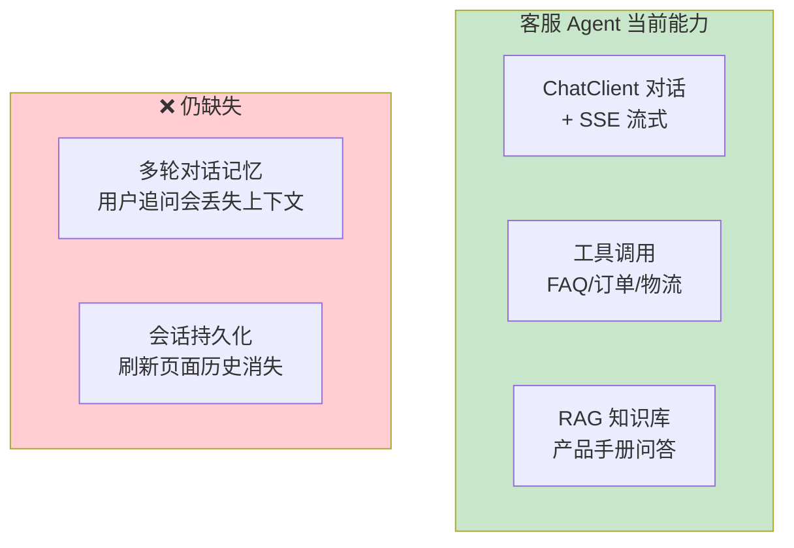
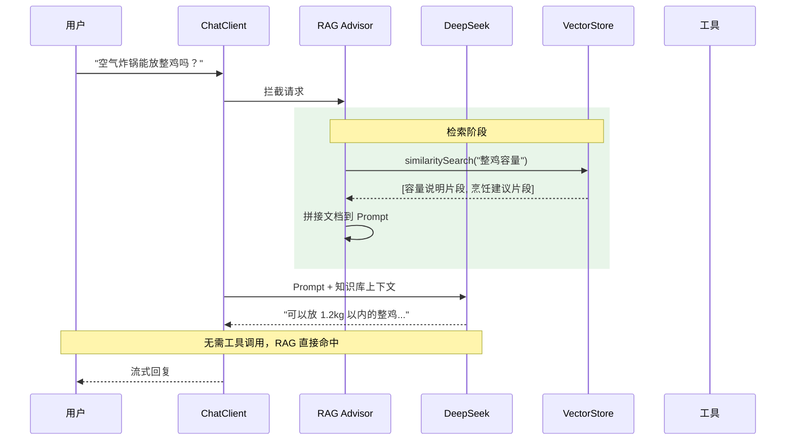

# 03-迭代二：RAG 知识库

> **定位**：为客服 Agent 接入向量数据库（PGVector），实现基于产品手册的智能问答。涵盖文档 ETL 流水线、Embedding 向量化、PGVector 配置、QuestionAnswerAdvisor 集成、检索质量调优。读完这篇，你的客服 Agent 不再局限于预置 FAQ，能回答任意产品文档中的问题。
>
> **读者画像**：已完成工具集成，需要让 Agent 具备"阅读长文档"的能力。
>
> **前置阅读**：[02-迭代一-工具集成](02-迭代一-工具集成.md)。
>
> **关联教程**：[教程 05-RAG 检索增强生成](../../教程/05-RAG检索增强生成.md)、[教程 30-高级 RAG 与 Agentic RAG](../../教程/30-高级RAG与AgenticRAG.md)。

---

## 1. FAQ 工具的局限

上一迭代加入了 FAQ 查询工具，但它有两个硬伤：



典型场景：用户问"空气炸锅 5.5L 型号能不能放下一整只鸡？"——FAQ 里没有这条，但产品手册的"容量说明"章节写了"可放入 1.5kg 食材"。RAG 能从手册中检索到这段内容并回答。

---

## 2. RAG 流水线全貌

RAG 不是一行代码搞定的，它分两个阶段：



本篇按这两个阶段分别实现。

> 「遇到阻塞？→ [教程 05-RAG 检索增强生成：RAG 流水线](../../教程/05-RAG检索增强生成.md)」

---

## 3. 离线阶段：文档向量化

### 3.1 准备知识库文档

在 `src/main/resources/data/` 下放置产品手册 `product-manual.md`：

```markdown
# 空气炸锅 5.5L 产品手册

## 第一章 产品概述
本产品为 XX 品牌 5.5L 大容量空气炸锅，采用高速热风循环技术...

## 第二章 使用指南
### 2.1 首次使用
1. 拆除所有包装材料
2. 用温水清洗炸篮和煎锅
3. 空烧 10 分钟去除出厂保护油（会有轻微气味，属正常现象）

### 2.2 烹饪建议
| 食材 | 温度 | 时间 | 容量 |
|------|------|------|------|
| 薯条 | 200°C | 15 分钟 | 500g |
| 鸡翅 | 190°C | 20 分钟 | 8 只 |
| 整鸡 | 180°C | 40 分钟 | 1.2kg 以内 |
| 红薯 | 200°C | 35 分钟 | 3-4 个 |

### 2.3 注意事项
- 可以使用锡纸，建议垫在炸篮底部接油，不要遮挡热风循环孔
- 烹饪中途建议翻面或摇晃炸篮，确保受热均匀
- 容量上限 1.5kg，超过会导致加热不均

## 第三章 清洁与保养
...
```

### 3.2 文档切分策略

整篇手册不能直接 Embedding——LLM 上下文有限，且检索精度要求片段足够"聚焦"。切分策略：



Spring AI 提供 `TokenTextSplitter`，开箱即用：

```java
@Configuration
public class VectorStoreConfig {

    @Bean
    public TokenTextSplitter textSplitter() {
        return new TokenTextSplitter(
            400,    // chunkSize：每段约 400 Token
            80,     // overlap：段间重叠 80 Token
            10,     // minChunkSizeChars：最小段长度
            5000,   // maxNumChunks：最大段数（防 OOM）
            true    // keepSeparator：保留段落分隔符
        );
    }
}
```

`chunkSize = 400` 的考量：产品手册的一段（如"注意事项"）通常 200-500 字，约 300-500 Token。400 是一个平衡点——一个片段包含一个完整子主题。

### 3.3 文档 ETL 流水线

Spring AI 的 ETL 三件套：`DocumentReader` → `DocumentSplitter` → `VectorStore`。

```java
@Component
public class KnowledgeBaseLoader {

    private final VectorStore vectorStore;
    private final TokenTextSplitter textSplitter;

    public KnowledgeBaseLoader(VectorStore vectorStore, TokenTextSplitter textSplitter) {
        this.vectorStore = vectorStore;
        this.textSplitter = textSplitter;
    }

    /**
     * 应用启动时自动加载产品手册到向量库
     */
    @PostConstruct
    public void loadKnowledgeBase() {
        // 1. 读取 Markdown 文档
        DocumentReader reader = new MarkdownDocumentReader(
            "classpath:data/product-manual.md"
        );
        List<Document> documents = reader.get();

        // 2. 切分
        List<Document> chunks = textSplitter.apply(documents);

        // 3. 给每个片段打元数据标签
        chunks.forEach(doc -> {
            doc.getMetadata().put("source", "product-manual");
            doc.getMetadata().put("category", "产品手册");
            doc.getMetadata().put("version", "v2.0");
        });

        // 4. 写入向量库（Spring AI 自动 Embedding + 存储）
        vectorStore.add(chunks);

        log.info("知识库加载完成：{} 个文档片段", chunks.size());
    }
}
```

流程解析：

**`DocumentReader`**——读取文件并解析为 `Document` 对象（`content` + `metadata`）。Spring AI 提供 `MarkdownDocumentReader`、`PdfDocumentReader`、`TextReader` 等多种 Reader。

**`TokenTextSplitter.apply()`**——按 Token 数切分。注意是 Token 不是字符——一个中文字约 1-2 Token，按 Token 切能更精确控制喂给 LLM 的内容量。

**`metadata`**——给每个片段附加结构化标签。后续检索时可以按 metadata 过滤（如只搜"产品手册"类别），提高召回精度。

**`vectorStore.add(chunks)`**——一行代码完成 Embedding + 存储。`VectorStore` 内部调用 `EmbeddingModel` 将文本转向量，再写入 PGVector。

> 「遇到阻塞？→ [教程 05-RAG 检索增强生成：ETL 流水线](../../教程/05-RAG检索增强生成.md)」

---

## 4. PGVector 配置

### 4.1 添加依赖

`pom.xml` 追加：

```xml
<!-- PGVector 向量数据库支持 -->
<dependency>
    <groupId>org.springframework.ai</groupId>
    <artifactId>spring-ai-starter-vector-store-pgvector</artifactId>
</dependency>

<!-- PostgreSQL 驱动 -->
<dependency>
    <groupId>org.postgresql</groupId>
    <artifactId>postgresql</artifactId>
</dependency>
```

### 4.2 数据库配置

`application.yml` 追加：

```yaml
spring:
  datasource:
    url: jdbc:postgresql://localhost:5432/customer_db
    username: postgres
    password: postgres
  ai:
    vectorstore:
      pgvector:
        # 向量维度，需与 Embedding 模型一致
        dimensions: 1536
        # 距离计算方式：cosine 余弦相似度
        distance-type: cosine_distance
        # 自动创建表结构
        initialize-schema: true
        # 索引类型：HNSW（高性能近似搜索）
        index-type: hnsw
```

关键参数解析：

| 参数 | 选择 | 理由 |
|------|------|------|
| `dimensions` | 1536 | DeepSeek Embedding 模型输出维度 |
| `distance-type` | `cosine_distance` | 余弦相似度，适合语义搜索（方向比绝对值重要） |
| `index-type` | `hnsw` | HNSW 索引查询速度快，适合在线检索（精确搜索 IVF-flat 也可以但慢） |
| `initialize-schema` | `true` | 开发环境自动建表，生产环境用 Flyway 管理 |

> 「遇到阻塞？→ [教程 26-向量数据库选型：PGVector](../../教程/26-向量数据库选型.md)」

### 4.3 PGVector 表结构

Spring AI 自动创建的表：

```sql
CREATE TABLE vector_store (
    id UUID PRIMARY KEY,
    content TEXT,               -- 原文片段
    metadata JSON,              -- 元数据
    embedding vector(1536)      -- 向量（PGVector 扩展类型）
);

-- HNSW 索引加速向量搜索
CREATE INDEX ON vector_store
    USING hnsw (embedding vector_cosine_ops);
```

---

## 5. 在线阶段：检索增强

### 5.1 QuestionAnswerAdvisor

Spring AI 2.0 提供 `QuestionAnswerAdvisor`——一个封装了"检索→注入 Prompt"逻辑的 Advisor。加到 ChatClient 的 Advisor 链中，自动为每次对话注入相关文档。



### 5.2 修改 ChatClientConfig

```java
@Configuration
public class ChatClientConfig {

    @Bean
    public ChatClient chatClient(
            ChatClient.Builder builder,
            FaqQueryTool faqTool,
            OrderQueryTool orderTool,
            LogisticsTool logisticsTool,
            VectorStore vectorStore) {

        // 创建 RAG Advisor
        QuestionAnswerAdvisor ragAdvisor = QuestionAnswerAdvisor.builder(vectorStore)
            .promptTemplate(createRagPromptTemplate())
            .searchRequest(
                SearchRequest.builder()
                    .topK(3)                        // 检索 Top-3 文档
                    .similarityThreshold(0.7)       // 相似度阈值
                    .build()
            )
            .build();

        return builder
            .defaultSystem("""
                你是"小智"，XX 电商平台的智能客服助手。
                保持专业、友好、简洁的语气。
                当回答产品问题时，优先依据知识库检索结果。
                如果检索结果不足以回答，诚实告知并建议联系人工客服。
                """)
            .defaultTools(faqTool, orderTool, logisticsTool)
            .defaultAdvisors(ragAdvisor)
            // .defaultAdvisors(memoryAdvisor)  // 迭代三加入
            .build();
    }

    /**
     * 自定义 RAG Prompt 模板
     * 控制"检索结果如何呈现给 LLM"
     */
    private PromptTemplate createRagPromptTemplate() {
        return new PromptTemplate("""
            以下是相关的知识库信息，请优先基于这些信息回答用户问题：

            ---知识库内容---
            {question_answer_context}
            ---内容结束---

            用户问题：{question_answer}

            如果知识库内容足以回答，请基于内容给出准确回复。
            如果知识库内容与问题无关或不足以回答，请忽略这些内容，
            用你的通用知识回答或告知用户无法回答。
            """);
    }
}
```

逐段解析：

**`QuestionAnswerAdvisor.builder(vectorStore)`**

绑定向量库。每次用户提问时，Advisor 自动用用户消息做 query，检索相关文档。

**`.topK(3)`**

检索 Top-3 最相似的文档片段。3 是一个经验值——太少（1）可能漏掉相关信息，太多（5+）会引入噪声且浪费 Token。

**`.similarityThreshold(0.7)`**

余弦相似度阈值——低于 0.7 的文档视为"不太相关"被过滤掉。这个值需要根据实际效果调：如果召回率低，降到 0.6；如果精确率低（噪声多），提高到 0.8。

**自定义 Prompt 模板**

默认模板只是简单拼上下文，我们的自定义模板加入了行为引导："如果检索结果无关，请忽略"——这避免了 LLM 强行用不相关的文档回答（幻觉的常见来源）。

> 「遇到阻塞？→ [教程 05-RAG 检索增强生成：QuestionAnswerAdvisor](../../教程/05-RAG检索增强生成.md)」

### 5.3 Advisor 链的执行顺序



RAG Advisor 在请求方向拦截——在发给 LLM 之前把检索结果塞进 Prompt。Tool Advisor 在响应方向处理——LLM 返回工具调用请求时，框架执行工具并把结果送回。

两者协同工作：用户问"空气炸锅能不能放整只鸡"→ RAG 检索到容量说明 → LLM 看到文档直接回答（不需要调工具）。用户问"我的订单到哪了"→ RAG 没有相关文档 → LLM 决定调用订单查询工具。

> 「遇到阻塞？→ [教程 13-Advisor 链与拦截器](../../教程/13-Advisor链与拦截器.md)」

---

## 6. 检索质量调优

### 6.1 常见问题与解决



### 6.2 Metadata 过滤检索

如果用户明确指定了产品类别，可以在检索时加过滤条件：

```java
// 在 ChatService 中按场景定制检索
SearchRequest request = SearchRequest.builder()
    .query(userMessage)
    .topK(3)
    .filterExpression("category == '产品手册' && version == 'v2.0'")
    .build();
```

`filterExpression` 在向量搜索前先按 metadata 过滤——相当于"在产品手册中搜索"而非"在全部文档中搜索"，显著提升精确率。

### 6.3 混合检索（进阶）

纯向量检索在遇到型号编号（如"XX-2000W"）时会失效——这些字符串的语义信号很弱。解法是向量检索 + 全文检索双路召回：

```java
// 向量检索
List<Document> vectorResults = vectorStore.similaritySearch(
    SearchRequest.builder().query(query).topK(3).build()
);

// 全文检索（利用 PGVector 的全文搜索能力）
List<Document> keywordResults = vectorStore.similaritySearch(
    SearchRequest.builder()
        .query(query)
        .topK(3)
        .build()
);

// 合并去重（简单取并集，生产环境可用 RRF 重排）
List<Document> merged = Stream.concat(
        vectorResults.stream(),
        keywordResults.stream()
    )
    .distinct()
    .limit(5)
    .toList();
```

> 「遇到阻塞？→ [教程 30-高级 RAG 与 Agentic RAG：混合检索与重排](../../教程/30-高级RAG与AgenticRAG.md)」

---

## 7. 验证 RAG 效果

### 7.1 产品参数问答

```bash
curl -N -X POST http://localhost:8080/api/chat/stream \
  -H "Content-Type: application/json" \
  -d '{"message": "空气炸锅能放下一整只鸡吗？最多多大？"}'
```

预期：Agent 基于产品手册"容量上限 1.5kg"和"整鸡 1.2kg 以内"的内容回答。

### 7.2 边界测试——知识库覆盖不到的问题

```bash
curl -N -X POST http://localhost:8080/api/chat/stream \
  -H "Content-Type: application/json" \
  -d '{"message": "空气炸锅有 WiFi 功能吗？"}'
```

预期：RAG 检索不到相关内容 → 自定义 Prompt 模板引导 LLM 说"产品手册中未提及 WiFi 功能，建议联系人工客服确认"。

### 7.3 查看检索的文档片段（调试技巧）

开发时，可以临时加日志查看 RAG 到底检索到了什么：

```java
@Around
public AdvisedResponse around(AdvisedRequest request, Chain chain) {
    // 在 RAG Advisor 执行后查看注入的上下文
    log.debug("RAG context: {}", request.context());
    return chain.nextAround(request);
}
```

或在 PGVector 中直接查询：

```sql
SELECT content, metadata,
       embedding <=> '[0.1, 0.2, ...]'::vector AS distance
FROM vector_store
ORDER BY distance
LIMIT 3;
```

观察 `distance` 列——值越小越相似，超过 1.0 说明几乎没有语义关联。

---

## 8. 当前架构状态



### 当前请求链路



---

## 9. 小结

本篇为客服 Agent 接入了完整的 RAG 能力：

1. **离线 ETL**——`MarkdownDocumentReader` 读取手册 → `TokenTextSplitter` 按 400 Token 切分 → `VectorStore.add()` 自动 Embedding 入库
2. **PGVector 配置**——1536 维、cosine 距离、HNSW 索引，兼顾检索精度和性能
3. **QuestionAnswerAdvisor**——`topK=3` + `similarityThreshold=0.7`，自定义 Prompt 模板引导"无关时忽略"
4. **质量调优**——metadata 过滤提升精确率，混合检索解决专有名词召回问题

核心架构变化：`defaultAdvisors(ragAdvisor)` 一行代码，ChatClient 的每次调用自动携带知识库上下文。RAG 与 Tool Calling 协同工作——文档能查到的走 RAG，实时数据走工具。

当前最大不足：**没有记忆**。用户说"刚才那个订单"，Agent 不知道"刚才"指什么。下一篇 [04-迭代三-记忆与会话](04-迭代三-记忆与会话.md) 将用 ChatMemory + Redis 实现多轮对话。
