# 04-迭代三：记忆与会话

> **定位**：为客服 Agent 接入 ChatMemory + Redis，实现跨请求的多轮对话记忆和会话持久化。涵盖 MessageWindowChatMemory 策略、Redis 持久化、Advisor 链中的记忆注入与保存、上下文窗口管理、长会话压缩。读完这篇，你的客服 Agent 能记住用户说的每一句话，追问不重复，刷新不丢历史。
>
> **读者画像**：已完成工具集成和 RAG 知识库，需要实现真正的多轮对话。
>
> **前置阅读**：[03-迭代二-RAG 知识库](03-迭代二-RAG知识库.md)。
>
> **关联教程**：[教程 04-记忆与会话管理](../../教程/04-记忆与会话管理.md)、[教程 18-多页面流式响应](../../教程/09-SSE流式通信.md)、[教程 29-上下文工程](../../教程/29-上下文工程.md)、[教程 35-长任务持久化与中断恢复](../../教程/35-长任务持久化与中断恢复.md)。

---

## 1. 没有记忆的痛苦

前三迭代虽然已经能查 FAQ、查订单、查产品手册，但有一个致命缺陷——**每次对话都是从零开始**：

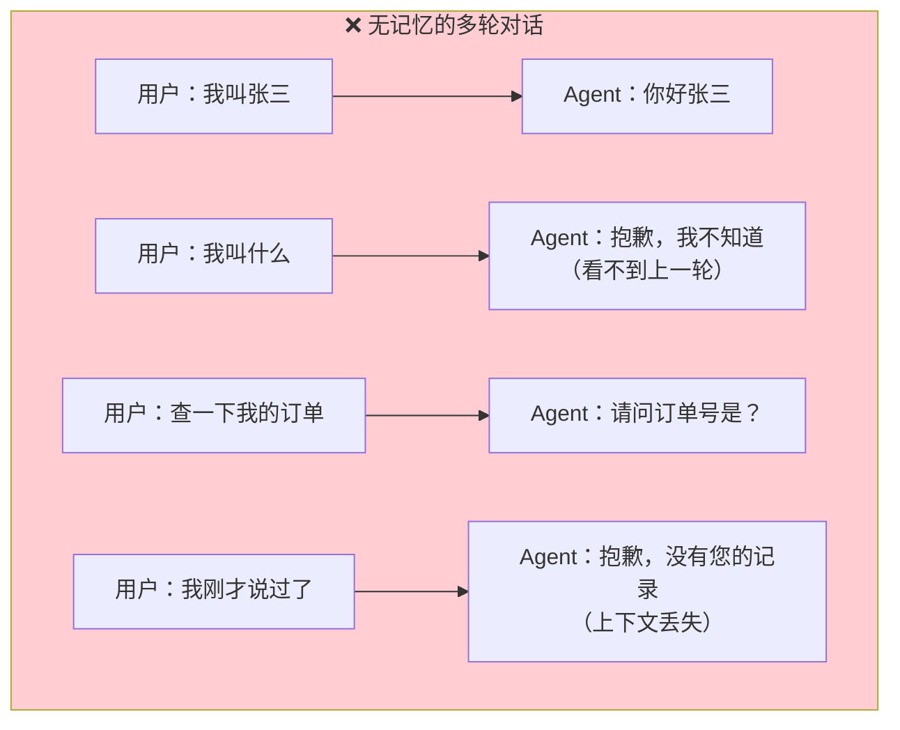

客服场景中，多轮对话是常态——用户描述问题、补充细节、追问结果，这些都需要上下文连贯。没有记忆的 Agent 体验极差。

---

## 2. 记忆系统的设计

### 2.1 记忆层次

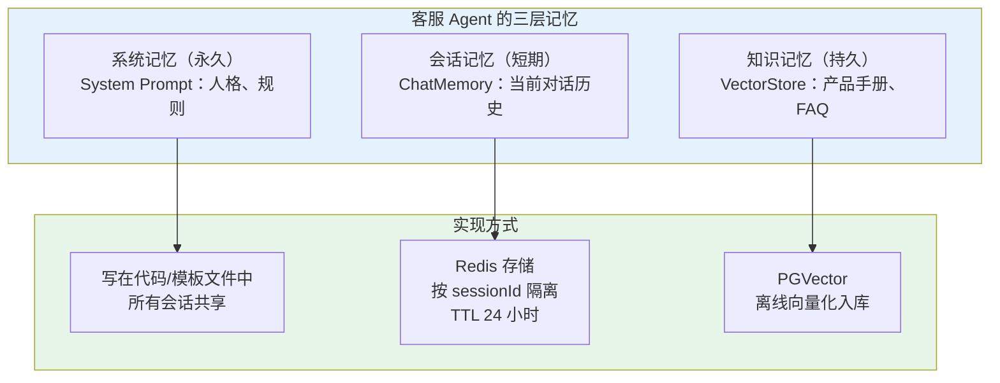

本篇聚焦**会话记忆（ChatMemory）**——System Prompt 前面已配，RAG 知识库上一迭代已接。

### 2.2 为什么用 Redis

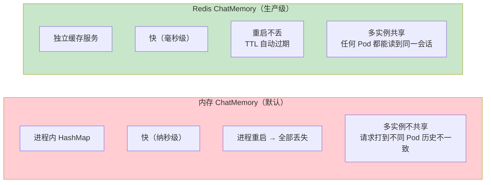

客服系统通常多实例部署（K8s 多 Pod），用户请求可能打到任意实例。内存存储会导致"Pod A 上的对话历史 Pod B 看不到"——Redis 是唯一正确选择。

> 「遇到阻塞？→ [教程 04-记忆与会话管理：持久化存储](../../教程/04-记忆与会话管理.md)」

---

## 3. Redis ChatMemory 配置

### 3.1 添加依赖

`pom.xml` 追加：

```xml
<!-- Spring Data Redis -->
<dependency>
    <groupId>org.springframework.boot</groupId>
    <artifactId>spring-boot-starter-data-redis</artifactId>
</dependency>
```

### 3.2 Redis 配置

`application.yml` 追加：

```yaml
spring:
  data:
    redis:
      host: localhost
      port: 6379
      password: ${REDIS_PASSWORD:}
      database: 0

# 自定义：会话记忆参数
customer-service:
  memory:
    session-timeout: 86400      # 会话 TTL：24 小时（秒）
    max-messages: 20            # 每个会话最多保留 20 条消息
```

### 3.3 Redis ChatMemory Bean

```java
@Configuration
public class RedisMemoryConfig {

    @Value("${customer-service.memory.session-timeout:86400}")
    private long sessionTimeout;

    @Bean
    public ChatMemory chatMemory(RedisTemplate<String, Object> redisTemplate) {
        return new RedisChatMemory(redisTemplate, sessionTimeout);
    }
}
```

### 3.4 自定义 RedisChatMemory 实现

Spring AI 提供 `MessageWindowChatMemory`（内存版），我们需要实现 Redis 版本：

```java
public class RedisChatMemory implements ChatMemory {

    private final RedisTemplate<String, Object> redisTemplate;
    private final long sessionTimeout;
    private final int maxMessages;

    private static final String KEY_PREFIX = "chat:memory:";

    public RedisChatMemory(
            RedisTemplate<String, Object> redisTemplate,
            long sessionTimeout) {
        this.redisTemplate = redisTemplate;
        this.sessionTimeout = sessionTimeout;
        this.maxMessages = 20;
    }

    @Override
    public void add(String conversationId, List<Message> messages) {
        String key = KEY_PREFIX + conversationId;

        // 读取现有历史
        List<Message> existing = get(conversationId);

        // 合并新消息
        List<Message> combined = new ArrayList<>(existing);
        combined.addAll(messages);

        // 窗口策略：只保留最近 N 条
        if (combined.size() > maxMessages) {
            combined = combined.subList(
                combined.size() - maxMessages, combined.size()
            );
        }

        // 序列化存储
        List<String> serialized = combined.stream()
            .map(this::serializeMessage)
            .toList();

        redisTemplate.opsForList().trim(key, 0, -1);   // 清空旧值
        redisTemplate.opsForList().rightPushAll(key, serialized);
        redisTemplate.expire(key, sessionTimeout, TimeUnit.SECONDS);
    }

    @Override
    public List<Message> get(String conversationId) {
        String key = KEY_PREFIX + conversationId;
        List<Object> raw = redisTemplate.opsForList().range(key, 0, -1);

        if (raw == null || raw.isEmpty()) {
            return List.of();
        }

        return raw.stream()
            .map(obj -> (String) obj)
            .map(this::deserializeMessage)
            .toList();
    }

    @Override
    public void clear(String conversationId) {
        redisTemplate.delete(KEY_PREFIX + conversationId);
    }

    /**
     * 序列化 Message 为 JSON 存储
     */
    private String serializeMessage(Message message) {
        try {
            ObjectMapper mapper = new ObjectMapper();
            ObjectNode node = mapper.createObjectNode();
            node.put("role", message.getMessageType().name());
            node.put("content", message.getText());
            return mapper.writeValueAsString(node);
        } catch (Exception e) {
            throw new RuntimeException("序列化消息失败", e);
        }
    }

    /**
     * 反序列化 JSON 为 Message
     */
    private Message deserializeMessage(String json) {
        try {
            ObjectMapper mapper = new ObjectMapper();
            JsonNode node = mapper.readTree(json);
            String role = node.get("role").asText();
            String content = node.get("content").asText();

            return switch (role) {
                case "USER" -> new UserMessage(content);
                case "ASSISTANT" -> new AssistantMessage(content);
                case "SYSTEM" -> new SystemMessage(content);
                default -> new UserMessage(content);
            };
        } catch (Exception e) {
            throw new RuntimeException("反序列化消息失败", e);
        }
    }
}
```

核心设计点：

**Redis List 结构**

用 Redis List（`LPUSH/RPUSH`）而非 String——List 天然有序，`LRANGE 0 -1` 一次取全部消息，符合对话的时间线顺序。

Key 设计 `chat:memory:{sessionId}`——前缀便于批量管理和监控。

**窗口策略（MessageWindow）**

`maxMessages = 20` 只保留最近 20 条消息。为什么不全部存？因为 LLM 上下文窗口有限——如果对话 100 轮，全量历史可能有几万 Token，直接撑爆上下文。窗口策略保证每次调用 LLM 的历史部分可控。

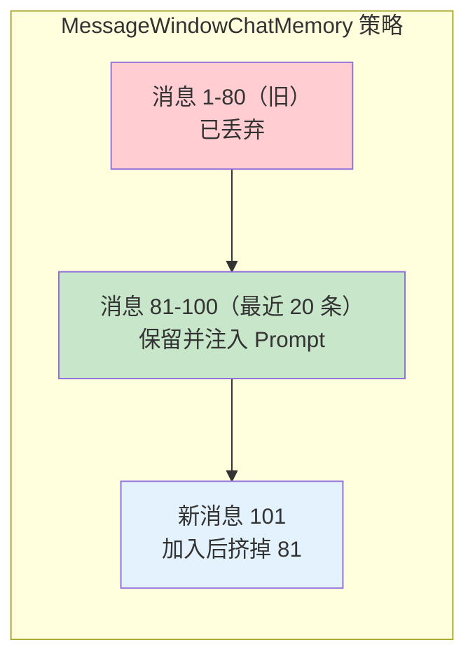

**TTL 自动过期**

`redisTemplate.expire(key, sessionTimeout)` 每次写入都刷新 TTL——24 小时内活跃的会话不会过期，超过 24 小时无活动自动清理。避免了 Redis 无限膨胀。

**序列化策略**

Message 对象不能直接存 Redis——序列化为 JSON（role + content），反序列化时按 role 重建对应类型的 Message。这里用 Jackson 手动处理，保持序列化格式可控。

> 「遇到阻塞？→ [教程 04-记忆与会话管理：ChatMemory 自定义实现](../../教程/04-记忆与会话管理.md)」

---

## 4. MessageChatMemoryAdvisor 集成

ChatMemory 实现后，需要通过 Advisor 注入到 ChatClient 的调用链中。

### 4.1 修改 ChatClientConfig

```java
@Configuration
public class ChatClientConfig {

    @Bean
    public ChatClient chatClient(
            ChatClient.Builder builder,
            FaqQueryTool faqTool,
            OrderQueryTool orderTool,
            LogisticsTool logisticsTool,
            VectorStore vectorStore,
            ChatMemory chatMemory) {

        // RAG Advisor
        QuestionAnswerAdvisor ragAdvisor = QuestionAnswerAdvisor.builder(vectorStore)
            .searchRequest(SearchRequest.builder()
                .topK(3)
                .similarityThreshold(0.7)
                .build())
            .build();

        // Memory Advisor
        MessageChatMemoryAdvisor memoryAdvisor = MessageChatMemoryAdvisor.builder(chatMemory)
            .conversationId("default")  // 默认会话 ID，运行时按请求覆盖
            .build();

        return builder
            .defaultSystem("""
                你是"小智"，XX 电商平台的智能客服助手。
                保持专业、友好、简洁的语气。
                不确定时诚实告知，不编造信息。
                记住用户在本次会话中提供的信息（订单号、姓名等），
                后续追问时无需重复询问。
                """)
            .defaultTools(faqTool, orderTool, logisticsTool)
            .defaultAdvisors(ragAdvisor, memoryAdvisor)
            .build();
    }
}
```

### 4.2 ChatService 中设置会话 ID

```java
@Service
public class ChatService {

    private final ChatClient chatClient;

    public Flux<String> chat(ChatRequest request) {
        String sessionId = request.sessionId();
        if (sessionId == null || sessionId.isBlank()) {
            sessionId = UUID.randomUUID().toString();
        }

        final String finalSessionId = sessionId;

        return chatClient.prompt()
            .user(request.message())
            .advisors(spec -> spec.param(
                ChatMemory.CONVERSATION_ID, finalSessionId
            ))
            .stream()
            .content();
    }
}
```

关键点：

**`.advisors(spec -> spec.param(...))`**

每次调用时动态传入 `conversationId`。`MessageChatMemoryAdvisor` 会读取这个参数，从 Redis 加载该会话的历史消息注入 Prompt，并在 LLM 响应后将新消息存回 Redis。

**会话 ID 的生成**

首次请求 `sessionId` 为空 → 生成 UUID → 返回给前端 → 后续请求携带同一 ID。前端将 sessionId 存在 localStorage 或 cookie 中，实现"刷新页面继续对话"。

> 「遇到阻塞？→ [教程 04-记忆与会话管理：会话隔离](../../教程/04-记忆与会话管理.md)」

---

## 5. Advisor 链的完整执行流程

加入 Memory Advisor 后，一次请求的完整链路：

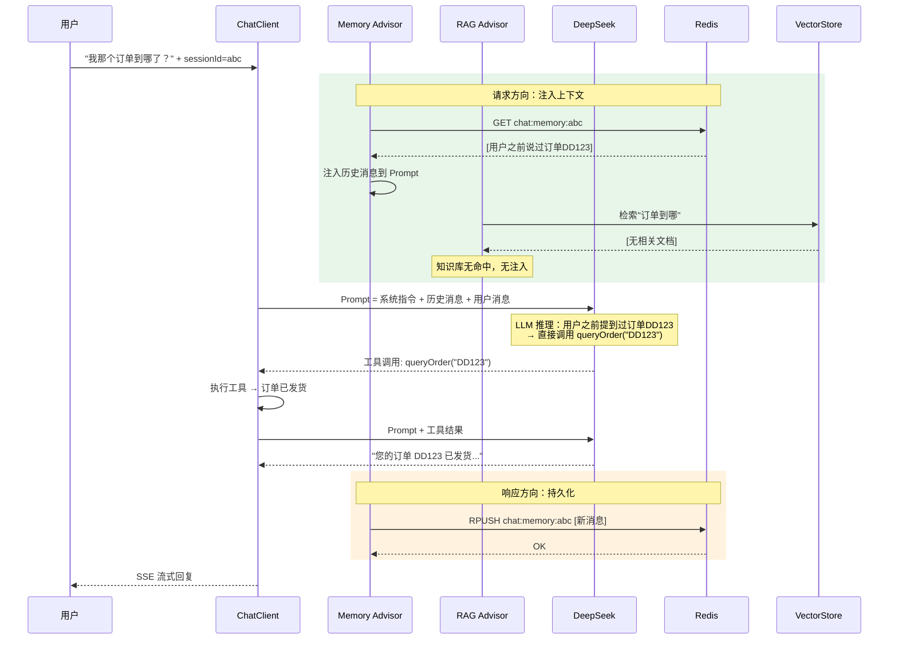

注意 Memory Advisor 的两个时机：

1. **请求方向**——从 Redis 加载历史，注入为 assistant/user message
2. **响应方向**——将本轮的用户消息和 AI 回复存回 Redis

这样下一轮请求时，上一轮的对话已经在历史中。

---

## 6. 上下文工程：Token 预算管理

随着对话轮数增加，历史消息 + RAG 文档 + 工具结果可能撑爆上下文窗口。需要做上下文预算管理。

### 6.1 上下文窗口的构成

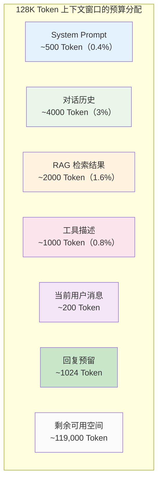

### 6.2 历史消息压缩

当历史超过 `maxMessages`（20 条）时，简单的窗口策略直接丢弃旧消息——但有时旧消息包含重要信息（如用户提供的订单号）。

进阶方案：**摘要压缩**。当窗口溢出时，将最旧的 N 条消息让 LLM 生成摘要，用摘要替换原文：

```java
public class SummaryChatMemory implements ChatMemory {

    private final ChatClient chatClient;
    private final ChatMemory delegate;  // 委托给 RedisChatMemory
    private final int maxMessages;
    private final int summaryThreshold;

    @Override
    public void add(String conversationId, List<Message> messages) {
        List<Message> history = delegate.get(conversationId);
        history.addAll(messages);

        if (history.size() > summaryThreshold) {
            // 压缩：将最旧的 N 条生成摘要
            List<Message> toSummarize = history.subList(0, maxMessages / 2);
            String summary = summarize(toSummarize);

            List<Message> compressed = new ArrayList<>();
            compressed.add(new SystemMessage("对话摘要：" + summary));
            compressed.addAll(history.subList(maxMessages / 2, history.size()));
            history = compressed;
        }

        delegate.clear(conversationId);
        delegate.add(conversationId, history);
    }

    private String summarize(List<Message> messages) {
        String transcript = messages.stream()
            .map(m -> m.getMessageType() + ": " + m.getText())
            .collect(Collectors.joining("\n"));

        return chatClient.prompt()
            .system("将以下对话总结为关键信息摘要，保留订单号、用户需求等重要事实")
            .user(transcript)
            .call()
            .content();
    }
}
```

这样即使对话持续 100 轮，历史也始终控制在 `maxMessages` 条以内，且关键信息通过摘要保留。

> 「遇到阻塞？→ [教程 29-上下文工程：上下文压缩策略](../../教程/29-上下文工程.md)」

---

## 7. 会话管理 API

### 7.1 会话生命周期

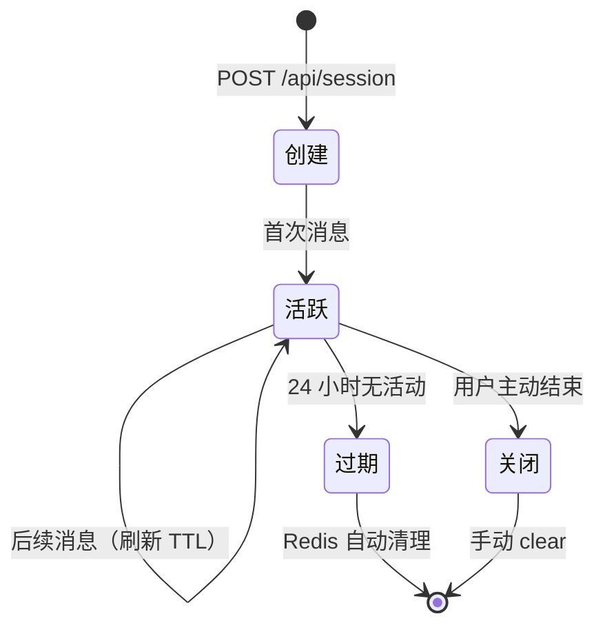

### 7.2 会话接口

```java
@RestController
@RequestMapping("/api/session")
public class SessionController {

    private final ChatMemory chatMemory;

    @PostMapping
    public Map<String, String> createSession() {
        String sessionId = UUID.randomUUID().toString();
        return Map.of("sessionId", sessionId);
    }

    @GetMapping("/{sessionId}/messages")
    public List<Map<String, String>> getHistory(@PathVariable String sessionId) {
        return chatMemory.get(sessionId).stream()
            .map(msg -> Map.of(
                "role", msg.getMessageType().name(),
                "content", msg.getText()
            ))
            .toList();
    }

    @DeleteMapping("/{sessionId}")
    public void closeSession(@PathVariable String sessionId) {
        chatMemory.clear(sessionId);
    }
}
```

### 7.3 前端会话管理流程

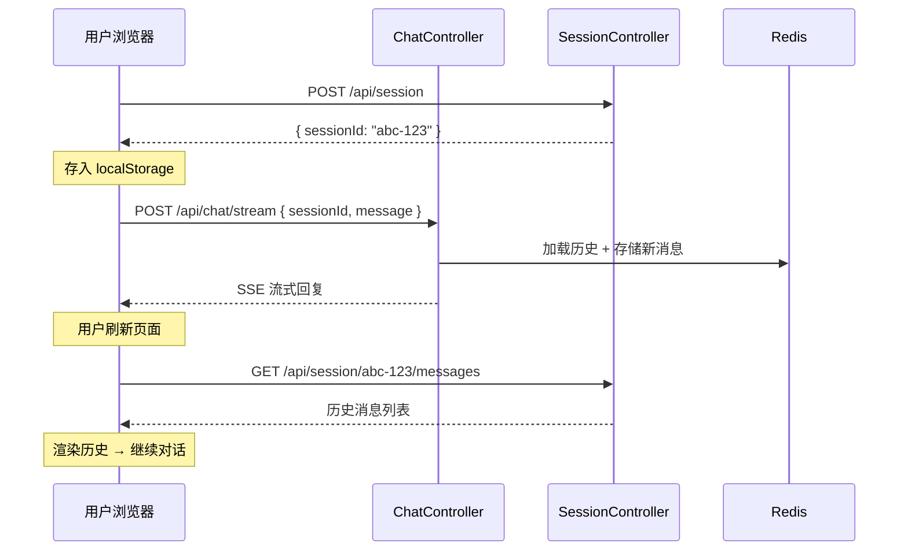

> 「遇到阻塞？→ [教程 35-长任务持久化与中断恢复：会话状态持久化](../../教程/35-长任务持久化与中断恢复.md)」

---

## 8. 流式响应中的 Memory 处理

SSE 流式响应有一个特殊问题：**Memory 何时保存？**

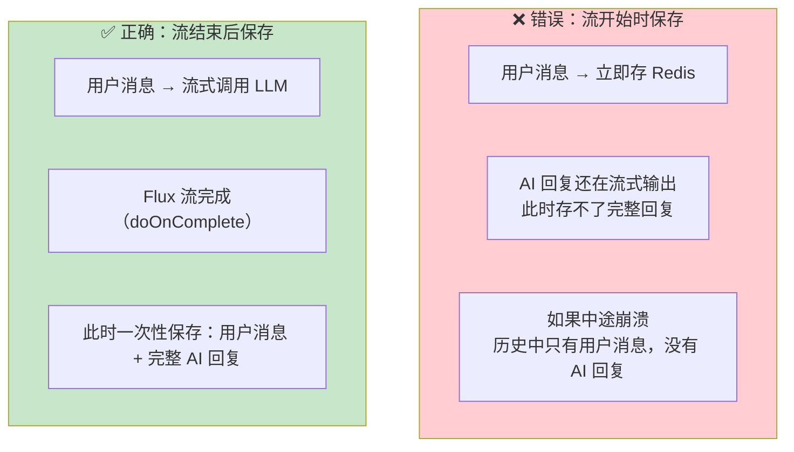

Spring AI 的 `MessageChatMemoryAdvisor` 内部已处理好了这个时机——在流式响应的 `doOnComplete` 回调中执行存储。但如果自定义 Memory Advisor，需要注意：

```java
// ChatService 中确保流式完整后再存
public Flux<String> chat(ChatRequest request) {
    StringBuilder aiReply = new StringBuilder();

    return chatClient.prompt()
        .user(request.message())
        .advisors(spec -> spec.param(
            ChatMemory.CONVERSATION_ID, request.sessionId()
        ))
        .stream()
        .content()
        .doOnNext(aiReply::append)           // 累积 AI 回复
        .doOnComplete(() -> {
            // 流结束后，Memory Advisor 自动保存
            log.info("会话 {} 回复完成，长度 {}",
                request.sessionId(), aiReply.length());
        })
        .doOnError(ex -> log.error("流式回复异常", ex));
}
```

> 「遇到阻塞？→ [教程 09-SSE 流式通信：流式响应中的状态管理](../../教程/09-SSE流式通信.md)」

---

## 9. 验证多轮对话

### 9.1 测试上下文连贯性

**第一轮**：

```bash
curl -N -X POST http://localhost:8080/api/chat/stream \
  -H "Content-Type: application/json" \
  -d '{"sessionId": "test-001", "message": "我的订单号是 DD20240810001，记好了"}'
```

**第二轮**（用同一个 sessionId）：

```bash
curl -N -X POST http://localhost:8080/api/chat/stream \
  -H "Content-Type: application/json" \
  -d '{"sessionId": "test-001", "message": "帮我查一下刚才说的那个订单"}'
```

预期：Agent 从 Memory 中读取上一轮的订单号 "DD20240810001"，直接调用 `queryOrder("DD20240810001")`，不重复询问订单号。

### 9.2 测试会话隔离

```bash
# 会话 A
curl -X POST ... -d '{"sessionId": "A", "message": "我叫张三"}'

# 会话 B
curl -X POST ... -d '{"sessionId": "B", "message": "我叫什么？"}'
```

预期：会话 B 的 Agent 不知道"张三"——不同 sessionId 的 Memory 是隔离的。

### 9.3 验证 Redis 持久化

```bash
# 对话后检查 Redis
redis-cli LRANGE chat:memory:test-001 0 -1
```

输出 JSON 数组，包含每条消息的 role 和 content。

---

## 10. 最终架构全貌

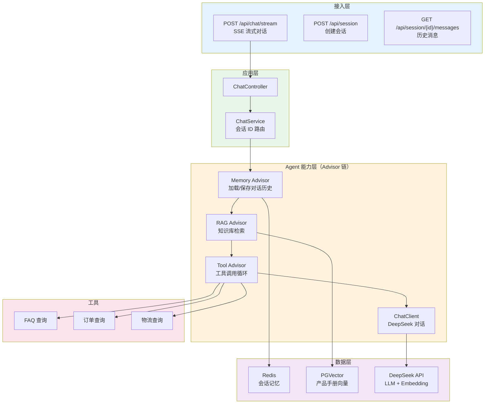

### 最终请求链路

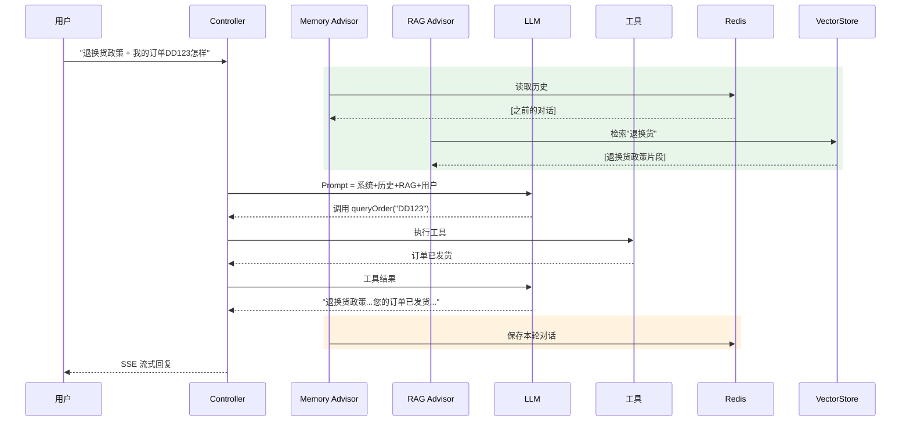

---

## 11. 小结

本篇为客服 Agent 补上了最后一块核心拼图——多轮对话记忆：

1. **RedisChatMemory**——基于 Redis List 实现，窗口策略保留最近 20 条，TTL 24 小时自动过期
2. **MessageChatMemoryAdvisor**——请求方向加载历史注入 Prompt，响应方向持久化新消息
3. **会话 ID 路由**——`ChatService` 通过 `.advisors(spec → spec.param(...))` 动态传入 sessionId，实现会话隔离
4. **上下文工程**——Token 预算管理（窗口策略 + 摘要压缩），避免长对话撑爆上下文
5. **会话管理 API**——创建、查询历史、关闭会话三个端点，前端实现刷新续聊

至此，智能客服系统的四大核心能力全部就位：

| 能力 | 实现方式 | 迭代 |
|------|---------|------|
| LLM 对话 + SSE 流式 | ChatClient + WebFlux | 最小 Demo |
| 工具调用 | @Tool + defaultTools | 迭代一 |
| RAG 知识库 | PGVector + QuestionAnswerAdvisor | 迭代二 |
| 多轮记忆 | Redis ChatMemory + Advisor | 迭代三 |

下一篇 [05-核心代码讲解](05-核心代码讲解.md) 将逐个解析关键代码片段，回顾每个架构决策的"为什么"。
