# 05-核心代码讲解

> **定位**：贯穿全项目的关键代码片段逐行精讲——ChatClient 构建链、Advisor 链编排、工具注册与调用循环、RAG 检索注入、Memory 窗口策略、SSE 流式处理。每个代码段都讲透"为什么这样写"，以及换成别的写法会怎样。读完这篇，你对每一行代码背后的架构决策有清晰认知。
>
> **读者画像**：已跟随前四篇完成全部迭代的开发者，想深入理解"为什么这样设计"。
>
> **前置阅读**：[00-需求分析与架构设计](00-需求分析与架构设计.md) → [01-最小 Demo](01-最小Demo搭建.md) → [02-工具集成](02-迭代一-工具集成.md) → [03-RAG 知识库](03-迭代二-RAG知识库.md) → [04-记忆与会话](04-迭代三-记忆与会话.md)。

---

## 1. ChatClient 构建链全解析

ChatClient 是整个系统的"引擎"——它的配置决定了 Agent 的全部行为。回顾最终的 ChatClient Bean：

```java
@Bean
public ChatClient chatClient(
        ChatClient.Builder builder,
        FaqQueryTool faqTool,
        OrderQueryTool orderTool,
        LogisticsTool logisticsTool,
        VectorStore vectorStore,
        ChatMemory chatMemory) {

    // 1. RAG Advisor
    QuestionAnswerAdvisor ragAdvisor = QuestionAnswerAdvisor.builder(vectorStore)
        .searchRequest(SearchRequest.builder()
            .topK(3)
            .similarityThreshold(0.7)
            .build())
        .build();

    // 2. Memory Advisor
    MessageChatMemoryAdvisor memoryAdvisor = MessageChatMemoryAdvisor.builder(chatMemory)
        .build();

    // 3. 组装 ChatClient
    return builder
        .defaultSystem("你是小智...")
        .defaultTools(faqTool, orderTool, logisticsTool)
        .defaultAdvisors(ragAdvisor, memoryAdvisor)
        .build();
}
```

### 1.1 Builder 的三个"default"

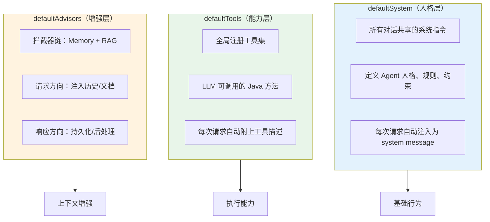

这三个 `default` 定义了 ChatClient 的"出厂设置"。每次 `.prompt()` 调用时，如果不再覆盖，就用这些默认值。运行时可以通过 `.system()`、`.tools()`、`.advisors()` 覆盖特定默认值——但客服场景下我们不需要覆盖，全局统一即可。

### 1.2 Advisor 链顺序的重要性

```java
.defaultAdvisors(ragAdvisor, memoryAdvisor)
```

这里顺序是 **RAG → Memory**。为什么不是反过来？

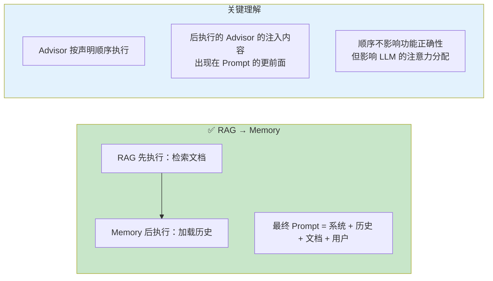

实际上，Spring AI 的 Advisor 链中，所有 Advisor 的注入内容最终会按角色（system → history → context → user）合并，Advisor 声明顺序更多影响的是执行时机。但保持 `RAG → Memory` 的语义清晰——先检索知识，再结合历史，最后让 LLM 综合判断。

> 「遇到阻塞？→ [教程 13-Advisor 链与拦截器：Advisor 顺序与组合](../../教程/13-Advisor链与拦截器.md)」

---

## 2. SSE 流式响应的完整链路

### 2.1 从 ChatClient 到 HTTP 响应

```java
@PostMapping(value = "/stream", produces = MediaType.TEXT_EVENT_STREAM_VALUE)
public Flux<ServerSentEvent<String>> chatStream(@RequestBody ChatRequest request) {
    return chatService.chat(request)
        .map(token -> ServerSentEvent.<String>builder()
            .event("token")
            .data(token)
            .build())
        .concatWith(Mono.just(ServerSentEvent.<String>builder()
            .event("done")
            .data("[DONE]")
            .build()))
        .onErrorResume(ex -> Flux.just(ServerSentEvent.<String>builder()
            .event("error")
            .data("服务暂时不可用，请稍后重试")
            .build()));
}
```

数据流全链路：

```mermaid
graph LR
    subgraph DeepSeek["DeepSeek API"]
        D1["流式返回 Token"]
    end

    subgraph SpringAI["Spring AI"]
        S1["ChatClient.stream().content()"]
        S2["Flux<String>"]
    end

    subgraph ChatService["ChatService"]
        C1["chat(request)"]
        C2["返回 Flux<String>"]
    end

    subgraph Controller["ChatController"]
        CO1[".map(token → SSE)"]
        CO2["Flux<ServerSentEvent>"]
    end

    subgraph WebFlux["WebFlux"]
        W1["SSE 编码器"]
        W2["HTTP 响应流"]
    end

    D1 --> S1 --> S2 --> C1 --> C2 --> CO1 --> CO2 --> W1 --> W2

    style DeepSeek fill:#fce4ec
    style SpringAI fill:#fff3e0
    style ChatService fill:#e8f5e9
    style Controller fill:#e3f2fd
    style WebFlux fill:#f3e5f5
```

每一层的职责：

| 层 | 类型 | 职责 |
|----|------|------|
| DeepSeek API | HTTP Stream | 逐 Token 返回 |
| Spring AI | `Flux<String>` | 将 Token 流封装为 Reactor Flux |
| ChatService | `Flux<String>` | 透传（后续迭代可加业务逻辑） |
| Controller | `Flux<ServerSentEvent<String>>` | 转为 SSE 事件格式 |
| WebFlux | HTTP Response | 按 SSE 协议编码输出 |

### 2.2 concatWith vs mergeWith

```java
.concatWith(Mono.just(doneEvent))   // ✅ 正确
// .mergeWith(Mono.just(doneEvent)) // ❌ 错误
```

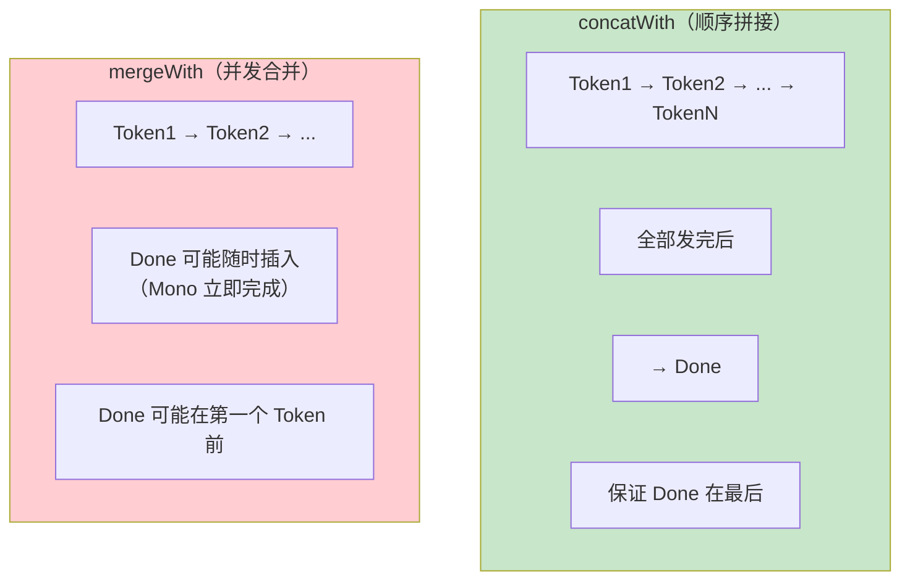

`concatWith` 保证 `Done` 事件在所有 Token 之后发出——前端据此知道"回复结束"。`mergeWith` 不保证顺序，`Done` 可能提前发出，导致前端误判回复结束。

### 2.3 onErrorResume 的位置

```java
.onErrorResume(ex -> ...)
```

这个错误处理在 `concatWith` **之后**——意味着如果 Token 流中途出错，`concatWith` 的 `Done` 事件不会发出（因为上游报错了），`onErrorResume` 接管并发送 `error` 事件。

如果错误处理在 `concatWith` **之前**，Token 流报错后被 `onErrorResume` 恢复为 error 事件，然后 `concatWith` 还会追加 `Done`——前端先收到 error 再收到 done，逻辑混乱。

> 「遇到阻塞？→ [教程 37-响应式错误处理：Flux 错误处理策略](../../教程/37-响应式错误处理.md)」

---

## 3. 工具定义的关键细节

### 3.1 @Tool description 的写作法则

回顾三个工具的 description：

```java
// FAQ 工具
@Tool(description = """
    根据关键词查询常见问题(FAQ)知识库。
    当用户询问退换货政策、运费规则、售后政策等常见问题时使用此工具。
    参数 keywords 是用户问题的中文关键词。
    """)

// 订单工具
@Tool(description = """
    根据订单号查询订单状态和物流信息。
    当用户提供订单号并询问订单状态、物流进度时使用此工具。
    参数 orderId 是订单编号，格式如 DD20240810001。
    如果用户没有提供订单号，不要调用此工具，而是请用户提供。
    """)

// 物流工具
@Tool(description = """
    根据快递单号查询实时物流轨迹。
    当用户询问快递到哪了、什么时候送达时使用。
    参数 trackingNumber 是快递单号。
    """)
```

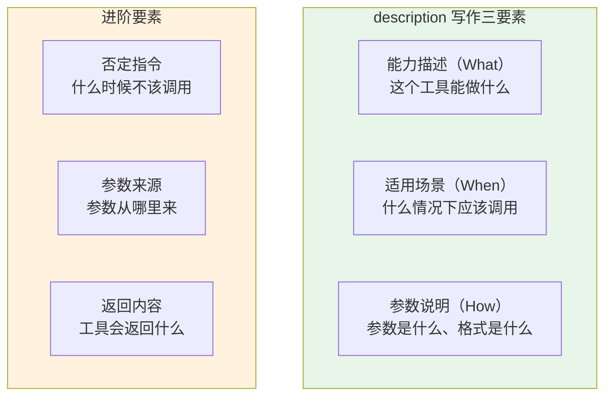

订单工具的 description 中有一句关键否定指令：

> "如果用户没有提供订单号，不要调用此工具，而是请用户提供。"

没有这句话时，LLM 可能的行为：用户说"查我的订单"→ LLM 编一个假订单号调用工具 → 工具返回"订单不存在"→ LLM 回复"您的订单不存在"→ 用户困惑。加上否定指令后，LLM 会主动问"请提供订单号"。

### 3.2 工具方法的返回值设计

```java
// 返回结构化对象
public OrderInfo queryOrder(String orderId) { ... }

// 返回 List
public List<FaqItem> queryFaq(String keywords) { ... }

// 返回 String
public String queryLogistics(String trackingNumber) { ... }
```

| 返回类型 | 适用场景 | LLM 处理方式 |
|---------|---------|-------------|
| `record/POJO` | 结构化数据（订单、产品信息） | Spring AI 序列化为 JSON，LLM 按字段引用 |
| `List<T>` | 多条结果（FAQ 列表、搜索结果） | JSON 数组，LLM 逐条引用 |
| `String` | 文本性结果（物流轨迹、通知文案） | 原文注入，LLM 直接转述或改写 |

原则：**需要 LLM 精确引用的数据用结构化对象；需要 LLM 转述的文本用 String。** 不要让 LLM 去解析复杂嵌套 JSON——保持返回结构扁平。

> 「遇到阻塞？→ [教程 12-结构化输出：工具返回值类型选择](../../教程/12-结构化输出.md)」

---

## 4. RAG 检索的 Prompt 模板

### 4.1 自定义模板的设计逻辑

```java
private PromptTemplate createRagPromptTemplate() {
    return new PromptTemplate("""
        以下是相关的知识库信息，请优先基于这些信息回答用户问题：

        ---知识库内容---
        {question_answer_context}
        ---内容结束---

        用户问题：{question_answer}

        如果知识库内容足以回答，请基于内容给出准确回复。
        如果知识库内容与问题无关或不足以回答，请忽略这些内容，
        用你的通用知识回答或告知用户无法回答。
        """);
}
```

对比 Spring AI 默认模板：

```text
Context information is below, using this information to answer the question.
{question_answer_context}
Question: {question_answer}
Answer:
```

我们的自定义模板有三个改进：

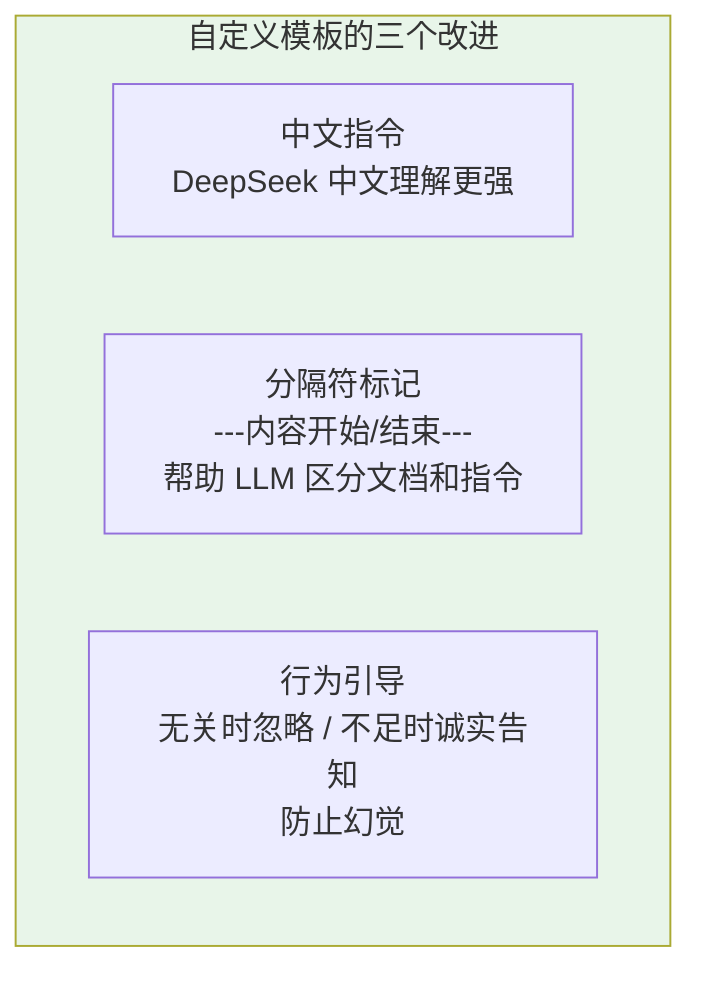

**"如果知识库内容与问题无关...请忽略"**——这句话是防止幻觉的关键。没有它，LLM 倾向于"强行使用"检索到的文档回答，即使文档与问题无关。比如用户问"你们支持货到付款吗"，RAG 检索到了退换货政策——如果不说"忽略"，LLM 可能会从退换货政策中硬编一个"支持货到付款"的答案。

### 4.2 topK 和 similarityThreshold 的取舍

```java
.searchRequest(SearchRequest.builder()
    .topK(3)
    .similarityThreshold(0.7)
    .build())
```

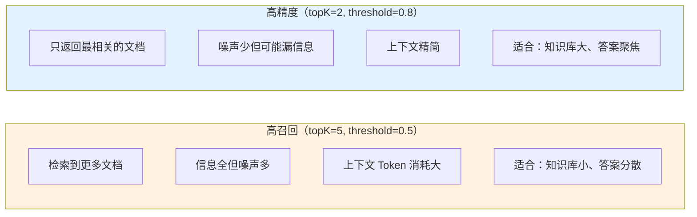

我们选 `topK=3, threshold=0.7` 作为中间值。实际部署后需要根据效果数据调整：收集"用户问题 → 是否准确回答"的反馈，统计召回率/精确率，找到最优点。

> 「遇到阻塞？→ [教程 30-高级 RAG 与 Agentic RAG：检索参数调优](../../教程/30-高级RAG与AgenticRAG.md)」

---

## 5. ChatMemory 的窗口策略

### 5.1 为什么是 20 条

```java
private final int maxMessages = 20;  // RedisChatMemory 中
```

这个数字的推导：

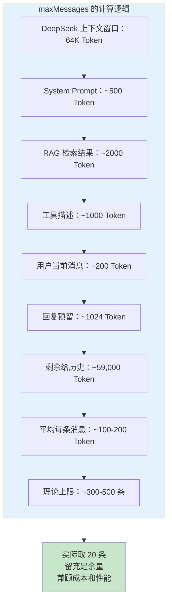

理论上可以放 300 条，但实际只用 20 条的原因：

1. **成本**——每条历史消息都消耗 Token，Token 即费用。20 条历史约 2000-4000 Token，成本可控。
2. **性能**——历史越长，LLM 推理延迟越高。客服场景要求低延迟。
3. **信息密度**——客服对话通常 5-10 轮解决问题，20 条（10 轮）覆盖 95% 的场景。
4. **注意力衰减**——LLM 对超长上下文存在"中间遗忘"问题，中间位置的信息容易被忽略。

### 5.2 序列化的角色保留

```java
private String serializeMessage(Message message) {
    ObjectNode node = mapper.createObjectNode();
    node.put("role", message.getMessageType().name());
    node.put("content", message.getText());
    return mapper.writeValueAsString(node);
}
```

只存 `role` + `content`，不存其他元数据（timestamp、metadata 等）。原因：Redis 存储精简，反序列化时只需要 role 和 content 重建 Message。

角色映射：

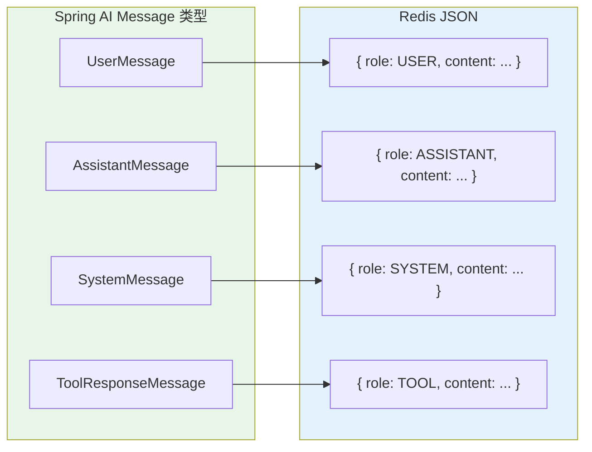

反序列化时根据 role 重建对应类型——LLM 需要看到正确的消息角色（用户说了什么 vs AI 说了什么），才能理解对话结构。

> 「遇到阻塞？→ [教程 04-记忆与会话管理：Message 序列化](../../教程/04-记忆与会话管理.md)」

---

## 6. ChatService 的会话路由

### 6.1 动态 conversationId 注入

```java
public Flux<String> chat(ChatRequest request) {
    String sessionId = request.sessionId();
    if (sessionId == null || sessionId.isBlank()) {
        sessionId = UUID.randomUUID().toString();
    }
    final String finalSessionId = sessionId;

    return chatClient.prompt()
        .user(request.message())
        .advisors(spec -> spec.param(
            ChatMemory.CONVERSATION_ID, finalSessionId
        ))
        .stream()
        .content();
}
```

这段代码的三个关键设计：

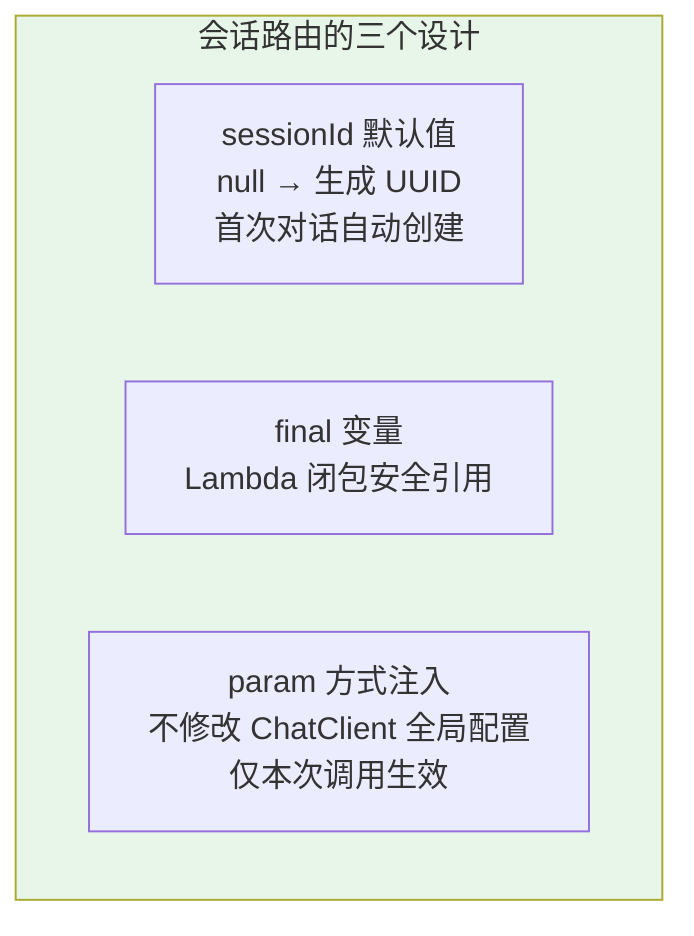

**`final String finalSessionId`**

Lambda 表达式（`.advisors(spec -> ...)`）捕获外部变量时要求变量 effectively final。用 `final` 显式标记，同时语义清晰——这个 ID 在方法内不再变化。

**`.advisors(spec -> spec.param(...))`**

这是 Spring AI 的 Advisor 参数传递机制——`.param(key, value)` 将参数放入 Advisor 的上下文，`MessageChatMemoryAdvisor` 读取 `CONVERSATION_ID` 参数决定加载哪个会话的历史。这不修改 ChatClient 的 `defaultAdvisors`，只在本次调用生效。

### 6.2 为什么不在 ChatClient Bean 中设 conversationId

```java
// ChatClientConfig 中
MessageChatMemoryAdvisor.builder(chatMemory)
    .conversationId("default")  // ← 这里设的 default 只是占位
    .build();
```

ChatClient Bean 是全局共享的——所有用户共用一个实例。如果在 Bean 上设死 `conversationId`，所有用户的对话历史会混在一起。正确的做法是在运行时（ChatService）按请求动态传入。

---

## 7. 架构决策回顾

### 7.1 七个关键决策

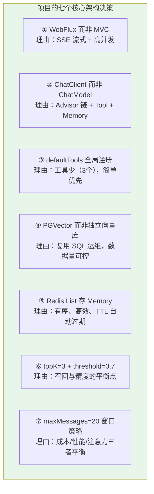

### 7.2 如果重新设计，哪些可能不同

| 决策 | 当前选择 | 替代方案 | 触发条件 |
|------|---------|---------|---------|
| 工具注册 | `defaultTools` 全局 | 按意图动态注册 | 工具数 > 10 |
| 向量库 | PGVector | Milvus / Qdrant | 数据量 > 100 万条 |
| Memory 存储 | Redis List | Redis Hash | 需要按消息 ID 检索 |
| 检索策略 | 单路向量检索 | 混合检索 + Reranker | 召回率 < 85% |
| 上下文管理 | 固定窗口 20 条 | 摘要压缩 | 平均对话 > 15 轮 |
| 部署模式 | 单体应用 | 微服务拆分 | QPS > 200 |

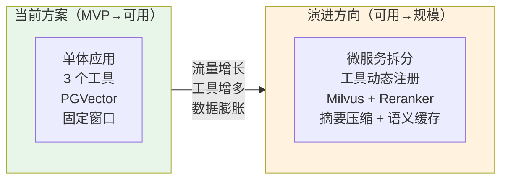

> 「遇到阻塞？→ [教程 14-管控分离架构：微服务拆分时机](../../教程/14-管控分离架构.md)」

### 7.3 可以直接引用的教程索引

| 教程 | 在本项目中的应用 |
|------|-----------------|
| [01-Spring AI 框架入门](../../教程/01-Spring-AI框架入门.md) | 项目初始化、依赖配置 |
| [02-ChatClient 与对话模型](../../教程/02-ChatClient与对话模型.md) | ChatClient Bean 构建、prompt/stream API |
| [03-工具调用](../../教程/03-工具调用.md) | @Tool 定义、工具注册、调用循环 |
| [04-记忆与会话管理](../../教程/04-记忆与会话管理.md) | ChatMemory 自定义实现、会话隔离 |
| [05-RAG 检索增强生成](../../教程/05-RAG检索增强生成.md) | ETL 流水线、QuestionAnswerAdvisor |
| [09-SSE 流式通信](../../教程/09-SSE流式通信.md) | WebFlux Flux、ServerSentEvent、前端对接 |
| [12-结构化输出](../../教程/12-结构化输出.md) | 工具返回值序列化 |
| [13-Advisor 链与拦截器](../../教程/13-Advisor链与拦截器.md) | RAG + Memory Advisor 组合 |
| [26-向量数据库选型](../../教程/26-向量数据库选型.md) | PGVector 配置 |
| [29-上下文工程](../../教程/29-上下文工程.md) | Token 预算、窗口策略 |
| [30-高级 RAG](../../教程/30-高级RAG与AgenticRAG.md) | 混合检索、Reranker |
| [35-长任务持久化](../../教程/35-长任务持久化与中断恢复.md) | 会话状态持久化 |
| [37-响应式错误处理](../../教程/37-响应式错误处理.md) | Flux 错误处理 |

---

## 8. 完整代码文件清单

以下是整个项目的文件清单和各自的职责，方便查阅：

```
src/main/java/com/example/customer/
├── config/
│   ├── ChatClientConfig.java         # [核心] ChatClient Bean：System + Tools + Advisors
│   ├── VectorStoreConfig.java        # TokenTextSplitter 配置
│   └── RedisMemoryConfig.java        # ChatMemory Bean 定义
├── controller/
│   ├── ChatController.java           # SSE 流式 + 同步对话端点
│   └── SessionController.java        # 会话 CRUD 端点
├── service/
│   └── ChatService.java              # 对话编排：sessionId 路由 + Flux 流
├── tools/
│   ├── FaqQueryTool.java             # @Tool FAQ 查询
│   ├── OrderQueryTool.java           # @Tool 订单查询
│   └── LogisticsTool.java            # @Tool 物流查询
├── memory/
│   └── RedisChatMemory.java          # ChatMemory Redis 实现
├── rag/
│   └── KnowledgeBaseLoader.java      # @PostConstruct 文档 ETL 入库
└── model/
    ├── ChatRequest.java              # record 请求 DTO
    ├── ChatResponse.java             # record 响应 DTO
    ├── FaqItem.java                  # record FAQ 数据
    └── OrderInfo.java                # record 订单数据

src/main/resources/
├── application.yml                   # DeepSeek + Redis + PGVector 配置
├── prompts/
│   └── system.st                     # 系统提示词模板
└── data/
    └── product-manual.md             # 产品手册（RAG 数据源）
```

---

## 9. 总结

### 9.1 项目核心价值

这个智能客服项目从零到一，通过四个迭代递进式构建：

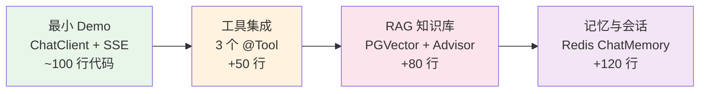

每个迭代的核心代码不超过 120 行，但能力跃升显著。Spring AI 的 Advisor 架构是关键——Memory、RAG、Tool 三个能力作为拦截器组合，声明式配置而非命令式编码。

### 9.2 关键设计哲学回顾

1. **渐进式复杂度**——从能对话 → 能做事 → 能查知识 → 能记忆，每步可独立运行
2. **声明式架构**——`.defaultTools()` / `.defaultAdvisors()` 一行配置，不用手写编排逻辑
3. **关注点分离**——Controller 只管 HTTP、Service 只管业务、Advisor 管上下文增强、Tool 管执行
4. **可观测性优先**——Spring AI + Micrometer 原生集成，Token / 耗时 / 工具调用全链路追踪
5. **Prompt 即资产**——系统提示词和 RAG 模板用独立文件管理，不写死代码

### 9.3 下一步演进方向

本项目是 MVP 级别的可用系统。生产化还需要：

| 方向 | 内容 | 参考教程 |
|------|------|---------|
| 高可用 | 多实例部署、负载均衡、降级策略 | [教程 24-容错与弹性设计](../../教程/24-容错与弹性设计.md) |
| 成本治理 | Token 预算、语义缓存、模型路由 | [教程 21-成本治理与 Token 计量](../../教程/21-成本治理与Token计量.md) |
| 安全管控 | 敏感信息脱敏、Prompt 注入防护 | [教程 25-安全与权限控制](../../教程/25-安全与权限控制.md) |
| 人工转接 | 意图识别 + 工单流转 | [教程 22-Human-in-the-Loop](../../教程/22-Human-in-the-Loop与审批流.md) |
| 持续改进 | 用户反馈闭环、数据飞轮 | [教程 36-数据飞轮与持续改进](../../教程/36-数据飞轮与持续改进.md) |

这些主题在对应的教程中有深入讲解，可以作为项目下一阶段的演进路线图。
