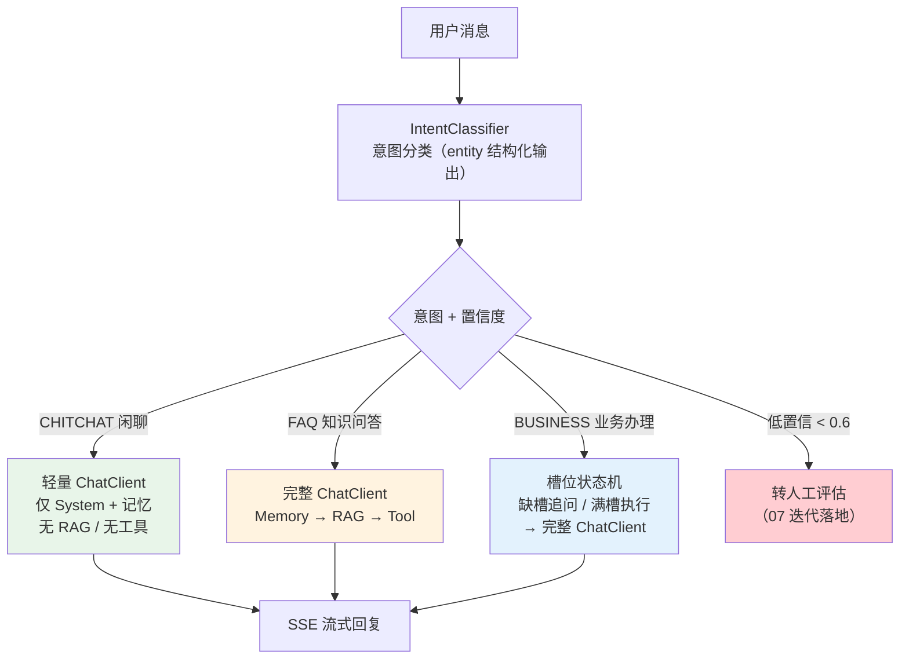
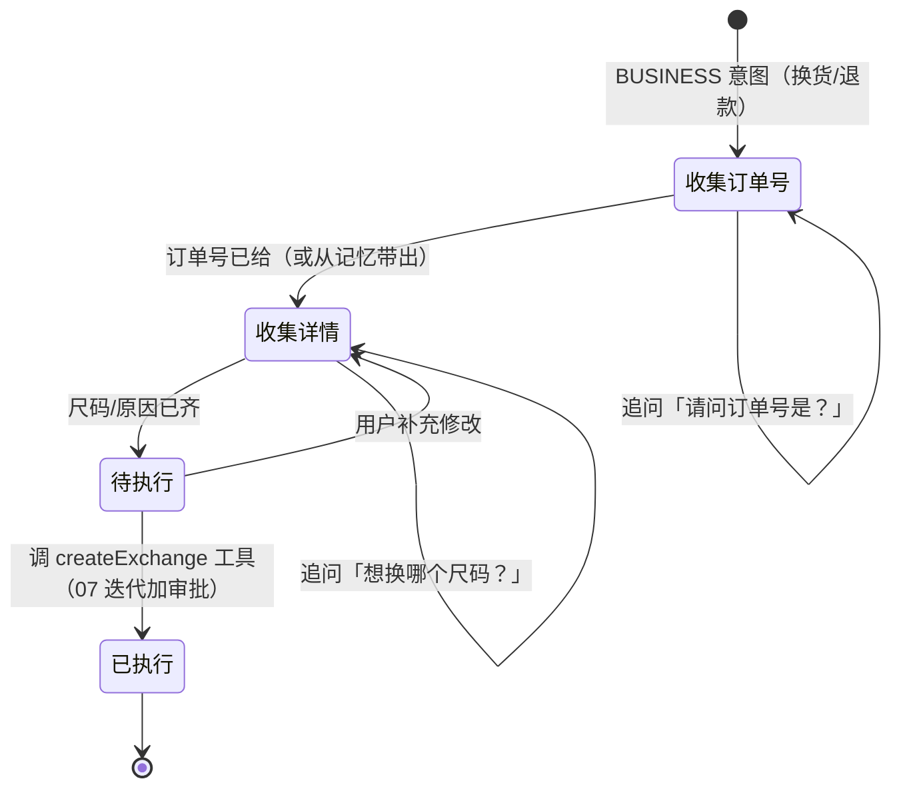
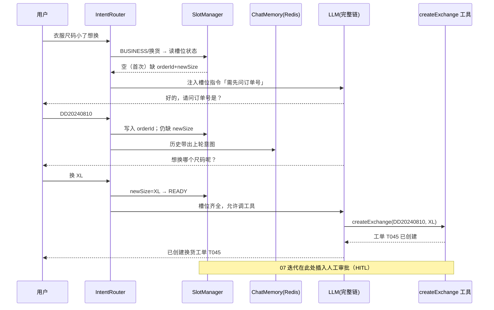
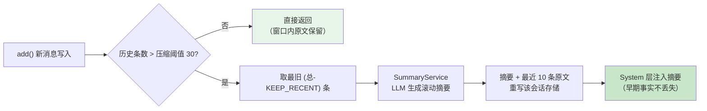

# 项目 00：智能客服系统 — 06-意图识别与多轮对话深化

> **定位**：在「对话 + 工具 + RAG + 记忆」核心链路之上，补齐智能客服的三个进阶能力——**意图分层路由**（FAQ/业务/闲聊三级分流）、**槽位填充与澄清追问**（换货/退款这类多步业务的标准骨架）、**长会话上下文压缩**（20 条窗口之外的摘要方案）。读完这篇，客服 Agent 从「每句话都走全链路」演进为「按意图分层、按业务填槽、按长度压缩」的精细化对话引擎。
> **读者画像**：已按 01-04 完成核心链路手写、读过 [05-核心代码讲解]，想让对话质量与 Token 成本同时优化的开发者。
> **前置阅读**：[04-记忆与会话]、[05-核心代码讲解]。
> **关联教程**：[教程 34-上下文工程]（五层拼接与压缩总纲）、[教程 13-结构化输出]（`entity(Class, spec)` 真实 API）；API 真实性以 [附录 05-SpringAI2-API基准] 为准。

---

## 1. 四问（本迭代）

| 问 | 答 |
|----|----|
| **新增了什么需求** | ① 闲聊/寒暄不应触发 RAG 检索与工具（省 Token、降延迟）；② 换货、退款类多步业务需要稳定的槽位收集流程，不能靠 LLM 自由发挥；③ 超长会话（窗口 > 20 条）里最早的订单号、承诺过的话不能被静默截断 |
| **影响了哪些模块** | 新增 `intent/`（意图分类器 + 路由器）、`slot/`（槽位状态机 + Redis 存储）、`memory/`（压缩装饰器）；改动 `ChatService`（入口先路由）、`ChatClientConfig`（拆出轻量 ChatClient） |
| **架构如何演进** | 单一全功能链 → **前置意图路由 + 双 ChatClient（轻量/完整）+ 槽位状态机外置 Redis + ChatMemory 压缩装饰器**；对话入口从「直发 ChatClient」变为「先分类再分发」 |
| **上一版本的痛点是什么** | 04 迭代后所有消息无差别走 Memory→RAG→Tool 全链：闲聊也做向量检索（浪费）、多步业务靠 LLM 即兴发挥（换货漏问尺码）、20 条窗口硬截断（丢关键事实） |

---

## 2. 意图分层路由：FAQ / 业务 / 闲聊三级分流

### 2.1 为什么分流

04 迭代后的链路对每条消息做同样的事：加载历史 → 向量检索 → 注册工具 → 调 LLM。但客服流量里约 30-40% 是「在吗」「谢谢」「你是机器人吗」这类闲聊——它们**不需要 RAG、不需要工具**，走全链路纯属浪费：多一次向量检索的延迟与 Embedding 费用，还可能召回无关文档干扰回答。

「遇到阻塞？→ [教程 34-上下文工程 §分层拼接策略]」——意图路由本质上是上下文工程的**前置决策层**：先决定「这一轮要拼哪几层上下文」，再进 ChatClient。

### 2.2 三级分流架构



三级各自的目标：

| 层级 | 典型消息 | 走的链路 | 成本 |
|------|---------|---------|------|
| CHITCHAT 闲聊 | 「在吗」「谢谢啦」 | 轻量 ChatClient（无 RAG/工具） | 最低，TTFT 最快 |
| FAQ 知识问答 | 「空气炸锅能用锡纸吗」 | 完整链（RAG 是主角） | 中 |
| BUSINESS 业务办理 | 「衣服尺码小了想换」 | 槽位状态机 + 完整链（工具是主角） | 高但必要 |

### 2.3 意图分类器：`entity(Class, spec)` 真实 API

意图分类是**结构化输出**的经典场景——用 `entity` 把 LLM 输出直接绑定到 record（[教程 13-结构化输出]）。

```java
package com.shop.customer.intent;

/** 意图分类结果（结构化输出，Spring AI 2.0.0 entity API 绑定）。 */
public record IntentResult(Intent intent, float confidence, String reason) {

    public enum Intent {
        CHITCHAT,   // 闲聊寒暄：在吗/谢谢/夸两句
        FAQ,        // 知识问答：政策/商品参数/使用方法
        BUSINESS    // 业务办理：换货/退款/查订单/改地址
    }
}
```

```java
package com.shop.customer.intent;

import org.springframework.ai.chat.client.ChatClient;
import org.springframework.stereotype.Component;

@Component
public class IntentClassifier {

    private static final String INTENT_PROMPT = """
            你是电商客服消息的意图分类器。把用户消息分类为：
            - CHITCHAT：寒暄、情绪表达、与业务无关的闲聊
            - FAQ：咨询政策、商品参数、使用方法等知识性问题
            - BUSINESS：换货、退款、查订单、改地址等需要执行操作的业务
            confidence 取 0.0~1.0；reason 用一句话给出分类依据。""";

    private final ChatClient chatClient;

    public IntentClassifier(ChatClient chatClient) {
        this.chatClient = chatClient;
    }

    // Spring AI 2.0.0：entity(Class, Consumer<EntityParamSpec>) 为 javap 实证重载
    // （[附录 05-SpringAI2-API基准]）；validateSchema() 让结构化输出前先过 schema 校验
    public IntentResult classify(String message) {
        return chatClient.prompt()
                .system(INTENT_PROMPT)
                .user(message)
                .call()
                .entity(IntentResult.class, spec -> spec.validateSchema());
    }
}
```

> ⚠️ 分类器注入的是**轻量 ChatClient**（无 RAG/工具/记忆——分类不需要上下文拼接），见 2.4 的 Bean 拆分。若要省一次 LLM 调用，可改用小模型：给分类器单独配一个 `ChatClient.builder(chatModel).build()`（`ChatClient.builder(ChatModel)` 静态工厂，javap 实证）并挂不同 model 参数——**意图分类用便宜模型、正式回答用好模型**是成本治理的常见组合（[教程 27-成本治理与Token计量]）。

### 2.4 双 ChatClient：轻量链与完整链

`ChatClient.Builder` 在 Boot 自动装配中是 prototype Bean，可构建多个不同配置的 ChatClient（[教程 02-ChatClient与对话模型]）：

```java
package com.shop.customer.config;

import com.shop.customer.tool.FaqQueryTool;
import com.shop.customer.tool.OrderQueryTool;
import org.springframework.ai.chat.client.ChatClient;
import org.springframework.ai.chat.client.advisor.MessageChatMemoryAdvisor;
import org.springframework.ai.chat.client.advisor.vectorstore.QuestionAnswerAdvisor;
import org.springframework.ai.chat.memory.ChatMemory;
import org.springframework.ai.vectorstore.SearchRequest;
import org.springframework.ai.vectorstore.VectorStore;
import org.springframework.context.annotation.Bean;
import org.springframework.context.annotation.Configuration;

@Configuration
public class ChatClientConfig {

    /** 完整链：记忆 + RAG + 工具（FAQ 与业务办理共用，[04 迭代三 §2.5] 的原链路）。 */
    @Bean
    public ChatClient chatClient(ChatClient.Builder builder,
                                 FaqQueryTool faqTool,
                                 OrderQueryTool orderTool,
                                 VectorStore vectorStore,
                                 ChatMemory chatMemory) {
        QuestionAnswerAdvisor ragAdvisor = QuestionAnswerAdvisor.builder(vectorStore)
                .searchRequest(SearchRequest.builder().topK(3).similarityThreshold(0.7).build())
                .build();
        return builder
                .defaultSystem("你是电商客服小智，只能依据工具查询结果回答，不要编造订单/物流信息。")
                .defaultTools(faqTool, orderTool)
                .defaultAdvisors(ragAdvisor, MessageChatMemoryAdvisor.builder(chatMemory).build())
                .build();
    }

    /** 轻量链：只保留人格与记忆，闲聊不检索、不挂工具（chatMemoryLite 复用同一 ChatMemory）。 */
    @Bean
    public ChatClient liteChatClient(ChatClient.Builder builder,
                                     ChatMemory chatMemory) {
        return builder
                .defaultSystem("你是电商客服小智。用户在和你寒暄，简短友好地回应即可，不要主动推销。")
                .defaultAdvisors(MessageChatMemoryAdvisor.builder(chatMemory).build())
                .build();
    }
}
```

> 两个 Bean 用的是**同一个 prototype Builder 的两次 build**，互不影响。轻量链仍保留记忆——「谢谢啦」之后接着问「那我那个订单呢」，历史接得上。

### 2.5 路由器：ChatService 入口改造

```java
// ChatService.chatStream 改造（同步 chat 同理）：
public Flux<String> chatStream(String sessionId, String message) {
    IntentResult intent = intentClassifier.classify(message);   // 前置分类（一次轻量 LLM 调用）
    ChatClient target = switch (intent.intent()) {
        case CHITCHAT -> liteChatClient;                        // 闲聊走轻量链
        case FAQ, BUSINESS -> chatClient;                       // 知识/业务走完整链（业务另走槽位，见 §3）
    };
    return target.prompt()
            .user(message)
            .advisors(a -> a.param(ChatMemory.CONVERSATION_ID, sessionId))
            .stream()
            .content();
}
```

> **代价说明**：路由多一次 LLM 调用（分类）。经验值：分类用小模型约 300 token、延迟 200-400ms；换来闲聊流量省掉一次 Embedding + 向量检索 + 大 Prompt。闲聊占比 > 20% 时净收益为正；若你的业务几乎全是 FAQ，可退化为「关键词快通道 + 兜底分类」两级路由。

> ⚠️ **衔接**：上面是**简化示意**（把 BUSINESS 与 FAQ 合并走完整链，仅用 switch 选链）。真实工程里方法名 `stream`、分类器字段 `classifier`、完整链字段 `client`、且 BUSINESS 分支需插入槽位闭环——**最终完整版（三分支齐全 + 槽位）见 [§3.3 串进 ChatService]**。以 §3.3 为准，勿摘自 §2.5 的简化形态当最终代码。

### 2.9 本节测试与验证（意图分层路由）

**前置条件**：05 版已跑通；`IntentClassifier` 与路由已接入 `/api/chat/stream`；日志/Micrometer 可看检索 Span。

**材料——curl 探针**：

```bash
# ① 闲聊走轻量链
curl -N -X POST "http://localhost:8080/api/chat/stream?s=chat-1" \
  -H "Content-Type: text/plain" -d "在吗，你是真人吗"
# ② FAQ 走完整链
curl -N -X POST "http://localhost:8080/api/chat/stream?s=chat-1" \
  -H "Content-Type: text/plain" -d "空气炸锅能用锡纸吗"
```

**步骤与断言**：

| # | 操作 | 预期（PASS 判据） |
|---|------|------------------|
| 1 | 材料① | 回复正常；日志**无** vector store 检索 Span（`spring.ai.kind=db.system=postgresql`） |
| 2 | 材料② | 日志**出现**向量检索 + 回答含引用来源 |
| 3 | `IntentClassifierTest`（30 条标注样本） | 分类准确率 ≥ 90%；`confidence ∈ [0,1]`；`entity` 反序列化不抛异常 |

**失败排查**：①闲聊也触发检索→路由分支未生效（检查 switch 是否漏 CHAT 分支直落完整链）；②FAQ 未检索→分类把 FAQ 误判为 CHAT（补边界样本）；③`entity` 反序列化抛异常→结构化输出 schema 与 `IntentResult` 字段不匹配。LLM 相关测试分层见 [附录 04-测试策略]。

---

## 3. 槽位填充与澄清追问：多步业务的标准骨架

### 3.1 为什么需要槽位

回看 [00-需求分析 §2.1 场景三]：换货要收集**订单号 + 新尺码**才能建工单。04 迭代里这完全靠 LLM 即兴——它可能忘了问尺码就调工具，也可能把上一轮的订单号张冠李戴。业务办理需要**确定性骨架**：缺什么槽就问什么，问全了才执行。这套「填槽-追问」模式源自传统对话系统的 Frame/Slot Filling，在 Agent 时代依然是多步业务最稳的落地方式（[教程 36-Agent工作流编排 §状态机与工作流选型]）。

### 3.2 槽位状态机



```java
package com.shop.customer.slot;

/** 换货业务槽位（存 Redis，跨轮次存活）。 */
public record ExchangeSlotState(
        String sessionId,
        String orderId,        // 槽位1：订单号
        String newSize,        // 槽位2：目标尺码
        String status          // COLLECTING / READY / EXECUTED
) {
    public boolean isComplete() {
        return orderId != null && newSize != null;
    }
}
```

槽位状态**外置 Redis**（`StringRedisTemplate` + JSON，04 迭代已引入 `spring-boot-starter-data-redis`），不塞进 ChatMemory——ChatMemory 存的是对话消息流，槽位是**业务工单状态**，两者生命周期不同（对话可清、工单未完结不能清）。存取器 `SlotStateStore` 完整实现如下（get/save/delete + 24h TTL）：

```java
package com.shop.customer.slot;

import org.springframework.data.redis.core.StringRedisTemplate;
import org.springframework.stereotype.Service;
import tools.jackson.databind.ObjectMapper;

import java.time.Duration;
import java.util.Map;

/** 槽位状态存取：Redis 外置 + JSON 字符串（槽位是业务工单状态，与 ChatMemory 消息流生命周期分开）。 */
@Service
public class SlotStateStore {

    private static final String KEY_PREFIX = "slot:";
    private static final Duration TTL = Duration.ofHours(24);   // 24h 过期：工单未完结前不清，超时自动作废
    private static final ObjectMapper MAPPER = new ObjectMapper();   // 通用 ObjectMapper；勿用 MessageJsonUtil（它只认 Message）

    private final StringRedisTemplate redis;

    public SlotStateStore(StringRedisTemplate redis) {
        this.redis = redis;
    }

    /** 读某会话的槽位状态；无则返回初始（全空、COLLECTING）。 */
    public ExchangeSlotState get(String sessionId) {
        String key = KEY_PREFIX + sessionId;
        String json = redis.opsForValue().get(key);
        if (json == null) {
            return new ExchangeSlotState(sessionId, null, null, "COLLECTING");
        }
        // 读到 Map 再重建 record（目标 Map.class，无需 TypeReference，避免多 Jackson 依赖混淆）
        Map<String, Object> doc = MAPPER.readValue(json, Map.class);
        return new ExchangeSlotState(
                sessionId,
                (String) doc.get("orderId"),
                (String) doc.get("newSize"),
                (String) doc.getOrDefault("status", "COLLECTING"));
    }

    /** 覆盖写回（槽位是整份工单状态，用覆盖语义，勿追加）。 */
    public void save(ExchangeSlotState state) {
        String key = KEY_PREFIX + state.sessionId();
        Map<String, Object> doc = Map.of(
                "orderId", state.orderId(),
                "newSize", state.newSize(),
                "status", state.status());
        redis.opsForValue().set(key, MAPPER.writeValueAsString(doc), TTL);
    }

    /** 删除（业务办结或用户放弃）。 */
    public void delete(String sessionId) {
        redis.delete(KEY_PREFIX + sessionId);
    }
}
```

### 3.3 澄清追问的完整时序



**关键设计**：槽位由 `SlotManager`（Java 代码）判定完整性，**追问话术交给 LLM 生成**——确定性（必须问什么）与灵活性（怎么问得自然）分工。把当前槽位状态拼进 system 上下文（[教程 34-上下文工程 §五层拼接]：System → 工具 Schema → 记忆 → RAG → 用户输入，槽位指令属于 System 层的业务约束段）。

`SlotManager` 完整实现：读槽位 → 用 `entity` 抽新一轮槽位值 → 判完整性 → 拼 system 指令 → 决定是追问还是调工具 → 写回状态：

```java
package com.shop.customer.slot;

import org.springframework.ai.chat.client.ChatClient;
import org.springframework.stereotype.Service;

/** 槽位管理器：读/抽/判/写 闭环。确定性（缺什么由 Java 判）与灵活性（怎么问由 LLM 生成）分工。 */
@Service
public class SlotManager {

    private final SlotStateStore slotStore;
    private final SlotExtractor slotExtractor;   // 抽屉：从用户话术里识别 newSize 等

    public SlotManager(SlotStateStore slotStore, SlotExtractor slotExtractor) {
        this.slotStore = slotStore;
        this.slotExtractor = slotExtractor;
    }

    /** 跑一轮槽位：读状态→抽新值→并入→判定→返回（指令 + 是否可执行）。 */
    public SlotTurn handle(String sessionId, String userMessage) {
        // ① 读该会话当前槽位（无则初始 COLLECTING）
        ExchangeSlotState state = slotStore.get(sessionId);
        // ② 从用户话术抽取可能给出的槽位值（订单号 / 新尺码）
        ExchangeSlotState proposed = slotExtractor.applyTo(userMessage, state);
        // ③ 判完整性：缺 orderId 或 newSize 则需追问，齐全则 READY
        boolean complete = proposed.isComplete();
        ExchangeSlotState outcome = complete && state.status().equals("COLLECTING")
                ? new ExchangeSlotState(state.sessionId(), proposed.orderId(), proposed.newSize(), "READY")
                : proposed;
        // ④ 写回（覆盖语义）
        slotStore.save(outcome);
        // ⑤ 生成 system 层槽位指令：缺槽→禁止调工具只追问；齐全→允许调工具
        String directive = outcome.isComplete()
                ? "槽位已齐全（订单 %s，尺码 %s），现在可以调用 createExchange 工具。".formatted(
                        outcome.orderId(), outcome.newSize())
                : "当前还缺槽位：" + missing(outcome)
                        + "，本轮必须先向用户追问这些信息，禁止在缺槽位时调用工具。";
        return new SlotTurn(directive, outcome.isComplete(), outcome);
    }

    private String missing(ExchangeSlotState s) {
        if (s.orderId() == null) return "订单号";
        if (s.newSize() == null) return "新尺码";
        return "";
    }

    public record SlotTurn(String directive, boolean ready, ExchangeSlotState state) {}
}
```

`SlotExtractor`（槽位抽取器——与 2.3 分类器**同构**，都是 `entity(Class, spec)` 结构化输出，只是绑定类型换成槽位 record）：

```java
package com.shop.customer.slot;

import org.springframework.ai.chat.client.ChatClient;
import org.springframework.stereotype.Component;

/** 槽位抽取：从用户一句话里结构化抽出新给出的槽位值（没有的字段为 null）。 */
@Component
public class SlotExtractor {

    private static final String EXTRACT_PROMPT = """
            你是换货业务的槽位抽取器。从用户这条消息里提取订单号和新尺码：
            - orderId：以 DD 开头的订单号；没提到则为 null
            - newSize：要更换到的尺码（S/M/L/XL…）；没提到则为 null
            只输出 JSON，字段没有就填 null。""";

    private final ChatClient liteChatClient;   // 轻量链即可，抽取是一次轻量 LLM 调用

    public SlotExtractor(ChatClient liteChatClient) {
        this.liteChatClient = liteChatClient;
    }

    /** 把用户消息中识别出的新槽位合入已有状态（只覆盖非 null 字段）。 */
    public ExchangeSlotState applyTo(String userMessage, ExchangeSlotState current) {
        SlotValues extracted = liteChatClient.prompt()
                .system(EXTRACT_PROMPT)
                .user(userMessage)
                .call()
                .entity(SlotValues.class, spec -> spec.validateSchema());   // 同构 2.3 分类器
        return new ExchangeSlotState(
                current.sessionId(),
                extracted.orderId() != null ? extracted.orderId() : current.orderId(),
                extracted.newSize() != null ? extracted.newSize() : current.newSize(),
                current.status());
    }

    /** 抽取结果 record（结构化输出目标）。 */
    public record SlotValues(String orderId, String newSize) {}
}
```

**串进 `ChatService`：BUSINESS 意图先过槽位再发链**。把 2.5 的路由在 BUSINESS 分支插入 `SlotManager.handle()`，让槽位指令进 system、缺槽走**轻量链**生成追问（不发完整链/不调工具）、齐全才走完整链：

```java
// ChatService.stream —— 在 §2.5 的路由基础上，为 BUSINESS 插入槽位闭环（完整方法，三分支齐全）
public Flux<String> stream(String prompt, String sessionId) {
    IntentResult intentResult = classifier.classify(prompt);
    switch (intentResult.intent()) {
        case CHITCHAT -> {
            // 闲聊：轻量链，无 RAG/工具/记忆
            return liteChatClient.prompt()
                    .user(prompt)
                    .stream().content();
        }
        case FAQ -> {
            // 知识问答：完整链，带 RAG 检索（工具是配角）
            return client.prompt()
                    .user(prompt)
                    .advisors(spec -> spec.param(ChatMemory.CONVERSATION_ID, sessionId))
                    .stream().content();
        }
        case BUSINESS -> {
            // 业务：先过槽位闭环
            SlotManager.SlotTurn turn = slotManager.handle(sessionId, prompt);   // ① 读→抽→判→写
            if (!turn.ready()) {
                // ② 缺槽：走轻量链生成自然问句（槽位指令禁止它调工具）
                return liteChatClient.prompt()
                        .system(turn.directive())       // "还缺订单号/新尺码，必须追问，禁止调工具"
                        .user(prompt)
                        .stream().content();
            }
            // ③ 齐全：走完整链（完整链才有 createExchange 工具），槽位指令声明可调工具
            return client.prompt()
                    .system(turn.directive())           // "槽位已齐全，可以调用 createExchange 工具"
                    .user(prompt)
                    .advisors(spec -> spec.param(ChatMemory.CONVERSATION_ID, sessionId))
                    .stream().content();
        }
        default -> throw new IllegalStateException("未知意图: " + intentResult.intent());
    }
}
```

> ⚠️ 上面 `SlotManager` / `SlotExtractor` / `SlotStateStore` 三件套 + `ChatService` 串入，是把 §3.2 状态机、§3.3 时序变成**可运行代码**的完整落地——缺一不可。若只照抄 §2.5 的裸路由，业务话术不会走槽位、缺槽也不会被拦下，多步业务就又退化回 LLM 即兴（回到 §3.1 批评的老问题）。07 迭代在 BUSINESS 齐全分支插入人工审批（HITL），对应上面 `③ 齐全 → client` 一处。

---

### 3.5 本节测试与验证（槽位状态机与追问）

**前置条件**：§2 路由验证已通过；`SlotStateStore`/`SlotManager` 已接入；Redis 可用。

**材料——curl 槽位剧本 + redis-cli 核对**：

```bash
# ③ 首轮不给订单号，应被追问
curl -N -X POST "http://localhost:8080/api/chat/stream?s=slot-1" \
  -H "Content-Type: text/plain" -d "买的衣服尺码小了想换"
redis-cli GET slot:slot-1
```

**步骤与断言**：

| # | 操作 | 预期（PASS 判据） |
|---|------|------------------|
| 1 | 材料③ | 回复含「订单号」追问；**未**调 createExchange 工具（缺槽禁调） |
| 2 | `redis-cli GET slot:slot-1` | 可见槽位 JSON（status=COLLECTING，orderId 为空） |
| 3 | `SlotManagerTest` | 空→填订单号→填尺码→READY 流转正确；`isComplete()` 翻转时机正确；缺槽时 system 指令含「禁止调工具」 |

**失败排查**：①缺槽就调工具→「禁止调工具」指令未注入或被 Advisor 顺序冲掉；②槽位写不进 Redis→`SlotStateStore` key 前缀/TTL 配置错误；③槽位与 ChatMemory 混存→确认走 `slot:` 独立 key（生命周期分离）。

## 4. 长会话上下文压缩：20 条窗口之外的方案

### 4.1 硬截断的问题

[04 迭代三] 用 `MessageWindowChatMemory.maxMessages(20)` 控制上下文长度。窗口是**硬截断**：第 21 条消息进来，第 1 条被整体丢弃。客服会话偏偏是「头部信息最关键」——第一轮说的订单号、第三轮客服承诺的「加急处理」，到第 25 轮全没了，用户复述成本骤增。

「遇到阻塞？→ [教程 34-上下文工程 §上下文压缩]」

### 4.2 压缩策略：滚动摘要 + 近期原文



⚠️ **为什么不是「装饰 `MessageWindowChatMemory`」**（结合 `spring-ai-model-2.0.0` 真实源码，见下方来源）：
`MessageWindowChatMemory` 的 `process()` 每轮把窗口裁到 `maxMessages`（本 demo 是 20）——若用装饰器包住它，`get()` 永远 ≤20 条，`COMPRESS_THRESHOLD=30` **恒不触发**，滚动摘要形同虚设。真实源码里它自己也只认 `chatMemoryRepository` 一个 repository（final 字段）并**自动 `saveAll` 覆盖**。所以正确做法不是"在窗口外面再包一层"，而是**完全自研一个 `ChatMemory` 实现替换掉它**：直接持有 04 的 `RedisChatMemoryRepository`，由我们自己完成「读全量→判断压缩→折叠→覆盖写」，阈值 30 才能真正生效。这正是 04 §2.3.1 末尾预留的自研路线（[04 记忆与会话 §2.3.1]）。

```java
package com.shop.customer.memory;

import org.springframework.ai.chat.memory.ChatMemory;
import org.springframework.ai.chat.memory.ChatMemoryRepository;
import org.springframework.ai.chat.messages.AssistantMessage;
import org.springframework.ai.chat.messages.Message;
import java.util.ArrayList;
import java.util.List;

/**
 * 压缩记忆（自研完整 ChatMemory，替换 MessageWindowChatMemory）：超过阈值时把最旧一段
 * 压成一条摘要消息，保留最近 KEEP_RECENT 条原文。
 *
 * 为什么自研而不装饰 MessageWindowChatMemory（结合 spring-ai-model-2.0.0 真实源码）：
 * MessageWindowChatMemory.process() 每轮已按 maxMessages(20) 硬裁，其 add() 内部自动
 * saveAll(覆盖) 且无内存缓冲；若用装饰器包它，get() 恒 ≤20 条，阈值 30 永远不触发。
 * 因此本类直接持有 04 的 RedisChatMemoryRepository，自己完成「读全量→折叠→覆盖写」，
 * 让 COMPRESS_THRESHOLD(30) 真正生效。所有读改写走 repository（与 04 覆盖语义一致）。
 */
public class SummarizingChatMemory implements ChatMemory {

    private static final int COMPRESS_THRESHOLD = 30;  // 全量历史超过才开始压缩
    private static final int KEEP_RECENT = 10;         // 近期原文保留条数

    private final ChatMemoryRepository repository;     // 04 自研 Redis 仓库（先删后写覆盖语义）
    private final SummaryService summaryService;       // 内部用 ChatClient 生成摘要

    public SummarizingChatMemory(ChatMemoryRepository repository, SummaryService summaryService) {
        this.repository = repository;
        this.summaryService = summaryService;
    }

    @Override
    public void add(String conversationId, List<Message> messages) {
        // ① 读现有全量历史；② 拼上新消息
        List<Message> history = new ArrayList<>(repository.findByConversationId(conversationId));
        history.addAll(messages);
        // ③ 超阈才压缩：把最旧 (总-保留) 条折叠成 1 条摘要，否则原样保留
        if (history.size() > COMPRESS_THRESHOLD) {
            List<Message> toSummarize = history.subList(0, history.size() - KEEP_RECENT);
            String summary = summaryService.summarize(conversationId, toSummarize);

            List<Message> newHistory = new ArrayList<>();
            // 摘要排在最前：保住第一轮订单号、工单号、已承诺事项等早期硬事实
            newHistory.add(new AssistantMessage("【历史摘要】" + summary));
            // 近期原文：subList 末尾即本轮新消息所在，天然包含本轮消息，不丢
            newHistory.addAll(history.subList(history.size() - KEEP_RECENT, history.size()));
            history = newHistory;
        }
        // ④ 整体覆盖写回（先删除旧 key 再右推，04 覆盖语义，历史不会翻倍）
        repository.saveAll(conversationId, history);
    }

    @Override
    public void add(String conversationId, Message message) {
        add(conversationId, List.of(message));
    }

    @Override
    public List<Message> get(String conversationId) { return repository.findByConversationId(conversationId); }

    @Override
    public void clear(String conversationId) { repository.deleteByConversationId(conversationId); }
}
```

> **真实源码来源**：本实现依据 `spring-ai-model-2.0.0` 的 `MessageWindowChatMemory`（现场解压 `-sources.jar` 实证）：`add()` = `findByConversationId` → `process`（按 `maxMessages` 裁窗、`SystemMessage` 豁免）→ `saveAll`（自动覆盖写）；`get()` = `findByConversationId`（无内存缓冲）；构造函数只认 `chatMemoryRepository` 一个仓库（final）。据此确认「包一层」方案下阈值无法触发，改为自研。

> ⚠️ **两个工程修复点**（照抄前必改）：
>
> 1. **装配不再用 `MessageWindowChatMemory`**：`ChatMemoryConfig` 里那个 `chatMemory(...)` Bean 改为返回 `new SummarizingChatMemory(redisChatMemoryRepository, summaryService)`（把 04 的 `@Bean RedisChatMemoryRepository` 注入进来即可，无需再做 `builder().maxMessages(20)`——窗口由本类的 `COMPRESS_THRESHOLD + KEEP_RECENT` 接管）。`SummaryService` 注入轻量 `ChatClient`（见 4.2.1）。
> 2. **摘要质量验收**：摘要必须保住「订单号、工单号、已承诺事项」三类硬事实——`SummaryService` 的 Prompt 要显式要求逐条保留，否则压缩就是新的丢信息路径。
>
> 压缩成本：每次触发多一次 LLM 调用（约 1-2k token 输入），30 条触发一次，摊薄后可接受。若要更省，可改为「每天定时离线压缩」（Spring `@Scheduled`）而非写路径同步压缩。

#### 4.2.1 `SummaryService`（装饰器依赖的摘要生成器，完整可手写）

`SummarizingChatMemory` 引用的 `SummaryService` 全项目此前未定义——这里补齐完整类。它用独立 ChatClient 把最旧一段历史压成保留硬事实的摘要：

```java
package com.shop.customer.memory;

import org.springframework.ai.chat.client.ChatClient;
import org.springframework.ai.chat.messages.Message;
import org.springframework.stereotype.Component;

import java.util.List;
import java.util.stream.Collectors;

/**
 * 滚动摘要生成器：把最旧一段历史压成一条保留硬事实的摘要（供 SummarizingChatMemory 调用）。
 *
 * 注入轻量 ChatClient（无 RAG/工具——摘要只是文本浓缩，不需要检索与工具，省一次完整链开销）。
 * Prompt 显式要求逐条保留订单号/工单号/已承诺事项，否则压缩就是新的丢信息路径，详见上节 ⚠ 修复点 2
 * 与 4.3 测试断言「压缩后再问订单号仍答对」。
 */
@Component
public class SummaryService {

    private final ChatClient chatClient;

    public SummaryService(ChatClient chatClient) {
        this.chatClient = chatClient;
    }

    private static final String SUMMARY_PROMPT = """
            你是客服会话的压缩器。把下面【历史消息】压缩成一段不超过 150 字的中文摘要。
            硬性要求（逐条保留，缺一不可）：
            1. 订单号、工单号、物流单号等全部编号原样保留；
            2. 客服已承诺的事项（如"加急处理""48 小时内回复"）逐条列全，不得遗漏；
            3. 用户已提供的关键实体（尺码、收货地址、联系方式、原因）一并不丢；
            4. 省略寒暄、客套与事实无关的话。只输出摘要正文，不要任何前缀或"摘要："字样。
            """;

    public String summarize(String conversationId, List<Message> history) {
        // 历史 → 按序拼成「角色+内容」文本喂给 LLM；不持久化 Message 本身，避开序列化铁律
        String historyText = history.stream()
                .map(m -> "[" + m.getMessageType() + "] " + m.getText())
                .collect(Collectors.joining("\n"));
        return chatClient.prompt()
                .system(SUMMARY_PROMPT)
                .user(historyText)
                .call()
                .content();
    }
}
```

> 装配：`SummaryService` 注入轻量链 `liteChatClient` 即可（摘要只是文本浓缩，无需 RAG/工具）；若压缩想用独立模型，在 `ChatClientConfig` 再 new 一个注入（方法同 §2.4）。

### 4.3 本节测试与验证（上下文压缩）

**前置条件**：§3 已通过；`ChatMemoryConfig` 的 `chatMemory(...)` Bean 已改为返回 `SummarizingChatMemory`（替换掉 `MessageWindowChatMemory`，见本节工程修复点 1）；04 的 `RedisChatMemoryRepository.saveAll` 覆盖语义就绪。

**步骤与断言**：

| # | 操作 | 预期（PASS 判据） |
|---|------|------------------|
| 1 | `SummarizingChatMemoryTest`：写入 35 条历史 | 触发一次压缩；输出 = 1 条摘要 + 10 条原文；摘要文本包含测试数据中的订单号 |
| 2 | 压缩后再问「我刚才的订单号是多少」 | 回答正确（订单/工单号等硬事实未在压缩中丢失） |
| 3 | 压缩后 `redis-cli LLEN chatmemory:<sid>` | 不翻倍（LLEN = 1 条摘要 + 10 条原文 = 11） |

**失败排查**：①压缩后历史翻倍/读不到摘要→`saveAll` 仍被接成追加语义（未走 04 的 RedisRepository「先删后写」）；②摘要丢订单号→`SummaryService` Prompt 未显式要求逐条保留硬事实；③压缩触发不了→阈值条件写错（30 条触发），或 Bean 仍是 `MessageWindowChatMemory`（其 20 条硬裁让 `get()` 恒 ≤20，阈值永不触发）；④`get()` 返回仍是 30 多条旧历史→装配给了 InMemory 而非 Redis 仓库。

---

## 5. 全篇回归验证（端到端）

**回归断言**（§2.9 / §3.5 / §4.3 本节验证均通过后，最终整体验收）：

| # | 操作 | 预期（PASS 判据） |
|---|------|------------------|
| 1 | 换货三步曲（问尺码→给订单→给尺码）连续对话 | 最终回复含工单号，槽位状态变 EXECUTED |
| 2 | 随后问「我刚才的订单号是多少」 | 回答正确（记忆 + 摘要均生效） |
| 3 | `mvn clean test` | 全部测试类（IntentClassifier/SlotManager/SummarizingChatMemory）通过 |

---

## 6. 验收对照

| 验收项 | 目标 | 实测口径 |
|--------|------|---------|
| 意图分类准确率 | ≥ 90%（30 样本） | `IntentClassifierTest` 通过率 |
| 闲聊 RAG 调用 | 0 次 | 日志/Micrometer 中闲聊请求无 vector 检索 Span |
| 整体向量检索调用量 | 较 05 版下降 ≥ 25% | 检索 Span 计数 / 总请求 |
| 缺槽追问命中率 | 100%（缺槽必问、不偷跑工具） | 槽位测试 + 抽检 20 条业务会话 |
| 压缩后事实保留 | 订单/工单号在摘要中不丢 | `SummarizingChatMemoryTest` 断言 |
| 闲聊 TTFT | < 600ms（轻量链） | SSE 首事件时间戳差 |

---

## 7. 总结

本迭代把「一条链打天下」拆成了三层精细治理：**意图决定走哪条链**（闲聊轻量/知识检索/业务填槽）、**槽位决定业务何时能执行**（确定性骨架 + LLM 话术）、**压缩决定长会话记多久**（滚动摘要替代硬截断）。三者共同点是：把「上下文拼什么」从 LLM 的即兴行为变成工程可控的决策——这正是上下文工程的核心（[教程 34-上下文工程]）。

**下一篇**：[07-坐席协同与HITL深化](07-坐席协同与HITL深化.md)——AI 置信度低时转人工、危险工具上人工审批（HITL 正确落点）、坐席实时话术辅助与会话质检。
