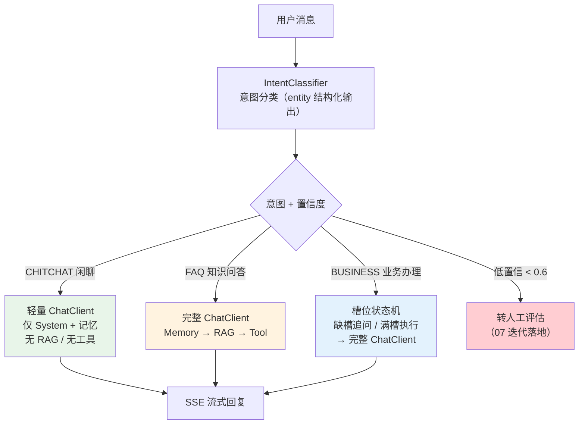
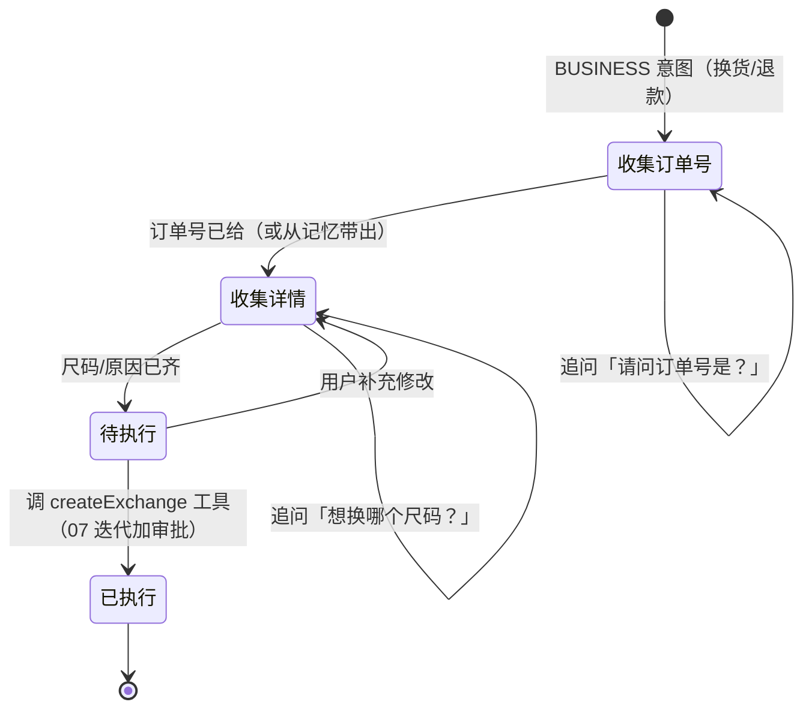
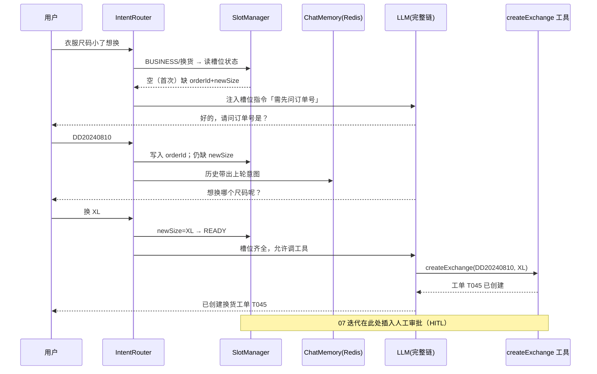
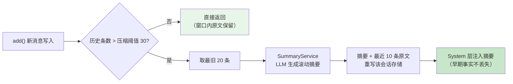

# 项目 00：智能客服系统 — 06-意图识别与多轮对话深化

> **定位**：在「对话 + 工具 + RAG + 记忆」核心链路之上，补齐智能客服的三个进阶能力——**意图分层路由**（FAQ/业务/闲聊三级分流）、**槽位填充与澄清追问**（换货/退款这类多步业务的标准骨架）、**长会话上下文压缩**（20 条窗口之外的摘要方案）。读完这篇，客服 Agent 从「每句话都走全链路」演进为「按意图分层、按业务填槽、按长度压缩」的精细化对话引擎。
> **读者画像**：已按 01-04 完成核心链路手写、读过 [05-核心代码讲解]，想让对话质量与 Token 成本同时优化的开发者。
> **前置阅读**：[04-记忆与会话]、[05-核心代码讲解]。
> **关联教程**：[教程 34-上下文工程]（五层拼接与压缩总纲）、[教程 13-结构化输出]（`entity(Class, spec)` 真实 API）；API 真实性以 [附录 05-SpringAI2-API基准] 为准。

---

## 1. 四问（本迭代）

| 问 | 答 |
|----|----|
| **新增了什么需求** | ① 闲聊/寒暄不应触发 RAG 检索与工具（省 Token、降延迟）；② 换货、退款类多步业务需要稳定的槽位收集流程，不能靠 LLM 自由发挥；③ 超长会话（窗口 > 20 条）里最早的订单号、承诺过的话不能被静默截断 |
| **影响了哪些模块** | 新增 `intent/`（意图分类器 + 路由器）、`slot/`（槽位状态机 + Redis 存储）、`memory/`（压缩装饰器）；改动 `ChatService`（入口先路由）、`ChatClientConfig`（拆出轻量 ChatClient） |
| **架构如何演进** | 单一全功能链 → **前置意图路由 + 双 ChatClient（轻量/完整）+ 槽位状态机外置 Redis + ChatMemory 压缩装饰器**；对话入口从「直发 ChatClient」变为「先分类再分发」 |
| **上一版本的痛点是什么** | 04 迭代后所有消息无差别走 Memory→RAG→Tool 全链：闲聊也做向量检索（浪费）、多步业务靠 LLM 即兴发挥（换货漏问尺码）、20 条窗口硬截断（丢关键事实） |

---

## 2. 意图分层路由：FAQ / 业务 / 闲聊三级分流

### 2.1 为什么分流

04 迭代后的链路对每条消息做同样的事：加载历史 → 向量检索 → 注册工具 → 调 LLM。但客服流量里约 30-40% 是「在吗」「谢谢」「你是机器人吗」这类闲聊——它们**不需要 RAG、不需要工具**，走全链路纯属浪费：多一次向量检索的延迟与 Embedding 费用，还可能召回无关文档干扰回答。

「遇到阻塞？→ [教程 34-上下文工程 §分层拼接策略]」——意图路由本质上是上下文工程的**前置决策层**：先决定「这一轮要拼哪几层上下文」，再进 ChatClient。

### 2.2 三级分流架构



三级各自的目标：

| 层级 | 典型消息 | 走的链路 | 成本 |
|------|---------|---------|------|
| CHITCHAT 闲聊 | 「在吗」「谢谢啦」 | 轻量 ChatClient（无 RAG/工具） | 最低，TTFT 最快 |
| FAQ 知识问答 | 「空气炸锅能用锡纸吗」 | 完整链（RAG 是主角） | 中 |
| BUSINESS 业务办理 | 「衣服尺码小了想换」 | 槽位状态机 + 完整链（工具是主角） | 高但必要 |

### 2.3 意图分类器：`entity(Class, spec)` 真实 API

意图分类是**结构化输出**的经典场景——用 `entity` 把 LLM 输出直接绑定到 record（[教程 13-结构化输出]）。

```java
package com.shop.customer.intent;

/** 意图分类结果（结构化输出，Spring AI 2.0.0 entity API 绑定）。 */
public record IntentResult(Intent intent, float confidence, String reason) {

    public enum Intent {
        CHITCHAT,   // 闲聊寒暄：在吗/谢谢/夸两句
        FAQ,        // 知识问答：政策/商品参数/使用方法
        BUSINESS    // 业务办理：换货/退款/查订单/改地址
    }
}
```

```java
package com.shop.customer.intent;

import org.springframework.ai.chat.client.ChatClient;
import org.springframework.stereotype.Component;

@Component
public class IntentClassifier {

    private static final String INTENT_PROMPT = """
            你是电商客服消息的意图分类器。把用户消息分类为：
            - CHITCHAT：寒暄、情绪表达、与业务无关的闲聊
            - FAQ：咨询政策、商品参数、使用方法等知识性问题
            - BUSINESS：换货、退款、查订单、改地址等需要执行操作的业务
            confidence 取 0.0~1.0；reason 用一句话给出分类依据。""";

    private final ChatClient chatClient;

    public IntentClassifier(ChatClient chatClient) {
        this.chatClient = chatClient;
    }

    // Spring AI 2.0.0：entity(Class, Consumer<EntityParamSpec>) 为 javap 实证重载
    // （[附录 05-SpringAI2-API基准]）；validateSchema() 让结构化输出前先过 schema 校验
    public IntentResult classify(String message) {
        return chatClient.prompt()
                .system(INTENT_PROMPT)
                .user(message)
                .call()
                .entity(IntentResult.class, spec -> spec.validateSchema());
    }
}
```

> ⚠️ 分类器注入的是**轻量 ChatClient**（无 RAG/工具/记忆——分类不需要上下文拼接），见 2.4 的 Bean 拆分。若要省一次 LLM 调用，可改用小模型：给分类器单独配一个 `ChatClient.builder(chatModel).build()`（`ChatClient.builder(ChatModel)` 静态工厂，javap 实证）并挂不同 model 参数——**意图分类用便宜模型、正式回答用好模型**是成本治理的常见组合（[教程 27-成本治理与Token计量]）。

### 2.4 双 ChatClient：轻量链与完整链

`ChatClient.Builder` 在 Boot 自动装配中是 prototype Bean，可构建多个不同配置的 ChatClient（[教程 02-ChatClient与对话模型]）：

```java
package com.shop.customer.config;

import com.shop.customer.tool.FaqQueryTool;
import com.shop.customer.tool.OrderQueryTool;
import org.springframework.ai.chat.client.ChatClient;
import org.springframework.ai.chat.client.advisor.MessageChatMemoryAdvisor;
import org.springframework.ai.chat.client.advisor.vectorstore.QuestionAnswerAdvisor;
import org.springframework.ai.chat.memory.ChatMemory;
import org.springframework.ai.vectorstore.SearchRequest;
import org.springframework.ai.vectorstore.VectorStore;
import org.springframework.context.annotation.Bean;
import org.springframework.context.annotation.Configuration;

@Configuration
public class ChatClientConfig {

    /** 完整链：记忆 + RAG + 工具（FAQ 与业务办理共用，[04 迭代三 §2.5] 的原链路）。 */
    @Bean
    public ChatClient chatClient(ChatClient.Builder builder,
                                 FaqQueryTool faqTool,
                                 OrderQueryTool orderTool,
                                 VectorStore vectorStore,
                                 ChatMemory chatMemory) {
        QuestionAnswerAdvisor ragAdvisor = QuestionAnswerAdvisor.builder(vectorStore)
                .searchRequest(SearchRequest.builder().topK(3).similarityThreshold(0.7).build())
                .build();
        return builder
                .defaultSystem("你是电商客服小智，只能依据工具查询结果回答，不要编造订单/物流信息。")
                .defaultTools(faqTool, orderTool)
                .defaultAdvisors(ragAdvisor, MessageChatMemoryAdvisor.builder(chatMemory).build())
                .build();
    }

    /** 轻量链：只保留人格与记忆，闲聊不检索、不挂工具（chatMemoryLite 复用同一 ChatMemory）。 */
    @Bean
    public ChatClient liteChatClient(ChatClient.Builder builder,
                                     ChatMemory chatMemory) {
        return builder
                .defaultSystem("你是电商客服小智。用户在和你寒暄，简短友好地回应即可，不要主动推销。")
                .defaultAdvisors(MessageChatMemoryAdvisor.builder(chatMemory).build())
                .build();
    }
}
```

> 两个 Bean 用的是**同一个 prototype Builder 的两次 build**，互不影响。轻量链仍保留记忆——「谢谢啦」之后接着问「那我那个订单呢」，历史接得上。

### 2.5 路由器：ChatService 入口改造

```java
// ChatService.chatStream 改造（同步 chat 同理）：
public Flux<String> chatStream(String sessionId, String message) {
    IntentResult intent = intentClassifier.classify(message);   // 前置分类（一次轻量 LLM 调用）
    ChatClient target = switch (intent.intent()) {
        case CHITCHAT -> liteChatClient;                        // 闲聊走轻量链
        case FAQ, BUSINESS -> chatClient;                       // 知识/业务走完整链（业务另走槽位，见 §3）
    };
    return target.prompt()
            .user(message)
            .advisors(a -> a.param(ChatMemory.CONVERSATION_ID, sessionId))
            .stream()
            .content();
}
```

> **代价说明**：路由多一次 LLM 调用（分类）。经验值：分类用小模型约 300 token、延迟 200-400ms；换来闲聊流量省掉一次 Embedding + 向量检索 + 大 Prompt。闲聊占比 > 20% 时净收益为正；若你的业务几乎全是 FAQ，可退化为「关键词快通道 + 兜底分类」两级路由。

---

## 3. 槽位填充与澄清追问：多步业务的标准骨架

### 3.1 为什么需要槽位

回看 [00-需求分析 §2.1 场景三]：换货要收集**订单号 + 新尺码**才能建工单。04 迭代里这完全靠 LLM 即兴——它可能忘了问尺码就调工具，也可能把上一轮的订单号张冠李戴。业务办理需要**确定性骨架**：缺什么槽就问什么，问全了才执行。这套「填槽-追问」模式源自传统对话系统的 Frame/Slot Filling，在 Agent 时代依然是多步业务最稳的落地方式（[教程 36-Agent工作流编排 §状态机与工作流选型]）。

### 3.2 槽位状态机



```java
package com.shop.customer.slot;

/** 换货业务槽位（存 Redis，跨轮次存活）。 */
public record ExchangeSlotState(
        String sessionId,
        String orderId,        // 槽位1：订单号
        String newSize,        // 槽位2：目标尺码
        String status          // COLLECTING / READY / EXECUTED
) {
    public boolean isComplete() {
        return orderId != null && newSize != null;
    }
}
```

槽位状态**外置 Redis**（`StringRedisTemplate` + JSON，04 迭代已引入 `spring-boot-starter-data-redis`），不塞进 ChatMemory——ChatMemory 存的是对话消息流，槽位是**业务工单状态**，两者生命周期不同（对话可清、工单未完结不能清）。存取器 `SlotStateStore` 为概念骨架（get/save/delete 三个方法 + 24h TTL），实现思路与 [04 迭代三 §2.3] 的 Redis 仓库一致，此处不重复贴码。

### 3.3 澄清追问的完整时序



**关键设计**：槽位由 `SlotManager`（Java 代码）判定完整性，**追问话术交给 LLM 生成**——确定性（必须问什么）与灵活性（怎么问得自然）分工。把当前槽位状态拼进 system 上下文（[教程 34-上下文工程 §五层拼接]：System → 工具 Schema → 记忆 → RAG → 用户输入，槽位指令属于 System 层的业务约束段）：

```java
// 槽位指令注入（概念骨架：拼进 system 文本）
String slotDirective = state.isComplete()
        ? "槽位已齐全（订单 %s，尺码 %s），可以调用 createExchange 工具。".formatted(state.orderId(), state.newSize())
        : "还缺槽位：" + missingSlots(state) + "，本轮必须先向用户追问这些信息，禁止在缺槽时调用工具。";
```

> 槽位抽取（从「换 XL」识别出 newSize=XL）同样可用 `entity(Class, spec)` 结构化输出做一个小抽取器，与 2.3 的分类器同构，不再重复贴码。

---

## 4. 长会话上下文压缩：20 条窗口之外的方案

### 4.1 硬截断的问题

[04 迭代三] 用 `MessageWindowChatMemory.maxMessages(20)` 控制上下文长度。窗口是**硬截断**：第 21 条消息进来，第 1 条被整体丢弃。客服会话偏偏是「头部信息最关键」——第一轮说的订单号、第三轮客服承诺的「加急处理」，到第 25 轮全没了，用户复述成本骤增。

「遇到阻塞？→ [教程 34-上下文工程 §上下文压缩]」

### 4.2 压缩策略：滚动摘要 + 近期原文



实现为一个**ChatMemory 装饰器**（门面模式，与 [04 迭代三 §2.4] 的两层组合正交叠加）：

```java
package com.shop.customer.memory;

import org.springframework.ai.chat.memory.ChatMemory;
import org.springframework.ai.chat.messages.AssistantMessage;
import org.springframework.ai.chat.messages.Message;
import java.util.List;

/**
 * 压缩记忆（概念骨架）：超过阈值时把最旧一段压成一条摘要消息。
 *
 * ChatMemory 是 2.0 真实接口（javap 实证：add(String,Message)/add(String,List)/
 * get(String)/clear(String)，[附录 05-SpringAI2-API基准 §7]）——本类只做装饰，
 * 存储仍委托给内部 MessageWindowChatMemory + 自研 Redis 仓库。
 */
public class SummarizingChatMemory implements ChatMemory {

    private static final int COMPRESS_THRESHOLD = 30;  // 超过才开始压缩
    private static final int KEEP_RECENT = 10;         // 近期原文保留条数

    private final ChatMemory delegate;
    private final SummaryService summaryService;       // 内部用 ChatClient 生成摘要

    public SummarizingChatMemory(ChatMemory delegate, SummaryService summaryService) {
        this.delegate = delegate;
        this.summaryService = summaryService;
    }

    @Override
    public void add(String conversationId, List<Message> messages) {
        delegate.add(conversationId, messages);
        List<Message> history = delegate.get(conversationId);   // get(String) 单参（2.0 真实签名）
        if (history.size() > COMPRESS_THRESHOLD) {
            List<Message> toSummarize = history.subList(0, history.size() - KEEP_RECENT);
            String summary = summaryService.summarize(conversationId, toSummarize);
            // 重写：摘要消息 + 近期原文（saveAll 全量覆盖语义，见下方 ⚠ 修复说明）
            // …概念骨架：委托内部 repository 重写存储…
            AssistantMessage summaryMessage = new AssistantMessage("【历史摘要】" + summary);
            // delegate 重放 summaryMessage + recent 段
        }
    }

    @Override
    public void add(String conversationId, Message message) { delegate.add(conversationId, message); }

    @Override
    public List<Message> get(String conversationId) { return delegate.get(conversationId); }

    @Override
    public void clear(String conversationId) { delegate.clear(conversationId); }
}
```

> ⚠️ **两个工程修复点**（照抄前必改）：
>
> 1. **04 的 `saveAll` 是追加语义**：[04 迭代三 §2.3] 用 `rightPushAll` 追加消息，压缩重写需要**全量覆盖**——把 `saveAll` 改为 `delete(KEY) 后 rightPushAll`（或 Lua 脚本原子化 DEL+RPUSH），否则压缩后历史翻倍。
> 2. **摘要质量验收**：摘要必须保住「订单号、工单号、已承诺事项」三类硬事实——`SummaryService` 的 Prompt 要显式要求逐条保留，否则压缩就是新的丢信息路径。
>
> 压缩成本：每次触发多一次 LLM 调用（约 1-2k token 输入），30 条触发一次，摊薄后可接受。若要更省，可改为「每天定时离线压缩」（Spring `@Scheduled`）而非写路径同步压缩。

---

## 5. 测试与验证

### 5.1 单元测试

| 测试类 | 用例 | 断言 |
|--------|------|------|
| `IntentClassifierTest` | 30 条标注样本（闲聊/FAQ/业务各 10） | 分类准确率 ≥ 90%；`confidence ∈ [0,1]`；`entity` 反序列化不抛异常 |
| `SlotManagerTest` | 状态机流转：空→填订单号→填尺码→READY | 缺槽清单正确；`isComplete()` 翻转时机正确；缺槽时 system 指令包含「禁止调工具」 |
| `SummarizingChatMemoryTest` | 35 条历史写入 | 触发一次压缩；输出 = 1 条摘要 + 10 条原文；摘要文本包含测试数据中的订单号 |

> `IntentClassifierTest` 依赖真实 LLM（DeepSeek），跑法与验收口径见 [附录 04-测试策略]（LLM 相关测试的分层：确定性逻辑单测 / 模型行为金标测）。

### 5.2 curl 验证

```sh
# ① 闲聊走轻量链：观察日志无 vector store 检索 Span（spring.ai.kind=db.system=postgresql）
curl -N -X POST "http://localhost:8080/api/chat/stream?s=chat-1" \
  -H "Content-Type: text/plain" -d "在吗，你是真人吗"

# ② FAQ 走完整链：日志出现向量检索 + 引用来源
curl -N -X POST "http://localhost:8080/api/chat/stream?s=chat-1" \
  -H "Content-Type: text/plain" -d "空气炸锅能用锡纸吗"

# ③ 槽位追问：第一轮不给订单号，应被追问
curl -N -X POST "http://localhost:8080/api/chat/stream?s=slot-1" \
  -H "Content-Type: text/plain" -d "买的衣服尺码小了想换"
# 预期回复含「订单号」追问；redis-cli GET slot:slot-1 可见槽位 JSON
```

### 5.3 端到端

换货三步曲（问尺码→给订单→给尺码）连续对话，最终回复包含工单号且槽位状态变 EXECUTED；随后问「我刚才的订单号是多少」，回答正确（记忆 + 摘要均生效）。

---

## 6. 验收对照

| 验收项 | 目标 | 实测口径 |
|--------|------|---------|
| 意图分类准确率 | ≥ 90%（30 样本） | `IntentClassifierTest` 通过率 |
| 闲聊 RAG 调用 | 0 次 | 日志/Micrometer 中闲聊请求无 vector 检索 Span |
| 整体向量检索调用量 | 较 05 版下降 ≥ 25% | 检索 Span 计数 / 总请求 |
| 缺槽追问命中率 | 100%（缺槽必问、不偷跑工具） | 槽位测试 + 抽检 20 条业务会话 |
| 压缩后事实保留 | 订单/工单号在摘要中不丢 | `SummarizingChatMemoryTest` 断言 |
| 闲聊 TTFT | < 600ms（轻量链） | SSE 首事件时间戳差 |

---

## 7. 总结

本迭代把「一条链打天下」拆成了三层精细治理：**意图决定走哪条链**（闲聊轻量/知识检索/业务填槽）、**槽位决定业务何时能执行**（确定性骨架 + LLM 话术）、**压缩决定长会话记多久**（滚动摘要替代硬截断）。三者共同点是：把「上下文拼什么」从 LLM 的即兴行为变成工程可控的决策——这正是上下文工程的核心（[教程 34-上下文工程]）。

**下一篇**：[07-坐席协同与HITL深化](07-坐席协同与HITL深化.md)——AI 置信度低时转人工、危险工具上人工审批（HITL 正确落点）、坐席实时话术辅助与会话质检。
