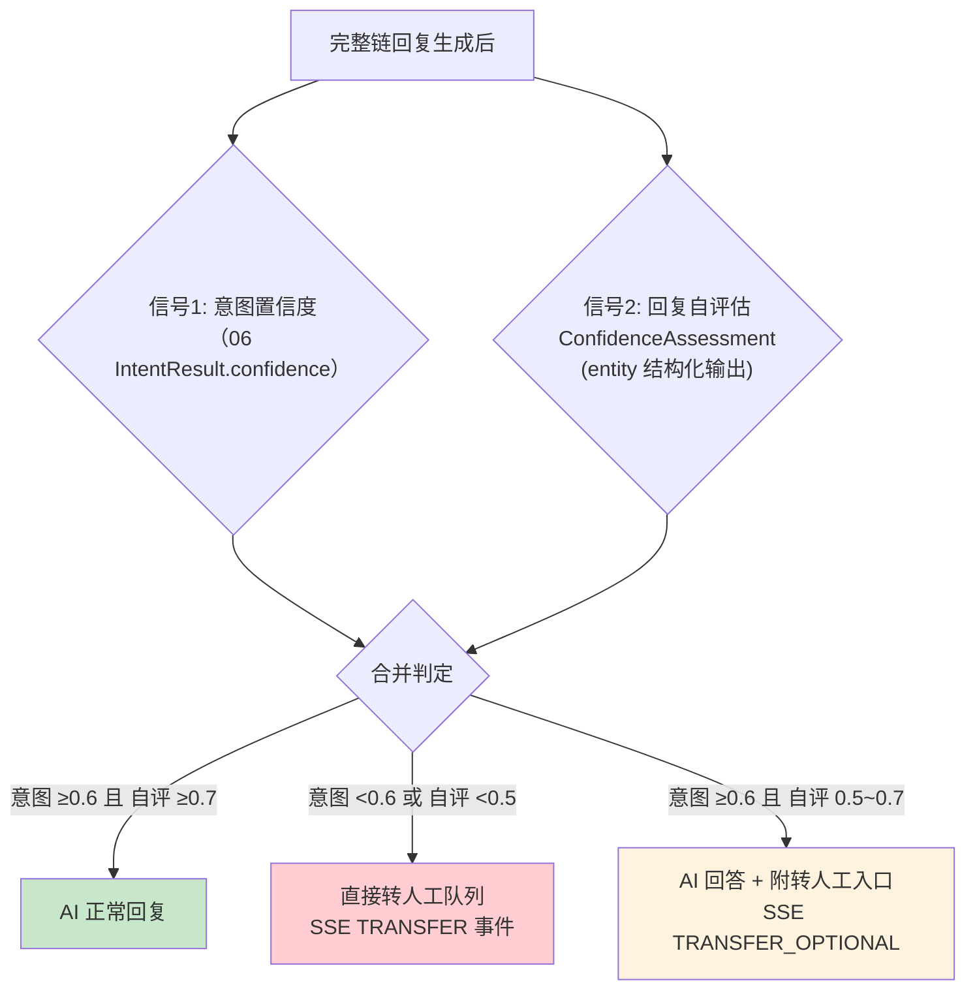
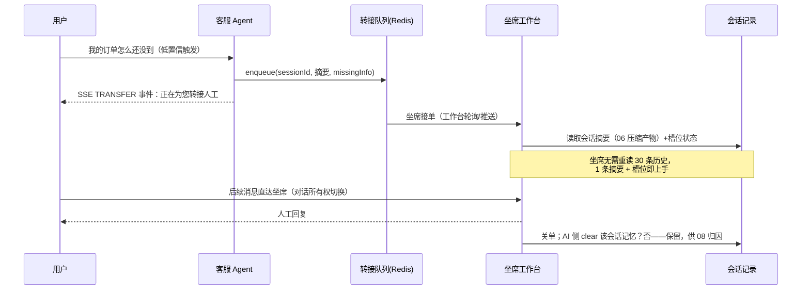
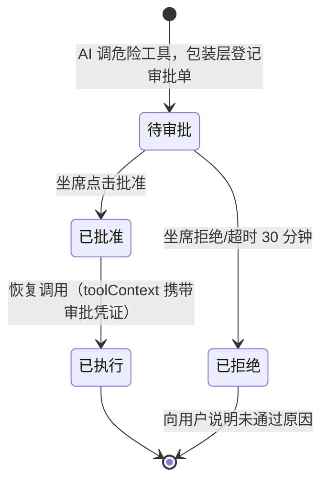
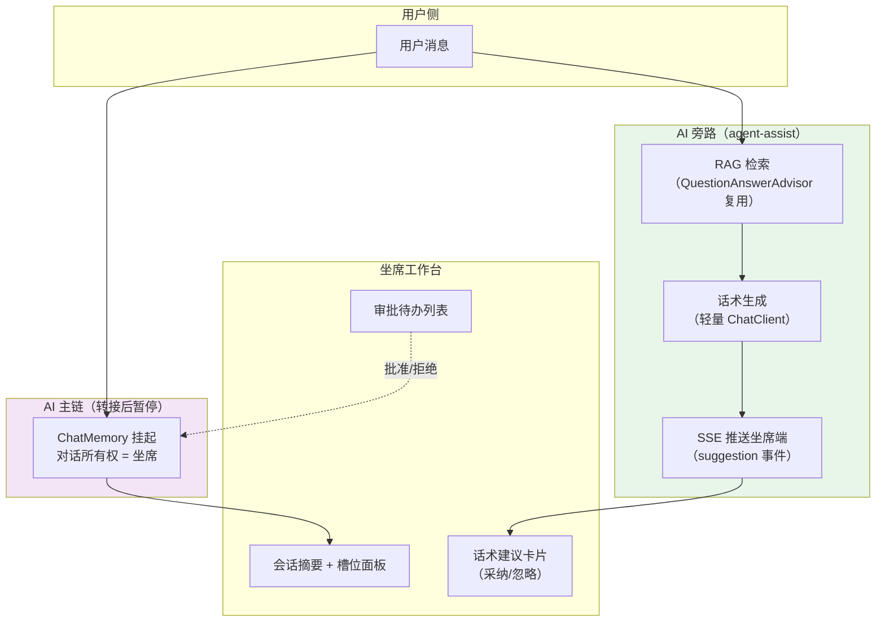
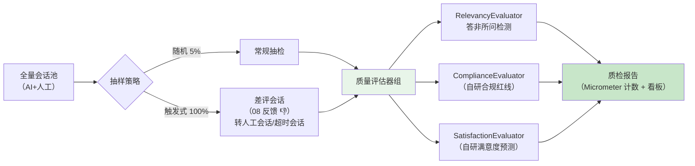

# 项目 00：智能客服系统 — 07-坐席协同与 HITL 深化

> **定位**：让 AI 客服从「单打独斗」演进为「人机协同」——**置信度低自动转人工**（双信号判定）、**危险工具人工审批**（HITL 正确落点：`ToolCallback` 包装层，不是 Advisor）、**坐席实时话术辅助**（旁路 RAG 建议）、**会话质检**（满意度与合规抽检）。读完这篇，你掌握客服场景人机协作的完整工程闭环。
> **读者画像**：已完成 06 意图路由与槽位骨架，要让系统具备「知道自己不行」与「该出手时让人出手」能力的设计者。
> **前置阅读**：[06-意图识别与多轮对话深化]。
> **关联教程**：[教程 28-Human-in-the-Loop与审批流]（HITL 落点铁律）、[教程 24-多页面流式响应与会话管理]（坐席端 SSE 推送）；API 真实性以 [附录 05-SpringAI2-API基准] 为准。

---

## 1. 四问（本迭代）

| 问 | 答 |
|----|----|
| **新增了什么需求** | ① AI 答不上/可能答错时要主动转人工，不能硬答（差评主要来源）；② 创建换货工单、退款等**写操作**必须有人确认后执行；③ 转人工后坐席需要 AI 旁路辅助（话术建议 + 会话摘要交接）；④ 服务质量需要系统化抽检（满意度归因 + 合规红线） |
| **影响了哪些模块** | 新增 `hitl/`（置信度自评 + 转接队列 + 审批工具包装 + 挂起恢复）、`qc/`（合规/满意度评估器）；改动 `tools/`（危险工具挂审批包装）、`ChatService`（双信号转人工判定）、`ChatController`（SSE 事件拆分）、SSE 事件枚举（00 的 `SSEEventType` 扩展出四类：`TRANSFER` / `TRANSFER_OPTIONAL` / `APPROVAL_REQUIRED` / `suggestion`） |
| **架构如何演进** | 纯 AI 闭环 → **人机双工位**：AI 工位（ChatClient 链）与坐席工位（工作台）经「转接队列 + 审批中心 + 辅助旁路」协作；对话所有权（AI/人工）成为会话的一等状态 |
| **上一版本的痛点是什么** | 06 后对话质量提升，但 ① 低置信问题 LLM 仍会编一个「看起来像」的答案；② 槽位填齐即可执行 `createExchange`，无人工确认——错单成本直接落到业务；③ 转人工=用户自己打电话，无数字通道 |

---

## 2. 置信度评估与转人工

### 2.1 双信号置信度

单一信号不可靠：意图分类器只看消息本身，看不到「知识库里有没有答案」。本项目用**双信号**：



信号 2 复用 06 的结构化输出套路（[教程 13-结构化输出]）：

```java
package com.shop.customer.hitl;

/** 回复置信度自评估（Spring AI 2.0.0 entity API 绑定）。 */
public record ConfidenceAssessment(
        float confidence,     // 0.0~1.0
        boolean hasAnswer,    // 检索/工具结果是否足以回答
        String missingInfo    // 缺什么（转人工时随工单带给坐席）
) {}
```

旁路自评的完整调用（`ConfidenceEvaluator`，复用 [06 §2.4] 的「无记忆辅助链」`assistantChatClient`——自评是单轮无状态判定，不要历史；`liteChatClient`/`chatClient` 挂记忆，用它们会把自评写进会话）：

```java
package com.shop.customer.hitl;

import org.springframework.ai.chat.client.ChatClient;
import org.springframework.stereotype.Component;

/** 回复置信度自评估：双信号 2 的实现。 */
@Component
public class ConfidenceEvaluator {

    /** 置信度评估：0.0~1.0，hasAnswer=检索/工具是否足以回答。 */
    public record ConfidenceAssessment(float confidence, boolean hasAnswer, String missingInfo) {}

    private static final String SELF_CHECK_PROMPT = """
            你是客服回复质量审计员。对照下面的【参考片段】与用户问题，评估能否负责任地回答：
            - 若参考片段/工具结果足以支撑回答 → hasAnswer=true、confidence 取 0.8~1.0
            - 若不足以回答 → hasAnswer=false、confidence 取 0.0~0.4，并在 missingInfo 说明缺什么
            - 输出 JSON：confidence(0.0~1.0)、hasAnswer(boolean)、missingInfo(字符串，无则空)。""";

    private final ChatClient assistantChatClient;

    public ConfidenceEvaluator(ChatClient assistantChatClient) {
        this.assistantChatClient = assistantChatClient;
    }

    public ConfidenceAssessment evaluate(String retrievedContext, String userMessage) {
        return assistantChatClient.prompt()
                .system(SELF_CHECK_PROMPT)
                .user("【参考片段】\n" + retrievedContext + "\n【用户问题】\n" + userMessage)
                .call()
                .entity(ConfidenceAssessment.class, spec -> spec.validateSchema());
    }
}
```

**关键：务必把 `ConfidenceEvaluator` 与实际请求链路串起来，否则 §2.5 的 curl 永远触发不了 `event: TRANSFER`。**下面是完整接入——`TransferService`（转接队列，Redis，供双信号判定低置信时入队）与 `ChatService.stream` 的双信号判定分支。转人工在 FAQ/BUSINESS 分支**用检索上下文预判定**（`vectorStore.similaritySearch` 手动取上下文给自评，置信度过低就不进完整链回复、直接转），既省一次完整链调用又让转人工真正可测：

`TransferService`（转接队列，完整实现）：

```java
package com.shop.customer.hitl;

import org.springframework.data.redis.core.StringRedisTemplate;
import org.springframework.stereotype.Service;
import tools.jackson.databind.ObjectMapper;

import java.time.Duration;
import java.util.Map;

/** 转接队列：低置信会话入队，坐席工作台轮询/推送接单。键 slot:transfer:<sessionId>，24h TTL。 */
@Service
public class TransferService {

    private static final String KEY_PREFIX = "transfer:";
    private static final Duration TTL = Duration.ofHours(24);
    private final StringRedisTemplate redis;
    private final ObjectMapper mapper = new ObjectMapper();

    public TransferService(StringRedisTemplate redis) { this.redis = redis; }

    /** 入队：记录会话摘要 + 缺什么信息（missingInfo），供坐席上手。 */
    public void enqueue(String sessionId, String summary, String missingInfo) {
        Map<String, Object> doc = Map.of(
                "sessionId", sessionId,
                "summary", summary,
                "missingInfo", missingInfo);
        try {
            redis.opsForValue().set(KEY_PREFIX + sessionId, mapper.writeValueAsString(doc), TTL);
        } catch (Exception e) {
            throw new RuntimeException(e);
        }
    }
}
```

`ChatService.stream` 双信号接入（在 06 三分支基础上，为 FAQ/BUSINESS 插入判定）：

```java
package com.shop.customer.service;

import com.shop.customer.hitl.ConfidenceEvaluator;
import com.shop.customer.hitl.TransferService;
import com.shop.customer.dto.IntentResult;
import com.shop.customer.slot.SlotManager;
import org.springframework.ai.chat.client.ChatClient;
import org.springframework.ai.chat.memory.ChatMemory;
import org.springframework.ai.document.Document;
import org.springframework.ai.vectorstore.SearchRequest;
import org.springframework.ai.vectorstore.VectorStore;
import org.springframework.stereotype.Service;
import reactor.core.publisher.Flux;

import java.util.List;
import java.util.stream.Collectors;

@Service
public class ChatService {

    private final ChatClient client;              // 06 §2.4 完整链（记忆+RAG+工具）
    private final ChatClient liteChatClient;      // 06 §2.4 闲聊记忆链
    private final IntentClassifier classifier;    // 06 意图分类器（注入 assistantChatClient）
    private final SlotManager slotManager;        // 06 槽位
    private final ConfidenceEvaluator confidenceEvaluator;  // 07 自评
    private final TransferService transferService;          // 07 转接队列
    private final VectorStore vectorStore;                  // 07 判定用的检索上下文来源

    public ChatService(ChatClient client, ChatClient liteChatClient,
                       IntentClassifier classifier, SlotManager slotManager,
                       ConfidenceEvaluator confidenceEvaluator, TransferService transferService,
                       VectorStore vectorStore) {
        this.client = client; this.liteChatClient = liteChatClient;
        this.classifier = classifier; this.slotManager = slotManager;
        this.confidenceEvaluator = confidenceEvaluator;
        this.transferService = transferService;
        this.vectorStore = vectorStore;
    }

    public Flux<String> stream(String prompt, String sessionId) {
        IntentResult intentResult = classifier.classify(prompt);
        switch (intentResult.intent()) {
            case CHITCHAT -> {
                return liteChatClient.prompt().user(prompt).stream().content();
            }
            case FAQ -> {
                return maybeTransferToHuman(intentResult, prompt, sessionId, () ->
                        client.prompt()
                                .user(prompt)
                                .advisors(spec -> spec.param(ChatMemory.CONVERSATION_ID, sessionId))
                                .stream().content());
            }
            case BUSINESS -> {
                SlotManager.SlotTurn turn = slotManager.handle(sessionId, prompt);
                if (!turn.ready()) {
                    return liteChatClient.prompt().system(turn.directive()).user(prompt).stream().content();
                }
                // 槽位齐全：先双信号判定，低置信也先不执行写操作、转人工
                return maybeTransferToHuman(intentResult, prompt, sessionId, () ->
                        client.prompt()
                                .system(turn.directive())
                                .user(prompt)
                                .advisors(spec -> spec.param(ChatMemory.CONVERSATION_ID, sessionId))
                                .stream().content());
            }
            default -> throw new IllegalStateException("未知意图: " + intentResult.intent());
        }
    }

    /**
     * 双信号判定：用检索上下文预评能否负责任回答。
     * 自评中等（0.5~0.7）→ 正常回复 + 末尾附转人工入口提示；低置信（<0.5 或意图 <0.6）→ 直接转人工。
     * 转人工返回 `Flux.just("[TRANSFER:...]")`，由 controller 拆成 SSE event: TRANSFER。
     */
    private Flux<String> maybeTransferToHuman(IntentResult intentResult, String prompt,
                                              String sessionId,
                                              java.util.function.Supplier<Flux<String>> normalReply) {
        // ① 检索上下文（自评信号需要）——与 Advisor 内 RAG 同库，仅多抓一份给判定用
        // SearchRequest.Builder.query(String) 真实 API（javap 实证）
        List<Document> docs = vectorStore.similaritySearch(
                SearchRequest.builder().topK(3).similarityThreshold(0.3).query(prompt).build());
        String retrieved = docs.stream().map(Document::getText).collect(Collectors.joining("\n"));
        // ② 信号2 自评
        ConfidenceEvaluator.ConfidenceAssessment ca =
                confidenceEvaluator.evaluate(retrieved, prompt);
        // ③ 合并双信号：意图 <0.6 或自评 <0.5 → 直接转人工
        if (intentResult.confidence() < 0.6f || ca.confidence() < 0.5f) {
            transferService.enqueue(sessionId, prompt, ca.missingInfo());
            return Flux.just("[TRANSFER:正在为您转接人工，已通知坐席接手]");
        }
        // ④ 自评中等 → 正常回复后附转人工入口
        if (ca.confidence() < 0.7f) {
            return normalReply.get().concatWith(Flux.just("\n[TRANSFER_OPTIONAL:若仍未解决，可一键转人工]"));
        }
        // ⑤ 高置信 → 正常回复
        return normalReply.get();
    }
}
```

`ChatController` 相应改造：把 `Flux<String>` 里的约定标记拆成 SSE 事件（低置信转人工 → `event: TRANSFER`；正常 token → `event: token`）：

```java
package com.shop.customer.controller;

import com.shop.customer.service.ChatService;
import org.springframework.http.MediaType;
import org.springframework.http.codec.ServerSentEvent;
import org.springframework.web.bind.annotation.*;
import reactor.core.publisher.Flux;

@RestController
@RequestMapping("/api/chat")
public class ChatController {

    private final ChatService service;

    public ChatController(ChatService service) { this.service = service; }

    @PostMapping(value = "/stream", produces = MediaType.TEXT_EVENT_STREAM_VALUE)
    public Flux<ServerSentEvent<String>> stream(String prompt, @RequestHeader String sessionId) {
        return service.stream(prompt, sessionId)
                .map(token -> {
                    if (token.startsWith("[TRANSFER:")) {
                        // 低置信转人工 → SSE event: TRANSFER
                        return ServerSentEvent.<String>builder()
                                .event("TRANSFER")
                                .data(token.substring("[TRANSFER:".length(), token.length() - 1))
                                .build();
                    }
                    if (token.startsWith("\n[TRANSFER_OPTIONAL:")) {
                        // 中置信附转人工入口 → SSE event: TRANSFER_OPTIONAL
                        return ServerSentEvent.<String>builder().event("TRANSFER_OPTIONAL").data("1").build();
                    }
                    return ServerSentEvent.<String>builder().event("token").data(token).build();
                })
                .concatWith(Flux.just(ServerSentEvent.<String>builder().event("done").data("[DONE]").build()));
    }
}
```

> 上面完整接入让 §2.5 的 curl 真正可测：问「知识库没有答案」的问题 → 自评 `confidence` 走低 → `[TRANSFER:...]` → controller 拆 `event: TRANSFER`（断言表 #1 命中）。`vectorStore` 字段需在 `ChatService` 里注入（`@Autowired` 或构造参数加 `VectorStore`）：判定用检索上下文来自 `vectorStore.similaritySearch(SearchRequest)`（真实 API：`VectorStoreRetriever.similaritySearch(SearchRequest)` 返回 `List<Document>`，javap 实证）。**成本注**：自评每次多一次轻量 LLM 调用。可只在「RAG 相似度低于 0.75 或工具返回空」时触发自评，其余情况用 `hasAnswer=false` 短路（条件触发可砍掉一半自评调用）。

### 2.2 转人工的完整协作时序



**交接的关键资产**正是 06 的产出：压缩摘要 + 槽位状态。转人工不是「从头再来」，而是「上下文交接」——这是人机协同体验的分水岭。

---

### 2.5 本节测试与验证（置信度评估与转人工）

**前置条件**：06 已通过；双信号置信度评估已接入路由。

**材料——curl 探针**：

```bash
# ① 问一个知识库没有的问题，触发转人工
curl -N -X POST "http://localhost:8080/api/chat/stream?s=t1" \
  -H "Content-Type: text/plain" -d "帮我改一下收货地址顺便把发票抬头改成公司"
```

**步骤与断言**：

| # | 操作 | 预期（PASS 判据） |
|---|------|------------------|
| 1 | 材料① | SSE 出现 `event: TRANSFER` |
| 2 | `ConfidenceAssessmentTest`（10 条「知识库无答案」问题） | `hasAnswer=false` 时触发转人工路径 |

**失败排查**：①该转不转→置信度阈值过高或自评 Prompt 太宽松；②误转率超标→可答样本被判低置信（补金标样本校准阈值）。

## 3. 危险工具人工审批（HITL 落点）

### 3.1 落点铁律

CLAUDE.md / [附录 05-02] 铁律：**HITL 的正确落点是 `ToolCallingManager` 装饰器或 `ToolCallback` 包装层，不是 Advisor**。原因：

| 落点 | 能拿到什么 | 判定 |
|------|-----------|------|
| Advisor 层 | 只有 `ChatClientRequest`（prompt + context）——**工具意图尚未发生**，拿不到「要调哪个工具、什么参数」 | ❌ 不适用 |
| `ToolCallingManager` 装饰器 | `executeToolCalls(Prompt, ChatResponse)`——批量工具执行统一入口 | ✅ 适合全局策略（限流/审计） |
| `ToolCallback` 包装层 | `call(String toolInput)` 的**单个工具 + 参数级**信息 | ✅ 适合单工具审批（本项目选此） |

本项目审批粒度是**单个危险工具**（`createExchange`/`createRefund`），选 `ToolCallback` 包装层。

### 3.2 审批包装器（真实接口签名）

`ToolCallback` 接口 javap 实证（[附录 05-02 §1]）：`getToolDefinition()`、`getToolMetadata()`（default）、`call(String)`、`call(String, ToolContext)`（default）。

```java
package com.shop.customer.hitl;

import org.springframework.ai.chat.model.ToolContext;
import org.springframework.ai.tool.ToolCallback;
import org.springframework.ai.tool.definition.ToolDefinition;
import org.springframework.ai.tool.metadata.ToolMetadata;

/**
 * 危险工具审批包装（装饰器）：把「执行」换成「挂起-等审批-恢复」。
 * 真实接口签名经 javap 实证（Spring AI 2.0.0）。
 */
public class ApprovalToolCallback implements ToolCallback {

    private final ToolCallback delegate;          // 被包装的原始工具
    private final ApprovalCenter approvalCenter;  // 审批中心（完整实现见 §3.4）

    public ApprovalToolCallback(ToolCallback delegate, ApprovalCenter approvalCenter) {
        this.delegate = delegate;
        this.approvalCenter = approvalCenter;
    }

    @Override
    public ToolDefinition getToolDefinition() { return delegate.getToolDefinition(); }

    @Override
    public ToolMetadata getToolMetadata() { return delegate.getToolMetadata(); }

    @Override
    public String call(String toolInput) {
        // 同步入口：登记审批任务，向 LLM 返回「待审批」占位结果（不真正执行）
        String approvalId = approvalCenter.submit(delegate, toolInput);
        return "该操作需要人工审批（审批单 %s），已通知坐席，请告知用户稍候。".formatted(approvalId);
    }

    @Override
    public String call(String toolInput, ToolContext toolContext) {
        // 审批通过后的恢复路径：toolContext 携带 approvalId（见 3.3），凭证校验通过才放行
        if (approvalCenter.isApproved(toolContext)) {
            return delegate.call(toolInput, toolContext);   // 真正执行写操作
        }
        return call(toolInput);                             // 未审批 → 走挂起
    }
}
```

注册方式：把危险工具的原始回调包一层再挂载。完整代码见下——`MethodToolCallbackProvider`（`org.springframework.ai.tool.method`）javap 实证：`builder().toolObjects(Object...)` → `build()` → `getToolCallbacks()`。挂载到 `ChatClient` 用**未过时的** `ChatClient.Builder.defaultTools(Object...)`（javap 实证：`defaultToolCallbacks(ToolCallback...)`/`defaultToolCallbacks(List)` 在 2.0.0 均已标 `@Deprecated`，故用 `defaultTools` 传 `ToolCallback[]`）。`createExchange` 的 `@Tool` 方法先经 provider 变成 `ToolCallback[]`，再用 `ApprovalToolCallback` 包装后挂载：

```java
package com.shop.customer.config;

import com.shop.customer.hitl.ApprovalCenter;
import com.shop.customer.hitl.ApprovalToolCallback;
import com.shop.customer.tool.CreateExchangeTool;
import org.springframework.ai.chat.client.ChatClient;
import org.springframework.ai.tool.ToolCallback;
import org.springframework.ai.tool.method.MethodToolCallbackProvider;
import org.springframework.beans.factory.annotation.Autowired;
import org.springframework.context.annotation.Bean;
import org.springframework.context.annotation.Configuration;

import java.util.Arrays;
import java.util.Set;
import java.util.stream.Collectors;

@Configuration
public class ToolSecurityConfig {

    @Autowired
    private ApprovalCenter approvalCenter;

    /** 危险工具名单：命中即套审批包装（其余工具原样放行）。 */
    private static final Set<String> DANGEROUS_TOOLS = Set.of("createExchange", "createRefund");

    @Bean
    public ToolCallback[] securedToolCallbacks(
            ChatClient.Builder builder, CreateExchangeTool exchangeTool) {
        // ① 原始 @Tool 方法 → ToolCallback[]（MethodToolCallbackProvider 真实 API，javap 实证）
        ToolCallback[] originals = MethodToolCallbackProvider.builder()
                .toolObjects(exchangeTool)          // 可多个对象，逐个加
                .build()
                .getToolCallbacks();
        // ② 危险工具包审批包装，其余透明放行
        return Arrays.stream(originals)
                .map(tc -> DANGEROUS_TOOLS.contains(tc.getToolDefinition().name())
                        ? new ApprovalToolCallback(tc, approvalCenter)
                        : tc)
                .toArray(ToolCallback[]::new);
    }
}
```

> 上面用 `Set.of` 与 `getToolDefinition().name()` 判断工具名（`ToolDefinition.name()` javap 实证）；接线进了 `ToolSecurityConfig` 独立的 `@Configuration`，与 [06 §2.4] 三链配置解耦。被包装的 `createExchange` 工具（完整 `@Tool` 类，`@Tool`/`@ToolParam` 属性 javap 实证——`@Tool(name/description/returnDirect)`、`@ToolParam(required/description)`，注意**无 `value()` 属性**）：

```java
package com.shop.customer.tool;

import org.springframework.ai.tool.annotation.Tool;
import org.springframework.ai.tool.annotation.ToolParam;
import org.springframework.stereotype.Component;

/** 换货工单创建工具（危险写操作，07 用 ApprovalToolCallback 包装挂审批）。 */
@Component
public class CreateExchangeTool {

    @Tool(name = "createExchange", description = "为订单创建换货工单。调用前必须确认订单号与原商品、目标尺码已齐备。")
    public String createExchange(
            @ToolParam(description = "订单号，以 DD 开头") String orderId,
            @ToolParam(description = "要换到的目标尺码，如 S/M/L/XL") String newSize) {
        // 概念实现：实际应调工单系统 API 建单并持久化；这里返回工单号供演示链路
        String ticketId = "T" + Math.abs((orderId + newSize).hashCode());
        return "已创建换货工单 " + ticketId + "（订单 " + orderId + "，换 " + newSize + " 码）";
    }
}
```

> 06 §3.3 时序里的 `createExchange(DD20240810, XL) → 工单 T045` 就是这个工具。审批包装（`ApprovalToolCallback`）把「执行」拦成「挂起」，§3.3 的恢复路径才真正放行 `delegate.call(input, ctx)`。

### 3.3 挂起与恢复：EventLoop 上不能等人

`ToolCallback.call` 是**同步契约**（返回 String），而人工审批要几十秒到几小时——绝不能在调用线程上阻塞等待（WebFlux 铁律：EventLoop 禁 block）。本项目采用**挂起-恢复**模式：



- **挂起**：`call(toolInput)` 返回占位文本（LLM 据此告知用户「已提交审批」）；同时经 SSE 推 `APPROVAL_REQUIRED` 事件（含审批单号、工具名、参数摘要）到坐席工作台——00 篇设计的 SSE 事件枚举正好派上用场。
- **恢复**：坐席批准后，`ApprovalCenter` 以**新请求**重放该轮对话：`ChatService` 用 `toolContext(Map.of("approvalId", id))`（`ChatClientRequestSpec.toolContext(Map)`，javap 实证）重新发起，`ApprovalToolCallback.call(input, ctx)` 校验凭证放行执行。审批前后是**两次独立请求**，中间零线程占用——这就是响应式语境下「暂停不占计算」的落地（[教程 28-Human-in-the-Loop与审批流 §挂起模式]、[教程 40-长任务持久化与中断恢复]）。
- **超时**：`ApprovalCenter` 对 30 分钟未决审批单自动置为已拒绝（Redis TTL 扫描），避免用户无限等待。

`ApprovalCenter`（审批单登记 / 凭证校验 / 超时拒绝 / 坐席决策接口的完整实现）：

```java
package com.shop.customer.hitl;

import org.springframework.ai.chat.model.ToolContext;
import org.springframework.ai.tool.ToolCallback;
import org.springframework.data.redis.core.StringRedisTemplate;
import org.springframework.stereotype.Service;
import tools.jackson.databind.ObjectMapper;

import java.time.Duration;
import java.util.Map;
import java.util.UUID;

/**
 * 审批中心：登记审批单（Redis + 30min TTL），坐席决策后改写状态，恢复时校验凭证放行。
 * 审批单状态：PENDING / APPROVED / REJECTED（存 JSON 字符串）。
 */
@Service
public class ApprovalCenter {

    private static final String KEY_PREFIX = "approval:";
    private static final Duration TTL = Duration.ofMinutes(30);   // 30 分钟未决 → 扫成拒绝
    private static final String DECISION_KEY = "decision";

    private final StringRedisTemplate redis;
    private final ObjectMapper mapper = new ObjectMapper();

    public ApprovalCenter(StringRedisTemplate redis) { this.redis = redis; }

    /** 登记审批单，返回审批单号（调用方回给用户「已提交审批」）。 */
    public String submit(ToolCallback delegate, String toolInput) {
        String id = "AP-" + UUID.randomUUID().toString().substring(0, 8);
        Map<String, Object> doc = Map.of(
                "id", id,
                "tool", delegate.getToolDefinition().name(),
                "input", toolInput,           // 工具入参摘要，供坐席判断
                DECISION_KEY, "PENDING");
        // 同步 RedisTemplate 写审批单（Redis 毫秒级，WebFlux 铁律允许的收敛点）
        redis.opsForValue().set(KEY_PREFIX + id, mapper.writeValueAsString(doc), TTL);
        return id;
    }

    /** 恢复路径校验：toolContext 携带的 approvalId 是否已批准（校验即消费，幂等）。 */
    public boolean isApproved(ToolContext toolContext) {
        Map<String, Object> ctx = toolContext.getContext();
        if (ctx == null || !ctx.containsKey("approvalId")) {
            return false;
        }
        String id = (String) ctx.get("approvalId");
        Map<String, Object> doc = read(id);
        return doc != null && "APPROVED".equals(doc.get(DECISION_KEY));
    }

    /** 坐席决策入口。决策 Key = approvalId。 */
    public boolean decide(String approvalId, boolean approve) {
        String key = KEY_PREFIX + approvalId;
        Map<String, Object> doc = read(approvalId);
        if (doc == null) {
            return false;                     // 不存在或已过期
        }
        // 覆盖决策结果；PENDING → APPROVED / REJECTED
        doc = new java.util.HashMap<>(doc);
        doc.put(DECISION_KEY, approve ? "APPROVED" : "REJECTED");
        redis.opsForValue().set(key, mapper.writeValueAsString(doc), TTL);
        return true;
    }

    private Map<String, Object> read(String id) {
        String json = redis.opsForValue().get(KEY_PREFIX + id);
        if (json == null) {
            return null;
        }
        return mapper.readValue(json, Map.class);
    }
}
```

> 上面是 `ApprovalToolCallback` 依赖的完整实现：`submit(delegate, toolInput)` 返回审批单号、`isApproved(ToolContext)` 用 `toolContext.getContext().get("approvalId")` 校验（`ToolContext.getContext()` javap 实证）；`decide(approvalId, approve)` 对应坐席侧 `POST /api/approval/{id}/decision`。存储复用 04 已引入的 `StringRedisTemplate`。审批状态机见上节 3.3 时序。

---

### 3.6 本节测试与验证（审批闸门与挂起恢复）

**前置条件**：§2.5 已通过；`createExchange` 已被审批 ToolCallback 包装；槽位链路（06）可用。

**材料——审批剧本**：

```bash
# ② 槽位齐全后 AI 调 createExchange → 触发审批
curl -N -X POST "http://localhost:8080/api/chat/stream?s=t2" \
  -H "Content-Type: text/plain" -d "订单 DD20240810 换 XL 码"
# 预期：SSE 出现 event: APPROVAL_REQUIRED + 审批单号；回复说已提交审批
# 坐席批准后：
curl -X POST "http://localhost:8080/api/approval/{id}/decision" \
  -H "Content-Type: application/json" -d '{"approve": true}'
```

**步骤与断言**：

| # | 操作 | 预期（PASS 判据） |
|---|------|------------------|
| 1 | 材料② 首条 | SSE 出现 `event: APPROVAL_REQUIRED` + 审批单号，未真正执行工具 |
| 2 | 材料② 批准后问「换货办好了吗」 | ≤3 秒内回复含工单号（凭证放行执行） |
| 3 | `ApprovalToolCallbackTest` | 无凭证调用返回占位文本（不含工单号）；批准后才真正执行 delegate；拒绝后不放行 |
| 4 | `ApprovalTimeoutTest`（模拟 30 分钟超时） | 审批单自动置为拒绝，用户收到说明 |
| 5 | 挂起期间 `jstack` | 无 BLOCKED on approval（挂起不占线程） |

**失败排查**：①未审批就执行→包装层未生效（确认 delegate 在凭证校验之后才调用）；②批准后不恢复→恢复事件未订阅或凭证传递断链；③挂起占线程→误用同步 wait，应事件驱动恢复。

## 4. 坐席辅助：实时话术建议

转人工之后 AI 不是下线，而是**换到副驾位**。坐席工作台打开会话时，旁路链为每条用户消息生成话术建议：



工程要点：

1. **旁路链是第 4 条独立 ChatClient**：这条链在本项目里独立于 [06 §2.4] 的 `assistantChatClient`（前者无 RAG，本链**要复用 RAG Advisor** 才能结合上下文给话术）与 `chatClient`（前者挂记忆+工具，本链**不挂 MessageChatMemoryAdvisor** 只读建议）——在 `ChatClientConfig` 单独再 build 一个「仅 RAG、无记忆、无工具」的旁路链。人工会话是坐席与用户的对话，AI 只读建议**不写记忆**（写入会污染后续 AI 恢复时的上下文）。
2. **采纳回执**：坐席点「采纳」时话术进入会话记录并打标 `source=ai_assist`——这是 08 数据飞轮的重要归因信号（AI 建议被采纳率 = 坐席对 AI 的信任度量）。
3. **推送通道**：坐席端与用户端是两条独立 SSE 连接（[教程 24-多页面流式响应与会话管理]），靠会话 ID 关联。

---

### 4.4 本节测试与验证（旁路话术与采纳回执）

**前置条件**：转人工链路可用；坐席端 SSE 已接入。

**步骤与断言**：

| # | 操作 | 预期（PASS 判据） |
|---|------|------------------|
| 1 | 触发转人工后观察坐席端 | 收到旁路话术建议（独立 SSE 通道，用户端不可见） |
| 2 | 坐席点「采纳」 | 话术进入会话记录并打标 `source=ai_assist` |
| 3 | 恢复 AI 对话后检查 ChatMemory | 无坐席-AI 建议污染（旁路链未挂记忆 Advisor） |

**失败排查**：①建议写进了用户会话记忆→旁路 ChatClient 误挂 MessageChatMemoryAdvisor；②采纳无回执→打标逻辑未落库（08 归因会缺数据）。

## 5. 会话质检：满意度与合规抽检

### 5.1 质检流水线



### 5.2 自研评估器：实现官方 `Evaluator` 接口

Spring AI 2.0 有官方评估体系（`org.springframework.ai.evaluation.Evaluator`，`RelevancyEvaluator` 在 `org.springframework.ai.chat.evaluation`，javap 实证，详见 08 篇 §2）。合规红线与满意度是客服私有标准，自研实现同一接口即可与官方评估器**同构编排**：

```java
package com.shop.customer.qc;

import org.springframework.ai.chat.client.ChatClient;
import org.springframework.ai.evaluation.Evaluator;
import org.springframework.ai.evaluation.EvaluationRequest;
import org.springframework.ai.evaluation.EvaluationResponse;

import java.util.Map;

/**
 * 合规红线评估器（自研，实现官方 Evaluator 接口——签名 javap 实证）。
 * LLM-as-Judge 按红线清单打分；注入 [06 §2.4] 的「无记忆辅助链」assistantChatClient，不写记忆。
 */
public class ComplianceEvaluator implements Evaluator {

    /** 红线判定结果（结构化输出 record）。 */
    public record ComplianceVerdict(boolean compliant, String rule, float score, String reason) {}

    private static final String COMPLIANCE_PROMPT = """
            你是电商客服合规审计员。判断以下【客服回复】是否违反红线：
            - 承诺赔付具体金额（如"赔你30元"）——违反
            - 泄露他人订单/隐私信息——违反
            - 辱骂、人身攻击用户——违反
            - 引导到站外私下交易——违反
            - 其他均合规
            输出 JSON：compliant(boolean)，违规时的 rule(违规红线名)，score(0~1，越高越合规)，
            reason(一句话说明)。全部合规时 compliant=true、score=1.0。""";

    private final ChatClient judgeClient;

    public ComplianceEvaluator(ChatClient judgeClient) { this.judgeClient = judgeClient; }

    @Override
    public EvaluationResponse evaluate(EvaluationRequest request) {
        String answer = request.getResponseContent();          // 待复核的 AI 回复（javap 实证 getter）
        ComplianceVerdict verdict;
        try {
            verdict = judgeClient.prompt()
                    .system(COMPLIANCE_PROMPT)
                    .user(answer)
                    .call()
                    .entity(ComplianceVerdict.class, spec -> spec.validateSchema());   // 结构化输出（含校验）
        } catch (Exception e) {
            // 评审 LLM 失败时保守判为不通过（质检不放过可疑回复）
            return new EvaluationResponse(false, 0.0f, "合规评审失败，保守拒过: " + e.getMessage(), Map.of());
        }
        // 合规 → pass；违规 → 带 reason 与 rule 元数据（08 归因用）
        return new EvaluationResponse(
                verdict.compliant(),
                verdict.score(),
                verdict.reason(),
                Map.of("rule", verdict.rule() == null ? "" : verdict.rule()));
    }
}
```

> `EvaluationResponse(boolean, float, String, Map)` 四参构造真实存在（javap 实证）；`EvaluationRequest.getResponseContent()` 等 getter 同理；`entity(Class, spec)` 结构化输出复用 [06 §2.3] 套路。补全后 `ComplianceEvaluator` 与官方 `Evaluator` 同构，能以同一个 `EvaluationResponse` 进质检流水线（08 §5 复用）。质检指标上报用 Micrometer `Counter`——**需在 pom.xml 中添加依赖** `spring-boot-starter-actuator`（Micrometer 随其传递，[教程 22-全链路可观测性]）。

---

### 5.3 本节测试与验证（质检评估器）

**前置条件**：质检流水线已接入；Micrometer 依赖已加（actuator）。

**步骤与断言**：

| # | 操作 | 预期（PASS 判据） |
|---|------|------------------|
| 1 | `ComplianceEvaluatorTest`（5 条红线 + 5 条正常金标样本） | 红线 100% 命中、正常 0 误报 |
| 2 | 差评会话产生后观察质检池 | 触发式 100% 抽样将其纳入（非仅随机 5%） |
| 3 | 看板/Micrometer 计数 | 质检报告指标可查（Relevancy/Compliance/Satisfaction 分计数） |

**失败排查**：①红线漏检→评审 Prompt 红线清单不全或 `EvaluationResponse` 评分阈值过松；②正常话术误报→金标样本太少，扩充后校准。

## 6. 全篇回归验证（端到端）

**回归断言**（§2.5 / §3.6 / §4.4 / §5.3 均通过后，最终整体验收）：

| # | 操作 | 预期（PASS 判据） |
|---|------|------------------|
| 1 | 三人剧本：用户触发转人工 → 坐席接单看到摘要面板 → 旁路话术被采纳（回执打标）→ 坐席批准换货审批 → 工单创建成功 → 会话进质检池被抽中并产出报告 | 全链路无断点，各环节产物（TRANSFER 事件/审批单/ai_assist 标/工单号/质检报告）齐全 |
| 2 | `mvn clean test` | 全部测试类（Confidence/ApprovalToolCallback/ApprovalTimeout/Compliance）通过 |

---

## 7. 验收对照

| 验收项 | 目标 | 实测口径 |
|--------|------|---------|
| 转人工触发准确率 | 低置信问题 ≥ 90% 被转出（抽检 50 条） | 人工标注对照 |
| 误转率（可答被转） | ≤ 10% | 同上 |
| 危险工具零未审执行 | 100%（未持凭证的调用不放行） | `ApprovalToolCallbackTest` + 审计日志 |
| 审批恢复延迟 | 坐席批准后 ≤ 3 秒出结果 | 端到端时间戳 |
| 挂起期间线程占用 | 0（无阻塞等待线程） | jstack 无 BLOCKED on approval |
| 坐席话术采纳率 | 上线 4 周后 ≥ 30%（健康线） | `source=ai_assist` 标记占比 |
| 红线检出 | 抽检红线样本 100% 命中 | `ComplianceEvaluatorTest` |

---

## 8. 总结

本迭代把「人」接进了系统：**双信号置信度**让 AI 知道自己不行（意图置信 + 回复自评），**ToolCallback 包装层**给写操作上了闸（挂起-审批-恢复，EventLoop 零占用），**旁路辅助**让转人工后的 AI 转为副驾，**质检流水线**把满意度与合规变成可度量指标。人机协同的本质不是「AI 不行才找人」，而是把**对话所有权**当作一等状态来管理。

**下一篇**：[08-客服数据飞轮与满意度评估](08-客服数据飞轮与满意度评估.md)——官方 Evaluator 体系、金标回归闸门、用户反馈归因与灰度闭环。
