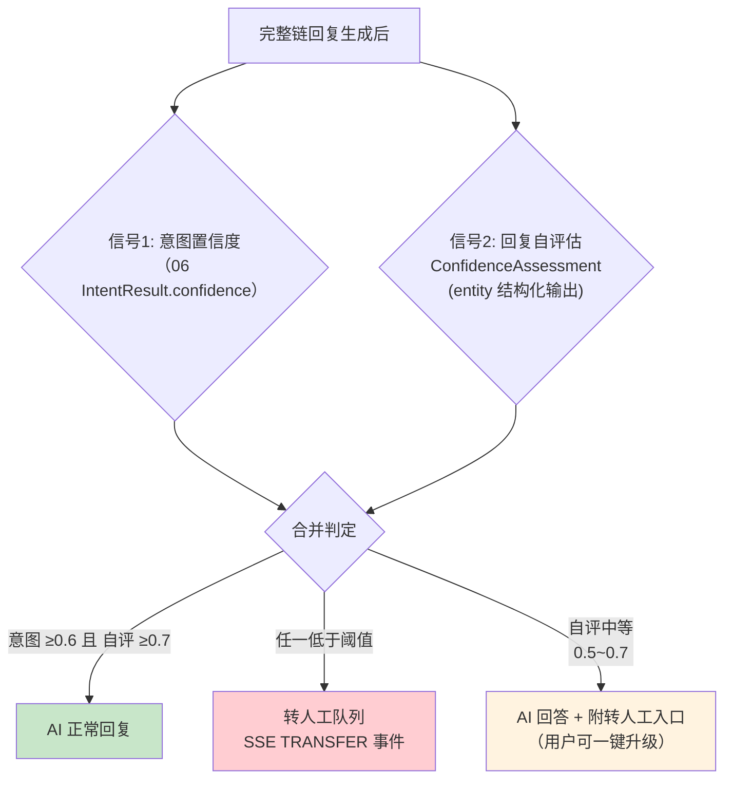
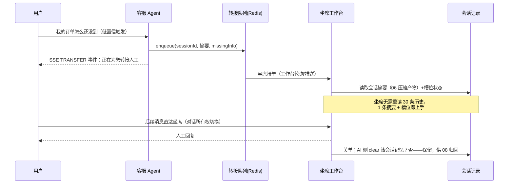
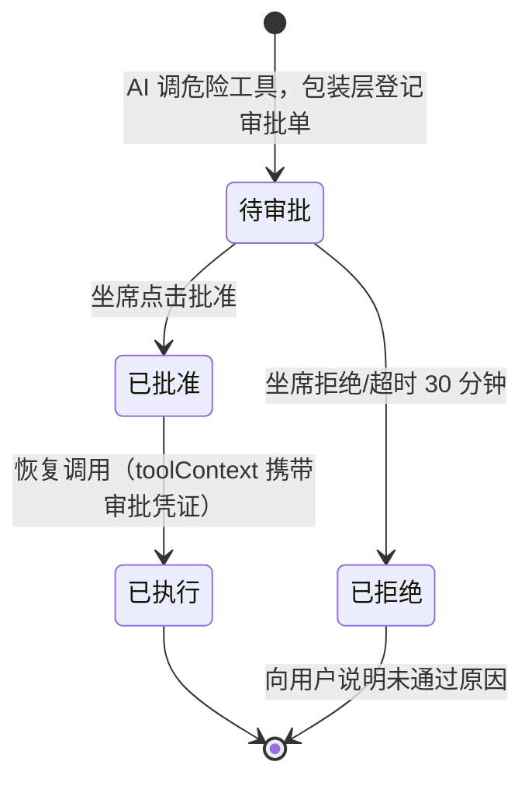
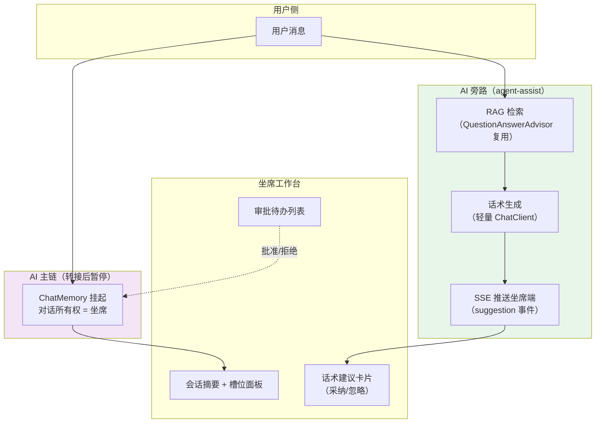
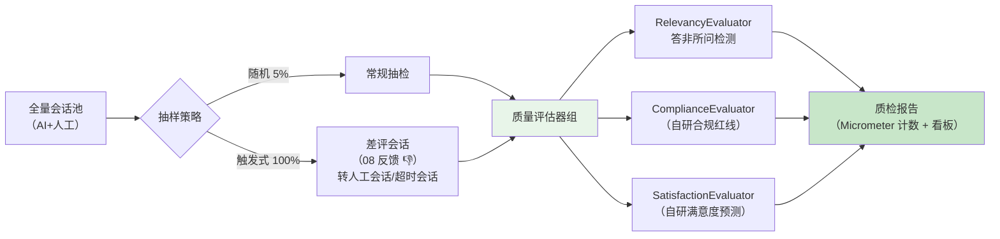

# 项目 00：智能客服系统 — 07-迭代五·坐席协同与 HITL 深化

> **定位**：让 AI 客服从「单打独斗」演进为「人机协同」——**置信度低自动转人工**（双信号判定）、**危险工具人工审批**（HITL 正确落点：`ToolCallback` 包装层，不是 Advisor）、**坐席实时话术辅助**（旁路 RAG 建议）、**会话质检**（满意度与合规抽检）。读完这篇，你掌握客服场景人机协作的完整工程闭环。
> **读者画像**：已完成 06 意图路由与槽位骨架，要让系统具备「知道自己不行」与「该出手时让人出手」能力的设计者。
> **前置阅读**：[06-意图识别与多轮对话深化]。
> **关联教程**：[教程 28-Human-in-the-Loop与审批流]（HITL 落点铁律）、[教程 24-多页面流式响应与会话管理]（坐席端 SSE 推送）；API 真实性以 [附录 05-SpringAI2-API基准] 为准。

---

## 1. 四问（本迭代）

| 问 | 答 |
|----|----|
| **新增了什么需求** | ① AI 答不上/可能答错时要主动转人工，不能硬答（差评主要来源）；② 创建换货工单、退款等**写操作**必须有人确认后执行；③ 转人工后坐席需要 AI 旁路辅助（话术建议 + 会话摘要交接）；④ 服务质量需要系统化抽检（满意度归因 + 合规红线） |
| **影响了哪些模块** | 新增 `hitl/`（审批工具包装 + 挂起恢复）、`agentdesk/`（坐席工作台：接入队列 + 话术辅助）、`qc/`（质检）；改动 `tools/`（危险工具挂审批包装）、`ChatService`（转人工事件）、SSE 事件枚举（新增 `TRANSFER` / `APPROVAL_REQUIRED`） |
| **架构如何演进** | 纯 AI 闭环 → **人机双工位**：AI 工位（ChatClient 链）与坐席工位（工作台）经「转接队列 + 审批中心 + 辅助旁路」协作；对话所有权（AI/人工）成为会话的一等状态 |
| **上一版本的痛点是什么** | 06 后对话质量提升，但 ① 低置信问题 LLM 仍会编一个「看起来像」的答案；② 槽位填齐即可执行 `createExchange`，无人工确认——错单成本直接落到业务；③ 转人工=用户自己打电话，无数字通道 |

---

## 2. 置信度评估与转人工

### 2.1 双信号置信度

单一信号不可靠：意图分类器只看消息本身，看不到「知识库里有没有答案」。本项目用**双信号**：



信号 2 复用 06 的结构化输出套路（[教程 13-结构化输出]）：

```java
package com.shop.customer.hitl;

/** 回复置信度自评估（Spring AI 2.0.0 entity API 绑定）。 */
public record ConfidenceAssessment(
        float confidence,     // 0.0~1.0
        boolean hasAnswer,    // 检索/工具结果是否足以回答
        String missingInfo    // 缺什么（转人工时随工单带给坐席）
) {}
```

```java
// 概念骨架：在完整链回答后做一次旁路自评（轻量 ChatClient，不写记忆）
ConfidenceAssessment ca = liteChatClient.prompt()
        .system(SELF_CHECK_PROMPT)          // 「对照以下检索片段与工具结果，评估能否负责任地回答用户问题」
        .user(retrievedContext + "\n用户问题：" + message)
        .call()
        .entity(ConfidenceAssessment.class, spec -> spec.validateSchema());
```

> **成本注**：自评每次多一次轻量 LLM 调用。可只在「RAG 相似度低于 0.75 或工具返回空」时触发自评，其余情况跳过（条件触发可砍掉一半自评调用）。

### 2.2 转人工的完整协作时序



**交接的关键资产**正是 06 的产出：压缩摘要 + 槽位状态。转人工不是「从头再来」，而是「上下文交接」——这是人机协同体验的分水岭。

---

## 3. 危险工具人工审批（HITL 落点）

### 3.1 落点铁律

CLAUDE.md / [附录 05-02] 铁律：**HITL 的正确落点是 `ToolCallingManager` 装饰器或 `ToolCallback` 包装层，不是 Advisor**。原因：

| 落点 | 能拿到什么 | 判定 |
|------|-----------|------|
| Advisor 层 | 只有 `ChatClientRequest`（prompt + context）——**工具意图尚未发生**，拿不到「要调哪个工具、什么参数」 | ❌ 不适用 |
| `ToolCallingManager` 装饰器 | `executeToolCalls(Prompt, ChatResponse)`——批量工具执行统一入口 | ✅ 适合全局策略（限流/审计） |
| `ToolCallback` 包装层 | `call(String toolInput)` 的**单个工具 + 参数级**信息 | ✅ 适合单工具审批（本项目选此） |

本项目审批粒度是**单个危险工具**（`createExchange`/`createRefund`），选 `ToolCallback` 包装层。

### 3.2 审批包装器（真实接口签名）

`ToolCallback` 接口 javap 实证（[附录 05-02 §1]）：`getToolDefinition()`、`getToolMetadata()`（default）、`call(String)`、`call(String, ToolContext)`（default）。

```java
package com.shop.customer.hitl;

import org.springframework.ai.chat.model.ToolContext;
import org.springframework.ai.tool.ToolCallback;
import org.springframework.ai.tool.definition.ToolDefinition;
import org.springframework.ai.tool.metadata.ToolMetadata;

/**
 * 危险工具审批包装（装饰器）：把「执行」换成「挂起-等审批-恢复」。
 * 真实接口签名经 javap 实证（Spring AI 2.0.0）。
 */
public class ApprovalToolCallback implements ToolCallback {

    private final ToolCallback delegate;          // 被包装的原始工具
    private final ApprovalCenter approvalCenter;  // 审批中心（本项目业务类，概念骨架）

    public ApprovalToolCallback(ToolCallback delegate, ApprovalCenter approvalCenter) {
        this.delegate = delegate;
        this.approvalCenter = approvalCenter;
    }

    @Override
    public ToolDefinition getToolDefinition() { return delegate.getToolDefinition(); }

    @Override
    public ToolMetadata getToolMetadata() { return delegate.getToolMetadata(); }

    @Override
    public String call(String toolInput) {
        // 同步入口：登记审批任务，向 LLM 返回「待审批」占位结果（不真正执行）
        String approvalId = approvalCenter.submit(delegate, toolInput);
        return "该操作需要人工审批（审批单 %s），已通知坐席，请告知用户稍候。".formatted(approvalId);
    }

    @Override
    public String call(String toolInput, ToolContext toolContext) {
        // 审批通过后的恢复路径：toolContext 携带 approvalId（见 3.3），凭证校验通过才放行
        if (approvalCenter.isApproved(toolContext)) {
            return delegate.call(toolInput, toolContext);   // 真正执行写操作
        }
        return call(toolInput);                             // 未审批 → 走挂起
    }
}
```

注册方式：把危险工具的原始回调包一层再挂载（`defaultToolCallbacks(ToolCallback...)`，javap 实证存在于 `ChatClient.Builder`）：

```java
// 概念骨架：ChatClientConfig 中危险工具注册
// 原始 @Tool 方法经 MethodToolCallbackProvider.builder().toolObjects(exchangeTool).build()
// 取出 ToolCallback[]，逐个按危险名单包装后 defaultToolCallbacks(...)
```

> `MethodToolCallbackProvider`（`org.springframework.ai.tool.method`）真实存在（javap 实证，[附录 05-02 §1]）：`builder().toolObjects(Object...)` → `build()` → `getToolCallbacks()`。

### 3.3 挂起与恢复：EventLoop 上不能等人

`ToolCallback.call` 是**同步契约**（返回 String），而人工审批要几十秒到几小时——绝不能在调用线程上阻塞等待（WebFlux 铁律：EventLoop 禁 block）。本项目采用**挂起-恢复**模式：



- **挂起**：`call(toolInput)` 返回占位文本（LLM 据此告知用户「已提交审批」）；同时经 SSE 推 `APPROVAL_REQUIRED` 事件（含审批单号、工具名、参数摘要）到坐席工作台——00 篇设计的 SSE 事件枚举正好派上用场。
- **恢复**：坐席批准后，`ApprovalCenter` 以**新请求**重放该轮对话：`ChatService` 用 `toolContext(Map.of("approvalId", id))`（`ChatClientRequestSpec.toolContext(Map)`，javap 实证）重新发起，`ApprovalToolCallback.call(input, ctx)` 校验凭证放行执行。审批前后是**两次独立请求**，中间零线程占用——这就是响应式语境下「暂停不占计算」的落地（[教程 28-Human-in-the-Loop与审批流 §挂起模式]、[教程 40-长任务持久化与中断恢复]）。
- **超时**：`ApprovalCenter` 对 30 分钟未决审批单自动置为已拒绝（Redis TTL 扫描），避免用户无限等待。

> 审批中心 `ApprovalCenter`（登记/校验/超时/通知）是本项目业务概念骨架，存储复用 Redis；坐席侧审批接口是普通 `@PostMapping("/api/approval/{id}/decision")`。

---

## 4. 坐席辅助：实时话术建议

转人工之后 AI 不是下线，而是**换到副驾位**。坐席工作台打开会话时，旁路链为每条用户消息生成话术建议：



工程要点：

1. **旁路链独立 ChatClient**：复用 RAG Advisor，但**不挂 MessageChatMemoryAdvisor**——人工会话是坐席与用户的对话，AI 只读建议不写记忆（写入会污染后续 AI 恢复时的上下文）。
2. **采纳回执**：坐席点「采纳」时话术进入会话记录并打标 `source=ai_assist`——这是 08 数据飞轮的重要归因信号（AI 建议被采纳率 = 坐席对 AI 的信任度量）。
3. **推送通道**：坐席端与用户端是两条独立 SSE 连接（[教程 24-多页面流式响应与会话管理]），靠会话 ID 关联。

---

## 5. 会话质检：满意度与合规抽检

### 5.1 质检流水线



### 5.2 自研评估器：实现官方 `Evaluator` 接口

Spring AI 2.0 有官方评估体系（`org.springframework.ai.evaluation.Evaluator`，`RelevancyEvaluator` 在 `org.springframework.ai.chat.evaluation`，javap 实证，详见 08 篇 §2）。合规红线与满意度是客服私有标准，自研实现同一接口即可与官方评估器**同构编排**：

```java
package com.shop.customer.qc;

import org.springframework.ai.chat.client.ChatClient;
import org.springframework.ai.evaluation.Evaluator;
import org.springframework.ai.evaluation.EvaluationRequest;
import org.springframework.ai.evaluation.EvaluationResponse;

/** 合规红线评估器（自研，实现官方 Evaluator 接口——签名 javap 实证）。 */
public class ComplianceEvaluator implements Evaluator {

    private final ChatClient judgeClient;

    public ComplianceEvaluator(ChatClient judgeClient) { this.judgeClient = judgeClient; }

    @Override
    public EvaluationResponse evaluate(EvaluationRequest request) {
        // 概念骨架：LLM-as-Judge 按红线清单打分（承诺赔付额度/泄露他人订单/辱骂/引导站外交易）
        // judgeClient.prompt()...entity(...) 返回 ComplianceVerdict record
        // 红线命中 → new EvaluationResponse(false, verdict.score(), verdict.reason(), Map.of("rule", verdict.rule()))
        throw new UnsupportedOperationException("概念骨架：评审 Prompt 与 ComplianceVerdict 由你补齐");
    }
}
```

> `EvaluationResponse(boolean, float, String, Map)` 四参构造真实存在（javap 实证）；`EvaluationRequest(String userText, String responseContent)` 等三个构造重载同理。质检指标上报用 Micrometer `Counter`——**需在 pom.xml 中添加依赖** `spring-boot-starter-actuator`（Micrometer 随其传递，[教程 22-全链路可观测性]）。

---

## 6. 测试与验证

### 6.1 单元测试

| 测试类 | 用例 | 断言 |
|--------|------|------|
| `ConfidenceAssessmentTest` | 10 条「知识库无答案」问题 | `hasAnswer=false` 时触发转人工路径 |
| `ApprovalToolCallbackTest` | 无凭证调用 / 有凭证调用 / 拒绝后调用 | 未审批返回占位文本（不含工单号）；批准后才真正执行 delegate |
| `ApprovalTimeoutTest` | 模拟 30 分钟超时 | 审批单自动置为拒绝，用户收到说明 |
| `ComplianceEvaluatorTest` | 5 条红线话术 + 5 条正常话术 | 红线 100% 命中、正常 0 误报（金标样本） |

### 6.2 curl 验证

```sh
# ① 触发转人工：问一个知识库没有的问题
curl -N -X POST "http://localhost:8080/api/chat/stream?s=t1" \
  -H "Content-Type: text/plain" -d "帮我改一下收货地址顺便把发票抬头改成公司"
# 预期：SSE 出现 event: TRANSFER

# ② 触发审批：槽位齐全后 AI 调 createExchange
curl -N -X POST "http://localhost:8080/api/chat/stream?s=t2" \
  -H "Content-Type: text/plain" -d "订单 DD20240810 换 XL 码"
# 预期：SSE 出现 event: APPROVAL_REQUIRED + 审批单号；回复说已提交审批
# 坐席批准后：
curl -X POST "http://localhost:8080/api/approval/{id}/decision" \
  -H "Content-Type: application/json" -d '{"approve": true}'
# 再问「换货办好了吗」→ 回复含工单号（凭证放行执行）
```

### 6.3 端到端

三人剧本：用户触发转人工 → 坐席接单看到摘要面板 → 旁路话术建议被采纳（回执打标）→ 坐席批准换货审批 → 工单创建成功 → 会话进入质检池被抽中并产出报告。

---

## 7. 验收对照

| 验收项 | 目标 | 实测口径 |
|--------|------|---------|
| 转人工触发准确率 | 低置信问题 ≥ 90% 被转出（抽检 50 条） | 人工标注对照 |
| 误转率（可答被转） | ≤ 10% | 同上 |
| 危险工具零未审执行 | 100%（未持凭证的调用不放行） | `ApprovalToolCallbackTest` + 审计日志 |
| 审批恢复延迟 | 坐席批准后 ≤ 3 秒出结果 | 端到端时间戳 |
| 挂起期间线程占用 | 0（无阻塞等待线程） | jstack 无 BLOCKED on approval |
| 坐席话术采纳率 | 上线 4 周后 ≥ 30%（健康线） | `source=ai_assist` 标记占比 |
| 红线检出 | 抽检红线样本 100% 命中 | `ComplianceEvaluatorTest` |

---

## 8. 总结

本迭代把「人」接进了系统：**双信号置信度**让 AI 知道自己不行（意图置信 + 回复自评），**ToolCallback 包装层**给写操作上了闸（挂起-审批-恢复，EventLoop 零占用），**旁路辅助**让转人工后的 AI 转为副驾，**质检流水线**把满意度与合规变成可度量指标。人机协同的本质不是「AI 不行才找人」，而是把**对话所有权**当作一等状态来管理。

**下一篇**：[08-客服数据飞轮与满意度评估](08-客服数据飞轮与满意度评估.md)——官方 Evaluator 体系、金标回归闸门、用户反馈归因与灰度闭环。
