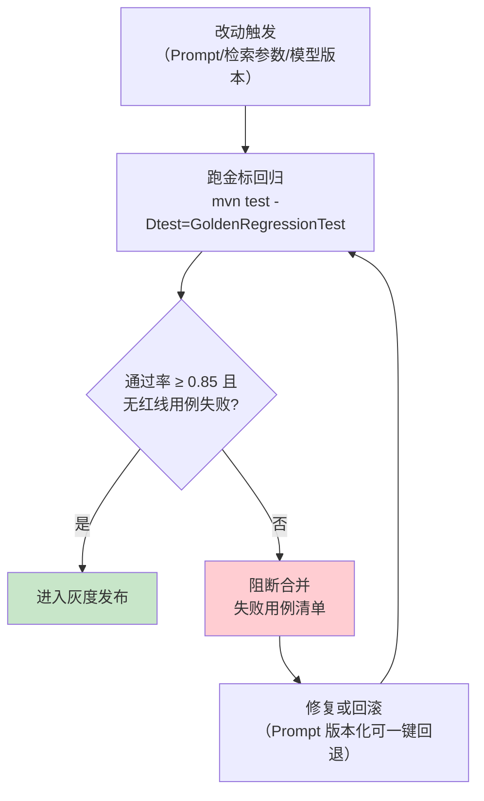
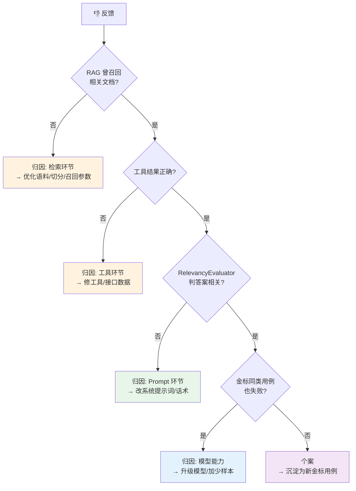
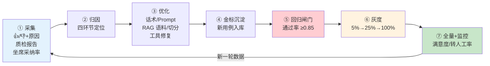

# 项目 00：智能客服系统 — 08-客服数据飞轮与满意度评估

> **定位**：给项目 00 装上「自我改进引擎」——基于 **Spring AI 2.0 官方 Evaluator**（`org.springframework.ai.chat.evaluation`，javap 实证）建**金标回归闸门**；用户反馈（👍/👎 + 原因）→ **四环节归因**（检索/工具/Prompt/模型）→ 优化 → **灰度发布** → 全量，闭环成**数据飞轮**。读完这篇，你掌握「改 Prompt 不再拍脑袋」的完整工程方法。
> **读者画像**：已完成 07 人机协同，要回答「这个系统到底好不好、怎么越用越好」的负责人/设计者。
> **前置阅读**：[07-坐席协同与HITL深化]。
> **关联教程**：[教程 08-架构师进阶/03-自我反思与Agent评估]（Evaluator 体系总纲）、[教程 08-架构师进阶/07-数据飞轮与持续改进]（飞轮闭环总纲）、[教程 04-企业级架构主干/09-灰度发布与版本管理]；API 真实性以 [附录 05-SpringAI2-API基准] 为准。

---

## 1. 四问（本迭代）

| 问 | 答 |
|----|----|
| **新增了什么需求** | ① 改话术/Prompt/检索参数前要有**可量化的好坏了断**（回归保护）；② 用户的 👎 不能只躺在数据库里，要能定位到**出问题的环节**；③ 新版话术先小流量验证再全量（灰度）；④ 满意度要从「事后问卷」变成「全量可观测」 |
| **影响了哪些模块** | 新增 `evaluation/`（官方 Evaluator 接线 + 金标回归）、`feedback/`（采集 + 归因）、`gray/`（Prompt 版本注册 + 分流）；改动 `ChatController`（反馈端点）、`ChatClientConfig`（系统提示词从注册表取，不再写死字符串） |
| **架构如何演进** | 静态配置系统 → **评估驱动的闭环系统**：金标集与 Prompt 版本成为版本库资产，发布流程从「改代码→上线」变为「改资产→过闸门→灰度→全量」 |
| **上一版本的痛点是什么** | 07 后系统可用，但 ① 每次调 Prompt 全凭感觉，改好改坏说不清；② 差评无归因——是没检索到、工具答错、话术不当还是模型能力不够？无头绪；③ 新话术直接全量，出错波及全部用户 |

---

## 2. 官方 Evaluator 体系（javap 实证）

### 2.1 真实坐标与签名

Spring AI 2.0.0 **存在官方评估体系**（不是虚构，[附录 05-SpringAI2-API基准 §17]），全部经本地 jar `javap` 实证：

```java
// ── spring-ai-commons：评估契约 ──────────────────────────────
org.springframework.ai.evaluation.Evaluator            // 接口
org.springframework.ai.evaluation.EvaluationRequest    // 评估请求
org.springframework.ai.evaluation.EvaluationResponse   // 评估结果

// ── spring-ai-client-chat：内置评估器 ────────────────────────
org.springframework.ai.chat.evaluation.RelevancyEvaluator     // 答案相关性
org.springframework.ai.chat.evaluation.FactCheckingEvaluator  // 事实核查
```

关键签名（javap 输出摘录）：

| 类 | 真实方法 |
|----|---------|
| `Evaluator` | `EvaluationResponse evaluate(EvaluationRequest)`（默认方法 `doGetSupportingData`） |
| `EvaluationRequest` | 构造 `(String userText, String responseContent)` / `(List<Document>, String)` / `(String, List<Document>, String)`；getter `getUserText()/getDataList()/getResponseContent()` |
| `EvaluationResponse` | 构造 `(boolean, float, String, Map)`；`isPass()` / `getScore()` / `getFeedback()` / `getMetadata()` |
| `RelevancyEvaluator` | `new RelevancyEvaluator(ChatClient.Builder)`；`builder()` → `.chatClientBuilder(ChatClient.Builder)` / `.promptTemplate(PromptTemplate)` / `.build()` |
| `FactCheckingEvaluator` | `builder(ChatClient.Builder)` → `.chatClientBuilder(...)` / `.evaluationPrompt(String)` / `.build()`；静态 `forBespokeMinicheck(ChatClient.Builder)` |

> 注意评估器构造基于 **`ChatClient.Builder`**（不是 ChatModel）——评审内部就是一次 LLM-as-Judge 调用（[教程 08-架构师进阶/03-自我反思与Agent评估 §LLM-as-Judge]）。包名分两层：**契约在 `org.springframework.ai.evaluation`，内置评估器在 `org.springframework.ai.chat.evaluation`**——写 import 时别混。

### 2.2 接线：一个 Bean 搞定

```java
package com.shop.customer.evaluation;

import org.springframework.ai.chat.client.ChatClient;
import org.springframework.ai.chat.evaluation.RelevancyEvaluator;
import org.springframework.context.annotation.Bean;
import org.springframework.context.annotation.Configuration;

@Configuration
public class EvaluationConfig {

    /** 答案相关性评估器（Spring AI 2.0.0 官方 API，javap 实证）。 */
    @Bean
    public RelevancyEvaluator relevancyEvaluator(ChatClient.Builder builder) {
        return RelevancyEvaluator.builder()
                .chatClientBuilder(builder)   // 评审用同一模型通道（DeepSeek）
                .build();
    }
}
```

使用（质检流水线 [07 §5] 与金标回归共用）：

```java
// userText=用户问题；retrieved=本轮 RAG 召回文档；answer=AI 回复
EvaluationResponse result = relevancyEvaluator.evaluate(
        new EvaluationRequest(userText, retrieved, answer));

result.isPass();      // 是否达标（true/false）
result.getScore();    // 0.0~1.0 相关性得分
result.getFeedback(); // 评审理由（归因时给人看）
```

> `FactCheckingEvaluator` 用途不同：核查「答案是否被给定文档支持」——适合**防编造**（客服红线：答非所问可忍，编造订单状态不可忍）。可再挂一个 `FactCheckingEvaluator.builder(builder).build()` 对含订单/物流的回复做事实核查。

### 2.3 自研满意度预测器

满意度是客服私有标准（响应速度感受/语气/解决完整度），官方没有——实现同一 `Evaluator` 接口自研 `SatisfactionEvaluator`（与 [07 §5.2] ComplianceEvaluator 同构，仅评审维度换成满意度）：

```java
package com.shop.customer.evaluation;

import org.springframework.ai.chat.client.ChatClient;
import org.springframework.ai.evaluation.Evaluator;
import org.springframework.ai.evaluation.EvaluationRequest;
import org.springframework.ai.evaluation.EvaluationResponse;

import java.util.Map;

/**
 * 满意度预测器（自研，实现官方 Evaluator 接口）。
 * 输入会话特征（回复/响应速度感受/语气），LLM 预测用户满意度 0-1 分。
 * 注入 [06 §2.4] 的「无记忆辅助链」assistantChatClient。
 */
public class SatisfactionEvaluator implements Evaluator {

    /** 满意度判定结果（record，结构化输出）。 */
    public record SatisfactionVerdict(float score, String reason) {}

    private static final String SATISFACTION_PROMPT = """
            你是电商客服满意度审计员。根据【客服回复片段】评估用户可能感知的满意度：
            - 语气是否友好、是否解决用户诉求、是否及时（无拖延话术）
            - 排除寒暄歧义后给分：score 0.0~1.0，越高越满意
            输出 JSON：score(0.0~1.0)，reason(一句话说明依据)。""";

    private final ChatClient judgeClient;

    public SatisfactionEvaluator(ChatClient judgeClient) { this.judgeClient = judgeClient; }

    @Override
    public EvaluationResponse evaluate(EvaluationRequest request) {
        String content = request.getResponseContent();
        try {
            SatisfactionVerdict v = judgeClient.prompt()
                    .system(SATISFACTION_PROMPT)
                    .user(content)
                    .call()
                    .entity(SatisfactionVerdict.class, spec -> spec.validateSchema());
            // 满意度 ≥0.6 视为通过（命中健康线口径）
            return new EvaluationResponse(v.score() >= 0.6f, v.score(), v.reason(), Map.of());
        } catch (Exception e) {
            return new EvaluationResponse(false, 0.0f, "满意度评审失败: " + e.getMessage(), Map.of());
        }
    }
}
```

「遇到阻塞？→ [附录 11-评估与可观测生态/01-LLM-as-Judge工程化]」。装配同 [07 §5.2]：`new SatisfactionEvaluator(assistantChatClient)`；进质检流水线时与 `RelevancyEvaluator`/`ComplianceEvaluator` 同构编排（07 §5 / 08 §5）。

---

### 2.4 本节测试与验证（官方 Evaluator 与自研满意度评估器）

**材料——满意度评估器单测命令**：

```bash
mvn test -Dtest=SatisfactionEvaluatorTest
```

**步骤与断言**：

| # | 操作 | 预期（PASS 判据） |
|---|------|------------------|
| 1 | `SatisfactionEvaluatorTest`（高/低满意度会话各 10 条，`src/test/java/com/shop/customer/evaluation/SatisfactionEvaluatorTest.java`） | 预测分与人工标注 Spearman ≥ 0.6（概念口径） |
| 2 | 代码评审 | `RelevancyEvaluator` 构造签名与 javap 实证一致（`ChatClient.Builder` 入参），包路径两层无误 |

**失败排查**：评估分数全高/全低→judge Prompt 缺少分档标准；接口编译不过→`EvaluationResponse` 构造参数与实证签名不符。

## 3. 金标回归闸门

### 3.1 金标集：企业自持资产

金标集（golden set）= 「问题 + 期望要点 + 判分口径」的版本化数据集，是本项目的**评估护城河**——谁都可以换模型，但「什么算好答案」的标准在你手里：

```json
{"id": "G-0012", "question": "预售的手机什么时候发货？", "intent": "FAQ",
 "expected_points": ["预售以页面标注为准", "不承诺具体日期除非页面写了"],
 "category": "物流/发货时效"}
```

存放 `src/test/resources/golden/chat-golden.jsonl`，进 Git 版本化；每条 👎 会话经人工确认后可沉淀为新金标（飞轮的「数据进」端，见 §5）。

### 3.2 回归闸门流程



```java
package com.shop.customer.evaluation;

import com.shop.customer.tool.FaqQueryTool;
import com.shop.customer.tool.OrderQueryTool;
import com.shop.customer.tool.CreateExchangeTool;
import org.springframework.ai.chat.client.ChatClient;
import org.springframework.ai.chat.memory.ChatMemory;
import org.springframework.ai.vectorstore.VectorStore;
import org.springframework.boot.test.context.SpringBootTest;
import org.springframework.ai.chat.client.ChatClient.Builder;
import org.springframework.beans.factory.annotation.Autowired;
import org.springframework.ai.evaluation.EvaluationRequest;
import org.springframework.ai.evaluation.EvaluationResponse;
import org.junit.jupiter.api.Test;
import java.util.List;

/** 金标回归测试：门槛 0.85，任一红线用例失败即阻断。@SpringBootTest 注入真实 Bean 装配完整链。 */
@SpringBootTest
class GoldenRegressionTest {

    private static final double GATE = 0.85;

    @Autowired
    private ChatClient.Builder builder;
    @Autowired
    private VectorStore vectorStore;
    @Autowired
    private ChatMemory chatMemory;
    @Autowired
    private FaqQueryTool faqTool;
    @Autowired
    private OrderQueryTool orderTool;
    @Autowired
    private CreateExchangeTool exchangeTool;

    @Test
    void goldenSetPassesGate() {
        ChatClient chat = TestChatClients.fullChain(builder, vectorStore, chatMemory,
                faqTool, orderTool, exchangeTool);
        RelevancyEvaluator evaluator = TestChatClients.relevancy(builder);

        List<GoldenCase> cases = GoldenCase.load("/golden/chat-golden.jsonl");
        long pass = cases.stream()
                .filter(c -> !c.redline())                        // 红线用例单独判（必须全过）
                .map(c -> {
                    String answer = chat.prompt().user(c.question()).call().content();
                    EvaluationResponse r = evaluator.evaluate(
                            new EvaluationRequest(c.question(), answer));
                    return r.isPass();
                })
                .filter(Boolean::booleanValue)
                .count();

        org.junit.jupiter.api.Assertions.assertTrue(
                (double) pass / cases.size() >= GATE, "金标回归未过闸门");
    }
}
```

`GoldenRegressionTest` 引用的两个支撑类也要给全——**`GoldenCase`（金标用例 record + JSONL 加载）** 与 **`TestChatClients`（测试上下文装配辅助）**：

```java
package com.shop.customer.evaluation;

import org.springframework.core.io.ClassPathResource;

import java.io.BufferedReader;
import java.io.InputStreamReader;
import java.nio.charset.StandardCharsets;
import java.util.List;
import java.util.Objects;
import java.util.stream.Collectors;
import tools.jackson.databind.JsonNode;
import tools.jackson.databind.ObjectMapper;

/** 金标用例：一条「问题 + 期望要点 + 判分口径」的版本化数据集条目（从 JSONL 加载）。 */
public record GoldenCase(
        String id,
        String question,
        String intent,               // FAQ / BUSINESS / CHITCHAT…
        List<String> expectedPoints, // 期望答案包含的要点
        String category,
        boolean redline              // 红线用例：必须全过，单独判（含合规红线/编造订单等）
) {
    /** 从 classpath 的 JSONL 逐行加载（示例字段见上文 G-0012）。 */
    public static List<GoldenCase> load(String classpathPath) {
        ObjectMapper mapper = new ObjectMapper();
        try (BufferedReader r = new BufferedReader(new InputStreamReader(
                new ClassPathResource(classpathPath).getInputStream(), StandardCharsets.UTF_8))) {
            return r.lines()
                    .filter(line -> !line.isBlank())
                    .map(line -> {
                        try {
                            JsonNode n = mapper.readTree(line);
                            List<String> points = new java.util.ArrayList<>();
                            n.path("expected_points").forEach(pn -> points.add(pn.asText()));
                            return new GoldenCase(
                                    n.path("id").asText(),
                                    n.path("question").asText(),
                                    n.path("intent").asText(null),
                                    points,
                                    n.path("category").asText(""),
                                    n.path("redline").asBoolean(false));
                        } catch (Exception e) {
                            throw new IllegalStateException("解析金标行失败: " + line, e);
                        }
                    })
                    .collect(Collectors.toList());
        } catch (Exception e) {
            throw new IllegalStateException("读金标文件失败: " + classpathPath, e);
        }
    }
}
```

```java
package com.shop.customer.evaluation;

import com.shop.customer.tool.FaqQueryTool;
import com.shop.customer.tool.OrderQueryTool;
import com.shop.customer.tool.CreateExchangeTool;
import org.springframework.ai.chat.client.ChatClient;
import org.springframework.ai.chat.client.advisor.MessageChatMemoryAdvisor;
import org.springframework.ai.chat.client.advisor.vectorstore.QuestionAnswerAdvisor;
import org.springframework.ai.chat.evaluation.RelevancyEvaluator;
import org.springframework.ai.chat.memory.ChatMemory;
import org.springframework.ai.vectorstore.SearchRequest;
import org.springframework.ai.vectorstore.VectorStore;

/** 测试上下文装配辅助：构建回归用的完整链与评估器（复用 [06 §2.4] 的链配置思路）。 */
public final class TestChatClients {

    private TestChatClients() {}

    /** 完整链：记忆 + RAG + 工具（与 [06 §2.4] chatClient 配置对齐，供金标回归调用真实链路）。 */
    public static ChatClient fullChain(ChatClient.Builder builder, VectorStore vectorStore,
                                       ChatMemory chatMemory, FaqQueryTool faqTool,
                                       OrderQueryTool orderTool, CreateExchangeTool exchangeTool) {
        QuestionAnswerAdvisor rag = QuestionAnswerAdvisor.builder(vectorStore)
                .searchRequest(SearchRequest.builder().topK(3).similarityThreshold(0.3).build())
                .build();
        return builder
                .defaultSystem("你是电商客服小智，只能依据工具查询结果回答，不要编造订单/物流信息。")
                .defaultTools(faqTool, orderTool, exchangeTool)
                .defaultAdvisors(rag, MessageChatMemoryAdvisor.builder(chatMemory).build())
                .build();
    }

    /** 相关性评估器：评审用同一模型通道。 */
    public static RelevancyEvaluator relevancy(ChatClient.Builder builder) {
        return RelevancyEvaluator.builder()
                .chatClientBuilder(builder)   // 真实 API：`chatClientBuilder(ChatClient.Builder)`，javap 实证
                .build();
    }
}
```

> 上面两个类使 `GoldenRegressionTest` 自洽可运行：`fullChain` 入参从测试的 `@SpringBootTest` 注入真实 Bean（ChatClient.Builder/VectorStore/ChatMemory/工具）；`GoldenCase.load` 按上文 JSONL 示例字段解析。`chatClientBuilder(...)` 是 `RelevancyEvaluator.Builder` 的真实方法（javap 实证，[08 §2.1]）。`CreateExchangeTool` 定义见 [07 §3.2]。测试中 `call().content()` 是同步调用，跑在 JUnit 线程（非 EventLoop），block 语义安全。金标 50 条起步、覆盖意图三类 + 槽位业务 + 红线场景；口径细节见 [附录 11-评估与可观测生态/02-评估数据集管理与版本化]。

---

### 3.3 本节测试与验证（金标回归闸门）

**材料——闸门负向演练**：

```bash
# 故意改坏话术（加一句「所有商品永久退货」）后跑闸门
mvn test -Dtest=GoldenRegressionTest
```

**步骤与断言**：

| # | 操作 | 预期（PASS 判据） |
|---|------|------------------|
| 1 | `GoldenRegressionTest`（全量金标 ≥50 条） | 通过率 ≥ 0.85；红线用例 0 失败 |
| 2 | 材料（改坏话术后再跑） | BUILD FAILURE，失败清单指向物流/售后类用例（闸门真能拦住坏改动） |
| 3 | CI 接入检查 | `GoldenRegressionTest` 在构建必跑清单中 |

**失败排查**：改坏也不失败→金标用例没覆盖该话术路径（补用例）；阈值失效→门槛未断言 0.85。

## 4. 用户反馈采集与归因

### 4.1 反馈采集

00 篇 API 清单里的 `POST /api/feedback` 在此落地，比「点赞点踩」多一层**结构化原因**（归因的关键输入）：

```java
package com.shop.customer.feedback;

/** 用户反馈（👍/👎 + 原因分类 + 可选补充）。 */
public record FeedbackRequest(
        String sessionId,
        String messageId,
        boolean thumbsUp,          // true=👍 false=👎
        Reason reason,             // 👎 时必填
        String comment             // 可选自由文本
) {
    public enum Reason {
        WRONG_ANSWER,      // 答案错误（事实错）
        IRRELEVANT,        // 答非所问
        NOT_FOUND,         // 没查到/说不知道
        TOOL_ERROR,        // 查错单/操作失败
        TONE,              // 语气/表达不当
        TOO_SLOW,          // 太慢
        OTHER
    }
}
```

反馈采集端点（§4.5 的 curl 落点）——`FeedbackController`，接收反馈入库并把 👎 触发归因任务：

```java
package com.shop.customer.feedback;

import org.springframework.http.ResponseEntity;
import org.springframework.web.bind.annotation.PostMapping;
import org.springframework.web.bind.annotation.RequestBody;
import org.springframework.web.bind.annotation.RequestMapping;
import org.springframework.web.bind.annotation.RestController;

/** 反馈采集端点：POST /api/feedback（00 篇 API 清单落地）。👎 触发归因任务，👍 仅归档。 */
@RestController
@RequestMapping("/api/feedback")
public class FeedbackController {

    private final FeedbackSink feedbackSink;     // 反馈落库（Redis/DB，适配层注入）
    private final FeedbackAttributor attributor; // §4.2 归因器

    public FeedbackController(FeedbackSink feedbackSink, FeedbackAttributor attributor) {
        this.feedbackSink = feedbackSink;
        this.attributor = attributor;
    }

    @PostMapping
    public ResponseEntity<Void> submit(@RequestBody FeedbackRequest request) {
        feedbackSink.save(request);
        if (!request.thumbsUp() && request.reason() != null) {
            // 👎 且带原因 → 按 reason 回放会话交给归因器（SessionFacts 由适配层/attributor 组装）
            feedbackSink.enqueueAttribution(request.sessionId());
        }
        return ResponseEntity.ok().build();
    }
}
```

`FeedbackSink`（反馈落库 + 归因任务入队，完整实现，复用 06 已引入的 `StringRedisTemplate`）：

```java
package com.shop.customer.feedback;

import org.springframework.data.redis.core.StringRedisTemplate;
import org.springframework.stereotype.Service;
import tools.jackson.databind.ObjectMapper;

import java.time.Duration;
import java.util.Map;

/** 反馈落库（feedback:<messageId>）+ 👎 归因任务入队（attribution:queue）。 */
@Service
public class FeedbackSink {

    private static final String FEEDBACK_PREFIX = "feedback:";
    private static final String ATTR_QUEUE = "attribution:queue";
    private static final Duration TTL = Duration.ofDays(90);

    private final StringRedisTemplate redis;
    private final ObjectMapper mapper = new ObjectMapper();

    public FeedbackSink(StringRedisTemplate redis) { this.redis = redis; }

    /** 落库反馈（含结构化原因，归因关键输入）。 */
    public void save(FeedbackRequest request) {
        Map<String, Object> doc = Map.of(
                "sessionId", request.sessionId(),
                "messageId", request.messageId(),
                "thumbsUp", request.thumbsUp(),
                "reason", request.reason() == null ? "NONE" : request.reason().name(),
                "comment", request.comment() == null ? "" : request.comment());
        try {
            redis.opsForValue().set(FEEDBACK_PREFIX + request.messageId(),
                    mapper.writeValueAsString(doc), TTL);
        } catch (Exception e) { throw new RuntimeException(e); }
    }

    /** 👎 触发归因：把会话加入归因队列，由 §4.2 回放器消费。 */
    public void enqueueAttribution(String sessionId) {
        redis.opsForList().rightPush(ATTR_QUEUE, sessionId);   // List 队列入队，回放器左弹
    }
}
```

> §4.5 断言表 #1 的「200 + 库中新增反馈 + 归因任务入队」对应 `FeedbackController` + `FeedbackSink`：反馈存 `feedback:<messageId>`，👎 会话入 `attribution:queue`（List）交 §4.2 回放归因。

### 4.2 四环节归因

每条 👎 自动回放会话（消息 + 检索片段 + 工具结果已在会话记录中），按决策树定位环节：



`FeedbackAttributor`（串起「会话回放 + §2 评估器复判 + 归因结论落库」的完整实现，决策逻辑与上文 4.2 决策树一致）：

```java
package com.shop.customer.feedback;

import org.springframework.ai.evaluation.EvaluationResponse;

import java.util.function.Consumer;

/**
 * 四环节归因器：输入「会话回放特征 + 评估器复判结论」，按决策树定位环节。
 * 决策优先级从外到内（检索→工具→Prompt→模型）——越靠外修起来越便宜，模型升级永远是最后一步。
 */
public class FeedbackAttributor {

    /** 归因结论（落库 + 驱动下一步优化）。 */
    public record Attribution(Stage stage, String reason, String rule) {
        public enum Stage { RETRIEVAL, TOOL, PROMPT, MODEL, CASE }
    }

    /** 会话回放特征：归因所需的四类事实（由你在适配层从会话记录填充）。 */
    public record SessionFacts(
            boolean retrievedRelevant,   // RAG 是否召回相关文档
            boolean toolResultOk,        // 工具结果是否正确
            EvaluationResponse relevancy, // §2 RelevancyEvaluator 复判（若已跑；null 表示未复判）
            boolean goldenSameFail       // 金标同类用例是否也失败
    ) {}

    private final Consumer<Attribution> sink;   // 归因结论落库（适配层注入，隔离存储）

    public FeedbackAttributor(Consumer<Attribution> sink) { this.sink = sink; }

    public Attribution attribute(SessionFacts facts) {
        Attribution out;
        if (!facts.retrievedRelevant()) {
            out = new Attribution(Attribution.Stage.RETRIEVAL, "未召回相关文档", "语料/切分/召回参数");
        } else if (!facts.toolResultOk()) {
            out = new Attribution(Attribution.Stage.TOOL, "工具结果错误", "修工具/接口数据");
        } else if (facts.relevancy() != null && !facts.relevancy().isPass()) {
            out = new Attribution(Attribution.Stage.PROMPT, "答案不相关", "改系统提示词/话术");
        } else if (facts.goldenSameFail()) {
            out = new Attribution(Attribution.Stage.MODEL, "同类金标也失败", "升级模型/加少样本");
        } else {
            out = new Attribution(Attribution.Stage.CASE, "个案", "沉淀为新金标用例");
        }
        sink.accept(out);   // 落库后驱动下一步优化
        return out;
    }
}
```

> 归因器不臆造存储——`SessionFacts` 由你的适配层从会话记录（消息 + 检索片段 + 工具结果，07/06 已持久化）填充，`sink` 注入落库实现。决策优先级用 `Consumer<Attribution>` 隔离，便于测试注入。**归因优先级从外到内**（检索→工具→Prompt→模型）——越靠外修起来越便宜，模型升级永远是最后一步（[教程 08-架构师进阶/07-数据飞轮与持续改进 §何时微调 vs 优化 Prompt vs 改进 RAG]）。

---

### 4.3 本节测试与验证（反馈采集与归因）

**材料——反馈提交 curl**：

```bash
# ① 反馈提交（👎 + 原因）
curl -X POST "http://localhost:8081/api/feedback" \
  -H "Content-Type: application/json" \
  -d '{"sessionId":"t1","messageId":"m-33","thumbsUp":false,
       "reason":"WRONG_ANSWER","comment":"物流状态说错了"}'
```

**步骤与断言**：

| # | 操作 | 预期（PASS 判据） |
|---|------|------------------|
| 1 | 材料① | 200；库中新增反馈，归因任务入队 |
| 2 | `FeedbackAttributorTest`（四类构造会话：无召回/工具错/答非所问/都正常，`src/test/java/com/shop/customer/feedback/FeedbackAttributorTest.java`） | 归因结论分别落 检索/工具/Prompt/个案 |
| 3 | 反馈表统计 | 👎 带原因占比 ≥ 95% |

**失败排查**：归因全落"个案"→归因器没接 §2 评估器复判；反馈无原因→前端未强制选择 reason 枚举。

## 5. Prompt 版本化与灰度闭环

### 5.1 Prompt 注册表

06/07 的系统提示词还是代码里的字符串常量。飞轮要转起来，提示词必须变成**版本化资产**：

```java
package com.shop.customer.gray;

import org.springframework.boot.context.properties.ConfigurationProperties;

/** 灰度配置（自定义配置键，真实 Spring API）。 */
@ConfigurationProperties(prefix = "customer.prompt")
public record PromptGrayProperties(
        String stableVersion,   // 稳定版，如 "v3"
        String grayVersion,     // 灰度版，如 "v4"
        int grayPercent         // 灰度流量百分比 0~100
) {}
```

`PromptRegistry`（从 `prompts/` 按版本号加载 system 模板 + 哈希分流，完整实现）：

```java
package com.shop.customer.gray;

import org.springframework.core.io.ClassPathResource;

import java.io.IOException;
import java.nio.charset.StandardCharsets;
import java.util.Map;
import java.util.concurrent.ConcurrentHashMap;

/**
 * Prompt 注册表：从 prompts/ 目录按版本号加载 system 模板（如 prompts/system-v3.txt），
 * 提供「取指定版」与「按 sessionId 哈希分流取版」两个入口。
 * 分流：sessionId.hashCode() % 100 < grayPercent → grayVersion，否则 stableVersion。
 */
public class PromptRegistry {

    private final String stableVersion;   // 如 "v3"
    private final String grayVersion;     // 如 "v4"
    private final int grayPercent;        // 0~100
    private final Map<String, String> cache = new ConcurrentHashMap<>();

    public PromptRegistry(String stableVersion, String grayVersion, int grayPercent) {
        this.stableVersion = stableVersion;
        this.grayVersion = grayVersion;
        this.grayPercent = grayPercent;
    }

    /** 取指定版本模板（缓存，只读一次文件）。 */
    public String get(String version) {
        return cache.computeIfAbsent(version, v -> load("prompts/system-" + v + ".txt"));
    }

    /** 按 sessionId 哈希分流：命中灰度区间返回 grayVersion，否则 stableVersion。 */
    public String route(String sessionId) {
        int hash = Math.floorMod(sessionId.hashCode(), 100);   // 稳定非负，同一会话恒同版
        return hash < grayPercent ? grayVersion : stableVersion;
    }

    /** 取该会话实际要用的模板内容。 */
    public String resolve(String sessionId) {
        return get(route(sessionId));
    }

    private String load(String classpathPath) {
        try {
            return new ClassPathResource(classpathPath)
                    .getContentAsString(StandardCharsets.UTF_8);
        } catch (IOException e) {
            throw new IllegalStateException("读 Prompt 模板失败: " + classpathPath, e);
        }
    }
}
```

装配：`@Configuration` 里用 `PromptGrayProperties`（前述 record）new 出 `PromptRegistry`；`ChatClientConfig` 构建三条链时，`defaultSystem` 不再写死字符串，改从 `registry.resolve(sessionId)` 取（06 §2.4 链选型里三链的 system 都改为版本化加载）。

**回滚 = 把 `grayPercent` 调回 0**（配置中心改一行，无需发版）——这是「Prompt 版本控制 + 流量切分」的最小闭环（[教程 04-企业级架构主干/09-灰度发布与版本管理 §Prompt 版本管理]）。

### 5.2 数据飞轮全景



飞轮转动量化指标（健康度仪表盘）：

| 指标 | 口径 | 健康线 |
|------|------|--------|
| 👎 率 | 👎 / 有反馈消息数 | < 8% 且逐月降 |
| 归因闭环率 | 已归因 👎 / 全部 👎 | ≥ 90% |
| 金标增长率 | 本月新增用例数 | ≥ 20 条/月（差评变资产） |
| 灰度逃生率 | 灰度中回滚的版本占比 | < 20%（闸门有效） |
| 自动解决率 | 不转人工完结会话占比 | 从 00 篇目标 80% 起持续爬升 |

---

### 5.3 本节测试与验证（灰度分流与回滚）

**材料——灰度分流 curl**：

```bash
# 同一会话稳定同版本，日志打印 promptVersion
for s in gray-a gray-b gray-c; do
  curl -N -X POST "http://localhost:8081/api/chat/stream?sessionId=$s" \
    -H "Content-Type: text/plain" -d "退换货政策" 2>/dev/null | head -1
done
```

**步骤与断言**：

| # | 操作 | 预期（PASS 判据） |
|---|------|------------------|
| 1 | 材料（grayPercent 设 25 时多次执行） | 日志 `promptVersion=v4` 占比 ≈ 25%；同一 sessionId 多次命中同一版本 |
| 2 | `PromptRegistryTest`（`src/test/java/com/shop/customer/gray/PromptRegistryTest.java`） | hash 分流确定性；边界 0% 与 100% 行为正确 |
| 3 | 回滚演练：`grayPercent=0` | 1 分钟内全量回稳定版（改配置不发版） |

**失败排查**：同会话版本漂移→分流没按 sessionId hash（误按请求随机）；回滚不生效→配置未热刷新。

## 6. 全篇回归验证（端到端飞轮）

**回归断言**（§2.4 / §3.3 / §4.3 / §5.3 均通过后，最终整体验收）：

| # | 操作 | 预期（PASS 判据） |
|---|------|------------------|
| 1 | 完整飞轮一圈：制造一条 👎（错误答案）→ 归因报告指向 Prompt 环节 → 修改话术 v5 → 新金标入库 → 回归通过 → 灰度 25% 观察一周 → 👎 率下降 → 全量 | 每环节产物（反馈记录/归因报告/v5 模板/新用例/闸门 PASS/灰度报表）齐全 |
| 2 | `mvn clean test` | 全部测试类（GoldenRegression/FeedbackAttributor/PromptRegistry/SatisfactionEvaluator）通过 |

---

## 7. 验收对照

| 验收项 | 目标 | 实测口径 |
|--------|------|---------|
| 金标回归闸门 | 50+ 用例、门槛 0.85、CI 必跑 | `GoldenRegressionTest` 接入构建 |
| 官方 Evaluator 接线 | RelevancyEvaluator 质检+回归双场景复用 | 代码评审 + javap 签名一致 |
| 反馈结构化率 | 👎 带原因占比 ≥ 95% | 反馈表统计 |
| 归因闭环率 | ≥ 90%（上线 4 周） | 归因报告统计 |
| 灰度可回滚 | 改配置 1 分钟内生效 | `grayPercent=0` 生效演练 |
| 满意度提升 | 灰度版本 👎 率较稳定版降 ≥ 20% | 版本对比报表 |

---

## 8. 总结

本迭代让系统学会自我改进：**官方 Evaluator**（真实坐标两层包名 + `ChatClient.Builder` 构造）给了统一评估契约，**金标集**把「什么算好」变成企业自持资产，**四环节归因**让每条 👎 都有去处，**灰度发布**让改进可试错可回滚。评估驱动开发（Evals-Driven Development）是 2026 年 Agent 工程的行业共识——改动是否该上线，让闸门说话（[教程 08-架构师进阶/03-自我反思与Agent评估]、[教程 08-架构师进阶/07-数据飞轮与持续改进]）。

**下一篇**：[09-ADR架构决策记录](09-ADR架构决策记录.md)——把 00-08 的全部架构决策沉淀为可追溯的决策资产。
