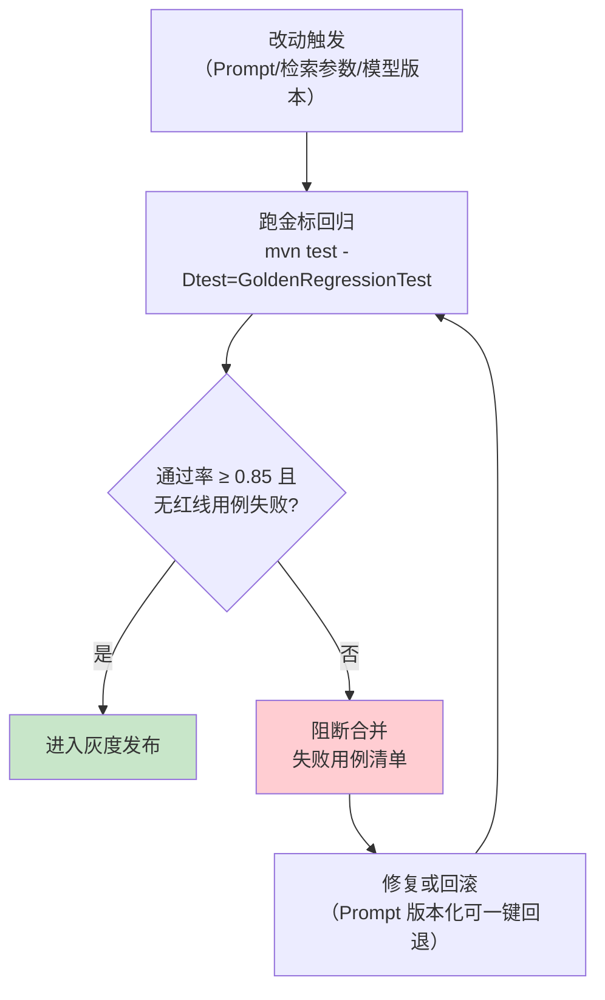
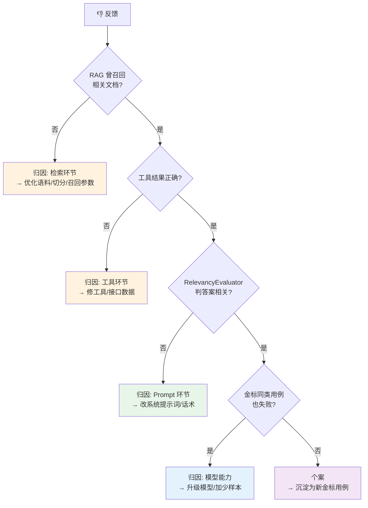
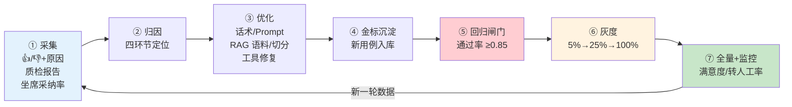

# 项目 00：智能客服系统 — 08-迭代六·客服数据飞轮与满意度评估

> **定位**：给项目 00 装上「自我改进引擎」——基于 **Spring AI 2.0 官方 Evaluator**（`org.springframework.ai.chat.evaluation`，javap 实证）建**金标回归闸门**；用户反馈（👍/👎 + 原因）→ **四环节归因**（检索/工具/Prompt/模型）→ 优化 → **灰度发布** → 全量，闭环成**数据飞轮**。读完这篇，你掌握「改 Prompt 不再拍脑袋」的完整工程方法。
> **读者画像**：已完成 07 人机协同，要回答「这个系统到底好不好、怎么越用越好」的负责人/设计者。
> **前置阅读**：[07-坐席协同与HITL深化]。
> **关联教程**：[教程 37-自我反思与Agent评估]（Evaluator 体系总纲）、[教程 41-数据飞轮与持续改进]（飞轮闭环总纲）、[教程 29-灰度发布与版本管理]；API 真实性以 [附录 05-SpringAI2-API基准] 为准。

---

## 1. 四问（本迭代）

| 问 | 答 |
|----|----|
| **新增了什么需求** | ① 改话术/Prompt/检索参数前要有**可量化的好坏了断**（回归保护）；② 用户的 👎 不能只躺在数据库里，要能定位到**出问题的环节**；③ 新版话术先小流量验证再全量（灰度）；④ 满意度要从「事后问卷」变成「全量可观测」 |
| **影响了哪些模块** | 新增 `evaluation/`（官方 Evaluator 接线 + 金标回归）、`feedback/`（采集 + 归因）、`gray/`（Prompt 版本注册 + 分流）；改动 `ChatController`（反馈端点）、`ChatClientConfig`（系统提示词从注册表取，不再写死字符串） |
| **架构如何演进** | 静态配置系统 → **评估驱动的闭环系统**：金标集与 Prompt 版本成为版本库资产，发布流程从「改代码→上线」变为「改资产→过闸门→灰度→全量」 |
| **上一版本的痛点是什么** | 07 后系统可用，但 ① 每次调 Prompt 全凭感觉，改好改坏说不清；② 差评无归因——是没检索到、工具答错、话术不当还是模型能力不够？无头绪；③ 新话术直接全量，出错波及全部用户 |

---

## 2. 官方 Evaluator 体系（javap 实证）

### 2.1 真实坐标与签名

Spring AI 2.0.0 **存在官方评估体系**（不是虚构，[附录 05-SpringAI2-API基准 §17]），全部经本地 jar `javap` 实证：

```java
// ── spring-ai-commons：评估契约 ──────────────────────────────
org.springframework.ai.evaluation.Evaluator            // 接口
org.springframework.ai.evaluation.EvaluationRequest    // 评估请求
org.springframework.ai.evaluation.EvaluationResponse   // 评估结果

// ── spring-ai-client-chat：内置评估器 ────────────────────────
org.springframework.ai.chat.evaluation.RelevancyEvaluator     // 答案相关性
org.springframework.ai.chat.evaluation.FactCheckingEvaluator  // 事实核查
```

关键签名（javap 输出摘录）：

| 类 | 真实方法 |
|----|---------|
| `Evaluator` | `EvaluationResponse evaluate(EvaluationRequest)`（默认方法 `doGetSupportingData`） |
| `EvaluationRequest` | 构造 `(String userText, String responseContent)` / `(List<Document>, String)` / `(String, List<Document>, String)`；getter `getUserText()/getDataList()/getResponseContent()` |
| `EvaluationResponse` | 构造 `(boolean, float, String, Map)`；`isPass()` / `getScore()` / `getFeedback()` / `getMetadata()` |
| `RelevancyEvaluator` | `new RelevancyEvaluator(ChatClient.Builder)`；`builder()` → `.chatClientBuilder(ChatClient.Builder)` / `.promptTemplate(PromptTemplate)` / `.build()` |
| `FactCheckingEvaluator` | `builder(ChatClient.Builder)` → `.chatClientBuilder(...)` / `.evaluationPrompt(String)` / `.build()`；静态 `forBespokeMinicheck(ChatClient.Builder)` |

> 注意评估器构造基于 **`ChatClient.Builder`**（不是 ChatModel）——评审内部就是一次 LLM-as-Judge 调用（[教程 37-自我反思与Agent评估 §LLM-as-Judge]）。包名分两层：**契约在 `org.springframework.ai.evaluation`，内置评估器在 `org.springframework.ai.chat.evaluation`**——写 import 时别混。

### 2.2 接线：一个 Bean 搞定

```java
package com.shop.customer.evaluation;

import org.springframework.ai.chat.client.ChatClient;
import org.springframework.ai.chat.evaluation.RelevancyEvaluator;
import org.springframework.context.annotation.Bean;
import org.springframework.context.annotation.Configuration;

@Configuration
public class EvaluationConfig {

    /** 答案相关性评估器（Spring AI 2.0.0 官方 API，javap 实证）。 */
    @Bean
    public RelevancyEvaluator relevancyEvaluator(ChatClient.Builder builder) {
        return RelevancyEvaluator.builder()
                .chatClientBuilder(builder)   // 评审用同一模型通道（DeepSeek）
                .build();
    }
}
```

使用（质检流水线 [07 §5] 与金标回归共用）：

```java
// userText=用户问题；retrieved=本轮 RAG 召回文档；answer=AI 回复
EvaluationResponse result = relevancyEvaluator.evaluate(
        new EvaluationRequest(userText, retrieved, answer));

result.isPass();      // 是否达标（true/false）
result.getScore();    // 0.0~1.0 相关性得分
result.getFeedback(); // 评审理由（归因时给人看）
```

> `FactCheckingEvaluator` 用途不同：核查「答案是否被给定文档支持」——适合**防编造**（客服红线：答非所问可忍，编造订单状态不可忍）。可再挂一个 `FactCheckingEvaluator.builder(builder).build()` 对含订单/物流的回复做事实核查。

### 2.3 自研满意度预测器

满意度是客服私有标准（响应速度感受/语气/解决完整度），官方没有——实现同一 `Evaluator` 接口自研 `SatisfactionEvaluator`（骨架与 [07 §5.2] ComplianceEvaluator 同构，输入用户后续行为 + 会话特征，输出 0-1 分），不再重复贴码。「遇到阻塞？→ [附录 12-评估与可观测生态/01-LLM-as-Judge工程化]」。

---

## 3. 金标回归闸门

### 3.1 金标集：企业自持资产

金标集（golden set）= 「问题 + 期望要点 + 判分口径」的版本化数据集，是本项目的**评估护城河**——谁都可以换模型，但「什么算好答案」的标准在你手里：

```json
{"id": "G-0012", "question": "预售的手机什么时候发货？", "intent": "FAQ",
 "expected_points": ["预售以页面标注为准", "不承诺具体日期除非页面写了"],
 "category": "物流/发货时效"}
```

存放 `src/test/resources/golden/chat-golden.jsonl`，进 Git 版本化；每条 👎 会话经人工确认后可沉淀为新金标（飞轮的「数据进」端，见 §5）。

### 3.2 回归闸门流程



```java
package com.shop.customer.evaluation;

import org.springframework.ai.chat.client.ChatClient;
import org.springframework.ai.chat.evaluation.RelevancyEvaluator;
import org.springframework.ai.evaluation.EvaluationRequest;
import org.springframework.ai.evaluation.EvaluationResponse;
import org.junit.jupiter.api.Test;
import java.util.List;

/** 金标回归测试：门槛 0.85，任一红线用例失败即阻断。 */
class GoldenRegressionTest {

    private static final double GATE = 0.85;

    @Test
    void goldenSetPassesGate() {
        ChatClient chat = TestChatClients.fullChain();          // 概念骨架：测试上下文装配完整链
        RelevancyEvaluator evaluator = TestChatClients.relevancy();

        List<GoldenCase> cases = GoldenCase.load("/golden/chat-golden.jsonl");
        long pass = cases.stream()
                .filter(c -> !c.redline())                        // 红线用例单独判（必须全过）
                .map(c -> {
                    String answer = chat.prompt().user(c.question()).call().content();
                    EvaluationResponse r = evaluator.evaluate(
                            new EvaluationRequest(c.question(), answer));
                    return r.isPass();
                })
                .filter(Boolean::booleanValue)
                .count();

        org.junit.jupiter.api.Assertions.assertTrue(
                (double) pass / cases.size() >= GATE, "金标回归未过闸门");
    }
}
```

> 测试中 `call().content()` 是同步调用，跑在 JUnit 线程（非 EventLoop），block 语义安全。金标 50 条起步、覆盖意图三类 + 槽位业务 + 红线场景；口径细节见 [附录 12-评估与可观测生态/02-评估数据集管理与版本化]。

---

## 4. 用户反馈采集与归因

### 4.1 反馈采集

00 篇 API 清单里的 `POST /api/feedback` 在此落地，比「点赞点踩」多一层**结构化原因**（归因的关键输入）：

```java
package com.shop.customer.feedback;

/** 用户反馈（👍/👎 + 原因分类 + 可选补充）。 */
public record FeedbackRequest(
        String sessionId,
        String messageId,
        boolean thumbsUp,          // true=👍 false=👎
        Reason reason,             // 👎 时必填
        String comment             // 可选自由文本
) {
    public enum Reason {
        WRONG_ANSWER,      // 答案错误（事实错）
        IRRELEVANT,        // 答非所问
        NOT_FOUND,         // 没查到/说不知道
        TOOL_ERROR,        // 查错单/操作失败
        TONE,              // 语气/表达不当
        TOO_SLOW,          // 太慢
        OTHER
    }
}
```

### 4.2 四环节归因

每条 👎 自动回放会话（消息 + 检索片段 + 工具结果已在会话记录中），按决策树定位环节：



> 归因器 `FeedbackAttributor` 为业务概念骨架：串起「会话回放 + §2 评估器复判 + 归因结论落库」。**归因优先级从外到内**（检索→工具→Prompt→模型）——越靠外修起来越便宜，模型升级永远是最后一步（[教程 41-数据飞轮与持续改进 §何时微调 vs 优化 Prompt vs 改进 RAG]）。

---

## 5. Prompt 版本化与灰度闭环

### 5.1 Prompt 注册表

06/07 的系统提示词还是代码里的字符串常量。飞轮要转起来，提示词必须变成**版本化资产**：

```java
package com.shop.customer.gray;

import org.springframework.boot.context.properties.ConfigurationProperties;

/** 灰度配置（自定义配置键，真实 Spring API）。 */
@ConfigurationProperties(prefix = "customer.prompt")
public record PromptGrayProperties(
        String stableVersion,   // 稳定版，如 "v3"
        String grayVersion,     // 灰度版，如 "v4"
        int grayPercent         // 灰度流量百分比 0~100
) {}
```

```java
// 概念骨架：PromptRegistry——从 prompts/ 目录按版本号加载 system 模板；
// ChatClientConfig 构建时从注册表取 stableVersion（写死的 defaultSystem 退役）
// 分流：sessionId.hashCode() % 100 < grayPercent → grayVersion，否则 stableVersion
```

**回滚 = 把 `grayPercent` 调回 0**（配置中心改一行，无需发版）——这就是「Prompt 版本控制 + 流量切分」的最小闭环（[教程 29-灰度发布与版本管理 §Prompt 版本管理]）。

### 5.2 数据飞轮全景



飞轮转动量化指标（健康度仪表盘）：

| 指标 | 口径 | 健康线 |
|------|------|--------|
| 👎 率 | 👎 / 有反馈消息数 | < 8% 且逐月降 |
| 归因闭环率 | 已归因 👎 / 全部 👎 | ≥ 90% |
| 金标增长率 | 本月新增用例数 | ≥ 20 条/月（差评变资产） |
| 灰度逃生率 | 灰度中回滚的版本占比 | < 20%（闸门有效） |
| 自动解决率 | 不转人工完结会话占比 | 从 00 篇目标 80% 起持续爬升 |

---

## 6. 测试与验证

### 6.1 单元测试

| 测试类 | 用例 | 断言 |
|--------|------|------|
| `GoldenRegressionTest` | 全量金标（≥50 条） | 通过率 ≥ 0.85；红线用例 0 失败 |
| `FeedbackAttributorTest` | 四类构造会话（无召回/工具错/答非所问/都正常） | 归因结论分别落 检索/工具/Prompt/个案 |
| `PromptGrayRouterTest` | 同一 sessionId 稳定命中同一版本 | hash 分流确定性；边界 0% 与 100% |
| `SatisfactionEvaluatorTest` | 高/低满意度会话各 10 条 | 预测分与人工标注 Spearman ≥ 0.6（概念口径） |

### 6.2 curl 验证

```sh
# ① 反馈提交（👎 + 原因）
curl -X POST "http://localhost:8080/api/feedback" \
  -H "Content-Type: application/json" \
  -d '{"sessionId":"t1","messageId":"m-33","thumbsUp":false,
       "reason":"WRONG_ANSWER","comment":"物流状态说错了"}'
# 预期：200；库中新增反馈，归因任务入队

# ② 灰度分流验证：同一会话稳定同版本，日志打印 promptVersion
for s in gray-a gray-b gray-c; do
  curl -N -X POST "http://localhost:8080/api/chat/stream?s=$s" \
    -H "Content-Type: text/plain" -d "退换货政策" 2>/dev/null | head -1
done
# 预期：日志 promptVersion=v4 占比 ≈ grayPercent

# ③ 闸门验证：故意改坏话术（加一句「所有商品永久退货」）后跑
mvn test -Dtest=GoldenRegressionTest
# 预期：BUILD FAILURE，失败清单指向物流/售后类用例
```

### 6.3 端到端

完整飞轮一圈：制造一条 👎（错误答案）→ 归因报告指向 Prompt 环节 → 修改话术 v5 → 新金标入库 → 回归通过 → 灰度 25% 观察一周 → 👎 率下降 → 全量。

---

## 7. 验收对照

| 验收项 | 目标 | 实测口径 |
|--------|------|---------|
| 金标回归闸门 | 50+ 用例、门槛 0.85、CI 必跑 | `GoldenRegressionTest` 接入构建 |
| 官方 Evaluator 接线 | RelevancyEvaluator 质检+回归双场景复用 | 代码评审 + javap 签名一致 |
| 反馈结构化率 | 👎 带原因占比 ≥ 95% | 反馈表统计 |
| 归因闭环率 | ≥ 90%（上线 4 周） | 归因报告统计 |
| 灰度可回滚 | 改配置 1 分钟内生效 | `grayPercent=0` 生效演练 |
| 满意度提升 | 灰度版本 👎 率较稳定版降 ≥ 20% | 版本对比报表 |

---

## 8. 总结

本迭代让系统学会自我改进：**官方 Evaluator**（真实坐标两层包名 + `ChatClient.Builder` 构造）给了统一评估契约，**金标集**把「什么算好」变成企业自持资产，**四环节归因**让每条 👎 都有去处，**灰度发布**让改进可试错可回滚。评估驱动开发（Evals-Driven Development）是 2026 年 Agent 工程的行业共识——改动是否该上线，让闸门说话（[教程 37-自我反思与Agent评估]、[教程 41-数据飞轮与持续改进]）。

**下一篇**：[09-ADR架构决策记录](09-ADR架构决策记录.md)——把 00-08 的全部架构决策沉淀为可追溯的决策资产。
