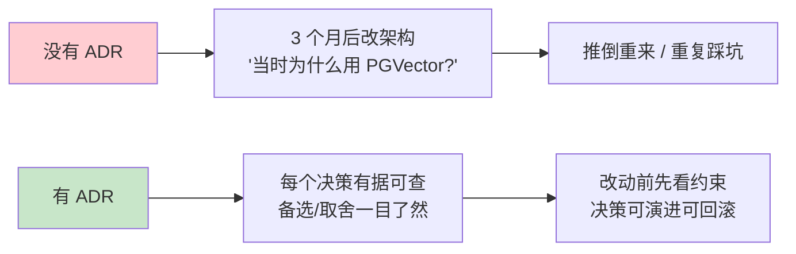
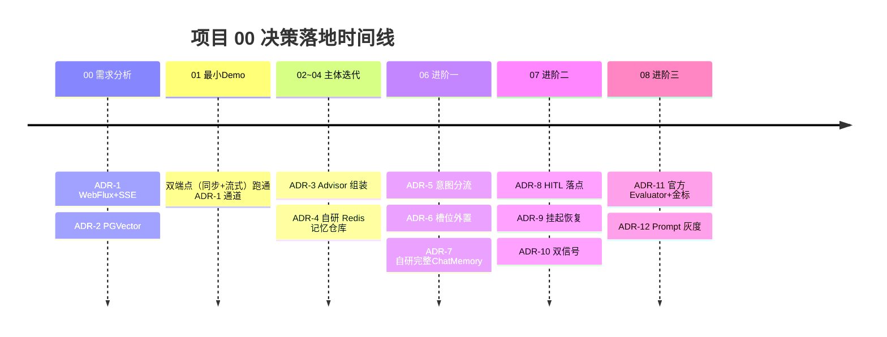
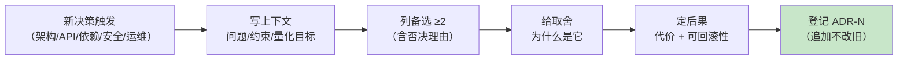

# 项目 00：智能客服系统 — 09-ADR 架构决策记录

> **定位**：把项目 00 从 00 到 08 的全部**架构决策**沉淀为 ADR（Architecture Decision Record）资产——每条记录**决策上下文 / 备选方案（≥2）/ 取舍理由 / 后果与可回滚性**。这是项目的「决策 DNA」：几个月后改架构时，能知道「当时为什么这么定」。读者画像：想复盘本项目每个关键决策「为什么」的读者，以及学习 ADR 写法范式的架构师。前置阅读：[00-需求分析与架构设计]、[05-核心代码讲解]。
> **方法论**：ADR 格式与决策纪律参照 [附录 08-架构决策方法论/00-ADR架构决策记录]；涉及 Spring AI 2.0 API 的决策均经本地 jar `javap` 实证（[附录 05-SpringAI2-API基准]）。

---

## 1. 为什么需要 ADR

本项目从最小 Demo 到数据飞轮共 6 个迭代（01-08），每一次「选 A 不选 B」都是一次架构决策。ADR 三要素：**上下文**（当时的问题与约束）、**决策**（选了什么）、**后果**（代价与如何回滚）。

---

## 2. ADR 总览（12 条）

| # | 决策 | 落地迭代 | 状态 |
|---|------|---------|------|
| ADR-1 | WebFlux + SSE 而非 MVC + WebSocket | 00/01 | ✅ 采纳 |
| ADR-2 | PGVector 而非独立向量数据库 | 00/03 | ✅ 采纳 |
| ADR-3 | 能力经 Advisor 组装，业务代码不感知 | 02/03/04 | ✅ 采纳 |
| ADR-4 | 记忆持久化自研 Redis `ChatMemoryRepository` | 04 | ✅ 采纳 |
| ADR-5 | 意图三级分流前置（记忆链/完整链/无记忆辅助链三链分流） | 06 | ✅ 采纳 |
| ADR-6 | 槽位状态外置 Redis，不进 ChatMemory | 06 | ✅ 采纳 |
| ADR-7 | 长会话压缩用自研完整 ChatMemory（滚动摘要） | 06 | ✅ 采纳 |
| ADR-8 | HITL 落点选 `ToolCallback` 包装层，非 Advisor | 07 | ✅ 采纳 |
| ADR-9 | 审批挂起-恢复模式，EventLoop 零占用 | 07 | ✅ 采纳 |
| ADR-10 | 转人工双信号置信度（意图 + 自评估） | 07 | ✅ 采纳 |
| ADR-11 | 评估用官方 Evaluator + 企业自持金标 | 08 | ✅ 采纳 |
| ADR-12 | Prompt 版本化 + 哈希灰度分流 | 08 | ✅ 采纳 |

> 状态只有三种：✅ 采纳 / 🔄 被取代（须注明被哪条取代）/ ⛔ 已回滚。决策被推翻时**新增 ADR 记录原因，不删旧 ADR**。

---

### 2.1 本节核对（ADR 总览完整性）

| # | 核对项 | PASS 判据 |
|---|--------|----------|
| 1 | 12 条 ADR 与 §4 映射表 | 每条 ADR 在"决策与迭代映射"中有落点，无孤儿决策 |
| 2 | 字段完整性 | 每条 ADR 含上下文/备选方案/取舍理由三要素（缺一即不合格） |
| 3 | 状态口径 | 状态只有 ✅ 采纳 / 🔄 被取代（注明取代者）/ ⛔ 已回滚 三种 |

## 3. 关键 ADR 详解

### ADR-1：WebFlux + SSE 而非 MVC + WebSocket

- **上下文**：日均万级请求、峰值 50 QPS，每次对话等 LLM 2-10 秒（[00 §1.2]）；流式输出是硬指标（TTFT < 1s）。
- **备选**：
  - A：Spring MVC + 同步线程池——每请求占一线程等 LLM，200 并发需 200+ 线程
  - B：WebFlux + SSE——少量 EventLoop 处理大量挂起请求，`Flux` 天然映射流式 token
  - C：WebSocket——全双工，但客服对话本质「一问一答流」，双向通道冗余且断线重连/代理穿透成本高
- **决策**：B。
- **取舍**：SSE 是 HTTP 单向流，浏览器兼容好、网关友好、断线用 EventSource 自动重连；WebSocket 只在「坐席工作台需要服务端主动推」时局部引入（[07 §4] 坐席侧 SSE 亦够用）。代价：响应式学习曲线，同步调用必须收敛 `boundedElastic`（[01 §2.5] 的 `Mono.fromCallable` 模式）。
- **可回滚性**：中。Controller 层换回 MVC 需重写流式端点；`ChatService` 核心逻辑（ChatClient 调用）不受影响。

### ADR-2：PGVector 而非独立向量数据库

- **上下文**：知识库规模万级 chunk（产品手册 + FAQ），团队有 PostgreSQL 运维经验，无向量库专职运维（[00 §3.2]）。
- **备选**：A：Milvus/Qdrant（专业向量库，性能强）；B：PGVector（Postgres 扩展）；C：SimpleVectorStore（内存，重启即丢）。
- **决策**：B。`PgVectorStore.builder(JdbcTemplate, EmbeddingModel)`（javap 实证，[03 §2.3]）+ HNSW + COSINE。
- **取舍**：万级规模下 PGVector 检索延迟 < 50ms，够用；少一个中间件 = 少一套备份/监控/升级。**何时该换**：向量过千万、需要多副本水平扩展时迁 Milvus——检索走 `VectorStore` 接口抽象，迁移成本集中在数据搬迁，不改业务代码。
- **可回滚性**：高（接口隔离）。

### ADR-3：能力经 Advisor 组装，业务代码不感知

- **上下文**：02 加工具、03 加 RAG、04 加记忆——若每步都改 `ChatService`，业务代码被横切能力反复侵入（[02 §2.5]：ChatService 全程无改动）。
- **备选**：A：在 ChatService 里手写「先检索→拼 prompt→调模型→存记忆」过程式编排；B：能力做成 Advisor/Builder 配置，`ChatClientConfig` 一处组装。
- **决策**：B。`defaultTools(...)` + `defaultAdvisors(ragAdvisor, memoryAdvisor)`（javap 实证 Builder 方法）。
- **取舍**：组装式让能力可独立开关（调试期只开工具不开 RAG）、顺序由 Advisor Order 控制；代价是链路执行流不直观（「我的检索在哪发生的？」要看 Advisor 链）——靠可观测补（[00 §8.3]）。
- **可回滚性**：高。摘掉一个 Advisor 即下线一个能力。

### ADR-4：记忆持久化自研 Redis `ChatMemoryRepository`

- **上下文**：跨重启多轮对话要求记忆持久化；本地 jar 实证 Spring AI 2.0 **只有 `InMemoryChatMemoryRepository`**，无官方 Redis 实现（[04 §1] 关键 API 澄清）。
- **备选**：A：等官方/引社区实现（不可控）；B：自研 `implements ChatMemoryRepository`（4 个同步方法，javap 实证签名）；C：JDBC 仓库（官方 starter 存在但本地未实证，且客服会话 24h TTL 语义 Redis 更贴）。
- **决策**：B。同步 `RedisTemplate` + `GenericJackson2JsonRedisSerializer`（带类型信息还原 Message 子类型）。
- **取舍**：`ChatMemoryRepository` 是同步 SPI，Redis 毫秒级延迟可接受；严格无阻塞诉求时可把记忆读写下沉独立服务。**教训沉淀**（[06 §4.2]）：初版 `saveAll` 用 `rightPushAll` 是追加语义，压缩重写场景需改为 DEL+RPUSH——自研的代价就是这些边角要自己踩。
- **可回滚性**：中。换存储 = 换 repository 实现，门面 `MessageWindowChatMemory` 不动。

### ADR-5：意图三级分流前置

- **上下文**：04 后所有消息无差别走全链；闲聊占比 30-40%，白白付检索费与延迟（[06 §2.1]）。
- **备选**：A：不分流，全靠系统提示词让 LLM 少检索（不可控）；B：关键词规则快通道（便宜但脆）；C：前置 LLM 意图分类（`entity` 结构化输出）+ **三链分流**（`chatClient` 完整 / `liteChatClient` 闲聊记忆 / `assistantChatClient` 无记忆辅助判定）。
- **决策**：C，B 作快通道保留余地。分流后三链职责边界见 [06 §2.4]「链选型」：分类/抽取/摘要等**单轮无状态判定统一走 `assistantChatClient`**（不挂记忆，也不依赖 `chatMemory`，天然避开了与 `SummarizingChatMemory` 的构造器循环依赖）。
- **取舍**：多一次轻量 LLM 调用（约 300 token）；闲聊占比 > 20% 时净收益为正。分类器所在的 `assistantChatClient` 可单独配小模型进一步压成本。
- **可回滚性**：高。路由器退化直通完整链即回到 05 版行为。

### ADR-6：槽位状态外置 Redis，不进 ChatMemory

- **上下文**：换货多步业务需要确定性骨架；ChatMemory 是「对话消息流」，混入工单状态会互相污染（[06 §3.2]）。
- **备选**：A：槽位信息写进对话历史，靠 LLM 自己记（不可靠，窗口截断即丢）；B：独立 `ExchangeSlotState` + Redis + 24h TTL。
- **决策**：B。
- **取舍**：多一套状态存储与「消息→槽位」抽取步骤；换来执行前的完整性由 Java 判定（缺槽必问、不偷跑工具），不赌模型自觉。
- **可回滚性**：高。槽位层可整体摘除退回纯 LLM 模式。

### ADR-7：长会话压缩用自研完整 ChatMemory（非装饰器）

- **上下文**：`maxMessages(20)` 硬截断，头部关键事实（订单号、承诺）静默丢失（[06 §4.1]）。
- **备选**：A：调大窗口到 100（Token 成本线性涨，且仍会截断）；B：用装饰器包住 `MessageWindowChatMemory` 做滚动摘要；C：**自研完整 `ChatMemory` 实现 `SummarizingChatMemory`**，直接持有 04 的 `RedisChatMemoryRepository`，自己完成「读全量→判阈值→折叠→覆盖写」（30 条阈值 / 保 10 条原文）。
- **决策**：C。**不是 B**——依据 spring-ai-model-2.0.0 真实源码（javap/反编译实证）：`MessageWindowChatMemory.process()` 每轮已按 `maxMessages(20)` 硬裁窗，其 `get()` 恒 ≤20 条；若用装饰器包它，`COMPRESS_THRESHOLD(30)` **恒不触发**，滚动摘要形同虚设。故只能自研实现替换掉它（[06 §4.2]）。
- **取舍**：自研要自己踩边角（读改写全走 repository 覆盖语义、阈值真正生效）；换来「摘要 + 近期原文」兼顾长期事实与近期细节。摘要 Prompt 必须显式要求保留订单/工单号/承诺事项，否则压缩就是新的丢信息路径。
- **可回滚性**：高。`chatMemory(...)` Bean 换回 `MessageWindowChatMemory` 即回窗口模式。

### ADR-8：HITL 落点选 `ToolCallback` 包装层，非 Advisor

- **上下文**：`createExchange` 等写操作须人工确认；审批需要「哪个工具、什么参数」级别的信息（[07 §3.1]）。
- **备选**：
  - A：Advisor 层拦截——❌ `ChatClientRequest` 阶段工具意图尚未发生，拿不到工具与参数（铁律：HITL 不是 Advisor）
  - B：`ToolCallingManager` 装饰器——✅ 工具执行统一入口，适合全局策略（限流/审计）
  - C：`ToolCallback` 包装层——✅ 单工具粒度、参数级信息、最贴近执行
- **决策**：C（本项目审批粒度 = 单个危险工具）。
- **取舍**：C 拿到参数级信息但需逐工具包装注册；B 拦批量但粒度粗。两者可叠加：审批用 C、观测用 B。
- **可回滚性**：高。包装层内聚，摘掉包装即恢复直执行。

### ADR-9：审批挂起-恢复模式

- **上下文**：`ToolCallback.call` 是同步契约，人工审批要几十秒起——EventLoop 上 block 是 WebFlux 铁律禁区（[07 §3.3]）。
- **备选**：A：`call` 内部自旋/阻塞等待审批（线程灾难）；B：挂起（返回占位文本 + SSE 通知）+ 恢复（坐席批准后带 `toolContext` 审批凭证重放请求）。
- **决策**：B。`toolContext(Map)` 传审批凭证（javap 实证 `ChatClientRequestSpec.toolContext`）；30 分钟未决自动拒绝（Redis TTL）。
- **取舍**：恢复是「新请求」而非「真挂起线程」，中间零线程占用；代价是重放逻辑要保证幂等（同一审批凭证只执行一次，`isApproved` 校验后即消费）。
- **可回滚性**：中。审批模式整体可降级为「危险工具直接拒绝并转人工」。

### ADR-10：转人工双信号置信度

- **上下文**：单一信号各有盲区——意图分类器看不到「知识库有没有答案」，回复自评估看不到「这句话是不是业务」（[07 §2.1]）。
- **备选**：A：仅意图置信度；B：仅回复自评估；C：双信号合并判定（意图 ≥0.6 且自评 ≥0.7 才硬答，中间档附转人工入口）。
- **决策**：C。
- **取舍**：两套阈值需持续校准（金标集回归的一部分）；换来误转率与硬答率同时可控。自评可只在「低相似度召回/工具空结果」时条件触发，省一半调用。
- **可回滚性**：高。阈值是配置，单信号模式一行可退。

### ADR-11：评估用官方 Evaluator + 企业自持金标

- **上下文**：改话术全凭感觉、无回归保护（[08 §1]）；本地 javap 实证官方评估体系真实存在（`RelevancyEvaluator` 构造基于 `ChatClient.Builder`，[08 §2.1]）。
- **备选**：A：全自研 Judge（灵活但重复造轮子且口径漂移）；B：官方 Evaluator（契约 + 内置相关性与事实核查）+ 自研满意度/合规评估器实现同一 `Evaluator` 接口 + 企业自持金标集。
- **决策**：B。
- **取舍**：官方评估器即 LLM-as-Judge，评审质量依赖所用模型；红线与满意度是私有标准必须自研——但实现同一接口，质检流水线里官方/自研同构编排。**金标数据集与判分口径是护城河**：换模型可以，标准必须自持。
- **可回滚性**：低（评估口径变更须全量重跑金标）——所以判分口径演进要像数据库 schema 一样版本化（[附录 12-评估与可观测生态/02-评估数据集管理与版本化]）。

### ADR-12：Prompt 版本化 + 哈希灰度分流

- **上下文**：话术改动直接全量，出错波及所有用户（[08 §5]）。
- **备选**：A：Prompt 写死代码，改动走发版（慢，且无法快速回滚）；B：`PromptRegistry` 版本化 + `sessionId.hashCode() % 100` 分流 + `grayPercent` 配置回滚。
- **决策**：B。
- **取舍**：哈希分流保证「同一会话稳定同版本」（对比实验有效）；无按人群分流能力（需要时升级为带用户标签的分流器）。回滚 = `grayPercent` 调 0，配置生效、不发版。
- **可回滚性**：高（这是本决策的核心收益）。

---

## 4. 决策与迭代映射

规律：**00 的两个「通道级」决策最先定且最难改；02-08 的「能力级」决策全部可独立回滚**——前者是地基（改 = 重写接入层），后者是家具（换 = 摘一层）。做决策时先问：这条是地基还是家具？

---

### 4.1 本节核对（决策-迭代一致性）

| # | 核对项 | PASS 判据 |
|---|--------|----------|
| 1 | 映射表 vs 迭代篇 | 每个映射到的迭代篇真实存在且内容体现该决策（如 ADR-4"自研 Redis 仓库"↔[04 §2.3]） |
| 2 | 决策可回滚性 | 每条详解 ADR 有"可回滚性"评级与回滚路径 |

## 5. ADR 使用规范（本项目决策纪律）

| 规范 | 说明 |
|------|------|
| 触发条件 | 影响模块边界 / 引入或替换依赖 / 性能与成本量级变化 / 安全边界变化 |
| 必填四件套 | 上下文 + 备选（≥2）+ 取舍理由 + 后果与可回滚性 |
| 编号 | ADR-N 只追加；推翻旧决策 = 新增 ADR 注明「取代 ADR-X」 |
| 引用纪律 | 迭代文档中做决策处标 ADR 编号；ADR 中标落地迭代（双向可追溯） |
| 复审时机 | 量化指标恶化（如闲聊占比、向量规模、误转率超阈）时复审对应 ADR |

**自检清单**（本文 12 条 ADR 逐条核对）：上下文有量化依据 ✓ / 备选 ≥2 且含否决理由 ✓ / 取舍写明代价 ✓ / 可回滚性分级（高=摘层即回，中=局部重写，低=需全量重跑）✓ / 落地迭代标注 ✓。

---

## 6. 总结

12 条 ADR 覆盖了项目 00 的四类决策：**通道选型**（WebFlux/SSE、PGVector）、**组装哲学**（Advisor 组装、能力可插拔）、**对话深化**（分流/槽位/压缩）、**人机与进化**（HITL 落点、挂起恢复、双信号、评估与灰度）。最重要的模式是**可回滚性分层**——地基决策慎定，家具决策快换；而 ADR 本身就是让「快换」有据可依的资产（[附录 08-架构决策方法论/00-ADR架构决策记录]）。

**下一篇**：[10-工业前沿与演进方向](10-工业前沿与演进方向.md)——站在 2026 年行业共识上审视本项目，给出下一程演进路线。
