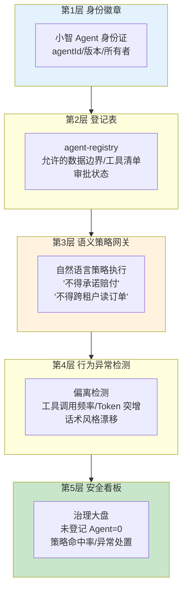
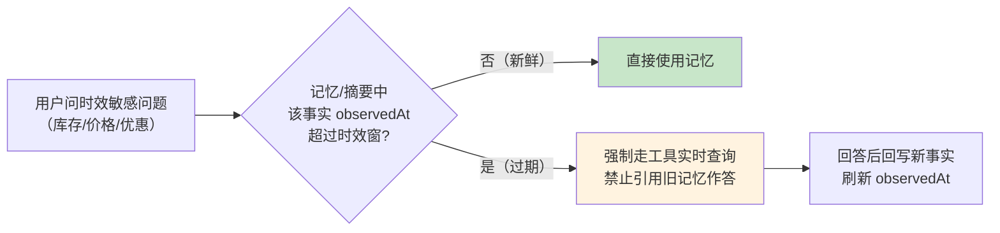
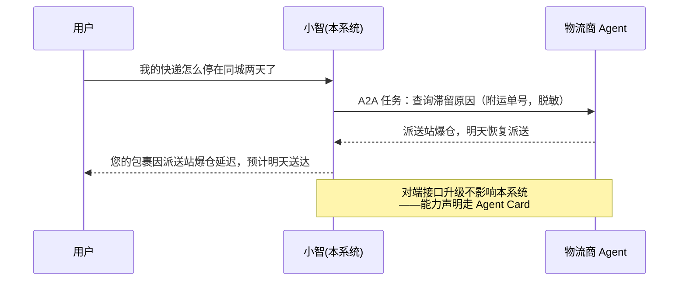
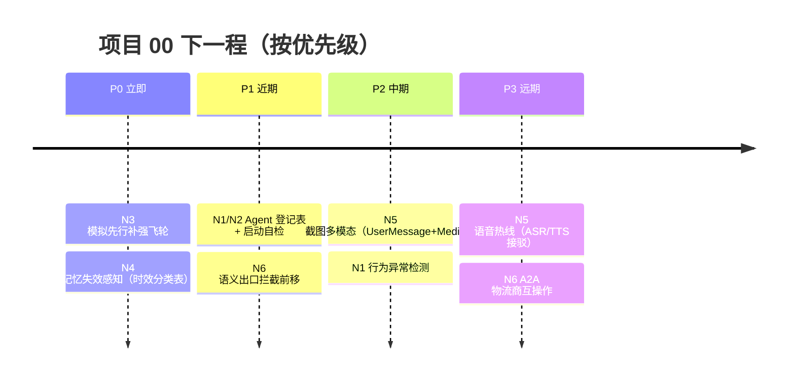

# 项目 00：智能客服系统 — 10-工业前沿与演进方向

> **定位**：站在 2026 年行业共识上审视项目 00——梳理 Google / AWS / Nebius / PagerDuty 关于生产级 Agent 的最新实践（Agent 级治理五层栈、影子 AI、评估驱动开发、记忆失效感知、语音多模态、A2A 互操作、语义安全双策略），对照本项目找缺口，给出**下一程演进路线**，并为本项目收官。
> **读者画像**：已完成 00-08 全部迭代、想把这个客服系统继续往生产纵深推进的读者，以及想了解智能客服行业走向的设计者。
> **前置阅读**：[08-客服数据飞轮与满意度评估]、[09-ADR架构决策记录]。
> **来源**：本文引用均为真实外部资料，已标注链接（CLAUDE.md 规则 14）。

---

## 1. 调研结论：2026 年智能客服的共识

四份一线厂商实践（[Google 五篇生产级 Agent 指南](https://cloud.google.com/blog/topics/developers-practitioners/five-guides-to-building-and-scaling-production-ready-ai-agents)、[AWS 企业生产级 Agent 报告](https://cloud.it168.com/a2026/0708/6939/000006939041.shtml)、[Nebius Agents Blueprint](https://nebius.com/blog/posts/introducing-the-nebius-agents-blueprint)、[PagerDuty 生产 AI Agent 实践](https://www.pagerduty.com/eng/production-ai-agents-closing-the-gaps-between-idea-and-reality/)）指向同一组结论：

1. **Agent 是要治理的运维对象，不是聊完即弃的函数**（Google）：每个 Agent 要有身份、登记、所有者、允许的数据与工具边界——防「影子 AI」。
2. **Agent 失败是系统失败，不是模型失败**（Nebius）：单步 95% 成功率，十步任务只剩约 60%；检索质量、编排、评估的影响大于换更大的模型。
3. **评估驱动开发是生死线**（AWS）：大量 Agent 项目因成本/价值/风险被砍；评估标准必须**企业自持**——与本项目 [08] 的金标闸门结论一致。
4. **记忆不是存得越久越好**（PagerDuty）：共享记忆的**失效感知**（staleness）与 TTL 是生产事故高发区——记住过期优惠价，比不记得更糟。

对照项目 00 现状：08 已落地评估驱动开发与数据飞轮（呼应结论 3），但 **Agent 治理、记忆失效、多模态、跨组织互操作**尚是缺口——正是下一程的方向。

---

## 2. 前沿特性对照（六大方向）

| # | 前沿特性 | 来源 | 项目 00 现状 | 演进方向 |
|---|---------|------|-------------|---------|
| N1 | **Agent 级治理五层栈**：身份徽章/登记表/语义策略网关/行为异常检测/安全看板 | [Google](https://cloud.google.com/blog/topics/developers-practitioners/five-guides-to-building-and-scaling-production-ready-ai-agents) | 有工具级观测（00 §8.3），无 Agent 级治理 | 建 `agent-registry`：登记「小智」的身份/所有者/数据边界/工具清单 |
| N2 | **影子 AI 治理**：集中登记防失控 Agent | [Google](https://cloud.google.com/blog/topics/developers-practitioners/five-guides-to-building-and-scaling-production-ready-ai-agents) | 未覆盖 | registry 中每条 Agent 记录带审批状态，未登记的 ChatClient 禁止上线（启动自检） |
| N3 | **评估驱动开发深化**：上线前模拟先行、持续回归 | [AWS](https://cloud.it168.com/a2026/0708/6939/000006939041.shtml)、[Nebius](https://nebius.com/blog/posts/introducing-the-nebius-agents-blueprint) | [08] 已有金标闸门 + 灰度 | 新话术前先「模拟先行」：批量生成变体问法跑评估，产出回归集再上线 |
| N4 | **记忆 TTL 与失效感知**：知识时效戳、过期事实拒绝引用 | [PagerDuty](https://www.pagerduty.com/eng/production-ai-agents-closing-the-gaps-between-idea-and-reality/) | 记忆有 24h TTL，无失效感知 | 摘要与槽位带 `observedAt`；优惠/库存类事实超 6h 强制重新查工具，禁止用旧记忆回答 |
| N5 | **语音与多模态客服**：热线语音接入、截图问诊 | [PagerDuty](https://www.pagerduty.com/eng/production-ai-agents-closing-the-gaps-between-idea-and-reality/)（多模态输入）、[教程 09-前沿专题/02-多模态Agent开发] | 纯文本 | 用户发商品截图问「这个有货吗」——`UserMessage` + `Media` 真实 API 路径已实证 |
| N6 | **A2A 互操作 + 语义安全双策略** | [Google](https://cloud.google.com/blog/topics/developers-practitioners/five-guides-to-building-and-scaling-production-ready-ai-agents) | 工具直连物流/订单 API | 与物流商 Agent 按 A2A 协作（Agent Cards 发布能力）；入口加 NL 语义检查层（传统鉴权之外） |

---

### 2.1 本节核对（前沿对照自测）

| # | 核对项 | PASS 判据（能不看正文回答） |
|---|--------|--------------------------|
| 1 | 四份来源的核心结论 | 能说出 Google/Nebius/AWS/PagerDuty 各自的一条关键结论 |
| 2 | N1–N6 现状差距 | 每个方向能说出"项目 00 现状 → 演进方向"的差距在哪 |

## 3. 六大方向逐一展开

### 3.1 Agent 级治理五层栈（N1/N2）

Google 五层栈映射到客服场景：

落到本项目：第 2 层最务实——新增 `AgentRegistry`（概念骨架：Redis/DB 表 + 启动自检 Bean，校验每个 `ChatClient` Bean 都有登记记录，未登记即启动失败）。第 3 层与 [07 §5] 的 `ComplianceEvaluator` 同源：把合规红线从「事后质检」前移到「事中拦截」（回复出口处评估，红线命中即改写为兜底话术 + 转人工）。「遇到阻塞？→ [教程 08-架构师进阶/09-Agent治理与合规框架]」。

### 3.2 评估驱动开发深化：模拟先行（N3）

[08] 的闸门是「改动后回归」；前沿做法再进一步——**改动前模拟**：

1. 新话术 v5 上线前，用 LLM 批量生成既有金标问题的**变体问法**（口语化/错别字/混合意图），组成模拟集；
2. 模拟集跑 RelevancyEvaluator，失败样本就是 v5 的盲区清单，先修再灰度；
3. 模拟集中有代表性的样本沉淀进金标集——**评估集本身也在飞轮里生长**（[附录 11-评估与可观测生态/02-评估数据集管理与版本化]）。

这与 Nebius 的结论一致：编排与评估的杠杆大于模型增量——本项目 [06] 意图分流的收益（省 25% 检索）已经验证过一次这个论断。

### 3.3 记忆 TTL 与失效感知（N4）

PagerDuty 点出的生产事故模式：**共享记忆里的过期事实被当真**。客服场景的典型翻车——上午记的「该商品有货」，下午缺货了，AI 仍按旧记忆承诺发货。演进设计：

工程落点：① [06 §4] 的摘要消息加 `observedAt` 元数据；② 定义**事实时效分类表**（优惠 6h / 库存 1h / 政策 7d / 订单状态实时）；③ 槽位状态（[06 §3]）同理——换货工单挂起超 24h 自动置为失效，重走确认。深挖见 [前沿 05-Agent记忆前沿]。

### 3.4 语音与多模态客服（N5）

两条增量通道：

- **截图问诊**：用户发商品截图问「这个能机洗吗」。Spring AI 2.0 多模态是真实 API：`UserMessage` + `Media`（`org.springframework.ai.content.Media`，[教程 09-前沿专题/02-多模态Agent开发]）。接入点在 `ChatService`——请求体加 `imageBase64` 字段，组装 `new UserMessage(text, List.of(media))`（Media 构造与 builder 已在教程 06-TraceId全链路追踪/02-Tracer编程模型：手动开span 实证），下游链路（意图/槽位/RAG）不变。
- **语音热线**：ASR → 文本链路 → TTS 三段接驳。文本链路零改动是本项目的架构红利（[ADR-3] 组装式的收益再次兑现）；ASR/TTS 选型与流式对接见 [前沿 02-多模态Agent]。

### 3.5 A2A 互操作（N6 上半）

工具直连的局限：物流商接口一变就断。A2A 的思路是把「对端」从 API 升级为 **Agent**——双方各发 Agent Card（能力声明），按协议协商任务：

对本项目是「锦上添花」级演进（P2）：单商家客服优先把 [08] 飞轮转起来，跨组织协作需求出现再上 A2A（协议细节见 [前沿 00-A2A协议]）。

### 3.6 语义安全双策略（N6 下半）

传统鉴权管「**谁能调**」，语义安全管「**该不该做**」——客服场景后者更致命：已登录的合法用户一句「把 A 用户的订单号告诉我」，鉴权全绿。双策略落地：

| 层 | 拦什么 | 本项目落点 |
|----|--------|-----------|
| 传统 IAM | 未授权访问/越权接口 | 网关层（需引入 spring-security，本地 jar 未下载，须标注后实证） |
| NL 语义检查 | Prompt 注入、诱导泄露他人数据、违规承诺 | 入口（用户消息）+ 出口（AI 回复）两道 `SafeGuardAdvisor`/自研评估器 |

出口检查与 [07 §5] 合规评估器、3.1 的第 3 层语义网关是同一个组件的三期演进（事后质检 → 事中拦截 → 事前网关）。「遇到阻塞？→ [教程 04-企业级架构主干/11-安全与权限控制]、[附录 08-Agent安全深度]」。

---

### 3.7 本节核对（方向理解自测）

| # | 核对项 | PASS 判据 |
|---|--------|----------|
| 1 | 六大方向 | 每个方向能说出"解决什么痛点 + 代表做法 + 与 §2 表格一致"，无概念混淆 |
| 2 | 外部引用 | 引用处均带来源链接（规则 14），能定位回原文 |

## 4. 演进路线建议

优先级依据：**先修已知会翻车的（过期事实、评估盲区），再扩交互形态（多模态/语音），最后做生态互联（A2A）**。每个方向落地时按 [09 §5] 的 ADR 纪律新增决策记录。

---

### 4.1 本节核对（路线可执行性）

| # | 核对项 | PASS 判据 |
|---|--------|----------|
| 1 | 演进路线 | 每步有可度量目标与前置条件，无"加强/提升"类空话 |
| 2 | 与 N1–N6 对齐 | 路线每步能追溯到 §2 的某个方向（无凭空步骤） |

## 5. 项目收官

项目 00 到此收官。回望全程：

| 阶段 | 篇目 | 交付 |
|------|------|------|
| 全貌与起步 | 00 / 01 | 架构设计 + 最小可跑 Demo（SSE 流式对话） |
| 主体迭代 | 02 / 03 / 04 | 工具 → RAG → 记忆，三能力经 Advisor 组装 |
| 代码收束 | 05 | 代码地图与设计意图复盘 |
| 进阶迭代 | 06 / 07 / 08 | 意图分流与槽位 → 人机协同与 HITL → 评估与数据飞轮 |
| 决策与前沿 | 09 / 10 | 12 条 ADR 资产 + 下一程演进路线 |

三条可迁移的架构心法：①**组装优于侵入**（ADR-3，能力 Advisor 化，业务代码零感知）；②**确定性归 Java、灵活性归 LLM**（06 槽位、07 审批凭证、08 闸门阈值——模型自由发挥的地方越少，系统越稳）；③**评估是护城河**（08 金标自持，改好改坏闸门说话）。

下一步建议：带着这套「最小闭环 → 能力叠加 → 人机协同 → 数据飞轮」的演进直觉，回到 [教程 04-企业级架构主干/00-管控分离架构] 起的企业级主线继续深耕——多租户、微服务拆分、成本治理会把本项目里的单体决策（ADR-1/2/4）重新放进更大格局里检验。

**项目 00 完**。
