# 00-需求分析与架构设计

> **定位**：从企业内部知识管理的真实痛点出发，完整推演一个基于 RAG 技术的智能文档问答系统的需求分析、架构设计与技术选型。这篇文档不写一行实现代码，而是回答"为什么做、做什么、怎么做"三个根本问题，为后续四篇迭代文档奠定地基。
>
> **读者画像**：架构师、技术负责人、需要从零搭建企业级文档问答系统的全栈开发者。
>
> **前置阅读**：[教程 05-RAG 检索增强生成](../../教程/05-RAG检索增强生成.md)、[教程 06-向量数据库选型](../../教程/06-向量数据库选型.md)。

## ★ 阅读顺序总览（10 篇，序号即阅读顺序）

| 序号 | 文档 | 阶段 | 一句话内容 |
|------|------|------|-----------|
| 00 | [需求分析与架构设计](00-需求分析与架构设计.md) | 阶段一：基础构建 | 痛点量化、RAG 选型、架构分层、迭代规划（本文） |
| 01 | [最小 Demo 搭建](01-最小Demo搭建.md) | 阶段一：基础构建 | 迭代零：端到端 RAG 管线跑通（上传→分块→检索→回答→SSE） |
| 02 | [迭代一-文档解析与向量化](02-文档解析与向量化.md) | 阶段一：基础构建 | Tika 多格式解析、段落感知分块、异步 ETL、批量向量化 |
| 03 | [迭代二-多源检索与重排](03-多源检索与重排.md) | 阶段一：基础构建 | 混合检索双路召回 + Cross-Encoder 重排 + LLM 原生引用 |
| 04 | [核心代码讲解](04-核心代码讲解.md) | 阶段一：基础构建 | 基础篇全量代码沉淀（配置/接入/服务/基础设施逐层解析） |
| 05 | [GraphRAG 知识图谱深化](05-GraphRAG知识图谱深化.md) | 阶段二：进阶深化 | 迭代三：实体抽取、图谱消歧、查询路由、增量更新 |
| 06 | [长文档理解与上下文工程](06-长文档理解与上下文工程.md) | 阶段二：进阶深化 | 迭代四：语义分块、三层摘要树、冲突消解、记忆压缩 |
| 07 | [文档多模态理解](07-文档多模态理解.md) | 阶段二：进阶深化 | 迭代五：版面分区、表格双通道、VLM 图表、OCR、页表图溯源 |
| 08 | [ADR 架构决策记录](08-ADR架构决策记录.md) | 阶段三：沉淀收官 | 12 条 ADR 决策资产与三条元规律 |
| 09 | [工业前沿与演进方向](09-工业前沿与演进方向.md) | 阶段三：沉淀收官 | 2026 行业对照、演进 backlog、项目收官 |

> 阶段一是地基（00-04 连续阅读，代码由用户手写）；阶段二按迭代递进（05/06/07 各自独立解决一类难题，建议顺序读）；阶段三是沉淀（08/09 回望全局）。每篇结尾有"下一篇"衔接。

---

## 1. 业务背景：企业知识管理的困境

### 1.1 问题起源

某大型科技企业拥有 3000+ 名员工，分布在研发、产品、运维、法务、财务、HR 等 12 个部门。随着业务规模扩张，企业内部积累了大量文档资料：技术规范、产品需求文档、运营手册、合同模板、报销流程指引、新员工入职指南……然而，**文档越多，找到有用信息的难度反而越大**。

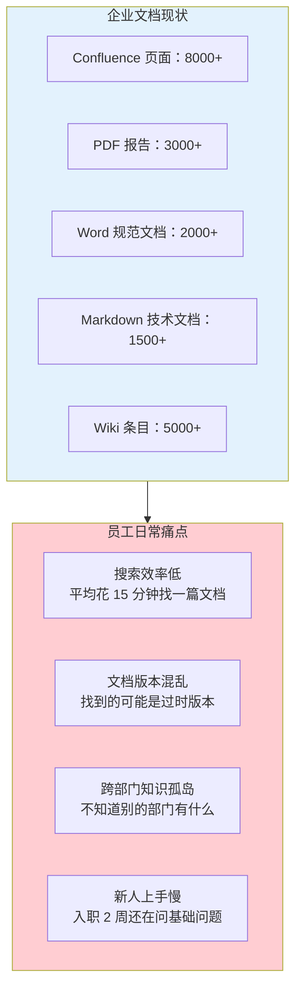

### 1.2 痛点量化

通过面向全公司的问卷调查和 IT 部门日志分析，问题被量化为以下数据：

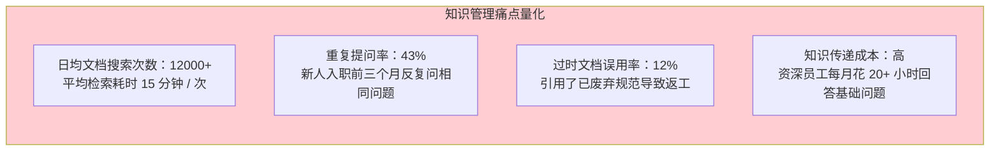

管理层提出了明确的业务目标：**建设一个智能文档问答系统，让员工用自然语言提问，秒级获得基于企业文档的精准回答**。

---

## 2. 项目定位：RAG 驱动的文档问答助手

### 2.1 为什么选择 RAG 技术路线

在技术选型阶段，团队评估了四种方案：

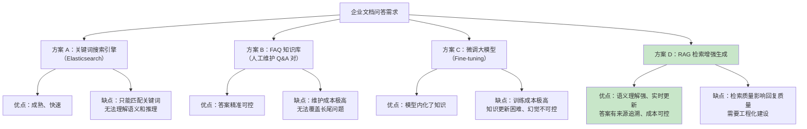

最终选择 RAG 技术路线，核心理由有三：

1. **语义理解强**：用户问"年假超过多少天需要总监审批？"，RAG 能理解这是在问请假审批流程，即使文档里没有"年假"这个关键词，也能通过语义匹配找到"带薪休假审批权限"相关段落。

2. **知识实时更新**：新文档上传后，经过解析、分块、向量化即可立即被检索到——无需重新训练模型。这在文档频繁变更的企业环境中至关重要。

3. **答案可追溯**：RAG 每次回答都基于检索到的文档片段，可以明确标注来源（"根据《员工手册》第 3.2 节……"），大幅降低幻觉风险。这在法务、合规、财务等严肃场景中是刚需。

> **深入理解 RAG 的完整流程** → [教程 05-RAG 检索增强生成](../../教程/05-RAG检索增强生成.md)：该教程详细讲解了 RAG 的数据摄入阶段（文档解析、文本分块、向量化、存储）和检索增强阶段（问题向量化、向量检索、Prompt 组装、LLM 生成），是理解本项目技术基础的核心前置阅读。

### 2.2 项目定位声明

> **智能文档助手**是企业级 RAG 问答系统。它向下支持 PDF、Word、Markdown 等多种文档格式的自动解析、智能分块和向量化存储，向上为用户提供自然语言问答入口，基于检索到的文档片段生成精准回答，并标注引用来源。

一句话定位：**企业知识的智能入口，员工的秒级问答助手**。

---

## 3. 整体架构设计

### 3.1 架构全景图

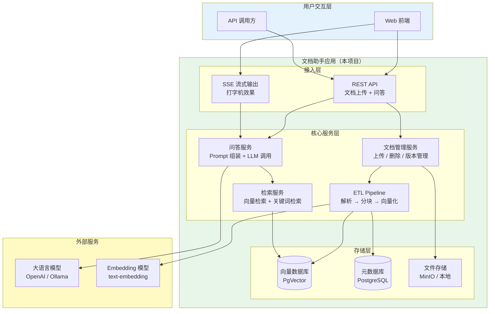

### 3.2 分层职责

| 层次 | 职责 | 关键组件 |
|------|------|---------|
| **接入层** | 对用户暴露 REST API 和 SSE 流式端点 | DocumentController、QaController |
| **核心服务层** | 文档管理、ETL Pipeline、混合检索、问答编排 | DocumentService、EtlService、RetrievalService、QaService |
| **存储层** | 向量存储、元数据存储、文件存储 | PgVector、PostgreSQL、MinIO |
| **外部依赖** | 提供 LLM 推理和 Embedding 向量化能力 | OpenAI / Ollama / 其他模型服务 |

### 3.3 核心设计决策

**决策一：向量数据库选型——PgVector vs Milvus vs Chroma**

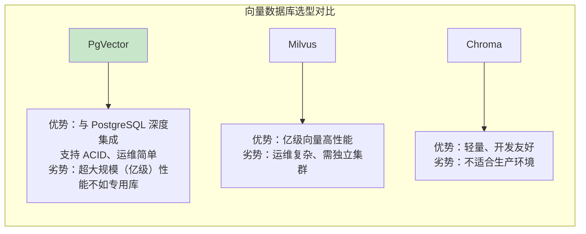

选择 **PgVector**，核心原因：

- 企业文档量预计在 10 万到 50 万文档块级别，PgVector 的 HNSW 索引完全能覆盖。
- 团队已有 PostgreSQL 运维经验，无需引入新中间件，降低运维成本。
- 文档元数据（标题、来源、版本、权限标签）和向量数据存在同一个数据库中，支持联合过滤查询（`WHERE department = '研发' ORDER BY vector <=> query_vector`）。

> **向量数据库选型深入** → [教程 06-向量数据库选型](../../教程/06-向量数据库选型.md)：该教程从查询延迟、召回率、写入吞吐、存储成本四个核心指标出发，详细对比了 PgVector、Redis、Chroma、Milvus、Pinecone 五种向量数据库的优劣，并提供了完整的选型决策框架。

**决策二：同步还是异步处理文档上传？**

文档解析和向量化是耗时操作（PDF 解析 + 分块 + 批量 Embedding 可能需要数十秒），不能阻塞 HTTP 请求。选择 **异步处理** 模式：

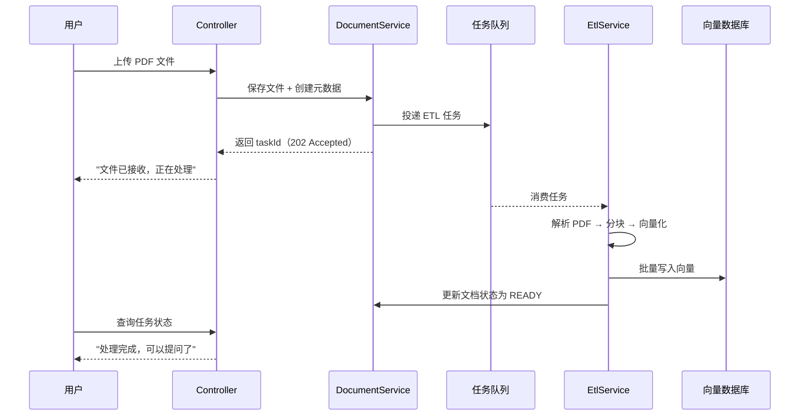

**决策三：检索策略——纯向量检索还是混合检索？**

迭代一采用纯向量检索快速验证管线，迭代二升级为 **混合检索（向量 + 关键词）+ 重排**。原因：

- 纯向量检索对语义理解强，但对专有名词、缩写、编号（如"ISO 27001"、"K8s PV"）的召回率不稳定。
- 关键词检索（PostgreSQL 全文索引）恰好补充了精确匹配能力。
- 两路召回后通过 Reranker 模型重排，兼得语义理解和精确匹配。

> **高级 RAG 策略深入** → [教程 35-高级 RAG 与 Agentic RAG](../../教程/35-高级RAG与AgenticRAG.md)：该教程讲解了基础 RAG 的四大瓶颈（单跳检索、语义盲区、无重排、一刀切）以及混合检索多路召回 + Reranker 重排的完整解决方案。

### 3.4 ADR 演进决策记录（架构期）

| ADR | 决策 | 备选方案 | 取舍理由 |
|-----|------|---------|---------|
| **ADR-001** | 技术路线选 **RAG**，弃 FAQ 知识库 / Fine-tuning | 关键词搜索引擎、人工维护 FAQ、微调大模型 | 语义理解强、知识实时更新、答案可追溯；检索质量是唯一短板，可用工程手段补齐（迭代二混合检索+重排） |
| **ADR-002** | 向量数据库选 **PgVector**，弃 Milvus / Chroma | Milvus（亿级高性能）、Chroma（轻量） | 10~50 万块规模 HNSW 完全覆盖；与元数据同库支持 `WHERE 过滤 + 向量排序` 联合查询；复用团队 PostgreSQL 运维经验，零新增中间件 |
| **ADR-003** | 文档上传采用 **异步 ETL**，弃同步处理 | 同步处理（Demo 阶段） | PDF 解析 + 批量 Embedding 数十秒，不能阻塞 HTTP；上传即返回 202/taskId，前端轮询状态机 UPLOADING → PROCESSING → READY |
| **ADR-004** | 检索策略 **迭代演进**：先纯向量、迭代二升级混合检索+重排 | 一期就上混合检索 | 先验证管线可行性（最小 Demo），再用 A/B 评估集量化混合检索的增益（Recall@5 +17pp、MRR +43%，见 [03-迭代二](03-多源检索与重排.md)），每一步都独立交付价值 |

> **想深入？→ [附录 08-架构决策方法论/00-ADR架构决策记录](../../附录/08-架构决策方法论/00-ADR架构决策记录.md)**：ADR 三要素（上下文 / 决策 / 取舍）的完整方法论。

---

## 4. 技术选型

### 4.1 技术栈总览

| 层面 | 技术选型 | 版本 | 选型理由 |
|------|---------|------|---------|
| **框架** | Spring Boot | 4.1 | 最新 LTS，虚拟线程原生支持 |
| **AI 框架** | Spring AI | 2.0.0 | 内置 VectorStore、ETL、Advisor 抽象 |
| **Web** | Spring WebFlux | 随 Boot | 响应式、SSE 原生支持 |
| **JDK** | Java | 21 | 虚拟线程、Record、模式匹配 |
| **向量数据库** | PgVector | 0.8+ | PostgreSQL 扩展，ACID + 向量检索一体 |
| **元数据库** | PostgreSQL | 16 | 与 PgVector 共用实例 |
| **文档解析** | Apache Tika + PDFBox | 3.x | 多格式文档解析（PDF/Word/Markdown） |
| **可观测** | Micrometer + OTel | 随 Boot | 全链路追踪 |
| **文件存储** | MinIO / 本地文件系统 | - | 原始文档存储 |

### 4.2 Spring Boot 4.1 + Spring AI 2.0 的关键优势

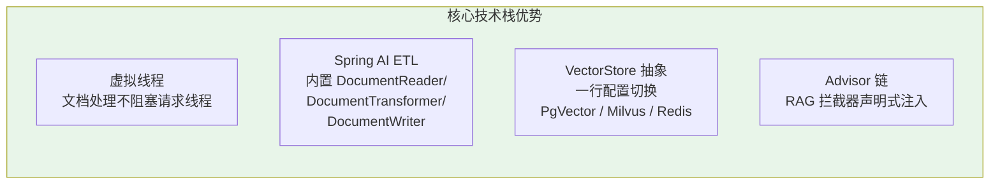

Spring AI 2.0 为 RAG 场景提供了端到端的抽象层：

- **ETL Pipeline**：`DocumentReader`（读文档）→ `DocumentTransformer`（分块/清洗）→ `DocumentWriter`（写向量库），三个接口串联即可完成数据摄入管线。
- **VectorStore 统一抽象**：通过 `VectorStore` 接口屏蔽底层差异，从 PgVector 切换到 Milvus 只需改配置、零代码改动。
- **QuestionAnswerAdvisor**：内置的 RAG Advisor，自动完成"检索 → 注入 Prompt → LLM 生成"全链路，声明式启用。

### 4.3 依赖清单（最终目标版 pom.xml，照抄即可）

> 下表是**最终目标版**的完整 `pom.xml`（含迭代一/二追加的 Tika、JDBC）。迭代零（[01-最小 Demo 搭建](01-最小Demo搭建.md)）从精简版起步，迭代一追加 Tika、迭代二追加 JDBC——各迭代篇会给出"追加块"，演进到本表形态。`spring-ai-bom` 统一锁定 Spring AI 2.0.0 全部坐标，业务依赖无需写版本号。

```xml
<?xml version="1.0" encoding="UTF-8"?>
<project xmlns="http://maven.apache.org/POM/4.0.0"
         xmlns:xsi="http://www.w3.org/2001/XMLSchema-instance"
         xsi:schemaLocation="http://maven.apache.org/POM/4.0.0 https://maven.apache.org/xsd/maven-4.0.0.xsd">
    <modelVersion>4.0.0</modelVersion>
    <parent>
        <groupId>org.springframework.boot</groupId>
        <artifactId>spring-boot-starter-parent</artifactId>
        <version>4.1.0</version>
        <relativePath/>
    </parent>

    <groupId>com.example</groupId>
    <artifactId>doc-assistant</artifactId>
    <version>0.1.0</version>
    <name>doc-assistant</name>
    <description>智能文档助手 —— 企业级 RAG 文档问答系统</description>

    <properties>
        <java.version>21</java.version>
    </properties>

    <dependencyManagement>
        <dependencies>
            <dependency>
                <groupId>org.springframework.ai</groupId>
                <artifactId>spring-ai-bom</artifactId>
                <version>2.0.0</version>
                <type>pom</type>
                <scope>import</scope>
            </dependency>
        </dependencies>
    </dependencyManagement>

    <dependencies>
        <!-- WebFlux 响应式 Web 框架（SSE 原生支持） -->
        <dependency>
            <groupId>org.springframework.boot</groupId>
            <artifactId>spring-boot-starter-webflux</artifactId>
        </dependency>

        <!-- Spring AI OpenAI Starter（Chat + Embedding） -->
        <dependency>
            <groupId>org.springframework.ai</groupId>
            <artifactId>spring-ai-starter-model-openai</artifactId>
        </dependency>

        <!-- Spring AI PgVector Starter（向量存储） -->
        <dependency>
            <groupId>org.springframework.ai</groupId>
            <artifactId>spring-ai-starter-vector-store-pgvector</artifactId>
        </dependency>

        <!-- Spring AI Tika 文档解析（PDF/Word/HTML）——迭代一引入 -->
        <dependency>
            <groupId>org.springframework.ai</groupId>
            <artifactId>spring-ai-tika-document-reader</artifactId>
        </dependency>

        <!-- JPA（文档元数据 DocumentEntity） -->
        <dependency>
            <groupId>org.springframework.boot</groupId>
            <artifactId>spring-boot-starter-data-jpa</artifactId>
        </dependency>

        <!-- JDBC（关键词全文检索 JdbcClient）——迭代二引入 -->
        <dependency>
            <groupId>org.springframework.boot</groupId>
            <artifactId>spring-boot-starter-jdbc</artifactId>
        </dependency>

        <!-- PostgreSQL 驱动 -->
        <dependency>
            <groupId>org.postgresql</groupId>
            <artifactId>postgresql</artifactId>
            <scope>runtime</scope>
        </dependency>

        <!-- 可观测性 -->
        <dependency>
            <groupId>org.springframework.boot</groupId>
            <artifactId>spring-boot-starter-actuator</artifactId>
        </dependency>

        <!-- Lombok 简化实体样板代码 -->
        <dependency>
            <groupId>org.projectlombok</groupId>
            <artifactId>lombok</artifactId>
            <optional>true</optional>
        </dependency>

        <dependency>
            <groupId>org.springframework.boot</groupId>
            <artifactId>spring-boot-starter-test</artifactId>
            <scope>test</scope>
        </dependency>
    </dependencies>
</project>
```

---

## 5. 项目结构规划

### 5.1 模块划分

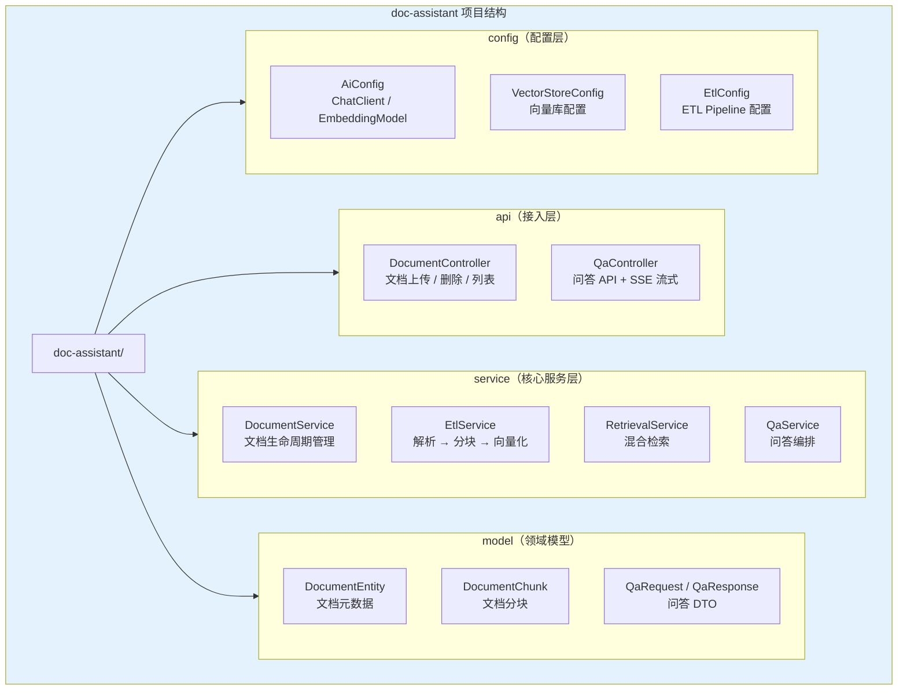

### 5.2 目录结构

```
doc-assistant/
├── pom.xml
├── src/main/java/com/example/docassistant/
│   ├── DocAssistantApplication.java
│   ├── api/                               # 接入层
│   │   ├── DocumentController.java         # 文档上传 / 管理 API
│   │   ├── QaController.java              # 问答 API（REST + SSE）
│   │   └── dto/                           # 请求 / 响应 DTO
│   │       ├── UploadResponse.java
│   │       ├── QaRequest.java
│   │       └── QaResponse.java
│   ├── service/                           # 核心服务层
│   │   ├── DocumentService.java           # 文档 CRUD + 状态管理
│   │   ├── EtlService.java                # ETL Pipeline 编排
│   │   ├── ChunkingService.java           # 文本分块策略
│   │   ├── RetrievalService.java          # 混合检索
│   │   ├── RerankService.java             # 重排服务
│   │   └── QaService.java                 # 问答编排
│   ├── model/                             # 领域模型
│   │   ├── DocumentEntity.java            # 文档元数据 JPA 实体
│   │   └── enums/
│   │       └── DocumentStatus.java        # UPLOADING/PROCESSING/READY/FAILED
│   ├── config/                            # 配置类
│   │   ├── AiConfig.java                  # ChatClient + EmbeddingModel
│   │   ├── VectorStoreConfig.java         # PgVector 配置
│   │   └── EtlPipelineConfig.java         # ETL 管线 Bean 配置
│   └── exception/                         # 统一异常处理
│       ├── DocumentException.java
│       └── GlobalExceptionHandler.java
├── src/main/resources/
│   ├── application.yml
│   └── prompts/
│       └── qa-system-prompt.st            # 问答系统提示词模板
└── src/test/java/
    └── com/example/docassistant/
        ├── service/
        └── integration/
```

---

## 6. 迭代规划

整个项目分三个阶段、五个迭代，逐步从最小 Demo 演进到生产级文档问答系统。

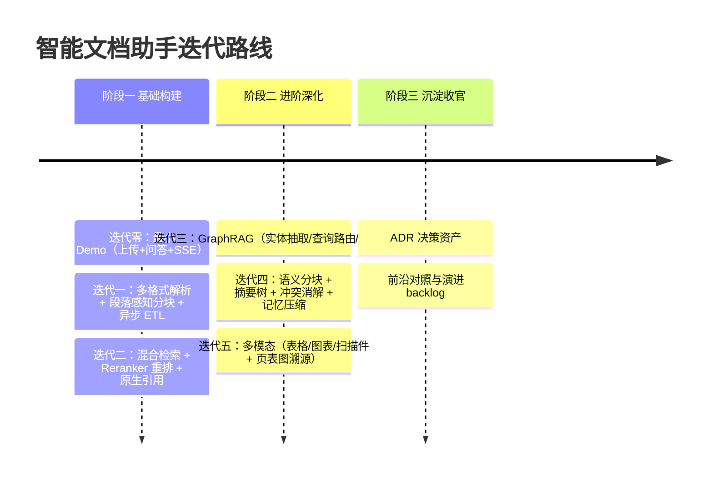

### 6.1 迭代目标矩阵

| 迭代 | 核心目标 | 关键交付物 | 对应文档 |
|------|---------|-----------|---------|
| **迭代零** | 验证 RAG 管线可行性 | Markdown 文档上传 + 基础向量检索问答 | [01-最小 Demo 搭建](01-最小Demo搭建.md) |
| **迭代一** | 多格式文档解析 + 智能分块 | PDF/Word 解析 + 分块策略优化 + 批量 Embedding | [02-文档解析与向量化](02-文档解析与向量化.md) |
| **迭代二** | 混合检索 + 重排 + 引用标注 | 向量+关键词混合检索 + Reranker 重排 + 来源标注 | [03-多源检索与重排](03-多源检索与重排.md) |
| **迭代三** | 跨文档多跳推理 | 实体抽取 + 知识图谱 + 查询路由 + 增量更新 | [05-GraphRAG 知识图谱深化](05-GraphRAG知识图谱深化.md) |
| **迭代四** | 长文档与多文档治理 | 语义分块 + 三层摘要树 + 冲突消解 + 记忆压缩 | [06-长文档理解与上下文工程](06-长文档理解与上下文工程.md) |
| **迭代五** | 多模态文档理解 | 版面分区 + 表格双通道 + VLM 图表 + OCR + 页表图溯源 | [07-文档多模态理解](07-文档多模态理解.md) |
| **沉淀收官** | 决策资产与前沿演进 | 12 条 ADR 登记簿 + 2026 对照与演进 backlog | [08-ADR 架构决策记录](08-ADR架构决策记录.md)、[09-工业前沿与演进方向](09-工业前沿与演进方向.md) |

### 6.2 非功能需求

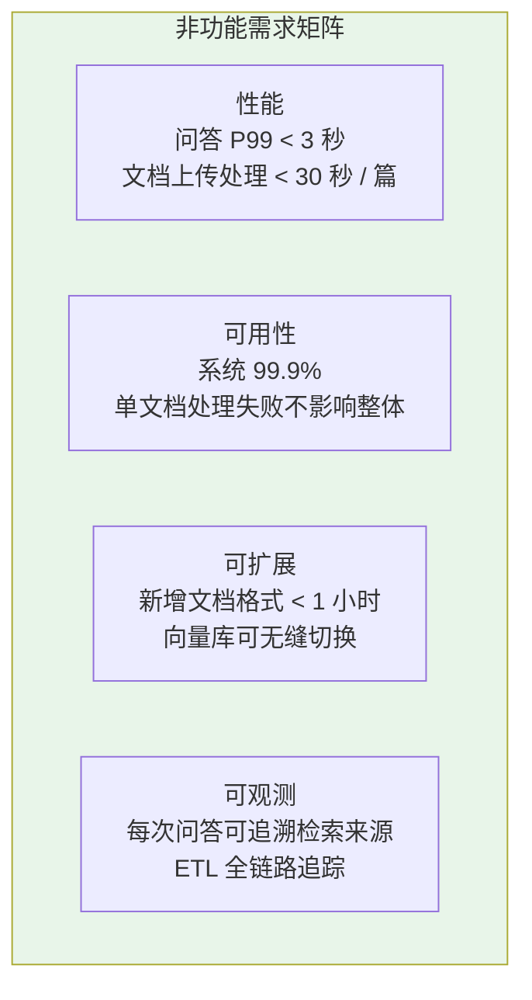

**量化验收标准（迭代验收对照，均可在迭代篇复测）**：

| 维度 | 量化指标 | 目标值 | 对应迭代 |
|------|---------|-------|---------|
| 性能 | 问答端到端 P99 | < 3 秒 | 迭代二验收 |
| 性能 | 文档上传接口返回 | < 500 ms（异步化后） | 迭代一验收 |
| 性能 | 单文档 ETL（30 页 PDF） | < 30 秒 | 迭代一验收 |
| 可用性 | 单文档解析失败 | 不影响其他文档，状态置 FAILED | 迭代一验收 |
| 检索质量 | 评估集 Recall@5 | ≥ 85%（混合检索 + 重排） | 迭代二验收 |
| 检索质量 | 评估集 MRR | ≥ 0.70 | 迭代二验收 |
| 可扩展 | 新增文档格式 | ≤ 1 小时（实现一个 DocumentParser） | 迭代一验收 |

---

## 7. 数据模型设计

### 7.1 核心实体关系

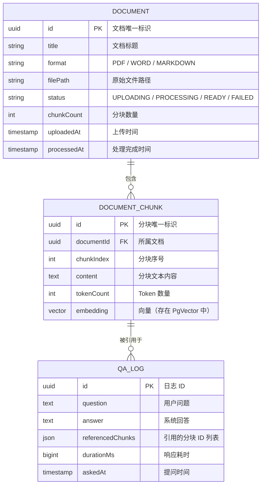

### 7.2 关键设计说明

- **DocumentEntity** 跟踪文档全生命周期状态（`UPLOADING → PROCESSING → READY`），前端根据状态决定何时允许对该文档提问。
- **DocumentChunk** 是向量检索单元，每个分块对应 PgVector 中的一条向量记录。分块策略（固定大小、按段落、按语义）在迭代一中详细展开。
- **QaLog** 记录每次问答的问题、回答和引用的分块 ID，支持事后质量审计和持续优化。

---

## 8. 关键风险与应对

| 风险 | 概率 | 影响 | 应对方案 |
|------|------|------|---------|
| PDF 解析质量差（表格/图片丢失） | 高 | 高 | Apache Tika + 自定义后处理；复杂 PDF 引入 OCR |
| 分块过大导致上下文溢出 | 中 | 中 | Token 计数 + 滑动窗口分块策略 |
| 向量检索召回率低 | 中 | 高 | 迭代二引入混合检索 + Reranker |
| Embedding API 调用成本高 | 中 | 中 | 批量调用 + 本地 Embedding 模型备选 |
| LLM 幻觉（编造文档中没有的内容） | 中 | 高 | 强系统提示词约束 + 引用来源标注 + 置信度阈值 |

---

## 9. 总结

本文从企业知识管理的真实痛点出发，完整推演了智能文档助手项目的需求分析和架构设计：

1. **痛点清晰**：8000+ Confluence 页面、3000+ PDF、日均 12000 次搜索、平均 15 分钟找一篇文档——知识检索效率低下驱动了智能问答系统的建设需求。

2. **选型合理**：RAG 技术凭借语义理解强、知识实时更新、答案可追溯三大优势，击败搜索引擎、FAQ 知识库和 Fine-tuning 方案。Spring Boot 4.1 + Spring AI 2.0 + PgVector 构成完整技术栈。

3. **架构分层**：接入层（REST + SSE）→ 核心服务层（文档管理 + ETL + 检索 + 问答）→ 存储层（PgVector + PostgreSQL），三层分明、职责清晰。

4. **迭代务实**：五个迭代从最小 Demo 到多格式解析、混合检索重排，再到 GraphRAG、长文档治理与多模态理解，逐步叠加能力，每一步都可独立交付价值、每一步都有量化验收。

下一篇 [01-最小 Demo 搭建](01-最小Demo搭建.md) 将开始动手实践，搭建项目骨架并完成第一个端到端的文档问答 Demo。

---

## 10. 代码使用说明（照抄前必读）

本项目的代码遵循「项目文档不生成 .java 文件、代码由用户手写」的规范，因此：

1. **框架 API 全部真实**：Spring AI 2.0.0 的 `ChatClient`/`VectorStore`/`CallAdvisor`/`StreamAdvisor` 等均按 [附录 05-SpringAI2-API基准](../../附录/05-SpringAI2-API基准/00-Advisor与ChatMemory.md) 的真实签名书写，可照抄编译。本项目的全部自定义类（`DocumentService`/`EtlService`/`RetrievalService`/`HybridRagAdvisor` 等）均给出**完整 Java 类（含全部 import，一行不省略）**。
2. **WebFlux 一致性**：所有代码遵循响应式铁律——上传用 `FilePart` + `DataBufferUtils`、阻塞操作收敛到 `subscribeOn(Schedulers.boundedElastic())` 或 `@Async` 线程池、禁 ThreadLocal、SSE 用 `Flux`。
3. **依赖标注**：凡迭代中新增依赖（Tika、JDBC），均以「pom.xml 追加依赖」块给出完整 `<dependency>` 片段；`spring-ai-bom` 统一锁定版本。
4. **演进式阅读**：每个迭代篇都从"上一版痛点"出发，回答"新增需求→影响模块→架构演进"四问，请按 `00 → 01 → 02 → ...` 顺序阅读，不要跳读最终版。检索到引用标注随迭代演进（迭代零后补 sources → 迭代二 LLM 原生 citations）。
