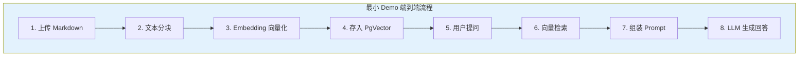
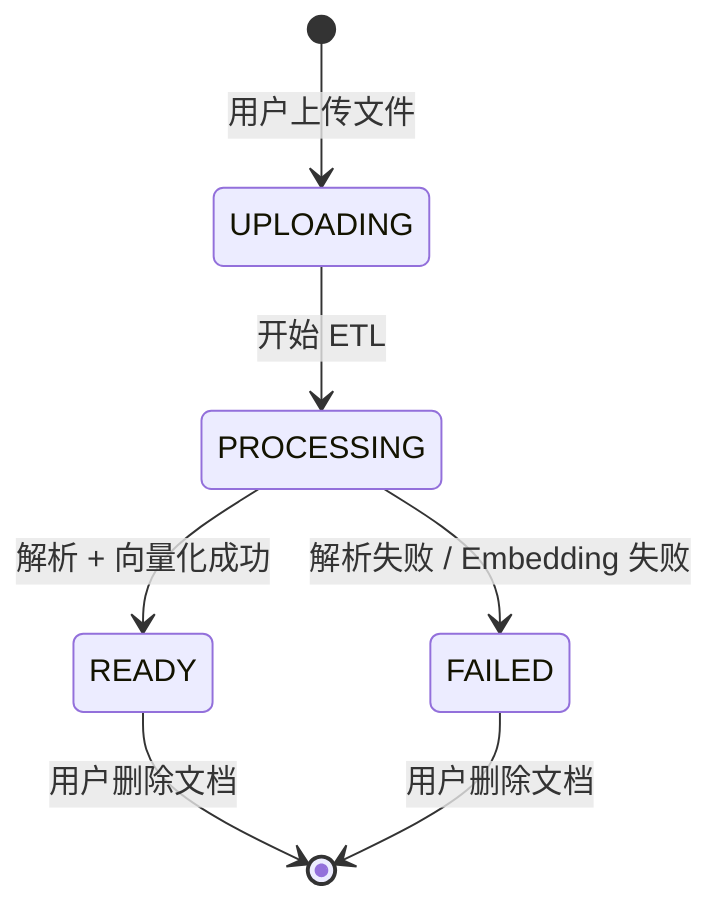
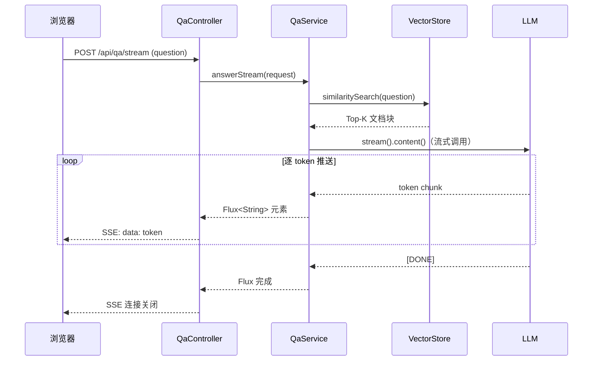
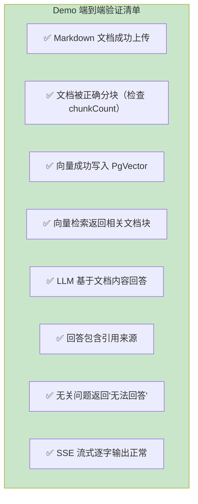

# 01-最小 Demo 搭建

> **定位**：从零搭建一个可运行的端到端 RAG 文档问答 Demo——文档上传、文本分块、向量化存储、向量检索、LLM 生成回答，全链路打通。这篇文档聚焦"让管线跑通"，不追求精度优化和性能调优。
>
> **读者画像**：已了解 RAG 概念，需要动手搭建第一个 Spring AI RAG 应用的开发者。
>
> **前置阅读**：[教程 05-RAG 检索增强生成](../../教程/05-RAG检索增强生成.md)、[教程 12-结构化输出](../../教程/12-结构化输出.md)。

---

## 1. Demo 目标

### 1.1 要实现什么

一个最简的文档问答管线：用户上传一篇 Markdown 文档 → 系统解析并分块 → 向量化存储 → 用户提问 → 系统检索相关块 → LLM 基于检索结果回答。



### 1.2 技术范围

| 能力 | 是否包含 | 说明 |
|------|---------|------|
| Markdown 文档上传 | 是 | 通过 REST API 上传 |
| PDF / Word 解析 | 否 | 迭代一实现 |
| 智能分块策略 | 简单版 | 固定大小分块，迭代一优化 |
| 向量检索 | 是 | Spring AI VectorStore |
| 结构化回答 | 是 | 返回答案 + 引用来源 |
| 混合检索 | 否 | 迭代二实现 |
| 重排 | 否 | 迭代二实现 |
| SSE 流式输出 | 是 | 打字机效果 |

---

## 2. 项目搭建

### 2.1 初始化项目

创建 Spring Boot 4.1 项目，核心依赖已在 [00-需求分析与架构设计](00-需求分析与架构设计.md) 中列出。这里关注 `application.yml` 配置：

```yaml
# application.yml
spring:
  application:
    name: doc-assistant

  # PostgreSQL + PgVector 配置
  datasource:
    url: jdbc:postgresql://localhost:5432/docassistant
    username: docassistant
    password: docassistant
  jpa:
    hibernate:
      ddl-auto: update
    properties:
      hibernate:
        dialect: org.hibernate.dialect.PostgreSQLDialect

  # Spring AI 配置
  ai:
    openai:
      api-key: ${OPENAI_API_KEY}
      chat:
        options:
          model: gpt-4o
          temperature: 0.3          # 低温度：事实性问答需要确定性
      embedding:
        options:
          model: text-embedding-3-small  # 1536 维，性价比高
    vectorstore:
      pgvector:
        index-type: HNSW            # 近似搜索索引
        distance-type: COSINE_DISTANCE  # 余弦相似度
        dimensions: 1536            # 与 Embedding 模型维度一致
```

**关键配置说明**：

- `temperature: 0.3`：文档问答是事实性任务，不需要高创造性。低温度让回答更确定、更贴合检索到的文档内容。
- `index-type: HNSW`：Hierarchical Navigable Small World 图索引，在召回率和查询延迟之间取得最佳平衡，是 PgVector 推荐的索引类型。
- `distance-type: COSINE_DISTANCE`：余弦距离最适合文本语义相似度计算。

> **向量数据库索引和距离度量深入** → [教程 26-向量数据库选型](../../教程/26-向量数据库选型.md)：该教程详细对比了 HNSW、IVF 等索引类型的性能特征，以及余弦距离、欧氏距离、内积在不同场景下的选择依据。

### 2.2 数据库准备

PostgreSQL 需要安装 PgVector 扩展：

```sql
-- 创建数据库
CREATE DATABASE docassistant;

-- 连接到 docassistant 数据库后，启用 PgVector 扩展
CREATE EXTENSION IF NOT EXISTS vector;

-- Spring AI 会自动创建 vector_store 表，但也可以手动创建
CREATE TABLE IF NOT EXISTS vector_store (
    id UUID PRIMARY KEY,
    content TEXT,
    metadata JSON,
    embedding vector(1536)  -- 与 Embedding 模型维度一致
);

-- 创建 HNSW 索引
CREATE INDEX IF NOT EXISTS vector_store_embedding_idx
    ON vector_store USING hnsw (embedding vector_cosine_ops);
```

### 2.3 AI 核心配置类

```java
package com.example.docassistant.config;

import org.springframework.ai.chat.client.ChatClient;
import org.springframework.context.annotation.Bean;
import org.springframework.context.annotation.Configuration;

/**
 * AI 核心配置——ChatClient 和 EmbeddingModel 由 Spring AI Starter 自动注入，
 * 这里只需构建 ChatClient 并设置系统提示词。
 */
@Configuration
public class AiConfig {

    @Bean
    public ChatClient chatClient(ChatClient.Builder builder) {
        return builder
                .defaultSystem("""
                    你是企业文档问答助手。请严格基于提供的参考文档回答用户问题。

                    规则：
                    1. 只使用参考文档中的信息回答，不要编造。
                    2. 如果参考文档中没有相关信息，请明确回答"根据现有文档，我无法回答这个问题"。
                    3. 回答时请标注信息来源（文档标题 + 相关段落）。
                    4. 保持简洁、专业、准确。
                    """)
                .build();
    }
}
```

系统提示词是 RAG 问答质量的基石。上面这段提示词做了三件关键的事：

- **约束信息来源**：强制 LLM 只基于检索到的文档回答，不要"自由发挥"。这是降低幻觉风险的第一道防线。
- **处理无答案情况**：当检索结果与问题不相关时，让 LLM 明确说"无法回答"，而不是硬编一个。
- **要求标注来源**：为后续的引用来源标注功能做铺垫。

---

## 3. 文档上传与处理

### 3.1 文档元数据实体

```java
package com.example.docassistant.model;

import jakarta.persistence.*;
import java.time.LocalDateTime;
import java.util.UUID;

@Entity
@Table(name = "documents")
public class DocumentEntity {

    @Id
    @GeneratedValue
    private UUID id;

    private String title;           // 文档标题
    private String format;          // MARKDOWN / PDF / WORD

    @Column(length = 1000)
    private String filePath;        // 原始文件存储路径

    @Enumerated(EnumType.STRING)
    private DocumentStatus status;  // UPLOADING / PROCESSING / READY / FAILED

    private Integer chunkCount;     // 分块数量

    private LocalDateTime uploadedAt;
    private LocalDateTime processedAt;

    // getters / setters 省略
}
```

```java
package com.example.docassistant.model.enums;

public enum DocumentStatus {
    UPLOADING,    // 文件已上传，等待处理
    PROCESSING,   // 正在解析 + 向量化
    READY,        // 处理完成，可被检索
    FAILED        // 处理失败
}
```

文档状态机设计是工程化的关键——用户上传后不需要等待处理完成，前端轮询状态即可。



### 3.2 文档上传 API

```java
package com.example.docassistant.api;

import com.example.docassistant.model.DocumentEntity;
import com.example.docassistant.service.DocumentService;
import org.springframework.web.bind.annotation.*;
import org.springframework.web.multipart.MultipartFile;

@RestController
@RequestMapping("/api/documents")
public class DocumentController {

    private final DocumentService documentService;

    public DocumentController(DocumentService documentService) {
        this.documentService = documentService;
    }

    /**
     * 上传文档——同步处理（Demo 阶段简化为同步，迭代一改为异步）
     */
    @PostMapping("/upload")
    public UploadResponse upload(@RequestParam("file") MultipartFile file) {
        DocumentEntity doc = documentService.uploadAndProcess(file);
        return new UploadResponse(
            doc.getId(),
            doc.getTitle(),
            doc.getStatus().name(),
            doc.getChunkCount()
        );
    }

    /**
     * 查询文档处理状态
     */
    @GetMapping("/{id}/status")
    public DocumentStatusResponse getStatus(@PathVariable UUID id) {
        DocumentEntity doc = documentService.getById(id);
        return new DocumentStatusResponse(
            doc.getId(),
            doc.getStatus().name(),
            doc.getChunkCount()
        );
    }
}
```

### 3.3 文档服务与 ETL Pipeline

```java
package com.example.docassistant.service;

import com.example.docassistant.model.DocumentEntity;
import com.example.docassistant.model.enums.DocumentStatus;
import org.springframework.ai.document.Document;
import org.springframework.ai.transformer.splitter.TokenTextSplitter;
import org.springframework.ai.vectorstore.VectorStore;
import org.springframework.stereotype.Service;
import org.springframework.web.multipart.MultipartFile;

import java.io.IOException;
import java.nio.file.Files;
import java.nio.file.Path;
import java.time.LocalDateTime;
import java.util.List;
import java.util.Map;

@Service
public class DocumentService {

    private final VectorStore vectorStore;
    private final DocumentRepository documentRepository;

    // TokenTextSplitter：Spring AI 内置的文本分块器
    private final TokenTextSplitter textSplitter = new TokenTextSplitter(
        500,   // 每块目标 Token 数
        100,   // 最小块大小
        20,    // 滑动窗口重叠 Token 数
        10000, // 最大块大小（安全上限）
        true   // 是否保留分隔符
    );

    public DocumentEntity uploadAndProcess(MultipartFile file) {
        // 1. 创建文档元数据
        DocumentEntity doc = new DocumentEntity();
        doc.setTitle(file.getOriginalFilename());
        doc.setFormat(detectFormat(file.getOriginalFilename()));
        doc.setStatus(DocumentStatus.UPLOADING);
        doc.setUploadedAt(LocalDateTime.now());
        doc = documentRepository.save(doc);

        try {
            // 2. 保存原始文件
            Path filePath = saveFile(file, doc.getId());
            doc.setFilePath(filePath.toString());
            doc.setStatus(DocumentStatus.PROCESSING);
            documentRepository.save(doc);

            // 3. 读取文件内容（Demo 阶段：纯文本 Markdown）
            String content = Files.readString(filePath);

            // 4. 创建 Spring AI Document 对象
            Document fullDoc = new Document(content, Map.of(
                "documentId", doc.getId().toString(),
                "title", doc.getTitle()
            ));

            // 5. 文本分块
            List<Document> chunks = textSplitter.apply(List.of(fullDoc));

            // 6. 向量化 + 存入 PgVector（VectorStore 内部自动调用 EmbeddingModel）
            vectorStore.add(chunks);

            // 7. 更新文档状态
            doc.setStatus(DocumentStatus.READY);
            doc.setChunkCount(chunks.size());
            doc.setProcessedAt(LocalDateTime.now());
            return documentRepository.save(doc);

        } catch (Exception e) {
            doc.setStatus(DocumentStatus.FAILED);
            documentRepository.save(doc);
            throw new DocumentException("文档处理失败: " + e.getMessage(), e);
        }
    }

    private String detectFormat(String filename) {
        if (filename.endsWith(".md")) return "MARKDOWN";
        if (filename.endsWith(".pdf")) return "PDF";
        if (filename.endsWith(".doc") || filename.endsWith(".docx")) return "WORD";
        return "UNKNOWN";
    }

    private Path saveFile(MultipartFile file, UUID docId) throws IOException {
        Path dir = Path.of("data", "uploads");
        Files.createDirectories(dir);
        Path target = dir.resolve(docId + "_" + file.getOriginalFilename());
        file.transferTo(target.toFile());
        return target;
    }
}
```

**关键代码解析**：

1. **`TokenTextSplitter`**：Spring AI 内置的分块器，按 Token 数自动切分文本。参数 `500` 是目标块大小，`20` 是重叠窗口——重叠确保跨块边界的信息不会丢失。

2. **`Document` 对象**：Spring AI 对文档的抽象。`content` 是文本内容，`metadata` 是键值对元数据（文档 ID、标题等），检索时可以用来过滤或展示来源。

3. **`vectorStore.add(chunks)`**：这一行代码做了三件事——对每个分块调用 Embedding 模型生成向量 → 将向量和元数据写入 PgVector → 自动维护索引。VectorStore 接口屏蔽了所有底层细节。

> **Spring AI ETL Pipeline 深入** → [教程 05-RAG 检索增强生成](../../教程/05-RAG检索增强生成.md)：教程中详细讲解了 `DocumentReader → DocumentTransformer → DocumentWriter` 三段式 ETL 架构，以及 `TokenTextSplitter` 的工作原理和参数调优。

---

## 4. 问答 API

### 4.1 问答请求与响应

为了让回答可以被程序消费，问答结果需要用结构化输出返回——不仅仅是答案文本，还要包含引用的文档来源信息。

```java
package com.example.docassistant.api.dto;

import java.util.List;

/**
 * 问答请求
 */
public record QaRequest(
    String question,           // 用户问题
    Integer topK,              // 检索的文档块数量，默认 5
    Double similarityThreshold // 相似度阈值，默认 0.7
) {}

/**
 * 结构化问答响应
 *
 * 使用 record 定义，配合 Spring AI 的 entity() 方法实现结构化输出。
 * LLM 会严格按照这个结构返回 JSON。
 */
public record QaResponse(
    String answer,                 // 回答正文
    List<SourceReference> sources, // 引用来源列表
    boolean confident              // 是否有足够信心回答
) {
    public record SourceReference(
        String documentTitle,  // 文档标题
        String relevantText,   // 被引用的具体段落
        double similarity      // 相似度分数
    ) {}
}
```

**为什么用 `record` 而不是 class？**

Java 21 的 record 天然不可变、自带 equals/hashCode/toString、构造器简洁。在 RAG 场景中，问答响应是一次性数据对象，不需要可变性——record 是最合适的选择。

> **结构化输出深入** → [教程 12-结构化输出](../../教程/12-结构化输出.md)：教程详细讲解了 Spring AI 2.0 的 `entity()` 方法、BeanOutputConverter 底层原理、JSON Schema 自动生成机制，以及如何通过结构化输出让 LLM 返回精确的 Java 对象。

### 4.2 问答服务

```java
package com.example.docassistant.service;

import com.example.docassistant.api.dto.QaRequest;
import com.example.docassistant.api.dto.QaResponse;
import org.springframework.ai.chat.client.ChatClient;
import org.springframework.ai.document.Document;
import org.springframework.ai.vectorstore.SearchRequest;
import org.springframework.ai.vectorstore.VectorStore;
import org.springframework.stereotype.Service;

import java.util.List;
import java.util.stream.Collectors;

@Service
public class QaService {

    private final ChatClient chatClient;
    private final VectorStore vectorStore;

    private static final String QA_PROMPT_TEMPLATE = """
        参考文档：
        {context}

        用户问题：{question}

        请基于参考文档回答。如果参考文档中没有相关信息，请明确说明。
        """;

    public QaResponse answer(QaRequest request) {
        // 1. 向量检索：找到与问题最相关的文档块
        List<Document> relevantDocs = vectorStore.similaritySearch(
            SearchRequest.builder()
                .query(request.question())
                .topK(request.topK() != null ? request.topK() : 5)
                .similarityThreshold(
                    request.similarityThreshold() != null
                        ? request.similarityThreshold()
                        : 0.70
                )
                .build()
        );

        // 2. 如果没有检索到相关文档，直接返回
        if (relevantDocs == null || relevantDocs.isEmpty()) {
            return new QaResponse(
                "根据现有文档，我无法回答这个问题。",
                List.of(),
                false
            );
        }

        // 3. 组装上下文文本
        String context = relevantDocs.stream()
            .map(doc -> "---\n" + doc.getText())
            .collect(Collectors.joining("\n\n"));

        // 4. 调用 LLM 生成回答（结构化输出）
        QaResponse response = chatClient.prompt()
            .user(userSpec -> userSpec
                .text(QA_PROMPT_TEMPLATE)
                .param("context", context)
                .param("question", request.question())
            )
            .call()
            .entity(QaResponse.class);

        // 5. 补充检索来源信息
        return enrichWithSources(response, relevantDocs);
    }

    /**
     * 将检索到的文档元数据补充到响应的 sources 字段
     */
    private QaResponse enrichWithSources(QaResponse response, List<Document> docs) {
        List<QaResponse.SourceReference> sources = docs.stream()
            .map(doc -> new QaResponse.SourceReference(
                (String) doc.getMetadata().get("title"),
                doc.getText().substring(0, Math.min(200, doc.getText().length())),
                (Double) doc.getMetadata().getOrDefault("distance", 0.0)
            ))
            .toList();
        return new QaResponse(response.answer(), sources, response.confident());
    }
}
```

**关键代码解析**：

1. **`SearchRequest.builder()`**：Spring AI 的检索请求构建器。`topK` 控制召回数量，`similarityThreshold` 过滤掉相似度过低的噪声结果。

2. **`.entity(QaResponse.class)`**：Spring AI 的结构化输出方法。底层会自动生成 JSON Schema，附加到 Prompt 中，让 LLM 返回符合 `QaResponse` 结构的 JSON，然后反序列化为 Java 对象。

3. **上下文组装**：将检索到的多个文档块用 `---` 分隔拼接，形成 `context` 文本注入 Prompt。这是 RAG 的核心——把检索结果"喂"给 LLM。

### 4.3 SSE 流式问答

```java
package com.example.docassistant.api;

import com.example.docassistant.api.dto.QaRequest;
import com.example.docassistant.service.QaService;
import org.springframework.http.MediaType;
import org.springframework.web.bind.annotation.*;
import reactor.core.publisher.Flux;

@RestController
@RequestMapping("/api/qa")
public class QaController {

    private final QaService qaService;

    @PostMapping(consumes = MediaType.APPLICATION_JSON_VALUE)
    public QaResponse ask(@RequestBody QaRequest request) {
        return qaService.answer(request);
    }

    /**
     * SSE 流式问答——打字机效果
     * 返回 text/event-stream，前端逐字接收
     */
    @PostMapping(value = "/stream", produces = MediaType.TEXT_EVENT_STREAM_VALUE)
    public Flux<String> askStream(@RequestBody QaRequest request) {
        return qaService.answerStream(request);
    }
}
```

```java
// QaService 中的流式方法
public Flux<String> answerStream(QaRequest request) {
    List<Document> relevantDocs = vectorStore.similaritySearch(
        SearchRequest.builder()
            .query(request.question())
            .topK(5)
            .similarityThreshold(0.70)
            .build()
    );

    if (relevantDocs == null || relevantDocs.isEmpty()) {
        return Flux.just("根据现有文档，我无法回答这个问题。");
    }

    String context = relevantDocs.stream()
        .map(doc -> "---\n" + doc.getText())
        .collect(Collectors.joining("\n\n"));

    return chatClient.prompt()
        .user(userSpec -> userSpec
            .text(QA_PROMPT_TEMPLATE)
            .param("context", context)
            .param("question", request.question())
        )
        .stream()
        .content();  // 返回 Flux<String>，逐 token 推送
}
```

SSE 流式输出的价值在于用户体验——用户不需要等 LLM 生成完整回答后才能看到结果，而是看到逐字输出的"打字机"效果。在 3-5 秒的回答场景中，这极大提升了感知速度。



---

## 5. 端到端验证

### 5.1 上传文档

```bash
# 上传 Markdown 文档
curl -X POST http://localhost:8080/api/documents/upload \
  -F "file=@employee-handbook.md"

# 响应示例
{
  "id": "a1b2c3d4-...",
  "title": "employee-handbook.md",
  "status": "READY",
  "chunkCount": 12
}
```

### 5.2 提问

```bash
# 同步问答
curl -X POST http://localhost:8080/api/qa \
  -H "Content-Type: application/json" \
  -d '{"question": "年假超过多少天需要总监审批？"}'

# 响应示例
{
  "answer": "根据员工手册，年假超过5天需要部门总监审批...",
  "sources": [
    {
      "documentTitle": "employee-handbook.md",
      "relevantText": "请假审批权限：3天以内直属主管审批，3-5天经理审批，超过5天需总监审批...",
      "similarity": 0.87
    }
  ],
  "confident": true
}
```

```bash
# SSE 流式问答
curl -N http://localhost:8080/api/qa/stream \
  -H "Content-Type: application/json" \
  -d '{"question": "出差报销流程是什么？"}'

# 响应（逐 token 推送）
data: 根据
data: 员工
data: 手册
data: ，
data: 出差
...
```

### 5.3 Demo 验证清单



---

## 6. Demo 的局限性与改进方向

当前 Demo 能跑通端到端管线，但距离生产级还有明显差距：

| 局限性 | 表现 | 改进方向 | 迭代 |
|--------|------|---------|------|
| 只支持 Markdown | PDF / Word 无法处理 | 引入 Apache Tika 多格式解析 | 迭代一 |
| 分块策略粗糙 | 固定 Token 分块可能截断段落 | 按段落 + 语义分块 | 迭代一 |
| 同步处理 | 大文件上传阻塞请求线程 | 异步任务队列 | 迭代一 |
| 纯向量检索 | 专有名词召回率低 | 混合检索（向量 + 关键词） | 迭代二 |
| 无重排 | Top-K 中最相关的不在前面 | Reranker 重排 | 迭代二 |
| 无引用标注 | sources 是后补的，非 LLM 生成 | LLM 原生生成引用 | 迭代二 |

---

## 7. 总结

本文从零搭建了一个端到端的 RAG 文档问答 Demo，核心完成了以下工作：

1. **项目骨架**：Spring Boot 4.1 + Spring AI 2.0 + PgVector 配置，建立了 ETL + 检索 + 问答的完整管线。

2. **文档上传与处理**：Markdown 文件上传 → `TokenTextSplitter` 分块 → `VectorStore.add()` 自动向量化存储。`DocumentEntity` 状态机管理文档全生命周期。

3. **问答服务**：`VectorStore.similaritySearch()` 检索 → 组装上下文 Prompt → `ChatClient.entity(QaResponse.class)` 结构化输出。SSE 流式端点提供打字机体验。

4. **端到端验证**：上传、问答、流式输出三条链路全部跑通。

Demo 的核心价值在于**验证了 Spring AI RAG 管线的可行性**——从文档到向量到回答，全链路用 Spring AI 内置组件完成，代码量极少。但 Demo 只处理 Markdown 且分块策略粗糙，下一篇 [02-迭代一-文档解析与向量化](02-迭代一-文档解析与向量化.md) 将引入 PDF/Word 多格式解析和智能分块策略，让系统真正能处理企业级文档。
