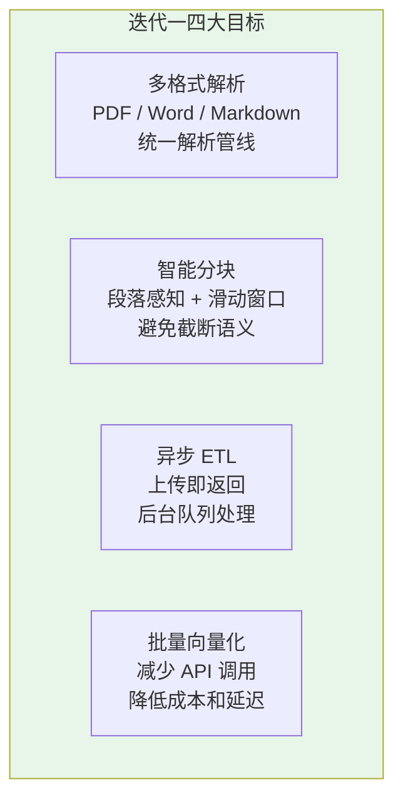
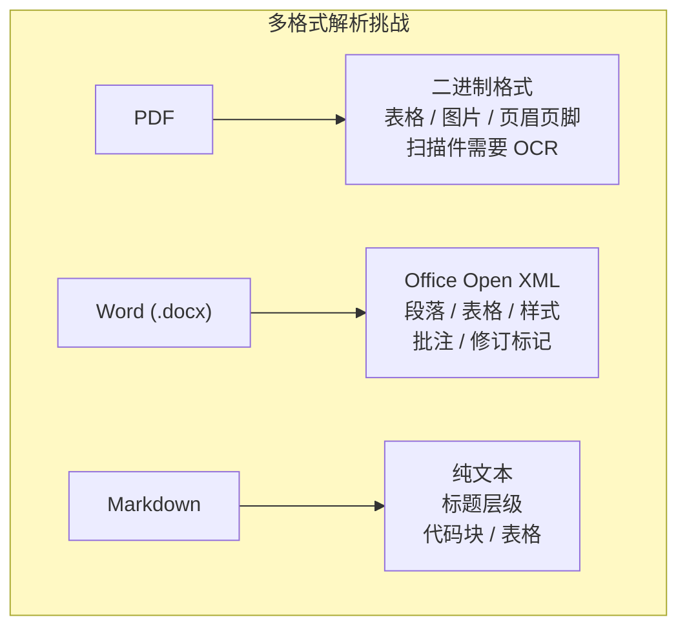
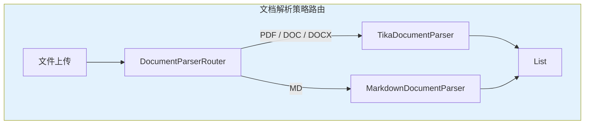
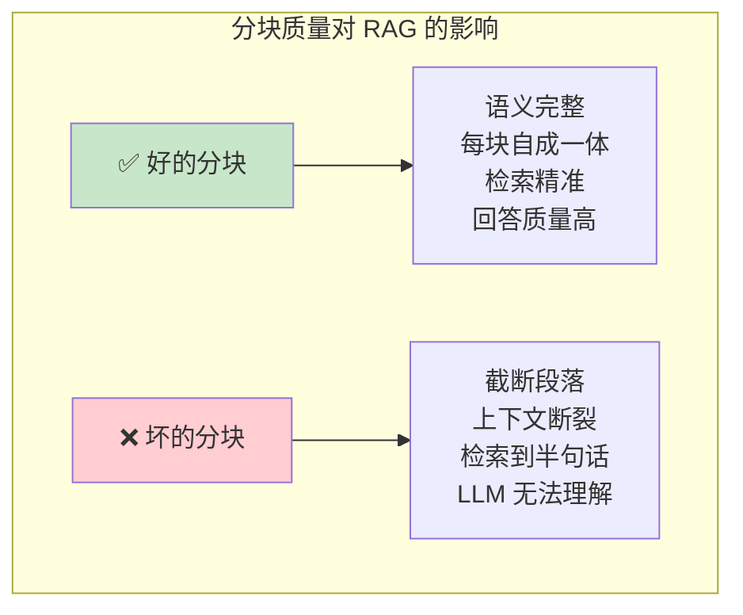
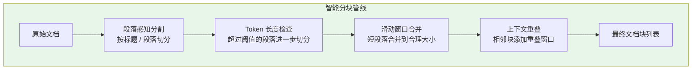
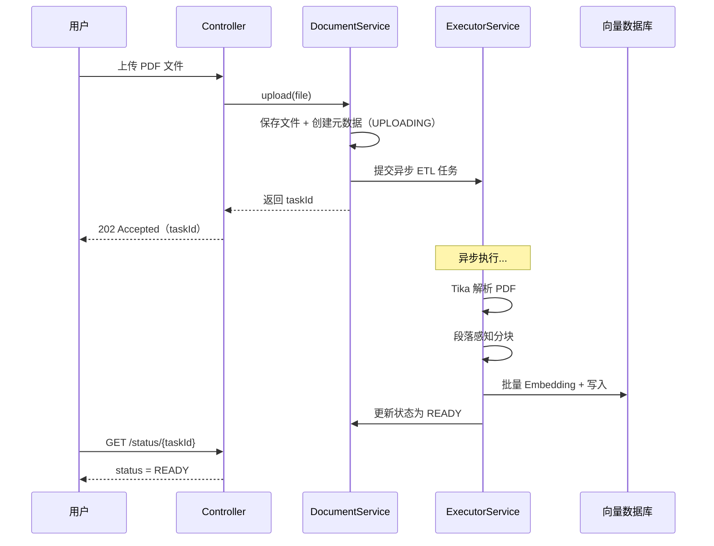
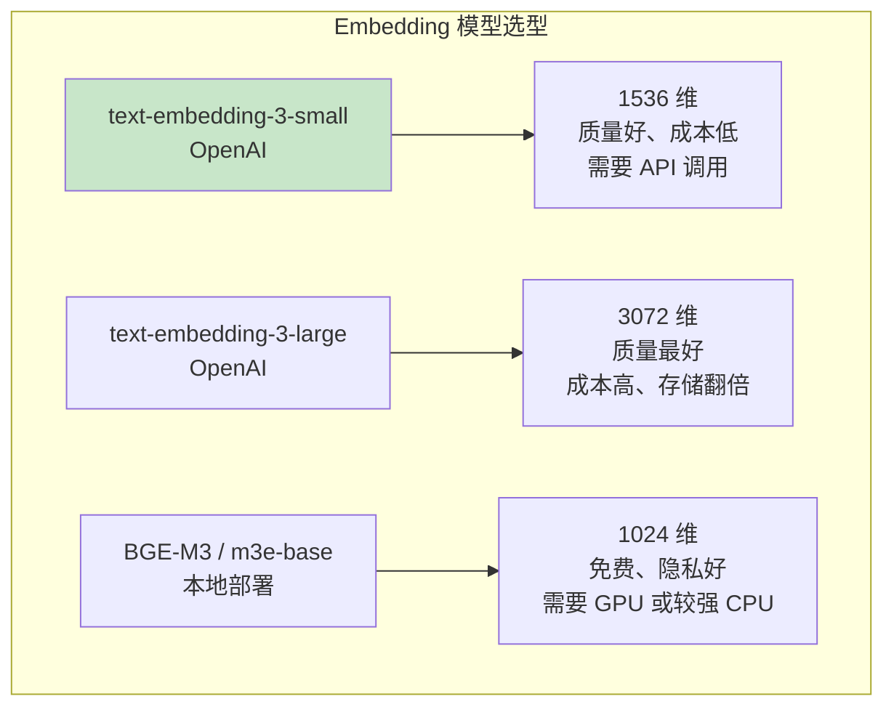
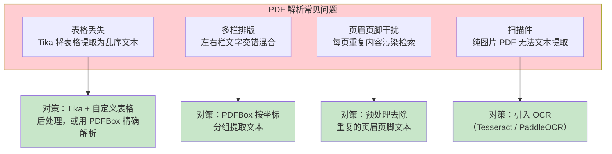
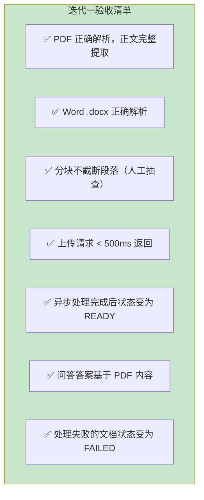

# 02-迭代一-文档解析与向量化

> **定位**：迭代一——将最小 Demo 升级为真正能处理企业级文档的系统：引入 Apache Tika 多格式解析（PDF/Word/Markdown）、设计智能分块策略（段落感知 + 滑动窗口）、实现异步 ETL Pipeline（不阻塞上传请求）、批量 Embedding 优化。本文给出**完整可手写代码**。读完这篇，系统能处理 3000+ PDF 和 2000+ Word 文档。
>
> **读者画像**：已完成最小 Demo，需要让系统支持多种文档格式并优化分块质量的开发者。
>
> **前置阅读**：[01-最小 Demo 搭建](01-最小Demo搭建.md)、[教程 06-向量数据库选型](../../教程/06-向量数据库选型.md)。API 真实性以 [附录 05-SpringAI2-API基准](../../附录/05-SpringAI2-API基准/00-Advisor与ChatMemory.md) 为准。

---

## 1. 四问

| 问 | 答 |
|----|----|
| **新增了什么需求** | 多格式解析（PDF/Word/Markdown）、段落感知分块、异步 ETL（上传即返回）、批量 Embedding |
| **影响了哪些模块** | `DocumentService`（同步改异步）、新增 `EtlService`/`DocumentParserRouter`/`ParagraphAwareSplitter`/`AsyncConfig`；pom 追加 Tika |
| **架构如何演进** | 单线程同步 ETL → 专用线程池异步管线：Controller → DocumentService（仅落库）→ EtlService（@Async 后台执行解析→分块→批量向量化） |
| **上一版痛点是什么** | ① 只支持 Markdown ② 固定 Token 分块截断段落 ③ 同步上传阻塞请求线程 ④ 逐条 Embedding 网络开销大 |

## 2. 迭代目标

### 2.1 从 Demo 到可用系统

最小 Demo 只支持 Markdown 且同步处理，无法应对企业真实文档场景。迭代一要解决四个核心问题：



### 2.2 量化验收标准

| # | 能力 | 验收标准 |
|---|------|---------|
| 1 | PDF 解析 | 正确提取正文文本，表格转为结构化文本 |
| 2 | Word 解析 | 支持 .doc / .docx，保留段落结构 |
| 3 | 分块质量 | 单块语义完整，不截断段落中间（人工抽查） |
| 4 | 异步处理 | 上传请求 < 500ms 返回，处理后台进行 |
| 5 | 批量 Embedding | 单文档处理时间较逐条调用减少 40%+ |
| 6 | 失败兜底 | 解析失败文档状态置 FAILED，不影响其他文档 |

---

## 3. pom.xml 追加依赖

在 [01-最小 Demo](01-最小Demo搭建.md) 的 pom.xml 基础上追加 Tika 文档解析依赖：

```xml
        <!-- 追加（迭代一）：Apache Tika 多格式文档解析（PDF/Word/HTML/RTF） -->
        <dependency>
            <groupId>org.springframework.ai</groupId>
            <artifactId>spring-ai-tika-document-reader</artifactId>
        </dependency>
```

> 需在 pom.xml 中添加依赖。坐标由 `spring-ai-bom` 2.0.0 统一锁定，无需写版本号。

---

## 4. 多格式文档解析

### 4.1 为什么需要 Apache Tika

最小 Demo 用 `new String(bytes, UTF_8)` 读 Markdown 文件，这对纯文本没问题，但 PDF 和 Word 是二进制格式：



Apache Tika 是 Apache 基金会的内容分析工具包，支持超过 1000 种文件格式的统一解析。Spring AI 提供了 `TikaDocumentReader` 封装，一行代码即可将 PDF/Word/HTML 等格式转为统一的 `Document` 对象。

### 4.2 文档读取器抽象

为不同格式设计读取策略，但统一输出 `Document` 列表：

```java
package com.example.docassistant.service.parser;

import org.springframework.ai.document.Document;
import org.springframework.core.io.Resource;

import java.util.List;

/**
 * 文档读取策略接口——不同格式有不同的实现
 */
public interface DocumentParser {

    /**
     * 判断是否支持该文件格式
     */
    boolean supports(String filename);

    /**
     * 解析文档，返回 Spring AI Document 列表
     */
    List<Document> parse(Resource resource, String documentId);
}
```

```java
package com.example.docassistant.service.parser;

import org.springframework.ai.document.Document;
import org.springframework.ai.reader.tika.TikaDocumentReader;
import org.springframework.core.io.Resource;

import java.util.List;

/**
 * Tika 通用解析器——处理 PDF / Word / HTML / RTF 等所有 Tika 支持的格式
 */
public class TikaDocumentParser implements DocumentParser {

    @Override
    public boolean supports(String filename) {
        String lower = filename.toLowerCase();
        return lower.endsWith(".pdf")
                || lower.endsWith(".doc")
                || lower.endsWith(".docx")
                || lower.endsWith(".html")
                || lower.endsWith(".rtf");
    }

    @Override
    public List<Document> parse(Resource resource, String documentId) {
        // TikaDocumentReader 会自动检测格式并解析
        TikaDocumentReader reader = new TikaDocumentReader(resource);

        List<Document> documents = reader.get();

        // 为每个解析出的 Document 附加元数据
        return documents.stream()
                .map(doc -> {
                    doc.getMetadata().put("documentId", documentId);
                    doc.getMetadata().put("parser", "tika");
                    return doc;
                })
                .toList();
    }
}
```

```java
package com.example.docassistant.service.parser;

import org.springframework.ai.document.Document;
import org.springframework.core.io.Resource;

import java.io.IOException;
import java.nio.charset.StandardCharsets;
import java.util.List;
import java.util.Map;

/**
 * Markdown 专用解析器——保留标题层级作为元数据
 */
public class MarkdownDocumentParser implements DocumentParser {

    @Override
    public boolean supports(String filename) {
        return filename.toLowerCase().endsWith(".md");
    }

    @Override
    public List<Document> parse(Resource resource, String documentId) {
        try {
            // Resource.getContentAsString(Charset) 是 Spring 6.1+ 的真实方法
            String content = resource.getContentAsString(StandardCharsets.UTF_8);

            // Markdown 作为整体文档返回，后续分块时利用标题结构
            Document doc = Document.builder()
                    .text(content)
                    .metadata(Map.of(
                            "documentId", documentId,
                            "parser", "markdown",
                            "format", "markdown"))
                    .build();
            return List.of(doc);
        } catch (IOException e) {
            throw new RuntimeException("Markdown 解析失败", e);
        }
    }
}
```

### 4.3 解析策略路由

```java
package com.example.docassistant.service.parser;

import org.springframework.ai.document.Document;
import org.springframework.core.io.Resource;
import org.springframework.stereotype.Component;

import java.util.List;

@Component
public class DocumentParserRouter {

    private final List<DocumentParser> parsers;

    // Spring 自动注入所有 DocumentParser 实现
    public DocumentParserRouter(List<DocumentParser> parsers) {
        this.parsers = parsers;
    }

    /**
     * 根据文件名自动路由到对应的解析器
     */
    public List<Document> parse(Resource resource, String filename, String documentId) {
        DocumentParser parser = parsers.stream()
                .filter(p -> p.supports(filename))
                .findFirst()
                .orElseThrow(() -> new IllegalArgumentException(
                        "不支持的文件格式: " + filename));

        return parser.parse(resource, documentId);
    }
}
```

**设计要点**：策略模式让新增文档格式只需实现 `DocumentParser` 接口并注册为 Spring Bean，`DocumentParserRouter` 自动发现并路由——零修改扩展。



> 注：原文案中的 `PlainTextParser` 分支本迭代不实现——Markdown 已覆盖纯文本场景，新增 .txt 支持只需再写一个 Parser 实现类。

---

## 5. 智能分块策略

### 5.1 为什么分块策略至关重要

分块是 RAG 系统中对回答质量影响最大的工程决策之一：



Demo 阶段使用的 `TokenTextSplitter` 按固定 Token 数切分，这在简单文本上还行，但有两个硬伤：

- **段落截断**：一个完整的审批流程描述被从中间截断，检索到的只是半句话。
- **语义稀释**：一个块里可能混了两个不相关主题的内容，导致检索时相似度被稀释。

### 5.2 分层分块策略

设计一个多层分块管线，依次处理不同层级的问题：



### 5.3 `ParagraphAwareSplitter.java`（段落感知分块器，完整代码）

```java
package com.example.docassistant.service;

import org.springframework.ai.document.Document;
import org.springframework.ai.transformer.splitter.TextSplitter;
import org.springframework.stereotype.Component;

import java.util.ArrayList;
import java.util.List;

/**
 * 段落感知分块器——先按段落/标题切，再按 Token 大小微调；超大段落按句子递归切分；相邻块保留重叠窗口。
 * 继承 Spring AI 的 TextSplitter，实现 splitText 抽象方法，即可被 ETL 管线以 apply(List) 调用。
 */
@Component
public class ParagraphAwareSplitter extends TextSplitter {

    private static final int TARGET_TOKENS = 400;    // 目标 Token 数
    private static final int MAX_TOKENS = 600;        // 单块最大 Token 数
    private static final int MIN_TOKENS = 50;         // 单块最小 Token 数
    private static final int OVERLAP_TOKENS = 50;     // 重叠窗口

    @Override
    protected List<String> splitText(String text) {
        // 1. 按段落分割（双换行、标题行作为边界）
        List<String> paragraphs = splitByParagraphs(text);

        // 2. 对每个段落做长度检查
        List<String> chunks = new ArrayList<>();
        StringBuilder currentChunk = new StringBuilder();
        int currentTokens = 0;

        for (String paragraph : paragraphs) {
            int paraTokens = estimateTokens(paragraph);

            // 超大段落：独立切分
            if (paraTokens > MAX_TOKENS) {
                if (currentTokens >= MIN_TOKENS) {
                    chunks.add(currentChunk.toString());
                    currentChunk = new StringBuilder();
                    currentTokens = 0;
                }
                chunks.addAll(splitLargeParagraph(paragraph, TARGET_TOKENS, OVERLAP_TOKENS));
            }
            // 段落加入当前块后超限：先保存当前块，再开始新块
            else if (currentTokens + paraTokens > MAX_TOKENS) {
                if (currentTokens >= MIN_TOKENS) {
                    chunks.add(currentChunk.toString());
                }
                // 重叠窗口：从上一个块末尾取一部分作为新块的开头
                String overlap = extractOverlap(currentChunk.toString(), OVERLAP_TOKENS);
                currentChunk = new StringBuilder(overlap);
                currentChunk.append(paragraph);
                currentTokens = estimateTokens(overlap) + paraTokens;
            }
            // 正常累积
            else {
                if (currentChunk.length() > 0) {
                    currentChunk.append("\n\n");
                }
                currentChunk.append(paragraph);
                currentTokens += paraTokens;
            }
        }

        // 别忘了最后一个块
        if (currentTokens >= MIN_TOKENS) {
            chunks.add(currentChunk.toString());
        }

        return chunks;
    }

    /**
     * 按段落边界分割文本
     */
    private List<String> splitByParagraphs(String text) {
        List<String> paragraphs = new ArrayList<>();

        // 先按标题行（# 开头）和空行分割
        String[] roughParas = text.split("(?=\n#{1,6}\\s)|\n\n+");

        for (String para : roughParas) {
            String trimmed = para.trim();
            if (!trimmed.isEmpty()) {
                paragraphs.add(trimmed);
            }
        }
        return paragraphs;
    }

    /**
     * 对超大段落按句子边界递归切分
     */
    private List<String> splitLargeParagraph(String text, int targetTokens, int overlap) {
        List<String> chunks = new ArrayList<>();
        // 按中文句号 / 英文句号 / 问号 / 感叹号分割
        String[] sentences = text.split("(?<=[。.!?！？])\\s*");

        StringBuilder chunk = new StringBuilder();
        int chunkTokens = 0;

        for (String sentence : sentences) {
            int sentenceTokens = estimateTokens(sentence);

            if (chunkTokens + sentenceTokens > targetTokens && chunkTokens > 0) {
                chunks.add(chunk.toString());
                // 重叠：取上一个 chunk 最后几句
                chunk = new StringBuilder(extractOverlap(chunk.toString(), overlap));
                chunkTokens = estimateTokens(chunk.toString());
            }

            chunk.append(sentence);
            chunkTokens += sentenceTokens;
        }

        if (chunkTokens > 0) {
            chunks.add(chunk.toString());
        }

        return chunks;
    }

    /**
     * 从文本末尾提取约 overlapTokens 大小的重叠段
     */
    private String extractOverlap(String text, int overlapTokens) {
        String[] words = text.split("\\s+");
        int startIdx = Math.max(0, words.length - overlapTokens);
        return String.join(" ", java.util.Arrays.copyOfRange(words, startIdx, words.length));
    }

    /**
     * 粗略估算 Token 数——英文约 1 word ≈ 1.3 token，中文约 1 char ≈ 1.5 token
     */
    private int estimateTokens(String text) {
        int chineseChars = 0;
        int nonChineseWords = 0;

        for (char c : text.toCharArray()) {
            if (Character.UnicodeScript.of(c) == Character.UnicodeScript.HAN) {
                chineseChars++;
            }
        }
        String nonChinese = text.replaceAll("[\\u4E00-\\u9FFF]", " ").trim();
        if (!nonChinese.isEmpty()) {
            nonChineseWords = nonChinese.split("\\s+").length;
        }

        return (int) (chineseChars * 1.5 + nonChineseWords * 1.3);
    }
}
```

**分块策略设计要点**：

1. **段落感知**：以段落和标题作为主要分割边界，避免从段落中间截断。企业文档（规章制度、技术规范）通常以段落为语义单元，保持段落完整性是分块的第一优先级。

2. **滑动窗口重叠**：相邻块之间保留 50 Token 左右的重叠。如果关键信息恰好在分块边界（如"审批流程"的最后一句和"报销标准"的第一句），重叠窗口能确保至少有一个块包含完整上下文。

3. **超大段落处理**：某些文档可能有一个超长的段落（如一整个章节没有分段），这种情况按句子边界做二次切分。

4. **中英文混合 Token 估算**：中国企业文档通常是中英文混合，简单的 `text.length() / 4` 估算对中文偏差很大。按中文 1 字符 ≈ 1.5 Token、英文 1 单词 ≈ 1.3 Token 估算更准确。

> **Spring AI 分块器深入** → [教程 06-向量数据库选型](../../教程/06-向量数据库选型.md)：教程中讨论了向量维度、分块大小对检索性能的影响——分块越大，存储和检索的粒度越粗；分块越小，精度越高但上下文可能不足。400-600 Token 是企业文档问答的常见甜区。

---

## 6. 异步 ETL Pipeline

### 6.1 从同步到异步

Demo 阶段的上传是同步的——用户上传文件后一直等到处理完成才收到响应。对于 PDF 文档（解析 + 分块 + 批量 Embedding 可能需要 20-30 秒），同步等待体验极差。



### 6.2 异步线程池配置 `AsyncConfig.java`

```java
package com.example.docassistant.config;

import org.springframework.context.annotation.Bean;
import org.springframework.context.annotation.Configuration;
import org.springframework.scheduling.annotation.EnableAsync;
import org.springframework.scheduling.concurrent.ThreadPoolTaskExecutor;

import java.util.concurrent.Executor;
import java.util.concurrent.ThreadPoolExecutor;

@Configuration
@EnableAsync
public class AsyncConfig {

    /**
     * ETL 专用线程池
     * 核心线程数 2：避免并发 Embedding 调用过多冲击 API 限流
     * 最大线程数 4：高峰期适度增加并发
     * 队列容量 50：大量文档导入时缓冲
     */
    @Bean("etlTaskExecutor")
    public Executor etlTaskExecutor() {
        ThreadPoolTaskExecutor executor = new ThreadPoolTaskExecutor();
        executor.setCorePoolSize(2);
        executor.setMaxPoolSize(4);
        executor.setQueueCapacity(50);
        executor.setThreadNamePrefix("etl-");
        executor.setRejectedExecutionHandler(new ThreadPoolExecutor.CallerRunsPolicy());
        executor.initialize();
        return executor;
    }
}
```

**线程池参数设计考量**：

- **核心线程数 = 2**：Embedding API 有并发限制（通常 5-10 并发），ETL 是后台任务不需要抢资源。低并发也便于批量请求的组装。
- **队列容量 = 50**：在大量文档导入场景（如初始知识库建设）下缓冲请求。
- **CallerRunsPolicy**：队列满时让上传线程自己执行 ETL——相当于降级为同步，而不是拒绝任务或抛异常。

### 6.3 ETL 编排服务 `EtlService.java`

```java
package com.example.docassistant.service;

import com.example.docassistant.exception.DocumentException;
import com.example.docassistant.model.DocumentEntity;
import com.example.docassistant.model.enums.DocumentStatus;
import com.example.docassistant.repository.DocumentRepository;
import com.example.docassistant.service.parser.DocumentParserRouter;
import org.springframework.ai.document.Document;
import org.springframework.ai.transformer.splitter.TextSplitter;
import org.springframework.ai.vectorstore.VectorStore;
import org.springframework.core.io.FileSystemResource;
import org.springframework.scheduling.annotation.Async;
import org.springframework.stereotype.Service;

import java.nio.file.Path;
import java.time.LocalDateTime;
import java.util.List;
import java.util.UUID;

@Service
public class EtlService {

    private final DocumentParserRouter parserRouter;
    private final TextSplitter textSplitter;
    private final VectorStore vectorStore;
    private final DocumentRepository documentRepository;

    public EtlService(DocumentParserRouter parserRouter,
                      ParagraphAwareSplitter textSplitter,
                      VectorStore vectorStore,
                      DocumentRepository documentRepository) {
        this.parserRouter = parserRouter;
        this.textSplitter = textSplitter;
        this.vectorStore = vectorStore;
        this.documentRepository = documentRepository;
    }

    /**
     * 异步执行 ETL Pipeline
     * @Async 注解让此方法在独立线程池中执行，不阻塞调用方
     */
    @Async("etlTaskExecutor")
    public void processAsync(UUID documentId, Path filePath, String originalFilename) {
        DocumentEntity doc = documentRepository.findById(documentId)
                .orElseThrow(() -> new DocumentException("文档不存在: " + documentId));

        try {
            doc.setStatus(DocumentStatus.PROCESSING);
            documentRepository.save(doc);

            // Step 1: 解析文档（DocumentParserRouter 自动路由格式）
            List<Document> rawDocuments = parserRouter.parse(
                    new FileSystemResource(filePath),
                    originalFilename,
                    documentId.toString());

            // Step 2: 智能分块
            List<Document> chunks = textSplitter.apply(rawDocuments);

            // Step 3: 为每个块附加元数据
            chunks.forEach(chunk -> {
                chunk.getMetadata().put("documentId", documentId.toString());
                chunk.getMetadata().put("title", doc.getTitle());
            });

            // Step 4: 批量向量化 + 写入 PgVector
            batchEmbedAndStore(chunks);

            // Step 5: 更新状态
            doc.setStatus(DocumentStatus.READY);
            doc.setChunkCount(chunks.size());
            doc.setProcessedAt(LocalDateTime.now());
            documentRepository.save(doc);

        } catch (Exception e) {
            doc.setStatus(DocumentStatus.FAILED);
            doc.setErrorMessage(e.getMessage());
            documentRepository.save(doc);
        }
    }

    /**
     * 分批 Embedding + 存储，避免一次性处理过多数据
     */
    private void batchEmbedAndStore(List<Document> chunks) {
        int batchSize = 20; // 每批 20 个块
        for (int i = 0; i < chunks.size(); i += batchSize) {
            int end = Math.min(i + batchSize, chunks.size());
            List<Document> batch = chunks.subList(i, end);
            vectorStore.add(batch);
        }
    }
}
```

### 6.4 更新后的 `DocumentService.java`（异步版）

```java
package com.example.docassistant.service;

import com.example.docassistant.exception.DocumentException;
import com.example.docassistant.model.DocumentEntity;
import com.example.docassistant.model.enums.DocumentStatus;
import com.example.docassistant.repository.DocumentRepository;
import org.springframework.core.io.buffer.DataBufferUtils;
import org.springframework.http.codec.multipart.FilePart;
import org.springframework.stereotype.Service;
import reactor.core.publisher.Mono;
import reactor.core.scheduler.Schedulers;

import java.io.IOException;
import java.nio.file.Files;
import java.nio.file.Path;
import java.time.LocalDateTime;
import java.util.UUID;

@Service
public class DocumentService {

    private final EtlService etlService;
    private final DocumentRepository documentRepository;

    public DocumentService(EtlService etlService, DocumentRepository documentRepository) {
        this.etlService = etlService;
        this.documentRepository = documentRepository;
    }

    /**
     * 响应式上传：保存文件 + 创建元数据后立即返回，ETL 交给后台线程池
     */
    public Mono<DocumentEntity> upload(FilePart filePart) {
        return DataBufferUtils.join(filePart.content())
                .map(dataBuffer -> {
                    byte[] bytes = new byte[dataBuffer.readableByteCount()];
                    dataBuffer.read(bytes, 0, bytes.length);
                    DataBufferUtils.release(dataBuffer);
                    return bytes;
                })
                .subscribeOn(Schedulers.boundedElastic())
                .map(bytes -> {
                    // 1. 创建元数据（状态 = UPLOADING）
                    DocumentEntity doc = new DocumentEntity();
                    doc.setTitle(filePart.filename());
                    doc.setFormat(detectFormat(filePart.filename()));
                    doc.setStatus(DocumentStatus.UPLOADING);
                    doc.setUploadedAt(LocalDateTime.now());
                    doc = documentRepository.save(doc);

                    try {
                        // 2. 保存原始文件
                        Path filePath = saveFile(filePart.filename(), bytes, doc.getId());
                        doc.setFilePath(filePath.toString());
                        documentRepository.save(doc);
                    } catch (IOException e) {
                        doc.setStatus(DocumentStatus.FAILED);
                        documentRepository.save(doc);
                        throw new DocumentException("文件保存失败: " + e.getMessage(), e);
                    }

                    // 3. 提交异步 ETL 任务（立即返回，不等待处理完成）
                    etlService.processAsync(doc.getId(), filePath, filePart.filename());

                    return doc;
                });
    }

    public DocumentEntity getById(UUID id) {
        return documentRepository.findById(id)
                .orElseThrow(() -> new DocumentException("文档不存在: " + id));
    }

    private String detectFormat(String filename) {
        if (filename.endsWith(".md")) return "MARKDOWN";
        if (filename.endsWith(".pdf")) return "PDF";
        if (filename.endsWith(".doc") || filename.endsWith(".docx")) return "WORD";
        return "UNKNOWN";
    }

    private Path saveFile(String filename, byte[] bytes, UUID docId) throws IOException {
        Path dir = Path.of("data", "uploads");
        Files.createDirectories(dir);
        Path target = dir.resolve(docId + "_" + filename);
        Files.write(target, bytes);
        return target;
    }
}
```

**设计要点**：上传接口返回后前端立刻收到 `status=UPLOADING`，之后轮询 `GET /api/documents/{id}/status` 直到 `READY`。ETL 全部在 `etl-` 前缀线程池执行，与请求线程完全解耦。

---

## 7. Embedding 模型与向量化优化

### 7.1 Embedding 模型选择



本项目选择 `text-embedding-3-small`（1536 维），理由：

- 维度适中（1536），PgVector 存储 50 万条约占 3GB 磁盘空间，完全可控。
- 中文和英文的语义表示质量都不错，适合企业多语言文档。
- 成本低：每百万 Token 约 $0.02，处理一篇 10000 Token 的文档只需 $0.0002。

### 7.2 批量向量化

`EtlService` 中的 `batchEmbedAndStore` 方法已经实现了批量处理。`VectorStore.add(List<Document>)` 内部会一次调用 Embedding Model 批量编码，再批量写入数据库。

批量调用的核心优势：

| 方式 | API 调用次数 | 网络开销 | 适用场景 |
|------|------------|---------|---------|
| 逐条 Embedding | N 次 | N 次 RTT | 实时查询（单条） |
| 批量 Embedding | N / batchSize 次 | 大幅降低 | ETL 离线导入 |

一篇 30 页的 PDF（约 15000 字）分块后约 20 个 chunk，批量调用只需 1 次 Embedding API 请求（batchSize=20），而不是 20 次。

---

## 8. PDF 解析的实战问题

### 8.1 常见解析问题与对策

PDF 是企业文档中最常见的格式，也是解析难度最大的格式。实际项目中会遇到以下问题：



### 8.2 页眉页脚过滤 `HeaderFooterFilter.java`

```java
package com.example.docassistant.service.processor;

import org.springframework.ai.document.Document;
import org.springframework.stereotype.Component;

import java.util.HashMap;
import java.util.List;
import java.util.Map;
import java.util.stream.Collectors;

/**
 * 后处理器：过滤 PDF 重复的页眉页脚
 */
@Component
public class HeaderFooterFilter {

    /**
     * 检测并移除在多个页面中重复出现的页眉页脚文本
     */
    public List<Document> filter(List<Document> documents) {
        // 统计每行文本在所有文档中出现的频率
        Map<String, Long> lineFrequency = documents.stream()
                .flatMap(doc -> doc.getText().lines())
                .collect(Collectors.groupingBy(
                        line -> line.trim(),
                        Collectors.counting()));

        // 出现在超过 30% 文档中的行视为页眉页脚
        int threshold = Math.max(3, documents.size() * 3 / 10);

        return documents.stream()
                .map(doc -> {
                    String filteredContent = doc.getText().lines()
                            .filter(line -> {
                                long freq = lineFrequency.getOrDefault(line.trim(), 0L);
                                return freq < threshold || line.trim().length() > 100;
                            })
                            .collect(Collectors.joining("\n"));

                    Map<String, Object> metadata = new HashMap<>(doc.getMetadata());
                    metadata.put("headerFooterFiltered", true);
                    return Document.builder()
                            .text(filteredContent)
                            .metadata(metadata)
                            .build();
                })
                .toList();
    }
}
```

**思路**：页眉页脚的特点是在多页中重复出现。通过统计文本行频率，高频短行大概率是页眉页脚，过滤掉即可。保留长度 > 100 的行（长段落不太可能是页眉页脚）。

---

## 9. 迭代一集成验证

### 9.1 端到端测试

```bash
# 上传 PDF 文档——立即返回
curl -X POST http://localhost:8080/api/documents/upload \
  -F "file=@technical-spec.pdf"
# 响应：{"documentId":"...", "status":"UPLOADING", ...}

# 轮询状态
curl http://localhost:8080/api/documents/{id}/status
# 处理中：{"status":"PROCESSING"}
# 完成：{"status":"READY", "chunkCount": 35}
# 失败：{"status":"FAILED"}

# 提问
curl -X POST http://localhost:8080/api/qa \
  -H "Content-Type: application/json" \
  -d '{"question": "系统的并发上限是多少？"}'
```

### 9.2 验收对照



---

## 10. ADR 演进决策

### ADR 001-04：多格式解析用策略模式（DocumentParser 接口 + Router），不用 if-else 路由
- **决策**：解析逻辑收敛到 `DocumentParser` 接口，`DocumentParserRouter` 通过 `List<DocumentParser>` 自动注入实现，新增格式零修改
- **取舍理由**：企业文档格式只会越来越多，if-else 每加一种格式就要改路由核心代码；策略模式让"格式"成为可插拔的扩展点，符合开闭原则

### ADR 001-05：分块用自研 ParagraphAwareSplitter，不用 TokenTextSplitter 的 overlap 配置
- **决策**：`TokenTextSplitter` 的 overlap 支持版本间不稳定（[附录 12] 口径），重叠窗口在自研分块器中手工实现
- **取舍理由**：段落感知 + 滑动窗口重叠是中文企业文档分块质量的关键；自研实现完全可控，且作为 `TextSplitter` 子类接入 Spring AI 管线零成本

### ADR 001-06：异步处理用 @Async 专用线程池，不用消息队列
- **决策**：`@Async("etlTaskExecutor")` + `ThreadPoolTaskExecutor`（核心 2 / 最大 4 / 队列 50 / CallerRunsPolicy）
- **取舍理由**：本迭代文档量级（万级）线程池足够；引入 RabbitMQ/Kafka 属于过度设计。CallerRunsPolicy 提供天然背压（队列满时降级同步）。当需要削峰填谷、故障恢复、跨进程消费时再演进到 MQ（[04-核心代码讲解](04-核心代码讲解.md) §8.2 优化方向）

---

## 11. 总结

迭代一将最小 Demo 升级为真正能处理企业级文档的系统，完成了以下核心工作：

1. **多格式解析**：基于 Apache Tika 的 `TikaDocumentReader` 统一处理 PDF/Word/HTML，通过策略模式路由不同格式。`DocumentParserRouter` 让新增格式只需添加一个解析器实现。

2. **智能分块**：`ParagraphAwareSplitter` 实现段落感知分块——先按段落/标题边界分割，超大段落按句子递归切分，相邻块保留滑动窗口重叠。比 Demo 的固定 Token 分块在语义完整性上有质的提升。

3. **异步 ETL Pipeline**：`@Async` + 专用线程池让文档处理在后台执行，上传请求 < 500ms 返回。文档状态机（UPLOADING → PROCESSING → READY）让前端可以轮询处理进度。

4. **批量 Embedding 优化**：分批调用 `VectorStore.add()`，一次 API 调用处理 20 个文档块，大幅降低网络开销和 API 成本。

当前系统的检索策略仍然是纯向量检索，对专有名词和精确匹配的场景召回率不够。下一篇 [03-迭代二-多源检索与重排](03-迭代二-多源检索与重排.md) 将引入混合检索（向量 + 关键词）和 Reranker 重排，把检索质量提升到企业可用水平。
